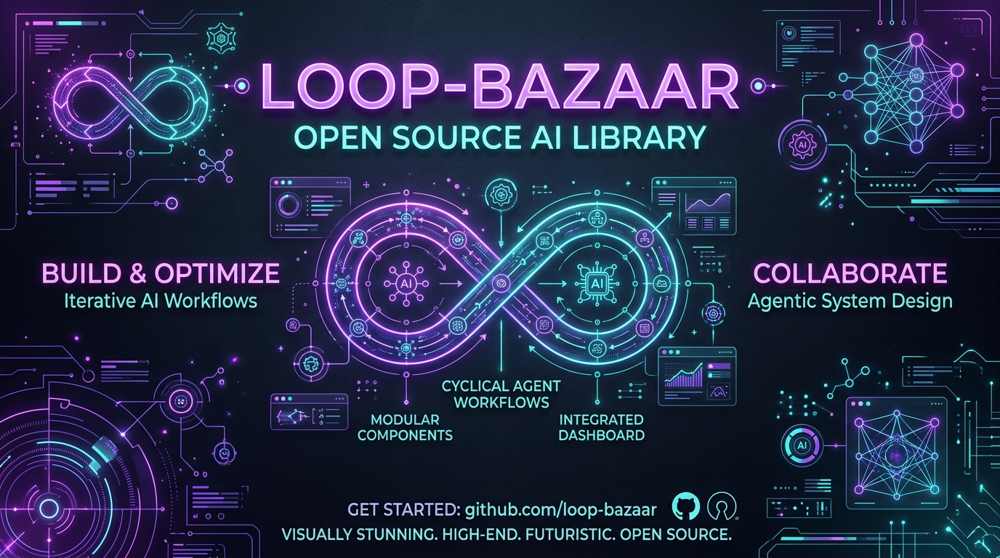

# 🌟 Loop-Bazaar: The Curated AI Agent Loops Directory

Welcome to **Loop-Bazaar**! A premium, comprehensive bazaar of **5064** repeatable AI agent workflows, design patterns, and instructions with specific verification checkpoints and community ratings. All loops are organized into category folders with individual details pages.

*Last updated: 2026-06-22 | Version: 1.0.0 | Daily updates at 6:00 AM IST*

## 🔌 Supported Platforms & Agentic Rigs
The workflows and prompts in Loop-Bazaar are designed to be environment-agnostic and can be implemented in a wide range of platforms:
- 🤖 **Claude Code (Developer Preview)**: Execute iterative code sweeps, PR testing, and test suites directly using the CLI plugin models (`clodex`, `autonomy-loop`).
- 🦅 **Google Antigravity (AGY)**: Pair program, write/verify tests, and trigger daily cron updates automatically using the AGY Agent and SDK.
- 🛠️ **Aider / Cursor / Windsurf**: Run interactive file edit-and-run loops, passing compiler errors back to the model until verify stages clear.
- 🕸️ **LangGraph (LangChain)**: Orchestrate stateful multi-agent systems with explicit conditional edges mapping to loop stopping conditions.
- 👥 **CrewAI / Microsoft AutoGen**: Define worker agents (e.g. Researcher, Reviewer) and set collaborative loops where output passes between work folders.
- 🚀 **GitHub Actions / CI Pipelines**: Run reliability sweeps (like the docs sweep or production log checks) on a scheduled runner or commit hook.

## 🤝 How to Add New Loops on GitHub First
We welcome community additions! You can contribute in two ways:

### Option A: Create a GitHub Issue (No coding required)
1. Go to the **Issues** tab on our [GitHub Repository](https://github.com/Drvivek34/Loop-Bazaar).
2. Click **New Issue** and choose the **Loop Submission Template** (or create a general issue with label `submission`).
3. Fill in the details (Title, Category, Prompt, Steps, and Verification stopping condition).
4. Click submit. Our daily automation script running at 6:00 AM will automatically parse the issue, format it, add it to the directory, and compile the updated markdown files!

### Option B: Create a Pull Request (PR)
1. Fork this repository.
2. Open the database file [loops_data.json](loops_data.json) and add your new loop object to the `loops` array. Ensure you increment the number index.
3. Commit and open a Pull Request. Our daily cron job will checkout your branch, run the test suite [test_library.py](test_library.py) to check schema validity, and automatically merge the PR if it passes!

## 📚 Directory Index (Master Loops Table)
Click on the titles to view complete details (Prompts, Steps, and Why it works) inside their respective category files.

| ID | Category | Title | Author | Rating | Notes / Use Cases |
|---|---|---|---|---|---|
| #0052 | Design | [The Flask Database Queries Triages Loop](design/flask-database-queries-triages-0052.md) | @lucas_k | ★★★★★ 5.0 | A repeatable agent workflow that triages database queries in Flask and stops when no duplicate imports remain. |
| #0066 | Evaluation | [The Spring Boot Database Queries Cleans up Loop](evaluation/springboot-database-queries-cleansup-0066.md) | @swayam | ★★★★★ 5.0 | A repeatable agent workflow that cleans up database queries in Spring Boot and stops when API response time is under 100ms. |
| #0069 | Engineering | [The FastAPI Unused Imports Secures Loop](engineering/fastapi-unused-imports-secures-0069.md) | @dennis_r | ★★★★★ 5.0 | A repeatable agent workflow that secures unused imports in FastAPI and stops when documentation is fully aligned with implementation. |
| #0074 | Content | [The TailwindCSS Error Log Anomalies Sweeps Loop](content/tailwindcss-error-log-anomalies-sweeps-0074.md) | @ken_t | ★★★★★ 5.0 | A repeatable agent workflow that sweeps error log anomalies in TailwindCSS and stops when test coverage reaches 100%. |
| #0121 | Engineering | [The Vue Unit Test Coverage Debugs Loop](engineering/vue-unit-test-coverage-debugs-0121.md) | @richard_s | ★★★★★ 5.0 | A repeatable agent workflow that debugs unit test coverage in Vue and stops when error rate drops below 0.1%. |
| #0138 | Evaluation | [The Laravel Unit Test Coverage Verifies Loop](evaluation/laravel-unit-test-coverage-verifies-0138.md) | @bjarnes | ★★★★★ 5.0 | A repeatable agent workflow that verifies unit test coverage in Laravel and stops when API response time is under 100ms. |
| #0157 | Operations | [The AWS Lambda Bundle Sizes Sweeps Loop](operations/awslambda-bundle-sizes-sweeps-0157.md) | @claudio_d | ★★★★★ 5.0 | A repeatable agent workflow that sweeps bundle sizes in AWS Lambda and stops when stale state is fully cleared. |
| #0167 | Engineering | [The Kubernetes Database Queries Refactors Loop](engineering/kubernetes-database-queries-refactors-0167.md) | @victormustar | ★★★★★ 5.0 | A repeatable agent workflow that refactors database queries in Kubernetes and stops when all vulnerabilities are resolved. |
| #0210 | Design | [The Laravel Svg Assets Debugs Loop](design/laravel-svg-assets-debugs-0210.md) | @dennis_r | ★★★★★ 5.0 | A repeatable agent workflow that debugs SVG assets in Laravel and stops when performance benchmark is met. |
| #0219 | Operations | [The Flutter Unused Imports Refactors Loop](operations/flutter-unused-imports-refactors-0219.md) | @matthewberman | ★★★★★ 5.0 | A repeatable agent workflow that refactors unused imports in Flutter and stops when stale state is fully cleared. |
| #0230 | Design | [The Spring Boot Accessibility Tags Profiles Loop](design/springboot-accessibility-tags-profiles-0230.md) | @guido_vr | ★★★★★ 5.0 | A repeatable agent workflow that profiles accessibility tags in Spring Boot and stops when no regressions are detected. |
| #0252 | Evaluation | [The HuggingFace Server Response Times Validates Loop](evaluation/huggingface-server-response-times-validates-0252.md) | @tim_berners | ★★★★★ 5.0 | A repeatable agent workflow that validates server response times in HuggingFace and stops when test coverage reaches 100%. |
| #0257 | Evaluation | [The AWS Lambda Data Backup Logs Profiles Loop](evaluation/awslambda-data-backup-logs-profiles-0257.md) | @grace_hopper | ★★★★★ 5.0 | A repeatable agent workflow that profiles data backup logs in AWS Lambda and stops when performance benchmark is met. |
| #0267 | Content | [The Svelte Seo Keywords Validates Loop](content/svelte-seo-keywords-validates-0267.md) | @bjarnes | ★★★★★ 5.0 | A repeatable agent workflow that validates SEO keywords in Svelte and stops when performance benchmark is met. |
| #0273 | Operations | [The Flask Api Endpoints Profiles Loop](operations/flask-api-endpoints-profiles-0273.md) | @ken_t | ★★★★★ 5.0 | A repeatable agent workflow that profiles API endpoints in Flask and stops when test coverage reaches 100%. |
| #0283 | Engineering | [The Flask Security Groups Debugs Loop](engineering/flask-security-groups-debugs-0283.md) | @Dis_Trackted | ★★★★★ 5.0 | A repeatable agent workflow that debugs security groups in Flask and stops when documentation is fully aligned with implementation. |
| #0294 | Content | [The Terraform Database Queries Secures Loop](content/terraform-database-queries-secures-0294.md) | @inferencegod | ★★★★★ 5.0 | A repeatable agent workflow that secures database queries in Terraform and stops when target threshold is reached. |
| #0304 | Operations | [The Elasticsearch Ssl Certificates Audits Loop](operations/elasticsearch-ssl-certificates-audits-0304.md) | @steipete | ★★★★★ 5.0 | A repeatable agent workflow that audits SSL certificates in Elasticsearch and stops when all checks pass successfully. |
| #0353 | Operations | [The Terraform Server Response Times Verifies Loop](operations/terraform-server-response-times-verifies-0353.md) | @vivek34 | ★★★★★ 5.0 | A repeatable agent workflow that verifies server response times in Terraform and stops when API response time is under 100ms. |
| #0365 | Content | [The Express.js Ssl Certificates Debugs Loop](content/expressjs-ssl-certificates-debugs-0365.md) | @hiten | ★★★★★ 5.0 | A repeatable agent workflow that debugs SSL certificates in Express.js and stops when test coverage reaches 100%. |
| #0366 | Engineering | [The HuggingFace Database Queries Audits Loop](engineering/huggingface-database-queries-audits-0366.md) | @lucas_k | ★★★★★ 5.0 | A repeatable agent workflow that audits database queries in HuggingFace and stops when all checks pass successfully. |
| #0369 | Content | [The React Data Backup Logs Debugs Loop](content/react-data-backup-logs-debugs-0369.md) | @ranvier2d2 | ★★★★★ 5.0 | A repeatable agent workflow that debugs data backup logs in React and stops when test coverage reaches 100%. |
| #0402 | Evaluation | [The Django Unused Imports Sweeps Loop](evaluation/django-unused-imports-sweeps-0402.md) | @matthewberman | ★★★★★ 5.0 | A repeatable agent workflow that sweeps unused imports in Django and stops when all checks pass successfully. |
| #0406 | Operations | [The Kubernetes Docker Images Sweeps Loop](operations/kubernetes-docker-images-sweeps-0406.md) | @richard_s | ★★★★★ 5.0 | A repeatable agent workflow that sweeps Docker images in Kubernetes and stops when error rate drops below 0.1%. |
| #0412 | Design | [The Vercel Docker Images Validates Loop](design/vercel-docker-images-validates-0412.md) | @steipete | ★★★★★ 5.0 | A repeatable agent workflow that validates Docker images in Vercel and stops when error rate drops below 0.1%. |
| #0460 | Design | [The FastAPI Ssl Certificates Optimizes Loop](design/fastapi-ssl-certificates-optimizes-0460.md) | @tim_berners | ★★★★★ 5.0 | A repeatable agent workflow that optimizes SSL certificates in FastAPI and stops when all checks pass successfully. |
| #0462 | Content | [The FastAPI Security Groups Audits Loop](content/fastapi-security-groups-audits-0462.md) | @linus_t | ★★★★★ 5.0 | A repeatable agent workflow that audits security groups in FastAPI and stops when compliance report returns zero warnings. |
| #0464 | Operations | [The Terraform Api Rate Limits Validates Loop](operations/terraform-api-rate-limits-validates-0464.md) | @marcus_a | ★★★★★ 5.0 | A repeatable agent workflow that validates API rate limits in Terraform and stops when documentation is fully aligned with implementation. |
| #0491 | Engineering | [The GitHub Actions Json Schema Validation Sweeps Loop](engineering/githubactions-json-schema-validation-sweeps-0491.md) | @elena_r | ★★★★★ 5.0 | A repeatable agent workflow that sweeps JSON schema validation in GitHub Actions and stops when compliance report returns zero warnings. |
| #0495 | Operations | [The AWS Lambda Seo Keywords Triages Loop](operations/awslambda-seo-keywords-triages-0495.md) | @marcus_a | ★★★★★ 5.0 | A repeatable agent workflow that triages SEO keywords in AWS Lambda and stops when target threshold is reached. |
| #0496 | Evaluation | [The React Security Groups Audits Loop](evaluation/react-security-groups-audits-0496.md) | @victormustar | ★★★★★ 5.0 | A repeatable agent workflow that audits security groups in React and stops when error rate drops below 0.1%. |
| #0562 | Design | [The Next.js Git Hooks Configuration Profiles Loop](design/nextjs-git-hooks-configuration-profiles-0562.md) | @guido_vr | ★★★★★ 5.0 | A repeatable agent workflow that profiles Git hooks configuration in Next.js and stops when test coverage reaches 100%. |
| #0577 | Design | [The Elasticsearch Data Backup Logs Refactors Loop](design/elasticsearch-data-backup-logs-refactors-0577.md) | @guido_vr | ★★★★★ 5.0 | A repeatable agent workflow that refactors data backup logs in Elasticsearch and stops when compliance report returns zero warnings. |
| #0650 | Content | [The Spring Boot Data Backup Logs Validates Loop](content/springboot-data-backup-logs-validates-0650.md) | @ada_lovelace | ★★★★★ 5.0 | A repeatable agent workflow that validates data backup logs in Spring Boot and stops when test coverage reaches 100%. |
| #0653 | Evaluation | [The Elasticsearch Svg Assets Secures Loop](evaluation/elasticsearch-svg-assets-secures-0653.md) | @lucas_k | ★★★★★ 5.0 | A repeatable agent workflow that secures SVG assets in Elasticsearch and stops when documentation is fully aligned with implementation. |
| #0662 | Design | [The MongoDB Ssl Certificates Profiles Loop](design/mongodb-ssl-certificates-profiles-0662.md) | @linus_t | ★★★★★ 5.0 | A repeatable agent workflow that profiles SSL certificates in MongoDB and stops when all checks pass successfully. |
| #0668 | Evaluation | [The PyTorch Json Schema Validation Triages Loop](evaluation/pytorch-json-schema-validation-triages-0668.md) | @tim_berners | ★★★★★ 5.0 | A repeatable agent workflow that triages JSON schema validation in PyTorch and stops when target threshold is reached. |
| #0670 | Evaluation | [The Ruby on Rails Access Control Lists Cleans up Loop](evaluation/rubyonrails-access-control-lists-cleansup-0670.md) | @claudio_d | ★★★★★ 5.0 | A repeatable agent workflow that cleans up access control lists in Ruby on Rails and stops when API response time is under 100ms. |
| #0678 | Engineering | [The Vue Dependency Versions Sweeps Loop](engineering/vue-dependency-versions-sweeps-0678.md) | @ada_lovelace | ★★★★★ 5.0 | A repeatable agent workflow that sweeps dependency versions in Vue and stops when API response time is under 100ms. |
| #0685 | Evaluation | [The FastAPI Docker Images Triages Loop](evaluation/fastapi-docker-images-triages-0685.md) | @hiten | ★★★★★ 5.0 | A repeatable agent workflow that triages Docker images in FastAPI and stops when error rate drops below 0.1%. |
| #0702 | Engineering | [The Svelte Database Queries Validates Loop](engineering/svelte-database-queries-validates-0702.md) | @guido_vr | ★★★★★ 5.0 | A repeatable agent workflow that validates database queries in Svelte and stops when test coverage reaches 100%. |
| #0715 | Content | [The Flask Cache Hit Ratios Verifies Loop](content/flask-cache-hit-ratios-verifies-0715.md) | @ken_t | ★★★★★ 5.0 | A repeatable agent workflow that verifies cache hit ratios in Flask and stops when performance benchmark is met. |
| #0739 | Design | [The Elasticsearch Code Documentation Drift Refactors Loop](design/elasticsearch-code-documentation-drift-refactors-0739.md) | @swayam | ★★★★★ 5.0 | A repeatable agent workflow that refactors code documentation drift in Elasticsearch and stops when all vulnerabilities are resolved. |
| #0747 | Engineering | [The Elasticsearch Server Response Times Profiles Loop](engineering/elasticsearch-server-response-times-profiles-0747.md) | @lucas_k | ★★★★★ 5.0 | A repeatable agent workflow that profiles server response times in Elasticsearch and stops when no regressions are detected. |
| #0770 | Operations | [The Flutter Cache Hit Ratios Refactors Loop](operations/flutter-cache-hit-ratios-refactors-0770.md) | @donald_k | ★★★★★ 5.0 | A repeatable agent workflow that refactors cache hit ratios in Flutter and stops when test coverage reaches 100%. |
| #0776 | Content | [The MongoDB Database Queries Cleans up Loop](content/mongodb-database-queries-cleansup-0776.md) | @sophia_w | ★★★★★ 5.0 | A repeatable agent workflow that cleans up database queries in MongoDB and stops when performance benchmark is met. |
| #0781 | Evaluation | [The FastAPI Dependency Versions Cleans up Loop](evaluation/fastapi-dependency-versions-cleansup-0781.md) | @ada_lovelace | ★★★★★ 5.0 | A repeatable agent workflow that cleans up dependency versions in FastAPI and stops when no regressions are detected. |
| #0804 | Evaluation | [The Vue Security Groups Triages Loop](evaluation/vue-security-groups-triages-0804.md) | @richard_s | ★★★★★ 5.0 | A repeatable agent workflow that triages security groups in Vue and stops when no duplicate imports remain. |
| #0817 | Operations | [The FastAPI Error Log Anomalies Cleans up Loop](operations/fastapi-error-log-anomalies-cleansup-0817.md) | @vivek34 | ★★★★★ 5.0 | A repeatable agent workflow that cleans up error log anomalies in FastAPI and stops when error rate drops below 0.1%. |
| #0839 | Engineering | [The PyTorch Code Documentation Drift Secures Loop](engineering/pytorch-code-documentation-drift-secures-0839.md) | @vivek34 | ★★★★★ 5.0 | A repeatable agent workflow that secures code documentation drift in PyTorch and stops when stale state is fully cleared. |
| #0909 | Engineering | [The Spring Boot Server Response Times Refactors Loop](engineering/springboot-server-response-times-refactors-0909.md) | @swayam | ★★★★★ 5.0 | A repeatable agent workflow that refactors server response times in Spring Boot and stops when all checks pass successfully. |
| #0911 | Design | [The Terraform Accessibility Tags Verifies Loop](design/terraform-accessibility-tags-verifies-0911.md) | @ken_t | ★★★★★ 5.0 | A repeatable agent workflow that verifies accessibility tags in Terraform and stops when all checks pass successfully. |
| #0916 | Evaluation | [The FastAPI Api Rate Limits Triages Loop](evaluation/fastapi-api-rate-limits-triages-0916.md) | @alan_turing | ★★★★★ 5.0 | A repeatable agent workflow that triages API rate limits in FastAPI and stops when documentation is fully aligned with implementation. |
| #0964 | Evaluation | [The FastAPI Css Layouts Optimizes Loop](evaluation/fastapi-css-layouts-optimizes-0964.md) | @ada_lovelace | ★★★★★ 5.0 | A repeatable agent workflow that optimizes CSS layouts in FastAPI and stops when test coverage reaches 100%. |
| #1000 | Design | [The Flutter Server Response Times Triages Loop](design/flutter-server-response-times-triages-1000.md) | @james_g | ★★★★★ 5.0 | A repeatable agent workflow that triages server response times in Flutter and stops when compliance report returns zero warnings. |
| #1017 | Content | [The PostgreSQL Json Schema Validation Sweeps Loop](content/postgresql-json-schema-validation-sweeps-1017.md) | @ken_t | ★★★★★ 5.0 | A repeatable agent workflow that sweeps JSON schema validation in PostgreSQL and stops when API response time is under 100ms. |
| #1025 | Engineering | [The TailwindCSS Docker Images Refactors Loop](engineering/tailwindcss-docker-images-refactors-1025.md) | @james_g | ★★★★★ 5.0 | A repeatable agent workflow that refactors Docker images in TailwindCSS and stops when all vulnerabilities are resolved. |
| #1093 | Evaluation | [The Svelte Css Layouts Validates Loop](evaluation/svelte-css-layouts-validates-1093.md) | @matthewberman | ★★★★★ 5.0 | A repeatable agent workflow that validates CSS layouts in Svelte and stops when all vulnerabilities are resolved. |
| #1105 | Engineering | [The Elasticsearch Api Endpoints Standardizes Loop](engineering/elasticsearch-api-endpoints-standardizes-1105.md) | @brendan_e | ★★★★★ 5.0 | A repeatable agent workflow that standardizes API endpoints in Elasticsearch and stops when test coverage reaches 100%. |
| #1133 | Operations | [The Docker Data Backup Logs Triages Loop](operations/docker-data-backup-logs-triages-1133.md) | @linus_t | ★★★★★ 5.0 | A repeatable agent workflow that triages data backup logs in Docker and stops when all vulnerabilities are resolved. |
| #1168 | Design | [The PyTorch Dependency Versions Secures Loop](design/pytorch-dependency-versions-secures-1168.md) | @Dis_Trackted | ★★★★★ 5.0 | A repeatable agent workflow that secures dependency versions in PyTorch and stops when stale state is fully cleared. |
| #1179 | Engineering | [The Redis Svg Assets Validates Loop](engineering/redis-svg-assets-validates-1179.md) | @ken_t | ★★★★★ 5.0 | A repeatable agent workflow that validates SVG assets in Redis and stops when API response time is under 100ms. |
| #1180 | Design | [The MongoDB Security Groups Triages Loop](design/mongodb-security-groups-triages-1180.md) | @james_g | ★★★★★ 5.0 | A repeatable agent workflow that triages security groups in MongoDB and stops when API response time is under 100ms. |
| #1200 | Content | [The Svelte Security Groups Refactors Loop](content/svelte-security-groups-refactors-1200.md) | @vivek34 | ★★★★★ 5.0 | A repeatable agent workflow that refactors security groups in Svelte and stops when compliance report returns zero warnings. |
| #1213 | Content | [The Flask Svg Assets Profiles Loop](content/flask-svg-assets-profiles-1213.md) | @dennis_r | ★★★★★ 5.0 | A repeatable agent workflow that profiles SVG assets in Flask and stops when no regressions are detected. |
| #1243 | Operations | [The Next.js Svg Assets Audits Loop](operations/nextjs-svg-assets-audits-1243.md) | @guido_vr | ★★★★★ 5.0 | A repeatable agent workflow that audits SVG assets in Next.js and stops when no regressions are detected. |
| #1247 | Engineering | [The Vue Error Log Anomalies Cleans up Loop](engineering/vue-error-log-anomalies-cleansup-1247.md) | @lucas_k | ★★★★★ 5.0 | A repeatable agent workflow that cleans up error log anomalies in Vue and stops when performance benchmark is met. |
| #1260 | Evaluation | [The React Git Hooks Configuration Debugs Loop](evaluation/react-git-hooks-configuration-debugs-1260.md) | @donald_k | ★★★★★ 5.0 | A repeatable agent workflow that debugs Git hooks configuration in React and stops when target threshold is reached. |
| #1265 | Engineering | [The HuggingFace Unused Imports Triages Loop](engineering/huggingface-unused-imports-triages-1265.md) | @donald_k | ★★★★★ 5.0 | A repeatable agent workflow that triages unused imports in HuggingFace and stops when no duplicate imports remain. |
| #1278 | Design | [The FastAPI Server Response Times Validates Loop](design/fastapi-server-response-times-validates-1278.md) | @brendan_e | ★★★★★ 5.0 | A repeatable agent workflow that validates server response times in FastAPI and stops when compliance report returns zero warnings. |
| #1285 | Content | [The MongoDB Svg Assets Debugs Loop](content/mongodb-svg-assets-debugs-1285.md) | @ken_t | ★★★★★ 5.0 | A repeatable agent workflow that debugs SVG assets in MongoDB and stops when documentation is fully aligned with implementation. |
| #1286 | Operations | [The NestJS Bundle Sizes Verifies Loop](operations/nestjs-bundle-sizes-verifies-1286.md) | @vivek34 | ★★★★★ 5.0 | A repeatable agent workflow that verifies bundle sizes in NestJS and stops when all checks pass successfully. |
| #1305 | Operations | [The Vue Git Hooks Configuration Refactors Loop](operations/vue-git-hooks-configuration-refactors-1305.md) | @james_g | ★★★★★ 5.0 | A repeatable agent workflow that refactors Git hooks configuration in Vue and stops when target threshold is reached. |
| #1321 | Content | [The Vue Git Hooks Configuration Triages Loop](content/vue-git-hooks-configuration-triages-1321.md) | @elena_r | ★★★★★ 5.0 | A repeatable agent workflow that triages Git hooks configuration in Vue and stops when API response time is under 100ms. |
| #1324 | Evaluation | [The HuggingFace Api Endpoints Audits Loop](evaluation/huggingface-api-endpoints-audits-1324.md) | @vivek34 | ★★★★★ 5.0 | A repeatable agent workflow that audits API endpoints in HuggingFace and stops when stale state is fully cleared. |
| #1344 | Design | [The NestJS Server Response Times Cleans up Loop](design/nestjs-server-response-times-cleansup-1344.md) | @claudio_d | ★★★★★ 5.0 | A repeatable agent workflow that cleans up server response times in NestJS and stops when API response time is under 100ms. |
| #1355 | Design | [The Elasticsearch Cache Hit Ratios Profiles Loop](design/elasticsearch-cache-hit-ratios-profiles-1355.md) | @james_g | ★★★★★ 5.0 | A repeatable agent workflow that profiles cache hit ratios in Elasticsearch and stops when test coverage reaches 100%. |
| #1368 | Operations | [The TailwindCSS Json Schema Validation Secures Loop](operations/tailwindcss-json-schema-validation-secures-1368.md) | @james_g | ★★★★★ 5.0 | A repeatable agent workflow that secures JSON schema validation in TailwindCSS and stops when documentation is fully aligned with implementation. |
| #1375 | Design | [The Kubernetes Data Backup Logs Sweeps Loop](design/kubernetes-data-backup-logs-sweeps-1375.md) | @elena_r | ★★★★★ 5.0 | A repeatable agent workflow that sweeps data backup logs in Kubernetes and stops when target threshold is reached. |
| #1377 | Operations | [The Ruby on Rails Database Queries Verifies Loop](operations/rubyonrails-database-queries-verifies-1377.md) | @elena_r | ★★★★★ 5.0 | A repeatable agent workflow that verifies database queries in Ruby on Rails and stops when API response time is under 100ms. |
| #1397 | Operations | [The NestJS Docker Images Sweeps Loop](operations/nestjs-docker-images-sweeps-1397.md) | @hiten | ★★★★★ 5.0 | A repeatable agent workflow that sweeps Docker images in NestJS and stops when target threshold is reached. |
| #1417 | Engineering | [The Redis Security Groups Triages Loop](engineering/redis-security-groups-triages-1417.md) | @james_g | ★★★★★ 5.0 | A repeatable agent workflow that triages security groups in Redis and stops when performance benchmark is met. |
| #1435 | Design | [The React Native Css Layouts Standardizes Loop](design/reactnative-css-layouts-standardizes-1435.md) | @ken_t | ★★★★★ 5.0 | A repeatable agent workflow that standardizes CSS layouts in React Native and stops when all checks pass successfully. |
| #1441 | Evaluation | [The Svelte Security Groups Cleans up Loop](evaluation/svelte-security-groups-cleansup-1441.md) | @matthewberman | ★★★★★ 5.0 | A repeatable agent workflow that cleans up security groups in Svelte and stops when test coverage reaches 100%. |
| #1452 | Engineering | [The Next.js Git Hooks Configuration Triages Loop](engineering/nextjs-git-hooks-configuration-triages-1452.md) | @guido_vr | ★★★★★ 5.0 | A repeatable agent workflow that triages Git hooks configuration in Next.js and stops when no duplicate imports remain. |
| #1480 | Content | [The Django Cache Hit Ratios Standardizes Loop](content/django-cache-hit-ratios-standardizes-1480.md) | @elena_r | ★★★★★ 5.0 | A repeatable agent workflow that standardizes cache hit ratios in Django and stops when all checks pass successfully. |
| #1496 | Engineering | [The React Native Memory Leaks Refactors Loop](engineering/reactnative-memory-leaks-refactors-1496.md) | @grace_hopper | ★★★★★ 5.0 | A repeatable agent workflow that refactors memory leaks in React Native and stops when stale state is fully cleared. |
| #1524 | Operations | [The Django Json Schema Validation Cleans up Loop](operations/django-json-schema-validation-cleansup-1524.md) | @tim_berners | ★★★★★ 5.0 | A repeatable agent workflow that cleans up JSON schema validation in Django and stops when documentation is fully aligned with implementation. |
| #1548 | Engineering | [The Vercel Docker Images Standardizes Loop](engineering/vercel-docker-images-standardizes-1548.md) | @richard_s | ★★★★★ 5.0 | A repeatable agent workflow that standardizes Docker images in Vercel and stops when no regressions are detected. |
| #1559 | Evaluation | [The React Native Accessibility Tags Refactors Loop](evaluation/reactnative-accessibility-tags-refactors-1559.md) | @lSAAGl | ★★★★★ 5.0 | A repeatable agent workflow that refactors accessibility tags in React Native and stops when target threshold is reached. |
| #1577 | Engineering | [The GitHub Actions Localized Files Cleans up Loop](engineering/githubactions-localized-files-cleansup-1577.md) | @lSAAGl | ★★★★★ 5.0 | A repeatable agent workflow that cleans up localized files in GitHub Actions and stops when compliance report returns zero warnings. |
| #1610 | Design | [The Elasticsearch Accessibility Tags Secures Loop](design/elasticsearch-accessibility-tags-secures-1610.md) | @grace_hopper | ★★★★★ 5.0 | A repeatable agent workflow that secures accessibility tags in Elasticsearch and stops when no regressions are detected. |
| #1622 | Engineering | [The Elasticsearch Bundle Sizes Profiles Loop](engineering/elasticsearch-bundle-sizes-profiles-1622.md) | @lucas_k | ★★★★★ 5.0 | A repeatable agent workflow that profiles bundle sizes in Elasticsearch and stops when all vulnerabilities are resolved. |
| #1623 | Content | [The Django Error Log Anomalies Audits Loop](content/django-error-log-anomalies-audits-1623.md) | @marcus_a | ★★★★★ 5.0 | A repeatable agent workflow that audits error log anomalies in Django and stops when error rate drops below 0.1%. |
| #1624 | Evaluation | [The Spring Boot Seo Keywords Refactors Loop](evaluation/springboot-seo-keywords-refactors-1624.md) | @elena_r | ★★★★★ 5.0 | A repeatable agent workflow that refactors SEO keywords in Spring Boot and stops when compliance report returns zero warnings. |
| #1628 | Evaluation | [The Vue Server Response Times Standardizes Loop](evaluation/vue-server-response-times-standardizes-1628.md) | @0xUmbra | ★★★★★ 5.0 | A repeatable agent workflow that standardizes server response times in Vue and stops when test coverage reaches 100%. |
| #1655 | Engineering | [The Django Docker Images Secures Loop](engineering/django-docker-images-secures-1655.md) | @claudio_d | ★★★★★ 5.0 | A repeatable agent workflow that secures Docker images in Django and stops when error rate drops below 0.1%. |
| #1658 | Evaluation | [The Django Localized Files Triages Loop](evaluation/django-localized-files-triages-1658.md) | @james_g | ★★★★★ 5.0 | A repeatable agent workflow that triages localized files in Django and stops when performance benchmark is met. |
| #1662 | Evaluation | [The Flutter Json Schema Validation Sweeps Loop](evaluation/flutter-json-schema-validation-sweeps-1662.md) | @richard_s | ★★★★★ 5.0 | A repeatable agent workflow that sweeps JSON schema validation in Flutter and stops when no regressions are detected. |
| #1673 | Design | [The Spring Boot Ssl Certificates Refactors Loop](design/springboot-ssl-certificates-refactors-1673.md) | @tim_berners | ★★★★★ 5.0 | A repeatable agent workflow that refactors SSL certificates in Spring Boot and stops when documentation is fully aligned with implementation. |
| #1683 | Content | [The Next.js Dependency Versions Cleans up Loop](content/nextjs-dependency-versions-cleansup-1683.md) | @steipete | ★★★★★ 5.0 | A repeatable agent workflow that cleans up dependency versions in Next.js and stops when API response time is under 100ms. |
| #1718 | Content | [The Vue Unit Test Coverage Standardizes Loop](content/vue-unit-test-coverage-standardizes-1718.md) | @matthewberman | ★★★★★ 5.0 | A repeatable agent workflow that standardizes unit test coverage in Vue and stops when all checks pass successfully. |
| #1761 | Evaluation | [The PyTorch Database Queries Triages Loop](evaluation/pytorch-database-queries-triages-1761.md) | @ken_t | ★★★★★ 5.0 | A repeatable agent workflow that triages database queries in PyTorch and stops when performance benchmark is met. |
| #1788 | Operations | [The HuggingFace Bundle Sizes Secures Loop](operations/huggingface-bundle-sizes-secures-1788.md) | @matthewberman | ★★★★★ 5.0 | A repeatable agent workflow that secures bundle sizes in HuggingFace and stops when all vulnerabilities are resolved. |
| #1794 | Design | [The React Git Hooks Configuration Profiles Loop](design/react-git-hooks-configuration-profiles-1794.md) | @tim_berners | ★★★★★ 5.0 | A repeatable agent workflow that profiles Git hooks configuration in React and stops when target threshold is reached. |
| #1808 | Operations | [The Vercel Error Log Anomalies Audits Loop](operations/vercel-error-log-anomalies-audits-1808.md) | @alan_turing | ★★★★★ 5.0 | A repeatable agent workflow that audits error log anomalies in Vercel and stops when error rate drops below 0.1%. |
| #1830 | Operations | [The Django Code Documentation Drift Debugs Loop](operations/django-code-documentation-drift-debugs-1830.md) | @ada_lovelace | ★★★★★ 5.0 | A repeatable agent workflow that debugs code documentation drift in Django and stops when API response time is under 100ms. |
| #1853 | Operations | [The NestJS Docker Images Secures Loop](operations/nestjs-docker-images-secures-1853.md) | @lSAAGl | ★★★★★ 5.0 | A repeatable agent workflow that secures Docker images in NestJS and stops when error rate drops below 0.1%. |
| #1861 | Engineering | [The PyTorch Seo Keywords Refactors Loop](engineering/pytorch-seo-keywords-refactors-1861.md) | @ada_lovelace | ★★★★★ 5.0 | A repeatable agent workflow that refactors SEO keywords in PyTorch and stops when target threshold is reached. |
| #1862 | Content | [The Ruby on Rails Bundle Sizes Validates Loop](content/rubyonrails-bundle-sizes-validates-1862.md) | @elena_r | ★★★★★ 5.0 | A repeatable agent workflow that validates bundle sizes in Ruby on Rails and stops when no duplicate imports remain. |
| #1880 | Engineering | [The React Native Seo Keywords Optimizes Loop](engineering/reactnative-seo-keywords-optimizes-1880.md) | @elena_r | ★★★★★ 5.0 | A repeatable agent workflow that optimizes SEO keywords in React Native and stops when compliance report returns zero warnings. |
| #1909 | Content | [The Vue Cache Hit Ratios Verifies Loop](content/vue-cache-hit-ratios-verifies-1909.md) | @vivek34 | ★★★★★ 5.0 | A repeatable agent workflow that verifies cache hit ratios in Vue and stops when all vulnerabilities are resolved. |
| #1945 | Operations | [The Laravel Unused Imports Debugs Loop](operations/laravel-unused-imports-debugs-1945.md) | @inferencegod | ★★★★★ 5.0 | A repeatable agent workflow that debugs unused imports in Laravel and stops when API response time is under 100ms. |
| #1948 | Design | [The NestJS Server Response Times Verifies Loop](design/nestjs-server-response-times-verifies-1948.md) | @donald_k | ★★★★★ 5.0 | A repeatable agent workflow that verifies server response times in NestJS and stops when target threshold is reached. |
| #1959 | Design | [The Flask Database Queries Refactors Loop](design/flask-database-queries-refactors-1959.md) | @donald_k | ★★★★★ 5.0 | A repeatable agent workflow that refactors database queries in Flask and stops when no duplicate imports remain. |
| #1966 | Engineering | [The React Unused Imports Validates Loop](engineering/react-unused-imports-validates-1966.md) | @inferencegod | ★★★★★ 5.0 | A repeatable agent workflow that validates unused imports in React and stops when documentation is fully aligned with implementation. |
| #2034 | Evaluation | [The React Code Documentation Drift Cleans up Loop](evaluation/react-code-documentation-drift-cleansup-2034.md) | @victormustar | ★★★★★ 5.0 | A repeatable agent workflow that cleans up code documentation drift in React and stops when compliance report returns zero warnings. |
| #2063 | Evaluation | [The PostgreSQL Seo Keywords Verifies Loop](evaluation/postgresql-seo-keywords-verifies-2063.md) | @guido_vr | ★★★★★ 5.0 | A repeatable agent workflow that verifies SEO keywords in PostgreSQL and stops when error rate drops below 0.1%. |
| #2066 | Design | [The PostgreSQL Api Endpoints Standardizes Loop](design/postgresql-api-endpoints-standardizes-2066.md) | @lucas_k | ★★★★★ 5.0 | A repeatable agent workflow that standardizes API endpoints in PostgreSQL and stops when test coverage reaches 100%. |
| #2078 | Evaluation | [The FastAPI Api Rate Limits Cleans up Loop](evaluation/fastapi-api-rate-limits-cleansup-2078.md) | @james_g | ★★★★★ 5.0 | A repeatable agent workflow that cleans up API rate limits in FastAPI and stops when no regressions are detected. |
| #2084 | Design | [The Kubernetes Access Control Lists Debugs Loop](design/kubernetes-access-control-lists-debugs-2084.md) | @guido_vr | ★★★★★ 5.0 | A repeatable agent workflow that debugs access control lists in Kubernetes and stops when documentation is fully aligned with implementation. |
| #2109 | Content | [The Terraform Svg Assets Secures Loop](content/terraform-svg-assets-secures-2109.md) | @ranvier2d2 | ★★★★★ 5.0 | A repeatable agent workflow that secures SVG assets in Terraform and stops when performance benchmark is met. |
| #2128 | Evaluation | [The PostgreSQL Security Groups Profiles Loop](evaluation/postgresql-security-groups-profiles-2128.md) | @tim_berners | ★★★★★ 5.0 | A repeatable agent workflow that profiles security groups in PostgreSQL and stops when stale state is fully cleared. |
| #2187 | Content | [The Spring Boot Unit Test Coverage Standardizes Loop](content/springboot-unit-test-coverage-standardizes-2187.md) | @ranvier2d2 | ★★★★★ 5.0 | A repeatable agent workflow that standardizes unit test coverage in Spring Boot and stops when all checks pass successfully. |
| #2214 | Evaluation | [The Terraform Ssl Certificates Sweeps Loop](evaluation/terraform-ssl-certificates-sweeps-2214.md) | @vivek34 | ★★★★★ 5.0 | A repeatable agent workflow that sweeps SSL certificates in Terraform and stops when documentation is fully aligned with implementation. |
| #2226 | Content | [The Django Seo Keywords Profiles Loop](content/django-seo-keywords-profiles-2226.md) | @hiten | ★★★★★ 5.0 | A repeatable agent workflow that profiles SEO keywords in Django and stops when no duplicate imports remain. |
| #2242 | Content | [The Flutter Accessibility Tags Triages Loop](content/flutter-accessibility-tags-triages-2242.md) | @sophia_w | ★★★★★ 5.0 | A repeatable agent workflow that triages accessibility tags in Flutter and stops when all vulnerabilities are resolved. |
| #2263 | Operations | [The AWS Lambda Error Log Anomalies Triages Loop](operations/awslambda-error-log-anomalies-triages-2263.md) | @vivek34 | ★★★★★ 5.0 | A repeatable agent workflow that triages error log anomalies in AWS Lambda and stops when no regressions are detected. |
| #2272 | Content | [The TailwindCSS Docker Images Triages Loop](content/tailwindcss-docker-images-triages-2272.md) | @steipete | ★★★★★ 5.0 | A repeatable agent workflow that triages Docker images in TailwindCSS and stops when documentation is fully aligned with implementation. |
| #2273 | Engineering | [The PostgreSQL Server Response Times Triages Loop](engineering/postgresql-server-response-times-triages-2273.md) | @brendan_e | ★★★★★ 5.0 | A repeatable agent workflow that triages server response times in PostgreSQL and stops when target threshold is reached. |
| #2274 | Operations | [The Spring Boot Cache Hit Ratios Standardizes Loop](operations/springboot-cache-hit-ratios-standardizes-2274.md) | @bjarnes | ★★★★★ 5.0 | A repeatable agent workflow that standardizes cache hit ratios in Spring Boot and stops when compliance report returns zero warnings. |
| #2276 | Evaluation | [The TailwindCSS Unit Test Coverage Secures Loop](evaluation/tailwindcss-unit-test-coverage-secures-2276.md) | @linus_t | ★★★★★ 5.0 | A repeatable agent workflow that secures unit test coverage in TailwindCSS and stops when test coverage reaches 100%. |
| #2302 | Operations | [The Docker Security Groups Profiles Loop](operations/docker-security-groups-profiles-2302.md) | @ranvier2d2 | ★★★★★ 5.0 | A repeatable agent workflow that profiles security groups in Docker and stops when all checks pass successfully. |
| #2325 | Design | [The PostgreSQL Dependency Versions Debugs Loop](design/postgresql-dependency-versions-debugs-2325.md) | @sophia_w | ★★★★★ 5.0 | A repeatable agent workflow that debugs dependency versions in PostgreSQL and stops when documentation is fully aligned with implementation. |
| #2360 | Operations | [The Flutter Code Documentation Drift Sweeps Loop](operations/flutter-code-documentation-drift-sweeps-2360.md) | @vivek34 | ★★★★★ 5.0 | A repeatable agent workflow that sweeps code documentation drift in Flutter and stops when all checks pass successfully. |
| #2362 | Engineering | [The Terraform Git Hooks Configuration Refactors Loop](engineering/terraform-git-hooks-configuration-refactors-2362.md) | @sophia_w | ★★★★★ 5.0 | A repeatable agent workflow that refactors Git hooks configuration in Terraform and stops when documentation is fully aligned with implementation. |
| #2374 | Evaluation | [The Elasticsearch Server Response Times Triages Loop](evaluation/elasticsearch-server-response-times-triages-2374.md) | @lSAAGl | ★★★★★ 5.0 | A repeatable agent workflow that triages server response times in Elasticsearch and stops when no regressions are detected. |
| #2395 | Content | [The Express.js Localized Files Secures Loop](content/expressjs-localized-files-secures-2395.md) | @vivek34 | ★★★★★ 5.0 | A repeatable agent workflow that secures localized files in Express.js and stops when error rate drops below 0.1%. |
| #2403 | Engineering | [The Svelte Code Documentation Drift Standardizes Loop](engineering/svelte-code-documentation-drift-standardizes-2403.md) | @swayam | ★★★★★ 5.0 | A repeatable agent workflow that standardizes code documentation drift in Svelte and stops when target threshold is reached. |
| #2414 | Operations | [The NestJS Data Backup Logs Profiles Loop](operations/nestjs-data-backup-logs-profiles-2414.md) | @ada_lovelace | ★★★★★ 5.0 | A repeatable agent workflow that profiles data backup logs in NestJS and stops when performance benchmark is met. |
| #2428 | Operations | [The GitHub Actions Api Endpoints Optimizes Loop](operations/githubactions-api-endpoints-optimizes-2428.md) | @bjarnes | ★★★★★ 5.0 | A repeatable agent workflow that optimizes API endpoints in GitHub Actions and stops when no duplicate imports remain. |
| #2440 | Design | [The TailwindCSS Data Backup Logs Refactors Loop](design/tailwindcss-data-backup-logs-refactors-2440.md) | @matthewberman | ★★★★★ 5.0 | A repeatable agent workflow that refactors data backup logs in TailwindCSS and stops when all vulnerabilities are resolved. |
| #2466 | Engineering | [The GitHub Actions Cache Hit Ratios Optimizes Loop](engineering/githubactions-cache-hit-ratios-optimizes-2466.md) | @ada_lovelace | ★★★★★ 5.0 | A repeatable agent workflow that optimizes cache hit ratios in GitHub Actions and stops when no duplicate imports remain. |
| #2471 | Design | [The Spring Boot Bundle Sizes Debugs Loop](design/springboot-bundle-sizes-debugs-2471.md) | @0xUmbra | ★★★★★ 5.0 | A repeatable agent workflow that debugs bundle sizes in Spring Boot and stops when compliance report returns zero warnings. |
| #2484 | Content | [The Ruby on Rails Api Endpoints Cleans up Loop](content/rubyonrails-api-endpoints-cleansup-2484.md) | @ken_t | ★★★★★ 5.0 | A repeatable agent workflow that cleans up API endpoints in Ruby on Rails and stops when all checks pass successfully. |
| #2545 | Operations | [The Ruby on Rails Bundle Sizes Profiles Loop](operations/rubyonrails-bundle-sizes-profiles-2545.md) | @swayam | ★★★★★ 5.0 | A repeatable agent workflow that profiles bundle sizes in Ruby on Rails and stops when documentation is fully aligned with implementation. |
| #2558 | Content | [The Flask Ssl Certificates Triages Loop](content/flask-ssl-certificates-triages-2558.md) | @richard_s | ★★★★★ 5.0 | A repeatable agent workflow that triages SSL certificates in Flask and stops when all vulnerabilities are resolved. |
| #2588 | Content | [The Kubernetes Code Documentation Drift Triages Loop](content/kubernetes-code-documentation-drift-triages-2588.md) | @hiten | ★★★★★ 5.0 | A repeatable agent workflow that triages code documentation drift in Kubernetes and stops when all vulnerabilities are resolved. |
| #2613 | Operations | [The TailwindCSS Unused Imports Sweeps Loop](operations/tailwindcss-unused-imports-sweeps-2613.md) | @james_g | ★★★★★ 5.0 | A repeatable agent workflow that sweeps unused imports in TailwindCSS and stops when test coverage reaches 100%. |
| #2663 | Content | [The Flutter Seo Keywords Optimizes Loop](content/flutter-seo-keywords-optimizes-2663.md) | @agent0ai | ★★★★★ 5.0 | A repeatable agent workflow that optimizes SEO keywords in Flutter and stops when all vulnerabilities are resolved. |
| #2673 | Content | [The TailwindCSS Server Response Times Standardizes Loop](content/tailwindcss-server-response-times-standardizes-2673.md) | @ranvier2d2 | ★★★★★ 5.0 | A repeatable agent workflow that standardizes server response times in TailwindCSS and stops when performance benchmark is met. |
| #2676 | Operations | [The Next.js Code Documentation Drift Audits Loop](operations/nextjs-code-documentation-drift-audits-2676.md) | @inferencegod | ★★★★★ 5.0 | A repeatable agent workflow that audits code documentation drift in Next.js and stops when test coverage reaches 100%. |
| #2721 | Engineering | [The TailwindCSS Accessibility Tags Optimizes Loop](engineering/tailwindcss-accessibility-tags-optimizes-2721.md) | @victormustar | ★★★★★ 5.0 | A repeatable agent workflow that optimizes accessibility tags in TailwindCSS and stops when no regressions are detected. |
| #2741 | Content | [The PyTorch Accessibility Tags Refactors Loop](content/pytorch-accessibility-tags-refactors-2741.md) | @bjarnes | ★★★★★ 5.0 | A repeatable agent workflow that refactors accessibility tags in PyTorch and stops when API response time is under 100ms. |
| #2765 | Engineering | [The Ruby on Rails Data Backup Logs Cleans up Loop](engineering/rubyonrails-data-backup-logs-cleansup-2765.md) | @sophia_w | ★★★★★ 5.0 | A repeatable agent workflow that cleans up data backup logs in Ruby on Rails and stops when no duplicate imports remain. |
| #2790 | Operations | [The Laravel Access Control Lists Profiles Loop](operations/laravel-access-control-lists-profiles-2790.md) | @linus_t | ★★★★★ 5.0 | A repeatable agent workflow that profiles access control lists in Laravel and stops when no duplicate imports remain. |
| #2804 | Evaluation | [The PostgreSQL Unused Imports Triages Loop](evaluation/postgresql-unused-imports-triages-2804.md) | @tim_berners | ★★★★★ 5.0 | A repeatable agent workflow that triages unused imports in PostgreSQL and stops when all vulnerabilities are resolved. |
| #2808 | Engineering | [The FastAPI Docker Images Secures Loop](engineering/fastapi-docker-images-secures-2808.md) | @swayam | ★★★★★ 5.0 | A repeatable agent workflow that secures Docker images in FastAPI and stops when no duplicate imports remain. |
| #2823 | Engineering | [The TailwindCSS Unused Imports Cleans up Loop](engineering/tailwindcss-unused-imports-cleansup-2823.md) | @lucas_k | ★★★★★ 5.0 | A repeatable agent workflow that cleans up unused imports in TailwindCSS and stops when compliance report returns zero warnings. |
| #2826 | Operations | [The Elasticsearch Security Groups Refactors Loop](operations/elasticsearch-security-groups-refactors-2826.md) | @lucas_k | ★★★★★ 5.0 | A repeatable agent workflow that refactors security groups in Elasticsearch and stops when no duplicate imports remain. |
| #2828 | Operations | [The Django Data Backup Logs Sweeps Loop](operations/django-data-backup-logs-sweeps-2828.md) | @richard_s | ★★★★★ 5.0 | A repeatable agent workflow that sweeps data backup logs in Django and stops when documentation is fully aligned with implementation. |
| #2833 | Design | [The Flutter Svg Assets Refactors Loop](design/flutter-svg-assets-refactors-2833.md) | @marcus_a | ★★★★★ 5.0 | A repeatable agent workflow that refactors SVG assets in Flutter and stops when compliance report returns zero warnings. |
| #2844 | Evaluation | [The Redis Git Hooks Configuration Validates Loop](evaluation/redis-git-hooks-configuration-validates-2844.md) | @lucas_k | ★★★★★ 5.0 | A repeatable agent workflow that validates Git hooks configuration in Redis and stops when API response time is under 100ms. |
| #2868 | Design | [The FastAPI Unused Imports Profiles Loop](design/fastapi-unused-imports-profiles-2868.md) | @linus_t | ★★★★★ 5.0 | A repeatable agent workflow that profiles unused imports in FastAPI and stops when stale state is fully cleared. |
| #2872 | Operations | [The Kubernetes Ssl Certificates Sweeps Loop](operations/kubernetes-ssl-certificates-sweeps-2872.md) | @swayam | ★★★★★ 5.0 | A repeatable agent workflow that sweeps SSL certificates in Kubernetes and stops when target threshold is reached. |
| #2893 | Engineering | [The Ruby on Rails Security Groups Secures Loop](engineering/rubyonrails-security-groups-secures-2893.md) | @matthewberman | ★★★★★ 5.0 | A repeatable agent workflow that secures security groups in Ruby on Rails and stops when all checks pass successfully. |
| #2909 | Engineering | [The Express.js Unused Imports Secures Loop](engineering/expressjs-unused-imports-secures-2909.md) | @claudio_d | ★★★★★ 5.0 | A repeatable agent workflow that secures unused imports in Express.js and stops when compliance report returns zero warnings. |
| #2934 | Evaluation | [The Vercel Localized Files Profiles Loop](evaluation/vercel-localized-files-profiles-2934.md) | @steipete | ★★★★★ 5.0 | A repeatable agent workflow that profiles localized files in Vercel and stops when documentation is fully aligned with implementation. |
| #2956 | Engineering | [The Svelte Code Documentation Drift Triages Loop](engineering/svelte-code-documentation-drift-triages-2956.md) | @tim_berners | ★★★★★ 5.0 | A repeatable agent workflow that triages code documentation drift in Svelte and stops when all checks pass successfully. |
| #3003 | Content | [The GitHub Actions Css Layouts Audits Loop](content/githubactions-css-layouts-audits-3003.md) | @swayam | ★★★★★ 5.0 | A repeatable agent workflow that audits CSS layouts in GitHub Actions and stops when stale state is fully cleared. |
| #3027 | Operations | [The Docker Json Schema Validation Debugs Loop](operations/docker-json-schema-validation-debugs-3027.md) | @elena_r | ★★★★★ 5.0 | A repeatable agent workflow that debugs JSON schema validation in Docker and stops when performance benchmark is met. |
| #3040 | Engineering | [The Spring Boot Docker Images Profiles Loop](engineering/springboot-docker-images-profiles-3040.md) | @steipete | ★★★★★ 5.0 | A repeatable agent workflow that profiles Docker images in Spring Boot and stops when API response time is under 100ms. |
| #3064 | Operations | [The Laravel Dependency Versions Profiles Loop](operations/laravel-dependency-versions-profiles-3064.md) | @inferencegod | ★★★★★ 5.0 | A repeatable agent workflow that profiles dependency versions in Laravel and stops when compliance report returns zero warnings. |
| #3070 | Design | [The Elasticsearch Code Documentation Drift Debugs Loop](design/elasticsearch-code-documentation-drift-debugs-3070.md) | @elena_r | ★★★★★ 5.0 | A repeatable agent workflow that debugs code documentation drift in Elasticsearch and stops when stale state is fully cleared. |
| #3105 | Engineering | [The AWS Lambda Svg Assets Validates Loop](engineering/awslambda-svg-assets-validates-3105.md) | @elena_r | ★★★★★ 5.0 | A repeatable agent workflow that validates SVG assets in AWS Lambda and stops when test coverage reaches 100%. |
| #3134 | Evaluation | [The GitHub Actions Ssl Certificates Standardizes Loop](evaluation/githubactions-ssl-certificates-standardizes-3134.md) | @agent0ai | ★★★★★ 5.0 | A repeatable agent workflow that standardizes SSL certificates in GitHub Actions and stops when all checks pass successfully. |
| #3136 | Design | [The Flutter Memory Leaks Secures Loop](design/flutter-memory-leaks-secures-3136.md) | @swayam | ★★★★★ 5.0 | A repeatable agent workflow that secures memory leaks in Flutter and stops when no duplicate imports remain. |
| #3146 | Operations | [The NestJS Code Documentation Drift Profiles Loop](operations/nestjs-code-documentation-drift-profiles-3146.md) | @linus_t | ★★★★★ 5.0 | A repeatable agent workflow that profiles code documentation drift in NestJS and stops when stale state is fully cleared. |
| #3219 | Content | [The Spring Boot Bundle Sizes Standardizes Loop](content/springboot-bundle-sizes-standardizes-3219.md) | @guido_vr | ★★★★★ 5.0 | A repeatable agent workflow that standardizes bundle sizes in Spring Boot and stops when target threshold is reached. |
| #3258 | Engineering | [The Elasticsearch Memory Leaks Verifies Loop](engineering/elasticsearch-memory-leaks-verifies-3258.md) | @hiten | ★★★★★ 5.0 | A repeatable agent workflow that verifies memory leaks in Elasticsearch and stops when API response time is under 100ms. |
| #3272 | Operations | [The Ruby on Rails Unused Imports Profiles Loop](operations/rubyonrails-unused-imports-profiles-3272.md) | @guido_vr | ★★★★★ 5.0 | A repeatable agent workflow that profiles unused imports in Ruby on Rails and stops when documentation is fully aligned with implementation. |
| #3275 | Evaluation | [The FastAPI Unused Imports Validates Loop](evaluation/fastapi-unused-imports-validates-3275.md) | @sophia_w | ★★★★★ 5.0 | A repeatable agent workflow that validates unused imports in FastAPI and stops when target threshold is reached. |
| #3279 | Engineering | [The HuggingFace Accessibility Tags Refactors Loop](engineering/huggingface-accessibility-tags-refactors-3279.md) | @marcus_a | ★★★★★ 5.0 | A repeatable agent workflow that refactors accessibility tags in HuggingFace and stops when API response time is under 100ms. |
| #3307 | Design | [The GitHub Actions Accessibility Tags Sweeps Loop](design/githubactions-accessibility-tags-sweeps-3307.md) | @matthewberman | ★★★★★ 5.0 | A repeatable agent workflow that sweeps accessibility tags in GitHub Actions and stops when target threshold is reached. |
| #3334 | Engineering | [The Redis Cache Hit Ratios Verifies Loop](engineering/redis-cache-hit-ratios-verifies-3334.md) | @ranvier2d2 | ★★★★★ 5.0 | A repeatable agent workflow that verifies cache hit ratios in Redis and stops when all vulnerabilities are resolved. |
| #3366 | Design | [The Elasticsearch Cache Hit Ratios Triages Loop](design/elasticsearch-cache-hit-ratios-triages-3366.md) | @ada_lovelace | ★★★★★ 5.0 | A repeatable agent workflow that triages cache hit ratios in Elasticsearch and stops when target threshold is reached. |
| #3400 | Design | [The React Seo Keywords Validates Loop](design/react-seo-keywords-validates-3400.md) | @tim_berners | ★★★★★ 5.0 | A repeatable agent workflow that validates SEO keywords in React and stops when all checks pass successfully. |
| #3436 | Content | [The HuggingFace Git Hooks Configuration Optimizes Loop](content/huggingface-git-hooks-configuration-optimizes-3436.md) | @alan_turing | ★★★★★ 5.0 | A repeatable agent workflow that optimizes Git hooks configuration in HuggingFace and stops when documentation is fully aligned with implementation. |
| #3443 | Evaluation | [The PostgreSQL Api Rate Limits Refactors Loop](evaluation/postgresql-api-rate-limits-refactors-3443.md) | @elena_r | ★★★★★ 5.0 | A repeatable agent workflow that refactors API rate limits in PostgreSQL and stops when documentation is fully aligned with implementation. |
| #3448 | Evaluation | [The AWS Lambda Bundle Sizes Verifies Loop](evaluation/awslambda-bundle-sizes-verifies-3448.md) | @matthewberman | ★★★★★ 5.0 | A repeatable agent workflow that verifies bundle sizes in AWS Lambda and stops when performance benchmark is met. |
| #3580 | Content | [The Kubernetes Json Schema Validation Profiles Loop](content/kubernetes-json-schema-validation-profiles-3580.md) | @lSAAGl | ★★★★★ 5.0 | A repeatable agent workflow that profiles JSON schema validation in Kubernetes and stops when all checks pass successfully. |
| #3590 | Content | [The Laravel Database Queries Cleans up Loop](content/laravel-database-queries-cleansup-3590.md) | @Dis_Trackted | ★★★★★ 5.0 | A repeatable agent workflow that cleans up database queries in Laravel and stops when compliance report returns zero warnings. |
| #3600 | Design | [The Laravel Database Queries Sweeps Loop](design/laravel-database-queries-sweeps-3600.md) | @guido_vr | ★★★★★ 5.0 | A repeatable agent workflow that sweeps database queries in Laravel and stops when error rate drops below 0.1%. |
| #3673 | Engineering | [The React Native Git Hooks Configuration Cleans up Loop](engineering/reactnative-git-hooks-configuration-cleansup-3673.md) | @hiten | ★★★★★ 5.0 | A repeatable agent workflow that cleans up Git hooks configuration in React Native and stops when test coverage reaches 100%. |
| #3679 | Design | [The PostgreSQL Accessibility Tags Audits Loop](design/postgresql-accessibility-tags-audits-3679.md) | @inferencegod | ★★★★★ 5.0 | A repeatable agent workflow that audits accessibility tags in PostgreSQL and stops when target threshold is reached. |
| #3680 | Operations | [The NestJS Css Layouts Triages Loop](operations/nestjs-css-layouts-triages-3680.md) | @donald_k | ★★★★★ 5.0 | A repeatable agent workflow that triages CSS layouts in NestJS and stops when documentation is fully aligned with implementation. |
| #3766 | Evaluation | [The Vue Json Schema Validation Refactors Loop](evaluation/vue-json-schema-validation-refactors-3766.md) | @ada_lovelace | ★★★★★ 5.0 | A repeatable agent workflow that refactors JSON schema validation in Vue and stops when all checks pass successfully. |
| #3778 | Operations | [The HuggingFace Svg Assets Sweeps Loop](operations/huggingface-svg-assets-sweeps-3778.md) | @0xUmbra | ★★★★★ 5.0 | A repeatable agent workflow that sweeps SVG assets in HuggingFace and stops when stale state is fully cleared. |
| #3803 | Engineering | [The Redis Code Documentation Drift Validates Loop](engineering/redis-code-documentation-drift-validates-3803.md) | @grace_hopper | ★★★★★ 5.0 | A repeatable agent workflow that validates code documentation drift in Redis and stops when API response time is under 100ms. |
| #3807 | Engineering | [The React Native Memory Leaks Secures Loop](engineering/reactnative-memory-leaks-secures-3807.md) | @matthewberman | ★★★★★ 5.0 | A repeatable agent workflow that secures memory leaks in React Native and stops when all vulnerabilities are resolved. |
| #3808 | Content | [The Elasticsearch Seo Keywords Sweeps Loop](content/elasticsearch-seo-keywords-sweeps-3808.md) | @ranvier2d2 | ★★★★★ 5.0 | A repeatable agent workflow that sweeps SEO keywords in Elasticsearch and stops when all vulnerabilities are resolved. |
| #3824 | Design | [The GitHub Actions Git Hooks Configuration Standardizes Loop](design/githubactions-git-hooks-configuration-standardizes-3824.md) | @sophia_w | ★★★★★ 5.0 | A repeatable agent workflow that standardizes Git hooks configuration in GitHub Actions and stops when no regressions are detected. |
| #3841 | Design | [The Redis Access Control Lists Refactors Loop](design/redis-access-control-lists-refactors-3841.md) | @grace_hopper | ★★★★★ 5.0 | A repeatable agent workflow that refactors access control lists in Redis and stops when test coverage reaches 100%. |
| #3869 | Content | [The PostgreSQL Dependency Versions Audits Loop](content/postgresql-dependency-versions-audits-3869.md) | @donald_k | ★★★★★ 5.0 | A repeatable agent workflow that audits dependency versions in PostgreSQL and stops when no regressions are detected. |
| #3872 | Content | [The Docker Api Rate Limits Triages Loop](content/docker-api-rate-limits-triages-3872.md) | @matthewberman | ★★★★★ 5.0 | A repeatable agent workflow that triages API rate limits in Docker and stops when documentation is fully aligned with implementation. |
| #3887 | Evaluation | [The Terraform Svg Assets Triages Loop](evaluation/terraform-svg-assets-triages-3887.md) | @ken_t | ★★★★★ 5.0 | A repeatable agent workflow that triages SVG assets in Terraform and stops when no regressions are detected. |
| #3900 | Operations | [The MongoDB Data Backup Logs Debugs Loop](operations/mongodb-data-backup-logs-debugs-3900.md) | @linus_t | ★★★★★ 5.0 | A repeatable agent workflow that debugs data backup logs in MongoDB and stops when no duplicate imports remain. |
| #3915 | Operations | [The Elasticsearch Api Endpoints Profiles Loop](operations/elasticsearch-api-endpoints-profiles-3915.md) | @ken_t | ★★★★★ 5.0 | A repeatable agent workflow that profiles API endpoints in Elasticsearch and stops when compliance report returns zero warnings. |
| #3916 | Design | [The Terraform Json Schema Validation Validates Loop](design/terraform-json-schema-validation-validates-3916.md) | @lucas_k | ★★★★★ 5.0 | A repeatable agent workflow that validates JSON schema validation in Terraform and stops when all vulnerabilities are resolved. |
| #3921 | Design | [The Flask Dependency Versions Refactors Loop](design/flask-dependency-versions-refactors-3921.md) | @agent0ai | ★★★★★ 5.0 | A repeatable agent workflow that refactors dependency versions in Flask and stops when performance benchmark is met. |
| #3923 | Evaluation | [The FastAPI Error Log Anomalies Profiles Loop](evaluation/fastapi-error-log-anomalies-profiles-3923.md) | @elena_r | ★★★★★ 5.0 | A repeatable agent workflow that profiles error log anomalies in FastAPI and stops when all checks pass successfully. |
| #3945 | Design | [The Terraform Svg Assets Debugs Loop](design/terraform-svg-assets-debugs-3945.md) | @tim_berners | ★★★★★ 5.0 | A repeatable agent workflow that debugs SVG assets in Terraform and stops when no regressions are detected. |
| #4019 | Evaluation | [The FastAPI Database Queries Profiles Loop](evaluation/fastapi-database-queries-profiles-4019.md) | @elena_r | ★★★★★ 5.0 | A repeatable agent workflow that profiles database queries in FastAPI and stops when no regressions are detected. |
| #4026 | Operations | [The Vercel Api Endpoints Debugs Loop](operations/vercel-api-endpoints-debugs-4026.md) | @donald_k | ★★★★★ 5.0 | A repeatable agent workflow that debugs API endpoints in Vercel and stops when all vulnerabilities are resolved. |
| #4050 | Design | [The TailwindCSS Database Queries Debugs Loop](design/tailwindcss-database-queries-debugs-4050.md) | @elena_r | ★★★★★ 5.0 | A repeatable agent workflow that debugs database queries in TailwindCSS and stops when target threshold is reached. |
| #4091 | Content | [The HuggingFace Css Layouts Standardizes Loop](content/huggingface-css-layouts-standardizes-4091.md) | @grace_hopper | ★★★★★ 5.0 | A repeatable agent workflow that standardizes CSS layouts in HuggingFace and stops when no regressions are detected. |
| #4097 | Engineering | [The Kubernetes Bundle Sizes Cleans up Loop](engineering/kubernetes-bundle-sizes-cleansup-4097.md) | @tim_berners | ★★★★★ 5.0 | A repeatable agent workflow that cleans up bundle sizes in Kubernetes and stops when stale state is fully cleared. |
| #4119 | Content | [The Spring Boot Server Response Times Triages Loop](content/springboot-server-response-times-triages-4119.md) | @grace_hopper | ★★★★★ 5.0 | A repeatable agent workflow that triages server response times in Spring Boot and stops when error rate drops below 0.1%. |
| #4136 | Design | [The Django Code Documentation Drift Audits Loop](design/django-code-documentation-drift-audits-4136.md) | @grace_hopper | ★★★★★ 5.0 | A repeatable agent workflow that audits code documentation drift in Django and stops when stale state is fully cleared. |
| #4155 | Design | [The Terraform Svg Assets Refactors Loop](design/terraform-svg-assets-refactors-4155.md) | @donald_k | ★★★★★ 5.0 | A repeatable agent workflow that refactors SVG assets in Terraform and stops when performance benchmark is met. |
| #4175 | Design | [The HuggingFace Data Backup Logs Triages Loop](design/huggingface-data-backup-logs-triages-4175.md) | @agent0ai | ★★★★★ 5.0 | A repeatable agent workflow that triages data backup logs in HuggingFace and stops when performance benchmark is met. |
| #4205 | Design | [The NestJS Data Backup Logs Debugs Loop](design/nestjs-data-backup-logs-debugs-4205.md) | @Dis_Trackted | ★★★★★ 5.0 | A repeatable agent workflow that debugs data backup logs in NestJS and stops when target threshold is reached. |
| #4251 | Evaluation | [The Redis Seo Keywords Standardizes Loop](evaluation/redis-seo-keywords-standardizes-4251.md) | @victormustar | ★★★★★ 5.0 | A repeatable agent workflow that standardizes SEO keywords in Redis and stops when all vulnerabilities are resolved. |
| #4333 | Evaluation | [The HuggingFace Localized Files Refactors Loop](evaluation/huggingface-localized-files-refactors-4333.md) | @vivek34 | ★★★★★ 5.0 | A repeatable agent workflow that refactors localized files in HuggingFace and stops when stale state is fully cleared. |
| #4346 | Content | [The Laravel Database Queries Triages Loop](content/laravel-database-queries-triages-4346.md) | @vivek34 | ★★★★★ 5.0 | A repeatable agent workflow that triages database queries in Laravel and stops when API response time is under 100ms. |
| #4354 | Operations | [The NestJS Json Schema Validation Audits Loop](operations/nestjs-json-schema-validation-audits-4354.md) | @claudio_d | ★★★★★ 5.0 | A repeatable agent workflow that audits JSON schema validation in NestJS and stops when stale state is fully cleared. |
| #4370 | Content | [The Ruby on Rails Cache Hit Ratios Refactors Loop](content/rubyonrails-cache-hit-ratios-refactors-4370.md) | @richard_s | ★★★★★ 5.0 | A repeatable agent workflow that refactors cache hit ratios in Ruby on Rails and stops when API response time is under 100ms. |
| #4387 | Evaluation | [The PyTorch Css Layouts Secures Loop](evaluation/pytorch-css-layouts-secures-4387.md) | @dennis_r | ★★★★★ 5.0 | A repeatable agent workflow that secures CSS layouts in PyTorch and stops when API response time is under 100ms. |
| #4397 | Operations | [The Express.js Api Rate Limits Audits Loop](operations/expressjs-api-rate-limits-audits-4397.md) | @elena_r | ★★★★★ 5.0 | A repeatable agent workflow that audits API rate limits in Express.js and stops when all checks pass successfully. |
| #4400 | Evaluation | [The Redis Docker Images Optimizes Loop](evaluation/redis-docker-images-optimizes-4400.md) | @hiten | ★★★★★ 5.0 | A repeatable agent workflow that optimizes Docker images in Redis and stops when all vulnerabilities are resolved. |
| #4445 | Operations | [The Spring Boot Server Response Times Profiles Loop](operations/springboot-server-response-times-profiles-4445.md) | @hiten | ★★★★★ 5.0 | A repeatable agent workflow that profiles server response times in Spring Boot and stops when compliance report returns zero warnings. |
| #4448 | Engineering | [The HuggingFace Unused Imports Sweeps Loop](engineering/huggingface-unused-imports-sweeps-4448.md) | @lSAAGl | ★★★★★ 5.0 | A repeatable agent workflow that sweeps unused imports in HuggingFace and stops when all checks pass successfully. |
| #4462 | Evaluation | [The Svelte Seo Keywords Cleans up Loop](evaluation/svelte-seo-keywords-cleansup-4462.md) | @tim_berners | ★★★★★ 5.0 | A repeatable agent workflow that cleans up SEO keywords in Svelte and stops when documentation is fully aligned with implementation. |
| #4495 | Design | [The Vercel Unit Test Coverage Standardizes Loop](design/vercel-unit-test-coverage-standardizes-4495.md) | @inferencegod | ★★★★★ 5.0 | A repeatable agent workflow that standardizes unit test coverage in Vercel and stops when API response time is under 100ms. |
| #4524 | Content | [The Ruby on Rails Css Layouts Cleans up Loop](content/rubyonrails-css-layouts-cleansup-4524.md) | @matthewberman | ★★★★★ 5.0 | A repeatable agent workflow that cleans up CSS layouts in Ruby on Rails and stops when API response time is under 100ms. |
| #4564 | Design | [The Svelte Unit Test Coverage Refactors Loop](design/svelte-unit-test-coverage-refactors-4564.md) | @vivek34 | ★★★★★ 5.0 | A repeatable agent workflow that refactors unit test coverage in Svelte and stops when compliance report returns zero warnings. |
| #4571 | Design | [The GitHub Actions Bundle Sizes Secures Loop](design/githubactions-bundle-sizes-secures-4571.md) | @tim_berners | ★★★★★ 5.0 | A repeatable agent workflow that secures bundle sizes in GitHub Actions and stops when performance benchmark is met. |
| #4577 | Content | [The GitHub Actions Memory Leaks Verifies Loop](content/githubactions-memory-leaks-verifies-4577.md) | @lSAAGl | ★★★★★ 5.0 | A repeatable agent workflow that verifies memory leaks in GitHub Actions and stops when compliance report returns zero warnings. |
| #4690 | Content | [The NestJS Code Documentation Drift Secures Loop](content/nestjs-code-documentation-drift-secures-4690.md) | @alan_turing | ★★★★★ 5.0 | A repeatable agent workflow that secures code documentation drift in NestJS and stops when test coverage reaches 100%. |
| #4730 | Engineering | [The Flask Unused Imports Secures Loop](engineering/flask-unused-imports-secures-4730.md) | @victormustar | ★★★★★ 5.0 | A repeatable agent workflow that secures unused imports in Flask and stops when test coverage reaches 100%. |
| #4752 | Content | [The Express.js Seo Keywords Cleans up Loop](content/expressjs-seo-keywords-cleansup-4752.md) | @sophia_w | ★★★★★ 5.0 | A repeatable agent workflow that cleans up SEO keywords in Express.js and stops when documentation is fully aligned with implementation. |
| #4760 | Content | [The Svelte Svg Assets Profiles Loop](content/svelte-svg-assets-profiles-4760.md) | @linus_t | ★★★★★ 5.0 | A repeatable agent workflow that profiles SVG assets in Svelte and stops when no duplicate imports remain. |
| #4765 | Design | [The TailwindCSS Security Groups Sweeps Loop](design/tailwindcss-security-groups-sweeps-4765.md) | @vivek34 | ★★★★★ 5.0 | A repeatable agent workflow that sweeps security groups in TailwindCSS and stops when all checks pass successfully. |
| #4769 | Content | [The HuggingFace Docker Images Standardizes Loop](content/huggingface-docker-images-standardizes-4769.md) | @claudio_d | ★★★★★ 5.0 | A repeatable agent workflow that standardizes Docker images in HuggingFace and stops when no duplicate imports remain. |
| #4770 | Design | [The Docker Error Log Anomalies Profiles Loop](design/docker-error-log-anomalies-profiles-4770.md) | @elena_r | ★★★★★ 5.0 | A repeatable agent workflow that profiles error log anomalies in Docker and stops when no duplicate imports remain. |
| #4799 | Content | [The GitHub Actions Security Groups Validates Loop](content/githubactions-security-groups-validates-4799.md) | @victormustar | ★★★★★ 5.0 | A repeatable agent workflow that validates security groups in GitHub Actions and stops when no regressions are detected. |
| #4805 | Evaluation | [The HuggingFace Svg Assets Debugs Loop](evaluation/huggingface-svg-assets-debugs-4805.md) | @marcus_a | ★★★★★ 5.0 | A repeatable agent workflow that debugs SVG assets in HuggingFace and stops when no regressions are detected. |
| #4817 | Evaluation | [The Express.js Error Log Anomalies Refactors Loop](evaluation/expressjs-error-log-anomalies-refactors-4817.md) | @alan_turing | ★★★★★ 5.0 | A repeatable agent workflow that refactors error log anomalies in Express.js and stops when stale state is fully cleared. |
| #4822 | Engineering | [The PyTorch Bundle Sizes Debugs Loop](engineering/pytorch-bundle-sizes-debugs-4822.md) | @sophia_w | ★★★★★ 5.0 | A repeatable agent workflow that debugs bundle sizes in PyTorch and stops when no regressions are detected. |
| #4824 | Operations | [The Django Api Rate Limits Validates Loop](operations/django-api-rate-limits-validates-4824.md) | @elena_r | ★★★★★ 5.0 | A repeatable agent workflow that validates API rate limits in Django and stops when documentation is fully aligned with implementation. |
| #4829 | Engineering | [The Next.js Cache Hit Ratios Triages Loop](engineering/nextjs-cache-hit-ratios-triages-4829.md) | @marcus_a | ★★★★★ 5.0 | A repeatable agent workflow that triages cache hit ratios in Next.js and stops when compliance report returns zero warnings. |
| #4848 | Operations | [The Elasticsearch Cache Hit Ratios Debugs Loop](operations/elasticsearch-cache-hit-ratios-debugs-4848.md) | @guido_vr | ★★★★★ 5.0 | A repeatable agent workflow that debugs cache hit ratios in Elasticsearch and stops when target threshold is reached. |
| #4852 | Evaluation | [The React Native Seo Keywords Verifies Loop](evaluation/reactnative-seo-keywords-verifies-4852.md) | @inferencegod | ★★★★★ 5.0 | A repeatable agent workflow that verifies SEO keywords in React Native and stops when test coverage reaches 100%. |
| #4882 | Design | [The Next.js Bundle Sizes Profiles Loop](design/nextjs-bundle-sizes-profiles-4882.md) | @hiten | ★★★★★ 5.0 | A repeatable agent workflow that profiles bundle sizes in Next.js and stops when no duplicate imports remain. |
| #4923 | Content | [The FastAPI Docker Images Optimizes Loop](content/fastapi-docker-images-optimizes-4923.md) | @grace_hopper | ★★★★★ 5.0 | A repeatable agent workflow that optimizes Docker images in FastAPI and stops when no duplicate imports remain. |
| #4928 | Engineering | [The PostgreSQL Accessibility Tags Validates Loop](engineering/postgresql-accessibility-tags-validates-4928.md) | @lSAAGl | ★★★★★ 5.0 | A repeatable agent workflow that validates accessibility tags in PostgreSQL and stops when error rate drops below 0.1%. |
| #4957 | Content | [The GitHub Actions Api Rate Limits Standardizes Loop](content/githubactions-api-rate-limits-standardizes-4957.md) | @matthewberman | ★★★★★ 5.0 | A repeatable agent workflow that standardizes API rate limits in GitHub Actions and stops when documentation is fully aligned with implementation. |
| #4991 | Engineering | [The PostgreSQL Error Log Anomalies Profiles Loop](engineering/postgresql-error-log-anomalies-profiles-4991.md) | @ada_lovelace | ★★★★★ 5.0 | A repeatable agent workflow that profiles error log anomalies in PostgreSQL and stops when test coverage reaches 100%. |
| #5039 | Evaluation | [The Terraform Unit Test Coverage Debugs Loop](evaluation/terraform-unit-test-coverage-debugs-5039.md) | @ken_t | ★★★★★ 5.0 | A repeatable agent workflow that debugs unit test coverage in Terraform and stops when error rate drops below 0.1%. |
| #032 | Evaluation | [The promise-to-proof loop](evaluation/promise-to-proof-loop.md) | Felix Haeberle (@felixhaberle) | ★★★★★ 5.0 | A product review that compares claims in marketing, documentation, demos, and AI answers with current evidence, then fixes or narrows unsupported promises. |
| #033 | Engineering | [The propagation compliance loop](engineering/propagation-compliance-loop.md) | @iamTristan | ★★★★★ 5.0 | A consistency check for values copied across a code project: update every affected copy, find leftovers, and prove that only intentional old references remain. |
| #034 | Evaluation | [The multi-LLM convergence loop](evaluation/multi-llm-convergence-loop.md) | Donn Felker (@donnfelker) | ★★★★★ 5.0 | Alternates two AI systems from different providers to review a plan, document, or code change until both approve the exact same version. |
| #035 | Engineering | [The Goal Forge loop](engineering/goal-forge-loop.md) | michael Guo (@michaelzsguo) | ★★★★★ 5.0 | A planning workflow that interviews the user, writes what should be built in SPEC.md, and writes how Codex should execute and verify it in GOAL.md. |
| #036 | Design | [The UI/UX Score Loop](design/ui-ux-score-loop.md) | Hayden Cassar (@hcassar93) | ★★★★★ 5.0 | A browser-based review that completes a real user task, scores each meaningful screen with the same checklist, improves weak spots, and retests the whole task. |
| #037 | Engineering | [The cold-load trimmer loop](engineering/cold-load-trimmer-loop.md) | Christian Katzmann | ★★★★★ 5.0 | A web performance workflow that reduces the data downloaded before the first screen appears, while tests and screenshots protect behavior and appearance. |
| #038 | Design | [The pixel-safe CSS trim loop](design/pixel-safe-css-trim-loop.md) | Christian Katzmann | ★★★★★ 5.0 | A stylesheet cleanup workflow that removes one piece of unused or redundant CSS at a time and keeps it removed only when every tested screen looks identical. |
| #039 | Evaluation | [The easy onboarding loop](evaluation/easy-onboarding-loop.md) | Eric Lott | ★★★★★ 5.0 | A first-time-user test that starts with no saved account or browser state, fixes one confirmed onboarding obstacle, and retries the entire experience. |
| #040 | Design | [The accessibility repair loop](design/accessibility-repair-loop.md) | Eric Lott | ★★★★★ 5.0 | An accessibility review that confirms barriers against an agreed standard, fixes the issue with the greatest user impact, and repeats the same checks. |
| #041 | Engineering | [The housekeeper loop](engineering/housekeeper-loop.md) | Eric Lott | ★★★★★ 5.0 | A conservative code-project cleanup that proves one small opportunity is safe, makes the smallest useful change, and keeps it only after existing checks pass. |
| #042 | Evaluation | [The Axelrod subagent arena loop](evaluation/axelrod-subagent-arena-loop.md) | Kan Yuenyong (@sikkha) | ★★★★★ 5.0 | A controlled tournament where two reasoning AI agents repeatedly choose to cooperate or defect, then are compared with players that always make one choice. |
| #043 | Engineering | [The prepare-a-new-project loop](engineering/prepare-new-project-loop.md) | Brad Shannon (@bradshannon) | ★★★★★ 5.0 | A planning workflow that closes documentation gaps until requirements, technical design, acceptance criteria, and test strategy describe one buildable system. |
| #044 | Engineering | [The test stabilizer loop](engineering/test-stabilizer-loop.md) | hungtv27 (@hungtv27) | ★★★★★ 5.0 | A flaky-test repair workflow that measures inconsistent results, fixes one root cause at a time, and stops after a defined streak of stable full-suite runs. |
| #045 | Evaluation | [The artifact-to-skill loop](evaluation/artifact-to-skill-loop.md) | Hiten Shah (@hnshah) | ★★★★★ 5.0 | A reusable workflow for turning one proven artifact into a transferable skill, playbook, or procedure and validating it on a second case. |
| #046 | Evaluation | [The Strip Miner loop](evaluation/strip-miner-loop.md) | Alex Burkhart (@neuralwhisperer) | ★★★★★ 5.0 | An evidence-driven workflow-mining loop that finds repeated successes in authorized coding-agent history, rejects contradicted candidates, and validates extracted loops with fresh replay. |
| #047 | Operations | [The Living Story loop](operations/living-story-loop.md) | Buddy Hadry (@buddyhadry) | ★★★★★ 5.0 | A recurring context-maintenance workflow that turns repository activity, goals, and prior open threads into a verified daily story for future agents. |
| #048 | Engineering | [The Groundtruth loop](engineering/groundtruth-audit-loop.md) | Mohamed (@aivibecode) | ★★★★★ 5.0 | A read-only project-audit workflow that verifies architecture, security, platform behavior, operations, and business logic from current evidence rather than assumptions. |
| #049 | Operations | [The Recovery Proof loop](operations/recovery-proof-loop.md) | Eric Lott | ★★★★★ 5.0 | A disaster-recovery validation workflow that restores randomly selected real recovery points, verifies integrity and RPO/RTO, and preserves failures as regression drills. |
| #050 | Operations | [The refund follow-up loop](operations/refund-follow-up-loop.md) | Jason (@jxnlco) | ★★★★★ 5.0 | A persistent follow-up workflow that starts a refund claim, watches replies and deadlines, and keeps the case moving until the money arrives. |
| #0035 | Content | [The Kubernetes Svg Assets Optimizes Loop](content/kubernetes-svg-assets-optimizes-0035.md) | @guido_vr | ★★★★☆ 4.9 | A repeatable agent workflow that optimizes SVG assets in Kubernetes and stops when performance benchmark is met. |
| #0038 | Engineering | [The NestJS Data Backup Logs Refactors Loop](engineering/nestjs-data-backup-logs-refactors-0038.md) | @richard_s | ★★★★☆ 4.9 | A repeatable agent workflow that refactors data backup logs in NestJS and stops when error rate drops below 0.1%. |
| #0055 | Evaluation | [The TailwindCSS Unused Imports Validates Loop](evaluation/tailwindcss-unused-imports-validates-0055.md) | @inferencegod | ★★★★☆ 4.9 | A repeatable agent workflow that validates unused imports in TailwindCSS and stops when compliance report returns zero warnings. |
| #0077 | Evaluation | [The Laravel Error Log Anomalies Profiles Loop](evaluation/laravel-error-log-anomalies-profiles-0077.md) | @ada_lovelace | ★★★★☆ 4.9 | A repeatable agent workflow that profiles error log anomalies in Laravel and stops when stale state is fully cleared. |
| #0079 | Operations | [The Svelte Docker Images Audits Loop](operations/svelte-docker-images-audits-0079.md) | @agent0ai | ★★★★☆ 4.9 | A repeatable agent workflow that audits Docker images in Svelte and stops when no regressions are detected. |
| #0092 | Operations | [The React Ssl Certificates Validates Loop](operations/react-ssl-certificates-validates-0092.md) | @hiten | ★★★★☆ 4.9 | A repeatable agent workflow that validates SSL certificates in React and stops when test coverage reaches 100%. |
| #0100 | Design | [The Kubernetes Access Control Lists Secures Loop](design/kubernetes-access-control-lists-secures-0100.md) | @agent0ai | ★★★★☆ 4.9 | A repeatable agent workflow that secures access control lists in Kubernetes and stops when no duplicate imports remain. |
| #0109 | Design | [The FastAPI Database Queries Triages Loop](design/fastapi-database-queries-triages-0109.md) | @swayam | ★★★★☆ 4.9 | A repeatable agent workflow that triages database queries in FastAPI and stops when error rate drops below 0.1%. |
| #0113 | Content | [The HuggingFace Git Hooks Configuration Cleans up Loop](content/huggingface-git-hooks-configuration-cleansup-0113.md) | @lSAAGl | ★★★★☆ 4.9 | A repeatable agent workflow that cleans up Git hooks configuration in HuggingFace and stops when documentation is fully aligned with implementation. |
| #0144 | Operations | [The MongoDB Data Backup Logs Sweeps Loop](operations/mongodb-data-backup-logs-sweeps-0144.md) | @ken_t | ★★★★☆ 4.9 | A repeatable agent workflow that sweeps data backup logs in MongoDB and stops when test coverage reaches 100%. |
| #0147 | Evaluation | [The React Native Security Groups Debugs Loop](evaluation/reactnative-security-groups-debugs-0147.md) | @steipete | ★★★★☆ 4.9 | A repeatable agent workflow that debugs security groups in React Native and stops when compliance report returns zero warnings. |
| #0163 | Content | [The Vercel Server Response Times Validates Loop](content/vercel-server-response-times-validates-0163.md) | @lSAAGl | ★★★★☆ 4.9 | A repeatable agent workflow that validates server response times in Vercel and stops when performance benchmark is met. |
| #0203 | Engineering | [The HuggingFace Json Schema Validation Refactors Loop](engineering/huggingface-json-schema-validation-refactors-0203.md) | @brendan_e | ★★★★☆ 4.9 | A repeatable agent workflow that refactors JSON schema validation in HuggingFace and stops when API response time is under 100ms. |
| #0206 | Evaluation | [The Elasticsearch Code Documentation Drift Triages Loop](evaluation/elasticsearch-code-documentation-drift-triages-0206.md) | @bjarnes | ★★★★☆ 4.9 | A repeatable agent workflow that triages code documentation drift in Elasticsearch and stops when compliance report returns zero warnings. |
| #0208 | Design | [The React Error Log Anomalies Cleans up Loop](design/react-error-log-anomalies-cleansup-0208.md) | @claudio_d | ★★★★☆ 4.9 | A repeatable agent workflow that cleans up error log anomalies in React and stops when test coverage reaches 100%. |
| #0214 | Design | [The Spring Boot Code Documentation Drift Debugs Loop](design/springboot-code-documentation-drift-debugs-0214.md) | @swayam | ★★★★☆ 4.9 | A repeatable agent workflow that debugs code documentation drift in Spring Boot and stops when stale state is fully cleared. |
| #0218 | Content | [The Vue Seo Keywords Cleans up Loop](content/vue-seo-keywords-cleansup-0218.md) | @sophia_w | ★★★★☆ 4.9 | A repeatable agent workflow that cleans up SEO keywords in Vue and stops when all checks pass successfully. |
| #0235 | Design | [The Vue Security Groups Optimizes Loop](design/vue-security-groups-optimizes-0235.md) | @claudio_d | ★★★★☆ 4.9 | A repeatable agent workflow that optimizes security groups in Vue and stops when API response time is under 100ms. |
| #0236 | Operations | [The Express.js Error Log Anomalies Standardizes Loop](operations/expressjs-error-log-anomalies-standardizes-0236.md) | @hiten | ★★★★☆ 4.9 | A repeatable agent workflow that standardizes error log anomalies in Express.js and stops when all checks pass successfully. |
| #0255 | Operations | [The Django Dependency Versions Debugs Loop](operations/django-dependency-versions-debugs-0255.md) | @lucas_k | ★★★★☆ 4.9 | A repeatable agent workflow that debugs dependency versions in Django and stops when no regressions are detected. |
| #0272 | Design | [The React Native Data Backup Logs Profiles Loop](design/reactnative-data-backup-logs-profiles-0272.md) | @tim_berners | ★★★★☆ 4.9 | A repeatable agent workflow that profiles data backup logs in React Native and stops when target threshold is reached. |
| #0313 | Content | [The Django Json Schema Validation Validates Loop](content/django-json-schema-validation-validates-0313.md) | @richard_s | ★★★★☆ 4.9 | A repeatable agent workflow that validates JSON schema validation in Django and stops when all checks pass successfully. |
| #0322 | Design | [The Laravel Api Rate Limits Profiles Loop](design/laravel-api-rate-limits-profiles-0322.md) | @lSAAGl | ★★★★☆ 4.9 | A repeatable agent workflow that profiles API rate limits in Laravel and stops when stale state is fully cleared. |
| #0325 | Design | [The HuggingFace Bundle Sizes Debugs Loop](design/huggingface-bundle-sizes-debugs-0325.md) | @inferencegod | ★★★★☆ 4.9 | A repeatable agent workflow that debugs bundle sizes in HuggingFace and stops when compliance report returns zero warnings. |
| #0354 | Evaluation | [The Ruby on Rails Localized Files Verifies Loop](evaluation/rubyonrails-localized-files-verifies-0354.md) | @agent0ai | ★★★★☆ 4.9 | A repeatable agent workflow that verifies localized files in Ruby on Rails and stops when no duplicate imports remain. |
| #0357 | Design | [The Laravel Api Rate Limits Standardizes Loop](design/laravel-api-rate-limits-standardizes-0357.md) | @matthewberman | ★★★★☆ 4.9 | A repeatable agent workflow that standardizes API rate limits in Laravel and stops when no duplicate imports remain. |
| #0368 | Evaluation | [The PyTorch Bundle Sizes Optimizes Loop](evaluation/pytorch-bundle-sizes-optimizes-0368.md) | @james_g | ★★★★☆ 4.9 | A repeatable agent workflow that optimizes bundle sizes in PyTorch and stops when stale state is fully cleared. |
| #0372 | Engineering | [The Svelte Code Documentation Drift Secures Loop](engineering/svelte-code-documentation-drift-secures-0372.md) | @richard_s | ★★★★☆ 4.9 | A repeatable agent workflow that secures code documentation drift in Svelte and stops when error rate drops below 0.1%. |
| #0374 | Design | [The FastAPI Ssl Certificates Verifies Loop](design/fastapi-ssl-certificates-verifies-0374.md) | @alan_turing | ★★★★☆ 4.9 | A repeatable agent workflow that verifies SSL certificates in FastAPI and stops when all vulnerabilities are resolved. |
| #0388 | Engineering | [The Next.js Accessibility Tags Verifies Loop](engineering/nextjs-accessibility-tags-verifies-0388.md) | @marcus_a | ★★★★☆ 4.9 | A repeatable agent workflow that verifies accessibility tags in Next.js and stops when performance benchmark is met. |
| #0390 | Evaluation | [The Svelte Database Queries Standardizes Loop](evaluation/svelte-database-queries-standardizes-0390.md) | @donald_k | ★★★★☆ 4.9 | A repeatable agent workflow that standardizes database queries in Svelte and stops when all vulnerabilities are resolved. |
| #0396 | Design | [The Flask Dependency Versions Cleans up Loop](design/flask-dependency-versions-cleansup-0396.md) | @ada_lovelace | ★★★★☆ 4.9 | A repeatable agent workflow that cleans up dependency versions in Flask and stops when all vulnerabilities are resolved. |
| #0403 | Evaluation | [The GitHub Actions Data Backup Logs Optimizes Loop](evaluation/githubactions-data-backup-logs-optimizes-0403.md) | @alan_turing | ★★★★☆ 4.9 | A repeatable agent workflow that optimizes data backup logs in GitHub Actions and stops when no regressions are detected. |
| #0415 | Design | [The Laravel Cache Hit Ratios Cleans up Loop](design/laravel-cache-hit-ratios-cleansup-0415.md) | @james_g | ★★★★☆ 4.9 | A repeatable agent workflow that cleans up cache hit ratios in Laravel and stops when target threshold is reached. |
| #0419 | Evaluation | [The Terraform Bundle Sizes Optimizes Loop](evaluation/terraform-bundle-sizes-optimizes-0419.md) | @richard_s | ★★★★☆ 4.9 | A repeatable agent workflow that optimizes bundle sizes in Terraform and stops when documentation is fully aligned with implementation. |
| #0442 | Engineering | [The Docker Api Endpoints Triages Loop](engineering/docker-api-endpoints-triages-0442.md) | @dennis_r | ★★★★☆ 4.9 | A repeatable agent workflow that triages API endpoints in Docker and stops when all vulnerabilities are resolved. |
| #0447 | Evaluation | [The Laravel Accessibility Tags Triages Loop](evaluation/laravel-accessibility-tags-triages-0447.md) | @hiten | ★★★★☆ 4.9 | A repeatable agent workflow that triages accessibility tags in Laravel and stops when documentation is fully aligned with implementation. |
| #0451 | Engineering | [The Docker Css Layouts Audits Loop](engineering/docker-css-layouts-audits-0451.md) | @alan_turing | ★★★★☆ 4.9 | A repeatable agent workflow that audits CSS layouts in Docker and stops when API response time is under 100ms. |
| #0457 | Engineering | [The Vue Ssl Certificates Profiles Loop](engineering/vue-ssl-certificates-profiles-0457.md) | @bjarnes | ★★★★☆ 4.9 | A repeatable agent workflow that profiles SSL certificates in Vue and stops when documentation is fully aligned with implementation. |
| #0488 | Operations | [The MongoDB Api Rate Limits Cleans up Loop](operations/mongodb-api-rate-limits-cleansup-0488.md) | @victormustar | ★★★★☆ 4.9 | A repeatable agent workflow that cleans up API rate limits in MongoDB and stops when API response time is under 100ms. |
| #0492 | Design | [The Svelte Unused Imports Profiles Loop](design/svelte-unused-imports-profiles-0492.md) | @inferencegod | ★★★★☆ 4.9 | A repeatable agent workflow that profiles unused imports in Svelte and stops when API response time is under 100ms. |
| #0498 | Content | [The Vue Unused Imports Profiles Loop](content/vue-unused-imports-profiles-0498.md) | @linus_t | ★★★★☆ 4.9 | A repeatable agent workflow that profiles unused imports in Vue and stops when all vulnerabilities are resolved. |
| #0509 | Content | [The Ruby on Rails Bundle Sizes Standardizes Loop](content/rubyonrails-bundle-sizes-standardizes-0509.md) | @alan_turing | ★★★★☆ 4.9 | A repeatable agent workflow that standardizes bundle sizes in Ruby on Rails and stops when compliance report returns zero warnings. |
| #0512 | Design | [The NestJS Git Hooks Configuration Standardizes Loop](design/nestjs-git-hooks-configuration-standardizes-0512.md) | @elena_r | ★★★★☆ 4.9 | A repeatable agent workflow that standardizes Git hooks configuration in NestJS and stops when test coverage reaches 100%. |
| #0541 | Content | [The HuggingFace Unused Imports Debugs Loop](content/huggingface-unused-imports-debugs-0541.md) | @claudio_d | ★★★★☆ 4.9 | A repeatable agent workflow that debugs unused imports in HuggingFace and stops when no regressions are detected. |
| #0544 | Design | [The Docker Bundle Sizes Validates Loop](design/docker-bundle-sizes-validates-0544.md) | @lucas_k | ★★★★☆ 4.9 | A repeatable agent workflow that validates bundle sizes in Docker and stops when performance benchmark is met. |
| #0546 | Operations | [The HuggingFace Server Response Times Optimizes Loop](operations/huggingface-server-response-times-optimizes-0546.md) | @marcus_a | ★★★★☆ 4.9 | A repeatable agent workflow that optimizes server response times in HuggingFace and stops when target threshold is reached. |
| #0552 | Design | [The HuggingFace Unit Test Coverage Secures Loop](design/huggingface-unit-test-coverage-secures-0552.md) | @matthewberman | ★★★★☆ 4.9 | A repeatable agent workflow that secures unit test coverage in HuggingFace and stops when compliance report returns zero warnings. |
| #0583 | Evaluation | [The Spring Boot Api Endpoints Debugs Loop](evaluation/springboot-api-endpoints-debugs-0583.md) | @alan_turing | ★★★★☆ 4.9 | A repeatable agent workflow that debugs API endpoints in Spring Boot and stops when performance benchmark is met. |
| #0585 | Engineering | [The React Seo Keywords Refactors Loop](engineering/react-seo-keywords-refactors-0585.md) | @0xUmbra | ★★★★☆ 4.9 | A repeatable agent workflow that refactors SEO keywords in React and stops when error rate drops below 0.1%. |
| #0588 | Content | [The Ruby on Rails Data Backup Logs Verifies Loop](content/rubyonrails-data-backup-logs-verifies-0588.md) | @swayam | ★★★★☆ 4.9 | A repeatable agent workflow that verifies data backup logs in Ruby on Rails and stops when API response time is under 100ms. |
| #0591 | Design | [The Terraform Bundle Sizes Refactors Loop](design/terraform-bundle-sizes-refactors-0591.md) | @dennis_r | ★★★★☆ 4.9 | A repeatable agent workflow that refactors bundle sizes in Terraform and stops when all vulnerabilities are resolved. |
| #0604 | Operations | [The Vercel Unused Imports Validates Loop](operations/vercel-unused-imports-validates-0604.md) | @grace_hopper | ★★★★☆ 4.9 | A repeatable agent workflow that validates unused imports in Vercel and stops when performance benchmark is met. |
| #0610 | Operations | [The MongoDB Git Hooks Configuration Validates Loop](operations/mongodb-git-hooks-configuration-validates-0610.md) | @guido_vr | ★★★★☆ 4.9 | A repeatable agent workflow that validates Git hooks configuration in MongoDB and stops when no duplicate imports remain. |
| #0613 | Design | [The Redis Git Hooks Configuration Optimizes Loop](design/redis-git-hooks-configuration-optimizes-0613.md) | @donald_k | ★★★★☆ 4.9 | A repeatable agent workflow that optimizes Git hooks configuration in Redis and stops when API response time is under 100ms. |
| #0628 | Engineering | [The Flask Data Backup Logs Profiles Loop](engineering/flask-data-backup-logs-profiles-0628.md) | @richard_s | ★★★★☆ 4.9 | A repeatable agent workflow that profiles data backup logs in Flask and stops when documentation is fully aligned with implementation. |
| #0629 | Evaluation | [The Ruby on Rails Api Endpoints Sweeps Loop](evaluation/rubyonrails-api-endpoints-sweeps-0629.md) | @guido_vr | ★★★★☆ 4.9 | A repeatable agent workflow that sweeps API endpoints in Ruby on Rails and stops when API response time is under 100ms. |
| #0665 | Evaluation | [The Vercel Accessibility Tags Secures Loop](evaluation/vercel-accessibility-tags-secures-0665.md) | @steipete | ★★★★☆ 4.9 | A repeatable agent workflow that secures accessibility tags in Vercel and stops when all vulnerabilities are resolved. |
| #0687 | Engineering | [The Next.js Memory Leaks Refactors Loop](engineering/nextjs-memory-leaks-refactors-0687.md) | @ken_t | ★★★★☆ 4.9 | A repeatable agent workflow that refactors memory leaks in Next.js and stops when performance benchmark is met. |
| #0690 | Operations | [The Terraform Seo Keywords Optimizes Loop](operations/terraform-seo-keywords-optimizes-0690.md) | @vivek34 | ★★★★☆ 4.9 | A repeatable agent workflow that optimizes SEO keywords in Terraform and stops when target threshold is reached. |
| #0696 | Design | [The Redis Error Log Anomalies Standardizes Loop](design/redis-error-log-anomalies-standardizes-0696.md) | @brendan_e | ★★★★☆ 4.9 | A repeatable agent workflow that standardizes error log anomalies in Redis and stops when all vulnerabilities are resolved. |
| #0697 | Engineering | [The Redis Unit Test Coverage Debugs Loop](engineering/redis-unit-test-coverage-debugs-0697.md) | @richard_s | ★★★★☆ 4.9 | A repeatable agent workflow that debugs unit test coverage in Redis and stops when stale state is fully cleared. |
| #0698 | Engineering | [The Flask Unit Test Coverage Triages Loop](engineering/flask-unit-test-coverage-triages-0698.md) | @Dis_Trackted | ★★★★☆ 4.9 | A repeatable agent workflow that triages unit test coverage in Flask and stops when API response time is under 100ms. |
| #0700 | Evaluation | [The Express.js Accessibility Tags Validates Loop](evaluation/expressjs-accessibility-tags-validates-0700.md) | @steipete | ★★★★☆ 4.9 | A repeatable agent workflow that validates accessibility tags in Express.js and stops when performance benchmark is met. |
| #0745 | Content | [The Redis Access Control Lists Debugs Loop](content/redis-access-control-lists-debugs-0745.md) | @vivek34 | ★★★★☆ 4.9 | A repeatable agent workflow that debugs access control lists in Redis and stops when all vulnerabilities are resolved. |
| #0767 | Content | [The Vue Seo Keywords Debugs Loop](content/vue-seo-keywords-debugs-0767.md) | @matthewberman | ★★★★☆ 4.9 | A repeatable agent workflow that debugs SEO keywords in Vue and stops when all vulnerabilities are resolved. |
| #0775 | Operations | [The Vercel Json Schema Validation Standardizes Loop](operations/vercel-json-schema-validation-standardizes-0775.md) | @hiten | ★★★★☆ 4.9 | A repeatable agent workflow that standardizes JSON schema validation in Vercel and stops when target threshold is reached. |
| #0798 | Engineering | [The NestJS Seo Keywords Refactors Loop](engineering/nestjs-seo-keywords-refactors-0798.md) | @inferencegod | ★★★★☆ 4.9 | A repeatable agent workflow that refactors SEO keywords in NestJS and stops when all checks pass successfully. |
| #0800 | Engineering | [The Redis Svg Assets Refactors Loop](engineering/redis-svg-assets-refactors-0800.md) | @Dis_Trackted | ★★★★☆ 4.9 | A repeatable agent workflow that refactors SVG assets in Redis and stops when documentation is fully aligned with implementation. |
| #0814 | Operations | [The Flask Api Rate Limits Verifies Loop](operations/flask-api-rate-limits-verifies-0814.md) | @donald_k | ★★★★☆ 4.9 | A repeatable agent workflow that verifies API rate limits in Flask and stops when test coverage reaches 100%. |
| #0828 | Design | [The Express.js Api Rate Limits Debugs Loop](design/expressjs-api-rate-limits-debugs-0828.md) | @sophia_w | ★★★★☆ 4.9 | A repeatable agent workflow that debugs API rate limits in Express.js and stops when all checks pass successfully. |
| #0836 | Engineering | [The Terraform Api Endpoints Refactors Loop](engineering/terraform-api-endpoints-refactors-0836.md) | @hiten | ★★★★☆ 4.9 | A repeatable agent workflow that refactors API endpoints in Terraform and stops when all checks pass successfully. |
| #0846 | Evaluation | [The Vercel Api Rate Limits Verifies Loop](evaluation/vercel-api-rate-limits-verifies-0846.md) | @steipete | ★★★★☆ 4.9 | A repeatable agent workflow that verifies API rate limits in Vercel and stops when compliance report returns zero warnings. |
| #0852 | Design | [The Express.js Accessibility Tags Standardizes Loop](design/expressjs-accessibility-tags-standardizes-0852.md) | @steipete | ★★★★☆ 4.9 | A repeatable agent workflow that standardizes accessibility tags in Express.js and stops when all vulnerabilities are resolved. |
| #0858 | Operations | [The Flutter Svg Assets Optimizes Loop](operations/flutter-svg-assets-optimizes-0858.md) | @Dis_Trackted | ★★★★☆ 4.9 | A repeatable agent workflow that optimizes SVG assets in Flutter and stops when compliance report returns zero warnings. |
| #0878 | Engineering | [The Elasticsearch Dependency Versions Refactors Loop](engineering/elasticsearch-dependency-versions-refactors-0878.md) | @james_g | ★★★★☆ 4.9 | A repeatable agent workflow that refactors dependency versions in Elasticsearch and stops when target threshold is reached. |
| #0882 | Engineering | [The Terraform Security Groups Standardizes Loop](engineering/terraform-security-groups-standardizes-0882.md) | @linus_t | ★★★★☆ 4.9 | A repeatable agent workflow that standardizes security groups in Terraform and stops when performance benchmark is met. |
| #0895 | Evaluation | [The Docker Api Rate Limits Refactors Loop](evaluation/docker-api-rate-limits-refactors-0895.md) | @brendan_e | ★★★★☆ 4.9 | A repeatable agent workflow that refactors API rate limits in Docker and stops when performance benchmark is met. |
| #0902 | Design | [The React Localized Files Optimizes Loop](design/react-localized-files-optimizes-0902.md) | @marcus_a | ★★★★☆ 4.9 | A repeatable agent workflow that optimizes localized files in React and stops when performance benchmark is met. |
| #0917 | Engineering | [The NestJS Cache Hit Ratios Cleans up Loop](engineering/nestjs-cache-hit-ratios-cleansup-0917.md) | @guido_vr | ★★★★☆ 4.9 | A repeatable agent workflow that cleans up cache hit ratios in NestJS and stops when no regressions are detected. |
| #0919 | Engineering | [The PyTorch Memory Leaks Debugs Loop](engineering/pytorch-memory-leaks-debugs-0919.md) | @bjarnes | ★★★★☆ 4.9 | A repeatable agent workflow that debugs memory leaks in PyTorch and stops when no duplicate imports remain. |
| #0925 | Evaluation | [The TailwindCSS Accessibility Tags Refactors Loop](evaluation/tailwindcss-accessibility-tags-refactors-0925.md) | @brendan_e | ★★★★☆ 4.9 | A repeatable agent workflow that refactors accessibility tags in TailwindCSS and stops when error rate drops below 0.1%. |
| #0933 | Evaluation | [The Express.js Database Queries Standardizes Loop](evaluation/expressjs-database-queries-standardizes-0933.md) | @agent0ai | ★★★★☆ 4.9 | A repeatable agent workflow that standardizes database queries in Express.js and stops when error rate drops below 0.1%. |
| #0945 | Design | [The Express.js Css Layouts Standardizes Loop](design/expressjs-css-layouts-standardizes-0945.md) | @victormustar | ★★★★☆ 4.9 | A repeatable agent workflow that standardizes CSS layouts in Express.js and stops when API response time is under 100ms. |
| #0955 | Evaluation | [The Next.js Code Documentation Drift Verifies Loop](evaluation/nextjs-code-documentation-drift-verifies-0955.md) | @0xUmbra | ★★★★☆ 4.9 | A repeatable agent workflow that verifies code documentation drift in Next.js and stops when error rate drops below 0.1%. |
| #0963 | Content | [The TailwindCSS Unit Test Coverage Cleans up Loop](content/tailwindcss-unit-test-coverage-cleansup-0963.md) | @inferencegod | ★★★★☆ 4.9 | A repeatable agent workflow that cleans up unit test coverage in TailwindCSS and stops when target threshold is reached. |
| #0981 | Operations | [The Flask Code Documentation Drift Triages Loop](operations/flask-code-documentation-drift-triages-0981.md) | @ada_lovelace | ★★★★☆ 4.9 | A repeatable agent workflow that triages code documentation drift in Flask and stops when performance benchmark is met. |
| #0989 | Design | [The Terraform Error Log Anomalies Optimizes Loop](design/terraform-error-log-anomalies-optimizes-0989.md) | @claudio_d | ★★★★☆ 4.9 | A repeatable agent workflow that optimizes error log anomalies in Terraform and stops when documentation is fully aligned with implementation. |
| #0995 | Engineering | [The NestJS Css Layouts Audits Loop](engineering/nestjs-css-layouts-audits-0995.md) | @tim_berners | ★★★★☆ 4.9 | A repeatable agent workflow that audits CSS layouts in NestJS and stops when stale state is fully cleared. |
| #0999 | Operations | [The Elasticsearch Seo Keywords Audits Loop](operations/elasticsearch-seo-keywords-audits-0999.md) | @marcus_a | ★★★★☆ 4.9 | A repeatable agent workflow that audits SEO keywords in Elasticsearch and stops when all vulnerabilities are resolved. |
| #1004 | Design | [The Vue Data Backup Logs Profiles Loop](design/vue-data-backup-logs-profiles-1004.md) | @donald_k | ★★★★☆ 4.9 | A repeatable agent workflow that profiles data backup logs in Vue and stops when performance benchmark is met. |
| #1005 | Engineering | [The Vercel Cache Hit Ratios Triages Loop](engineering/vercel-cache-hit-ratios-triages-1005.md) | @Dis_Trackted | ★★★★☆ 4.9 | A repeatable agent workflow that triages cache hit ratios in Vercel and stops when target threshold is reached. |
| #1006 | Evaluation | [The FastAPI Svg Assets Validates Loop](evaluation/fastapi-svg-assets-validates-1006.md) | @0xUmbra | ★★★★☆ 4.9 | A repeatable agent workflow that validates SVG assets in FastAPI and stops when all vulnerabilities are resolved. |
| #1039 | Design | [The HuggingFace Server Response Times Cleans up Loop](design/huggingface-server-response-times-cleansup-1039.md) | @linus_t | ★★★★☆ 4.9 | A repeatable agent workflow that cleans up server response times in HuggingFace and stops when no duplicate imports remain. |
| #1049 | Engineering | [The Vue Json Schema Validation Optimizes Loop](engineering/vue-json-schema-validation-optimizes-1049.md) | @steipete | ★★★★☆ 4.9 | A repeatable agent workflow that optimizes JSON schema validation in Vue and stops when no regressions are detected. |
| #1054 | Operations | [The Vercel Accessibility Tags Standardizes Loop](operations/vercel-accessibility-tags-standardizes-1054.md) | @marcus_a | ★★★★☆ 4.9 | A repeatable agent workflow that standardizes accessibility tags in Vercel and stops when documentation is fully aligned with implementation. |
| #1061 | Engineering | [The Svelte Bundle Sizes Profiles Loop](engineering/svelte-bundle-sizes-profiles-1061.md) | @steipete | ★★★★☆ 4.9 | A repeatable agent workflow that profiles bundle sizes in Svelte and stops when no regressions are detected. |
| #1071 | Content | [The Kubernetes Memory Leaks Triages Loop](content/kubernetes-memory-leaks-triages-1071.md) | @brendan_e | ★★★★☆ 4.9 | A repeatable agent workflow that triages memory leaks in Kubernetes and stops when stale state is fully cleared. |
| #1088 | Evaluation | [The NestJS Accessibility Tags Validates Loop](evaluation/nestjs-accessibility-tags-validates-1088.md) | @guido_vr | ★★★★☆ 4.9 | A repeatable agent workflow that validates accessibility tags in NestJS and stops when error rate drops below 0.1%. |
| #1098 | Engineering | [The Spring Boot Json Schema Validation Profiles Loop](engineering/springboot-json-schema-validation-profiles-1098.md) | @donald_k | ★★★★☆ 4.9 | A repeatable agent workflow that profiles JSON schema validation in Spring Boot and stops when stale state is fully cleared. |
| #1101 | Content | [The Ruby on Rails Code Documentation Drift Triages Loop](content/rubyonrails-code-documentation-drift-triages-1101.md) | @linus_t | ★★★★☆ 4.9 | A repeatable agent workflow that triages code documentation drift in Ruby on Rails and stops when API response time is under 100ms. |
| #1108 | Design | [The PostgreSQL Json Schema Validation Audits Loop](design/postgresql-json-schema-validation-audits-1108.md) | @lSAAGl | ★★★★☆ 4.9 | A repeatable agent workflow that audits JSON schema validation in PostgreSQL and stops when documentation is fully aligned with implementation. |
| #1136 | Engineering | [The Docker Server Response Times Standardizes Loop](engineering/docker-server-response-times-standardizes-1136.md) | @inferencegod | ★★★★☆ 4.9 | A repeatable agent workflow that standardizes server response times in Docker and stops when all vulnerabilities are resolved. |
| #1141 | Operations | [The Spring Boot Access Control Lists Optimizes Loop](operations/springboot-access-control-lists-optimizes-1141.md) | @inferencegod | ★★★★☆ 4.9 | A repeatable agent workflow that optimizes access control lists in Spring Boot and stops when documentation is fully aligned with implementation. |
| #1147 | Evaluation | [The Django Bundle Sizes Standardizes Loop](evaluation/django-bundle-sizes-standardizes-1147.md) | @victormustar | ★★★★☆ 4.9 | A repeatable agent workflow that standardizes bundle sizes in Django and stops when test coverage reaches 100%. |
| #1154 | Evaluation | [The React Localized Files Cleans up Loop](evaluation/react-localized-files-cleansup-1154.md) | @elena_r | ★★★★☆ 4.9 | A repeatable agent workflow that cleans up localized files in React and stops when all checks pass successfully. |
| #1181 | Content | [The Elasticsearch Svg Assets Validates Loop](content/elasticsearch-svg-assets-validates-1181.md) | @linus_t | ★★★★☆ 4.9 | A repeatable agent workflow that validates SVG assets in Elasticsearch and stops when error rate drops below 0.1%. |
| #1204 | Engineering | [The PyTorch Localized Files Standardizes Loop](engineering/pytorch-localized-files-standardizes-1204.md) | @richard_s | ★★★★☆ 4.9 | A repeatable agent workflow that standardizes localized files in PyTorch and stops when stale state is fully cleared. |
| #1217 | Design | [The NestJS Unit Test Coverage Audits Loop](design/nestjs-unit-test-coverage-audits-1217.md) | @steipete | ★★★★☆ 4.9 | A repeatable agent workflow that audits unit test coverage in NestJS and stops when all vulnerabilities are resolved. |
| #1255 | Evaluation | [The Flutter Database Queries Profiles Loop](evaluation/flutter-database-queries-profiles-1255.md) | @ada_lovelace | ★★★★☆ 4.9 | A repeatable agent workflow that profiles database queries in Flutter and stops when test coverage reaches 100%. |
| #1256 | Engineering | [The React Dependency Versions Validates Loop](engineering/react-dependency-versions-validates-1256.md) | @inferencegod | ★★★★☆ 4.9 | A repeatable agent workflow that validates dependency versions in React and stops when documentation is fully aligned with implementation. |
| #1267 | Operations | [The AWS Lambda Docker Images Sweeps Loop](operations/awslambda-docker-images-sweeps-1267.md) | @sophia_w | ★★★★☆ 4.9 | A repeatable agent workflow that sweeps Docker images in AWS Lambda and stops when no regressions are detected. |
| #1281 | Operations | [The GitHub Actions Cache Hit Ratios Validates Loop](operations/githubactions-cache-hit-ratios-validates-1281.md) | @marcus_a | ★★★★☆ 4.9 | A repeatable agent workflow that validates cache hit ratios in GitHub Actions and stops when all vulnerabilities are resolved. |
| #1288 | Content | [The Flutter Data Backup Logs Secures Loop](content/flutter-data-backup-logs-secures-1288.md) | @swayam | ★★★★☆ 4.9 | A repeatable agent workflow that secures data backup logs in Flutter and stops when error rate drops below 0.1%. |
| #1294 | Evaluation | [The Vercel Accessibility Tags Cleans up Loop](evaluation/vercel-accessibility-tags-cleansup-1294.md) | @donald_k | ★★★★☆ 4.9 | A repeatable agent workflow that cleans up accessibility tags in Vercel and stops when error rate drops below 0.1%. |
| #1317 | Content | [The Ruby on Rails Seo Keywords Optimizes Loop](content/rubyonrails-seo-keywords-optimizes-1317.md) | @lSAAGl | ★★★★☆ 4.9 | A repeatable agent workflow that optimizes SEO keywords in Ruby on Rails and stops when performance benchmark is met. |
| #1326 | Design | [The MongoDB Svg Assets Profiles Loop](design/mongodb-svg-assets-profiles-1326.md) | @agent0ai | ★★★★☆ 4.9 | A repeatable agent workflow that profiles SVG assets in MongoDB and stops when compliance report returns zero warnings. |
| #1327 | Design | [The Vercel Docker Images Sweeps Loop](design/vercel-docker-images-sweeps-1327.md) | @0xUmbra | ★★★★☆ 4.9 | A repeatable agent workflow that sweeps Docker images in Vercel and stops when performance benchmark is met. |
| #1329 | Engineering | [The Svelte Api Rate Limits Verifies Loop](engineering/svelte-api-rate-limits-verifies-1329.md) | @Dis_Trackted | ★★★★☆ 4.9 | A repeatable agent workflow that verifies API rate limits in Svelte and stops when no regressions are detected. |
| #1338 | Operations | [The Next.js Data Backup Logs Secures Loop](operations/nextjs-data-backup-logs-secures-1338.md) | @victormustar | ★★★★☆ 4.9 | A repeatable agent workflow that secures data backup logs in Next.js and stops when all checks pass successfully. |
| #1376 | Evaluation | [The Vercel Git Hooks Configuration Standardizes Loop](evaluation/vercel-git-hooks-configuration-standardizes-1376.md) | @ranvier2d2 | ★★★★☆ 4.9 | A repeatable agent workflow that standardizes Git hooks configuration in Vercel and stops when all checks pass successfully. |
| #1378 | Operations | [The Laravel Ssl Certificates Cleans up Loop](operations/laravel-ssl-certificates-cleansup-1378.md) | @lSAAGl | ★★★★☆ 4.9 | A repeatable agent workflow that cleans up SSL certificates in Laravel and stops when all vulnerabilities are resolved. |
| #1387 | Content | [The Flutter Data Backup Logs Refactors Loop](content/flutter-data-backup-logs-refactors-1387.md) | @vivek34 | ★★★★☆ 4.9 | A repeatable agent workflow that refactors data backup logs in Flutter and stops when no duplicate imports remain. |
| #1394 | Design | [The GitHub Actions Localized Files Secures Loop](design/githubactions-localized-files-secures-1394.md) | @vivek34 | ★★★★☆ 4.9 | A repeatable agent workflow that secures localized files in GitHub Actions and stops when stale state is fully cleared. |
| #1410 | Evaluation | [The GitHub Actions Git Hooks Configuration Optimizes Loop](evaluation/githubactions-git-hooks-configuration-optimizes-1410.md) | @marcus_a | ★★★★☆ 4.9 | A repeatable agent workflow that optimizes Git hooks configuration in GitHub Actions and stops when error rate drops below 0.1%. |
| #1431 | Content | [The React Native Accessibility Tags Optimizes Loop](content/reactnative-accessibility-tags-optimizes-1431.md) | @bjarnes | ★★★★☆ 4.9 | A repeatable agent workflow that optimizes accessibility tags in React Native and stops when target threshold is reached. |
| #1453 | Design | [The Next.js Api Rate Limits Refactors Loop](design/nextjs-api-rate-limits-refactors-1453.md) | @lSAAGl | ★★★★☆ 4.9 | A repeatable agent workflow that refactors API rate limits in Next.js and stops when documentation is fully aligned with implementation. |
| #1467 | Engineering | [The TailwindCSS Api Rate Limits Sweeps Loop](engineering/tailwindcss-api-rate-limits-sweeps-1467.md) | @swayam | ★★★★☆ 4.9 | A repeatable agent workflow that sweeps API rate limits in TailwindCSS and stops when stale state is fully cleared. |
| #1478 | Content | [The Flutter Localized Files Optimizes Loop](content/flutter-localized-files-optimizes-1478.md) | @claudio_d | ★★★★☆ 4.9 | A repeatable agent workflow that optimizes localized files in Flutter and stops when stale state is fully cleared. |
| #1504 | Evaluation | [The NestJS Localized Files Standardizes Loop](evaluation/nestjs-localized-files-standardizes-1504.md) | @donald_k | ★★★★☆ 4.9 | A repeatable agent workflow that standardizes localized files in NestJS and stops when no regressions are detected. |
| #1511 | Content | [The AWS Lambda Seo Keywords Optimizes Loop](content/awslambda-seo-keywords-optimizes-1511.md) | @lSAAGl | ★★★★☆ 4.9 | A repeatable agent workflow that optimizes SEO keywords in AWS Lambda and stops when no duplicate imports remain. |
| #1529 | Design | [The MongoDB Access Control Lists Triages Loop](design/mongodb-access-control-lists-triages-1529.md) | @agent0ai | ★★★★☆ 4.9 | A repeatable agent workflow that triages access control lists in MongoDB and stops when error rate drops below 0.1%. |
| #1532 | Design | [The Laravel Docker Images Verifies Loop](design/laravel-docker-images-verifies-1532.md) | @inferencegod | ★★★★☆ 4.9 | A repeatable agent workflow that verifies Docker images in Laravel and stops when stale state is fully cleared. |
| #1535 | Evaluation | [The Redis Svg Assets Triages Loop](evaluation/redis-svg-assets-triages-1535.md) | @ken_t | ★★★★☆ 4.9 | A repeatable agent workflow that triages SVG assets in Redis and stops when all checks pass successfully. |
| #1536 | Evaluation | [The React Native Cache Hit Ratios Sweeps Loop](evaluation/reactnative-cache-hit-ratios-sweeps-1536.md) | @grace_hopper | ★★★★☆ 4.9 | A repeatable agent workflow that sweeps cache hit ratios in React Native and stops when no regressions are detected. |
| #1555 | Design | [The React Native Dependency Versions Profiles Loop](design/reactnative-dependency-versions-profiles-1555.md) | @grace_hopper | ★★★★☆ 4.9 | A repeatable agent workflow that profiles dependency versions in React Native and stops when all checks pass successfully. |
| #1556 | Evaluation | [The Spring Boot Memory Leaks Verifies Loop](evaluation/springboot-memory-leaks-verifies-1556.md) | @sophia_w | ★★★★☆ 4.9 | A repeatable agent workflow that verifies memory leaks in Spring Boot and stops when no regressions are detected. |
| #1568 | Design | [The Vue Dependency Versions Refactors Loop](design/vue-dependency-versions-refactors-1568.md) | @Dis_Trackted | ★★★★☆ 4.9 | A repeatable agent workflow that refactors dependency versions in Vue and stops when no regressions are detected. |
| #1571 | Content | [The NestJS Ssl Certificates Validates Loop](content/nestjs-ssl-certificates-validates-1571.md) | @vivek34 | ★★★★☆ 4.9 | A repeatable agent workflow that validates SSL certificates in NestJS and stops when performance benchmark is met. |
| #1575 | Design | [The Laravel Memory Leaks Profiles Loop](design/laravel-memory-leaks-profiles-1575.md) | @inferencegod | ★★★★☆ 4.9 | A repeatable agent workflow that profiles memory leaks in Laravel and stops when no duplicate imports remain. |
| #1593 | Design | [The Redis Memory Leaks Validates Loop](design/redis-memory-leaks-validates-1593.md) | @lSAAGl | ★★★★☆ 4.9 | A repeatable agent workflow that validates memory leaks in Redis and stops when no duplicate imports remain. |
| #1607 | Design | [The TailwindCSS Accessibility Tags Validates Loop](design/tailwindcss-accessibility-tags-validates-1607.md) | @steipete | ★★★★☆ 4.9 | A repeatable agent workflow that validates accessibility tags in TailwindCSS and stops when no duplicate imports remain. |
| #1609 | Operations | [The Redis Api Endpoints Verifies Loop](operations/redis-api-endpoints-verifies-1609.md) | @lucas_k | ★★★★☆ 4.9 | A repeatable agent workflow that verifies API endpoints in Redis and stops when no duplicate imports remain. |
| #1625 | Operations | [The FastAPI Access Control Lists Cleans up Loop](operations/fastapi-access-control-lists-cleansup-1625.md) | @Dis_Trackted | ★★★★☆ 4.9 | A repeatable agent workflow that cleans up access control lists in FastAPI and stops when error rate drops below 0.1%. |
| #1640 | Engineering | [The Flask Access Control Lists Verifies Loop](engineering/flask-access-control-lists-verifies-1640.md) | @ada_lovelace | ★★★★☆ 4.9 | A repeatable agent workflow that verifies access control lists in Flask and stops when compliance report returns zero warnings. |
| #1641 | Design | [The Terraform Seo Keywords Triages Loop](design/terraform-seo-keywords-triages-1641.md) | @elena_r | ★★★★☆ 4.9 | A repeatable agent workflow that triages SEO keywords in Terraform and stops when no regressions are detected. |
| #1647 | Operations | [The HuggingFace Localized Files Profiles Loop](operations/huggingface-localized-files-profiles-1647.md) | @sophia_w | ★★★★☆ 4.9 | A repeatable agent workflow that profiles localized files in HuggingFace and stops when no duplicate imports remain. |
| #1665 | Evaluation | [The GitHub Actions Api Rate Limits Profiles Loop](evaluation/githubactions-api-rate-limits-profiles-1665.md) | @swayam | ★★★★☆ 4.9 | A repeatable agent workflow that profiles API rate limits in GitHub Actions and stops when no regressions are detected. |
| #1677 | Design | [The AWS Lambda Git Hooks Configuration Verifies Loop](design/awslambda-git-hooks-configuration-verifies-1677.md) | @Dis_Trackted | ★★★★☆ 4.9 | A repeatable agent workflow that verifies Git hooks configuration in AWS Lambda and stops when performance benchmark is met. |
| #1682 | Engineering | [The React Api Endpoints Verifies Loop](engineering/react-api-endpoints-verifies-1682.md) | @ken_t | ★★★★☆ 4.9 | A repeatable agent workflow that verifies API endpoints in React and stops when all vulnerabilities are resolved. |
| #1687 | Design | [The React Native Database Queries Verifies Loop](design/reactnative-database-queries-verifies-1687.md) | @victormustar | ★★★★☆ 4.9 | A repeatable agent workflow that verifies database queries in React Native and stops when performance benchmark is met. |
| #1695 | Operations | [The Svelte Css Layouts Debugs Loop](operations/svelte-css-layouts-debugs-1695.md) | @grace_hopper | ★★★★☆ 4.9 | A repeatable agent workflow that debugs CSS layouts in Svelte and stops when no regressions are detected. |
| #1697 | Engineering | [The NestJS Data Backup Logs Optimizes Loop](engineering/nestjs-data-backup-logs-optimizes-1697.md) | @ken_t | ★★★★☆ 4.9 | A repeatable agent workflow that optimizes data backup logs in NestJS and stops when compliance report returns zero warnings. |
| #1705 | Content | [The HuggingFace Bundle Sizes Standardizes Loop](content/huggingface-bundle-sizes-standardizes-1705.md) | @marcus_a | ★★★★☆ 4.9 | A repeatable agent workflow that standardizes bundle sizes in HuggingFace and stops when test coverage reaches 100%. |
| #1710 | Evaluation | [The Django Memory Leaks Cleans up Loop](evaluation/django-memory-leaks-cleansup-1710.md) | @sophia_w | ★★★★☆ 4.9 | A repeatable agent workflow that cleans up memory leaks in Django and stops when API response time is under 100ms. |
| #1712 | Operations | [The TailwindCSS Api Endpoints Cleans up Loop](operations/tailwindcss-api-endpoints-cleansup-1712.md) | @dennis_r | ★★★★☆ 4.9 | A repeatable agent workflow that cleans up API endpoints in TailwindCSS and stops when all vulnerabilities are resolved. |
| #1713 | Evaluation | [The NestJS Bundle Sizes Standardizes Loop](evaluation/nestjs-bundle-sizes-standardizes-1713.md) | @ken_t | ★★★★☆ 4.9 | A repeatable agent workflow that standardizes bundle sizes in NestJS and stops when target threshold is reached. |
| #1726 | Content | [The Flutter Dependency Versions Refactors Loop](content/flutter-dependency-versions-refactors-1726.md) | @donald_k | ★★★★☆ 4.9 | A repeatable agent workflow that refactors dependency versions in Flutter and stops when performance benchmark is met. |
| #1733 | Operations | [The Svelte Unit Test Coverage Optimizes Loop](operations/svelte-unit-test-coverage-optimizes-1733.md) | @steipete | ★★★★☆ 4.9 | A repeatable agent workflow that optimizes unit test coverage in Svelte and stops when error rate drops below 0.1%. |
| #1738 | Engineering | [The PyTorch Memory Leaks Verifies Loop](engineering/pytorch-memory-leaks-verifies-1738.md) | @0xUmbra | ★★★★☆ 4.9 | A repeatable agent workflow that verifies memory leaks in PyTorch and stops when test coverage reaches 100%. |
| #1742 | Evaluation | [The Svelte Git Hooks Configuration Profiles Loop](evaluation/svelte-git-hooks-configuration-profiles-1742.md) | @donald_k | ★★★★☆ 4.9 | A repeatable agent workflow that profiles Git hooks configuration in Svelte and stops when documentation is fully aligned with implementation. |
| #1762 | Operations | [The PyTorch Error Log Anomalies Audits Loop](operations/pytorch-error-log-anomalies-audits-1762.md) | @0xUmbra | ★★★★☆ 4.9 | A repeatable agent workflow that audits error log anomalies in PyTorch and stops when target threshold is reached. |
| #1781 | Design | [The Next.js Database Queries Triages Loop](design/nextjs-database-queries-triages-1781.md) | @donald_k | ★★★★☆ 4.9 | A repeatable agent workflow that triages database queries in Next.js and stops when error rate drops below 0.1%. |
| #1782 | Design | [The GitHub Actions Code Documentation Drift Validates Loop](design/githubactions-code-documentation-drift-validates-1782.md) | @sophia_w | ★★★★☆ 4.9 | A repeatable agent workflow that validates code documentation drift in GitHub Actions and stops when API response time is under 100ms. |
| #1783 | Operations | [The Spring Boot Unit Test Coverage Verifies Loop](operations/springboot-unit-test-coverage-verifies-1783.md) | @dennis_r | ★★★★☆ 4.9 | A repeatable agent workflow that verifies unit test coverage in Spring Boot and stops when stale state is fully cleared. |
| #1796 | Evaluation | [The TailwindCSS Database Queries Verifies Loop](evaluation/tailwindcss-database-queries-verifies-1796.md) | @ada_lovelace | ★★★★☆ 4.9 | A repeatable agent workflow that verifies database queries in TailwindCSS and stops when no duplicate imports remain. |
| #1799 | Evaluation | [The FastAPI Seo Keywords Standardizes Loop](evaluation/fastapi-seo-keywords-standardizes-1799.md) | @grace_hopper | ★★★★☆ 4.9 | A repeatable agent workflow that standardizes SEO keywords in FastAPI and stops when stale state is fully cleared. |
| #1801 | Design | [The GitHub Actions Accessibility Tags Secures Loop](design/githubactions-accessibility-tags-secures-1801.md) | @james_g | ★★★★☆ 4.9 | A repeatable agent workflow that secures accessibility tags in GitHub Actions and stops when no regressions are detected. |
| #1812 | Design | [The GitHub Actions Access Control Lists Cleans up Loop](design/githubactions-access-control-lists-cleansup-1812.md) | @brendan_e | ★★★★☆ 4.9 | A repeatable agent workflow that cleans up access control lists in GitHub Actions and stops when performance benchmark is met. |
| #1831 | Design | [The PostgreSQL Dependency Versions Cleans up Loop](design/postgresql-dependency-versions-cleansup-1831.md) | @alan_turing | ★★★★☆ 4.9 | A repeatable agent workflow that cleans up dependency versions in PostgreSQL and stops when performance benchmark is met. |
| #1835 | Operations | [The Svelte Server Response Times Cleans up Loop](operations/svelte-server-response-times-cleansup-1835.md) | @guido_vr | ★★★★☆ 4.9 | A repeatable agent workflow that cleans up server response times in Svelte and stops when documentation is fully aligned with implementation. |
| #1836 | Content | [The MongoDB Json Schema Validation Triages Loop](content/mongodb-json-schema-validation-triages-1836.md) | @dennis_r | ★★★★☆ 4.9 | A repeatable agent workflow that triages JSON schema validation in MongoDB and stops when test coverage reaches 100%. |
| #1840 | Engineering | [The Django Access Control Lists Refactors Loop](engineering/django-access-control-lists-refactors-1840.md) | @agent0ai | ★★★★☆ 4.9 | A repeatable agent workflow that refactors access control lists in Django and stops when performance benchmark is met. |
| #1845 | Evaluation | [The Elasticsearch Git Hooks Configuration Validates Loop](evaluation/elasticsearch-git-hooks-configuration-validates-1845.md) | @inferencegod | ★★★★☆ 4.9 | A repeatable agent workflow that validates Git hooks configuration in Elasticsearch and stops when documentation is fully aligned with implementation. |
| #1868 | Design | [The React Native Bundle Sizes Secures Loop](design/reactnative-bundle-sizes-secures-1868.md) | @swayam | ★★★★☆ 4.9 | A repeatable agent workflow that secures bundle sizes in React Native and stops when performance benchmark is met. |
| #1873 | Operations | [The MongoDB Accessibility Tags Validates Loop](operations/mongodb-accessibility-tags-validates-1873.md) | @Dis_Trackted | ★★★★☆ 4.9 | A repeatable agent workflow that validates accessibility tags in MongoDB and stops when all checks pass successfully. |
| #1898 | Design | [The TailwindCSS Code Documentation Drift Standardizes Loop](design/tailwindcss-code-documentation-drift-standardizes-1898.md) | @james_g | ★★★★☆ 4.9 | A repeatable agent workflow that standardizes code documentation drift in TailwindCSS and stops when API response time is under 100ms. |
| #1900 | Engineering | [The React Svg Assets Secures Loop](engineering/react-svg-assets-secures-1900.md) | @sophia_w | ★★★★☆ 4.9 | A repeatable agent workflow that secures SVG assets in React and stops when no duplicate imports remain. |
| #1906 | Operations | [The Kubernetes Cache Hit Ratios Verifies Loop](operations/kubernetes-cache-hit-ratios-verifies-1906.md) | @ken_t | ★★★★☆ 4.9 | A repeatable agent workflow that verifies cache hit ratios in Kubernetes and stops when stale state is fully cleared. |
| #1912 | Content | [The TailwindCSS Error Log Anomalies Debugs Loop](content/tailwindcss-error-log-anomalies-debugs-1912.md) | @sophia_w | ★★★★☆ 4.9 | A repeatable agent workflow that debugs error log anomalies in TailwindCSS and stops when no regressions are detected. |
| #1917 | Operations | [The React Api Rate Limits Verifies Loop](operations/react-api-rate-limits-verifies-1917.md) | @hiten | ★★★★☆ 4.9 | A repeatable agent workflow that verifies API rate limits in React and stops when stale state is fully cleared. |
| #1918 | Content | [The Next.js Database Queries Secures Loop](content/nextjs-database-queries-secures-1918.md) | @lSAAGl | ★★★★☆ 4.9 | A repeatable agent workflow that secures database queries in Next.js and stops when API response time is under 100ms. |
| #1923 | Engineering | [The NestJS Css Layouts Optimizes Loop](engineering/nestjs-css-layouts-optimizes-1923.md) | @sophia_w | ★★★★☆ 4.9 | A repeatable agent workflow that optimizes CSS layouts in NestJS and stops when all checks pass successfully. |
| #1937 | Design | [The React Native Dependency Versions Refactors Loop](design/reactnative-dependency-versions-refactors-1937.md) | @richard_s | ★★★★☆ 4.9 | A repeatable agent workflow that refactors dependency versions in React Native and stops when all vulnerabilities are resolved. |
| #1941 | Design | [The Flutter Security Groups Refactors Loop](design/flutter-security-groups-refactors-1941.md) | @matthewberman | ★★★★☆ 4.9 | A repeatable agent workflow that refactors security groups in Flutter and stops when all vulnerabilities are resolved. |
| #1946 | Operations | [The Ruby on Rails Unused Imports Optimizes Loop](operations/rubyonrails-unused-imports-optimizes-1946.md) | @grace_hopper | ★★★★☆ 4.9 | A repeatable agent workflow that optimizes unused imports in Ruby on Rails and stops when compliance report returns zero warnings. |
| #1954 | Operations | [The Redis Accessibility Tags Sweeps Loop](operations/redis-accessibility-tags-sweeps-1954.md) | @claudio_d | ★★★★☆ 4.9 | A repeatable agent workflow that sweeps accessibility tags in Redis and stops when API response time is under 100ms. |
| #1960 | Design | [The AWS Lambda Bundle Sizes Standardizes Loop](design/awslambda-bundle-sizes-standardizes-1960.md) | @bjarnes | ★★★★☆ 4.9 | A repeatable agent workflow that standardizes bundle sizes in AWS Lambda and stops when API response time is under 100ms. |
| #1967 | Content | [The Vercel Dependency Versions Audits Loop](content/vercel-dependency-versions-audits-1967.md) | @vivek34 | ★★★★☆ 4.9 | A repeatable agent workflow that audits dependency versions in Vercel and stops when error rate drops below 0.1%. |
| #1969 | Engineering | [The HuggingFace Data Backup Logs Refactors Loop](engineering/huggingface-data-backup-logs-refactors-1969.md) | @elena_r | ★★★★☆ 4.9 | A repeatable agent workflow that refactors data backup logs in HuggingFace and stops when error rate drops below 0.1%. |
| #1981 | Engineering | [The FastAPI Seo Keywords Verifies Loop](engineering/fastapi-seo-keywords-verifies-1981.md) | @richard_s | ★★★★☆ 4.9 | A repeatable agent workflow that verifies SEO keywords in FastAPI and stops when test coverage reaches 100%. |
| #1992 | Evaluation | [The PostgreSQL Git Hooks Configuration Optimizes Loop](evaluation/postgresql-git-hooks-configuration-optimizes-1992.md) | @matthewberman | ★★★★☆ 4.9 | A repeatable agent workflow that optimizes Git hooks configuration in PostgreSQL and stops when target threshold is reached. |
| #1996 | Design | [The React Database Queries Debugs Loop](design/react-database-queries-debugs-1996.md) | @ken_t | ★★★★☆ 4.9 | A repeatable agent workflow that debugs database queries in React and stops when stale state is fully cleared. |
| #2047 | Engineering | [The FastAPI Api Endpoints Sweeps Loop](engineering/fastapi-api-endpoints-sweeps-2047.md) | @agent0ai | ★★★★☆ 4.9 | A repeatable agent workflow that sweeps API endpoints in FastAPI and stops when no duplicate imports remain. |
| #2095 | Evaluation | [The Redis Localized Files Profiles Loop](evaluation/redis-localized-files-profiles-2095.md) | @victormustar | ★★★★☆ 4.9 | A repeatable agent workflow that profiles localized files in Redis and stops when target threshold is reached. |
| #2126 | Content | [The PostgreSQL Api Rate Limits Secures Loop](content/postgresql-api-rate-limits-secures-2126.md) | @elena_r | ★★★★☆ 4.9 | A repeatable agent workflow that secures API rate limits in PostgreSQL and stops when compliance report returns zero warnings. |
| #2133 | Engineering | [The Vercel Unit Test Coverage Profiles Loop](engineering/vercel-unit-test-coverage-profiles-2133.md) | @brendan_e | ★★★★☆ 4.9 | A repeatable agent workflow that profiles unit test coverage in Vercel and stops when API response time is under 100ms. |
| #2143 | Evaluation | [The Flutter Accessibility Tags Audits Loop](evaluation/flutter-accessibility-tags-audits-2143.md) | @grace_hopper | ★★★★☆ 4.9 | A repeatable agent workflow that audits accessibility tags in Flutter and stops when documentation is fully aligned with implementation. |
| #2149 | Operations | [The TailwindCSS Server Response Times Secures Loop](operations/tailwindcss-server-response-times-secures-2149.md) | @claudio_d | ★★★★☆ 4.9 | A repeatable agent workflow that secures server response times in TailwindCSS and stops when no regressions are detected. |
| #2153 | Evaluation | [The Flutter Api Endpoints Secures Loop](evaluation/flutter-api-endpoints-secures-2153.md) | @bjarnes | ★★★★☆ 4.9 | A repeatable agent workflow that secures API endpoints in Flutter and stops when error rate drops below 0.1%. |
| #2164 | Engineering | [The Next.js Code Documentation Drift Debugs Loop](engineering/nextjs-code-documentation-drift-debugs-2164.md) | @brendan_e | ★★★★☆ 4.9 | A repeatable agent workflow that debugs code documentation drift in Next.js and stops when API response time is under 100ms. |
| #2168 | Operations | [The Vercel Ssl Certificates Cleans up Loop](operations/vercel-ssl-certificates-cleansup-2168.md) | @agent0ai | ★★★★☆ 4.9 | A repeatable agent workflow that cleans up SSL certificates in Vercel and stops when error rate drops below 0.1%. |
| #2169 | Engineering | [The Svelte Accessibility Tags Sweeps Loop](engineering/svelte-accessibility-tags-sweeps-2169.md) | @lSAAGl | ★★★★☆ 4.9 | A repeatable agent workflow that sweeps accessibility tags in Svelte and stops when performance benchmark is met. |
| #2178 | Operations | [The FastAPI Git Hooks Configuration Audits Loop](operations/fastapi-git-hooks-configuration-audits-2178.md) | @guido_vr | ★★★★☆ 4.9 | A repeatable agent workflow that audits Git hooks configuration in FastAPI and stops when API response time is under 100ms. |
| #2182 | Content | [The Elasticsearch Ssl Certificates Verifies Loop](content/elasticsearch-ssl-certificates-verifies-2182.md) | @brendan_e | ★★★★☆ 4.9 | A repeatable agent workflow that verifies SSL certificates in Elasticsearch and stops when compliance report returns zero warnings. |
| #2184 | Engineering | [The Django Error Log Anomalies Optimizes Loop](engineering/django-error-log-anomalies-optimizes-2184.md) | @inferencegod | ★★★★☆ 4.9 | A repeatable agent workflow that optimizes error log anomalies in Django and stops when all vulnerabilities are resolved. |
| #2195 | Evaluation | [The Express.js Api Endpoints Debugs Loop](evaluation/expressjs-api-endpoints-debugs-2195.md) | @alan_turing | ★★★★☆ 4.9 | A repeatable agent workflow that debugs API endpoints in Express.js and stops when error rate drops below 0.1%. |
| #2201 | Engineering | [The Docker Dependency Versions Standardizes Loop](engineering/docker-dependency-versions-standardizes-2201.md) | @linus_t | ★★★★☆ 4.9 | A repeatable agent workflow that standardizes dependency versions in Docker and stops when no duplicate imports remain. |
| #2218 | Design | [The HuggingFace Bundle Sizes Triages Loop](design/huggingface-bundle-sizes-triages-2218.md) | @swayam | ★★★★☆ 4.9 | A repeatable agent workflow that triages bundle sizes in HuggingFace and stops when API response time is under 100ms. |
| #2221 | Evaluation | [The PyTorch Git Hooks Configuration Refactors Loop](evaluation/pytorch-git-hooks-configuration-refactors-2221.md) | @bjarnes | ★★★★☆ 4.9 | A repeatable agent workflow that refactors Git hooks configuration in PyTorch and stops when all vulnerabilities are resolved. |
| #2230 | Evaluation | [The Flutter Memory Leaks Verifies Loop](evaluation/flutter-memory-leaks-verifies-2230.md) | @elena_r | ★★★★☆ 4.9 | A repeatable agent workflow that verifies memory leaks in Flutter and stops when error rate drops below 0.1%. |
| #2248 | Design | [The Redis Access Control Lists Audits Loop](design/redis-access-control-lists-audits-2248.md) | @ken_t | ★★★★☆ 4.9 | A repeatable agent workflow that audits access control lists in Redis and stops when stale state is fully cleared. |
| #2250 | Operations | [The TailwindCSS Json Schema Validation Validates Loop](operations/tailwindcss-json-schema-validation-validates-2250.md) | @lucas_k | ★★★★☆ 4.9 | A repeatable agent workflow that validates JSON schema validation in TailwindCSS and stops when performance benchmark is met. |
| #2264 | Engineering | [The Svelte Access Control Lists Debugs Loop](engineering/svelte-access-control-lists-debugs-2264.md) | @linus_t | ★★★★☆ 4.9 | A repeatable agent workflow that debugs access control lists in Svelte and stops when documentation is fully aligned with implementation. |
| #2266 | Engineering | [The Redis Security Groups Verifies Loop](engineering/redis-security-groups-verifies-2266.md) | @dennis_r | ★★★★☆ 4.9 | A repeatable agent workflow that verifies security groups in Redis and stops when error rate drops below 0.1%. |
| #2267 | Engineering | [The Redis Api Endpoints Optimizes Loop](engineering/redis-api-endpoints-optimizes-2267.md) | @matthewberman | ★★★★☆ 4.9 | A repeatable agent workflow that optimizes API endpoints in Redis and stops when documentation is fully aligned with implementation. |
| #2281 | Design | [The Svelte Dependency Versions Triages Loop](design/svelte-dependency-versions-triages-2281.md) | @claudio_d | ★★★★☆ 4.9 | A repeatable agent workflow that triages dependency versions in Svelte and stops when documentation is fully aligned with implementation. |
| #2283 | Evaluation | [The Next.js Api Rate Limits Optimizes Loop](evaluation/nextjs-api-rate-limits-optimizes-2283.md) | @alan_turing | ★★★★☆ 4.9 | A repeatable agent workflow that optimizes API rate limits in Next.js and stops when all vulnerabilities are resolved. |
| #2312 | Design | [The Flask Svg Assets Secures Loop](design/flask-svg-assets-secures-2312.md) | @lucas_k | ★★★★☆ 4.9 | A repeatable agent workflow that secures SVG assets in Flask and stops when no regressions are detected. |
| #2349 | Engineering | [The Next.js Bundle Sizes Refactors Loop](engineering/nextjs-bundle-sizes-refactors-2349.md) | @victormustar | ★★★★☆ 4.9 | A repeatable agent workflow that refactors bundle sizes in Next.js and stops when documentation is fully aligned with implementation. |
| #2355 | Design | [The React Api Rate Limits Audits Loop](design/react-api-rate-limits-audits-2355.md) | @linus_t | ★★★★☆ 4.9 | A repeatable agent workflow that audits API rate limits in React and stops when compliance report returns zero warnings. |
| #2358 | Operations | [The Flask Json Schema Validation Triages Loop](operations/flask-json-schema-validation-triages-2358.md) | @bjarnes | ★★★★☆ 4.9 | A repeatable agent workflow that triages JSON schema validation in Flask and stops when no regressions are detected. |
| #2387 | Content | [The NestJS Api Endpoints Audits Loop](content/nestjs-api-endpoints-audits-2387.md) | @claudio_d | ★★★★☆ 4.9 | A repeatable agent workflow that audits API endpoints in NestJS and stops when test coverage reaches 100%. |
| #2398 | Operations | [The TailwindCSS Dependency Versions Audits Loop](operations/tailwindcss-dependency-versions-audits-2398.md) | @guido_vr | ★★★★☆ 4.9 | A repeatable agent workflow that audits dependency versions in TailwindCSS and stops when API response time is under 100ms. |
| #2399 | Content | [The PyTorch Accessibility Tags Triages Loop](content/pytorch-accessibility-tags-triages-2399.md) | @hiten | ★★★★☆ 4.9 | A repeatable agent workflow that triages accessibility tags in PyTorch and stops when no duplicate imports remain. |
| #2402 | Operations | [The Spring Boot Dependency Versions Audits Loop](operations/springboot-dependency-versions-audits-2402.md) | @richard_s | ★★★★☆ 4.9 | A repeatable agent workflow that audits dependency versions in Spring Boot and stops when target threshold is reached. |
| #2411 | Operations | [The NestJS Accessibility Tags Triages Loop](operations/nestjs-accessibility-tags-triages-2411.md) | @0xUmbra | ★★★★☆ 4.9 | A repeatable agent workflow that triages accessibility tags in NestJS and stops when stale state is fully cleared. |
| #2427 | Operations | [The Ruby on Rails Localized Files Profiles Loop](operations/rubyonrails-localized-files-profiles-2427.md) | @steipete | ★★★★☆ 4.9 | A repeatable agent workflow that profiles localized files in Ruby on Rails and stops when no regressions are detected. |
| #2433 | Evaluation | [The Ruby on Rails Api Endpoints Secures Loop](evaluation/rubyonrails-api-endpoints-secures-2433.md) | @ada_lovelace | ★★★★☆ 4.9 | A repeatable agent workflow that secures API endpoints in Ruby on Rails and stops when API response time is under 100ms. |
| #2434 | Content | [The PostgreSQL Security Groups Validates Loop](content/postgresql-security-groups-validates-2434.md) | @victormustar | ★★★★☆ 4.9 | A repeatable agent workflow that validates security groups in PostgreSQL and stops when error rate drops below 0.1%. |
| #2439 | Operations | [The Laravel Json Schema Validation Verifies Loop](operations/laravel-json-schema-validation-verifies-2439.md) | @0xUmbra | ★★★★☆ 4.9 | A repeatable agent workflow that verifies JSON schema validation in Laravel and stops when stale state is fully cleared. |
| #2452 | Content | [The Kubernetes Api Endpoints Secures Loop](content/kubernetes-api-endpoints-secures-2452.md) | @0xUmbra | ★★★★☆ 4.9 | A repeatable agent workflow that secures API endpoints in Kubernetes and stops when all vulnerabilities are resolved. |
| #2461 | Evaluation | [The Docker Dependency Versions Verifies Loop](evaluation/docker-dependency-versions-verifies-2461.md) | @lucas_k | ★★★★☆ 4.9 | A repeatable agent workflow that verifies dependency versions in Docker and stops when no regressions are detected. |
| #2463 | Engineering | [The Redis Code Documentation Drift Audits Loop](engineering/redis-code-documentation-drift-audits-2463.md) | @james_g | ★★★★☆ 4.9 | A repeatable agent workflow that audits code documentation drift in Redis and stops when no regressions are detected. |
| #2465 | Content | [The Spring Boot Svg Assets Profiles Loop](content/springboot-svg-assets-profiles-2465.md) | @agent0ai | ★★★★☆ 4.9 | A repeatable agent workflow that profiles SVG assets in Spring Boot and stops when all checks pass successfully. |
| #2467 | Engineering | [The React Unused Imports Audits Loop](engineering/react-unused-imports-audits-2467.md) | @dennis_r | ★★★★☆ 4.9 | A repeatable agent workflow that audits unused imports in React and stops when compliance report returns zero warnings. |
| #2476 | Operations | [The Next.js Css Layouts Optimizes Loop](operations/nextjs-css-layouts-optimizes-2476.md) | @swayam | ★★★★☆ 4.9 | A repeatable agent workflow that optimizes CSS layouts in Next.js and stops when target threshold is reached. |
| #2502 | Evaluation | [The Spring Boot Code Documentation Drift Audits Loop](evaluation/springboot-code-documentation-drift-audits-2502.md) | @victormustar | ★★★★☆ 4.9 | A repeatable agent workflow that audits code documentation drift in Spring Boot and stops when all checks pass successfully. |
| #2506 | Evaluation | [The Kubernetes Seo Keywords Standardizes Loop](evaluation/kubernetes-seo-keywords-standardizes-2506.md) | @claudio_d | ★★★★☆ 4.9 | A repeatable agent workflow that standardizes SEO keywords in Kubernetes and stops when target threshold is reached. |
| #2510 | Content | [The Kubernetes Accessibility Tags Audits Loop](content/kubernetes-accessibility-tags-audits-2510.md) | @bjarnes | ★★★★☆ 4.9 | A repeatable agent workflow that audits accessibility tags in Kubernetes and stops when all vulnerabilities are resolved. |
| #2512 | Design | [The NestJS Memory Leaks Validates Loop](design/nestjs-memory-leaks-validates-2512.md) | @bjarnes | ★★★★☆ 4.9 | A repeatable agent workflow that validates memory leaks in NestJS and stops when test coverage reaches 100%. |
| #2514 | Engineering | [The PostgreSQL Access Control Lists Verifies Loop](engineering/postgresql-access-control-lists-verifies-2514.md) | @ada_lovelace | ★★★★☆ 4.9 | A repeatable agent workflow that verifies access control lists in PostgreSQL and stops when error rate drops below 0.1%. |
| #2518 | Design | [The Vercel Cache Hit Ratios Standardizes Loop](design/vercel-cache-hit-ratios-standardizes-2518.md) | @ada_lovelace | ★★★★☆ 4.9 | A repeatable agent workflow that standardizes cache hit ratios in Vercel and stops when all checks pass successfully. |
| #2522 | Evaluation | [The Express.js Svg Assets Debugs Loop](evaluation/expressjs-svg-assets-debugs-2522.md) | @linus_t | ★★★★☆ 4.9 | A repeatable agent workflow that debugs SVG assets in Express.js and stops when all checks pass successfully. |
| #2526 | Engineering | [The Docker Svg Assets Profiles Loop](engineering/docker-svg-assets-profiles-2526.md) | @hiten | ★★★★☆ 4.9 | A repeatable agent workflow that profiles SVG assets in Docker and stops when error rate drops below 0.1%. |
| #2541 | Evaluation | [The Flutter Server Response Times Verifies Loop](evaluation/flutter-server-response-times-verifies-2541.md) | @james_g | ★★★★☆ 4.9 | A repeatable agent workflow that verifies server response times in Flutter and stops when target threshold is reached. |
| #2544 | Content | [The Vercel Server Response Times Triages Loop](content/vercel-server-response-times-triages-2544.md) | @ada_lovelace | ★★★★☆ 4.9 | A repeatable agent workflow that triages server response times in Vercel and stops when compliance report returns zero warnings. |
| #2552 | Operations | [The PostgreSQL Css Layouts Cleans up Loop](operations/postgresql-css-layouts-cleansup-2552.md) | @claudio_d | ★★★★☆ 4.9 | A repeatable agent workflow that cleans up CSS layouts in PostgreSQL and stops when API response time is under 100ms. |
| #2556 | Design | [The Express.js Svg Assets Refactors Loop](design/expressjs-svg-assets-refactors-2556.md) | @0xUmbra | ★★★★☆ 4.9 | A repeatable agent workflow that refactors SVG assets in Express.js and stops when API response time is under 100ms. |
| #2569 | Evaluation | [The Redis Unused Imports Optimizes Loop](evaluation/redis-unused-imports-optimizes-2569.md) | @sophia_w | ★★★★☆ 4.9 | A repeatable agent workflow that optimizes unused imports in Redis and stops when target threshold is reached. |
| #2572 | Content | [The Spring Boot Css Layouts Triages Loop](content/springboot-css-layouts-triages-2572.md) | @ken_t | ★★★★☆ 4.9 | A repeatable agent workflow that triages CSS layouts in Spring Boot and stops when no regressions are detected. |
| #2574 | Operations | [The PostgreSQL Memory Leaks Verifies Loop](operations/postgresql-memory-leaks-verifies-2574.md) | @agent0ai | ★★★★☆ 4.9 | A repeatable agent workflow that verifies memory leaks in PostgreSQL and stops when no regressions are detected. |
| #2577 | Design | [The Terraform Localized Files Triages Loop](design/terraform-localized-files-triages-2577.md) | @brendan_e | ★★★★☆ 4.9 | A repeatable agent workflow that triages localized files in Terraform and stops when all checks pass successfully. |
| #2579 | Design | [The AWS Lambda Git Hooks Configuration Cleans up Loop](design/awslambda-git-hooks-configuration-cleansup-2579.md) | @ranvier2d2 | ★★★★☆ 4.9 | A repeatable agent workflow that cleans up Git hooks configuration in AWS Lambda and stops when performance benchmark is met. |
| #2582 | Engineering | [The Ruby on Rails Accessibility Tags Triages Loop](engineering/rubyonrails-accessibility-tags-triages-2582.md) | @donald_k | ★★★★☆ 4.9 | A repeatable agent workflow that triages accessibility tags in Ruby on Rails and stops when target threshold is reached. |
| #2592 | Content | [The Ruby on Rails Json Schema Validation Cleans up Loop](content/rubyonrails-json-schema-validation-cleansup-2592.md) | @claudio_d | ★★★★☆ 4.9 | A repeatable agent workflow that cleans up JSON schema validation in Ruby on Rails and stops when compliance report returns zero warnings. |
| #2593 | Content | [The Laravel Data Backup Logs Refactors Loop](content/laravel-data-backup-logs-refactors-2593.md) | @agent0ai | ★★★★☆ 4.9 | A repeatable agent workflow that refactors data backup logs in Laravel and stops when stale state is fully cleared. |
| #2600 | Content | [The AWS Lambda Unit Test Coverage Verifies Loop](content/awslambda-unit-test-coverage-verifies-2600.md) | @vivek34 | ★★★★☆ 4.9 | A repeatable agent workflow that verifies unit test coverage in AWS Lambda and stops when no regressions are detected. |
| #2621 | Engineering | [The React Json Schema Validation Standardizes Loop](engineering/react-json-schema-validation-standardizes-2621.md) | @grace_hopper | ★★★★☆ 4.9 | A repeatable agent workflow that standardizes JSON schema validation in React and stops when all vulnerabilities are resolved. |
| #2626 | Design | [The HuggingFace Api Rate Limits Cleans up Loop](design/huggingface-api-rate-limits-cleansup-2626.md) | @0xUmbra | ★★★★☆ 4.9 | A repeatable agent workflow that cleans up API rate limits in HuggingFace and stops when API response time is under 100ms. |
| #2641 | Design | [The Laravel Api Rate Limits Sweeps Loop](design/laravel-api-rate-limits-sweeps-2641.md) | @matthewberman | ★★★★☆ 4.9 | A repeatable agent workflow that sweeps API rate limits in Laravel and stops when documentation is fully aligned with implementation. |
| #2649 | Engineering | [The GitHub Actions Server Response Times Secures Loop](engineering/githubactions-server-response-times-secures-2649.md) | @swayam | ★★★★☆ 4.9 | A repeatable agent workflow that secures server response times in GitHub Actions and stops when test coverage reaches 100%. |
| #2653 | Evaluation | [The Django Code Documentation Drift Optimizes Loop](evaluation/django-code-documentation-drift-optimizes-2653.md) | @alan_turing | ★★★★☆ 4.9 | A repeatable agent workflow that optimizes code documentation drift in Django and stops when no regressions are detected. |
| #2664 | Operations | [The Elasticsearch Api Endpoints Validates Loop](operations/elasticsearch-api-endpoints-validates-2664.md) | @sophia_w | ★★★★☆ 4.9 | A repeatable agent workflow that validates API endpoints in Elasticsearch and stops when API response time is under 100ms. |
| #2670 | Operations | [The MongoDB Code Documentation Drift Secures Loop](operations/mongodb-code-documentation-drift-secures-2670.md) | @brendan_e | ★★★★☆ 4.9 | A repeatable agent workflow that secures code documentation drift in MongoDB and stops when no regressions are detected. |
| #2688 | Design | [The HuggingFace Svg Assets Verifies Loop](design/huggingface-svg-assets-verifies-2688.md) | @ranvier2d2 | ★★★★☆ 4.9 | A repeatable agent workflow that verifies SVG assets in HuggingFace and stops when no regressions are detected. |
| #2690 | Engineering | [The FastAPI Json Schema Validation Optimizes Loop](engineering/fastapi-json-schema-validation-optimizes-2690.md) | @james_g | ★★★★☆ 4.9 | A repeatable agent workflow that optimizes JSON schema validation in FastAPI and stops when API response time is under 100ms. |
| #2703 | Evaluation | [The Docker Accessibility Tags Cleans up Loop](evaluation/docker-accessibility-tags-cleansup-2703.md) | @elena_r | ★★★★☆ 4.9 | A repeatable agent workflow that cleans up accessibility tags in Docker and stops when no duplicate imports remain. |
| #2706 | Engineering | [The Ruby on Rails Database Queries Sweeps Loop](engineering/rubyonrails-database-queries-sweeps-2706.md) | @claudio_d | ★★★★☆ 4.9 | A repeatable agent workflow that sweeps database queries in Ruby on Rails and stops when documentation is fully aligned with implementation. |
| #2717 | Operations | [The Terraform Error Log Anomalies Triages Loop](operations/terraform-error-log-anomalies-triages-2717.md) | @guido_vr | ★★★★☆ 4.9 | A repeatable agent workflow that triages error log anomalies in Terraform and stops when no duplicate imports remain. |
| #2728 | Evaluation | [The Flask Data Backup Logs Secures Loop](evaluation/flask-data-backup-logs-secures-2728.md) | @linus_t | ★★★★☆ 4.9 | A repeatable agent workflow that secures data backup logs in Flask and stops when all vulnerabilities are resolved. |
| #2731 | Content | [The Next.js Git Hooks Configuration Debugs Loop](content/nextjs-git-hooks-configuration-debugs-2731.md) | @sophia_w | ★★★★☆ 4.9 | A repeatable agent workflow that debugs Git hooks configuration in Next.js and stops when all vulnerabilities are resolved. |
| #2738 | Operations | [The TailwindCSS Localized Files Optimizes Loop](operations/tailwindcss-localized-files-optimizes-2738.md) | @ken_t | ★★★★☆ 4.9 | A repeatable agent workflow that optimizes localized files in TailwindCSS and stops when error rate drops below 0.1%. |
| #2750 | Engineering | [The Elasticsearch Unit Test Coverage Sweeps Loop](engineering/elasticsearch-unit-test-coverage-sweeps-2750.md) | @inferencegod | ★★★★☆ 4.9 | A repeatable agent workflow that sweeps unit test coverage in Elasticsearch and stops when stale state is fully cleared. |
| #2770 | Evaluation | [The PyTorch Cache Hit Ratios Validates Loop](evaluation/pytorch-cache-hit-ratios-validates-2770.md) | @ken_t | ★★★★☆ 4.9 | A repeatable agent workflow that validates cache hit ratios in PyTorch and stops when documentation is fully aligned with implementation. |
| #2784 | Evaluation | [The Flutter Unused Imports Verifies Loop](evaluation/flutter-unused-imports-verifies-2784.md) | @bjarnes | ★★★★☆ 4.9 | A repeatable agent workflow that verifies unused imports in Flutter and stops when all checks pass successfully. |
| #2791 | Content | [The Ruby on Rails Data Backup Logs Standardizes Loop](content/rubyonrails-data-backup-logs-standardizes-2791.md) | @vivek34 | ★★★★☆ 4.9 | A repeatable agent workflow that standardizes data backup logs in Ruby on Rails and stops when no duplicate imports remain. |
| #2792 | Content | [The Redis Error Log Anomalies Cleans up Loop](content/redis-error-log-anomalies-cleansup-2792.md) | @lSAAGl | ★★★★☆ 4.9 | A repeatable agent workflow that cleans up error log anomalies in Redis and stops when all checks pass successfully. |
| #2793 | Operations | [The Ruby on Rails Memory Leaks Cleans up Loop](operations/rubyonrails-memory-leaks-cleansup-2793.md) | @agent0ai | ★★★★☆ 4.9 | A repeatable agent workflow that cleans up memory leaks in Ruby on Rails and stops when test coverage reaches 100%. |
| #2798 | Content | [The Django Api Rate Limits Audits Loop](content/django-api-rate-limits-audits-2798.md) | @grace_hopper | ★★★★☆ 4.9 | A repeatable agent workflow that audits API rate limits in Django and stops when API response time is under 100ms. |
| #2821 | Operations | [The Laravel Access Control Lists Triages Loop](operations/laravel-access-control-lists-triages-2821.md) | @bjarnes | ★★★★☆ 4.9 | A repeatable agent workflow that triages access control lists in Laravel and stops when stale state is fully cleared. |
| #2822 | Content | [The GitHub Actions Error Log Anomalies Debugs Loop](content/githubactions-error-log-anomalies-debugs-2822.md) | @brendan_e | ★★★★☆ 4.9 | A repeatable agent workflow that debugs error log anomalies in GitHub Actions and stops when performance benchmark is met. |
| #2831 | Design | [The React Svg Assets Verifies Loop](design/react-svg-assets-verifies-2831.md) | @lucas_k | ★★★★☆ 4.9 | A repeatable agent workflow that verifies SVG assets in React and stops when target threshold is reached. |
| #2840 | Evaluation | [The React Ssl Certificates Verifies Loop](evaluation/react-ssl-certificates-verifies-2840.md) | @vivek34 | ★★★★☆ 4.9 | A repeatable agent workflow that verifies SSL certificates in React and stops when performance benchmark is met. |
| #2846 | Operations | [The Elasticsearch Css Layouts Triages Loop](operations/elasticsearch-css-layouts-triages-2846.md) | @steipete | ★★★★☆ 4.9 | A repeatable agent workflow that triages CSS layouts in Elasticsearch and stops when target threshold is reached. |
| #2856 | Design | [The React Database Queries Triages Loop](design/react-database-queries-triages-2856.md) | @hiten | ★★★★☆ 4.9 | A repeatable agent workflow that triages database queries in React and stops when no regressions are detected. |
| #2858 | Operations | [The Svelte Error Log Anomalies Profiles Loop](operations/svelte-error-log-anomalies-profiles-2858.md) | @elena_r | ★★★★☆ 4.9 | A repeatable agent workflow that profiles error log anomalies in Svelte and stops when all checks pass successfully. |
| #2862 | Engineering | [The TailwindCSS Code Documentation Drift Audits Loop](engineering/tailwindcss-code-documentation-drift-audits-2862.md) | @0xUmbra | ★★★★☆ 4.9 | A repeatable agent workflow that audits code documentation drift in TailwindCSS and stops when compliance report returns zero warnings. |
| #2876 | Engineering | [The Kubernetes Ssl Certificates Audits Loop](engineering/kubernetes-ssl-certificates-audits-2876.md) | @steipete | ★★★★☆ 4.9 | A repeatable agent workflow that audits SSL certificates in Kubernetes and stops when no regressions are detected. |
| #2882 | Engineering | [The Spring Boot Api Endpoints Standardizes Loop](engineering/springboot-api-endpoints-standardizes-2882.md) | @elena_r | ★★★★☆ 4.9 | A repeatable agent workflow that standardizes API endpoints in Spring Boot and stops when no regressions are detected. |
| #2884 | Content | [The React Native Unit Test Coverage Sweeps Loop](content/reactnative-unit-test-coverage-sweeps-2884.md) | @dennis_r | ★★★★☆ 4.9 | A repeatable agent workflow that sweeps unit test coverage in React Native and stops when all vulnerabilities are resolved. |
| #2899 | Content | [The React Native Security Groups Profiles Loop](content/reactnative-security-groups-profiles-2899.md) | @alan_turing | ★★★★☆ 4.9 | A repeatable agent workflow that profiles security groups in React Native and stops when stale state is fully cleared. |
| #2919 | Engineering | [The Elasticsearch Svg Assets Profiles Loop](engineering/elasticsearch-svg-assets-profiles-2919.md) | @ada_lovelace | ★★★★☆ 4.9 | A repeatable agent workflow that profiles SVG assets in Elasticsearch and stops when documentation is fully aligned with implementation. |
| #2928 | Engineering | [The FastAPI Data Backup Logs Cleans up Loop](engineering/fastapi-data-backup-logs-cleansup-2928.md) | @matthewberman | ★★★★☆ 4.9 | A repeatable agent workflow that cleans up data backup logs in FastAPI and stops when API response time is under 100ms. |
| #2962 | Engineering | [The Kubernetes Localized Files Triages Loop](engineering/kubernetes-localized-files-triages-2962.md) | @hiten | ★★★★☆ 4.9 | A repeatable agent workflow that triages localized files in Kubernetes and stops when target threshold is reached. |
| #2965 | Content | [The PostgreSQL Json Schema Validation Validates Loop](content/postgresql-json-schema-validation-validates-2965.md) | @Dis_Trackted | ★★★★☆ 4.9 | A repeatable agent workflow that validates JSON schema validation in PostgreSQL and stops when documentation is fully aligned with implementation. |
| #2989 | Engineering | [The Docker Database Queries Standardizes Loop](engineering/docker-database-queries-standardizes-2989.md) | @alan_turing | ★★★★☆ 4.9 | A repeatable agent workflow that standardizes database queries in Docker and stops when error rate drops below 0.1%. |
| #2999 | Engineering | [The GitHub Actions Database Queries Standardizes Loop](engineering/githubactions-database-queries-standardizes-2999.md) | @grace_hopper | ★★★★☆ 4.9 | A repeatable agent workflow that standardizes database queries in GitHub Actions and stops when documentation is fully aligned with implementation. |
| #3002 | Content | [The React Svg Assets Sweeps Loop](content/react-svg-assets-sweeps-3002.md) | @guido_vr | ★★★★☆ 4.9 | A repeatable agent workflow that sweeps SVG assets in React and stops when compliance report returns zero warnings. |
| #3016 | Design | [The Ruby on Rails Dependency Versions Sweeps Loop](design/rubyonrails-dependency-versions-sweeps-3016.md) | @tim_berners | ★★★★☆ 4.9 | A repeatable agent workflow that sweeps dependency versions in Ruby on Rails and stops when error rate drops below 0.1%. |
| #3025 | Operations | [The Ruby on Rails Svg Assets Sweeps Loop](operations/rubyonrails-svg-assets-sweeps-3025.md) | @lSAAGl | ★★★★☆ 4.9 | A repeatable agent workflow that sweeps SVG assets in Ruby on Rails and stops when documentation is fully aligned with implementation. |
| #3031 | Design | [The Next.js Unused Imports Debugs Loop](design/nextjs-unused-imports-debugs-3031.md) | @bjarnes | ★★★★☆ 4.9 | A repeatable agent workflow that debugs unused imports in Next.js and stops when documentation is fully aligned with implementation. |
| #3035 | Evaluation | [The React Native Svg Assets Profiles Loop](evaluation/reactnative-svg-assets-profiles-3035.md) | @steipete | ★★★★☆ 4.9 | A repeatable agent workflow that profiles SVG assets in React Native and stops when no regressions are detected. |
| #3036 | Engineering | [The AWS Lambda Cache Hit Ratios Secures Loop](engineering/awslambda-cache-hit-ratios-secures-3036.md) | @linus_t | ★★★★☆ 4.9 | A repeatable agent workflow that secures cache hit ratios in AWS Lambda and stops when target threshold is reached. |
| #3054 | Design | [The Flutter Api Rate Limits Cleans up Loop](design/flutter-api-rate-limits-cleansup-3054.md) | @elena_r | ★★★★☆ 4.9 | A repeatable agent workflow that cleans up API rate limits in Flutter and stops when documentation is fully aligned with implementation. |
| #3075 | Content | [The Django Svg Assets Triages Loop](content/django-svg-assets-triages-3075.md) | @alan_turing | ★★★★☆ 4.9 | A repeatable agent workflow that triages SVG assets in Django and stops when all vulnerabilities are resolved. |
| #3107 | Content | [The React Memory Leaks Optimizes Loop](content/react-memory-leaks-optimizes-3107.md) | @matthewberman | ★★★★☆ 4.9 | A repeatable agent workflow that optimizes memory leaks in React and stops when no duplicate imports remain. |
| #3118 | Evaluation | [The PostgreSQL Data Backup Logs Debugs Loop](evaluation/postgresql-data-backup-logs-debugs-3118.md) | @inferencegod | ★★★★☆ 4.9 | A repeatable agent workflow that debugs data backup logs in PostgreSQL and stops when all vulnerabilities are resolved. |
| #3123 | Design | [The Terraform Localized Files Debugs Loop](design/terraform-localized-files-debugs-3123.md) | @james_g | ★★★★☆ 4.9 | A repeatable agent workflow that debugs localized files in Terraform and stops when stale state is fully cleared. |
| #3127 | Design | [The React Bundle Sizes Debugs Loop](design/react-bundle-sizes-debugs-3127.md) | @agent0ai | ★★★★☆ 4.9 | A repeatable agent workflow that debugs bundle sizes in React and stops when stale state is fully cleared. |
| #3129 | Content | [The React Access Control Lists Secures Loop](content/react-access-control-lists-secures-3129.md) | @brendan_e | ★★★★☆ 4.9 | A repeatable agent workflow that secures access control lists in React and stops when test coverage reaches 100%. |
| #3137 | Evaluation | [The PyTorch Git Hooks Configuration Sweeps Loop](evaluation/pytorch-git-hooks-configuration-sweeps-3137.md) | @Dis_Trackted | ★★★★☆ 4.9 | A repeatable agent workflow that sweeps Git hooks configuration in PyTorch and stops when error rate drops below 0.1%. |
| #3170 | Content | [The React Native Memory Leaks Audits Loop](content/reactnative-memory-leaks-audits-3170.md) | @lSAAGl | ★★★★☆ 4.9 | A repeatable agent workflow that audits memory leaks in React Native and stops when compliance report returns zero warnings. |
| #3173 | Evaluation | [The MongoDB Docker Images Secures Loop](evaluation/mongodb-docker-images-secures-3173.md) | @donald_k | ★★★★☆ 4.9 | A repeatable agent workflow that secures Docker images in MongoDB and stops when API response time is under 100ms. |
| #3175 | Design | [The Flutter Server Response Times Validates Loop](design/flutter-server-response-times-validates-3175.md) | @james_g | ★★★★☆ 4.9 | A repeatable agent workflow that validates server response times in Flutter and stops when no regressions are detected. |
| #3190 | Operations | [The NestJS Docker Images Triages Loop](operations/nestjs-docker-images-triages-3190.md) | @steipete | ★★★★☆ 4.9 | A repeatable agent workflow that triages Docker images in NestJS and stops when test coverage reaches 100%. |
| #3192 | Design | [The MongoDB Unit Test Coverage Optimizes Loop](design/mongodb-unit-test-coverage-optimizes-3192.md) | @sophia_w | ★★★★☆ 4.9 | A repeatable agent workflow that optimizes unit test coverage in MongoDB and stops when test coverage reaches 100%. |
| #3195 | Engineering | [The Express.js Bundle Sizes Secures Loop](engineering/expressjs-bundle-sizes-secures-3195.md) | @ada_lovelace | ★★★★☆ 4.9 | A repeatable agent workflow that secures bundle sizes in Express.js and stops when no regressions are detected. |
| #3204 | Evaluation | [The Spring Boot Seo Keywords Sweeps Loop](evaluation/springboot-seo-keywords-sweeps-3204.md) | @inferencegod | ★★★★☆ 4.9 | A repeatable agent workflow that sweeps SEO keywords in Spring Boot and stops when no regressions are detected. |
| #3217 | Content | [The Flask Error Log Anomalies Triages Loop](content/flask-error-log-anomalies-triages-3217.md) | @matthewberman | ★★★★☆ 4.9 | A repeatable agent workflow that triages error log anomalies in Flask and stops when all vulnerabilities are resolved. |
| #3231 | Content | [The AWS Lambda Api Endpoints Refactors Loop](content/awslambda-api-endpoints-refactors-3231.md) | @inferencegod | ★★★★☆ 4.9 | A repeatable agent workflow that refactors API endpoints in AWS Lambda and stops when compliance report returns zero warnings. |
| #3245 | Content | [The HuggingFace Seo Keywords Sweeps Loop](content/huggingface-seo-keywords-sweeps-3245.md) | @agent0ai | ★★★★☆ 4.9 | A repeatable agent workflow that sweeps SEO keywords in HuggingFace and stops when all checks pass successfully. |
| #3248 | Design | [The Elasticsearch Json Schema Validation Debugs Loop](design/elasticsearch-json-schema-validation-debugs-3248.md) | @brendan_e | ★★★★☆ 4.9 | A repeatable agent workflow that debugs JSON schema validation in Elasticsearch and stops when no regressions are detected. |
| #3255 | Design | [The GitHub Actions Api Endpoints Refactors Loop](design/githubactions-api-endpoints-refactors-3255.md) | @lSAAGl | ★★★★☆ 4.9 | A repeatable agent workflow that refactors API endpoints in GitHub Actions and stops when no regressions are detected. |
| #3271 | Evaluation | [The Svelte Bundle Sizes Validates Loop](evaluation/svelte-bundle-sizes-validates-3271.md) | @0xUmbra | ★★★★☆ 4.9 | A repeatable agent workflow that validates bundle sizes in Svelte and stops when no regressions are detected. |
| #3280 | Operations | [The NestJS Code Documentation Drift Verifies Loop](operations/nestjs-code-documentation-drift-verifies-3280.md) | @tim_berners | ★★★★☆ 4.9 | A repeatable agent workflow that verifies code documentation drift in NestJS and stops when performance benchmark is met. |
| #3328 | Content | [The NestJS Git Hooks Configuration Refactors Loop](content/nestjs-git-hooks-configuration-refactors-3328.md) | @bjarnes | ★★★★☆ 4.9 | A repeatable agent workflow that refactors Git hooks configuration in NestJS and stops when compliance report returns zero warnings. |
| #3345 | Operations | [The Ruby on Rails Api Endpoints Optimizes Loop](operations/rubyonrails-api-endpoints-optimizes-3345.md) | @grace_hopper | ★★★★☆ 4.9 | A repeatable agent workflow that optimizes API endpoints in Ruby on Rails and stops when compliance report returns zero warnings. |
| #3360 | Design | [The NestJS Docker Images Standardizes Loop](design/nestjs-docker-images-standardizes-3360.md) | @matthewberman | ★★★★☆ 4.9 | A repeatable agent workflow that standardizes Docker images in NestJS and stops when all checks pass successfully. |
| #3378 | Engineering | [The Kubernetes Api Rate Limits Triages Loop](engineering/kubernetes-api-rate-limits-triages-3378.md) | @alan_turing | ★★★★☆ 4.9 | A repeatable agent workflow that triages API rate limits in Kubernetes and stops when API response time is under 100ms. |
| #3387 | Evaluation | [The Flask Dependency Versions Standardizes Loop](evaluation/flask-dependency-versions-standardizes-3387.md) | @matthewberman | ★★★★☆ 4.9 | A repeatable agent workflow that standardizes dependency versions in Flask and stops when error rate drops below 0.1%. |
| #3425 | Evaluation | [The Flutter Server Response Times Cleans up Loop](evaluation/flutter-server-response-times-cleansup-3425.md) | @linus_t | ★★★★☆ 4.9 | A repeatable agent workflow that cleans up server response times in Flutter and stops when all checks pass successfully. |
| #3429 | Design | [The FastAPI Seo Keywords Sweeps Loop](design/fastapi-seo-keywords-sweeps-3429.md) | @linus_t | ★★★★☆ 4.9 | A repeatable agent workflow that sweeps SEO keywords in FastAPI and stops when performance benchmark is met. |
| #3444 | Operations | [The TailwindCSS Css Layouts Profiles Loop](operations/tailwindcss-css-layouts-profiles-3444.md) | @agent0ai | ★★★★☆ 4.9 | A repeatable agent workflow that profiles CSS layouts in TailwindCSS and stops when all checks pass successfully. |
| #3446 | Evaluation | [The React Native Docker Images Optimizes Loop](evaluation/reactnative-docker-images-optimizes-3446.md) | @marcus_a | ★★★★☆ 4.9 | A repeatable agent workflow that optimizes Docker images in React Native and stops when all checks pass successfully. |
| #3453 | Design | [The Ruby on Rails Code Documentation Drift Verifies Loop](design/rubyonrails-code-documentation-drift-verifies-3453.md) | @richard_s | ★★★★☆ 4.9 | A repeatable agent workflow that verifies code documentation drift in Ruby on Rails and stops when no duplicate imports remain. |
| #3455 | Design | [The PostgreSQL Dependency Versions Optimizes Loop](design/postgresql-dependency-versions-optimizes-3455.md) | @bjarnes | ★★★★☆ 4.9 | A repeatable agent workflow that optimizes dependency versions in PostgreSQL and stops when stale state is fully cleared. |
| #3462 | Engineering | [The AWS Lambda Css Layouts Secures Loop](engineering/awslambda-css-layouts-secures-3462.md) | @guido_vr | ★★★★☆ 4.9 | A repeatable agent workflow that secures CSS layouts in AWS Lambda and stops when no duplicate imports remain. |
| #3465 | Engineering | [The Flask Docker Images Verifies Loop](engineering/flask-docker-images-verifies-3465.md) | @ada_lovelace | ★★★★☆ 4.9 | A repeatable agent workflow that verifies Docker images in Flask and stops when no duplicate imports remain. |
| #3481 | Design | [The Svelte Ssl Certificates Cleans up Loop](design/svelte-ssl-certificates-cleansup-3481.md) | @lucas_k | ★★★★☆ 4.9 | A repeatable agent workflow that cleans up SSL certificates in Svelte and stops when documentation is fully aligned with implementation. |
| #3482 | Design | [The Next.js Docker Images Profiles Loop](design/nextjs-docker-images-profiles-3482.md) | @richard_s | ★★★★☆ 4.9 | A repeatable agent workflow that profiles Docker images in Next.js and stops when all checks pass successfully. |
| #3484 | Engineering | [The Docker Unit Test Coverage Cleans up Loop](engineering/docker-unit-test-coverage-cleansup-3484.md) | @0xUmbra | ★★★★☆ 4.9 | A repeatable agent workflow that cleans up unit test coverage in Docker and stops when all vulnerabilities are resolved. |
| #3487 | Content | [The Vercel Server Response Times Optimizes Loop](content/vercel-server-response-times-optimizes-3487.md) | @ken_t | ★★★★☆ 4.9 | A repeatable agent workflow that optimizes server response times in Vercel and stops when documentation is fully aligned with implementation. |
| #3512 | Evaluation | [The Next.js Data Backup Logs Optimizes Loop](evaluation/nextjs-data-backup-logs-optimizes-3512.md) | @elena_r | ★★★★☆ 4.9 | A repeatable agent workflow that optimizes data backup logs in Next.js and stops when documentation is fully aligned with implementation. |
| #3528 | Evaluation | [The Vue Error Log Anomalies Audits Loop](evaluation/vue-error-log-anomalies-audits-3528.md) | @sophia_w | ★★★★☆ 4.9 | A repeatable agent workflow that audits error log anomalies in Vue and stops when all vulnerabilities are resolved. |
| #3531 | Operations | [The Flutter Unit Test Coverage Cleans up Loop](operations/flutter-unit-test-coverage-cleansup-3531.md) | @lucas_k | ★★★★☆ 4.9 | A repeatable agent workflow that cleans up unit test coverage in Flutter and stops when performance benchmark is met. |
| #3540 | Engineering | [The Vue Api Endpoints Triages Loop](engineering/vue-api-endpoints-triages-3540.md) | @swayam | ★★★★☆ 4.9 | A repeatable agent workflow that triages API endpoints in Vue and stops when API response time is under 100ms. |
| #3543 | Operations | [The Docker Git Hooks Configuration Standardizes Loop](operations/docker-git-hooks-configuration-standardizes-3543.md) | @ken_t | ★★★★☆ 4.9 | A repeatable agent workflow that standardizes Git hooks configuration in Docker and stops when compliance report returns zero warnings. |
| #3566 | Design | [The FastAPI Data Backup Logs Secures Loop](design/fastapi-data-backup-logs-secures-3566.md) | @alan_turing | ★★★★☆ 4.9 | A repeatable agent workflow that secures data backup logs in FastAPI and stops when stale state is fully cleared. |
| #3568 | Operations | [The NestJS Cache Hit Ratios Secures Loop](operations/nestjs-cache-hit-ratios-secures-3568.md) | @brendan_e | ★★★★☆ 4.9 | A repeatable agent workflow that secures cache hit ratios in NestJS and stops when performance benchmark is met. |
| #3573 | Content | [The Svelte Docker Images Secures Loop](content/svelte-docker-images-secures-3573.md) | @alan_turing | ★★★★☆ 4.9 | A repeatable agent workflow that secures Docker images in Svelte and stops when test coverage reaches 100%. |
| #3581 | Content | [The PyTorch Database Queries Standardizes Loop](content/pytorch-database-queries-standardizes-3581.md) | @swayam | ★★★★☆ 4.9 | A repeatable agent workflow that standardizes database queries in PyTorch and stops when all checks pass successfully. |
| #3601 | Evaluation | [The MongoDB Server Response Times Profiles Loop](evaluation/mongodb-server-response-times-profiles-3601.md) | @0xUmbra | ★★★★☆ 4.9 | A repeatable agent workflow that profiles server response times in MongoDB and stops when documentation is fully aligned with implementation. |
| #3617 | Operations | [The Flask Error Log Anomalies Sweeps Loop](operations/flask-error-log-anomalies-sweeps-3617.md) | @ada_lovelace | ★★★★☆ 4.9 | A repeatable agent workflow that sweeps error log anomalies in Flask and stops when documentation is fully aligned with implementation. |
| #3629 | Design | [The Elasticsearch Seo Keywords Triages Loop](design/elasticsearch-seo-keywords-triages-3629.md) | @agent0ai | ★★★★☆ 4.9 | A repeatable agent workflow that triages SEO keywords in Elasticsearch and stops when no duplicate imports remain. |
| #3635 | Design | [The Flutter Code Documentation Drift Triages Loop](design/flutter-code-documentation-drift-triages-3635.md) | @lucas_k | ★★★★☆ 4.9 | A repeatable agent workflow that triages code documentation drift in Flutter and stops when stale state is fully cleared. |
| #3682 | Design | [The HuggingFace Accessibility Tags Optimizes Loop](design/huggingface-accessibility-tags-optimizes-3682.md) | @alan_turing | ★★★★☆ 4.9 | A repeatable agent workflow that optimizes accessibility tags in HuggingFace and stops when target threshold is reached. |
| #3712 | Design | [The React Native Json Schema Validation Profiles Loop](design/reactnative-json-schema-validation-profiles-3712.md) | @inferencegod | ★★★★☆ 4.9 | A repeatable agent workflow that profiles JSON schema validation in React Native and stops when test coverage reaches 100%. |
| #3722 | Engineering | [The Docker Ssl Certificates Debugs Loop](engineering/docker-ssl-certificates-debugs-3722.md) | @james_g | ★★★★☆ 4.9 | A repeatable agent workflow that debugs SSL certificates in Docker and stops when target threshold is reached. |
| #3727 | Content | [The Django Css Layouts Standardizes Loop](content/django-css-layouts-standardizes-3727.md) | @elena_r | ★★★★☆ 4.9 | A repeatable agent workflow that standardizes CSS layouts in Django and stops when API response time is under 100ms. |
| #3736 | Engineering | [The GitHub Actions Svg Assets Audits Loop](engineering/githubactions-svg-assets-audits-3736.md) | @vivek34 | ★★★★☆ 4.9 | A repeatable agent workflow that audits SVG assets in GitHub Actions and stops when all checks pass successfully. |
| #3738 | Design | [The HuggingFace Svg Assets Triages Loop](design/huggingface-svg-assets-triages-3738.md) | @sophia_w | ★★★★☆ 4.9 | A repeatable agent workflow that triages SVG assets in HuggingFace and stops when no duplicate imports remain. |
| #3741 | Evaluation | [The Redis Cache Hit Ratios Standardizes Loop](evaluation/redis-cache-hit-ratios-standardizes-3741.md) | @bjarnes | ★★★★☆ 4.9 | A repeatable agent workflow that standardizes cache hit ratios in Redis and stops when error rate drops below 0.1%. |
| #3743 | Design | [The React Unit Test Coverage Standardizes Loop](design/react-unit-test-coverage-standardizes-3743.md) | @donald_k | ★★★★☆ 4.9 | A repeatable agent workflow that standardizes unit test coverage in React and stops when error rate drops below 0.1%. |
| #3750 | Design | [The Docker Docker Images Sweeps Loop](design/docker-docker-images-sweeps-3750.md) | @alan_turing | ★★★★☆ 4.9 | A repeatable agent workflow that sweeps Docker images in Docker and stops when compliance report returns zero warnings. |
| #3775 | Operations | [The MongoDB Seo Keywords Validates Loop](operations/mongodb-seo-keywords-validates-3775.md) | @richard_s | ★★★★☆ 4.9 | A repeatable agent workflow that validates SEO keywords in MongoDB and stops when stale state is fully cleared. |
| #3784 | Evaluation | [The React Json Schema Validation Sweeps Loop](evaluation/react-json-schema-validation-sweeps-3784.md) | @victormustar | ★★★★☆ 4.9 | A repeatable agent workflow that sweeps JSON schema validation in React and stops when no duplicate imports remain. |
| #3844 | Content | [The PyTorch Security Groups Audits Loop](content/pytorch-security-groups-audits-3844.md) | @claudio_d | ★★★★☆ 4.9 | A repeatable agent workflow that audits security groups in PyTorch and stops when documentation is fully aligned with implementation. |
| #3852 | Design | [The Django Ssl Certificates Standardizes Loop](design/django-ssl-certificates-standardizes-3852.md) | @guido_vr | ★★★★☆ 4.9 | A repeatable agent workflow that standardizes SSL certificates in Django and stops when no duplicate imports remain. |
| #3861 | Engineering | [The FastAPI Server Response Times Sweeps Loop](engineering/fastapi-server-response-times-sweeps-3861.md) | @victormustar | ★★★★☆ 4.9 | A repeatable agent workflow that sweeps server response times in FastAPI and stops when all checks pass successfully. |
| #3866 | Evaluation | [The Svelte Git Hooks Configuration Sweeps Loop](evaluation/svelte-git-hooks-configuration-sweeps-3866.md) | @agent0ai | ★★★★☆ 4.9 | A repeatable agent workflow that sweeps Git hooks configuration in Svelte and stops when target threshold is reached. |
| #3871 | Engineering | [The HuggingFace Localized Files Secures Loop](engineering/huggingface-localized-files-secures-3871.md) | @claudio_d | ★★★★☆ 4.9 | A repeatable agent workflow that secures localized files in HuggingFace and stops when compliance report returns zero warnings. |
| #3883 | Engineering | [The HuggingFace Api Endpoints Secures Loop](engineering/huggingface-api-endpoints-secures-3883.md) | @ada_lovelace | ★★★★☆ 4.9 | A repeatable agent workflow that secures API endpoints in HuggingFace and stops when error rate drops below 0.1%. |
| #3893 | Content | [The Django Json Schema Validation Verifies Loop](content/django-json-schema-validation-verifies-3893.md) | @lucas_k | ★★★★☆ 4.9 | A repeatable agent workflow that verifies JSON schema validation in Django and stops when error rate drops below 0.1%. |
| #3904 | Design | [The React Native Data Backup Logs Standardizes Loop](design/reactnative-data-backup-logs-standardizes-3904.md) | @claudio_d | ★★★★☆ 4.9 | A repeatable agent workflow that standardizes data backup logs in React Native and stops when API response time is under 100ms. |
| #3926 | Evaluation | [The Elasticsearch Access Control Lists Standardizes Loop](evaluation/elasticsearch-access-control-lists-standardizes-3926.md) | @matthewberman | ★★★★☆ 4.9 | A repeatable agent workflow that standardizes access control lists in Elasticsearch and stops when performance benchmark is met. |
| #3928 | Evaluation | [The TailwindCSS Git Hooks Configuration Validates Loop](evaluation/tailwindcss-git-hooks-configuration-validates-3928.md) | @hiten | ★★★★☆ 4.9 | A repeatable agent workflow that validates Git hooks configuration in TailwindCSS and stops when performance benchmark is met. |
| #3932 | Operations | [The Next.js Dependency Versions Debugs Loop](operations/nextjs-dependency-versions-debugs-3932.md) | @claudio_d | ★★★★☆ 4.9 | A repeatable agent workflow that debugs dependency versions in Next.js and stops when documentation is fully aligned with implementation. |
| #3934 | Operations | [The React Native Ssl Certificates Optimizes Loop](operations/reactnative-ssl-certificates-optimizes-3934.md) | @richard_s | ★★★★☆ 4.9 | A repeatable agent workflow that optimizes SSL certificates in React Native and stops when error rate drops below 0.1%. |
| #3947 | Engineering | [The NestJS Server Response Times Profiles Loop](engineering/nestjs-server-response-times-profiles-3947.md) | @lucas_k | ★★★★☆ 4.9 | A repeatable agent workflow that profiles server response times in NestJS and stops when error rate drops below 0.1%. |
| #3950 | Operations | [The Flutter Cache Hit Ratios Secures Loop](operations/flutter-cache-hit-ratios-secures-3950.md) | @tim_berners | ★★★★☆ 4.9 | A repeatable agent workflow that secures cache hit ratios in Flutter and stops when all vulnerabilities are resolved. |
| #3953 | Evaluation | [The React Api Rate Limits Standardizes Loop](evaluation/react-api-rate-limits-standardizes-3953.md) | @hiten | ★★★★☆ 4.9 | A repeatable agent workflow that standardizes API rate limits in React and stops when target threshold is reached. |
| #3961 | Design | [The TailwindCSS Data Backup Logs Audits Loop](design/tailwindcss-data-backup-logs-audits-3961.md) | @ada_lovelace | ★★★★☆ 4.9 | A repeatable agent workflow that audits data backup logs in TailwindCSS and stops when test coverage reaches 100%. |
| #3978 | Evaluation | [The Terraform Svg Assets Profiles Loop](evaluation/terraform-svg-assets-profiles-3978.md) | @vivek34 | ★★★★☆ 4.9 | A repeatable agent workflow that profiles SVG assets in Terraform and stops when no regressions are detected. |
| #3980 | Design | [The Terraform Code Documentation Drift Optimizes Loop](design/terraform-code-documentation-drift-optimizes-3980.md) | @marcus_a | ★★★★☆ 4.9 | A repeatable agent workflow that optimizes code documentation drift in Terraform and stops when all vulnerabilities are resolved. |
| #3993 | Operations | [The Flask Git Hooks Configuration Secures Loop](operations/flask-git-hooks-configuration-secures-3993.md) | @hiten | ★★★★☆ 4.9 | A repeatable agent workflow that secures Git hooks configuration in Flask and stops when performance benchmark is met. |
| #3995 | Evaluation | [The PostgreSQL Docker Images Optimizes Loop](evaluation/postgresql-docker-images-optimizes-3995.md) | @donald_k | ★★★★☆ 4.9 | A repeatable agent workflow that optimizes Docker images in PostgreSQL and stops when no duplicate imports remain. |
| #3996 | Operations | [The Elasticsearch Docker Images Profiles Loop](operations/elasticsearch-docker-images-profiles-3996.md) | @inferencegod | ★★★★☆ 4.9 | A repeatable agent workflow that profiles Docker images in Elasticsearch and stops when test coverage reaches 100%. |
| #4005 | Evaluation | [The Flutter Data Backup Logs Verifies Loop](evaluation/flutter-data-backup-logs-verifies-4005.md) | @claudio_d | ★★★★☆ 4.9 | A repeatable agent workflow that verifies data backup logs in Flutter and stops when target threshold is reached. |
| #4012 | Evaluation | [The Vercel Server Response Times Cleans up Loop](evaluation/vercel-server-response-times-cleansup-4012.md) | @brendan_e | ★★★★☆ 4.9 | A repeatable agent workflow that cleans up server response times in Vercel and stops when API response time is under 100ms. |
| #4046 | Engineering | [The Spring Boot Docker Images Debugs Loop](engineering/springboot-docker-images-debugs-4046.md) | @guido_vr | ★★★★☆ 4.9 | A repeatable agent workflow that debugs Docker images in Spring Boot and stops when all checks pass successfully. |
| #4052 | Content | [The GitHub Actions Code Documentation Drift Audits Loop](content/githubactions-code-documentation-drift-audits-4052.md) | @matthewberman | ★★★★☆ 4.9 | A repeatable agent workflow that audits code documentation drift in GitHub Actions and stops when performance benchmark is met. |
| #4056 | Engineering | [The Redis Json Schema Validation Triages Loop](engineering/redis-json-schema-validation-triages-4056.md) | @vivek34 | ★★★★☆ 4.9 | A repeatable agent workflow that triages JSON schema validation in Redis and stops when API response time is under 100ms. |
| #4075 | Engineering | [The GitHub Actions Server Response Times Validates Loop](engineering/githubactions-server-response-times-validates-4075.md) | @linus_t | ★★★★☆ 4.9 | A repeatable agent workflow that validates server response times in GitHub Actions and stops when API response time is under 100ms. |
| #4077 | Engineering | [The React Native Docker Images Triages Loop](engineering/reactnative-docker-images-triages-4077.md) | @ada_lovelace | ★★★★☆ 4.9 | A repeatable agent workflow that triages Docker images in React Native and stops when no regressions are detected. |
| #4085 | Design | [The Ruby on Rails Memory Leaks Validates Loop](design/rubyonrails-memory-leaks-validates-4085.md) | @lucas_k | ★★★★☆ 4.9 | A repeatable agent workflow that validates memory leaks in Ruby on Rails and stops when all checks pass successfully. |
| #4095 | Engineering | [The Next.js Localized Files Audits Loop](engineering/nextjs-localized-files-audits-4095.md) | @brendan_e | ★★★★☆ 4.9 | A repeatable agent workflow that audits localized files in Next.js and stops when compliance report returns zero warnings. |
| #4100 | Design | [The Flutter Json Schema Validation Verifies Loop](design/flutter-json-schema-validation-verifies-4100.md) | @brendan_e | ★★★★☆ 4.9 | A repeatable agent workflow that verifies JSON schema validation in Flutter and stops when all checks pass successfully. |
| #4105 | Operations | [The Flask Data Backup Logs Cleans up Loop](operations/flask-data-backup-logs-cleansup-4105.md) | @victormustar | ★★★★☆ 4.9 | A repeatable agent workflow that cleans up data backup logs in Flask and stops when compliance report returns zero warnings. |
| #4118 | Content | [The Vercel Accessibility Tags Refactors Loop](content/vercel-accessibility-tags-refactors-4118.md) | @agent0ai | ★★★★☆ 4.9 | A repeatable agent workflow that refactors accessibility tags in Vercel and stops when all checks pass successfully. |
| #4124 | Operations | [The Docker Access Control Lists Sweeps Loop](operations/docker-access-control-lists-sweeps-4124.md) | @marcus_a | ★★★★☆ 4.9 | A repeatable agent workflow that sweeps access control lists in Docker and stops when performance benchmark is met. |
| #4128 | Evaluation | [The Spring Boot Dependency Versions Sweeps Loop](evaluation/springboot-dependency-versions-sweeps-4128.md) | @ranvier2d2 | ★★★★☆ 4.9 | A repeatable agent workflow that sweeps dependency versions in Spring Boot and stops when all vulnerabilities are resolved. |
| #4134 | Operations | [The React Native Api Endpoints Standardizes Loop](operations/reactnative-api-endpoints-standardizes-4134.md) | @richard_s | ★★★★☆ 4.9 | A repeatable agent workflow that standardizes API endpoints in React Native and stops when target threshold is reached. |
| #4138 | Content | [The Express.js Ssl Certificates Audits Loop](content/expressjs-ssl-certificates-audits-4138.md) | @victormustar | ★★★★☆ 4.9 | A repeatable agent workflow that audits SSL certificates in Express.js and stops when no regressions are detected. |
| #4139 | Operations | [The Vue Api Rate Limits Optimizes Loop](operations/vue-api-rate-limits-optimizes-4139.md) | @elena_r | ★★★★☆ 4.9 | A repeatable agent workflow that optimizes API rate limits in Vue and stops when all vulnerabilities are resolved. |
| #4158 | Engineering | [The Vue Database Queries Refactors Loop](engineering/vue-database-queries-refactors-4158.md) | @matthewberman | ★★★★☆ 4.9 | A repeatable agent workflow that refactors database queries in Vue and stops when documentation is fully aligned with implementation. |
| #4186 | Content | [The Kubernetes Unused Imports Optimizes Loop](content/kubernetes-unused-imports-optimizes-4186.md) | @brendan_e | ★★★★☆ 4.9 | A repeatable agent workflow that optimizes unused imports in Kubernetes and stops when all checks pass successfully. |
| #4193 | Operations | [The Flask Docker Images Audits Loop](operations/flask-docker-images-audits-4193.md) | @lucas_k | ★★★★☆ 4.9 | A repeatable agent workflow that audits Docker images in Flask and stops when stale state is fully cleared. |
| #4207 | Engineering | [The NestJS Access Control Lists Debugs Loop](engineering/nestjs-access-control-lists-debugs-4207.md) | @sophia_w | ★★★★☆ 4.9 | A repeatable agent workflow that debugs access control lists in NestJS and stops when performance benchmark is met. |
| #4211 | Design | [The Flutter Error Log Anomalies Debugs Loop](design/flutter-error-log-anomalies-debugs-4211.md) | @marcus_a | ★★★★☆ 4.9 | A repeatable agent workflow that debugs error log anomalies in Flutter and stops when API response time is under 100ms. |
| #4222 | Evaluation | [The Flutter Ssl Certificates Sweeps Loop](evaluation/flutter-ssl-certificates-sweeps-4222.md) | @ada_lovelace | ★★★★☆ 4.9 | A repeatable agent workflow that sweeps SSL certificates in Flutter and stops when all checks pass successfully. |
| #4229 | Engineering | [The Redis Api Endpoints Validates Loop](engineering/redis-api-endpoints-validates-4229.md) | @linus_t | ★★★★☆ 4.9 | A repeatable agent workflow that validates API endpoints in Redis and stops when no regressions are detected. |
| #4231 | Engineering | [The GitHub Actions Ssl Certificates Debugs Loop](engineering/githubactions-ssl-certificates-debugs-4231.md) | @ada_lovelace | ★★★★☆ 4.9 | A repeatable agent workflow that debugs SSL certificates in GitHub Actions and stops when no duplicate imports remain. |
| #4233 | Design | [The Flask Server Response Times Validates Loop](design/flask-server-response-times-validates-4233.md) | @ranvier2d2 | ★★★★☆ 4.9 | A repeatable agent workflow that validates server response times in Flask and stops when performance benchmark is met. |
| #4237 | Content | [The PostgreSQL Git Hooks Configuration Profiles Loop](content/postgresql-git-hooks-configuration-profiles-4237.md) | @hiten | ★★★★☆ 4.9 | A repeatable agent workflow that profiles Git hooks configuration in PostgreSQL and stops when documentation is fully aligned with implementation. |
| #4239 | Engineering | [The Vue Seo Keywords Audits Loop](engineering/vue-seo-keywords-audits-4239.md) | @inferencegod | ★★★★☆ 4.9 | A repeatable agent workflow that audits SEO keywords in Vue and stops when compliance report returns zero warnings. |
| #4255 | Design | [The Next.js Accessibility Tags Triages Loop](design/nextjs-accessibility-tags-triages-4255.md) | @richard_s | ★★★★☆ 4.9 | A repeatable agent workflow that triages accessibility tags in Next.js and stops when stale state is fully cleared. |
| #4262 | Operations | [The Flutter Error Log Anomalies Audits Loop](operations/flutter-error-log-anomalies-audits-4262.md) | @inferencegod | ★★★★☆ 4.9 | A repeatable agent workflow that audits error log anomalies in Flutter and stops when target threshold is reached. |
| #4291 | Engineering | [The Flask Localized Files Secures Loop](engineering/flask-localized-files-secures-4291.md) | @agent0ai | ★★★★☆ 4.9 | A repeatable agent workflow that secures localized files in Flask and stops when stale state is fully cleared. |
| #4294 | Engineering | [The HuggingFace Unit Test Coverage Verifies Loop](engineering/huggingface-unit-test-coverage-verifies-4294.md) | @claudio_d | ★★★★☆ 4.9 | A repeatable agent workflow that verifies unit test coverage in HuggingFace and stops when documentation is fully aligned with implementation. |
| #4325 | Evaluation | [The HuggingFace Accessibility Tags Audits Loop](evaluation/huggingface-accessibility-tags-audits-4325.md) | @victormustar | ★★★★☆ 4.9 | A repeatable agent workflow that audits accessibility tags in HuggingFace and stops when no duplicate imports remain. |
| #4329 | Evaluation | [The PostgreSQL Unit Test Coverage Standardizes Loop](evaluation/postgresql-unit-test-coverage-standardizes-4329.md) | @vivek34 | ★★★★☆ 4.9 | A repeatable agent workflow that standardizes unit test coverage in PostgreSQL and stops when stale state is fully cleared. |
| #4357 | Content | [The HuggingFace Unit Test Coverage Audits Loop](content/huggingface-unit-test-coverage-audits-4357.md) | @alan_turing | ★★★★☆ 4.9 | A repeatable agent workflow that audits unit test coverage in HuggingFace and stops when compliance report returns zero warnings. |
| #4361 | Design | [The Ruby on Rails Error Log Anomalies Sweeps Loop](design/rubyonrails-error-log-anomalies-sweeps-4361.md) | @sophia_w | ★★★★☆ 4.9 | A repeatable agent workflow that sweeps error log anomalies in Ruby on Rails and stops when test coverage reaches 100%. |
| #4368 | Operations | [The FastAPI Cache Hit Ratios Profiles Loop](operations/fastapi-cache-hit-ratios-profiles-4368.md) | @Dis_Trackted | ★★★★☆ 4.9 | A repeatable agent workflow that profiles cache hit ratios in FastAPI and stops when no regressions are detected. |
| #4377 | Design | [The AWS Lambda Bundle Sizes Secures Loop](design/awslambda-bundle-sizes-secures-4377.md) | @dennis_r | ★★★★☆ 4.9 | A repeatable agent workflow that secures bundle sizes in AWS Lambda and stops when no regressions are detected. |
| #4378 | Design | [The React Code Documentation Drift Standardizes Loop](design/react-code-documentation-drift-standardizes-4378.md) | @vivek34 | ★★★★☆ 4.9 | A repeatable agent workflow that standardizes code documentation drift in React and stops when API response time is under 100ms. |
| #4379 | Evaluation | [The Spring Boot Database Queries Secures Loop](evaluation/springboot-database-queries-secures-4379.md) | @grace_hopper | ★★★★☆ 4.9 | A repeatable agent workflow that secures database queries in Spring Boot and stops when API response time is under 100ms. |
| #4384 | Evaluation | [The Kubernetes Error Log Anomalies Optimizes Loop](evaluation/kubernetes-error-log-anomalies-optimizes-4384.md) | @hiten | ★★★★☆ 4.9 | A repeatable agent workflow that optimizes error log anomalies in Kubernetes and stops when test coverage reaches 100%. |
| #4421 | Engineering | [The Elasticsearch Api Rate Limits Secures Loop](engineering/elasticsearch-api-rate-limits-secures-4421.md) | @ada_lovelace | ★★★★☆ 4.9 | A repeatable agent workflow that secures API rate limits in Elasticsearch and stops when all checks pass successfully. |
| #4434 | Engineering | [The Elasticsearch Dependency Versions Optimizes Loop](engineering/elasticsearch-dependency-versions-optimizes-4434.md) | @linus_t | ★★★★☆ 4.9 | A repeatable agent workflow that optimizes dependency versions in Elasticsearch and stops when stale state is fully cleared. |
| #4453 | Operations | [The AWS Lambda Api Rate Limits Debugs Loop](operations/awslambda-api-rate-limits-debugs-4453.md) | @grace_hopper | ★★★★☆ 4.9 | A repeatable agent workflow that debugs API rate limits in AWS Lambda and stops when compliance report returns zero warnings. |
| #4461 | Design | [The MongoDB Security Groups Validates Loop](design/mongodb-security-groups-validates-4461.md) | @hiten | ★★★★☆ 4.9 | A repeatable agent workflow that validates security groups in MongoDB and stops when target threshold is reached. |
| #4479 | Design | [The Spring Boot Seo Keywords Validates Loop](design/springboot-seo-keywords-validates-4479.md) | @brendan_e | ★★★★☆ 4.9 | A repeatable agent workflow that validates SEO keywords in Spring Boot and stops when test coverage reaches 100%. |
| #4488 | Engineering | [The Flask Database Queries Profiles Loop](engineering/flask-database-queries-profiles-4488.md) | @elena_r | ★★★★☆ 4.9 | A repeatable agent workflow that profiles database queries in Flask and stops when no regressions are detected. |
| #4492 | Content | [The PostgreSQL Security Groups Standardizes Loop](content/postgresql-security-groups-standardizes-4492.md) | @agent0ai | ★★★★☆ 4.9 | A repeatable agent workflow that standardizes security groups in PostgreSQL and stops when error rate drops below 0.1%. |
| #4501 | Content | [The GitHub Actions Json Schema Validation Refactors Loop](content/githubactions-json-schema-validation-refactors-4501.md) | @ranvier2d2 | ★★★★☆ 4.9 | A repeatable agent workflow that refactors JSON schema validation in GitHub Actions and stops when no duplicate imports remain. |
| #4523 | Operations | [The React Seo Keywords Sweeps Loop](operations/react-seo-keywords-sweeps-4523.md) | @lSAAGl | ★★★★☆ 4.9 | A repeatable agent workflow that sweeps SEO keywords in React and stops when API response time is under 100ms. |
| #4540 | Content | [The Ruby on Rails Git Hooks Configuration Sweeps Loop](content/rubyonrails-git-hooks-configuration-sweeps-4540.md) | @victormustar | ★★★★☆ 4.9 | A repeatable agent workflow that sweeps Git hooks configuration in Ruby on Rails and stops when documentation is fully aligned with implementation. |
| #4541 | Engineering | [The Kubernetes Git Hooks Configuration Optimizes Loop](engineering/kubernetes-git-hooks-configuration-optimizes-4541.md) | @grace_hopper | ★★★★☆ 4.9 | A repeatable agent workflow that optimizes Git hooks configuration in Kubernetes and stops when no regressions are detected. |
| #4548 | Engineering | [The React Native Api Rate Limits Validates Loop](engineering/reactnative-api-rate-limits-validates-4548.md) | @Dis_Trackted | ★★★★☆ 4.9 | A repeatable agent workflow that validates API rate limits in React Native and stops when stale state is fully cleared. |
| #4554 | Evaluation | [The Spring Boot Unit Test Coverage Secures Loop](evaluation/springboot-unit-test-coverage-secures-4554.md) | @Dis_Trackted | ★★★★☆ 4.9 | A repeatable agent workflow that secures unit test coverage in Spring Boot and stops when documentation is fully aligned with implementation. |
| #4562 | Engineering | [The PyTorch Svg Assets Sweeps Loop](engineering/pytorch-svg-assets-sweeps-4562.md) | @victormustar | ★★★★☆ 4.9 | A repeatable agent workflow that sweeps SVG assets in PyTorch and stops when target threshold is reached. |
| #4580 | Operations | [The PostgreSQL Api Endpoints Verifies Loop](operations/postgresql-api-endpoints-verifies-4580.md) | @0xUmbra | ★★★★☆ 4.9 | A repeatable agent workflow that verifies API endpoints in PostgreSQL and stops when documentation is fully aligned with implementation. |
| #4595 | Design | [The Flutter Json Schema Validation Refactors Loop](design/flutter-json-schema-validation-refactors-4595.md) | @linus_t | ★★★★☆ 4.9 | A repeatable agent workflow that refactors JSON schema validation in Flutter and stops when API response time is under 100ms. |
| #4605 | Engineering | [The PostgreSQL Git Hooks Configuration Debugs Loop](engineering/postgresql-git-hooks-configuration-debugs-4605.md) | @sophia_w | ★★★★☆ 4.9 | A repeatable agent workflow that debugs Git hooks configuration in PostgreSQL and stops when no duplicate imports remain. |
| #4623 | Design | [The React Css Layouts Validates Loop](design/react-css-layouts-validates-4623.md) | @hiten | ★★★★☆ 4.9 | A repeatable agent workflow that validates CSS layouts in React and stops when all vulnerabilities are resolved. |
| #4627 | Content | [The GitHub Actions Ssl Certificates Refactors Loop](content/githubactions-ssl-certificates-refactors-4627.md) | @linus_t | ★★★★☆ 4.9 | A repeatable agent workflow that refactors SSL certificates in GitHub Actions and stops when error rate drops below 0.1%. |
| #4635 | Design | [The Express.js Error Log Anomalies Verifies Loop](design/expressjs-error-log-anomalies-verifies-4635.md) | @marcus_a | ★★★★☆ 4.9 | A repeatable agent workflow that verifies error log anomalies in Express.js and stops when error rate drops below 0.1%. |
| #4636 | Operations | [The Flask Bundle Sizes Secures Loop](operations/flask-bundle-sizes-secures-4636.md) | @ranvier2d2 | ★★★★☆ 4.9 | A repeatable agent workflow that secures bundle sizes in Flask and stops when error rate drops below 0.1%. |
| #4639 | Content | [The Vue Server Response Times Audits Loop](content/vue-server-response-times-audits-4639.md) | @brendan_e | ★★★★☆ 4.9 | A repeatable agent workflow that audits server response times in Vue and stops when test coverage reaches 100%. |
| #4649 | Evaluation | [The Django Bundle Sizes Profiles Loop](evaluation/django-bundle-sizes-profiles-4649.md) | @guido_vr | ★★★★☆ 4.9 | A repeatable agent workflow that profiles bundle sizes in Django and stops when test coverage reaches 100%. |
| #4655 | Operations | [The Spring Boot Svg Assets Debugs Loop](operations/springboot-svg-assets-debugs-4655.md) | @victormustar | ★★★★☆ 4.9 | A repeatable agent workflow that debugs SVG assets in Spring Boot and stops when stale state is fully cleared. |
| #4657 | Design | [The Vercel Security Groups Standardizes Loop](design/vercel-security-groups-standardizes-4657.md) | @lSAAGl | ★★★★☆ 4.9 | A repeatable agent workflow that standardizes security groups in Vercel and stops when no duplicate imports remain. |
| #4659 | Content | [The Elasticsearch Unused Imports Secures Loop](content/elasticsearch-unused-imports-secures-4659.md) | @sophia_w | ★★★★☆ 4.9 | A repeatable agent workflow that secures unused imports in Elasticsearch and stops when compliance report returns zero warnings. |
| #4662 | Evaluation | [The FastAPI Database Queries Verifies Loop](evaluation/fastapi-database-queries-verifies-4662.md) | @agent0ai | ★★★★☆ 4.9 | A repeatable agent workflow that verifies database queries in FastAPI and stops when all vulnerabilities are resolved. |
| #4665 | Design | [The FastAPI Svg Assets Optimizes Loop](design/fastapi-svg-assets-optimizes-4665.md) | @alan_turing | ★★★★☆ 4.9 | A repeatable agent workflow that optimizes SVG assets in FastAPI and stops when target threshold is reached. |
| #4670 | Content | [The FastAPI Json Schema Validation Profiles Loop](content/fastapi-json-schema-validation-profiles-4670.md) | @Dis_Trackted | ★★★★☆ 4.9 | A repeatable agent workflow that profiles JSON schema validation in FastAPI and stops when performance benchmark is met. |
| #4679 | Evaluation | [The Terraform Unit Test Coverage Verifies Loop](evaluation/terraform-unit-test-coverage-verifies-4679.md) | @lucas_k | ★★★★☆ 4.9 | A repeatable agent workflow that verifies unit test coverage in Terraform and stops when compliance report returns zero warnings. |
| #4683 | Operations | [The React Access Control Lists Validates Loop](operations/react-access-control-lists-validates-4683.md) | @vivek34 | ★★★★☆ 4.9 | A repeatable agent workflow that validates access control lists in React and stops when stale state is fully cleared. |
| #4684 | Operations | [The MongoDB Memory Leaks Verifies Loop](operations/mongodb-memory-leaks-verifies-4684.md) | @sophia_w | ★★★★☆ 4.9 | A repeatable agent workflow that verifies memory leaks in MongoDB and stops when stale state is fully cleared. |
| #4689 | Operations | [The Next.js Unit Test Coverage Cleans up Loop](operations/nextjs-unit-test-coverage-cleansup-4689.md) | @marcus_a | ★★★★☆ 4.9 | A repeatable agent workflow that cleans up unit test coverage in Next.js and stops when all vulnerabilities are resolved. |
| #4708 | Operations | [The FastAPI Memory Leaks Triages Loop](operations/fastapi-memory-leaks-triages-4708.md) | @ken_t | ★★★★☆ 4.9 | A repeatable agent workflow that triages memory leaks in FastAPI and stops when all vulnerabilities are resolved. |
| #4725 | Design | [The Vercel Memory Leaks Refactors Loop](design/vercel-memory-leaks-refactors-4725.md) | @steipete | ★★★★☆ 4.9 | A repeatable agent workflow that refactors memory leaks in Vercel and stops when all checks pass successfully. |
| #4744 | Design | [The HuggingFace Docker Images Debugs Loop](design/huggingface-docker-images-debugs-4744.md) | @inferencegod | ★★★★☆ 4.9 | A repeatable agent workflow that debugs Docker images in HuggingFace and stops when no duplicate imports remain. |
| #4748 | Design | [The FastAPI Css Layouts Debugs Loop](design/fastapi-css-layouts-debugs-4748.md) | @james_g | ★★★★☆ 4.9 | A repeatable agent workflow that debugs CSS layouts in FastAPI and stops when compliance report returns zero warnings. |
| #4756 | Operations | [The React Native Svg Assets Standardizes Loop](operations/reactnative-svg-assets-standardizes-4756.md) | @ranvier2d2 | ★★★★☆ 4.9 | A repeatable agent workflow that standardizes SVG assets in React Native and stops when API response time is under 100ms. |
| #4783 | Operations | [The Terraform Unit Test Coverage Secures Loop](operations/terraform-unit-test-coverage-secures-4783.md) | @0xUmbra | ★★★★☆ 4.9 | A repeatable agent workflow that secures unit test coverage in Terraform and stops when all checks pass successfully. |
| #4790 | Design | [The Flutter Git Hooks Configuration Debugs Loop](design/flutter-git-hooks-configuration-debugs-4790.md) | @hiten | ★★★★☆ 4.9 | A repeatable agent workflow that debugs Git hooks configuration in Flutter and stops when stale state is fully cleared. |
| #4809 | Content | [The Flask Css Layouts Sweeps Loop](content/flask-css-layouts-sweeps-4809.md) | @victormustar | ★★★★☆ 4.9 | A repeatable agent workflow that sweeps CSS layouts in Flask and stops when performance benchmark is met. |
| #4813 | Evaluation | [The HuggingFace Ssl Certificates Validates Loop](evaluation/huggingface-ssl-certificates-validates-4813.md) | @steipete | ★★★★☆ 4.9 | A repeatable agent workflow that validates SSL certificates in HuggingFace and stops when all vulnerabilities are resolved. |
| #4821 | Engineering | [The Next.js Git Hooks Configuration Refactors Loop](engineering/nextjs-git-hooks-configuration-refactors-4821.md) | @matthewberman | ★★★★☆ 4.9 | A repeatable agent workflow that refactors Git hooks configuration in Next.js and stops when target threshold is reached. |
| #4828 | Engineering | [The Flutter Localized Files Refactors Loop](engineering/flutter-localized-files-refactors-4828.md) | @dennis_r | ★★★★☆ 4.9 | A repeatable agent workflow that refactors localized files in Flutter and stops when target threshold is reached. |
| #4836 | Content | [The Flutter Security Groups Profiles Loop](content/flutter-security-groups-profiles-4836.md) | @ada_lovelace | ★★★★☆ 4.9 | A repeatable agent workflow that profiles security groups in Flutter and stops when API response time is under 100ms. |
| #4839 | Content | [The Vue Docker Images Verifies Loop](content/vue-docker-images-verifies-4839.md) | @brendan_e | ★★★★☆ 4.9 | A repeatable agent workflow that verifies Docker images in Vue and stops when error rate drops below 0.1%. |
| #4841 | Content | [The React Native Docker Images Secures Loop](content/reactnative-docker-images-secures-4841.md) | @grace_hopper | ★★★★☆ 4.9 | A repeatable agent workflow that secures Docker images in React Native and stops when compliance report returns zero warnings. |
| #4843 | Operations | [The MongoDB Unused Imports Sweeps Loop](operations/mongodb-unused-imports-sweeps-4843.md) | @grace_hopper | ★★★★☆ 4.9 | A repeatable agent workflow that sweeps unused imports in MongoDB and stops when documentation is fully aligned with implementation. |
| #4847 | Evaluation | [The Terraform Server Response Times Cleans up Loop](evaluation/terraform-server-response-times-cleansup-4847.md) | @tim_berners | ★★★★☆ 4.9 | A repeatable agent workflow that cleans up server response times in Terraform and stops when all checks pass successfully. |
| #4853 | Operations | [The GitHub Actions Json Schema Validation Standardizes Loop](operations/githubactions-json-schema-validation-standardizes-4853.md) | @donald_k | ★★★★☆ 4.9 | A repeatable agent workflow that standardizes JSON schema validation in GitHub Actions and stops when compliance report returns zero warnings. |
| #4875 | Design | [The Elasticsearch Memory Leaks Sweeps Loop](design/elasticsearch-memory-leaks-sweeps-4875.md) | @inferencegod | ★★★★☆ 4.9 | A repeatable agent workflow that sweeps memory leaks in Elasticsearch and stops when target threshold is reached. |
| #4896 | Design | [The PyTorch Unit Test Coverage Secures Loop](design/pytorch-unit-test-coverage-secures-4896.md) | @guido_vr | ★★★★☆ 4.9 | A repeatable agent workflow that secures unit test coverage in PyTorch and stops when performance benchmark is met. |
| #4899 | Operations | [The Flutter Localized Files Standardizes Loop](operations/flutter-localized-files-standardizes-4899.md) | @richard_s | ★★★★☆ 4.9 | A repeatable agent workflow that standardizes localized files in Flutter and stops when compliance report returns zero warnings. |
| #4900 | Content | [The Kubernetes Data Backup Logs Secures Loop](content/kubernetes-data-backup-logs-secures-4900.md) | @richard_s | ★★★★☆ 4.9 | A repeatable agent workflow that secures data backup logs in Kubernetes and stops when test coverage reaches 100%. |
| #4916 | Content | [The PostgreSQL Css Layouts Audits Loop](content/postgresql-css-layouts-audits-4916.md) | @inferencegod | ★★★★☆ 4.9 | A repeatable agent workflow that audits CSS layouts in PostgreSQL and stops when all checks pass successfully. |
| #4920 | Engineering | [The PostgreSQL Unused Imports Audits Loop](engineering/postgresql-unused-imports-audits-4920.md) | @claudio_d | ★★★★☆ 4.9 | A repeatable agent workflow that audits unused imports in PostgreSQL and stops when compliance report returns zero warnings. |
| #4924 | Operations | [The PyTorch Memory Leaks Audits Loop](operations/pytorch-memory-leaks-audits-4924.md) | @james_g | ★★★★☆ 4.9 | A repeatable agent workflow that audits memory leaks in PyTorch and stops when API response time is under 100ms. |
| #4925 | Engineering | [The Vercel Code Documentation Drift Profiles Loop](engineering/vercel-code-documentation-drift-profiles-4925.md) | @sophia_w | ★★★★☆ 4.9 | A repeatable agent workflow that profiles code documentation drift in Vercel and stops when compliance report returns zero warnings. |
| #4929 | Content | [The Svelte Accessibility Tags Triages Loop](content/svelte-accessibility-tags-triages-4929.md) | @elena_r | ★★★★☆ 4.9 | A repeatable agent workflow that triages accessibility tags in Svelte and stops when error rate drops below 0.1%. |
| #4935 | Design | [The TailwindCSS Cache Hit Ratios Secures Loop](design/tailwindcss-cache-hit-ratios-secures-4935.md) | @inferencegod | ★★★★☆ 4.9 | A repeatable agent workflow that secures cache hit ratios in TailwindCSS and stops when documentation is fully aligned with implementation. |
| #4951 | Content | [The HuggingFace Code Documentation Drift Audits Loop](content/huggingface-code-documentation-drift-audits-4951.md) | @elena_r | ★★★★☆ 4.9 | A repeatable agent workflow that audits code documentation drift in HuggingFace and stops when API response time is under 100ms. |
| #4966 | Design | [The Django Unit Test Coverage Profiles Loop](design/django-unit-test-coverage-profiles-4966.md) | @swayam | ★★★★☆ 4.9 | A repeatable agent workflow that profiles unit test coverage in Django and stops when performance benchmark is met. |
| #4967 | Design | [The Spring Boot Unused Imports Profiles Loop](design/springboot-unused-imports-profiles-4967.md) | @lucas_k | ★★★★☆ 4.9 | A repeatable agent workflow that profiles unused imports in Spring Boot and stops when documentation is fully aligned with implementation. |
| #4972 | Design | [The Flask Api Rate Limits Validates Loop](design/flask-api-rate-limits-validates-4972.md) | @donald_k | ★★★★☆ 4.9 | A repeatable agent workflow that validates API rate limits in Flask and stops when all vulnerabilities are resolved. |
| #4975 | Evaluation | [The Next.js Css Layouts Sweeps Loop](evaluation/nextjs-css-layouts-sweeps-4975.md) | @donald_k | ★★★★☆ 4.9 | A repeatable agent workflow that sweeps CSS layouts in Next.js and stops when stale state is fully cleared. |
| #4984 | Content | [The TailwindCSS Cache Hit Ratios Verifies Loop](content/tailwindcss-cache-hit-ratios-verifies-4984.md) | @Dis_Trackted | ★★★★☆ 4.9 | A repeatable agent workflow that verifies cache hit ratios in TailwindCSS and stops when target threshold is reached. |
| #4987 | Content | [The AWS Lambda Json Schema Validation Refactors Loop](content/awslambda-json-schema-validation-refactors-4987.md) | @bjarnes | ★★★★☆ 4.9 | A repeatable agent workflow that refactors JSON schema validation in AWS Lambda and stops when stale state is fully cleared. |
| #4995 | Evaluation | [The Next.js Dependency Versions Audits Loop](evaluation/nextjs-dependency-versions-audits-4995.md) | @steipete | ★★★★☆ 4.9 | A repeatable agent workflow that audits dependency versions in Next.js and stops when performance benchmark is met. |
| #4998 | Engineering | [The Django Memory Leaks Triages Loop](engineering/django-memory-leaks-triages-4998.md) | @james_g | ★★★★☆ 4.9 | A repeatable agent workflow that triages memory leaks in Django and stops when documentation is fully aligned with implementation. |
| #5010 | Engineering | [The Svelte Dependency Versions Secures Loop](engineering/svelte-dependency-versions-secures-5010.md) | @linus_t | ★★★★☆ 4.9 | A repeatable agent workflow that secures dependency versions in Svelte and stops when compliance report returns zero warnings. |
| #5014 | Design | [The Docker Localized Files Standardizes Loop](design/docker-localized-files-standardizes-5014.md) | @lSAAGl | ★★★★☆ 4.9 | A repeatable agent workflow that standardizes localized files in Docker and stops when API response time is under 100ms. |
| #5015 | Evaluation | [The HuggingFace Data Backup Logs Sweeps Loop](evaluation/huggingface-data-backup-logs-sweeps-5015.md) | @grace_hopper | ★★★★☆ 4.9 | A repeatable agent workflow that sweeps data backup logs in HuggingFace and stops when test coverage reaches 100%. |
| #5018 | Operations | [The Flutter Unit Test Coverage Secures Loop](operations/flutter-unit-test-coverage-secures-5018.md) | @tim_berners | ★★★★☆ 4.9 | A repeatable agent workflow that secures unit test coverage in Flutter and stops when test coverage reaches 100%. |
| #5024 | Engineering | [The Laravel Unused Imports Profiles Loop](engineering/laravel-unused-imports-profiles-5024.md) | @inferencegod | ★★★★☆ 4.9 | A repeatable agent workflow that profiles unused imports in Laravel and stops when test coverage reaches 100%. |
| #5027 | Evaluation | [The Kubernetes Json Schema Validation Sweeps Loop](evaluation/kubernetes-json-schema-validation-sweeps-5027.md) | @lSAAGl | ★★★★☆ 4.9 | A repeatable agent workflow that sweeps JSON schema validation in Kubernetes and stops when target threshold is reached. |
| #5040 | Operations | [The Svelte Access Control Lists Optimizes Loop](operations/svelte-access-control-lists-optimizes-5040.md) | @vivek34 | ★★★★☆ 4.9 | A repeatable agent workflow that optimizes access control lists in Svelte and stops when all checks pass successfully. |
| #5051 | Engineering | [The Ralph (Wiggum) loop](engineering/ralph-wiggum-loop.md) | Geoffrey Huntley (@geoffreyhuntley) | ★★★★☆ 4.9 | A brute-force `while true` bash loop that repeatedly feeds an agent the same prompt file with a fresh context each iteration until the task is complete. |
| #001 | Engineering | [The docs sweep](engineering/overnight-docs-sweep.md) | Matthew Berman | ★★★★☆ 4.8 | A reusable AI coding-agent workflow for comparing documentation with the current codebase, fixing drift, and opening a reviewable pull request. |
| #003 | Engineering | [The sub-50 ms page-load loop](engineering/sub-50ms-page-load-loop.md) | Matthew Berman | ★★★★☆ 4.8 | A performance optimization workflow for coding agents that uses one repeatable benchmark and stops only when every target page meets the threshold. |
| #005 | Engineering | [The 100% test coverage loop](engineering/100-percent-test-coverage-loop.md) | Matthew Berman | ★★★★☆ 4.8 | A goal-based coding-agent workflow that identifies uncovered behavior, adds meaningful tests, and stops when the full suite passes at 100% coverage. |
| #007 | Engineering | [The logging coverage loop](engineering/exhaustive-logging-coverage-loop.md) | Matthew Berman | ★★★★☆ 4.8 | A goal-based observability workflow that audits important paths, adds useful structured logs, and verifies success and failure events with tests. |
| #009 | Evaluation | [The quality streak loop](evaluation/quality-streak-loop.md) | Matthew Berman | ★★★★☆ 4.8 | A realistic product-testing workflow that turns every failure into documented regression coverage and restarts the success streak after each fix. |
| #011 | Engineering | [The test-suite speed loop](engineering/test-suite-speed-loop.md) | Matthew Berman | ★★★★☆ 4.8 | A performance workflow for reducing test runtime under repeatable conditions without weakening coverage, assertions, isolation, or behavior. |
| #013 | Operations | [The stale-safe batch release loop](operations/stale-safe-batch-release-loop.md) | Matthew Berman | ★★★★☆ 4.8 | A release-coordination workflow that excludes stale or unfinished work, combines valid changes, and ships complete artifacts from the latest integrated main. |
| #015 | Operations | [The post-release baseline loop](operations/post-release-baseline-loop.md) | Matthew Berman | ★★★★☆ 4.8 | A triggered release workflow that runs standard benchmarks against the completed release and records a reproducible baseline for future comparisons. |
| #017 | Operations | [The customer AI deployment loop](operations/customer-ai-deployment-loop.md) | AgentLed.ai Agent | ★★★★☆ 4.8 | A supervised delivery workflow that advances one customer priority into a validated, gradually released AI system with monitoring, approvals, and outcome evidence. |
| #019 | Engineering | [The Clodex adversarial-review loop](engineering/clodex-adversarial-review-loop.md) | Lukas Kucinski | ★★★★☆ 4.8 | A Claude-and-Codex workflow that opens a pull request, runs an independent Codex review, fixes blocking findings, and repeats. |
| #021 | Design | [The Boeing 747 benchmark](design/boeing-747-benchmark.md) | @victormustar | ★★★★☆ 4.8 | A vision benchmark in which an agent builds a Boeing 747 from Three.js primitives, renders nine repeatable angles, and fixes what each view reveals. |
| #023 | Evaluation | [The self-improving champion loop](evaluation/self-improving-champion-loop.md) | Jose C. Munoz | ★★★★☆ 4.8 | A prompt-optimization workflow that tests challengers on a working set, promotes only fresh holdout wins, and keeps the current champion on uncertainty. |
| #025 | Engineering | [The fresh-clone loop](engineering/fresh-clone-loop.md) | 0xUmbra | ★★★★☆ 4.8 | A disposable-environment workflow that follows the README from scratch, fixes every hidden setup assumption, and restarts until onboarding works cleanly. |
| #027 | Engineering | [The autonomy-loop builder-reviewer loop](engineering/autonomy-loop.md) | @inferencegod | ★★★★☆ 4.8 | An autonomy-loop workflow in which a builder and adversarial reviewer pass a git baton between worktrees and prove each new test can catch its fix. |
| #029 | Evaluation | [The Revolve versioned-experiment loop](evaluation/revolve-self-improvement-loop.md) | Agent Zero | ★★★★☆ 4.8 | A Revolve workflow that improves prompts, code, or configurations through checkpointed experiments whose scores remain comparable across sessions. |
| #031 | Engineering | [The recent-feedback sweep](engineering/recent-feedback-sweep.md) | Matthew Berman | ★★★★☆ 4.8 | A project audit that turns recent user-reported problems into reusable failure patterns, fixes every confirmed match, and verifies a clean final sweep. |
| #0032 | Engineering | [The GitHub Actions Seo Keywords Refactors Loop](engineering/githubactions-seo-keywords-refactors-0032.md) | @hiten | ★★★★☆ 4.8 | A repeatable agent workflow that refactors SEO keywords in GitHub Actions and stops when error rate drops below 0.1%. |
| #0036 | Evaluation | [The Ruby on Rails Dependency Versions Validates Loop](evaluation/rubyonrails-dependency-versions-validates-0036.md) | @claudio_d | ★★★★☆ 4.8 | A repeatable agent workflow that validates dependency versions in Ruby on Rails and stops when all vulnerabilities are resolved. |
| #0048 | Engineering | [The NestJS Data Backup Logs Validates Loop](engineering/nestjs-data-backup-logs-validates-0048.md) | @brendan_e | ★★★★☆ 4.8 | A repeatable agent workflow that validates data backup logs in NestJS and stops when no regressions are detected. |
| #0050 | Design | [The Spring Boot Cache Hit Ratios Optimizes Loop](design/springboot-cache-hit-ratios-optimizes-0050.md) | @0xUmbra | ★★★★☆ 4.8 | A repeatable agent workflow that optimizes cache hit ratios in Spring Boot and stops when all checks pass successfully. |
| #0061 | Evaluation | [The Elasticsearch Error Log Anomalies Verifies Loop](evaluation/elasticsearch-error-log-anomalies-verifies-0061.md) | @alan_turing | ★★★★☆ 4.8 | A repeatable agent workflow that verifies error log anomalies in Elasticsearch and stops when error rate drops below 0.1%. |
| #0064 | Engineering | [The React Api Rate Limits Validates Loop](engineering/react-api-rate-limits-validates-0064.md) | @claudio_d | ★★★★☆ 4.8 | A repeatable agent workflow that validates API rate limits in React and stops when test coverage reaches 100%. |
| #0075 | Evaluation | [The Laravel Svg Assets Standardizes Loop](evaluation/laravel-svg-assets-standardizes-0075.md) | @lSAAGl | ★★★★☆ 4.8 | A repeatable agent workflow that standardizes SVG assets in Laravel and stops when no duplicate imports remain. |
| #0093 | Engineering | [The HuggingFace Json Schema Validation Optimizes Loop](engineering/huggingface-json-schema-validation-optimizes-0093.md) | @tim_berners | ★★★★☆ 4.8 | A repeatable agent workflow that optimizes JSON schema validation in HuggingFace and stops when no duplicate imports remain. |
| #0094 | Engineering | [The Vercel Docker Images Verifies Loop](engineering/vercel-docker-images-verifies-0094.md) | @vivek34 | ★★★★☆ 4.8 | A repeatable agent workflow that verifies Docker images in Vercel and stops when compliance report returns zero warnings. |
| #0115 | Content | [The Vue Css Layouts Cleans up Loop](content/vue-css-layouts-cleansup-0115.md) | @hiten | ★★★★☆ 4.8 | A repeatable agent workflow that cleans up CSS layouts in Vue and stops when target threshold is reached. |
| #0137 | Evaluation | [The GitHub Actions Bundle Sizes Profiles Loop](evaluation/githubactions-bundle-sizes-profiles-0137.md) | @victormustar | ★★★★☆ 4.8 | A repeatable agent workflow that profiles bundle sizes in GitHub Actions and stops when stale state is fully cleared. |
| #0142 | Operations | [The Terraform Cache Hit Ratios Optimizes Loop](operations/terraform-cache-hit-ratios-optimizes-0142.md) | @vivek34 | ★★★★☆ 4.8 | A repeatable agent workflow that optimizes cache hit ratios in Terraform and stops when all checks pass successfully. |
| #0151 | Evaluation | [The GitHub Actions Unit Test Coverage Validates Loop](evaluation/githubactions-unit-test-coverage-validates-0151.md) | @dennis_r | ★★★★☆ 4.8 | A repeatable agent workflow that validates unit test coverage in GitHub Actions and stops when documentation is fully aligned with implementation. |
| #0165 | Design | [The TailwindCSS Memory Leaks Audits Loop](design/tailwindcss-memory-leaks-audits-0165.md) | @james_g | ★★★★☆ 4.8 | A repeatable agent workflow that audits memory leaks in TailwindCSS and stops when documentation is fully aligned with implementation. |
| #0180 | Engineering | [The Svelte Bundle Sizes Debugs Loop](engineering/svelte-bundle-sizes-debugs-0180.md) | @steipete | ★★★★☆ 4.8 | A repeatable agent workflow that debugs bundle sizes in Svelte and stops when documentation is fully aligned with implementation. |
| #0184 | Evaluation | [The React Security Groups Triages Loop](evaluation/react-security-groups-triages-0184.md) | @donald_k | ★★★★☆ 4.8 | A repeatable agent workflow that triages security groups in React and stops when compliance report returns zero warnings. |
| #0188 | Engineering | [The React Native Database Queries Validates Loop](engineering/reactnative-database-queries-validates-0188.md) | @ranvier2d2 | ★★★★☆ 4.8 | A repeatable agent workflow that validates database queries in React Native and stops when all checks pass successfully. |
| #0205 | Evaluation | [The TailwindCSS Access Control Lists Audits Loop](evaluation/tailwindcss-access-control-lists-audits-0205.md) | @linus_t | ★★★★☆ 4.8 | A repeatable agent workflow that audits access control lists in TailwindCSS and stops when all vulnerabilities are resolved. |
| #0222 | Evaluation | [The NestJS Memory Leaks Sweeps Loop](evaluation/nestjs-memory-leaks-sweeps-0222.md) | @donald_k | ★★★★☆ 4.8 | A repeatable agent workflow that sweeps memory leaks in NestJS and stops when target threshold is reached. |
| #0233 | Evaluation | [The Flask Svg Assets Sweeps Loop](evaluation/flask-svg-assets-sweeps-0233.md) | @lucas_k | ★★★★☆ 4.8 | A repeatable agent workflow that sweeps SVG assets in Flask and stops when no regressions are detected. |
| #0237 | Design | [The Terraform Localized Files Audits Loop](design/terraform-localized-files-audits-0237.md) | @lucas_k | ★★★★☆ 4.8 | A repeatable agent workflow that audits localized files in Terraform and stops when all checks pass successfully. |
| #0249 | Content | [The MongoDB Git Hooks Configuration Refactors Loop](content/mongodb-git-hooks-configuration-refactors-0249.md) | @inferencegod | ★★★★☆ 4.8 | A repeatable agent workflow that refactors Git hooks configuration in MongoDB and stops when error rate drops below 0.1%. |
| #0274 | Content | [The Redis Svg Assets Secures Loop](content/redis-svg-assets-secures-0274.md) | @tim_berners | ★★★★☆ 4.8 | A repeatable agent workflow that secures SVG assets in Redis and stops when documentation is fully aligned with implementation. |
| #0276 | Evaluation | [The FastAPI Git Hooks Configuration Debugs Loop](evaluation/fastapi-git-hooks-configuration-debugs-0276.md) | @claudio_d | ★★★★☆ 4.8 | A repeatable agent workflow that debugs Git hooks configuration in FastAPI and stops when all checks pass successfully. |
| #0284 | Content | [The React Native Unit Test Coverage Secures Loop](content/reactnative-unit-test-coverage-secures-0284.md) | @guido_vr | ★★★★☆ 4.8 | A repeatable agent workflow that secures unit test coverage in React Native and stops when no duplicate imports remain. |
| #0285 | Content | [The Next.js Server Response Times Profiles Loop](content/nextjs-server-response-times-profiles-0285.md) | @grace_hopper | ★★★★☆ 4.8 | A repeatable agent workflow that profiles server response times in Next.js and stops when test coverage reaches 100%. |
| #0298 | Evaluation | [The Express.js Cache Hit Ratios Sweeps Loop](evaluation/expressjs-cache-hit-ratios-sweeps-0298.md) | @tim_berners | ★★★★☆ 4.8 | A repeatable agent workflow that sweeps cache hit ratios in Express.js and stops when target threshold is reached. |
| #0306 | Design | [The FastAPI Access Control Lists Validates Loop](design/fastapi-access-control-lists-validates-0306.md) | @tim_berners | ★★★★☆ 4.8 | A repeatable agent workflow that validates access control lists in FastAPI and stops when stale state is fully cleared. |
| #0317 | Design | [The Kubernetes Seo Keywords Debugs Loop](design/kubernetes-seo-keywords-debugs-0317.md) | @ranvier2d2 | ★★★★☆ 4.8 | A repeatable agent workflow that debugs SEO keywords in Kubernetes and stops when no regressions are detected. |
| #0320 | Operations | [The MongoDB Security Groups Refactors Loop](operations/mongodb-security-groups-refactors-0320.md) | @linus_t | ★★★★☆ 4.8 | A repeatable agent workflow that refactors security groups in MongoDB and stops when documentation is fully aligned with implementation. |
| #0339 | Operations | [The React Native Accessibility Tags Profiles Loop](operations/reactnative-accessibility-tags-profiles-0339.md) | @guido_vr | ★★★★☆ 4.8 | A repeatable agent workflow that profiles accessibility tags in React Native and stops when target threshold is reached. |
| #0344 | Design | [The Django Dependency Versions Profiles Loop](design/django-dependency-versions-profiles-0344.md) | @elena_r | ★★★★☆ 4.8 | A repeatable agent workflow that profiles dependency versions in Django and stops when all checks pass successfully. |
| #0367 | Evaluation | [The MongoDB Server Response Times Validates Loop](evaluation/mongodb-server-response-times-validates-0367.md) | @hiten | ★★★★☆ 4.8 | A repeatable agent workflow that validates server response times in MongoDB and stops when all vulnerabilities are resolved. |
| #0377 | Evaluation | [The Kubernetes Localized Files Refactors Loop](evaluation/kubernetes-localized-files-refactors-0377.md) | @dennis_r | ★★★★☆ 4.8 | A repeatable agent workflow that refactors localized files in Kubernetes and stops when no duplicate imports remain. |
| #0391 | Engineering | [The Django Docker Images Cleans up Loop](engineering/django-docker-images-cleansup-0391.md) | @0xUmbra | ★★★★☆ 4.8 | A repeatable agent workflow that cleans up Docker images in Django and stops when target threshold is reached. |
| #0413 | Engineering | [The React Data Backup Logs Sweeps Loop](engineering/react-data-backup-logs-sweeps-0413.md) | @dennis_r | ★★★★☆ 4.8 | A repeatable agent workflow that sweeps data backup logs in React and stops when no regressions are detected. |
| #0421 | Evaluation | [The PostgreSQL Ssl Certificates Refactors Loop](evaluation/postgresql-ssl-certificates-refactors-0421.md) | @linus_t | ★★★★☆ 4.8 | A repeatable agent workflow that refactors SSL certificates in PostgreSQL and stops when target threshold is reached. |
| #0426 | Engineering | [The Flask Cache Hit Ratios Optimizes Loop](engineering/flask-cache-hit-ratios-optimizes-0426.md) | @swayam | ★★★★☆ 4.8 | A repeatable agent workflow that optimizes cache hit ratios in Flask and stops when no regressions are detected. |
| #0427 | Engineering | [The PostgreSQL Memory Leaks Cleans up Loop](engineering/postgresql-memory-leaks-cleansup-0427.md) | @hiten | ★★★★☆ 4.8 | A repeatable agent workflow that cleans up memory leaks in PostgreSQL and stops when no regressions are detected. |
| #0430 | Content | [The Django Security Groups Cleans up Loop](content/django-security-groups-cleansup-0430.md) | @linus_t | ★★★★☆ 4.8 | A repeatable agent workflow that cleans up security groups in Django and stops when API response time is under 100ms. |
| #0432 | Operations | [The Flask Seo Keywords Cleans up Loop](operations/flask-seo-keywords-cleansup-0432.md) | @tim_berners | ★★★★☆ 4.8 | A repeatable agent workflow that cleans up SEO keywords in Flask and stops when documentation is fully aligned with implementation. |
| #0448 | Design | [The Terraform Seo Keywords Standardizes Loop](design/terraform-seo-keywords-standardizes-0448.md) | @lucas_k | ★★★★☆ 4.8 | A repeatable agent workflow that standardizes SEO keywords in Terraform and stops when no duplicate imports remain. |
| #0450 | Content | [The Vue Database Queries Sweeps Loop](content/vue-database-queries-sweeps-0450.md) | @grace_hopper | ★★★★☆ 4.8 | A repeatable agent workflow that sweeps database queries in Vue and stops when compliance report returns zero warnings. |
| #0481 | Content | [The GitHub Actions Seo Keywords Audits Loop](content/githubactions-seo-keywords-audits-0481.md) | @agent0ai | ★★★★☆ 4.8 | A repeatable agent workflow that audits SEO keywords in GitHub Actions and stops when error rate drops below 0.1%. |
| #0518 | Design | [The Elasticsearch Access Control Lists Audits Loop](design/elasticsearch-access-control-lists-audits-0518.md) | @claudio_d | ★★★★☆ 4.8 | A repeatable agent workflow that audits access control lists in Elasticsearch and stops when performance benchmark is met. |
| #0523 | Engineering | [The PyTorch Security Groups Debugs Loop](engineering/pytorch-security-groups-debugs-0523.md) | @brendan_e | ★★★★☆ 4.8 | A repeatable agent workflow that debugs security groups in PyTorch and stops when no regressions are detected. |
| #0534 | Design | [The Flask Docker Images Validates Loop](design/flask-docker-images-validates-0534.md) | @lucas_k | ★★★★☆ 4.8 | A repeatable agent workflow that validates Docker images in Flask and stops when no duplicate imports remain. |
| #0537 | Operations | [The Kubernetes Cache Hit Ratios Cleans up Loop](operations/kubernetes-cache-hit-ratios-cleansup-0537.md) | @agent0ai | ★★★★☆ 4.8 | A repeatable agent workflow that cleans up cache hit ratios in Kubernetes and stops when all checks pass successfully. |
| #0553 | Evaluation | [The Next.js Unused Imports Cleans up Loop](evaluation/nextjs-unused-imports-cleansup-0553.md) | @grace_hopper | ★★★★☆ 4.8 | A repeatable agent workflow that cleans up unused imports in Next.js and stops when test coverage reaches 100%. |
| #0566 | Design | [The TailwindCSS Json Schema Validation Sweeps Loop](design/tailwindcss-json-schema-validation-sweeps-0566.md) | @Dis_Trackted | ★★★★☆ 4.8 | A repeatable agent workflow that sweeps JSON schema validation in TailwindCSS and stops when compliance report returns zero warnings. |
| #0573 | Evaluation | [The HuggingFace Unit Test Coverage Sweeps Loop](evaluation/huggingface-unit-test-coverage-sweeps-0573.md) | @ranvier2d2 | ★★★★☆ 4.8 | A repeatable agent workflow that sweeps unit test coverage in HuggingFace and stops when performance benchmark is met. |
| #0578 | Operations | [The HuggingFace Cache Hit Ratios Profiles Loop](operations/huggingface-cache-hit-ratios-profiles-0578.md) | @alan_turing | ★★★★☆ 4.8 | A repeatable agent workflow that profiles cache hit ratios in HuggingFace and stops when target threshold is reached. |
| #0579 | Design | [The Vue Dependency Versions Cleans up Loop](design/vue-dependency-versions-cleansup-0579.md) | @tim_berners | ★★★★☆ 4.8 | A repeatable agent workflow that cleans up dependency versions in Vue and stops when API response time is under 100ms. |
| #0582 | Engineering | [The Vue Code Documentation Drift Verifies Loop](engineering/vue-code-documentation-drift-verifies-0582.md) | @donald_k | ★★★★☆ 4.8 | A repeatable agent workflow that verifies code documentation drift in Vue and stops when test coverage reaches 100%. |
| #0599 | Evaluation | [The Laravel Localized Files Standardizes Loop](evaluation/laravel-localized-files-standardizes-0599.md) | @marcus_a | ★★★★☆ 4.8 | A repeatable agent workflow that standardizes localized files in Laravel and stops when all vulnerabilities are resolved. |
| #0606 | Content | [The MongoDB Seo Keywords Refactors Loop](content/mongodb-seo-keywords-refactors-0606.md) | @ranvier2d2 | ★★★★☆ 4.8 | A repeatable agent workflow that refactors SEO keywords in MongoDB and stops when compliance report returns zero warnings. |
| #0611 | Operations | [The MongoDB Json Schema Validation Standardizes Loop](operations/mongodb-json-schema-validation-standardizes-0611.md) | @vivek34 | ★★★★☆ 4.8 | A repeatable agent workflow that standardizes JSON schema validation in MongoDB and stops when performance benchmark is met. |
| #0620 | Engineering | [The Express.js Dependency Versions Debugs Loop](engineering/expressjs-dependency-versions-debugs-0620.md) | @swayam | ★★★★☆ 4.8 | A repeatable agent workflow that debugs dependency versions in Express.js and stops when API response time is under 100ms. |
| #0622 | Operations | [The PostgreSQL Cache Hit Ratios Audits Loop](operations/postgresql-cache-hit-ratios-audits-0622.md) | @victormustar | ★★★★☆ 4.8 | A repeatable agent workflow that audits cache hit ratios in PostgreSQL and stops when all checks pass successfully. |
| #0624 | Operations | [The AWS Lambda Code Documentation Drift Audits Loop](operations/awslambda-code-documentation-drift-audits-0624.md) | @ken_t | ★★★★☆ 4.8 | A repeatable agent workflow that audits code documentation drift in AWS Lambda and stops when performance benchmark is met. |
| #0627 | Engineering | [The Flask Memory Leaks Debugs Loop](engineering/flask-memory-leaks-debugs-0627.md) | @grace_hopper | ★★★★☆ 4.8 | A repeatable agent workflow that debugs memory leaks in Flask and stops when no duplicate imports remain. |
| #0632 | Engineering | [The Vue Git Hooks Configuration Debugs Loop](engineering/vue-git-hooks-configuration-debugs-0632.md) | @matthewberman | ★★★★☆ 4.8 | A repeatable agent workflow that debugs Git hooks configuration in Vue and stops when performance benchmark is met. |
| #0634 | Design | [The Terraform Accessibility Tags Profiles Loop](design/terraform-accessibility-tags-profiles-0634.md) | @james_g | ★★★★☆ 4.8 | A repeatable agent workflow that profiles accessibility tags in Terraform and stops when no regressions are detected. |
| #0636 | Operations | [The Terraform Security Groups Cleans up Loop](operations/terraform-security-groups-cleansup-0636.md) | @elena_r | ★★★★☆ 4.8 | A repeatable agent workflow that cleans up security groups in Terraform and stops when performance benchmark is met. |
| #0638 | Evaluation | [The Redis Memory Leaks Triages Loop](evaluation/redis-memory-leaks-triages-0638.md) | @claudio_d | ★★★★☆ 4.8 | A repeatable agent workflow that triages memory leaks in Redis and stops when compliance report returns zero warnings. |
| #0640 | Content | [The Ruby on Rails Server Response Times Secures Loop](content/rubyonrails-server-response-times-secures-0640.md) | @lSAAGl | ★★★★☆ 4.8 | A repeatable agent workflow that secures server response times in Ruby on Rails and stops when performance benchmark is met. |
| #0644 | Engineering | [The NestJS Git Hooks Configuration Sweeps Loop](engineering/nestjs-git-hooks-configuration-sweeps-0644.md) | @donald_k | ★★★★☆ 4.8 | A repeatable agent workflow that sweeps Git hooks configuration in NestJS and stops when all vulnerabilities are resolved. |
| #0684 | Operations | [The Elasticsearch Css Layouts Standardizes Loop](operations/elasticsearch-css-layouts-standardizes-0684.md) | @ken_t | ★★★★☆ 4.8 | A repeatable agent workflow that standardizes CSS layouts in Elasticsearch and stops when no regressions are detected. |
| #0686 | Engineering | [The HuggingFace Seo Keywords Standardizes Loop](engineering/huggingface-seo-keywords-standardizes-0686.md) | @donald_k | ★★★★☆ 4.8 | A repeatable agent workflow that standardizes SEO keywords in HuggingFace and stops when no regressions are detected. |
| #0710 | Engineering | [The React Database Queries Sweeps Loop](engineering/react-database-queries-sweeps-0710.md) | @agent0ai | ★★★★☆ 4.8 | A repeatable agent workflow that sweeps database queries in React and stops when error rate drops below 0.1%. |
| #0717 | Engineering | [The Next.js Unused Imports Verifies Loop](engineering/nextjs-unused-imports-verifies-0717.md) | @claudio_d | ★★★★☆ 4.8 | A repeatable agent workflow that verifies unused imports in Next.js and stops when no duplicate imports remain. |
| #0723 | Design | [The Elasticsearch Api Rate Limits Cleans up Loop](design/elasticsearch-api-rate-limits-cleansup-0723.md) | @lSAAGl | ★★★★☆ 4.8 | A repeatable agent workflow that cleans up API rate limits in Elasticsearch and stops when target threshold is reached. |
| #0728 | Engineering | [The AWS Lambda Server Response Times Profiles Loop](engineering/awslambda-server-response-times-profiles-0728.md) | @linus_t | ★★★★☆ 4.8 | A repeatable agent workflow that profiles server response times in AWS Lambda and stops when performance benchmark is met. |
| #0732 | Engineering | [The HuggingFace Unit Test Coverage Validates Loop](engineering/huggingface-unit-test-coverage-validates-0732.md) | @ranvier2d2 | ★★★★☆ 4.8 | A repeatable agent workflow that validates unit test coverage in HuggingFace and stops when stale state is fully cleared. |
| #0733 | Operations | [The AWS Lambda Git Hooks Configuration Triages Loop](operations/awslambda-git-hooks-configuration-triages-0733.md) | @hiten | ★★★★☆ 4.8 | A repeatable agent workflow that triages Git hooks configuration in AWS Lambda and stops when error rate drops below 0.1%. |
| #0758 | Content | [The React Native Localized Files Validates Loop](content/reactnative-localized-files-validates-0758.md) | @grace_hopper | ★★★★☆ 4.8 | A repeatable agent workflow that validates localized files in React Native and stops when all vulnerabilities are resolved. |
| #0760 | Engineering | [The PostgreSQL Docker Images Profiles Loop](engineering/postgresql-docker-images-profiles-0760.md) | @ranvier2d2 | ★★★★☆ 4.8 | A repeatable agent workflow that profiles Docker images in PostgreSQL and stops when no regressions are detected. |
| #0766 | Design | [The Kubernetes Cache Hit Ratios Optimizes Loop](design/kubernetes-cache-hit-ratios-optimizes-0766.md) | @vivek34 | ★★★★☆ 4.8 | A repeatable agent workflow that optimizes cache hit ratios in Kubernetes and stops when all vulnerabilities are resolved. |
| #0784 | Operations | [The Terraform Database Queries Standardizes Loop](operations/terraform-database-queries-standardizes-0784.md) | @ranvier2d2 | ★★★★☆ 4.8 | A repeatable agent workflow that standardizes database queries in Terraform and stops when no regressions are detected. |
| #0786 | Design | [The HuggingFace Api Rate Limits Validates Loop](design/huggingface-api-rate-limits-validates-0786.md) | @james_g | ★★★★☆ 4.8 | A repeatable agent workflow that validates API rate limits in HuggingFace and stops when error rate drops below 0.1%. |
| #0823 | Evaluation | [The Svelte Cache Hit Ratios Profiles Loop](evaluation/svelte-cache-hit-ratios-profiles-0823.md) | @hiten | ★★★★☆ 4.8 | A repeatable agent workflow that profiles cache hit ratios in Svelte and stops when all checks pass successfully. |
| #0834 | Content | [The Express.js Accessibility Tags Sweeps Loop](content/expressjs-accessibility-tags-sweeps-0834.md) | @dennis_r | ★★★★☆ 4.8 | A repeatable agent workflow that sweeps accessibility tags in Express.js and stops when documentation is fully aligned with implementation. |
| #0863 | Operations | [The HuggingFace Unused Imports Audits Loop](operations/huggingface-unused-imports-audits-0863.md) | @donald_k | ★★★★☆ 4.8 | A repeatable agent workflow that audits unused imports in HuggingFace and stops when error rate drops below 0.1%. |
| #0866 | Engineering | [The Spring Boot Dependency Versions Verifies Loop](engineering/springboot-dependency-versions-verifies-0866.md) | @sophia_w | ★★★★☆ 4.8 | A repeatable agent workflow that verifies dependency versions in Spring Boot and stops when no duplicate imports remain. |
| #0869 | Content | [The FastAPI Error Log Anomalies Debugs Loop](content/fastapi-error-log-anomalies-debugs-0869.md) | @matthewberman | ★★★★☆ 4.8 | A repeatable agent workflow that debugs error log anomalies in FastAPI and stops when no regressions are detected. |
| #0893 | Evaluation | [The Kubernetes Api Endpoints Optimizes Loop](evaluation/kubernetes-api-endpoints-optimizes-0893.md) | @tim_berners | ★★★★☆ 4.8 | A repeatable agent workflow that optimizes API endpoints in Kubernetes and stops when target threshold is reached. |
| #0906 | Evaluation | [The FastAPI Api Rate Limits Sweeps Loop](evaluation/fastapi-api-rate-limits-sweeps-0906.md) | @agent0ai | ★★★★☆ 4.8 | A repeatable agent workflow that sweeps API rate limits in FastAPI and stops when target threshold is reached. |
| #0908 | Evaluation | [The Laravel Localized Files Validates Loop](evaluation/laravel-localized-files-validates-0908.md) | @claudio_d | ★★★★☆ 4.8 | A repeatable agent workflow that validates localized files in Laravel and stops when API response time is under 100ms. |
| #0910 | Engineering | [The Django Api Rate Limits Verifies Loop](engineering/django-api-rate-limits-verifies-0910.md) | @matthewberman | ★★★★☆ 4.8 | A repeatable agent workflow that verifies API rate limits in Django and stops when no regressions are detected. |
| #0924 | Content | [The Flutter Unit Test Coverage Standardizes Loop](content/flutter-unit-test-coverage-standardizes-0924.md) | @hiten | ★★★★☆ 4.8 | A repeatable agent workflow that standardizes unit test coverage in Flutter and stops when performance benchmark is met. |
| #0935 | Content | [The Flask Unused Imports Validates Loop](content/flask-unused-imports-validates-0935.md) | @ranvier2d2 | ★★★★☆ 4.8 | A repeatable agent workflow that validates unused imports in Flask and stops when no duplicate imports remain. |
| #0939 | Operations | [The AWS Lambda Cache Hit Ratios Optimizes Loop](operations/awslambda-cache-hit-ratios-optimizes-0939.md) | @james_g | ★★★★☆ 4.8 | A repeatable agent workflow that optimizes cache hit ratios in AWS Lambda and stops when all vulnerabilities are resolved. |
| #0950 | Content | [The FastAPI Security Groups Optimizes Loop](content/fastapi-security-groups-optimizes-0950.md) | @linus_t | ★★★★☆ 4.8 | A repeatable agent workflow that optimizes security groups in FastAPI and stops when target threshold is reached. |
| #0972 | Content | [The Ruby on Rails Security Groups Triages Loop](content/rubyonrails-security-groups-triages-0972.md) | @ranvier2d2 | ★★★★☆ 4.8 | A repeatable agent workflow that triages security groups in Ruby on Rails and stops when performance benchmark is met. |
| #0974 | Design | [The Ruby on Rails Server Response Times Triages Loop](design/rubyonrails-server-response-times-triages-0974.md) | @ada_lovelace | ★★★★☆ 4.8 | A repeatable agent workflow that triages server response times in Ruby on Rails and stops when API response time is under 100ms. |
| #0979 | Design | [The PostgreSQL Svg Assets Cleans up Loop](design/postgresql-svg-assets-cleansup-0979.md) | @marcus_a | ★★★★☆ 4.8 | A repeatable agent workflow that cleans up SVG assets in PostgreSQL and stops when all checks pass successfully. |
| #0980 | Design | [The PyTorch Api Rate Limits Debugs Loop](design/pytorch-api-rate-limits-debugs-0980.md) | @donald_k | ★★★★☆ 4.8 | A repeatable agent workflow that debugs API rate limits in PyTorch and stops when all checks pass successfully. |
| #0983 | Design | [The React Css Layouts Refactors Loop](design/react-css-layouts-refactors-0983.md) | @ada_lovelace | ★★★★☆ 4.8 | A repeatable agent workflow that refactors CSS layouts in React and stops when API response time is under 100ms. |
| #0987 | Design | [The React Api Endpoints Optimizes Loop](design/react-api-endpoints-optimizes-0987.md) | @lSAAGl | ★★★★☆ 4.8 | A repeatable agent workflow that optimizes API endpoints in React and stops when stale state is fully cleared. |
| #0996 | Design | [The Terraform Unused Imports Secures Loop](design/terraform-unused-imports-secures-0996.md) | @swayam | ★★★★☆ 4.8 | A repeatable agent workflow that secures unused imports in Terraform and stops when compliance report returns zero warnings. |
| #1011 | Design | [The HuggingFace Svg Assets Optimizes Loop](design/huggingface-svg-assets-optimizes-1011.md) | @agent0ai | ★★★★☆ 4.8 | A repeatable agent workflow that optimizes SVG assets in HuggingFace and stops when all checks pass successfully. |
| #1035 | Design | [The Elasticsearch Unused Imports Optimizes Loop](design/elasticsearch-unused-imports-optimizes-1035.md) | @dennis_r | ★★★★☆ 4.8 | A repeatable agent workflow that optimizes unused imports in Elasticsearch and stops when no regressions are detected. |
| #1046 | Design | [The Ruby on Rails Security Groups Verifies Loop](design/rubyonrails-security-groups-verifies-1046.md) | @ranvier2d2 | ★★★★☆ 4.8 | A repeatable agent workflow that verifies security groups in Ruby on Rails and stops when all checks pass successfully. |
| #1050 | Evaluation | [The HuggingFace Seo Keywords Optimizes Loop](evaluation/huggingface-seo-keywords-optimizes-1050.md) | @lSAAGl | ★★★★☆ 4.8 | A repeatable agent workflow that optimizes SEO keywords in HuggingFace and stops when target threshold is reached. |
| #1052 | Content | [The Kubernetes Memory Leaks Debugs Loop](content/kubernetes-memory-leaks-debugs-1052.md) | @lucas_k | ★★★★☆ 4.8 | A repeatable agent workflow that debugs memory leaks in Kubernetes and stops when test coverage reaches 100%. |
| #1058 | Evaluation | [The Elasticsearch Server Response Times Refactors Loop](evaluation/elasticsearch-server-response-times-refactors-1058.md) | @alan_turing | ★★★★☆ 4.8 | A repeatable agent workflow that refactors server response times in Elasticsearch and stops when target threshold is reached. |
| #1112 | Operations | [The Spring Boot Code Documentation Drift Cleans up Loop](operations/springboot-code-documentation-drift-cleansup-1112.md) | @bjarnes | ★★★★☆ 4.8 | A repeatable agent workflow that cleans up code documentation drift in Spring Boot and stops when performance benchmark is met. |
| #1115 | Evaluation | [The Elasticsearch Ssl Certificates Sweeps Loop](evaluation/elasticsearch-ssl-certificates-sweeps-1115.md) | @marcus_a | ★★★★☆ 4.8 | A repeatable agent workflow that sweeps SSL certificates in Elasticsearch and stops when stale state is fully cleared. |
| #1125 | Content | [The React Native Api Endpoints Validates Loop](content/reactnative-api-endpoints-validates-1125.md) | @ranvier2d2 | ★★★★☆ 4.8 | A repeatable agent workflow that validates API endpoints in React Native and stops when performance benchmark is met. |
| #1129 | Evaluation | [The Next.js Bundle Sizes Debugs Loop](evaluation/nextjs-bundle-sizes-debugs-1129.md) | @sophia_w | ★★★★☆ 4.8 | A repeatable agent workflow that debugs bundle sizes in Next.js and stops when all checks pass successfully. |
| #1155 | Evaluation | [The Elasticsearch Database Queries Refactors Loop](evaluation/elasticsearch-database-queries-refactors-1155.md) | @tim_berners | ★★★★☆ 4.8 | A repeatable agent workflow that refactors database queries in Elasticsearch and stops when API response time is under 100ms. |
| #1173 | Evaluation | [The Terraform Server Response Times Profiles Loop](evaluation/terraform-server-response-times-profiles-1173.md) | @claudio_d | ★★★★☆ 4.8 | A repeatable agent workflow that profiles server response times in Terraform and stops when all vulnerabilities are resolved. |
| #1193 | Content | [The PyTorch Localized Files Verifies Loop](content/pytorch-localized-files-verifies-1193.md) | @dennis_r | ★★★★☆ 4.8 | A repeatable agent workflow that verifies localized files in PyTorch and stops when no duplicate imports remain. |
| #1201 | Design | [The Vercel Code Documentation Drift Cleans up Loop](design/vercel-code-documentation-drift-cleansup-1201.md) | @hiten | ★★★★☆ 4.8 | A repeatable agent workflow that cleans up code documentation drift in Vercel and stops when all checks pass successfully. |
| #1205 | Content | [The MongoDB Bundle Sizes Cleans up Loop](content/mongodb-bundle-sizes-cleansup-1205.md) | @tim_berners | ★★★★☆ 4.8 | A repeatable agent workflow that cleans up bundle sizes in MongoDB and stops when error rate drops below 0.1%. |
| #1208 | Design | [The Flask Error Log Anomalies Secures Loop](design/flask-error-log-anomalies-secures-1208.md) | @james_g | ★★★★☆ 4.8 | A repeatable agent workflow that secures error log anomalies in Flask and stops when documentation is fully aligned with implementation. |
| #1216 | Content | [The Docker Unit Test Coverage Triages Loop](content/docker-unit-test-coverage-triages-1216.md) | @lucas_k | ★★★★☆ 4.8 | A repeatable agent workflow that triages unit test coverage in Docker and stops when error rate drops below 0.1%. |
| #1219 | Evaluation | [The Flask Git Hooks Configuration Cleans up Loop](evaluation/flask-git-hooks-configuration-cleansup-1219.md) | @bjarnes | ★★★★☆ 4.8 | A repeatable agent workflow that cleans up Git hooks configuration in Flask and stops when all vulnerabilities are resolved. |
| #1252 | Operations | [The Vercel Data Backup Logs Profiles Loop](operations/vercel-data-backup-logs-profiles-1252.md) | @vivek34 | ★★★★☆ 4.8 | A repeatable agent workflow that profiles data backup logs in Vercel and stops when all vulnerabilities are resolved. |
| #1253 | Design | [The Redis Ssl Certificates Secures Loop](design/redis-ssl-certificates-secures-1253.md) | @0xUmbra | ★★★★☆ 4.8 | A repeatable agent workflow that secures SSL certificates in Redis and stops when documentation is fully aligned with implementation. |
| #1261 | Operations | [The Vue Unit Test Coverage Audits Loop](operations/vue-unit-test-coverage-audits-1261.md) | @dennis_r | ★★★★☆ 4.8 | A repeatable agent workflow that audits unit test coverage in Vue and stops when target threshold is reached. |
| #1262 | Content | [The Django Access Control Lists Sweeps Loop](content/django-access-control-lists-sweeps-1262.md) | @0xUmbra | ★★★★☆ 4.8 | A repeatable agent workflow that sweeps access control lists in Django and stops when all vulnerabilities are resolved. |
| #1268 | Content | [The Spring Boot Localized Files Refactors Loop](content/springboot-localized-files-refactors-1268.md) | @brendan_e | ★★★★☆ 4.8 | A repeatable agent workflow that refactors localized files in Spring Boot and stops when documentation is fully aligned with implementation. |
| #1279 | Design | [The Spring Boot Docker Images Cleans up Loop](design/springboot-docker-images-cleansup-1279.md) | @vivek34 | ★★★★☆ 4.8 | A repeatable agent workflow that cleans up Docker images in Spring Boot and stops when target threshold is reached. |
| #1287 | Engineering | [The PostgreSQL Unused Imports Standardizes Loop](engineering/postgresql-unused-imports-standardizes-1287.md) | @donald_k | ★★★★☆ 4.8 | A repeatable agent workflow that standardizes unused imports in PostgreSQL and stops when API response time is under 100ms. |
| #1310 | Design | [The Django Localized Files Optimizes Loop](design/django-localized-files-optimizes-1310.md) | @james_g | ★★★★☆ 4.8 | A repeatable agent workflow that optimizes localized files in Django and stops when all checks pass successfully. |
| #1315 | Operations | [The TailwindCSS Docker Images Verifies Loop](operations/tailwindcss-docker-images-verifies-1315.md) | @sophia_w | ★★★★☆ 4.8 | A repeatable agent workflow that verifies Docker images in TailwindCSS and stops when no duplicate imports remain. |
| #1322 | Engineering | [The Spring Boot Data Backup Logs Verifies Loop](engineering/springboot-data-backup-logs-verifies-1322.md) | @james_g | ★★★★☆ 4.8 | A repeatable agent workflow that verifies data backup logs in Spring Boot and stops when no duplicate imports remain. |
| #1345 | Evaluation | [The Flask Security Groups Cleans up Loop](evaluation/flask-security-groups-cleansup-1345.md) | @vivek34 | ★★★★☆ 4.8 | A repeatable agent workflow that cleans up security groups in Flask and stops when all vulnerabilities are resolved. |
| #1348 | Evaluation | [The Ruby on Rails Unit Test Coverage Triages Loop](evaluation/rubyonrails-unit-test-coverage-triages-1348.md) | @agent0ai | ★★★★☆ 4.8 | A repeatable agent workflow that triages unit test coverage in Ruby on Rails and stops when all checks pass successfully. |
| #1361 | Design | [The Kubernetes Database Queries Debugs Loop](design/kubernetes-database-queries-debugs-1361.md) | @ken_t | ★★★★☆ 4.8 | A repeatable agent workflow that debugs database queries in Kubernetes and stops when performance benchmark is met. |
| #1372 | Design | [The Ruby on Rails Unit Test Coverage Sweeps Loop](design/rubyonrails-unit-test-coverage-sweeps-1372.md) | @victormustar | ★★★★☆ 4.8 | A repeatable agent workflow that sweeps unit test coverage in Ruby on Rails and stops when all vulnerabilities are resolved. |
| #1379 | Evaluation | [The Redis Memory Leaks Cleans up Loop](evaluation/redis-memory-leaks-cleansup-1379.md) | @inferencegod | ★★★★☆ 4.8 | A repeatable agent workflow that cleans up memory leaks in Redis and stops when all checks pass successfully. |
| #1399 | Design | [The Flask Security Groups Triages Loop](design/flask-security-groups-triages-1399.md) | @richard_s | ★★★★☆ 4.8 | A repeatable agent workflow that triages security groups in Flask and stops when all checks pass successfully. |
| #1409 | Operations | [The NestJS Unused Imports Audits Loop](operations/nestjs-unused-imports-audits-1409.md) | @donald_k | ★★★★☆ 4.8 | A repeatable agent workflow that audits unused imports in NestJS and stops when documentation is fully aligned with implementation. |
| #1419 | Content | [The AWS Lambda Data Backup Logs Secures Loop](content/awslambda-data-backup-logs-secures-1419.md) | @0xUmbra | ★★★★☆ 4.8 | A repeatable agent workflow that secures data backup logs in AWS Lambda and stops when stale state is fully cleared. |
| #1427 | Evaluation | [The TailwindCSS Code Documentation Drift Verifies Loop](evaluation/tailwindcss-code-documentation-drift-verifies-1427.md) | @lSAAGl | ★★★★☆ 4.8 | A repeatable agent workflow that verifies code documentation drift in TailwindCSS and stops when all checks pass successfully. |
| #1456 | Engineering | [The Docker Git Hooks Configuration Triages Loop](engineering/docker-git-hooks-configuration-triages-1456.md) | @inferencegod | ★★★★☆ 4.8 | A repeatable agent workflow that triages Git hooks configuration in Docker and stops when error rate drops below 0.1%. |
| #1477 | Operations | [The Flutter Data Backup Logs Optimizes Loop](operations/flutter-data-backup-logs-optimizes-1477.md) | @lucas_k | ★★★★☆ 4.8 | A repeatable agent workflow that optimizes data backup logs in Flutter and stops when all checks pass successfully. |
| #1494 | Engineering | [The Vercel Api Endpoints Cleans up Loop](engineering/vercel-api-endpoints-cleansup-1494.md) | @victormustar | ★★★★☆ 4.8 | A repeatable agent workflow that cleans up API endpoints in Vercel and stops when error rate drops below 0.1%. |
| #1543 | Content | [The PostgreSQL Database Queries Verifies Loop](content/postgresql-database-queries-verifies-1543.md) | @hiten | ★★★★☆ 4.8 | A repeatable agent workflow that verifies database queries in PostgreSQL and stops when no duplicate imports remain. |
| #1545 | Content | [The MongoDB Git Hooks Configuration Profiles Loop](content/mongodb-git-hooks-configuration-profiles-1545.md) | @swayam | ★★★★☆ 4.8 | A repeatable agent workflow that profiles Git hooks configuration in MongoDB and stops when no regressions are detected. |
| #1547 | Evaluation | [The AWS Lambda Database Queries Secures Loop](evaluation/awslambda-database-queries-secures-1547.md) | @ranvier2d2 | ★★★★☆ 4.8 | A repeatable agent workflow that secures database queries in AWS Lambda and stops when no duplicate imports remain. |
| #1549 | Engineering | [The Svelte Css Layouts Optimizes Loop](engineering/svelte-css-layouts-optimizes-1549.md) | @swayam | ★★★★☆ 4.8 | A repeatable agent workflow that optimizes CSS layouts in Svelte and stops when API response time is under 100ms. |
| #1582 | Engineering | [The Docker Docker Images Secures Loop](engineering/docker-docker-images-secures-1582.md) | @guido_vr | ★★★★☆ 4.8 | A repeatable agent workflow that secures Docker images in Docker and stops when all checks pass successfully. |
| #1596 | Engineering | [The PostgreSQL Bundle Sizes Debugs Loop](engineering/postgresql-bundle-sizes-debugs-1596.md) | @inferencegod | ★★★★☆ 4.8 | A repeatable agent workflow that debugs bundle sizes in PostgreSQL and stops when API response time is under 100ms. |
| #1601 | Design | [The Vue Data Backup Logs Secures Loop](design/vue-data-backup-logs-secures-1601.md) | @ranvier2d2 | ★★★★☆ 4.8 | A repeatable agent workflow that secures data backup logs in Vue and stops when no regressions are detected. |
| #1602 | Evaluation | [The Laravel Bundle Sizes Secures Loop](evaluation/laravel-bundle-sizes-secures-1602.md) | @steipete | ★★★★☆ 4.8 | A repeatable agent workflow that secures bundle sizes in Laravel and stops when compliance report returns zero warnings. |
| #1626 | Operations | [The Svelte Security Groups Optimizes Loop](operations/svelte-security-groups-optimizes-1626.md) | @inferencegod | ★★★★☆ 4.8 | A repeatable agent workflow that optimizes security groups in Svelte and stops when error rate drops below 0.1%. |
| #1629 | Operations | [The Ruby on Rails Data Backup Logs Sweeps Loop](operations/rubyonrails-data-backup-logs-sweeps-1629.md) | @linus_t | ★★★★☆ 4.8 | A repeatable agent workflow that sweeps data backup logs in Ruby on Rails and stops when all checks pass successfully. |
| #1631 | Evaluation | [The TailwindCSS Css Layouts Secures Loop](evaluation/tailwindcss-css-layouts-secures-1631.md) | @donald_k | ★★★★☆ 4.8 | A repeatable agent workflow that secures CSS layouts in TailwindCSS and stops when stale state is fully cleared. |
| #1637 | Content | [The NestJS Git Hooks Configuration Verifies Loop](content/nestjs-git-hooks-configuration-verifies-1637.md) | @alan_turing | ★★★★☆ 4.8 | A repeatable agent workflow that verifies Git hooks configuration in NestJS and stops when test coverage reaches 100%. |
| #1650 | Engineering | [The Express.js Database Queries Audits Loop](engineering/expressjs-database-queries-audits-1650.md) | @Dis_Trackted | ★★★★☆ 4.8 | A repeatable agent workflow that audits database queries in Express.js and stops when stale state is fully cleared. |
| #1652 | Content | [The Kubernetes Docker Images Optimizes Loop](content/kubernetes-docker-images-optimizes-1652.md) | @alan_turing | ★★★★☆ 4.8 | A repeatable agent workflow that optimizes Docker images in Kubernetes and stops when all checks pass successfully. |
| #1659 | Evaluation | [The TailwindCSS Error Log Anomalies Secures Loop](evaluation/tailwindcss-error-log-anomalies-secures-1659.md) | @elena_r | ★★★★☆ 4.8 | A repeatable agent workflow that secures error log anomalies in TailwindCSS and stops when test coverage reaches 100%. |
| #1670 | Evaluation | [The Elasticsearch Accessibility Tags Standardizes Loop](evaluation/elasticsearch-accessibility-tags-standardizes-1670.md) | @0xUmbra | ★★★★☆ 4.8 | A repeatable agent workflow that standardizes accessibility tags in Elasticsearch and stops when test coverage reaches 100%. |
| #1676 | Operations | [The GitHub Actions Unit Test Coverage Secures Loop](operations/githubactions-unit-test-coverage-secures-1676.md) | @swayam | ★★★★☆ 4.8 | A repeatable agent workflow that secures unit test coverage in GitHub Actions and stops when stale state is fully cleared. |
| #1684 | Design | [The Flask Seo Keywords Secures Loop](design/flask-seo-keywords-secures-1684.md) | @vivek34 | ★★★★☆ 4.8 | A repeatable agent workflow that secures SEO keywords in Flask and stops when no duplicate imports remain. |
| #1686 | Operations | [The Ruby on Rails Ssl Certificates Refactors Loop](operations/rubyonrails-ssl-certificates-refactors-1686.md) | @brendan_e | ★★★★☆ 4.8 | A repeatable agent workflow that refactors SSL certificates in Ruby on Rails and stops when documentation is fully aligned with implementation. |
| #1692 | Design | [The Laravel Access Control Lists Secures Loop](design/laravel-access-control-lists-secures-1692.md) | @lSAAGl | ★★★★☆ 4.8 | A repeatable agent workflow that secures access control lists in Laravel and stops when documentation is fully aligned with implementation. |
| #1694 | Design | [The Spring Boot Security Groups Refactors Loop](design/springboot-security-groups-refactors-1694.md) | @elena_r | ★★★★☆ 4.8 | A repeatable agent workflow that refactors security groups in Spring Boot and stops when documentation is fully aligned with implementation. |
| #1701 | Content | [The AWS Lambda Access Control Lists Audits Loop](content/awslambda-access-control-lists-audits-1701.md) | @vivek34 | ★★★★☆ 4.8 | A repeatable agent workflow that audits access control lists in AWS Lambda and stops when compliance report returns zero warnings. |
| #1709 | Design | [The Django Data Backup Logs Audits Loop](design/django-data-backup-logs-audits-1709.md) | @agent0ai | ★★★★☆ 4.8 | A repeatable agent workflow that audits data backup logs in Django and stops when all vulnerabilities are resolved. |
| #1720 | Evaluation | [The HuggingFace Api Rate Limits Optimizes Loop](evaluation/huggingface-api-rate-limits-optimizes-1720.md) | @james_g | ★★★★☆ 4.8 | A repeatable agent workflow that optimizes API rate limits in HuggingFace and stops when error rate drops below 0.1%. |
| #1732 | Content | [The Ruby on Rails Dependency Versions Refactors Loop](content/rubyonrails-dependency-versions-refactors-1732.md) | @Dis_Trackted | ★★★★☆ 4.8 | A repeatable agent workflow that refactors dependency versions in Ruby on Rails and stops when all vulnerabilities are resolved. |
| #1749 | Engineering | [The Vue Data Backup Logs Audits Loop](engineering/vue-data-backup-logs-audits-1749.md) | @richard_s | ★★★★☆ 4.8 | A repeatable agent workflow that audits data backup logs in Vue and stops when API response time is under 100ms. |
| #1750 | Design | [The Vue Docker Images Cleans up Loop](design/vue-docker-images-cleansup-1750.md) | @lSAAGl | ★★★★☆ 4.8 | A repeatable agent workflow that cleans up Docker images in Vue and stops when API response time is under 100ms. |
| #1754 | Operations | [The MongoDB Data Backup Logs Optimizes Loop](operations/mongodb-data-backup-logs-optimizes-1754.md) | @marcus_a | ★★★★☆ 4.8 | A repeatable agent workflow that optimizes data backup logs in MongoDB and stops when error rate drops below 0.1%. |
| #1767 | Design | [The Docker Css Layouts Validates Loop](design/docker-css-layouts-validates-1767.md) | @ada_lovelace | ★★★★☆ 4.8 | A repeatable agent workflow that validates CSS layouts in Docker and stops when compliance report returns zero warnings. |
| #1777 | Content | [The Vue Ssl Certificates Cleans up Loop](content/vue-ssl-certificates-cleansup-1777.md) | @sophia_w | ★★★★☆ 4.8 | A repeatable agent workflow that cleans up SSL certificates in Vue and stops when all checks pass successfully. |
| #1813 | Engineering | [The PyTorch Security Groups Sweeps Loop](engineering/pytorch-security-groups-sweeps-1813.md) | @elena_r | ★★★★☆ 4.8 | A repeatable agent workflow that sweeps security groups in PyTorch and stops when documentation is fully aligned with implementation. |
| #1825 | Engineering | [The React Native Database Queries Secures Loop](engineering/reactnative-database-queries-secures-1825.md) | @marcus_a | ★★★★☆ 4.8 | A repeatable agent workflow that secures database queries in React Native and stops when documentation is fully aligned with implementation. |
| #1832 | Content | [The NestJS Api Endpoints Debugs Loop](content/nestjs-api-endpoints-debugs-1832.md) | @dennis_r | ★★★★☆ 4.8 | A repeatable agent workflow that debugs API endpoints in NestJS and stops when all checks pass successfully. |
| #1877 | Evaluation | [The HuggingFace Svg Assets Standardizes Loop](evaluation/huggingface-svg-assets-standardizes-1877.md) | @swayam | ★★★★☆ 4.8 | A repeatable agent workflow that standardizes SVG assets in HuggingFace and stops when no duplicate imports remain. |
| #1881 | Engineering | [The React Api Endpoints Debugs Loop](engineering/react-api-endpoints-debugs-1881.md) | @matthewberman | ★★★★☆ 4.8 | A repeatable agent workflow that debugs API endpoints in React and stops when documentation is fully aligned with implementation. |
| #1885 | Operations | [The Redis Accessibility Tags Optimizes Loop](operations/redis-accessibility-tags-optimizes-1885.md) | @lucas_k | ★★★★☆ 4.8 | A repeatable agent workflow that optimizes accessibility tags in Redis and stops when error rate drops below 0.1%. |
| #1903 | Operations | [The Flutter Api Rate Limits Triages Loop](operations/flutter-api-rate-limits-triages-1903.md) | @ranvier2d2 | ★★★★☆ 4.8 | A repeatable agent workflow that triages API rate limits in Flutter and stops when all checks pass successfully. |
| #1943 | Content | [The Kubernetes Error Log Anomalies Sweeps Loop](content/kubernetes-error-log-anomalies-sweeps-1943.md) | @0xUmbra | ★★★★☆ 4.8 | A repeatable agent workflow that sweeps error log anomalies in Kubernetes and stops when all vulnerabilities are resolved. |
| #1963 | Evaluation | [The Django Unused Imports Audits Loop](evaluation/django-unused-imports-audits-1963.md) | @guido_vr | ★★★★☆ 4.8 | A repeatable agent workflow that audits unused imports in Django and stops when no regressions are detected. |
| #1979 | Content | [The Redis Security Groups Debugs Loop](content/redis-security-groups-debugs-1979.md) | @steipete | ★★★★☆ 4.8 | A repeatable agent workflow that debugs security groups in Redis and stops when API response time is under 100ms. |
| #1984 | Evaluation | [The Spring Boot Ssl Certificates Verifies Loop](evaluation/springboot-ssl-certificates-verifies-1984.md) | @Dis_Trackted | ★★★★☆ 4.8 | A repeatable agent workflow that verifies SSL certificates in Spring Boot and stops when target threshold is reached. |
| #1994 | Engineering | [The PyTorch Seo Keywords Debugs Loop](engineering/pytorch-seo-keywords-debugs-1994.md) | @alan_turing | ★★★★☆ 4.8 | A repeatable agent workflow that debugs SEO keywords in PyTorch and stops when performance benchmark is met. |
| #2000 | Content | [The Flutter Docker Images Verifies Loop](content/flutter-docker-images-verifies-2000.md) | @marcus_a | ★★★★☆ 4.8 | A repeatable agent workflow that verifies Docker images in Flutter and stops when all vulnerabilities are resolved. |
| #2013 | Evaluation | [The Terraform Memory Leaks Secures Loop](evaluation/terraform-memory-leaks-secures-2013.md) | @elena_r | ★★★★☆ 4.8 | A repeatable agent workflow that secures memory leaks in Terraform and stops when documentation is fully aligned with implementation. |
| #2018 | Engineering | [The Elasticsearch Server Response Times Standardizes Loop](engineering/elasticsearch-server-response-times-standardizes-2018.md) | @steipete | ★★★★☆ 4.8 | A repeatable agent workflow that standardizes server response times in Elasticsearch and stops when no duplicate imports remain. |
| #2025 | Content | [The Svelte Unused Imports Verifies Loop](content/svelte-unused-imports-verifies-2025.md) | @hiten | ★★★★☆ 4.8 | A repeatable agent workflow that verifies unused imports in Svelte and stops when no regressions are detected. |
| #2035 | Design | [The Next.js Server Response Times Triages Loop](design/nextjs-server-response-times-triages-2035.md) | @hiten | ★★★★☆ 4.8 | A repeatable agent workflow that triages server response times in Next.js and stops when all vulnerabilities are resolved. |
| #2039 | Content | [The React Native Css Layouts Secures Loop](content/reactnative-css-layouts-secures-2039.md) | @matthewberman | ★★★★☆ 4.8 | A repeatable agent workflow that secures CSS layouts in React Native and stops when test coverage reaches 100%. |
| #2043 | Content | [The Laravel Api Rate Limits Refactors Loop](content/laravel-api-rate-limits-refactors-2043.md) | @tim_berners | ★★★★☆ 4.8 | A repeatable agent workflow that refactors API rate limits in Laravel and stops when no duplicate imports remain. |
| #2052 | Evaluation | [The Express.js Security Groups Cleans up Loop](evaluation/expressjs-security-groups-cleansup-2052.md) | @sophia_w | ★★★★☆ 4.8 | A repeatable agent workflow that cleans up security groups in Express.js and stops when all checks pass successfully. |
| #2055 | Content | [The Spring Boot Server Response Times Sweeps Loop](content/springboot-server-response-times-sweeps-2055.md) | @steipete | ★★★★☆ 4.8 | A repeatable agent workflow that sweeps server response times in Spring Boot and stops when stale state is fully cleared. |
| #2064 | Content | [The Docker Unit Test Coverage Optimizes Loop](content/docker-unit-test-coverage-optimizes-2064.md) | @richard_s | ★★★★☆ 4.8 | A repeatable agent workflow that optimizes unit test coverage in Docker and stops when all checks pass successfully. |
| #2068 | Engineering | [The Django Access Control Lists Verifies Loop](engineering/django-access-control-lists-verifies-2068.md) | @hiten | ★★★★☆ 4.8 | A repeatable agent workflow that verifies access control lists in Django and stops when performance benchmark is met. |
| #2079 | Content | [The MongoDB Database Queries Standardizes Loop](content/mongodb-database-queries-standardizes-2079.md) | @dennis_r | ★★★★☆ 4.8 | A repeatable agent workflow that standardizes database queries in MongoDB and stops when test coverage reaches 100%. |
| #2081 | Evaluation | [The AWS Lambda Error Log Anomalies Cleans up Loop](evaluation/awslambda-error-log-anomalies-cleansup-2081.md) | @tim_berners | ★★★★☆ 4.8 | A repeatable agent workflow that cleans up error log anomalies in AWS Lambda and stops when test coverage reaches 100%. |
| #2082 | Design | [The Vercel Cache Hit Ratios Debugs Loop](design/vercel-cache-hit-ratios-debugs-2082.md) | @james_g | ★★★★☆ 4.8 | A repeatable agent workflow that debugs cache hit ratios in Vercel and stops when stale state is fully cleared. |
| #2089 | Content | [The Elasticsearch Unit Test Coverage Refactors Loop](content/elasticsearch-unit-test-coverage-refactors-2089.md) | @james_g | ★★★★☆ 4.8 | A repeatable agent workflow that refactors unit test coverage in Elasticsearch and stops when all vulnerabilities are resolved. |
| #2100 | Operations | [The MongoDB Security Groups Verifies Loop](operations/mongodb-security-groups-verifies-2100.md) | @ranvier2d2 | ★★★★☆ 4.8 | A repeatable agent workflow that verifies security groups in MongoDB and stops when documentation is fully aligned with implementation. |
| #2121 | Engineering | [The Spring Boot Docker Images Optimizes Loop](engineering/springboot-docker-images-optimizes-2121.md) | @0xUmbra | ★★★★☆ 4.8 | A repeatable agent workflow that optimizes Docker images in Spring Boot and stops when no regressions are detected. |
| #2124 | Operations | [The React Unit Test Coverage Triages Loop](operations/react-unit-test-coverage-triages-2124.md) | @elena_r | ★★★★☆ 4.8 | A repeatable agent workflow that triages unit test coverage in React and stops when all checks pass successfully. |
| #2144 | Design | [The Elasticsearch Memory Leaks Validates Loop](design/elasticsearch-memory-leaks-validates-2144.md) | @agent0ai | ★★★★☆ 4.8 | A repeatable agent workflow that validates memory leaks in Elasticsearch and stops when no duplicate imports remain. |
| #2159 | Content | [The Ruby on Rails Json Schema Validation Verifies Loop](content/rubyonrails-json-schema-validation-verifies-2159.md) | @vivek34 | ★★★★☆ 4.8 | A repeatable agent workflow that verifies JSON schema validation in Ruby on Rails and stops when all checks pass successfully. |
| #2183 | Content | [The Next.js Access Control Lists Refactors Loop](content/nextjs-access-control-lists-refactors-2183.md) | @james_g | ★★★★☆ 4.8 | A repeatable agent workflow that refactors access control lists in Next.js and stops when API response time is under 100ms. |
| #2188 | Design | [The AWS Lambda Access Control Lists Refactors Loop](design/awslambda-access-control-lists-refactors-2188.md) | @donald_k | ★★★★☆ 4.8 | A repeatable agent workflow that refactors access control lists in AWS Lambda and stops when no duplicate imports remain. |
| #2192 | Evaluation | [The Flutter Css Layouts Optimizes Loop](evaluation/flutter-css-layouts-optimizes-2192.md) | @james_g | ★★★★☆ 4.8 | A repeatable agent workflow that optimizes CSS layouts in Flutter and stops when API response time is under 100ms. |
| #2215 | Evaluation | [The MongoDB Localized Files Refactors Loop](evaluation/mongodb-localized-files-refactors-2215.md) | @claudio_d | ★★★★☆ 4.8 | A repeatable agent workflow that refactors localized files in MongoDB and stops when all vulnerabilities are resolved. |
| #2217 | Design | [The Vercel Code Documentation Drift Secures Loop](design/vercel-code-documentation-drift-secures-2217.md) | @Dis_Trackted | ★★★★☆ 4.8 | A repeatable agent workflow that secures code documentation drift in Vercel and stops when all vulnerabilities are resolved. |
| #2233 | Content | [The MongoDB Security Groups Cleans up Loop](content/mongodb-security-groups-cleansup-2233.md) | @alan_turing | ★★★★☆ 4.8 | A repeatable agent workflow that cleans up security groups in MongoDB and stops when no duplicate imports remain. |
| #2237 | Content | [The Vercel Seo Keywords Profiles Loop](content/vercel-seo-keywords-profiles-2237.md) | @dennis_r | ★★★★☆ 4.8 | A repeatable agent workflow that profiles SEO keywords in Vercel and stops when no regressions are detected. |
| #2247 | Design | [The FastAPI Seo Keywords Profiles Loop](design/fastapi-seo-keywords-profiles-2247.md) | @ranvier2d2 | ★★★★☆ 4.8 | A repeatable agent workflow that profiles SEO keywords in FastAPI and stops when no duplicate imports remain. |
| #2269 | Design | [The Docker Dependency Versions Secures Loop](design/docker-dependency-versions-secures-2269.md) | @sophia_w | ★★★★☆ 4.8 | A repeatable agent workflow that secures dependency versions in Docker and stops when no duplicate imports remain. |
| #2270 | Evaluation | [The Terraform Memory Leaks Audits Loop](evaluation/terraform-memory-leaks-audits-2270.md) | @swayam | ★★★★☆ 4.8 | A repeatable agent workflow that audits memory leaks in Terraform and stops when compliance report returns zero warnings. |
| #2271 | Engineering | [The Flutter Memory Leaks Audits Loop](engineering/flutter-memory-leaks-audits-2271.md) | @swayam | ★★★★☆ 4.8 | A repeatable agent workflow that audits memory leaks in Flutter and stops when test coverage reaches 100%. |
| #2279 | Evaluation | [The Vercel Bundle Sizes Debugs Loop](evaluation/vercel-bundle-sizes-debugs-2279.md) | @steipete | ★★★★☆ 4.8 | A repeatable agent workflow that debugs bundle sizes in Vercel and stops when compliance report returns zero warnings. |
| #2287 | Operations | [The Docker Accessibility Tags Sweeps Loop](operations/docker-accessibility-tags-sweeps-2287.md) | @claudio_d | ★★★★☆ 4.8 | A repeatable agent workflow that sweeps accessibility tags in Docker and stops when stale state is fully cleared. |
| #2291 | Operations | [The Vue Accessibility Tags Profiles Loop](operations/vue-accessibility-tags-profiles-2291.md) | @hiten | ★★★★☆ 4.8 | A repeatable agent workflow that profiles accessibility tags in Vue and stops when performance benchmark is met. |
| #2294 | Operations | [The Laravel Dependency Versions Audits Loop](operations/laravel-dependency-versions-audits-2294.md) | @richard_s | ★★★★☆ 4.8 | A repeatable agent workflow that audits dependency versions in Laravel and stops when no duplicate imports remain. |
| #2295 | Content | [The Spring Boot Localized Files Verifies Loop](content/springboot-localized-files-verifies-2295.md) | @elena_r | ★★★★☆ 4.8 | A repeatable agent workflow that verifies localized files in Spring Boot and stops when test coverage reaches 100%. |
| #2309 | Operations | [The Docker Cache Hit Ratios Optimizes Loop](operations/docker-cache-hit-ratios-optimizes-2309.md) | @vivek34 | ★★★★☆ 4.8 | A repeatable agent workflow that optimizes cache hit ratios in Docker and stops when test coverage reaches 100%. |
| #2323 | Operations | [The Spring Boot Data Backup Logs Standardizes Loop](operations/springboot-data-backup-logs-standardizes-2323.md) | @guido_vr | ★★★★☆ 4.8 | A repeatable agent workflow that standardizes data backup logs in Spring Boot and stops when documentation is fully aligned with implementation. |
| #2333 | Engineering | [The Terraform Code Documentation Drift Cleans up Loop](engineering/terraform-code-documentation-drift-cleansup-2333.md) | @Dis_Trackted | ★★★★☆ 4.8 | A repeatable agent workflow that cleans up code documentation drift in Terraform and stops when API response time is under 100ms. |
| #2341 | Engineering | [The Vue Svg Assets Secures Loop](engineering/vue-svg-assets-secures-2341.md) | @brendan_e | ★★★★☆ 4.8 | A repeatable agent workflow that secures SVG assets in Vue and stops when API response time is under 100ms. |
| #2345 | Engineering | [The AWS Lambda Data Backup Logs Standardizes Loop](engineering/awslambda-data-backup-logs-standardizes-2345.md) | @bjarnes | ★★★★☆ 4.8 | A repeatable agent workflow that standardizes data backup logs in AWS Lambda and stops when error rate drops below 0.1%. |
| #2368 | Operations | [The Docker Svg Assets Refactors Loop](operations/docker-svg-assets-refactors-2368.md) | @alan_turing | ★★★★☆ 4.8 | A repeatable agent workflow that refactors SVG assets in Docker and stops when target threshold is reached. |
| #2410 | Content | [The Spring Boot Code Documentation Drift Standardizes Loop](content/springboot-code-documentation-drift-standardizes-2410.md) | @marcus_a | ★★★★☆ 4.8 | A repeatable agent workflow that standardizes code documentation drift in Spring Boot and stops when target threshold is reached. |
| #2425 | Engineering | [The Vercel Memory Leaks Secures Loop](engineering/vercel-memory-leaks-secures-2425.md) | @hiten | ★★★★☆ 4.8 | A repeatable agent workflow that secures memory leaks in Vercel and stops when no duplicate imports remain. |
| #2449 | Engineering | [The AWS Lambda Error Log Anomalies Refactors Loop](engineering/awslambda-error-log-anomalies-refactors-2449.md) | @steipete | ★★★★☆ 4.8 | A repeatable agent workflow that refactors error log anomalies in AWS Lambda and stops when target threshold is reached. |
| #2453 | Engineering | [The MongoDB Docker Images Standardizes Loop](engineering/mongodb-docker-images-standardizes-2453.md) | @donald_k | ★★★★☆ 4.8 | A repeatable agent workflow that standardizes Docker images in MongoDB and stops when documentation is fully aligned with implementation. |
| #2473 | Design | [The HuggingFace Security Groups Cleans up Loop](design/huggingface-security-groups-cleansup-2473.md) | @ken_t | ★★★★☆ 4.8 | A repeatable agent workflow that cleans up security groups in HuggingFace and stops when test coverage reaches 100%. |
| #2478 | Engineering | [The Svelte Docker Images Verifies Loop](engineering/svelte-docker-images-verifies-2478.md) | @guido_vr | ★★★★☆ 4.8 | A repeatable agent workflow that verifies Docker images in Svelte and stops when all checks pass successfully. |
| #2486 | Content | [The Express.js Data Backup Logs Debugs Loop](content/expressjs-data-backup-logs-debugs-2486.md) | @richard_s | ★★★★☆ 4.8 | A repeatable agent workflow that debugs data backup logs in Express.js and stops when all vulnerabilities are resolved. |
| #2503 | Engineering | [The Terraform Git Hooks Configuration Cleans up Loop](engineering/terraform-git-hooks-configuration-cleansup-2503.md) | @victormustar | ★★★★☆ 4.8 | A repeatable agent workflow that cleans up Git hooks configuration in Terraform and stops when all checks pass successfully. |
| #2511 | Operations | [The TailwindCSS Security Groups Verifies Loop](operations/tailwindcss-security-groups-verifies-2511.md) | @linus_t | ★★★★☆ 4.8 | A repeatable agent workflow that verifies security groups in TailwindCSS and stops when no regressions are detected. |
| #2527 | Evaluation | [The Laravel Localized Files Cleans up Loop](evaluation/laravel-localized-files-cleansup-2527.md) | @alan_turing | ★★★★☆ 4.8 | A repeatable agent workflow that cleans up localized files in Laravel and stops when no regressions are detected. |
| #2546 | Operations | [The Vue Bundle Sizes Profiles Loop](operations/vue-bundle-sizes-profiles-2546.md) | @grace_hopper | ★★★★☆ 4.8 | A repeatable agent workflow that profiles bundle sizes in Vue and stops when target threshold is reached. |
| #2550 | Evaluation | [The PostgreSQL Unit Test Coverage Audits Loop](evaluation/postgresql-unit-test-coverage-audits-2550.md) | @victormustar | ★★★★☆ 4.8 | A repeatable agent workflow that audits unit test coverage in PostgreSQL and stops when no regressions are detected. |
| #2564 | Engineering | [The Django Cache Hit Ratios Secures Loop](engineering/django-cache-hit-ratios-secures-2564.md) | @linus_t | ★★★★☆ 4.8 | A repeatable agent workflow that secures cache hit ratios in Django and stops when no duplicate imports remain. |
| #2568 | Operations | [The FastAPI Memory Leaks Cleans up Loop](operations/fastapi-memory-leaks-cleansup-2568.md) | @ada_lovelace | ★★★★☆ 4.8 | A repeatable agent workflow that cleans up memory leaks in FastAPI and stops when test coverage reaches 100%. |
| #2594 | Design | [The Laravel Memory Leaks Validates Loop](design/laravel-memory-leaks-validates-2594.md) | @marcus_a | ★★★★☆ 4.8 | A repeatable agent workflow that validates memory leaks in Laravel and stops when no regressions are detected. |
| #2607 | Content | [The AWS Lambda Error Log Anomalies Verifies Loop](content/awslambda-error-log-anomalies-verifies-2607.md) | @james_g | ★★★★☆ 4.8 | A repeatable agent workflow that verifies error log anomalies in AWS Lambda and stops when performance benchmark is met. |
| #2608 | Operations | [The Next.js Dependency Versions Triages Loop](operations/nextjs-dependency-versions-triages-2608.md) | @0xUmbra | ★★★★☆ 4.8 | A repeatable agent workflow that triages dependency versions in Next.js and stops when stale state is fully cleared. |
| #2615 | Evaluation | [The Kubernetes Server Response Times Optimizes Loop](evaluation/kubernetes-server-response-times-optimizes-2615.md) | @hiten | ★★★★☆ 4.8 | A repeatable agent workflow that optimizes server response times in Kubernetes and stops when all checks pass successfully. |
| #2623 | Operations | [The Django Accessibility Tags Debugs Loop](operations/django-accessibility-tags-debugs-2623.md) | @donald_k | ★★★★☆ 4.8 | A repeatable agent workflow that debugs accessibility tags in Django and stops when API response time is under 100ms. |
| #2630 | Engineering | [The React Native Unit Test Coverage Verifies Loop](engineering/reactnative-unit-test-coverage-verifies-2630.md) | @ranvier2d2 | ★★★★☆ 4.8 | A repeatable agent workflow that verifies unit test coverage in React Native and stops when no regressions are detected. |
| #2643 | Evaluation | [The React Code Documentation Drift Validates Loop](evaluation/react-code-documentation-drift-validates-2643.md) | @lSAAGl | ★★★★☆ 4.8 | A repeatable agent workflow that validates code documentation drift in React and stops when error rate drops below 0.1%. |
| #2644 | Content | [The React Memory Leaks Sweeps Loop](content/react-memory-leaks-sweeps-2644.md) | @inferencegod | ★★★★☆ 4.8 | A repeatable agent workflow that sweeps memory leaks in React and stops when documentation is fully aligned with implementation. |
| #2648 | Content | [The React Native Unused Imports Profiles Loop](content/reactnative-unused-imports-profiles-2648.md) | @sophia_w | ★★★★☆ 4.8 | A repeatable agent workflow that profiles unused imports in React Native and stops when error rate drops below 0.1%. |
| #2660 | Operations | [The HuggingFace Code Documentation Drift Debugs Loop](operations/huggingface-code-documentation-drift-debugs-2660.md) | @marcus_a | ★★★★☆ 4.8 | A repeatable agent workflow that debugs code documentation drift in HuggingFace and stops when no regressions are detected. |
| #2682 | Content | [The Django Server Response Times Audits Loop](content/django-server-response-times-audits-2682.md) | @agent0ai | ★★★★☆ 4.8 | A repeatable agent workflow that audits server response times in Django and stops when test coverage reaches 100%. |
| #2705 | Content | [The MongoDB Accessibility Tags Optimizes Loop](content/mongodb-accessibility-tags-optimizes-2705.md) | @hiten | ★★★★☆ 4.8 | A repeatable agent workflow that optimizes accessibility tags in MongoDB and stops when API response time is under 100ms. |
| #2709 | Engineering | [The Flask Json Schema Validation Optimizes Loop](engineering/flask-json-schema-validation-optimizes-2709.md) | @inferencegod | ★★★★☆ 4.8 | A repeatable agent workflow that optimizes JSON schema validation in Flask and stops when error rate drops below 0.1%. |
| #2713 | Operations | [The HuggingFace Cache Hit Ratios Debugs Loop](operations/huggingface-cache-hit-ratios-debugs-2713.md) | @inferencegod | ★★★★☆ 4.8 | A repeatable agent workflow that debugs cache hit ratios in HuggingFace and stops when no regressions are detected. |
| #2730 | Engineering | [The Ruby on Rails Seo Keywords Debugs Loop](engineering/rubyonrails-seo-keywords-debugs-2730.md) | @lucas_k | ★★★★☆ 4.8 | A repeatable agent workflow that debugs SEO keywords in Ruby on Rails and stops when no duplicate imports remain. |
| #2735 | Engineering | [The TailwindCSS Git Hooks Configuration Sweeps Loop](engineering/tailwindcss-git-hooks-configuration-sweeps-2735.md) | @Dis_Trackted | ★★★★☆ 4.8 | A repeatable agent workflow that sweeps Git hooks configuration in TailwindCSS and stops when performance benchmark is met. |
| #2739 | Operations | [The Flutter Unit Test Coverage Sweeps Loop](operations/flutter-unit-test-coverage-sweeps-2739.md) | @claudio_d | ★★★★☆ 4.8 | A repeatable agent workflow that sweeps unit test coverage in Flutter and stops when no duplicate imports remain. |
| #2755 | Design | [The AWS Lambda Unit Test Coverage Optimizes Loop](design/awslambda-unit-test-coverage-optimizes-2755.md) | @swayam | ★★★★☆ 4.8 | A repeatable agent workflow that optimizes unit test coverage in AWS Lambda and stops when documentation is fully aligned with implementation. |
| #2774 | Operations | [The Vercel Accessibility Tags Optimizes Loop](operations/vercel-accessibility-tags-optimizes-2774.md) | @brendan_e | ★★★★☆ 4.8 | A repeatable agent workflow that optimizes accessibility tags in Vercel and stops when no regressions are detected. |
| #2781 | Engineering | [The Flask Memory Leaks Sweeps Loop](engineering/flask-memory-leaks-sweeps-2781.md) | @ken_t | ★★★★☆ 4.8 | A repeatable agent workflow that sweeps memory leaks in Flask and stops when error rate drops below 0.1%. |
| #2794 | Engineering | [The PyTorch Docker Images Debugs Loop](engineering/pytorch-docker-images-debugs-2794.md) | @matthewberman | ★★★★☆ 4.8 | A repeatable agent workflow that debugs Docker images in PyTorch and stops when documentation is fully aligned with implementation. |
| #2799 | Evaluation | [The Terraform Unit Test Coverage Triages Loop](evaluation/terraform-unit-test-coverage-triages-2799.md) | @agent0ai | ★★★★☆ 4.8 | A repeatable agent workflow that triages unit test coverage in Terraform and stops when compliance report returns zero warnings. |
| #2802 | Evaluation | [The MongoDB Error Log Anomalies Verifies Loop](evaluation/mongodb-error-log-anomalies-verifies-2802.md) | @alan_turing | ★★★★☆ 4.8 | A repeatable agent workflow that verifies error log anomalies in MongoDB and stops when no regressions are detected. |
| #2805 | Operations | [The Terraform Dependency Versions Triages Loop](operations/terraform-dependency-versions-triages-2805.md) | @lucas_k | ★★★★☆ 4.8 | A repeatable agent workflow that triages dependency versions in Terraform and stops when all checks pass successfully. |
| #2824 | Evaluation | [The Express.js Svg Assets Sweeps Loop](evaluation/expressjs-svg-assets-sweeps-2824.md) | @alan_turing | ★★★★☆ 4.8 | A repeatable agent workflow that sweeps SVG assets in Express.js and stops when no duplicate imports remain. |
| #2836 | Evaluation | [The NestJS Api Rate Limits Secures Loop](evaluation/nestjs-api-rate-limits-secures-2836.md) | @brendan_e | ★★★★☆ 4.8 | A repeatable agent workflow that secures API rate limits in NestJS and stops when test coverage reaches 100%. |
| #2861 | Evaluation | [The MongoDB Dependency Versions Profiles Loop](evaluation/mongodb-dependency-versions-profiles-2861.md) | @guido_vr | ★★★★☆ 4.8 | A repeatable agent workflow that profiles dependency versions in MongoDB and stops when compliance report returns zero warnings. |
| #2866 | Engineering | [The HuggingFace Memory Leaks Sweeps Loop](engineering/huggingface-memory-leaks-sweeps-2866.md) | @ada_lovelace | ★★★★☆ 4.8 | A repeatable agent workflow that sweeps memory leaks in HuggingFace and stops when no duplicate imports remain. |
| #2870 | Engineering | [The AWS Lambda Json Schema Validation Debugs Loop](engineering/awslambda-json-schema-validation-debugs-2870.md) | @inferencegod | ★★★★☆ 4.8 | A repeatable agent workflow that debugs JSON schema validation in AWS Lambda and stops when error rate drops below 0.1%. |
| #2873 | Operations | [The Kubernetes Localized Files Debugs Loop](operations/kubernetes-localized-files-debugs-2873.md) | @alan_turing | ★★★★☆ 4.8 | A repeatable agent workflow that debugs localized files in Kubernetes and stops when error rate drops below 0.1%. |
| #2901 | Content | [The AWS Lambda Cache Hit Ratios Debugs Loop](content/awslambda-cache-hit-ratios-debugs-2901.md) | @steipete | ★★★★☆ 4.8 | A repeatable agent workflow that debugs cache hit ratios in AWS Lambda and stops when no duplicate imports remain. |
| #2903 | Design | [The Django Accessibility Tags Cleans up Loop](design/django-accessibility-tags-cleansup-2903.md) | @hiten | ★★★★☆ 4.8 | A repeatable agent workflow that cleans up accessibility tags in Django and stops when test coverage reaches 100%. |
| #2922 | Engineering | [The Next.js Dependency Versions Validates Loop](engineering/nextjs-dependency-versions-validates-2922.md) | @lucas_k | ★★★★☆ 4.8 | A repeatable agent workflow that validates dependency versions in Next.js and stops when API response time is under 100ms. |
| #2924 | Operations | [The React Server Response Times Refactors Loop](operations/react-server-response-times-refactors-2924.md) | @hiten | ★★★★☆ 4.8 | A repeatable agent workflow that refactors server response times in React and stops when all vulnerabilities are resolved. |
| #2954 | Engineering | [The Kubernetes Unit Test Coverage Debugs Loop](engineering/kubernetes-unit-test-coverage-debugs-2954.md) | @hiten | ★★★★☆ 4.8 | A repeatable agent workflow that debugs unit test coverage in Kubernetes and stops when compliance report returns zero warnings. |
| #2958 | Engineering | [The HuggingFace Bundle Sizes Profiles Loop](engineering/huggingface-bundle-sizes-profiles-2958.md) | @Dis_Trackted | ★★★★☆ 4.8 | A repeatable agent workflow that profiles bundle sizes in HuggingFace and stops when all checks pass successfully. |
| #2963 | Evaluation | [The Flask Api Rate Limits Audits Loop](evaluation/flask-api-rate-limits-audits-2963.md) | @Dis_Trackted | ★★★★☆ 4.8 | A repeatable agent workflow that audits API rate limits in Flask and stops when documentation is fully aligned with implementation. |
| #2971 | Engineering | [The Svelte Git Hooks Configuration Cleans up Loop](engineering/svelte-git-hooks-configuration-cleansup-2971.md) | @marcus_a | ★★★★☆ 4.8 | A repeatable agent workflow that cleans up Git hooks configuration in Svelte and stops when API response time is under 100ms. |
| #2973 | Evaluation | [The GitHub Actions Memory Leaks Sweeps Loop](evaluation/githubactions-memory-leaks-sweeps-2973.md) | @matthewberman | ★★★★☆ 4.8 | A repeatable agent workflow that sweeps memory leaks in GitHub Actions and stops when test coverage reaches 100%. |
| #2991 | Operations | [The Redis Svg Assets Debugs Loop](operations/redis-svg-assets-debugs-2991.md) | @agent0ai | ★★★★☆ 4.8 | A repeatable agent workflow that debugs SVG assets in Redis and stops when all checks pass successfully. |
| #2992 | Design | [The Vue Access Control Lists Refactors Loop](design/vue-access-control-lists-refactors-2992.md) | @elena_r | ★★★★☆ 4.8 | A repeatable agent workflow that refactors access control lists in Vue and stops when all vulnerabilities are resolved. |
| #3005 | Design | [The Laravel Seo Keywords Refactors Loop](design/laravel-seo-keywords-refactors-3005.md) | @lucas_k | ★★★★☆ 4.8 | A repeatable agent workflow that refactors SEO keywords in Laravel and stops when error rate drops below 0.1%. |
| #3007 | Evaluation | [The Express.js Css Layouts Debugs Loop](evaluation/expressjs-css-layouts-debugs-3007.md) | @vivek34 | ★★★★☆ 4.8 | A repeatable agent workflow that debugs CSS layouts in Express.js and stops when documentation is fully aligned with implementation. |
| #3009 | Evaluation | [The Terraform Css Layouts Debugs Loop](evaluation/terraform-css-layouts-debugs-3009.md) | @ada_lovelace | ★★★★☆ 4.8 | A repeatable agent workflow that debugs CSS layouts in Terraform and stops when performance benchmark is met. |
| #3013 | Engineering | [The React Localized Files Verifies Loop](engineering/react-localized-files-verifies-3013.md) | @richard_s | ★★★★☆ 4.8 | A repeatable agent workflow that verifies localized files in React and stops when all vulnerabilities are resolved. |
| #3014 | Design | [The HuggingFace Memory Leaks Debugs Loop](design/huggingface-memory-leaks-debugs-3014.md) | @lSAAGl | ★★★★☆ 4.8 | A repeatable agent workflow that debugs memory leaks in HuggingFace and stops when performance benchmark is met. |
| #3020 | Design | [The PyTorch Security Groups Cleans up Loop](design/pytorch-security-groups-cleansup-3020.md) | @lSAAGl | ★★★★☆ 4.8 | A repeatable agent workflow that cleans up security groups in PyTorch and stops when no duplicate imports remain. |
| #3021 | Design | [The Flask Json Schema Validation Verifies Loop](design/flask-json-schema-validation-verifies-3021.md) | @brendan_e | ★★★★☆ 4.8 | A repeatable agent workflow that verifies JSON schema validation in Flask and stops when API response time is under 100ms. |
| #3039 | Operations | [The Ruby on Rails Data Backup Logs Triages Loop](operations/rubyonrails-data-backup-logs-triages-3039.md) | @marcus_a | ★★★★☆ 4.8 | A repeatable agent workflow that triages data backup logs in Ruby on Rails and stops when test coverage reaches 100%. |
| #3053 | Content | [The FastAPI Svg Assets Cleans up Loop](content/fastapi-svg-assets-cleansup-3053.md) | @james_g | ★★★★☆ 4.8 | A repeatable agent workflow that cleans up SVG assets in FastAPI and stops when API response time is under 100ms. |
| #3060 | Content | [The Django Unit Test Coverage Audits Loop](content/django-unit-test-coverage-audits-3060.md) | @bjarnes | ★★★★☆ 4.8 | A repeatable agent workflow that audits unit test coverage in Django and stops when performance benchmark is met. |
| #3081 | Design | [The Spring Boot Error Log Anomalies Optimizes Loop](design/springboot-error-log-anomalies-optimizes-3081.md) | @ken_t | ★★★★☆ 4.8 | A repeatable agent workflow that optimizes error log anomalies in Spring Boot and stops when performance benchmark is met. |
| #3085 | Evaluation | [The Terraform Seo Keywords Refactors Loop](evaluation/terraform-seo-keywords-refactors-3085.md) | @claudio_d | ★★★★☆ 4.8 | A repeatable agent workflow that refactors SEO keywords in Terraform and stops when test coverage reaches 100%. |
| #3151 | Content | [The Redis Api Rate Limits Validates Loop](content/redis-api-rate-limits-validates-3151.md) | @donald_k | ★★★★☆ 4.8 | A repeatable agent workflow that validates API rate limits in Redis and stops when documentation is fully aligned with implementation. |
| #3154 | Engineering | [The Vue Ssl Certificates Validates Loop](engineering/vue-ssl-certificates-validates-3154.md) | @donald_k | ★★★★☆ 4.8 | A repeatable agent workflow that validates SSL certificates in Vue and stops when API response time is under 100ms. |
| #3179 | Engineering | [The PyTorch Error Log Anomalies Secures Loop](engineering/pytorch-error-log-anomalies-secures-3179.md) | @inferencegod | ★★★★☆ 4.8 | A repeatable agent workflow that secures error log anomalies in PyTorch and stops when all vulnerabilities are resolved. |
| #3191 | Design | [The Svelte Seo Keywords Audits Loop](design/svelte-seo-keywords-audits-3191.md) | @steipete | ★★★★☆ 4.8 | A repeatable agent workflow that audits SEO keywords in Svelte and stops when all vulnerabilities are resolved. |
| #3205 | Engineering | [The Elasticsearch Error Log Anomalies Standardizes Loop](engineering/elasticsearch-error-log-anomalies-standardizes-3205.md) | @alan_turing | ★★★★☆ 4.8 | A repeatable agent workflow that standardizes error log anomalies in Elasticsearch and stops when no duplicate imports remain. |
| #3207 | Content | [The Vue Code Documentation Drift Profiles Loop](content/vue-code-documentation-drift-profiles-3207.md) | @grace_hopper | ★★★★☆ 4.8 | A repeatable agent workflow that profiles code documentation drift in Vue and stops when no regressions are detected. |
| #3215 | Design | [The Next.js Ssl Certificates Audits Loop](design/nextjs-ssl-certificates-audits-3215.md) | @lSAAGl | ★★★★☆ 4.8 | A repeatable agent workflow that audits SSL certificates in Next.js and stops when no regressions are detected. |
| #3218 | Engineering | [The Vue Data Backup Logs Cleans up Loop](engineering/vue-data-backup-logs-cleansup-3218.md) | @lucas_k | ★★★★☆ 4.8 | A repeatable agent workflow that cleans up data backup logs in Vue and stops when target threshold is reached. |
| #3233 | Engineering | [The Redis Localized Files Optimizes Loop](engineering/redis-localized-files-optimizes-3233.md) | @inferencegod | ★★★★☆ 4.8 | A repeatable agent workflow that optimizes localized files in Redis and stops when performance benchmark is met. |
| #3268 | Content | [The Ruby on Rails Dependency Versions Debugs Loop](content/rubyonrails-dependency-versions-debugs-3268.md) | @richard_s | ★★★★☆ 4.8 | A repeatable agent workflow that debugs dependency versions in Ruby on Rails and stops when target threshold is reached. |
| #3286 | Operations | [The React Native Database Queries Audits Loop](operations/reactnative-database-queries-audits-3286.md) | @Dis_Trackted | ★★★★☆ 4.8 | A repeatable agent workflow that audits database queries in React Native and stops when compliance report returns zero warnings. |
| #3290 | Operations | [The Flask Api Endpoints Standardizes Loop](operations/flask-api-endpoints-standardizes-3290.md) | @guido_vr | ★★★★☆ 4.8 | A repeatable agent workflow that standardizes API endpoints in Flask and stops when performance benchmark is met. |
| #3300 | Design | [The TailwindCSS Ssl Certificates Optimizes Loop](design/tailwindcss-ssl-certificates-optimizes-3300.md) | @linus_t | ★★★★☆ 4.8 | A repeatable agent workflow that optimizes SSL certificates in TailwindCSS and stops when performance benchmark is met. |
| #3314 | Content | [The Laravel Access Control Lists Refactors Loop](content/laravel-access-control-lists-refactors-3314.md) | @ranvier2d2 | ★★★★☆ 4.8 | A repeatable agent workflow that refactors access control lists in Laravel and stops when documentation is fully aligned with implementation. |
| #3323 | Design | [The TailwindCSS Cache Hit Ratios Triages Loop](design/tailwindcss-cache-hit-ratios-triages-3323.md) | @matthewberman | ★★★★☆ 4.8 | A repeatable agent workflow that triages cache hit ratios in TailwindCSS and stops when documentation is fully aligned with implementation. |
| #3332 | Operations | [The AWS Lambda Api Endpoints Optimizes Loop](operations/awslambda-api-endpoints-optimizes-3332.md) | @steipete | ★★★★☆ 4.8 | A repeatable agent workflow that optimizes API endpoints in AWS Lambda and stops when target threshold is reached. |
| #3336 | Engineering | [The Flutter Unit Test Coverage Optimizes Loop](engineering/flutter-unit-test-coverage-optimizes-3336.md) | @tim_berners | ★★★★☆ 4.8 | A repeatable agent workflow that optimizes unit test coverage in Flutter and stops when all vulnerabilities are resolved. |
| #3338 | Design | [The Next.js Error Log Anomalies Secures Loop](design/nextjs-error-log-anomalies-secures-3338.md) | @richard_s | ★★★★☆ 4.8 | A repeatable agent workflow that secures error log anomalies in Next.js and stops when target threshold is reached. |
| #3340 | Content | [The Next.js Dependency Versions Verifies Loop](content/nextjs-dependency-versions-verifies-3340.md) | @dennis_r | ★★★★☆ 4.8 | A repeatable agent workflow that verifies dependency versions in Next.js and stops when all checks pass successfully. |
| #3343 | Engineering | [The Redis Css Layouts Validates Loop](engineering/redis-css-layouts-validates-3343.md) | @vivek34 | ★★★★☆ 4.8 | A repeatable agent workflow that validates CSS layouts in Redis and stops when no regressions are detected. |
| #3349 | Design | [The Vue Json Schema Validation Secures Loop](design/vue-json-schema-validation-secures-3349.md) | @bjarnes | ★★★★☆ 4.8 | A repeatable agent workflow that secures JSON schema validation in Vue and stops when no duplicate imports remain. |
| #3352 | Content | [The Vue Localized Files Profiles Loop](content/vue-localized-files-profiles-3352.md) | @alan_turing | ★★★★☆ 4.8 | A repeatable agent workflow that profiles localized files in Vue and stops when all checks pass successfully. |
| #3354 | Engineering | [The Docker Seo Keywords Debugs Loop](engineering/docker-seo-keywords-debugs-3354.md) | @sophia_w | ★★★★☆ 4.8 | A repeatable agent workflow that debugs SEO keywords in Docker and stops when API response time is under 100ms. |
| #3356 | Operations | [The PostgreSQL Seo Keywords Triages Loop](operations/postgresql-seo-keywords-triages-3356.md) | @marcus_a | ★★★★☆ 4.8 | A repeatable agent workflow that triages SEO keywords in PostgreSQL and stops when no duplicate imports remain. |
| #3358 | Content | [The NestJS Json Schema Validation Sweeps Loop](content/nestjs-json-schema-validation-sweeps-3358.md) | @marcus_a | ★★★★☆ 4.8 | A repeatable agent workflow that sweeps JSON schema validation in NestJS and stops when error rate drops below 0.1%. |
| #3367 | Operations | [The PyTorch Access Control Lists Refactors Loop](operations/pytorch-access-control-lists-refactors-3367.md) | @ranvier2d2 | ★★★★☆ 4.8 | A repeatable agent workflow that refactors access control lists in PyTorch and stops when stale state is fully cleared. |
| #3371 | Operations | [The GitHub Actions Css Layouts Refactors Loop](operations/githubactions-css-layouts-refactors-3371.md) | @matthewberman | ★★★★☆ 4.8 | A repeatable agent workflow that refactors CSS layouts in GitHub Actions and stops when documentation is fully aligned with implementation. |
| #3374 | Evaluation | [The Docker Git Hooks Configuration Sweeps Loop](evaluation/docker-git-hooks-configuration-sweeps-3374.md) | @marcus_a | ★★★★☆ 4.8 | A repeatable agent workflow that sweeps Git hooks configuration in Docker and stops when target threshold is reached. |
| #3404 | Engineering | [The Spring Boot Memory Leaks Debugs Loop](engineering/springboot-memory-leaks-debugs-3404.md) | @vivek34 | ★★★★☆ 4.8 | A repeatable agent workflow that debugs memory leaks in Spring Boot and stops when performance benchmark is met. |
| #3411 | Content | [The NestJS Database Queries Verifies Loop](content/nestjs-database-queries-verifies-3411.md) | @agent0ai | ★★★★☆ 4.8 | A repeatable agent workflow that verifies database queries in NestJS and stops when no regressions are detected. |
| #3423 | Engineering | [The NestJS Server Response Times Optimizes Loop](engineering/nestjs-server-response-times-optimizes-3423.md) | @victormustar | ★★★★☆ 4.8 | A repeatable agent workflow that optimizes server response times in NestJS and stops when no regressions are detected. |
| #3441 | Operations | [The Flask Error Log Anomalies Debugs Loop](operations/flask-error-log-anomalies-debugs-3441.md) | @vivek34 | ★★★★☆ 4.8 | A repeatable agent workflow that debugs error log anomalies in Flask and stops when error rate drops below 0.1%. |
| #3449 | Operations | [The AWS Lambda Ssl Certificates Verifies Loop](operations/awslambda-ssl-certificates-verifies-3449.md) | @inferencegod | ★★★★☆ 4.8 | A repeatable agent workflow that verifies SSL certificates in AWS Lambda and stops when performance benchmark is met. |
| #3485 | Design | [The Django Git Hooks Configuration Audits Loop](design/django-git-hooks-configuration-audits-3485.md) | @victormustar | ★★★★☆ 4.8 | A repeatable agent workflow that audits Git hooks configuration in Django and stops when all checks pass successfully. |
| #3490 | Evaluation | [The TailwindCSS Svg Assets Secures Loop](evaluation/tailwindcss-svg-assets-secures-3490.md) | @agent0ai | ★★★★☆ 4.8 | A repeatable agent workflow that secures SVG assets in TailwindCSS and stops when performance benchmark is met. |
| #3510 | Operations | [The PostgreSQL Security Groups Verifies Loop](operations/postgresql-security-groups-verifies-3510.md) | @alan_turing | ★★★★☆ 4.8 | A repeatable agent workflow that verifies security groups in PostgreSQL and stops when test coverage reaches 100%. |
| #3511 | Design | [The React Error Log Anomalies Standardizes Loop](design/react-error-log-anomalies-standardizes-3511.md) | @dennis_r | ★★★★☆ 4.8 | A repeatable agent workflow that standardizes error log anomalies in React and stops when stale state is fully cleared. |
| #3515 | Engineering | [The Terraform Bundle Sizes Debugs Loop](engineering/terraform-bundle-sizes-debugs-3515.md) | @dennis_r | ★★★★☆ 4.8 | A repeatable agent workflow that debugs bundle sizes in Terraform and stops when API response time is under 100ms. |
| #3557 | Engineering | [The Express.js Server Response Times Profiles Loop](engineering/expressjs-server-response-times-profiles-3557.md) | @sophia_w | ★★★★☆ 4.8 | A repeatable agent workflow that profiles server response times in Express.js and stops when all vulnerabilities are resolved. |
| #3562 | Operations | [The Next.js Svg Assets Profiles Loop](operations/nextjs-svg-assets-profiles-3562.md) | @hiten | ★★★★☆ 4.8 | A repeatable agent workflow that profiles SVG assets in Next.js and stops when all checks pass successfully. |
| #3569 | Operations | [The PostgreSQL Database Queries Validates Loop](operations/postgresql-database-queries-validates-3569.md) | @brendan_e | ★★★★☆ 4.8 | A repeatable agent workflow that validates database queries in PostgreSQL and stops when test coverage reaches 100%. |
| #3606 | Content | [The MongoDB Css Layouts Secures Loop](content/mongodb-css-layouts-secures-3606.md) | @grace_hopper | ★★★★☆ 4.8 | A repeatable agent workflow that secures CSS layouts in MongoDB and stops when compliance report returns zero warnings. |
| #3613 | Design | [The Express.js Api Endpoints Profiles Loop](design/expressjs-api-endpoints-profiles-3613.md) | @tim_berners | ★★★★☆ 4.8 | A repeatable agent workflow that profiles API endpoints in Express.js and stops when performance benchmark is met. |
| #3616 | Engineering | [The FastAPI Security Groups Verifies Loop](engineering/fastapi-security-groups-verifies-3616.md) | @brendan_e | ★★★★☆ 4.8 | A repeatable agent workflow that verifies security groups in FastAPI and stops when stale state is fully cleared. |
| #3618 | Evaluation | [The Express.js Memory Leaks Triages Loop](evaluation/expressjs-memory-leaks-triages-3618.md) | @tim_berners | ★★★★☆ 4.8 | A repeatable agent workflow that triages memory leaks in Express.js and stops when all vulnerabilities are resolved. |
| #3628 | Operations | [The Kubernetes Json Schema Validation Triages Loop](operations/kubernetes-json-schema-validation-triages-3628.md) | @sophia_w | ★★★★☆ 4.8 | A repeatable agent workflow that triages JSON schema validation in Kubernetes and stops when error rate drops below 0.1%. |
| #3631 | Content | [The PyTorch Data Backup Logs Debugs Loop](content/pytorch-data-backup-logs-debugs-3631.md) | @alan_turing | ★★★★☆ 4.8 | A repeatable agent workflow that debugs data backup logs in PyTorch and stops when all vulnerabilities are resolved. |
| #3639 | Operations | [The NestJS Ssl Certificates Refactors Loop](operations/nestjs-ssl-certificates-refactors-3639.md) | @ranvier2d2 | ★★★★☆ 4.8 | A repeatable agent workflow that refactors SSL certificates in NestJS and stops when no regressions are detected. |
| #3651 | Engineering | [The Svelte Git Hooks Configuration Optimizes Loop](engineering/svelte-git-hooks-configuration-optimizes-3651.md) | @marcus_a | ★★★★☆ 4.8 | A repeatable agent workflow that optimizes Git hooks configuration in Svelte and stops when documentation is fully aligned with implementation. |
| #3657 | Evaluation | [The Express.js Dependency Versions Optimizes Loop](evaluation/expressjs-dependency-versions-optimizes-3657.md) | @elena_r | ★★★★☆ 4.8 | A repeatable agent workflow that optimizes dependency versions in Express.js and stops when target threshold is reached. |
| #3664 | Engineering | [The React Native Json Schema Validation Refactors Loop](engineering/reactnative-json-schema-validation-refactors-3664.md) | @swayam | ★★★★☆ 4.8 | A repeatable agent workflow that refactors JSON schema validation in React Native and stops when no duplicate imports remain. |
| #3686 | Design | [The Next.js Cache Hit Ratios Refactors Loop](design/nextjs-cache-hit-ratios-refactors-3686.md) | @vivek34 | ★★★★☆ 4.8 | A repeatable agent workflow that refactors cache hit ratios in Next.js and stops when error rate drops below 0.1%. |
| #3707 | Content | [The GitHub Actions Api Rate Limits Sweeps Loop](content/githubactions-api-rate-limits-sweeps-3707.md) | @sophia_w | ★★★★☆ 4.8 | A repeatable agent workflow that sweeps API rate limits in GitHub Actions and stops when compliance report returns zero warnings. |
| #3717 | Engineering | [The Express.js Localized Files Verifies Loop](engineering/expressjs-localized-files-verifies-3717.md) | @marcus_a | ★★★★☆ 4.8 | A repeatable agent workflow that verifies localized files in Express.js and stops when target threshold is reached. |
| #3719 | Evaluation | [The Elasticsearch Data Backup Logs Triages Loop](evaluation/elasticsearch-data-backup-logs-triages-3719.md) | @guido_vr | ★★★★☆ 4.8 | A repeatable agent workflow that triages data backup logs in Elasticsearch and stops when no regressions are detected. |
| #3737 | Engineering | [The Redis Code Documentation Drift Refactors Loop](engineering/redis-code-documentation-drift-refactors-3737.md) | @matthewberman | ★★★★☆ 4.8 | A repeatable agent workflow that refactors code documentation drift in Redis and stops when target threshold is reached. |
| #3798 | Design | [The Vercel Localized Files Verifies Loop](design/vercel-localized-files-verifies-3798.md) | @steipete | ★★★★☆ 4.8 | A repeatable agent workflow that verifies localized files in Vercel and stops when performance benchmark is met. |
| #3806 | Design | [The React Native Code Documentation Drift Sweeps Loop](design/reactnative-code-documentation-drift-sweeps-3806.md) | @richard_s | ★★★★☆ 4.8 | A repeatable agent workflow that sweeps code documentation drift in React Native and stops when no regressions are detected. |
| #3811 | Engineering | [The AWS Lambda Error Log Anomalies Validates Loop](engineering/awslambda-error-log-anomalies-validates-3811.md) | @swayam | ★★★★☆ 4.8 | A repeatable agent workflow that validates error log anomalies in AWS Lambda and stops when test coverage reaches 100%. |
| #3822 | Evaluation | [The PyTorch Accessibility Tags Validates Loop](evaluation/pytorch-accessibility-tags-validates-3822.md) | @linus_t | ★★★★☆ 4.8 | A repeatable agent workflow that validates accessibility tags in PyTorch and stops when performance benchmark is met. |
| #3859 | Design | [The PyTorch Ssl Certificates Validates Loop](design/pytorch-ssl-certificates-validates-3859.md) | @ada_lovelace | ★★★★☆ 4.8 | A repeatable agent workflow that validates SSL certificates in PyTorch and stops when documentation is fully aligned with implementation. |
| #3864 | Operations | [The Redis Memory Leaks Standardizes Loop](operations/redis-memory-leaks-standardizes-3864.md) | @swayam | ★★★★☆ 4.8 | A repeatable agent workflow that standardizes memory leaks in Redis and stops when no regressions are detected. |
| #3896 | Evaluation | [The GitHub Actions Code Documentation Drift Refactors Loop](evaluation/githubactions-code-documentation-drift-refactors-3896.md) | @lucas_k | ★★★★☆ 4.8 | A repeatable agent workflow that refactors code documentation drift in GitHub Actions and stops when error rate drops below 0.1%. |
| #3898 | Design | [The Kubernetes Git Hooks Configuration Profiles Loop](design/kubernetes-git-hooks-configuration-profiles-3898.md) | @linus_t | ★★★★☆ 4.8 | A repeatable agent workflow that profiles Git hooks configuration in Kubernetes and stops when documentation is fully aligned with implementation. |
| #3922 | Operations | [The Redis Bundle Sizes Profiles Loop](operations/redis-bundle-sizes-profiles-3922.md) | @lucas_k | ★★★★☆ 4.8 | A repeatable agent workflow that profiles bundle sizes in Redis and stops when API response time is under 100ms. |
| #3925 | Design | [The Docker Data Backup Logs Verifies Loop](design/docker-data-backup-logs-verifies-3925.md) | @tim_berners | ★★★★☆ 4.8 | A repeatable agent workflow that verifies data backup logs in Docker and stops when all checks pass successfully. |
| #3935 | Design | [The TailwindCSS Api Rate Limits Profiles Loop](design/tailwindcss-api-rate-limits-profiles-3935.md) | @grace_hopper | ★★★★☆ 4.8 | A repeatable agent workflow that profiles API rate limits in TailwindCSS and stops when compliance report returns zero warnings. |
| #3937 | Evaluation | [The Svelte Error Log Anomalies Standardizes Loop](evaluation/svelte-error-log-anomalies-standardizes-3937.md) | @ranvier2d2 | ★★★★☆ 4.8 | A repeatable agent workflow that standardizes error log anomalies in Svelte and stops when target threshold is reached. |
| #3942 | Evaluation | [The Svelte Localized Files Validates Loop](evaluation/svelte-localized-files-validates-3942.md) | @james_g | ★★★★☆ 4.8 | A repeatable agent workflow that validates localized files in Svelte and stops when compliance report returns zero warnings. |
| #3943 | Operations | [The HuggingFace Api Endpoints Standardizes Loop](operations/huggingface-api-endpoints-standardizes-3943.md) | @agent0ai | ★★★★☆ 4.8 | A repeatable agent workflow that standardizes API endpoints in HuggingFace and stops when API response time is under 100ms. |
| #3949 | Design | [The Django Json Schema Validation Optimizes Loop](design/django-json-schema-validation-optimizes-3949.md) | @ada_lovelace | ★★★★☆ 4.8 | A repeatable agent workflow that optimizes JSON schema validation in Django and stops when compliance report returns zero warnings. |
| #3955 | Content | [The Flask Server Response Times Sweeps Loop](content/flask-server-response-times-sweeps-3955.md) | @claudio_d | ★★★★☆ 4.8 | A repeatable agent workflow that sweeps server response times in Flask and stops when API response time is under 100ms. |
| #3976 | Content | [The Flask Api Endpoints Audits Loop](content/flask-api-endpoints-audits-3976.md) | @ada_lovelace | ★★★★☆ 4.8 | A repeatable agent workflow that audits API endpoints in Flask and stops when stale state is fully cleared. |
| #3982 | Operations | [The NestJS Security Groups Audits Loop](operations/nestjs-security-groups-audits-3982.md) | @alan_turing | ★★★★☆ 4.8 | A repeatable agent workflow that audits security groups in NestJS and stops when stale state is fully cleared. |
| #3991 | Engineering | [The React Memory Leaks Triages Loop](engineering/react-memory-leaks-triages-3991.md) | @victormustar | ★★★★☆ 4.8 | A repeatable agent workflow that triages memory leaks in React and stops when documentation is fully aligned with implementation. |
| #3997 | Content | [The Express.js Code Documentation Drift Refactors Loop](content/expressjs-code-documentation-drift-refactors-3997.md) | @matthewberman | ★★★★☆ 4.8 | A repeatable agent workflow that refactors code documentation drift in Express.js and stops when all checks pass successfully. |
| #4006 | Design | [The Spring Boot Ssl Certificates Triages Loop](design/springboot-ssl-certificates-triages-4006.md) | @dennis_r | ★★★★☆ 4.8 | A repeatable agent workflow that triages SSL certificates in Spring Boot and stops when compliance report returns zero warnings. |
| #4017 | Evaluation | [The Kubernetes Database Queries Profiles Loop](evaluation/kubernetes-database-queries-profiles-4017.md) | @ranvier2d2 | ★★★★☆ 4.8 | A repeatable agent workflow that profiles database queries in Kubernetes and stops when API response time is under 100ms. |
| #4022 | Content | [The Kubernetes Database Queries Triages Loop](content/kubernetes-database-queries-triages-4022.md) | @ken_t | ★★★★☆ 4.8 | A repeatable agent workflow that triages database queries in Kubernetes and stops when error rate drops below 0.1%. |
| #4047 | Operations | [The MongoDB Docker Images Refactors Loop](operations/mongodb-docker-images-refactors-4047.md) | @agent0ai | ★★★★☆ 4.8 | A repeatable agent workflow that refactors Docker images in MongoDB and stops when all vulnerabilities are resolved. |
| #4054 | Evaluation | [The Kubernetes Bundle Sizes Standardizes Loop](evaluation/kubernetes-bundle-sizes-standardizes-4054.md) | @grace_hopper | ★★★★☆ 4.8 | A repeatable agent workflow that standardizes bundle sizes in Kubernetes and stops when no duplicate imports remain. |
| #4066 | Evaluation | [The FastAPI Error Log Anomalies Sweeps Loop](evaluation/fastapi-error-log-anomalies-sweeps-4066.md) | @richard_s | ★★★★☆ 4.8 | A repeatable agent workflow that sweeps error log anomalies in FastAPI and stops when documentation is fully aligned with implementation. |
| #4073 | Engineering | [The Spring Boot Data Backup Logs Profiles Loop](engineering/springboot-data-backup-logs-profiles-4073.md) | @donald_k | ★★★★☆ 4.8 | A repeatable agent workflow that profiles data backup logs in Spring Boot and stops when all checks pass successfully. |
| #4074 | Operations | [The MongoDB Cache Hit Ratios Triages Loop](operations/mongodb-cache-hit-ratios-triages-4074.md) | @ken_t | ★★★★☆ 4.8 | A repeatable agent workflow that triages cache hit ratios in MongoDB and stops when error rate drops below 0.1%. |
| #4093 | Engineering | [The React Native Bundle Sizes Optimizes Loop](engineering/reactnative-bundle-sizes-optimizes-4093.md) | @linus_t | ★★★★☆ 4.8 | A repeatable agent workflow that optimizes bundle sizes in React Native and stops when all checks pass successfully. |
| #4103 | Content | [The TailwindCSS Seo Keywords Optimizes Loop](content/tailwindcss-seo-keywords-optimizes-4103.md) | @lSAAGl | ★★★★☆ 4.8 | A repeatable agent workflow that optimizes SEO keywords in TailwindCSS and stops when all checks pass successfully. |
| #4108 | Design | [The Laravel Seo Keywords Sweeps Loop](design/laravel-seo-keywords-sweeps-4108.md) | @ada_lovelace | ★★★★☆ 4.8 | A repeatable agent workflow that sweeps SEO keywords in Laravel and stops when performance benchmark is met. |
| #4111 | Evaluation | [The Vue Accessibility Tags Sweeps Loop](evaluation/vue-accessibility-tags-sweeps-4111.md) | @elena_r | ★★★★☆ 4.8 | A repeatable agent workflow that sweeps accessibility tags in Vue and stops when documentation is fully aligned with implementation. |
| #4133 | Engineering | [The AWS Lambda Git Hooks Configuration Secures Loop](engineering/awslambda-git-hooks-configuration-secures-4133.md) | @richard_s | ★★★★☆ 4.8 | A repeatable agent workflow that secures Git hooks configuration in AWS Lambda and stops when no regressions are detected. |
| #4157 | Evaluation | [The React Native Unused Imports Cleans up Loop](evaluation/reactnative-unused-imports-cleansup-4157.md) | @ada_lovelace | ★★★★☆ 4.8 | A repeatable agent workflow that cleans up unused imports in React Native and stops when no duplicate imports remain. |
| #4162 | Content | [The Vue Database Queries Standardizes Loop](content/vue-database-queries-standardizes-4162.md) | @alan_turing | ★★★★☆ 4.8 | A repeatable agent workflow that standardizes database queries in Vue and stops when test coverage reaches 100%. |
| #4170 | Design | [The Flutter Server Response Times Sweeps Loop](design/flutter-server-response-times-sweeps-4170.md) | @ken_t | ★★★★☆ 4.8 | A repeatable agent workflow that sweeps server response times in Flutter and stops when no duplicate imports remain. |
| #4171 | Engineering | [The Django Unused Imports Profiles Loop](engineering/django-unused-imports-profiles-4171.md) | @ranvier2d2 | ★★★★☆ 4.8 | A repeatable agent workflow that profiles unused imports in Django and stops when test coverage reaches 100%. |
| #4176 | Evaluation | [The Flask Cache Hit Ratios Profiles Loop](evaluation/flask-cache-hit-ratios-profiles-4176.md) | @james_g | ★★★★☆ 4.8 | A repeatable agent workflow that profiles cache hit ratios in Flask and stops when error rate drops below 0.1%. |
| #4184 | Engineering | [The Next.js Memory Leaks Profiles Loop](engineering/nextjs-memory-leaks-profiles-4184.md) | @ada_lovelace | ★★★★☆ 4.8 | A repeatable agent workflow that profiles memory leaks in Next.js and stops when stale state is fully cleared. |
| #4190 | Engineering | [The Vue Dependency Versions Secures Loop](engineering/vue-dependency-versions-secures-4190.md) | @lSAAGl | ★★★★☆ 4.8 | A repeatable agent workflow that secures dependency versions in Vue and stops when target threshold is reached. |
| #4194 | Operations | [The Vue Localized Files Cleans up Loop](operations/vue-localized-files-cleansup-4194.md) | @ken_t | ★★★★☆ 4.8 | A repeatable agent workflow that cleans up localized files in Vue and stops when performance benchmark is met. |
| #4223 | Content | [The FastAPI Localized Files Optimizes Loop](content/fastapi-localized-files-optimizes-4223.md) | @dennis_r | ★★★★☆ 4.8 | A repeatable agent workflow that optimizes localized files in FastAPI and stops when stale state is fully cleared. |
| #4227 | Evaluation | [The Laravel Data Backup Logs Profiles Loop](evaluation/laravel-data-backup-logs-profiles-4227.md) | @ken_t | ★★★★☆ 4.8 | A repeatable agent workflow that profiles data backup logs in Laravel and stops when test coverage reaches 100%. |
| #4236 | Operations | [The PyTorch Memory Leaks Refactors Loop](operations/pytorch-memory-leaks-refactors-4236.md) | @donald_k | ★★★★☆ 4.8 | A repeatable agent workflow that refactors memory leaks in PyTorch and stops when documentation is fully aligned with implementation. |
| #4244 | Content | [The AWS Lambda Code Documentation Drift Cleans up Loop](content/awslambda-code-documentation-drift-cleansup-4244.md) | @grace_hopper | ★★★★☆ 4.8 | A repeatable agent workflow that cleans up code documentation drift in AWS Lambda and stops when target threshold is reached. |
| #4254 | Design | [The FastAPI Unit Test Coverage Debugs Loop](design/fastapi-unit-test-coverage-debugs-4254.md) | @dennis_r | ★★★★☆ 4.8 | A repeatable agent workflow that debugs unit test coverage in FastAPI and stops when API response time is under 100ms. |
| #4268 | Engineering | [The AWS Lambda Accessibility Tags Audits Loop](engineering/awslambda-accessibility-tags-audits-4268.md) | @bjarnes | ★★★★☆ 4.8 | A repeatable agent workflow that audits accessibility tags in AWS Lambda and stops when all vulnerabilities are resolved. |
| #4283 | Evaluation | [The Express.js Svg Assets Triages Loop](evaluation/expressjs-svg-assets-triages-4283.md) | @brendan_e | ★★★★☆ 4.8 | A repeatable agent workflow that triages SVG assets in Express.js and stops when error rate drops below 0.1%. |
| #4290 | Design | [The Vercel Bundle Sizes Secures Loop](design/vercel-bundle-sizes-secures-4290.md) | @james_g | ★★★★☆ 4.8 | A repeatable agent workflow that secures bundle sizes in Vercel and stops when documentation is fully aligned with implementation. |
| #4293 | Engineering | [The Ruby on Rails Cache Hit Ratios Secures Loop](engineering/rubyonrails-cache-hit-ratios-secures-4293.md) | @bjarnes | ★★★★☆ 4.8 | A repeatable agent workflow that secures cache hit ratios in Ruby on Rails and stops when no regressions are detected. |
| #4296 | Design | [The PostgreSQL Docker Images Debugs Loop](design/postgresql-docker-images-debugs-4296.md) | @hiten | ★★★★☆ 4.8 | A repeatable agent workflow that debugs Docker images in PostgreSQL and stops when performance benchmark is met. |
| #4297 | Content | [The Redis Svg Assets Sweeps Loop](content/redis-svg-assets-sweeps-4297.md) | @guido_vr | ★★★★☆ 4.8 | A repeatable agent workflow that sweeps SVG assets in Redis and stops when all checks pass successfully. |
| #4300 | Design | [The Elasticsearch Access Control Lists Triages Loop](design/elasticsearch-access-control-lists-triages-4300.md) | @inferencegod | ★★★★☆ 4.8 | A repeatable agent workflow that triages access control lists in Elasticsearch and stops when target threshold is reached. |
| #4313 | Content | [The Vercel Server Response Times Sweeps Loop](content/vercel-server-response-times-sweeps-4313.md) | @Dis_Trackted | ★★★★☆ 4.8 | A repeatable agent workflow that sweeps server response times in Vercel and stops when API response time is under 100ms. |
| #4332 | Operations | [The Terraform Api Endpoints Audits Loop](operations/terraform-api-endpoints-audits-4332.md) | @donald_k | ★★★★☆ 4.8 | A repeatable agent workflow that audits API endpoints in Terraform and stops when all vulnerabilities are resolved. |
| #4341 | Evaluation | [The React Database Queries Validates Loop](evaluation/react-database-queries-validates-4341.md) | @linus_t | ★★★★☆ 4.8 | A repeatable agent workflow that validates database queries in React and stops when all checks pass successfully. |
| #4352 | Operations | [The NestJS Server Response Times Validates Loop](operations/nestjs-server-response-times-validates-4352.md) | @alan_turing | ★★★★☆ 4.8 | A repeatable agent workflow that validates server response times in NestJS and stops when compliance report returns zero warnings. |
| #4365 | Content | [The Svelte Unused Imports Audits Loop](content/svelte-unused-imports-audits-4365.md) | @elena_r | ★★★★☆ 4.8 | A repeatable agent workflow that audits unused imports in Svelte and stops when compliance report returns zero warnings. |
| #4373 | Evaluation | [The Spring Boot Docker Images Audits Loop](evaluation/springboot-docker-images-audits-4373.md) | @agent0ai | ★★★★☆ 4.8 | A repeatable agent workflow that audits Docker images in Spring Boot and stops when all checks pass successfully. |
| #4419 | Evaluation | [The Express.js Cache Hit Ratios Cleans up Loop](evaluation/expressjs-cache-hit-ratios-cleansup-4419.md) | @lucas_k | ★★★★☆ 4.8 | A repeatable agent workflow that cleans up cache hit ratios in Express.js and stops when target threshold is reached. |
| #4420 | Engineering | [The PyTorch Dependency Versions Optimizes Loop](engineering/pytorch-dependency-versions-optimizes-4420.md) | @bjarnes | ★★★★☆ 4.8 | A repeatable agent workflow that optimizes dependency versions in PyTorch and stops when all vulnerabilities are resolved. |
| #4422 | Evaluation | [The PostgreSQL Accessibility Tags Debugs Loop](evaluation/postgresql-accessibility-tags-debugs-4422.md) | @ranvier2d2 | ★★★★☆ 4.8 | A repeatable agent workflow that debugs accessibility tags in PostgreSQL and stops when error rate drops below 0.1%. |
| #4441 | Operations | [The HuggingFace Code Documentation Drift Optimizes Loop](operations/huggingface-code-documentation-drift-optimizes-4441.md) | @linus_t | ★★★★☆ 4.8 | A repeatable agent workflow that optimizes code documentation drift in HuggingFace and stops when target threshold is reached. |
| #4442 | Engineering | [The HuggingFace Database Queries Verifies Loop](engineering/huggingface-database-queries-verifies-4442.md) | @brendan_e | ★★★★☆ 4.8 | A repeatable agent workflow that verifies database queries in HuggingFace and stops when target threshold is reached. |
| #4449 | Content | [The Vercel Security Groups Triages Loop](content/vercel-security-groups-triages-4449.md) | @grace_hopper | ★★★★☆ 4.8 | A repeatable agent workflow that triages security groups in Vercel and stops when documentation is fully aligned with implementation. |
| #4454 | Evaluation | [The Kubernetes Code Documentation Drift Verifies Loop](evaluation/kubernetes-code-documentation-drift-verifies-4454.md) | @agent0ai | ★★★★☆ 4.8 | A repeatable agent workflow that verifies code documentation drift in Kubernetes and stops when no regressions are detected. |
| #4466 | Engineering | [The Redis Bundle Sizes Refactors Loop](engineering/redis-bundle-sizes-refactors-4466.md) | @bjarnes | ★★★★☆ 4.8 | A repeatable agent workflow that refactors bundle sizes in Redis and stops when documentation is fully aligned with implementation. |
| #4469 | Evaluation | [The Next.js Code Documentation Drift Triages Loop](evaluation/nextjs-code-documentation-drift-triages-4469.md) | @elena_r | ★★★★☆ 4.8 | A repeatable agent workflow that triages code documentation drift in Next.js and stops when test coverage reaches 100%. |
| #4471 | Engineering | [The Django Api Rate Limits Triages Loop](engineering/django-api-rate-limits-triages-4471.md) | @alan_turing | ★★★★☆ 4.8 | A repeatable agent workflow that triages API rate limits in Django and stops when no duplicate imports remain. |
| #4472 | Operations | [The Django Git Hooks Configuration Debugs Loop](operations/django-git-hooks-configuration-debugs-4472.md) | @lucas_k | ★★★★☆ 4.8 | A repeatable agent workflow that debugs Git hooks configuration in Django and stops when stale state is fully cleared. |
| #4485 | Engineering | [The AWS Lambda Unused Imports Profiles Loop](engineering/awslambda-unused-imports-profiles-4485.md) | @ada_lovelace | ★★★★☆ 4.8 | A repeatable agent workflow that profiles unused imports in AWS Lambda and stops when stale state is fully cleared. |
| #4499 | Engineering | [The Terraform Api Endpoints Validates Loop](engineering/terraform-api-endpoints-validates-4499.md) | @marcus_a | ★★★★☆ 4.8 | A repeatable agent workflow that validates API endpoints in Terraform and stops when no regressions are detected. |
| #4502 | Design | [The Kubernetes Unit Test Coverage Optimizes Loop](design/kubernetes-unit-test-coverage-optimizes-4502.md) | @ada_lovelace | ★★★★☆ 4.8 | A repeatable agent workflow that optimizes unit test coverage in Kubernetes and stops when no duplicate imports remain. |
| #4508 | Design | [The Flutter Database Queries Optimizes Loop](design/flutter-database-queries-optimizes-4508.md) | @victormustar | ★★★★☆ 4.8 | A repeatable agent workflow that optimizes database queries in Flutter and stops when target threshold is reached. |
| #4518 | Engineering | [The Kubernetes Unused Imports Validates Loop](engineering/kubernetes-unused-imports-validates-4518.md) | @lSAAGl | ★★★★☆ 4.8 | A repeatable agent workflow that validates unused imports in Kubernetes and stops when compliance report returns zero warnings. |
| #4538 | Design | [The Kubernetes Code Documentation Drift Audits Loop](design/kubernetes-code-documentation-drift-audits-4538.md) | @james_g | ★★★★☆ 4.8 | A repeatable agent workflow that audits code documentation drift in Kubernetes and stops when performance benchmark is met. |
| #4550 | Engineering | [The AWS Lambda Server Response Times Verifies Loop](engineering/awslambda-server-response-times-verifies-4550.md) | @elena_r | ★★★★☆ 4.8 | A repeatable agent workflow that verifies server response times in AWS Lambda and stops when error rate drops below 0.1%. |
| #4559 | Content | [The NestJS Dependency Versions Standardizes Loop](content/nestjs-dependency-versions-standardizes-4559.md) | @vivek34 | ★★★★☆ 4.8 | A repeatable agent workflow that standardizes dependency versions in NestJS and stops when error rate drops below 0.1%. |
| #4568 | Content | [The Flutter Unused Imports Audits Loop](content/flutter-unused-imports-audits-4568.md) | @claudio_d | ★★★★☆ 4.8 | A repeatable agent workflow that audits unused imports in Flutter and stops when all checks pass successfully. |
| #4570 | Content | [The Next.js Ssl Certificates Verifies Loop](content/nextjs-ssl-certificates-verifies-4570.md) | @brendan_e | ★★★★☆ 4.8 | A repeatable agent workflow that verifies SSL certificates in Next.js and stops when all checks pass successfully. |
| #4573 | Content | [The PyTorch Css Layouts Validates Loop](content/pytorch-css-layouts-validates-4573.md) | @donald_k | ★★★★☆ 4.8 | A repeatable agent workflow that validates CSS layouts in PyTorch and stops when target threshold is reached. |
| #4575 | Operations | [The PyTorch Git Hooks Configuration Validates Loop](operations/pytorch-git-hooks-configuration-validates-4575.md) | @Dis_Trackted | ★★★★☆ 4.8 | A repeatable agent workflow that validates Git hooks configuration in PyTorch and stops when performance benchmark is met. |
| #4582 | Content | [The GitHub Actions Access Control Lists Sweeps Loop](content/githubactions-access-control-lists-sweeps-4582.md) | @brendan_e | ★★★★☆ 4.8 | A repeatable agent workflow that sweeps access control lists in GitHub Actions and stops when target threshold is reached. |
| #4601 | Engineering | [The FastAPI Accessibility Tags Validates Loop](engineering/fastapi-accessibility-tags-validates-4601.md) | @lucas_k | ★★★★☆ 4.8 | A repeatable agent workflow that validates accessibility tags in FastAPI and stops when documentation is fully aligned with implementation. |
| #4607 | Evaluation | [The TailwindCSS Code Documentation Drift Validates Loop](evaluation/tailwindcss-code-documentation-drift-validates-4607.md) | @victormustar | ★★★★☆ 4.8 | A repeatable agent workflow that validates code documentation drift in TailwindCSS and stops when compliance report returns zero warnings. |
| #4609 | Operations | [The Laravel Json Schema Validation Validates Loop](operations/laravel-json-schema-validation-validates-4609.md) | @donald_k | ★★★★☆ 4.8 | A repeatable agent workflow that validates JSON schema validation in Laravel and stops when no regressions are detected. |
| #4610 | Evaluation | [The Django Database Queries Cleans up Loop](evaluation/django-database-queries-cleansup-4610.md) | @steipete | ★★★★☆ 4.8 | A repeatable agent workflow that cleans up database queries in Django and stops when documentation is fully aligned with implementation. |
| #4618 | Operations | [The Django Api Rate Limits Optimizes Loop](operations/django-api-rate-limits-optimizes-4618.md) | @james_g | ★★★★☆ 4.8 | A repeatable agent workflow that optimizes API rate limits in Django and stops when target threshold is reached. |
| #4637 | Evaluation | [The Elasticsearch Seo Keywords Profiles Loop](evaluation/elasticsearch-seo-keywords-profiles-4637.md) | @steipete | ★★★★☆ 4.8 | A repeatable agent workflow that profiles SEO keywords in Elasticsearch and stops when test coverage reaches 100%. |
| #4663 | Design | [The Spring Boot Css Layouts Audits Loop](design/springboot-css-layouts-audits-4663.md) | @lSAAGl | ★★★★☆ 4.8 | A repeatable agent workflow that audits CSS layouts in Spring Boot and stops when API response time is under 100ms. |
| #4694 | Content | [The Svelte Accessibility Tags Validates Loop](content/svelte-accessibility-tags-validates-4694.md) | @alan_turing | ★★★★☆ 4.8 | A repeatable agent workflow that validates accessibility tags in Svelte and stops when all vulnerabilities are resolved. |
| #4698 | Engineering | [The Terraform Docker Images Audits Loop](engineering/terraform-docker-images-audits-4698.md) | @ranvier2d2 | ★★★★☆ 4.8 | A repeatable agent workflow that audits Docker images in Terraform and stops when all checks pass successfully. |
| #4710 | Evaluation | [The FastAPI Git Hooks Configuration Validates Loop](evaluation/fastapi-git-hooks-configuration-validates-4710.md) | @tim_berners | ★★★★☆ 4.8 | A repeatable agent workflow that validates Git hooks configuration in FastAPI and stops when all vulnerabilities are resolved. |
| #4713 | Evaluation | [The Terraform Accessibility Tags Audits Loop](evaluation/terraform-accessibility-tags-audits-4713.md) | @hiten | ★★★★☆ 4.8 | A repeatable agent workflow that audits accessibility tags in Terraform and stops when all checks pass successfully. |
| #4729 | Engineering | [The Redis Css Layouts Audits Loop](engineering/redis-css-layouts-audits-4729.md) | @tim_berners | ★★★★☆ 4.8 | A repeatable agent workflow that audits CSS layouts in Redis and stops when no duplicate imports remain. |
| #4740 | Design | [The Flask Svg Assets Standardizes Loop](design/flask-svg-assets-standardizes-4740.md) | @tim_berners | ★★★★☆ 4.8 | A repeatable agent workflow that standardizes SVG assets in Flask and stops when compliance report returns zero warnings. |
| #4749 | Evaluation | [The PostgreSQL Svg Assets Verifies Loop](evaluation/postgresql-svg-assets-verifies-4749.md) | @Dis_Trackted | ★★★★☆ 4.8 | A repeatable agent workflow that verifies SVG assets in PostgreSQL and stops when no duplicate imports remain. |
| #4754 | Evaluation | [The PostgreSQL Seo Keywords Profiles Loop](evaluation/postgresql-seo-keywords-profiles-4754.md) | @richard_s | ★★★★☆ 4.8 | A repeatable agent workflow that profiles SEO keywords in PostgreSQL and stops when target threshold is reached. |
| #4759 | Design | [The PostgreSQL Svg Assets Profiles Loop](design/postgresql-svg-assets-profiles-4759.md) | @dennis_r | ★★★★☆ 4.8 | A repeatable agent workflow that profiles SVG assets in PostgreSQL and stops when API response time is under 100ms. |
| #4763 | Content | [The Next.js Seo Keywords Cleans up Loop](content/nextjs-seo-keywords-cleansup-4763.md) | @linus_t | ★★★★☆ 4.8 | A repeatable agent workflow that cleans up SEO keywords in Next.js and stops when API response time is under 100ms. |
| #4772 | Content | [The TailwindCSS Dependency Versions Validates Loop](content/tailwindcss-dependency-versions-validates-4772.md) | @swayam | ★★★★☆ 4.8 | A repeatable agent workflow that validates dependency versions in TailwindCSS and stops when documentation is fully aligned with implementation. |
| #4774 | Content | [The NestJS Memory Leaks Refactors Loop](content/nestjs-memory-leaks-refactors-4774.md) | @hiten | ★★★★☆ 4.8 | A repeatable agent workflow that refactors memory leaks in NestJS and stops when documentation is fully aligned with implementation. |
| #4775 | Operations | [The Next.js Memory Leaks Sweeps Loop](operations/nextjs-memory-leaks-sweeps-4775.md) | @lSAAGl | ★★★★☆ 4.8 | A repeatable agent workflow that sweeps memory leaks in Next.js and stops when performance benchmark is met. |
| #4785 | Content | [The PostgreSQL Ssl Certificates Standardizes Loop](content/postgresql-ssl-certificates-standardizes-4785.md) | @matthewberman | ★★★★☆ 4.8 | A repeatable agent workflow that standardizes SSL certificates in PostgreSQL and stops when all checks pass successfully. |
| #4789 | Content | [The Ruby on Rails Database Queries Refactors Loop](content/rubyonrails-database-queries-refactors-4789.md) | @tim_berners | ★★★★☆ 4.8 | A repeatable agent workflow that refactors database queries in Ruby on Rails and stops when error rate drops below 0.1%. |
| #4811 | Engineering | [The Terraform Json Schema Validation Sweeps Loop](engineering/terraform-json-schema-validation-sweeps-4811.md) | @0xUmbra | ★★★★☆ 4.8 | A repeatable agent workflow that sweeps JSON schema validation in Terraform and stops when stale state is fully cleared. |
| #4846 | Operations | [The TailwindCSS Css Layouts Sweeps Loop](operations/tailwindcss-css-layouts-sweeps-4846.md) | @brendan_e | ★★★★☆ 4.8 | A repeatable agent workflow that sweeps CSS layouts in TailwindCSS and stops when target threshold is reached. |
| #4867 | Content | [The HuggingFace Seo Keywords Debugs Loop](content/huggingface-seo-keywords-debugs-4867.md) | @james_g | ★★★★☆ 4.8 | A repeatable agent workflow that debugs SEO keywords in HuggingFace and stops when all checks pass successfully. |
| #4887 | Operations | [The React Native Docker Images Sweeps Loop](operations/reactnative-docker-images-sweeps-4887.md) | @alan_turing | ★★★★☆ 4.8 | A repeatable agent workflow that sweeps Docker images in React Native and stops when compliance report returns zero warnings. |
| #4888 | Evaluation | [The Kubernetes Security Groups Validates Loop](evaluation/kubernetes-security-groups-validates-4888.md) | @alan_turing | ★★★★☆ 4.8 | A repeatable agent workflow that validates security groups in Kubernetes and stops when compliance report returns zero warnings. |
| #4897 | Evaluation | [The Vue Dependency Versions Triages Loop](evaluation/vue-dependency-versions-triages-4897.md) | @brendan_e | ★★★★☆ 4.8 | A repeatable agent workflow that triages dependency versions in Vue and stops when all checks pass successfully. |
| #4904 | Design | [The Flask Localized Files Validates Loop](design/flask-localized-files-validates-4904.md) | @dennis_r | ★★★★☆ 4.8 | A repeatable agent workflow that validates localized files in Flask and stops when no duplicate imports remain. |
| #4911 | Operations | [The Next.js Access Control Lists Triages Loop](operations/nextjs-access-control-lists-triages-4911.md) | @tim_berners | ★★★★☆ 4.8 | A repeatable agent workflow that triages access control lists in Next.js and stops when documentation is fully aligned with implementation. |
| #4932 | Design | [The PostgreSQL Api Rate Limits Standardizes Loop](design/postgresql-api-rate-limits-standardizes-4932.md) | @james_g | ★★★★☆ 4.8 | A repeatable agent workflow that standardizes API rate limits in PostgreSQL and stops when error rate drops below 0.1%. |
| #4940 | Design | [The Redis Svg Assets Audits Loop](design/redis-svg-assets-audits-4940.md) | @marcus_a | ★★★★☆ 4.8 | A repeatable agent workflow that audits SVG assets in Redis and stops when error rate drops below 0.1%. |
| #4953 | Engineering | [The AWS Lambda Css Layouts Optimizes Loop](engineering/awslambda-css-layouts-optimizes-4953.md) | @dennis_r | ★★★★☆ 4.8 | A repeatable agent workflow that optimizes CSS layouts in AWS Lambda and stops when documentation is fully aligned with implementation. |
| #4961 | Content | [The Flask Json Schema Validation Standardizes Loop](content/flask-json-schema-validation-standardizes-4961.md) | @matthewberman | ★★★★☆ 4.8 | A repeatable agent workflow that standardizes JSON schema validation in Flask and stops when no regressions are detected. |
| #4963 | Operations | [The Kubernetes Server Response Times Profiles Loop](operations/kubernetes-server-response-times-profiles-4963.md) | @0xUmbra | ★★★★☆ 4.8 | A repeatable agent workflow that profiles server response times in Kubernetes and stops when all checks pass successfully. |
| #4968 | Design | [The Spring Boot Json Schema Validation Audits Loop](design/springboot-json-schema-validation-audits-4968.md) | @dennis_r | ★★★★☆ 4.8 | A repeatable agent workflow that audits JSON schema validation in Spring Boot and stops when all vulnerabilities are resolved. |
| #4970 | Evaluation | [The Django Dependency Versions Audits Loop](evaluation/django-dependency-versions-audits-4970.md) | @lSAAGl | ★★★★☆ 4.8 | A repeatable agent workflow that audits dependency versions in Django and stops when documentation is fully aligned with implementation. |
| #4973 | Engineering | [The Elasticsearch Server Response Times Verifies Loop](engineering/elasticsearch-server-response-times-verifies-4973.md) | @elena_r | ★★★★☆ 4.8 | A repeatable agent workflow that verifies server response times in Elasticsearch and stops when all checks pass successfully. |
| #4986 | Design | [The Terraform Code Documentation Drift Validates Loop](design/terraform-code-documentation-drift-validates-4986.md) | @lSAAGl | ★★★★☆ 4.8 | A repeatable agent workflow that validates code documentation drift in Terraform and stops when API response time is under 100ms. |
| #4988 | Content | [The Vue Git Hooks Configuration Secures Loop](content/vue-git-hooks-configuration-secures-4988.md) | @donald_k | ★★★★☆ 4.8 | A repeatable agent workflow that secures Git hooks configuration in Vue and stops when stale state is fully cleared. |
| #5000 | Content | [The Vue Access Control Lists Audits Loop](content/vue-access-control-lists-audits-5000.md) | @ken_t | ★★★★☆ 4.8 | A repeatable agent workflow that audits access control lists in Vue and stops when test coverage reaches 100%. |
| #5004 | Engineering | [The Elasticsearch Svg Assets Refactors Loop](engineering/elasticsearch-svg-assets-refactors-5004.md) | @dennis_r | ★★★★☆ 4.8 | A repeatable agent workflow that refactors SVG assets in Elasticsearch and stops when performance benchmark is met. |
| #5005 | Engineering | [The NestJS Cache Hit Ratios Validates Loop](engineering/nestjs-cache-hit-ratios-validates-5005.md) | @grace_hopper | ★★★★☆ 4.8 | A repeatable agent workflow that validates cache hit ratios in NestJS and stops when performance benchmark is met. |
| #5020 | Operations | [The TailwindCSS Dependency Versions Standardizes Loop](operations/tailwindcss-dependency-versions-standardizes-5020.md) | @victormustar | ★★★★☆ 4.8 | A repeatable agent workflow that standardizes dependency versions in TailwindCSS and stops when performance benchmark is met. |
| #5025 | Engineering | [The GitHub Actions Access Control Lists Verifies Loop](engineering/githubactions-access-control-lists-verifies-5025.md) | @vivek34 | ★★★★☆ 4.8 | A repeatable agent workflow that verifies access control lists in GitHub Actions and stops when performance benchmark is met. |
| #5030 | Design | [The Flutter Dependency Versions Sweeps Loop](design/flutter-dependency-versions-sweeps-5030.md) | @richard_s | ★★★★☆ 4.8 | A repeatable agent workflow that sweeps dependency versions in Flutter and stops when all checks pass successfully. |
| #5032 | Evaluation | [The Ruby on Rails Error Log Anomalies Optimizes Loop](evaluation/rubyonrails-error-log-anomalies-optimizes-5032.md) | @steipete | ★★★★☆ 4.8 | A repeatable agent workflow that optimizes error log anomalies in Ruby on Rails and stops when API response time is under 100ms. |
| #5037 | Design | [The Kubernetes Docker Images Cleans up Loop](design/kubernetes-docker-images-cleansup-5037.md) | @swayam | ★★★★☆ 4.8 | A repeatable agent workflow that cleans up Docker images in Kubernetes and stops when all vulnerabilities are resolved. |
| #5042 | Engineering | [The Spring Boot Svg Assets Validates Loop](engineering/springboot-svg-assets-validates-5042.md) | @inferencegod | ★★★★☆ 4.8 | A repeatable agent workflow that validates SVG assets in Spring Boot and stops when all checks pass successfully. |
| #5052 | Engineering | [The ReAct (reason + act) loop](engineering/react-reason-act-loop.md) | Yao et al. (Princeton/Google) | ★★★★☆ 4.8 | Interleave reasoning traces and tool actions: think, act, observe, repeat — terminating on a final answer. |
| #5053 | Engineering | [The Reflexion loop](engineering/reflexion-loop.md) | Shinn et al. (2023) | ★★★★☆ 4.8 | Generate an attempt, verbally reflect on what went wrong, store the reflection, and retry with that memory. |
| #5056 | Engineering | [Explore → Plan → Code → Commit](engineering/explore-plan-code-commit-loop.md) | Anthropic | ★★★★☆ 4.8 | The recommended Claude Code working loop: read context, make a plan, implement, then commit — repeating per unit of work. |
| #0041 | Design | [The TailwindCSS Bundle Sizes Secures Loop](design/tailwindcss-bundle-sizes-secures-0041.md) | @donald_k | ★★★★☆ 4.7 | A repeatable agent workflow that secures bundle sizes in TailwindCSS and stops when stale state is fully cleared. |
| #0044 | Operations | [The Docker Docker Images Audits Loop](operations/docker-docker-images-audits-0044.md) | @elena_r | ★★★★☆ 4.7 | A repeatable agent workflow that audits Docker images in Docker and stops when target threshold is reached. |
| #0049 | Operations | [The PyTorch Ssl Certificates Optimizes Loop](operations/pytorch-ssl-certificates-optimizes-0049.md) | @richard_s | ★★★★☆ 4.7 | A repeatable agent workflow that optimizes SSL certificates in PyTorch and stops when all checks pass successfully. |
| #0054 | Evaluation | [The Elasticsearch Unused Imports Validates Loop](evaluation/elasticsearch-unused-imports-validates-0054.md) | @alan_turing | ★★★★☆ 4.7 | A repeatable agent workflow that validates unused imports in Elasticsearch and stops when all checks pass successfully. |
| #0058 | Content | [The Spring Boot Unused Imports Cleans up Loop](content/springboot-unused-imports-cleansup-0058.md) | @steipete | ★★★★☆ 4.7 | A repeatable agent workflow that cleans up unused imports in Spring Boot and stops when all vulnerabilities are resolved. |
| #0083 | Operations | [The React Svg Assets Standardizes Loop](operations/react-svg-assets-standardizes-0083.md) | @ranvier2d2 | ★★★★☆ 4.7 | A repeatable agent workflow that standardizes SVG assets in React and stops when documentation is fully aligned with implementation. |
| #0085 | Operations | [The PyTorch Code Documentation Drift Profiles Loop](operations/pytorch-code-documentation-drift-profiles-0085.md) | @swayam | ★★★★☆ 4.7 | A repeatable agent workflow that profiles code documentation drift in PyTorch and stops when performance benchmark is met. |
| #0089 | Design | [The Next.js Server Response Times Cleans up Loop](design/nextjs-server-response-times-cleansup-0089.md) | @matthewberman | ★★★★☆ 4.7 | A repeatable agent workflow that cleans up server response times in Next.js and stops when test coverage reaches 100%. |
| #0096 | Content | [The HuggingFace Unused Imports Verifies Loop](content/huggingface-unused-imports-verifies-0096.md) | @linus_t | ★★★★☆ 4.7 | A repeatable agent workflow that verifies unused imports in HuggingFace and stops when no regressions are detected. |
| #0102 | Operations | [The Laravel Localized Files Secures Loop](operations/laravel-localized-files-secures-0102.md) | @Dis_Trackted | ★★★★☆ 4.7 | A repeatable agent workflow that secures localized files in Laravel and stops when documentation is fully aligned with implementation. |
| #0112 | Operations | [The GitHub Actions Docker Images Verifies Loop](operations/githubactions-docker-images-verifies-0112.md) | @donald_k | ★★★★☆ 4.7 | A repeatable agent workflow that verifies Docker images in GitHub Actions and stops when stale state is fully cleared. |
| #0122 | Content | [The Flutter Docker Images Sweeps Loop](content/flutter-docker-images-sweeps-0122.md) | @brendan_e | ★★★★☆ 4.7 | A repeatable agent workflow that sweeps Docker images in Flutter and stops when stale state is fully cleared. |
| #0128 | Operations | [The PyTorch Access Control Lists Audits Loop](operations/pytorch-access-control-lists-audits-0128.md) | @sophia_w | ★★★★☆ 4.7 | A repeatable agent workflow that audits access control lists in PyTorch and stops when all checks pass successfully. |
| #0136 | Operations | [The Kubernetes Memory Leaks Refactors Loop](operations/kubernetes-memory-leaks-refactors-0136.md) | @james_g | ★★★★☆ 4.7 | A repeatable agent workflow that refactors memory leaks in Kubernetes and stops when target threshold is reached. |
| #0153 | Operations | [The Ruby on Rails Accessibility Tags Refactors Loop](operations/rubyonrails-accessibility-tags-refactors-0153.md) | @steipete | ★★★★☆ 4.7 | A repeatable agent workflow that refactors accessibility tags in Ruby on Rails and stops when stale state is fully cleared. |
| #0169 | Evaluation | [The Svelte Seo Keywords Debugs Loop](evaluation/svelte-seo-keywords-debugs-0169.md) | @tim_berners | ★★★★☆ 4.7 | A repeatable agent workflow that debugs SEO keywords in Svelte and stops when performance benchmark is met. |
| #0194 | Design | [The Next.js Json Schema Validation Triages Loop](design/nextjs-json-schema-validation-triages-0194.md) | @donald_k | ★★★★☆ 4.7 | A repeatable agent workflow that triages JSON schema validation in Next.js and stops when performance benchmark is met. |
| #0200 | Evaluation | [The Docker Docker Images Validates Loop](evaluation/docker-docker-images-validates-0200.md) | @ranvier2d2 | ★★★★☆ 4.7 | A repeatable agent workflow that validates Docker images in Docker and stops when API response time is under 100ms. |
| #0204 | Operations | [The Vue Memory Leaks Cleans up Loop](operations/vue-memory-leaks-cleansup-0204.md) | @tim_berners | ★★★★☆ 4.7 | A repeatable agent workflow that cleans up memory leaks in Vue and stops when all checks pass successfully. |
| #0234 | Content | [The Django Code Documentation Drift Cleans up Loop](content/django-code-documentation-drift-cleansup-0234.md) | @ranvier2d2 | ★★★★☆ 4.7 | A repeatable agent workflow that cleans up code documentation drift in Django and stops when no duplicate imports remain. |
| #0247 | Engineering | [The Next.js Dependency Versions Refactors Loop](engineering/nextjs-dependency-versions-refactors-0247.md) | @sophia_w | ★★★★☆ 4.7 | A repeatable agent workflow that refactors dependency versions in Next.js and stops when no duplicate imports remain. |
| #0260 | Operations | [The Django Ssl Certificates Optimizes Loop](operations/django-ssl-certificates-optimizes-0260.md) | @Dis_Trackted | ★★★★☆ 4.7 | A repeatable agent workflow that optimizes SSL certificates in Django and stops when stale state is fully cleared. |
| #0261 | Content | [The Spring Boot Git Hooks Configuration Debugs Loop](content/springboot-git-hooks-configuration-debugs-0261.md) | @agent0ai | ★★★★☆ 4.7 | A repeatable agent workflow that debugs Git hooks configuration in Spring Boot and stops when target threshold is reached. |
| #0297 | Design | [The Flutter Api Endpoints Debugs Loop](design/flutter-api-endpoints-debugs-0297.md) | @ada_lovelace | ★★★★☆ 4.7 | A repeatable agent workflow that debugs API endpoints in Flutter and stops when compliance report returns zero warnings. |
| #0316 | Evaluation | [The Terraform Security Groups Profiles Loop](evaluation/terraform-security-groups-profiles-0316.md) | @donald_k | ★★★★☆ 4.7 | A repeatable agent workflow that profiles security groups in Terraform and stops when performance benchmark is met. |
| #0331 | Content | [The MongoDB Seo Keywords Secures Loop](content/mongodb-seo-keywords-secures-0331.md) | @victormustar | ★★★★☆ 4.7 | A repeatable agent workflow that secures SEO keywords in MongoDB and stops when error rate drops below 0.1%. |
| #0332 | Content | [The Laravel Git Hooks Configuration Standardizes Loop](content/laravel-git-hooks-configuration-standardizes-0332.md) | @swayam | ★★★★☆ 4.7 | A repeatable agent workflow that standardizes Git hooks configuration in Laravel and stops when API response time is under 100ms. |
| #0333 | Design | [The MongoDB Svg Assets Cleans up Loop](design/mongodb-svg-assets-cleansup-0333.md) | @agent0ai | ★★★★☆ 4.7 | A repeatable agent workflow that cleans up SVG assets in MongoDB and stops when target threshold is reached. |
| #0343 | Evaluation | [The Terraform Svg Assets Validates Loop](evaluation/terraform-svg-assets-validates-0343.md) | @0xUmbra | ★★★★☆ 4.7 | A repeatable agent workflow that validates SVG assets in Terraform and stops when API response time is under 100ms. |
| #0355 | Design | [The Redis Git Hooks Configuration Standardizes Loop](design/redis-git-hooks-configuration-standardizes-0355.md) | @claudio_d | ★★★★☆ 4.7 | A repeatable agent workflow that standardizes Git hooks configuration in Redis and stops when all vulnerabilities are resolved. |
| #0401 | Design | [The Vue Localized Files Verifies Loop](design/vue-localized-files-verifies-0401.md) | @linus_t | ★★★★☆ 4.7 | A repeatable agent workflow that verifies localized files in Vue and stops when API response time is under 100ms. |
| #0424 | Content | [The AWS Lambda Accessibility Tags Standardizes Loop](content/awslambda-accessibility-tags-standardizes-0424.md) | @swayam | ★★★★☆ 4.7 | A repeatable agent workflow that standardizes accessibility tags in AWS Lambda and stops when compliance report returns zero warnings. |
| #0429 | Operations | [The Redis Localized Files Verifies Loop](operations/redis-localized-files-verifies-0429.md) | @steipete | ★★★★☆ 4.7 | A repeatable agent workflow that verifies localized files in Redis and stops when documentation is fully aligned with implementation. |
| #0439 | Operations | [The HuggingFace Unit Test Coverage Refactors Loop](operations/huggingface-unit-test-coverage-refactors-0439.md) | @inferencegod | ★★★★☆ 4.7 | A repeatable agent workflow that refactors unit test coverage in HuggingFace and stops when all checks pass successfully. |
| #0440 | Engineering | [The Elasticsearch Localized Files Refactors Loop](engineering/elasticsearch-localized-files-refactors-0440.md) | @hiten | ★★★★☆ 4.7 | A repeatable agent workflow that refactors localized files in Elasticsearch and stops when performance benchmark is met. |
| #0444 | Engineering | [The GitHub Actions Memory Leaks Refactors Loop](engineering/githubactions-memory-leaks-refactors-0444.md) | @swayam | ★★★★☆ 4.7 | A repeatable agent workflow that refactors memory leaks in GitHub Actions and stops when no regressions are detected. |
| #0458 | Content | [The FastAPI Docker Images Profiles Loop](content/fastapi-docker-images-profiles-0458.md) | @swayam | ★★★★☆ 4.7 | A repeatable agent workflow that profiles Docker images in FastAPI and stops when documentation is fully aligned with implementation. |
| #0459 | Evaluation | [The Django Access Control Lists Profiles Loop](evaluation/django-access-control-lists-profiles-0459.md) | @agent0ai | ★★★★☆ 4.7 | A repeatable agent workflow that profiles access control lists in Django and stops when error rate drops below 0.1%. |
| #0463 | Evaluation | [The Spring Boot Accessibility Tags Standardizes Loop](evaluation/springboot-accessibility-tags-standardizes-0463.md) | @bjarnes | ★★★★☆ 4.7 | A repeatable agent workflow that standardizes accessibility tags in Spring Boot and stops when documentation is fully aligned with implementation. |
| #0466 | Evaluation | [The HuggingFace Security Groups Standardizes Loop](evaluation/huggingface-security-groups-standardizes-0466.md) | @lucas_k | ★★★★☆ 4.7 | A repeatable agent workflow that standardizes security groups in HuggingFace and stops when no duplicate imports remain. |
| #0474 | Evaluation | [The Django Dependency Versions Refactors Loop](evaluation/django-dependency-versions-refactors-0474.md) | @james_g | ★★★★☆ 4.7 | A repeatable agent workflow that refactors dependency versions in Django and stops when test coverage reaches 100%. |
| #0475 | Operations | [The Vue Database Queries Secures Loop](operations/vue-database-queries-secures-0475.md) | @lucas_k | ★★★★☆ 4.7 | A repeatable agent workflow that secures database queries in Vue and stops when all checks pass successfully. |
| #0483 | Design | [The React Ssl Certificates Sweeps Loop](design/react-ssl-certificates-sweeps-0483.md) | @guido_vr | ★★★★☆ 4.7 | A repeatable agent workflow that sweeps SSL certificates in React and stops when stale state is fully cleared. |
| #0490 | Content | [The PyTorch Docker Images Verifies Loop](content/pytorch-docker-images-verifies-0490.md) | @marcus_a | ★★★★☆ 4.7 | A repeatable agent workflow that verifies Docker images in PyTorch and stops when all vulnerabilities are resolved. |
| #0519 | Design | [The Next.js Api Endpoints Standardizes Loop](design/nextjs-api-endpoints-standardizes-0519.md) | @brendan_e | ★★★★☆ 4.7 | A repeatable agent workflow that standardizes API endpoints in Next.js and stops when test coverage reaches 100%. |
| #0529 | Design | [The MongoDB Svg Assets Triages Loop](design/mongodb-svg-assets-triages-0529.md) | @richard_s | ★★★★☆ 4.7 | A repeatable agent workflow that triages SVG assets in MongoDB and stops when all vulnerabilities are resolved. |
| #0532 | Content | [The Spring Boot Access Control Lists Standardizes Loop](content/springboot-access-control-lists-standardizes-0532.md) | @claudio_d | ★★★★☆ 4.7 | A repeatable agent workflow that standardizes access control lists in Spring Boot and stops when performance benchmark is met. |
| #0540 | Content | [The NestJS Api Rate Limits Verifies Loop](content/nestjs-api-rate-limits-verifies-0540.md) | @bjarnes | ★★★★☆ 4.7 | A repeatable agent workflow that verifies API rate limits in NestJS and stops when all vulnerabilities are resolved. |
| #0542 | Operations | [The Vue Unit Test Coverage Triages Loop](operations/vue-unit-test-coverage-triages-0542.md) | @linus_t | ★★★★☆ 4.7 | A repeatable agent workflow that triages unit test coverage in Vue and stops when no regressions are detected. |
| #0565 | Evaluation | [The Next.js Css Layouts Debugs Loop](evaluation/nextjs-css-layouts-debugs-0565.md) | @vivek34 | ★★★★☆ 4.7 | A repeatable agent workflow that debugs CSS layouts in Next.js and stops when compliance report returns zero warnings. |
| #0568 | Operations | [The Vue Code Documentation Drift Audits Loop](operations/vue-code-documentation-drift-audits-0568.md) | @james_g | ★★★★☆ 4.7 | A repeatable agent workflow that audits code documentation drift in Vue and stops when no duplicate imports remain. |
| #0569 | Engineering | [The Ruby on Rails Cache Hit Ratios Sweeps Loop](engineering/rubyonrails-cache-hit-ratios-sweeps-0569.md) | @inferencegod | ★★★★☆ 4.7 | A repeatable agent workflow that sweeps cache hit ratios in Ruby on Rails and stops when compliance report returns zero warnings. |
| #0596 | Engineering | [The Ruby on Rails Css Layouts Triages Loop](engineering/rubyonrails-css-layouts-triages-0596.md) | @sophia_w | ★★★★☆ 4.7 | A repeatable agent workflow that triages CSS layouts in Ruby on Rails and stops when compliance report returns zero warnings. |
| #0612 | Evaluation | [The Vue Dependency Versions Optimizes Loop](evaluation/vue-dependency-versions-optimizes-0612.md) | @brendan_e | ★★★★☆ 4.7 | A repeatable agent workflow that optimizes dependency versions in Vue and stops when performance benchmark is met. |
| #0621 | Content | [The AWS Lambda Error Log Anomalies Standardizes Loop](content/awslambda-error-log-anomalies-standardizes-0621.md) | @matthewberman | ★★★★☆ 4.7 | A repeatable agent workflow that standardizes error log anomalies in AWS Lambda and stops when no duplicate imports remain. |
| #0651 | Content | [The Kubernetes Seo Keywords Triages Loop](content/kubernetes-seo-keywords-triages-0651.md) | @0xUmbra | ★★★★☆ 4.7 | A repeatable agent workflow that triages SEO keywords in Kubernetes and stops when error rate drops below 0.1%. |
| #0672 | Evaluation | [The Spring Boot Server Response Times Validates Loop](evaluation/springboot-server-response-times-validates-0672.md) | @brendan_e | ★★★★☆ 4.7 | A repeatable agent workflow that validates server response times in Spring Boot and stops when stale state is fully cleared. |
| #0676 | Evaluation | [The Express.js Css Layouts Refactors Loop](evaluation/expressjs-css-layouts-refactors-0676.md) | @lucas_k | ★★★★☆ 4.7 | A repeatable agent workflow that refactors CSS layouts in Express.js and stops when no regressions are detected. |
| #0691 | Design | [The Express.js Localized Files Triages Loop](design/expressjs-localized-files-triages-0691.md) | @grace_hopper | ★★★★☆ 4.7 | A repeatable agent workflow that triages localized files in Express.js and stops when all checks pass successfully. |
| #0693 | Operations | [The GitHub Actions Seo Keywords Cleans up Loop](operations/githubactions-seo-keywords-cleansup-0693.md) | @ken_t | ★★★★☆ 4.7 | A repeatable agent workflow that cleans up SEO keywords in GitHub Actions and stops when error rate drops below 0.1%. |
| #0699 | Design | [The Django Access Control Lists Optimizes Loop](design/django-access-control-lists-optimizes-0699.md) | @brendan_e | ★★★★☆ 4.7 | A repeatable agent workflow that optimizes access control lists in Django and stops when all vulnerabilities are resolved. |
| #0716 | Design | [The Kubernetes Css Layouts Optimizes Loop](design/kubernetes-css-layouts-optimizes-0716.md) | @steipete | ★★★★☆ 4.7 | A repeatable agent workflow that optimizes CSS layouts in Kubernetes and stops when all checks pass successfully. |
| #0748 | Operations | [The Vercel Git Hooks Configuration Validates Loop](operations/vercel-git-hooks-configuration-validates-0748.md) | @ranvier2d2 | ★★★★☆ 4.7 | A repeatable agent workflow that validates Git hooks configuration in Vercel and stops when no duplicate imports remain. |
| #0750 | Content | [The Ruby on Rails Localized Files Refactors Loop](content/rubyonrails-localized-files-refactors-0750.md) | @lucas_k | ★★★★☆ 4.7 | A repeatable agent workflow that refactors localized files in Ruby on Rails and stops when API response time is under 100ms. |
| #0771 | Design | [The NestJS Css Layouts Sweeps Loop](design/nestjs-css-layouts-sweeps-0771.md) | @dennis_r | ★★★★☆ 4.7 | A repeatable agent workflow that sweeps CSS layouts in NestJS and stops when documentation is fully aligned with implementation. |
| #0772 | Evaluation | [The Terraform Ssl Certificates Triages Loop](evaluation/terraform-ssl-certificates-triages-0772.md) | @lucas_k | ★★★★☆ 4.7 | A repeatable agent workflow that triages SSL certificates in Terraform and stops when all vulnerabilities are resolved. |
| #0783 | Engineering | [The Vue Svg Assets Standardizes Loop](engineering/vue-svg-assets-standardizes-0783.md) | @claudio_d | ★★★★☆ 4.7 | A repeatable agent workflow that standardizes SVG assets in Vue and stops when API response time is under 100ms. |
| #0805 | Content | [The Ruby on Rails Localized Files Cleans up Loop](content/rubyonrails-localized-files-cleansup-0805.md) | @ranvier2d2 | ★★★★☆ 4.7 | A repeatable agent workflow that cleans up localized files in Ruby on Rails and stops when compliance report returns zero warnings. |
| #0811 | Operations | [The Next.js Ssl Certificates Standardizes Loop](operations/nextjs-ssl-certificates-standardizes-0811.md) | @grace_hopper | ★★★★☆ 4.7 | A repeatable agent workflow that standardizes SSL certificates in Next.js and stops when API response time is under 100ms. |
| #0835 | Engineering | [The Flask Memory Leaks Verifies Loop](engineering/flask-memory-leaks-verifies-0835.md) | @ranvier2d2 | ★★★★☆ 4.7 | A repeatable agent workflow that verifies memory leaks in Flask and stops when test coverage reaches 100%. |
| #0837 | Engineering | [The Vercel Memory Leaks Validates Loop](engineering/vercel-memory-leaks-validates-0837.md) | @ada_lovelace | ★★★★☆ 4.7 | A repeatable agent workflow that validates memory leaks in Vercel and stops when all checks pass successfully. |
| #0841 | Evaluation | [The PostgreSQL Code Documentation Drift Triages Loop](evaluation/postgresql-code-documentation-drift-triages-0841.md) | @james_g | ★★★★☆ 4.7 | A repeatable agent workflow that triages code documentation drift in PostgreSQL and stops when API response time is under 100ms. |
| #0855 | Engineering | [The NestJS Dependency Versions Debugs Loop](engineering/nestjs-dependency-versions-debugs-0855.md) | @vivek34 | ★★★★☆ 4.7 | A repeatable agent workflow that debugs dependency versions in NestJS and stops when stale state is fully cleared. |
| #0862 | Evaluation | [The NestJS Data Backup Logs Secures Loop](evaluation/nestjs-data-backup-logs-secures-0862.md) | @james_g | ★★★★☆ 4.7 | A repeatable agent workflow that secures data backup logs in NestJS and stops when documentation is fully aligned with implementation. |
| #0865 | Design | [The Kubernetes Git Hooks Configuration Triages Loop](design/kubernetes-git-hooks-configuration-triages-0865.md) | @tim_berners | ★★★★☆ 4.7 | A repeatable agent workflow that triages Git hooks configuration in Kubernetes and stops when API response time is under 100ms. |
| #0872 | Content | [The MongoDB Cache Hit Ratios Profiles Loop](content/mongodb-cache-hit-ratios-profiles-0872.md) | @alan_turing | ★★★★☆ 4.7 | A repeatable agent workflow that profiles cache hit ratios in MongoDB and stops when no duplicate imports remain. |
| #0875 | Evaluation | [The Next.js Server Response Times Sweeps Loop](evaluation/nextjs-server-response-times-sweeps-0875.md) | @vivek34 | ★★★★☆ 4.7 | A repeatable agent workflow that sweeps server response times in Next.js and stops when stale state is fully cleared. |
| #0876 | Engineering | [The HuggingFace Server Response Times Profiles Loop](engineering/huggingface-server-response-times-profiles-0876.md) | @ranvier2d2 | ★★★★☆ 4.7 | A repeatable agent workflow that profiles server response times in HuggingFace and stops when test coverage reaches 100%. |
| #0885 | Evaluation | [The Laravel Api Endpoints Validates Loop](evaluation/laravel-api-endpoints-validates-0885.md) | @donald_k | ★★★★☆ 4.7 | A repeatable agent workflow that validates API endpoints in Laravel and stops when performance benchmark is met. |
| #0898 | Design | [The NestJS Server Response Times Audits Loop](design/nestjs-server-response-times-audits-0898.md) | @victormustar | ★★★★☆ 4.7 | A repeatable agent workflow that audits server response times in NestJS and stops when API response time is under 100ms. |
| #0930 | Design | [The Docker Cache Hit Ratios Debugs Loop](design/docker-cache-hit-ratios-debugs-0930.md) | @steipete | ★★★★☆ 4.7 | A repeatable agent workflow that debugs cache hit ratios in Docker and stops when target threshold is reached. |
| #0947 | Design | [The Flutter Seo Keywords Triages Loop](design/flutter-seo-keywords-triages-0947.md) | @brendan_e | ★★★★☆ 4.7 | A repeatable agent workflow that triages SEO keywords in Flutter and stops when all vulnerabilities are resolved. |
| #0956 | Content | [The MongoDB Unit Test Coverage Profiles Loop](content/mongodb-unit-test-coverage-profiles-0956.md) | @vivek34 | ★★★★☆ 4.7 | A repeatable agent workflow that profiles unit test coverage in MongoDB and stops when no duplicate imports remain. |
| #0960 | Content | [The PyTorch Git Hooks Configuration Debugs Loop](content/pytorch-git-hooks-configuration-debugs-0960.md) | @james_g | ★★★★☆ 4.7 | A repeatable agent workflow that debugs Git hooks configuration in PyTorch and stops when documentation is fully aligned with implementation. |
| #0965 | Design | [The Ruby on Rails Css Layouts Refactors Loop](design/rubyonrails-css-layouts-refactors-0965.md) | @bjarnes | ★★★★☆ 4.7 | A repeatable agent workflow that refactors CSS layouts in Ruby on Rails and stops when no regressions are detected. |
| #0967 | Design | [The Terraform Api Rate Limits Optimizes Loop](design/terraform-api-rate-limits-optimizes-0967.md) | @ken_t | ★★★★☆ 4.7 | A repeatable agent workflow that optimizes API rate limits in Terraform and stops when documentation is fully aligned with implementation. |
| #0969 | Content | [The Express.js Bundle Sizes Sweeps Loop](content/expressjs-bundle-sizes-sweeps-0969.md) | @tim_berners | ★★★★☆ 4.7 | A repeatable agent workflow that sweeps bundle sizes in Express.js and stops when test coverage reaches 100%. |
| #0977 | Evaluation | [The Django Database Queries Sweeps Loop](evaluation/django-database-queries-sweeps-0977.md) | @inferencegod | ★★★★☆ 4.7 | A repeatable agent workflow that sweeps database queries in Django and stops when all checks pass successfully. |
| #0982 | Evaluation | [The Laravel Server Response Times Triages Loop](evaluation/laravel-server-response-times-triages-0982.md) | @tim_berners | ★★★★☆ 4.7 | A repeatable agent workflow that triages server response times in Laravel and stops when performance benchmark is met. |
| #0984 | Content | [The Ruby on Rails Seo Keywords Refactors Loop](content/rubyonrails-seo-keywords-refactors-0984.md) | @guido_vr | ★★★★☆ 4.7 | A repeatable agent workflow that refactors SEO keywords in Ruby on Rails and stops when test coverage reaches 100%. |
| #0985 | Design | [The Elasticsearch Git Hooks Configuration Verifies Loop](design/elasticsearch-git-hooks-configuration-verifies-0985.md) | @matthewberman | ★★★★☆ 4.7 | A repeatable agent workflow that verifies Git hooks configuration in Elasticsearch and stops when compliance report returns zero warnings. |
| #0991 | Design | [The Svelte Security Groups Standardizes Loop](design/svelte-security-groups-standardizes-0991.md) | @victormustar | ★★★★☆ 4.7 | A repeatable agent workflow that standardizes security groups in Svelte and stops when no duplicate imports remain. |
| #0998 | Design | [The TailwindCSS Api Endpoints Validates Loop](design/tailwindcss-api-endpoints-validates-0998.md) | @alan_turing | ★★★★☆ 4.7 | A repeatable agent workflow that validates API endpoints in TailwindCSS and stops when API response time is under 100ms. |
| #1037 | Design | [The AWS Lambda Css Layouts Standardizes Loop](design/awslambda-css-layouts-standardizes-1037.md) | @guido_vr | ★★★★☆ 4.7 | A repeatable agent workflow that standardizes CSS layouts in AWS Lambda and stops when documentation is fully aligned with implementation. |
| #1042 | Operations | [The Ruby on Rails Api Rate Limits Validates Loop](operations/rubyonrails-api-rate-limits-validates-1042.md) | @grace_hopper | ★★★★☆ 4.7 | A repeatable agent workflow that validates API rate limits in Ruby on Rails and stops when compliance report returns zero warnings. |
| #1056 | Content | [The PostgreSQL Code Documentation Drift Verifies Loop](content/postgresql-code-documentation-drift-verifies-1056.md) | @bjarnes | ★★★★☆ 4.7 | A repeatable agent workflow that verifies code documentation drift in PostgreSQL and stops when performance benchmark is met. |
| #1070 | Design | [The Flutter Api Rate Limits Refactors Loop](design/flutter-api-rate-limits-refactors-1070.md) | @lucas_k | ★★★★☆ 4.7 | A repeatable agent workflow that refactors API rate limits in Flutter and stops when all checks pass successfully. |
| #1076 | Operations | [The Vercel Bundle Sizes Sweeps Loop](operations/vercel-bundle-sizes-sweeps-1076.md) | @steipete | ★★★★☆ 4.7 | A repeatable agent workflow that sweeps bundle sizes in Vercel and stops when performance benchmark is met. |
| #1086 | Design | [The AWS Lambda Dependency Versions Secures Loop](design/awslambda-dependency-versions-secures-1086.md) | @brendan_e | ★★★★☆ 4.7 | A repeatable agent workflow that secures dependency versions in AWS Lambda and stops when all checks pass successfully. |
| #1090 | Operations | [The PyTorch Ssl Certificates Sweeps Loop](operations/pytorch-ssl-certificates-sweeps-1090.md) | @bjarnes | ★★★★☆ 4.7 | A repeatable agent workflow that sweeps SSL certificates in PyTorch and stops when error rate drops below 0.1%. |
| #1092 | Design | [The NestJS Code Documentation Drift Sweeps Loop](design/nestjs-code-documentation-drift-sweeps-1092.md) | @victormustar | ★★★★☆ 4.7 | A repeatable agent workflow that sweeps code documentation drift in NestJS and stops when stale state is fully cleared. |
| #1095 | Operations | [The Flask Api Endpoints Secures Loop](operations/flask-api-endpoints-secures-1095.md) | @vivek34 | ★★★★☆ 4.7 | A repeatable agent workflow that secures API endpoints in Flask and stops when stale state is fully cleared. |
| #1116 | Content | [The PyTorch Api Endpoints Validates Loop](content/pytorch-api-endpoints-validates-1116.md) | @alan_turing | ★★★★☆ 4.7 | A repeatable agent workflow that validates API endpoints in PyTorch and stops when test coverage reaches 100%. |
| #1124 | Operations | [The Vercel Code Documentation Drift Refactors Loop](operations/vercel-code-documentation-drift-refactors-1124.md) | @guido_vr | ★★★★☆ 4.7 | A repeatable agent workflow that refactors code documentation drift in Vercel and stops when no regressions are detected. |
| #1127 | Design | [The Flask Cache Hit Ratios Sweeps Loop](design/flask-cache-hit-ratios-sweeps-1127.md) | @steipete | ★★★★☆ 4.7 | A repeatable agent workflow that sweeps cache hit ratios in Flask and stops when no regressions are detected. |
| #1140 | Evaluation | [The Terraform Data Backup Logs Validates Loop](evaluation/terraform-data-backup-logs-validates-1140.md) | @linus_t | ★★★★☆ 4.7 | A repeatable agent workflow that validates data backup logs in Terraform and stops when all checks pass successfully. |
| #1142 | Operations | [The Ruby on Rails Database Queries Cleans up Loop](operations/rubyonrails-database-queries-cleansup-1142.md) | @steipete | ★★★★☆ 4.7 | A repeatable agent workflow that cleans up database queries in Ruby on Rails and stops when documentation is fully aligned with implementation. |
| #1144 | Design | [The PyTorch Access Control Lists Secures Loop](design/pytorch-access-control-lists-secures-1144.md) | @sophia_w | ★★★★☆ 4.7 | A repeatable agent workflow that secures access control lists in PyTorch and stops when all checks pass successfully. |
| #1148 | Content | [The Redis Server Response Times Validates Loop](content/redis-server-response-times-validates-1148.md) | @hiten | ★★★★☆ 4.7 | A repeatable agent workflow that validates server response times in Redis and stops when error rate drops below 0.1%. |
| #1153 | Engineering | [The PyTorch Error Log Anomalies Profiles Loop](engineering/pytorch-error-log-anomalies-profiles-1153.md) | @dennis_r | ★★★★☆ 4.7 | A repeatable agent workflow that profiles error log anomalies in PyTorch and stops when compliance report returns zero warnings. |
| #1157 | Engineering | [The FastAPI Svg Assets Verifies Loop](engineering/fastapi-svg-assets-verifies-1157.md) | @agent0ai | ★★★★☆ 4.7 | A repeatable agent workflow that verifies SVG assets in FastAPI and stops when performance benchmark is met. |
| #1172 | Design | [The Spring Boot Error Log Anomalies Triages Loop](design/springboot-error-log-anomalies-triages-1172.md) | @ken_t | ★★★★☆ 4.7 | A repeatable agent workflow that triages error log anomalies in Spring Boot and stops when test coverage reaches 100%. |
| #1174 | Content | [The React Native Database Queries Optimizes Loop](content/reactnative-database-queries-optimizes-1174.md) | @james_g | ★★★★☆ 4.7 | A repeatable agent workflow that optimizes database queries in React Native and stops when API response time is under 100ms. |
| #1190 | Engineering | [The Ruby on Rails Git Hooks Configuration Verifies Loop](engineering/rubyonrails-git-hooks-configuration-verifies-1190.md) | @matthewberman | ★★★★☆ 4.7 | A repeatable agent workflow that verifies Git hooks configuration in Ruby on Rails and stops when test coverage reaches 100%. |
| #1192 | Design | [The GitHub Actions Accessibility Tags Verifies Loop](design/githubactions-accessibility-tags-verifies-1192.md) | @bjarnes | ★★★★☆ 4.7 | A repeatable agent workflow that verifies accessibility tags in GitHub Actions and stops when API response time is under 100ms. |
| #1223 | Engineering | [The Laravel Dependency Versions Standardizes Loop](engineering/laravel-dependency-versions-standardizes-1223.md) | @richard_s | ★★★★☆ 4.7 | A repeatable agent workflow that standardizes dependency versions in Laravel and stops when compliance report returns zero warnings. |
| #1230 | Content | [The Laravel Dependency Versions Debugs Loop](content/laravel-dependency-versions-debugs-1230.md) | @lucas_k | ★★★★☆ 4.7 | A repeatable agent workflow that debugs dependency versions in Laravel and stops when all checks pass successfully. |
| #1238 | Evaluation | [The NestJS Security Groups Optimizes Loop](evaluation/nestjs-security-groups-optimizes-1238.md) | @ada_lovelace | ★★★★☆ 4.7 | A repeatable agent workflow that optimizes security groups in NestJS and stops when all vulnerabilities are resolved. |
| #1257 | Content | [The NestJS Ssl Certificates Debugs Loop](content/nestjs-ssl-certificates-debugs-1257.md) | @sophia_w | ★★★★☆ 4.7 | A repeatable agent workflow that debugs SSL certificates in NestJS and stops when all checks pass successfully. |
| #1258 | Design | [The MongoDB Api Endpoints Triages Loop](design/mongodb-api-endpoints-triages-1258.md) | @tim_berners | ★★★★☆ 4.7 | A repeatable agent workflow that triages API endpoints in MongoDB and stops when error rate drops below 0.1%. |
| #1259 | Operations | [The PostgreSQL Json Schema Validation Refactors Loop](operations/postgresql-json-schema-validation-refactors-1259.md) | @0xUmbra | ★★★★☆ 4.7 | A repeatable agent workflow that refactors JSON schema validation in PostgreSQL and stops when no duplicate imports remain. |
| #1269 | Engineering | [The Django Seo Keywords Cleans up Loop](engineering/django-seo-keywords-cleansup-1269.md) | @matthewberman | ★★★★☆ 4.7 | A repeatable agent workflow that cleans up SEO keywords in Django and stops when documentation is fully aligned with implementation. |
| #1276 | Operations | [The GitHub Actions Api Endpoints Profiles Loop](operations/githubactions-api-endpoints-profiles-1276.md) | @guido_vr | ★★★★☆ 4.7 | A repeatable agent workflow that profiles API endpoints in GitHub Actions and stops when stale state is fully cleared. |
| #1283 | Evaluation | [The Next.js Svg Assets Debugs Loop](evaluation/nextjs-svg-assets-debugs-1283.md) | @Dis_Trackted | ★★★★☆ 4.7 | A repeatable agent workflow that debugs SVG assets in Next.js and stops when performance benchmark is met. |
| #1290 | Content | [The Kubernetes Error Log Anomalies Audits Loop](content/kubernetes-error-log-anomalies-audits-1290.md) | @alan_turing | ★★★★☆ 4.7 | A repeatable agent workflow that audits error log anomalies in Kubernetes and stops when all vulnerabilities are resolved. |
| #1304 | Operations | [The FastAPI Cache Hit Ratios Debugs Loop](operations/fastapi-cache-hit-ratios-debugs-1304.md) | @victormustar | ★★★★☆ 4.7 | A repeatable agent workflow that debugs cache hit ratios in FastAPI and stops when performance benchmark is met. |
| #1316 | Engineering | [The Vue Git Hooks Configuration Sweeps Loop](engineering/vue-git-hooks-configuration-sweeps-1316.md) | @dennis_r | ★★★★☆ 4.7 | A repeatable agent workflow that sweeps Git hooks configuration in Vue and stops when all checks pass successfully. |
| #1335 | Content | [The Elasticsearch Security Groups Profiles Loop](content/elasticsearch-security-groups-profiles-1335.md) | @alan_turing | ★★★★☆ 4.7 | A repeatable agent workflow that profiles security groups in Elasticsearch and stops when documentation is fully aligned with implementation. |
| #1336 | Design | [The Vercel Git Hooks Configuration Triages Loop](design/vercel-git-hooks-configuration-triages-1336.md) | @sophia_w | ★★★★☆ 4.7 | A repeatable agent workflow that triages Git hooks configuration in Vercel and stops when performance benchmark is met. |
| #1339 | Evaluation | [The Next.js Docker Images Validates Loop](evaluation/nextjs-docker-images-validates-1339.md) | @matthewberman | ★★★★☆ 4.7 | A repeatable agent workflow that validates Docker images in Next.js and stops when error rate drops below 0.1%. |
| #1349 | Content | [The AWS Lambda Localized Files Debugs Loop](content/awslambda-localized-files-debugs-1349.md) | @elena_r | ★★★★☆ 4.7 | A repeatable agent workflow that debugs localized files in AWS Lambda and stops when no duplicate imports remain. |
| #1362 | Operations | [The TailwindCSS Bundle Sizes Triages Loop](operations/tailwindcss-bundle-sizes-triages-1362.md) | @guido_vr | ★★★★☆ 4.7 | A repeatable agent workflow that triages bundle sizes in TailwindCSS and stops when performance benchmark is met. |
| #1363 | Operations | [The NestJS Api Endpoints Standardizes Loop](operations/nestjs-api-endpoints-standardizes-1363.md) | @donald_k | ★★★★☆ 4.7 | A repeatable agent workflow that standardizes API endpoints in NestJS and stops when all checks pass successfully. |
| #1382 | Content | [The Vercel Security Groups Cleans up Loop](content/vercel-security-groups-cleansup-1382.md) | @steipete | ★★★★☆ 4.7 | A repeatable agent workflow that cleans up security groups in Vercel and stops when target threshold is reached. |
| #1383 | Content | [The PyTorch Dependency Versions Standardizes Loop](content/pytorch-dependency-versions-standardizes-1383.md) | @richard_s | ★★★★☆ 4.7 | A repeatable agent workflow that standardizes dependency versions in PyTorch and stops when all vulnerabilities are resolved. |
| #1386 | Design | [The Flutter Cache Hit Ratios Optimizes Loop](design/flutter-cache-hit-ratios-optimizes-1386.md) | @ada_lovelace | ★★★★☆ 4.7 | A repeatable agent workflow that optimizes cache hit ratios in Flutter and stops when all checks pass successfully. |
| #1393 | Design | [The FastAPI Memory Leaks Validates Loop](design/fastapi-memory-leaks-validates-1393.md) | @steipete | ★★★★☆ 4.7 | A repeatable agent workflow that validates memory leaks in FastAPI and stops when test coverage reaches 100%. |
| #1401 | Design | [The React Native Unused Imports Sweeps Loop](design/reactnative-unused-imports-sweeps-1401.md) | @inferencegod | ★★★★☆ 4.7 | A repeatable agent workflow that sweeps unused imports in React Native and stops when all checks pass successfully. |
| #1414 | Evaluation | [The Redis Access Control Lists Cleans up Loop](evaluation/redis-access-control-lists-cleansup-1414.md) | @linus_t | ★★★★☆ 4.7 | A repeatable agent workflow that cleans up access control lists in Redis and stops when no regressions are detected. |
| #1425 | Content | [The PyTorch Data Backup Logs Cleans up Loop](content/pytorch-data-backup-logs-cleansup-1425.md) | @alan_turing | ★★★★☆ 4.7 | A repeatable agent workflow that cleans up data backup logs in PyTorch and stops when compliance report returns zero warnings. |
| #1426 | Content | [The GitHub Actions Css Layouts Triages Loop](content/githubactions-css-layouts-triages-1426.md) | @0xUmbra | ★★★★☆ 4.7 | A repeatable agent workflow that triages CSS layouts in GitHub Actions and stops when all checks pass successfully. |
| #1439 | Operations | [The Django Error Log Anomalies Validates Loop](operations/django-error-log-anomalies-validates-1439.md) | @swayam | ★★★★☆ 4.7 | A repeatable agent workflow that validates error log anomalies in Django and stops when documentation is fully aligned with implementation. |
| #1448 | Content | [The PyTorch Unused Imports Audits Loop](content/pytorch-unused-imports-audits-1448.md) | @alan_turing | ★★★★☆ 4.7 | A repeatable agent workflow that audits unused imports in PyTorch and stops when performance benchmark is met. |
| #1460 | Evaluation | [The NestJS Svg Assets Validates Loop](evaluation/nestjs-svg-assets-validates-1460.md) | @lSAAGl | ★★★★☆ 4.7 | A repeatable agent workflow that validates SVG assets in NestJS and stops when API response time is under 100ms. |
| #1463 | Design | [The AWS Lambda Data Backup Logs Cleans up Loop](design/awslambda-data-backup-logs-cleansup-1463.md) | @brendan_e | ★★★★☆ 4.7 | A repeatable agent workflow that cleans up data backup logs in AWS Lambda and stops when performance benchmark is met. |
| #1491 | Operations | [The React Native Data Backup Logs Audits Loop](operations/reactnative-data-backup-logs-audits-1491.md) | @donald_k | ★★★★☆ 4.7 | A repeatable agent workflow that audits data backup logs in React Native and stops when stale state is fully cleared. |
| #1500 | Operations | [The NestJS Dependency Versions Audits Loop](operations/nestjs-dependency-versions-audits-1500.md) | @ranvier2d2 | ★★★★☆ 4.7 | A repeatable agent workflow that audits dependency versions in NestJS and stops when all vulnerabilities are resolved. |
| #1507 | Content | [The Terraform Security Groups Secures Loop](content/terraform-security-groups-secures-1507.md) | @tim_berners | ★★★★☆ 4.7 | A repeatable agent workflow that secures security groups in Terraform and stops when no regressions are detected. |
| #1513 | Evaluation | [The Vue Docker Images Validates Loop](evaluation/vue-docker-images-validates-1513.md) | @agent0ai | ★★★★☆ 4.7 | A repeatable agent workflow that validates Docker images in Vue and stops when error rate drops below 0.1%. |
| #1516 | Design | [The Laravel Unused Imports Secures Loop](design/laravel-unused-imports-secures-1516.md) | @victormustar | ★★★★☆ 4.7 | A repeatable agent workflow that secures unused imports in Laravel and stops when no regressions are detected. |
| #1552 | Engineering | [The TailwindCSS Access Control Lists Triages Loop](engineering/tailwindcss-access-control-lists-triages-1552.md) | @vivek34 | ★★★★☆ 4.7 | A repeatable agent workflow that triages access control lists in TailwindCSS and stops when target threshold is reached. |
| #1554 | Engineering | [The NestJS Error Log Anomalies Optimizes Loop](engineering/nestjs-error-log-anomalies-optimizes-1554.md) | @lucas_k | ★★★★☆ 4.7 | A repeatable agent workflow that optimizes error log anomalies in NestJS and stops when API response time is under 100ms. |
| #1570 | Engineering | [The Docker Ssl Certificates Cleans up Loop](engineering/docker-ssl-certificates-cleansup-1570.md) | @guido_vr | ★★★★☆ 4.7 | A repeatable agent workflow that cleans up SSL certificates in Docker and stops when stale state is fully cleared. |
| #1580 | Operations | [The Next.js Api Rate Limits Profiles Loop](operations/nextjs-api-rate-limits-profiles-1580.md) | @steipete | ★★★★☆ 4.7 | A repeatable agent workflow that profiles API rate limits in Next.js and stops when no duplicate imports remain. |
| #1584 | Engineering | [The Next.js Docker Images Debugs Loop](engineering/nextjs-docker-images-debugs-1584.md) | @ken_t | ★★★★☆ 4.7 | A repeatable agent workflow that debugs Docker images in Next.js and stops when compliance report returns zero warnings. |
| #1591 | Evaluation | [The FastAPI Data Backup Logs Debugs Loop](evaluation/fastapi-data-backup-logs-debugs-1591.md) | @brendan_e | ★★★★☆ 4.7 | A repeatable agent workflow that debugs data backup logs in FastAPI and stops when performance benchmark is met. |
| #1611 | Operations | [The Redis Cache Hit Ratios Refactors Loop](operations/redis-cache-hit-ratios-refactors-1611.md) | @bjarnes | ★★★★☆ 4.7 | A repeatable agent workflow that refactors cache hit ratios in Redis and stops when API response time is under 100ms. |
| #1614 | Operations | [The Svelte Data Backup Logs Sweeps Loop](operations/svelte-data-backup-logs-sweeps-1614.md) | @ranvier2d2 | ★★★★☆ 4.7 | A repeatable agent workflow that sweeps data backup logs in Svelte and stops when all checks pass successfully. |
| #1642 | Design | [The Kubernetes Dependency Versions Debugs Loop](design/kubernetes-dependency-versions-debugs-1642.md) | @vivek34 | ★★★★☆ 4.7 | A repeatable agent workflow that debugs dependency versions in Kubernetes and stops when performance benchmark is met. |
| #1649 | Content | [The Docker Bundle Sizes Profiles Loop](content/docker-bundle-sizes-profiles-1649.md) | @ranvier2d2 | ★★★★☆ 4.7 | A repeatable agent workflow that profiles bundle sizes in Docker and stops when all vulnerabilities are resolved. |
| #1699 | Design | [The Laravel Svg Assets Audits Loop](design/laravel-svg-assets-audits-1699.md) | @guido_vr | ★★★★☆ 4.7 | A repeatable agent workflow that audits SVG assets in Laravel and stops when test coverage reaches 100%. |
| #1715 | Evaluation | [The Flask Access Control Lists Optimizes Loop](evaluation/flask-access-control-lists-optimizes-1715.md) | @brendan_e | ★★★★☆ 4.7 | A repeatable agent workflow that optimizes access control lists in Flask and stops when documentation is fully aligned with implementation. |
| #1735 | Content | [The TailwindCSS Accessibility Tags Cleans up Loop](content/tailwindcss-accessibility-tags-cleansup-1735.md) | @elena_r | ★★★★☆ 4.7 | A repeatable agent workflow that cleans up accessibility tags in TailwindCSS and stops when no duplicate imports remain. |
| #1744 | Evaluation | [The Express.js Security Groups Audits Loop](evaluation/expressjs-security-groups-audits-1744.md) | @lSAAGl | ★★★★☆ 4.7 | A repeatable agent workflow that audits security groups in Express.js and stops when all checks pass successfully. |
| #1747 | Evaluation | [The Flutter Memory Leaks Triages Loop](evaluation/flutter-memory-leaks-triages-1747.md) | @dennis_r | ★★★★☆ 4.7 | A repeatable agent workflow that triages memory leaks in Flutter and stops when stale state is fully cleared. |
| #1752 | Engineering | [The Flutter Server Response Times Profiles Loop](engineering/flutter-server-response-times-profiles-1752.md) | @donald_k | ★★★★☆ 4.7 | A repeatable agent workflow that profiles server response times in Flutter and stops when test coverage reaches 100%. |
| #1757 | Content | [The Next.js Json Schema Validation Debugs Loop](content/nextjs-json-schema-validation-debugs-1757.md) | @tim_berners | ★★★★☆ 4.7 | A repeatable agent workflow that debugs JSON schema validation in Next.js and stops when no regressions are detected. |
| #1773 | Engineering | [The Express.js Memory Leaks Cleans up Loop](engineering/expressjs-memory-leaks-cleansup-1773.md) | @ada_lovelace | ★★★★☆ 4.7 | A repeatable agent workflow that cleans up memory leaks in Express.js and stops when compliance report returns zero warnings. |
| #1774 | Design | [The MongoDB Json Schema Validation Verifies Loop](design/mongodb-json-schema-validation-verifies-1774.md) | @0xUmbra | ★★★★☆ 4.7 | A repeatable agent workflow that verifies JSON schema validation in MongoDB and stops when performance benchmark is met. |
| #1780 | Operations | [The Vue Unused Imports Optimizes Loop](operations/vue-unused-imports-optimizes-1780.md) | @victormustar | ★★★★☆ 4.7 | A repeatable agent workflow that optimizes unused imports in Vue and stops when API response time is under 100ms. |
| #1797 | Engineering | [The Vue Git Hooks Configuration Audits Loop](engineering/vue-git-hooks-configuration-audits-1797.md) | @inferencegod | ★★★★☆ 4.7 | A repeatable agent workflow that audits Git hooks configuration in Vue and stops when compliance report returns zero warnings. |
| #1800 | Design | [The Redis Accessibility Tags Verifies Loop](design/redis-accessibility-tags-verifies-1800.md) | @alan_turing | ★★★★☆ 4.7 | A repeatable agent workflow that verifies accessibility tags in Redis and stops when no regressions are detected. |
| #1804 | Engineering | [The Next.js Accessibility Tags Sweeps Loop](engineering/nextjs-accessibility-tags-sweeps-1804.md) | @lucas_k | ★★★★☆ 4.7 | A repeatable agent workflow that sweeps accessibility tags in Next.js and stops when documentation is fully aligned with implementation. |
| #1843 | Content | [The NestJS Git Hooks Configuration Audits Loop](content/nestjs-git-hooks-configuration-audits-1843.md) | @grace_hopper | ★★★★☆ 4.7 | A repeatable agent workflow that audits Git hooks configuration in NestJS and stops when all vulnerabilities are resolved. |
| #1869 | Engineering | [The HuggingFace Json Schema Validation Validates Loop](engineering/huggingface-json-schema-validation-validates-1869.md) | @elena_r | ★★★★☆ 4.7 | A repeatable agent workflow that validates JSON schema validation in HuggingFace and stops when all vulnerabilities are resolved. |
| #1872 | Engineering | [The Redis Error Log Anomalies Refactors Loop](engineering/redis-error-log-anomalies-refactors-1872.md) | @dennis_r | ★★★★☆ 4.7 | A repeatable agent workflow that refactors error log anomalies in Redis and stops when performance benchmark is met. |
| #1874 | Content | [The Express.js Docker Images Audits Loop](content/expressjs-docker-images-audits-1874.md) | @tim_berners | ★★★★☆ 4.7 | A repeatable agent workflow that audits Docker images in Express.js and stops when all checks pass successfully. |
| #1889 | Evaluation | [The TailwindCSS Unit Test Coverage Sweeps Loop](evaluation/tailwindcss-unit-test-coverage-sweeps-1889.md) | @tim_berners | ★★★★☆ 4.7 | A repeatable agent workflow that sweeps unit test coverage in TailwindCSS and stops when all vulnerabilities are resolved. |
| #1901 | Operations | [The PostgreSQL Dependency Versions Profiles Loop](operations/postgresql-dependency-versions-profiles-1901.md) | @ranvier2d2 | ★★★★☆ 4.7 | A repeatable agent workflow that profiles dependency versions in PostgreSQL and stops when API response time is under 100ms. |
| #1905 | Content | [The MongoDB Dependency Versions Secures Loop](content/mongodb-dependency-versions-secures-1905.md) | @victormustar | ★★★★☆ 4.7 | A repeatable agent workflow that secures dependency versions in MongoDB and stops when API response time is under 100ms. |
| #1919 | Engineering | [The GitHub Actions Security Groups Triages Loop](engineering/githubactions-security-groups-triages-1919.md) | @vivek34 | ★★★★☆ 4.7 | A repeatable agent workflow that triages security groups in GitHub Actions and stops when documentation is fully aligned with implementation. |
| #1935 | Evaluation | [The React Security Groups Refactors Loop](evaluation/react-security-groups-refactors-1935.md) | @linus_t | ★★★★☆ 4.7 | A repeatable agent workflow that refactors security groups in React and stops when all checks pass successfully. |
| #1944 | Evaluation | [The HuggingFace Ssl Certificates Optimizes Loop](evaluation/huggingface-ssl-certificates-optimizes-1944.md) | @inferencegod | ★★★★☆ 4.7 | A repeatable agent workflow that optimizes SSL certificates in HuggingFace and stops when no regressions are detected. |
| #1950 | Content | [The Laravel Database Queries Debugs Loop](content/laravel-database-queries-debugs-1950.md) | @0xUmbra | ★★★★☆ 4.7 | A repeatable agent workflow that debugs database queries in Laravel and stops when all vulnerabilities are resolved. |
| #1957 | Engineering | [The React Native Git Hooks Configuration Optimizes Loop](engineering/reactnative-git-hooks-configuration-optimizes-1957.md) | @guido_vr | ★★★★☆ 4.7 | A repeatable agent workflow that optimizes Git hooks configuration in React Native and stops when all vulnerabilities are resolved. |
| #1958 | Operations | [The AWS Lambda Api Endpoints Triages Loop](operations/awslambda-api-endpoints-triages-1958.md) | @dennis_r | ★★★★☆ 4.7 | A repeatable agent workflow that triages API endpoints in AWS Lambda and stops when compliance report returns zero warnings. |
| #1975 | Operations | [The Ruby on Rails Bundle Sizes Audits Loop](operations/rubyonrails-bundle-sizes-audits-1975.md) | @matthewberman | ★★★★☆ 4.7 | A repeatable agent workflow that audits bundle sizes in Ruby on Rails and stops when documentation is fully aligned with implementation. |
| #1989 | Content | [The Docker Data Backup Logs Standardizes Loop](content/docker-data-backup-logs-standardizes-1989.md) | @lucas_k | ★★★★☆ 4.7 | A repeatable agent workflow that standardizes data backup logs in Docker and stops when compliance report returns zero warnings. |
| #1999 | Design | [The AWS Lambda Unused Imports Refactors Loop](design/awslambda-unused-imports-refactors-1999.md) | @donald_k | ★★★★☆ 4.7 | A repeatable agent workflow that refactors unused imports in AWS Lambda and stops when stale state is fully cleared. |
| #2005 | Evaluation | [The Elasticsearch Git Hooks Configuration Standardizes Loop](evaluation/elasticsearch-git-hooks-configuration-standardizes-2005.md) | @ranvier2d2 | ★★★★☆ 4.7 | A repeatable agent workflow that standardizes Git hooks configuration in Elasticsearch and stops when error rate drops below 0.1%. |
| #2008 | Evaluation | [The GitHub Actions Docker Images Optimizes Loop](evaluation/githubactions-docker-images-optimizes-2008.md) | @linus_t | ★★★★☆ 4.7 | A repeatable agent workflow that optimizes Docker images in GitHub Actions and stops when compliance report returns zero warnings. |
| #2011 | Operations | [The Docker Error Log Anomalies Validates Loop](operations/docker-error-log-anomalies-validates-2011.md) | @guido_vr | ★★★★☆ 4.7 | A repeatable agent workflow that validates error log anomalies in Docker and stops when documentation is fully aligned with implementation. |
| #2012 | Operations | [The AWS Lambda Dependency Versions Audits Loop](operations/awslambda-dependency-versions-audits-2012.md) | @alan_turing | ★★★★☆ 4.7 | A repeatable agent workflow that audits dependency versions in AWS Lambda and stops when API response time is under 100ms. |
| #2014 | Evaluation | [The PostgreSQL Git Hooks Configuration Validates Loop](evaluation/postgresql-git-hooks-configuration-validates-2014.md) | @inferencegod | ★★★★☆ 4.7 | A repeatable agent workflow that validates Git hooks configuration in PostgreSQL and stops when all checks pass successfully. |
| #2015 | Evaluation | [The Kubernetes Localized Files Sweeps Loop](evaluation/kubernetes-localized-files-sweeps-2015.md) | @swayam | ★★★★☆ 4.7 | A repeatable agent workflow that sweeps localized files in Kubernetes and stops when API response time is under 100ms. |
| #2038 | Engineering | [The TailwindCSS Json Schema Validation Profiles Loop](engineering/tailwindcss-json-schema-validation-profiles-2038.md) | @ranvier2d2 | ★★★★☆ 4.7 | A repeatable agent workflow that profiles JSON schema validation in TailwindCSS and stops when compliance report returns zero warnings. |
| #2051 | Design | [The Vue Git Hooks Configuration Cleans up Loop](design/vue-git-hooks-configuration-cleansup-2051.md) | @linus_t | ★★★★☆ 4.7 | A repeatable agent workflow that cleans up Git hooks configuration in Vue and stops when compliance report returns zero warnings. |
| #2069 | Operations | [The NestJS Memory Leaks Triages Loop](operations/nestjs-memory-leaks-triages-2069.md) | @claudio_d | ★★★★☆ 4.7 | A repeatable agent workflow that triages memory leaks in NestJS and stops when error rate drops below 0.1%. |
| #2080 | Engineering | [The Next.js Accessibility Tags Debugs Loop](engineering/nextjs-accessibility-tags-debugs-2080.md) | @0xUmbra | ★★★★☆ 4.7 | A repeatable agent workflow that debugs accessibility tags in Next.js and stops when performance benchmark is met. |
| #2085 | Evaluation | [The TailwindCSS Git Hooks Configuration Cleans up Loop](evaluation/tailwindcss-git-hooks-configuration-cleansup-2085.md) | @tim_berners | ★★★★☆ 4.7 | A repeatable agent workflow that cleans up Git hooks configuration in TailwindCSS and stops when no duplicate imports remain. |
| #2088 | Engineering | [The Kubernetes Api Rate Limits Standardizes Loop](engineering/kubernetes-api-rate-limits-standardizes-2088.md) | @bjarnes | ★★★★☆ 4.7 | A repeatable agent workflow that standardizes API rate limits in Kubernetes and stops when documentation is fully aligned with implementation. |
| #2097 | Design | [The AWS Lambda Memory Leaks Audits Loop](design/awslambda-memory-leaks-audits-2097.md) | @bjarnes | ★★★★☆ 4.7 | A repeatable agent workflow that audits memory leaks in AWS Lambda and stops when no regressions are detected. |
| #2099 | Design | [The React Localized Files Validates Loop](design/react-localized-files-validates-2099.md) | @donald_k | ★★★★☆ 4.7 | A repeatable agent workflow that validates localized files in React and stops when documentation is fully aligned with implementation. |
| #2104 | Engineering | [The Express.js Security Groups Validates Loop](engineering/expressjs-security-groups-validates-2104.md) | @marcus_a | ★★★★☆ 4.7 | A repeatable agent workflow that validates security groups in Express.js and stops when target threshold is reached. |
| #2106 | Design | [The Next.js Json Schema Validation Standardizes Loop](design/nextjs-json-schema-validation-standardizes-2106.md) | @0xUmbra | ★★★★☆ 4.7 | A repeatable agent workflow that standardizes JSON schema validation in Next.js and stops when all checks pass successfully. |
| #2115 | Design | [The React Ssl Certificates Secures Loop](design/react-ssl-certificates-secures-2115.md) | @guido_vr | ★★★★☆ 4.7 | A repeatable agent workflow that secures SSL certificates in React and stops when no regressions are detected. |
| #2123 | Engineering | [The React Native Data Backup Logs Validates Loop](engineering/reactnative-data-backup-logs-validates-2123.md) | @richard_s | ★★★★☆ 4.7 | A repeatable agent workflow that validates data backup logs in React Native and stops when no duplicate imports remain. |
| #2125 | Engineering | [The GitHub Actions Git Hooks Configuration Validates Loop](engineering/githubactions-git-hooks-configuration-validates-2125.md) | @agent0ai | ★★★★☆ 4.7 | A repeatable agent workflow that validates Git hooks configuration in GitHub Actions and stops when test coverage reaches 100%. |
| #2134 | Operations | [The Next.js Json Schema Validation Cleans up Loop](operations/nextjs-json-schema-validation-cleansup-2134.md) | @steipete | ★★★★☆ 4.7 | A repeatable agent workflow that cleans up JSON schema validation in Next.js and stops when target threshold is reached. |
| #2139 | Content | [The React Data Backup Logs Cleans up Loop](content/react-data-backup-logs-cleansup-2139.md) | @guido_vr | ★★★★☆ 4.7 | A repeatable agent workflow that cleans up data backup logs in React and stops when error rate drops below 0.1%. |
| #2154 | Design | [The Vercel Access Control Lists Refactors Loop](design/vercel-access-control-lists-refactors-2154.md) | @linus_t | ★★★★☆ 4.7 | A repeatable agent workflow that refactors access control lists in Vercel and stops when documentation is fully aligned with implementation. |
| #2180 | Engineering | [The GitHub Actions Data Backup Logs Debugs Loop](engineering/githubactions-data-backup-logs-debugs-2180.md) | @hiten | ★★★★☆ 4.7 | A repeatable agent workflow that debugs data backup logs in GitHub Actions and stops when performance benchmark is met. |
| #2185 | Operations | [The FastAPI Dependency Versions Validates Loop](operations/fastapi-dependency-versions-validates-2185.md) | @lucas_k | ★★★★☆ 4.7 | A repeatable agent workflow that validates dependency versions in FastAPI and stops when all checks pass successfully. |
| #2191 | Design | [The Laravel Security Groups Refactors Loop](design/laravel-security-groups-refactors-2191.md) | @Dis_Trackted | ★★★★☆ 4.7 | A repeatable agent workflow that refactors security groups in Laravel and stops when test coverage reaches 100%. |
| #2222 | Content | [The AWS Lambda Api Endpoints Sweeps Loop](content/awslambda-api-endpoints-sweeps-2222.md) | @Dis_Trackted | ★★★★☆ 4.7 | A repeatable agent workflow that sweeps API endpoints in AWS Lambda and stops when no regressions are detected. |
| #2228 | Content | [The Next.js Bundle Sizes Cleans up Loop](content/nextjs-bundle-sizes-cleansup-2228.md) | @lucas_k | ★★★★☆ 4.7 | A repeatable agent workflow that cleans up bundle sizes in Next.js and stops when documentation is fully aligned with implementation. |
| #2231 | Design | [The NestJS Dependency Versions Sweeps Loop](design/nestjs-dependency-versions-sweeps-2231.md) | @sophia_w | ★★★★☆ 4.7 | A repeatable agent workflow that sweeps dependency versions in NestJS and stops when all checks pass successfully. |
| #2232 | Engineering | [The GitHub Actions Access Control Lists Standardizes Loop](engineering/githubactions-access-control-lists-standardizes-2232.md) | @elena_r | ★★★★☆ 4.7 | A repeatable agent workflow that standardizes access control lists in GitHub Actions and stops when test coverage reaches 100%. |
| #2251 | Design | [The Express.js Api Rate Limits Cleans up Loop](design/expressjs-api-rate-limits-cleansup-2251.md) | @brendan_e | ★★★★☆ 4.7 | A repeatable agent workflow that cleans up API rate limits in Express.js and stops when target threshold is reached. |
| #2254 | Content | [The Kubernetes Access Control Lists Validates Loop](content/kubernetes-access-control-lists-validates-2254.md) | @vivek34 | ★★★★☆ 4.7 | A repeatable agent workflow that validates access control lists in Kubernetes and stops when stale state is fully cleared. |
| #2260 | Evaluation | [The Spring Boot Api Endpoints Secures Loop](evaluation/springboot-api-endpoints-secures-2260.md) | @claudio_d | ★★★★☆ 4.7 | A repeatable agent workflow that secures API endpoints in Spring Boot and stops when all vulnerabilities are resolved. |
| #2261 | Design | [The Flutter Api Endpoints Refactors Loop](design/flutter-api-endpoints-refactors-2261.md) | @grace_hopper | ★★★★☆ 4.7 | A repeatable agent workflow that refactors API endpoints in Flutter and stops when all checks pass successfully. |
| #2262 | Content | [The Docker Memory Leaks Audits Loop](content/docker-memory-leaks-audits-2262.md) | @richard_s | ★★★★☆ 4.7 | A repeatable agent workflow that audits memory leaks in Docker and stops when compliance report returns zero warnings. |
| #2268 | Evaluation | [The Next.js Css Layouts Validates Loop](evaluation/nextjs-css-layouts-validates-2268.md) | @james_g | ★★★★☆ 4.7 | A repeatable agent workflow that validates CSS layouts in Next.js and stops when test coverage reaches 100%. |
| #2278 | Content | [The React Native Memory Leaks Sweeps Loop](content/reactnative-memory-leaks-sweeps-2278.md) | @marcus_a | ★★★★☆ 4.7 | A repeatable agent workflow that sweeps memory leaks in React Native and stops when error rate drops below 0.1%. |
| #2288 | Evaluation | [The FastAPI Server Response Times Standardizes Loop](evaluation/fastapi-server-response-times-standardizes-2288.md) | @steipete | ★★★★☆ 4.7 | A repeatable agent workflow that standardizes server response times in FastAPI and stops when test coverage reaches 100%. |
| #2289 | Operations | [The Vercel Server Response Times Debugs Loop](operations/vercel-server-response-times-debugs-2289.md) | @dennis_r | ★★★★☆ 4.7 | A repeatable agent workflow that debugs server response times in Vercel and stops when test coverage reaches 100%. |
| #2324 | Design | [The React Server Response Times Triages Loop](design/react-server-response-times-triages-2324.md) | @steipete | ★★★★☆ 4.7 | A repeatable agent workflow that triages server response times in React and stops when compliance report returns zero warnings. |
| #2326 | Evaluation | [The Laravel Accessibility Tags Standardizes Loop](evaluation/laravel-accessibility-tags-standardizes-2326.md) | @bjarnes | ★★★★☆ 4.7 | A repeatable agent workflow that standardizes accessibility tags in Laravel and stops when test coverage reaches 100%. |
| #2338 | Engineering | [The Vercel Security Groups Refactors Loop](engineering/vercel-security-groups-refactors-2338.md) | @elena_r | ★★★★☆ 4.7 | A repeatable agent workflow that refactors security groups in Vercel and stops when all checks pass successfully. |
| #2343 | Content | [The MongoDB Server Response Times Triages Loop](content/mongodb-server-response-times-triages-2343.md) | @donald_k | ★★★★☆ 4.7 | A repeatable agent workflow that triages server response times in MongoDB and stops when performance benchmark is met. |
| #2348 | Design | [The React Native Ssl Certificates Verifies Loop](design/reactnative-ssl-certificates-verifies-2348.md) | @marcus_a | ★★★★☆ 4.7 | A repeatable agent workflow that verifies SSL certificates in React Native and stops when test coverage reaches 100%. |
| #2357 | Evaluation | [The PostgreSQL Css Layouts Debugs Loop](evaluation/postgresql-css-layouts-debugs-2357.md) | @ken_t | ★★★★☆ 4.7 | A repeatable agent workflow that debugs CSS layouts in PostgreSQL and stops when no regressions are detected. |
| #2359 | Design | [The Flutter Seo Keywords Audits Loop](design/flutter-seo-keywords-audits-2359.md) | @marcus_a | ★★★★☆ 4.7 | A repeatable agent workflow that audits SEO keywords in Flutter and stops when all checks pass successfully. |
| #2378 | Content | [The PyTorch Seo Keywords Secures Loop](content/pytorch-seo-keywords-secures-2378.md) | @sophia_w | ★★★★☆ 4.7 | A repeatable agent workflow that secures SEO keywords in PyTorch and stops when no duplicate imports remain. |
| #2392 | Design | [The Next.js Error Log Anomalies Cleans up Loop](design/nextjs-error-log-anomalies-cleansup-2392.md) | @donald_k | ★★★★☆ 4.7 | A repeatable agent workflow that cleans up error log anomalies in Next.js and stops when test coverage reaches 100%. |
| #2393 | Design | [The PyTorch Access Control Lists Cleans up Loop](design/pytorch-access-control-lists-cleansup-2393.md) | @linus_t | ★★★★☆ 4.7 | A repeatable agent workflow that cleans up access control lists in PyTorch and stops when no duplicate imports remain. |
| #2408 | Design | [The React Native Dependency Versions Audits Loop](design/reactnative-dependency-versions-audits-2408.md) | @hiten | ★★★★☆ 4.7 | A repeatable agent workflow that audits dependency versions in React Native and stops when all checks pass successfully. |
| #2435 | Operations | [The Laravel Seo Keywords Debugs Loop](operations/laravel-seo-keywords-debugs-2435.md) | @guido_vr | ★★★★☆ 4.7 | A repeatable agent workflow that debugs SEO keywords in Laravel and stops when API response time is under 100ms. |
| #2444 | Design | [The Next.js Unit Test Coverage Refactors Loop](design/nextjs-unit-test-coverage-refactors-2444.md) | @guido_vr | ★★★★☆ 4.7 | A repeatable agent workflow that refactors unit test coverage in Next.js and stops when performance benchmark is met. |
| #2464 | Evaluation | [The MongoDB Database Queries Triages Loop](evaluation/mongodb-database-queries-triages-2464.md) | @sophia_w | ★★★★☆ 4.7 | A repeatable agent workflow that triages database queries in MongoDB and stops when error rate drops below 0.1%. |
| #2470 | Operations | [The Flutter Data Backup Logs Sweeps Loop](operations/flutter-data-backup-logs-sweeps-2470.md) | @Dis_Trackted | ★★★★☆ 4.7 | A repeatable agent workflow that sweeps data backup logs in Flutter and stops when stale state is fully cleared. |
| #2482 | Design | [The Laravel Seo Keywords Cleans up Loop](design/laravel-seo-keywords-cleansup-2482.md) | @donald_k | ★★★★☆ 4.7 | A repeatable agent workflow that cleans up SEO keywords in Laravel and stops when target threshold is reached. |
| #2491 | Evaluation | [The TailwindCSS Api Rate Limits Secures Loop](evaluation/tailwindcss-api-rate-limits-secures-2491.md) | @brendan_e | ★★★★☆ 4.7 | A repeatable agent workflow that secures API rate limits in TailwindCSS and stops when API response time is under 100ms. |
| #2508 | Content | [The Next.js Security Groups Profiles Loop](content/nextjs-security-groups-profiles-2508.md) | @james_g | ★★★★☆ 4.7 | A repeatable agent workflow that profiles security groups in Next.js and stops when documentation is fully aligned with implementation. |
| #2509 | Design | [The React Unused Imports Optimizes Loop](design/react-unused-imports-optimizes-2509.md) | @lSAAGl | ★★★★☆ 4.7 | A repeatable agent workflow that optimizes unused imports in React and stops when API response time is under 100ms. |
| #2519 | Operations | [The Express.js Unit Test Coverage Refactors Loop](operations/expressjs-unit-test-coverage-refactors-2519.md) | @vivek34 | ★★★★☆ 4.7 | A repeatable agent workflow that refactors unit test coverage in Express.js and stops when all checks pass successfully. |
| #2528 | Content | [The Express.js Access Control Lists Cleans up Loop](content/expressjs-access-control-lists-cleansup-2528.md) | @sophia_w | ★★★★☆ 4.7 | A repeatable agent workflow that cleans up access control lists in Express.js and stops when test coverage reaches 100%. |
| #2547 | Design | [The Flask Seo Keywords Verifies Loop](design/flask-seo-keywords-verifies-2547.md) | @donald_k | ★★★★☆ 4.7 | A repeatable agent workflow that verifies SEO keywords in Flask and stops when no duplicate imports remain. |
| #2548 | Evaluation | [The Flutter Ssl Certificates Refactors Loop](evaluation/flutter-ssl-certificates-refactors-2548.md) | @agent0ai | ★★★★☆ 4.7 | A repeatable agent workflow that refactors SSL certificates in Flutter and stops when compliance report returns zero warnings. |
| #2565 | Engineering | [The Laravel Git Hooks Configuration Sweeps Loop](engineering/laravel-git-hooks-configuration-sweeps-2565.md) | @linus_t | ★★★★☆ 4.7 | A repeatable agent workflow that sweeps Git hooks configuration in Laravel and stops when documentation is fully aligned with implementation. |
| #2567 | Operations | [The Flask Svg Assets Verifies Loop](operations/flask-svg-assets-verifies-2567.md) | @bjarnes | ★★★★☆ 4.7 | A repeatable agent workflow that verifies SVG assets in Flask and stops when compliance report returns zero warnings. |
| #2584 | Operations | [The Kubernetes Ssl Certificates Standardizes Loop](operations/kubernetes-ssl-certificates-standardizes-2584.md) | @inferencegod | ★★★★☆ 4.7 | A repeatable agent workflow that standardizes SSL certificates in Kubernetes and stops when target threshold is reached. |
| #2597 | Operations | [The NestJS Localized Files Validates Loop](operations/nestjs-localized-files-validates-2597.md) | @matthewberman | ★★★★☆ 4.7 | A repeatable agent workflow that validates localized files in NestJS and stops when target threshold is reached. |
| #2603 | Evaluation | [The Spring Boot Bundle Sizes Audits Loop](evaluation/springboot-bundle-sizes-audits-2603.md) | @brendan_e | ★★★★☆ 4.7 | A repeatable agent workflow that audits bundle sizes in Spring Boot and stops when target threshold is reached. |
| #2612 | Evaluation | [The Vercel Localized Files Refactors Loop](evaluation/vercel-localized-files-refactors-2612.md) | @ada_lovelace | ★★★★☆ 4.7 | A repeatable agent workflow that refactors localized files in Vercel and stops when documentation is fully aligned with implementation. |
| #2631 | Content | [The Next.js Docker Images Secures Loop](content/nextjs-docker-images-secures-2631.md) | @ada_lovelace | ★★★★☆ 4.7 | A repeatable agent workflow that secures Docker images in Next.js and stops when no regressions are detected. |
| #2635 | Operations | [The React Native Ssl Certificates Secures Loop](operations/reactnative-ssl-certificates-secures-2635.md) | @inferencegod | ★★★★☆ 4.7 | A repeatable agent workflow that secures SSL certificates in React Native and stops when no regressions are detected. |
| #2636 | Evaluation | [The PostgreSQL Unit Test Coverage Verifies Loop](evaluation/postgresql-unit-test-coverage-verifies-2636.md) | @dennis_r | ★★★★☆ 4.7 | A repeatable agent workflow that verifies unit test coverage in PostgreSQL and stops when error rate drops below 0.1%. |
| #2652 | Content | [The HuggingFace Api Endpoints Validates Loop](content/huggingface-api-endpoints-validates-2652.md) | @richard_s | ★★★★☆ 4.7 | A repeatable agent workflow that validates API endpoints in HuggingFace and stops when stale state is fully cleared. |
| #2655 | Operations | [The Flask Css Layouts Verifies Loop](operations/flask-css-layouts-verifies-2655.md) | @james_g | ★★★★☆ 4.7 | A repeatable agent workflow that verifies CSS layouts in Flask and stops when API response time is under 100ms. |
| #2656 | Engineering | [The Redis Docker Images Sweeps Loop](engineering/redis-docker-images-sweeps-2656.md) | @claudio_d | ★★★★☆ 4.7 | A repeatable agent workflow that sweeps Docker images in Redis and stops when compliance report returns zero warnings. |
| #2661 | Content | [The Vercel Css Layouts Profiles Loop](content/vercel-css-layouts-profiles-2661.md) | @hiten | ★★★★☆ 4.7 | A repeatable agent workflow that profiles CSS layouts in Vercel and stops when error rate drops below 0.1%. |
| #2698 | Operations | [The React Ssl Certificates Debugs Loop](operations/react-ssl-certificates-debugs-2698.md) | @tim_berners | ★★★★☆ 4.7 | A repeatable agent workflow that debugs SSL certificates in React and stops when test coverage reaches 100%. |
| #2722 | Evaluation | [The Vue Data Backup Logs Debugs Loop](evaluation/vue-data-backup-logs-debugs-2722.md) | @0xUmbra | ★★★★☆ 4.7 | A repeatable agent workflow that debugs data backup logs in Vue and stops when error rate drops below 0.1%. |
| #2723 | Content | [The Kubernetes Svg Assets Verifies Loop](content/kubernetes-svg-assets-verifies-2723.md) | @marcus_a | ★★★★☆ 4.7 | A repeatable agent workflow that verifies SVG assets in Kubernetes and stops when stale state is fully cleared. |
| #2724 | Engineering | [The Svelte Data Backup Logs Refactors Loop](engineering/svelte-data-backup-logs-refactors-2724.md) | @brendan_e | ★★★★☆ 4.7 | A repeatable agent workflow that refactors data backup logs in Svelte and stops when all vulnerabilities are resolved. |
| #2732 | Engineering | [The Elasticsearch Accessibility Tags Validates Loop](engineering/elasticsearch-accessibility-tags-validates-2732.md) | @matthewberman | ★★★★☆ 4.7 | A repeatable agent workflow that validates accessibility tags in Elasticsearch and stops when all vulnerabilities are resolved. |
| #2747 | Design | [The Express.js Data Backup Logs Triages Loop](design/expressjs-data-backup-logs-triages-2747.md) | @Dis_Trackted | ★★★★☆ 4.7 | A repeatable agent workflow that triages data backup logs in Express.js and stops when stale state is fully cleared. |
| #2754 | Content | [The Terraform Docker Images Refactors Loop](content/terraform-docker-images-refactors-2754.md) | @victormustar | ★★★★☆ 4.7 | A repeatable agent workflow that refactors Docker images in Terraform and stops when no duplicate imports remain. |
| #2763 | Operations | [The AWS Lambda Seo Keywords Audits Loop](operations/awslambda-seo-keywords-audits-2763.md) | @grace_hopper | ★★★★☆ 4.7 | A repeatable agent workflow that audits SEO keywords in AWS Lambda and stops when no duplicate imports remain. |
| #2769 | Design | [The Terraform Git Hooks Configuration Standardizes Loop](design/terraform-git-hooks-configuration-standardizes-2769.md) | @ken_t | ★★★★☆ 4.7 | A repeatable agent workflow that standardizes Git hooks configuration in Terraform and stops when no duplicate imports remain. |
| #2771 | Content | [The Elasticsearch Error Log Anomalies Profiles Loop](content/elasticsearch-error-log-anomalies-profiles-2771.md) | @tim_berners | ★★★★☆ 4.7 | A repeatable agent workflow that profiles error log anomalies in Elasticsearch and stops when API response time is under 100ms. |
| #2775 | Evaluation | [The Docker Unused Imports Debugs Loop](evaluation/docker-unused-imports-debugs-2775.md) | @ranvier2d2 | ★★★★☆ 4.7 | A repeatable agent workflow that debugs unused imports in Docker and stops when all vulnerabilities are resolved. |
| #2776 | Evaluation | [The Spring Boot Memory Leaks Refactors Loop](evaluation/springboot-memory-leaks-refactors-2776.md) | @tim_berners | ★★★★☆ 4.7 | A repeatable agent workflow that refactors memory leaks in Spring Boot and stops when documentation is fully aligned with implementation. |
| #2803 | Operations | [The GitHub Actions Seo Keywords Standardizes Loop](operations/githubactions-seo-keywords-standardizes-2803.md) | @marcus_a | ★★★★☆ 4.7 | A repeatable agent workflow that standardizes SEO keywords in GitHub Actions and stops when error rate drops below 0.1%. |
| #2810 | Design | [The Redis Memory Leaks Audits Loop](design/redis-memory-leaks-audits-2810.md) | @james_g | ★★★★☆ 4.7 | A repeatable agent workflow that audits memory leaks in Redis and stops when all vulnerabilities are resolved. |
| #2811 | Engineering | [The PyTorch Server Response Times Refactors Loop](engineering/pytorch-server-response-times-refactors-2811.md) | @agent0ai | ★★★★☆ 4.7 | A repeatable agent workflow that refactors server response times in PyTorch and stops when no regressions are detected. |
| #2820 | Content | [The React Native Cache Hit Ratios Debugs Loop](content/reactnative-cache-hit-ratios-debugs-2820.md) | @sophia_w | ★★★★☆ 4.7 | A repeatable agent workflow that debugs cache hit ratios in React Native and stops when stale state is fully cleared. |
| #2825 | Evaluation | [The FastAPI Bundle Sizes Secures Loop](evaluation/fastapi-bundle-sizes-secures-2825.md) | @donald_k | ★★★★☆ 4.7 | A repeatable agent workflow that secures bundle sizes in FastAPI and stops when API response time is under 100ms. |
| #2829 | Content | [The HuggingFace Docker Images Cleans up Loop](content/huggingface-docker-images-cleansup-2829.md) | @grace_hopper | ★★★★☆ 4.7 | A repeatable agent workflow that cleans up Docker images in HuggingFace and stops when no regressions are detected. |
| #2837 | Engineering | [The AWS Lambda Api Endpoints Cleans up Loop](engineering/awslambda-api-endpoints-cleansup-2837.md) | @matthewberman | ★★★★☆ 4.7 | A repeatable agent workflow that cleans up API endpoints in AWS Lambda and stops when all vulnerabilities are resolved. |
| #2839 | Design | [The MongoDB Access Control Lists Profiles Loop](design/mongodb-access-control-lists-profiles-2839.md) | @steipete | ★★★★☆ 4.7 | A repeatable agent workflow that profiles access control lists in MongoDB and stops when compliance report returns zero warnings. |
| #2842 | Operations | [The Flask Server Response Times Audits Loop](operations/flask-server-response-times-audits-2842.md) | @brendan_e | ★★★★☆ 4.7 | A repeatable agent workflow that audits server response times in Flask and stops when target threshold is reached. |
| #2853 | Design | [The Django Api Endpoints Validates Loop](design/django-api-endpoints-validates-2853.md) | @victormustar | ★★★★☆ 4.7 | A repeatable agent workflow that validates API endpoints in Django and stops when documentation is fully aligned with implementation. |
| #2880 | Evaluation | [The GitHub Actions Unused Imports Sweeps Loop](evaluation/githubactions-unused-imports-sweeps-2880.md) | @hiten | ★★★★☆ 4.7 | A repeatable agent workflow that sweeps unused imports in GitHub Actions and stops when performance benchmark is met. |
| #2881 | Design | [The HuggingFace Seo Keywords Validates Loop](design/huggingface-seo-keywords-validates-2881.md) | @victormustar | ★★★★☆ 4.7 | A repeatable agent workflow that validates SEO keywords in HuggingFace and stops when all vulnerabilities are resolved. |
| #2905 | Engineering | [The MongoDB Data Backup Logs Refactors Loop](engineering/mongodb-data-backup-logs-refactors-2905.md) | @0xUmbra | ★★★★☆ 4.7 | A repeatable agent workflow that refactors data backup logs in MongoDB and stops when target threshold is reached. |
| #2915 | Design | [The Redis Security Groups Validates Loop](design/redis-security-groups-validates-2915.md) | @victormustar | ★★★★☆ 4.7 | A repeatable agent workflow that validates security groups in Redis and stops when no regressions are detected. |
| #2933 | Operations | [The Redis Database Queries Debugs Loop](operations/redis-database-queries-debugs-2933.md) | @lucas_k | ★★★★☆ 4.7 | A repeatable agent workflow that debugs database queries in Redis and stops when compliance report returns zero warnings. |
| #2941 | Engineering | [The Docker Git Hooks Configuration Profiles Loop](engineering/docker-git-hooks-configuration-profiles-2941.md) | @hiten | ★★★★☆ 4.7 | A repeatable agent workflow that profiles Git hooks configuration in Docker and stops when API response time is under 100ms. |
| #2944 | Design | [The Vercel Error Log Anomalies Secures Loop](design/vercel-error-log-anomalies-secures-2944.md) | @linus_t | ★★★★☆ 4.7 | A repeatable agent workflow that secures error log anomalies in Vercel and stops when all checks pass successfully. |
| #2946 | Design | [The NestJS Security Groups Standardizes Loop](design/nestjs-security-groups-standardizes-2946.md) | @alan_turing | ★★★★☆ 4.7 | A repeatable agent workflow that standardizes security groups in NestJS and stops when error rate drops below 0.1%. |
| #2955 | Engineering | [The Vue Accessibility Tags Debugs Loop](engineering/vue-accessibility-tags-debugs-2955.md) | @ken_t | ★★★★☆ 4.7 | A repeatable agent workflow that debugs accessibility tags in Vue and stops when API response time is under 100ms. |
| #2967 | Content | [The Express.js Css Layouts Verifies Loop](content/expressjs-css-layouts-verifies-2967.md) | @james_g | ★★★★☆ 4.7 | A repeatable agent workflow that verifies CSS layouts in Express.js and stops when no duplicate imports remain. |
| #2968 | Design | [The Vercel Security Groups Optimizes Loop](design/vercel-security-groups-optimizes-2968.md) | @grace_hopper | ★★★★☆ 4.7 | A repeatable agent workflow that optimizes security groups in Vercel and stops when all vulnerabilities are resolved. |
| #2987 | Design | [The Elasticsearch Memory Leaks Standardizes Loop](design/elasticsearch-memory-leaks-standardizes-2987.md) | @matthewberman | ★★★★☆ 4.7 | A repeatable agent workflow that standardizes memory leaks in Elasticsearch and stops when all checks pass successfully. |
| #3022 | Design | [The Flutter Server Response Times Debugs Loop](design/flutter-server-response-times-debugs-3022.md) | @sophia_w | ★★★★☆ 4.7 | A repeatable agent workflow that debugs server response times in Flutter and stops when documentation is fully aligned with implementation. |
| #3024 | Evaluation | [The Svelte Accessibility Tags Profiles Loop](evaluation/svelte-accessibility-tags-profiles-3024.md) | @steipete | ★★★★☆ 4.7 | A repeatable agent workflow that profiles accessibility tags in Svelte and stops when no duplicate imports remain. |
| #3030 | Content | [The Ruby on Rails Server Response Times Verifies Loop](content/rubyonrails-server-response-times-verifies-3030.md) | @inferencegod | ★★★★☆ 4.7 | A repeatable agent workflow that verifies server response times in Ruby on Rails and stops when error rate drops below 0.1%. |
| #3041 | Operations | [The Docker Css Layouts Secures Loop](operations/docker-css-layouts-secures-3041.md) | @tim_berners | ★★★★☆ 4.7 | A repeatable agent workflow that secures CSS layouts in Docker and stops when no duplicate imports remain. |
| #3115 | Engineering | [The TailwindCSS Code Documentation Drift Secures Loop](engineering/tailwindcss-code-documentation-drift-secures-3115.md) | @guido_vr | ★★★★☆ 4.7 | A repeatable agent workflow that secures code documentation drift in TailwindCSS and stops when API response time is under 100ms. |
| #3126 | Design | [The Redis Svg Assets Standardizes Loop](design/redis-svg-assets-standardizes-3126.md) | @agent0ai | ★★★★☆ 4.7 | A repeatable agent workflow that standardizes SVG assets in Redis and stops when performance benchmark is met. |
| #3142 | Engineering | [The PostgreSQL Seo Keywords Refactors Loop](engineering/postgresql-seo-keywords-refactors-3142.md) | @vivek34 | ★★★★☆ 4.7 | A repeatable agent workflow that refactors SEO keywords in PostgreSQL and stops when compliance report returns zero warnings. |
| #3150 | Design | [The TailwindCSS Database Queries Triages Loop](design/tailwindcss-database-queries-triages-3150.md) | @lucas_k | ★★★★☆ 4.7 | A repeatable agent workflow that triages database queries in TailwindCSS and stops when target threshold is reached. |
| #3152 | Operations | [The Laravel Seo Keywords Standardizes Loop](operations/laravel-seo-keywords-standardizes-3152.md) | @lSAAGl | ★★★★☆ 4.7 | A repeatable agent workflow that standardizes SEO keywords in Laravel and stops when no duplicate imports remain. |
| #3164 | Design | [The MongoDB Memory Leaks Validates Loop](design/mongodb-memory-leaks-validates-3164.md) | @vivek34 | ★★★★☆ 4.7 | A repeatable agent workflow that validates memory leaks in MongoDB and stops when documentation is fully aligned with implementation. |
| #3165 | Content | [The Ruby on Rails Json Schema Validation Debugs Loop](content/rubyonrails-json-schema-validation-debugs-3165.md) | @sophia_w | ★★★★☆ 4.7 | A repeatable agent workflow that debugs JSON schema validation in Ruby on Rails and stops when no duplicate imports remain. |
| #3171 | Engineering | [The Docker Error Log Anomalies Triages Loop](engineering/docker-error-log-anomalies-triages-3171.md) | @swayam | ★★★★☆ 4.7 | A repeatable agent workflow that triages error log anomalies in Docker and stops when target threshold is reached. |
| #3185 | Content | [The Vercel Docker Images Refactors Loop](content/vercel-docker-images-refactors-3185.md) | @agent0ai | ★★★★☆ 4.7 | A repeatable agent workflow that refactors Docker images in Vercel and stops when no duplicate imports remain. |
| #3196 | Evaluation | [The Svelte Cache Hit Ratios Refactors Loop](evaluation/svelte-cache-hit-ratios-refactors-3196.md) | @victormustar | ★★★★☆ 4.7 | A repeatable agent workflow that refactors cache hit ratios in Svelte and stops when error rate drops below 0.1%. |
| #3200 | Evaluation | [The Laravel Bundle Sizes Refactors Loop](evaluation/laravel-bundle-sizes-refactors-3200.md) | @ada_lovelace | ★★★★☆ 4.7 | A repeatable agent workflow that refactors bundle sizes in Laravel and stops when test coverage reaches 100%. |
| #3206 | Engineering | [The Ruby on Rails Git Hooks Configuration Optimizes Loop](engineering/rubyonrails-git-hooks-configuration-optimizes-3206.md) | @guido_vr | ★★★★☆ 4.7 | A repeatable agent workflow that optimizes Git hooks configuration in Ruby on Rails and stops when documentation is fully aligned with implementation. |
| #3208 | Engineering | [The MongoDB Security Groups Audits Loop](engineering/mongodb-security-groups-audits-3208.md) | @tim_berners | ★★★★☆ 4.7 | A repeatable agent workflow that audits security groups in MongoDB and stops when compliance report returns zero warnings. |
| #3222 | Content | [The PostgreSQL Cache Hit Ratios Validates Loop](content/postgresql-cache-hit-ratios-validates-3222.md) | @swayam | ★★★★☆ 4.7 | A repeatable agent workflow that validates cache hit ratios in PostgreSQL and stops when target threshold is reached. |
| #3232 | Evaluation | [The MongoDB Code Documentation Drift Triages Loop](evaluation/mongodb-code-documentation-drift-triages-3232.md) | @steipete | ★★★★☆ 4.7 | A repeatable agent workflow that triages code documentation drift in MongoDB and stops when no duplicate imports remain. |
| #3244 | Design | [The Kubernetes Seo Keywords Optimizes Loop](design/kubernetes-seo-keywords-optimizes-3244.md) | @james_g | ★★★★☆ 4.7 | A repeatable agent workflow that optimizes SEO keywords in Kubernetes and stops when no regressions are detected. |
| #3251 | Evaluation | [The React Native Api Rate Limits Optimizes Loop](evaluation/reactnative-api-rate-limits-optimizes-3251.md) | @ken_t | ★★★★☆ 4.7 | A repeatable agent workflow that optimizes API rate limits in React Native and stops when documentation is fully aligned with implementation. |
| #3260 | Evaluation | [The PyTorch Accessibility Tags Profiles Loop](evaluation/pytorch-accessibility-tags-profiles-3260.md) | @ken_t | ★★★★☆ 4.7 | A repeatable agent workflow that profiles accessibility tags in PyTorch and stops when no duplicate imports remain. |
| #3287 | Engineering | [The Ruby on Rails Api Rate Limits Debugs Loop](engineering/rubyonrails-api-rate-limits-debugs-3287.md) | @matthewberman | ★★★★☆ 4.7 | A repeatable agent workflow that debugs API rate limits in Ruby on Rails and stops when no duplicate imports remain. |
| #3303 | Engineering | [The Laravel Error Log Anomalies Sweeps Loop](engineering/laravel-error-log-anomalies-sweeps-3303.md) | @matthewberman | ★★★★☆ 4.7 | A repeatable agent workflow that sweeps error log anomalies in Laravel and stops when documentation is fully aligned with implementation. |
| #3316 | Design | [The Docker Access Control Lists Standardizes Loop](design/docker-access-control-lists-standardizes-3316.md) | @steipete | ★★★★☆ 4.7 | A repeatable agent workflow that standardizes access control lists in Docker and stops when documentation is fully aligned with implementation. |
| #3322 | Design | [The AWS Lambda Data Backup Logs Validates Loop](design/awslambda-data-backup-logs-validates-3322.md) | @Dis_Trackted | ★★★★☆ 4.7 | A repeatable agent workflow that validates data backup logs in AWS Lambda and stops when compliance report returns zero warnings. |
| #3327 | Content | [The FastAPI Dependency Versions Refactors Loop](content/fastapi-dependency-versions-refactors-3327.md) | @vivek34 | ★★★★☆ 4.7 | A repeatable agent workflow that refactors dependency versions in FastAPI and stops when API response time is under 100ms. |
| #3329 | Design | [The Svelte Svg Assets Validates Loop](design/svelte-svg-assets-validates-3329.md) | @claudio_d | ★★★★☆ 4.7 | A repeatable agent workflow that validates SVG assets in Svelte and stops when test coverage reaches 100%. |
| #3335 | Operations | [The HuggingFace Error Log Anomalies Secures Loop](operations/huggingface-error-log-anomalies-secures-3335.md) | @victormustar | ★★★★☆ 4.7 | A repeatable agent workflow that secures error log anomalies in HuggingFace and stops when no duplicate imports remain. |
| #3392 | Design | [The React Native Code Documentation Drift Triages Loop](design/reactnative-code-documentation-drift-triages-3392.md) | @alan_turing | ★★★★☆ 4.7 | A repeatable agent workflow that triages code documentation drift in React Native and stops when API response time is under 100ms. |
| #3394 | Design | [The Vue Code Documentation Drift Optimizes Loop](design/vue-code-documentation-drift-optimizes-3394.md) | @swayam | ★★★★☆ 4.7 | A repeatable agent workflow that optimizes code documentation drift in Vue and stops when API response time is under 100ms. |
| #3398 | Operations | [The Django Cache Hit Ratios Audits Loop](operations/django-cache-hit-ratios-audits-3398.md) | @ken_t | ★★★★☆ 4.7 | A repeatable agent workflow that audits cache hit ratios in Django and stops when documentation is fully aligned with implementation. |
| #3403 | Evaluation | [The Django Unit Test Coverage Standardizes Loop](evaluation/django-unit-test-coverage-standardizes-3403.md) | @dennis_r | ★★★★☆ 4.7 | A repeatable agent workflow that standardizes unit test coverage in Django and stops when all vulnerabilities are resolved. |
| #3426 | Evaluation | [The Vercel Svg Assets Sweeps Loop](evaluation/vercel-svg-assets-sweeps-3426.md) | @brendan_e | ★★★★☆ 4.7 | A repeatable agent workflow that sweeps SVG assets in Vercel and stops when performance benchmark is met. |
| #3430 | Design | [The Svelte Css Layouts Verifies Loop](design/svelte-css-layouts-verifies-3430.md) | @Dis_Trackted | ★★★★☆ 4.7 | A repeatable agent workflow that verifies CSS layouts in Svelte and stops when stale state is fully cleared. |
| #3450 | Operations | [The Kubernetes Json Schema Validation Validates Loop](operations/kubernetes-json-schema-validation-validates-3450.md) | @swayam | ★★★★☆ 4.7 | A repeatable agent workflow that validates JSON schema validation in Kubernetes and stops when compliance report returns zero warnings. |
| #3456 | Engineering | [The React Api Endpoints Cleans up Loop](engineering/react-api-endpoints-cleansup-3456.md) | @richard_s | ★★★★☆ 4.7 | A repeatable agent workflow that cleans up API endpoints in React and stops when API response time is under 100ms. |
| #3457 | Engineering | [The Svelte Unused Imports Debugs Loop](engineering/svelte-unused-imports-debugs-3457.md) | @vivek34 | ★★★★☆ 4.7 | A repeatable agent workflow that debugs unused imports in Svelte and stops when error rate drops below 0.1%. |
| #3471 | Content | [The MongoDB Json Schema Validation Debugs Loop](content/mongodb-json-schema-validation-debugs-3471.md) | @brendan_e | ★★★★☆ 4.7 | A repeatable agent workflow that debugs JSON schema validation in MongoDB and stops when documentation is fully aligned with implementation. |
| #3474 | Operations | [The Vercel Unit Test Coverage Audits Loop](operations/vercel-unit-test-coverage-audits-3474.md) | @linus_t | ★★★★☆ 4.7 | A repeatable agent workflow that audits unit test coverage in Vercel and stops when compliance report returns zero warnings. |
| #3475 | Operations | [The React Native Localized Files Triages Loop](operations/reactnative-localized-files-triages-3475.md) | @guido_vr | ★★★★☆ 4.7 | A repeatable agent workflow that triages localized files in React Native and stops when target threshold is reached. |
| #3476 | Engineering | [The Terraform Docker Images Profiles Loop](engineering/terraform-docker-images-profiles-3476.md) | @steipete | ★★★★☆ 4.7 | A repeatable agent workflow that profiles Docker images in Terraform and stops when no duplicate imports remain. |
| #3486 | Content | [The NestJS Json Schema Validation Standardizes Loop](content/nestjs-json-schema-validation-standardizes-3486.md) | @0xUmbra | ★★★★☆ 4.7 | A repeatable agent workflow that standardizes JSON schema validation in NestJS and stops when all vulnerabilities are resolved. |
| #3508 | Engineering | [The HuggingFace Database Queries Standardizes Loop](engineering/huggingface-database-queries-standardizes-3508.md) | @steipete | ★★★★☆ 4.7 | A repeatable agent workflow that standardizes database queries in HuggingFace and stops when no duplicate imports remain. |
| #3519 | Content | [The Elasticsearch Css Layouts Optimizes Loop](content/elasticsearch-css-layouts-optimizes-3519.md) | @claudio_d | ★★★★☆ 4.7 | A repeatable agent workflow that optimizes CSS layouts in Elasticsearch and stops when all checks pass successfully. |
| #3520 | Content | [The TailwindCSS Docker Images Secures Loop](content/tailwindcss-docker-images-secures-3520.md) | @grace_hopper | ★★★★☆ 4.7 | A repeatable agent workflow that secures Docker images in TailwindCSS and stops when error rate drops below 0.1%. |
| #3525 | Design | [The HuggingFace Api Rate Limits Audits Loop](design/huggingface-api-rate-limits-audits-3525.md) | @brendan_e | ★★★★☆ 4.7 | A repeatable agent workflow that audits API rate limits in HuggingFace and stops when no regressions are detected. |
| #3526 | Evaluation | [The TailwindCSS Database Queries Standardizes Loop](evaluation/tailwindcss-database-queries-standardizes-3526.md) | @james_g | ★★★★☆ 4.7 | A repeatable agent workflow that standardizes database queries in TailwindCSS and stops when all vulnerabilities are resolved. |
| #3529 | Design | [The Flask Security Groups Optimizes Loop](design/flask-security-groups-optimizes-3529.md) | @sophia_w | ★★★★☆ 4.7 | A repeatable agent workflow that optimizes security groups in Flask and stops when performance benchmark is met. |
| #3559 | Content | [The Django Css Layouts Sweeps Loop](content/django-css-layouts-sweeps-3559.md) | @ada_lovelace | ★★★★☆ 4.7 | A repeatable agent workflow that sweeps CSS layouts in Django and stops when API response time is under 100ms. |
| #3563 | Engineering | [The Flutter Localized Files Debugs Loop](engineering/flutter-localized-files-debugs-3563.md) | @ken_t | ★★★★☆ 4.7 | A repeatable agent workflow that debugs localized files in Flutter and stops when error rate drops below 0.1%. |
| #3572 | Content | [The Terraform Memory Leaks Sweeps Loop](content/terraform-memory-leaks-sweeps-3572.md) | @0xUmbra | ★★★★☆ 4.7 | A repeatable agent workflow that sweeps memory leaks in Terraform and stops when all checks pass successfully. |
| #3582 | Operations | [The Express.js Unused Imports Cleans up Loop](operations/expressjs-unused-imports-cleansup-3582.md) | @alan_turing | ★★★★☆ 4.7 | A repeatable agent workflow that cleans up unused imports in Express.js and stops when target threshold is reached. |
| #3609 | Engineering | [The Express.js Docker Images Triages Loop](engineering/expressjs-docker-images-triages-3609.md) | @ranvier2d2 | ★★★★☆ 4.7 | A repeatable agent workflow that triages Docker images in Express.js and stops when no duplicate imports remain. |
| #3612 | Engineering | [The PostgreSQL Unit Test Coverage Triages Loop](engineering/postgresql-unit-test-coverage-triages-3612.md) | @matthewberman | ★★★★☆ 4.7 | A repeatable agent workflow that triages unit test coverage in PostgreSQL and stops when all vulnerabilities are resolved. |
| #3623 | Engineering | [The React Native Json Schema Validation Validates Loop](engineering/reactnative-json-schema-validation-validates-3623.md) | @dennis_r | ★★★★☆ 4.7 | A repeatable agent workflow that validates JSON schema validation in React Native and stops when no regressions are detected. |
| #3625 | Content | [The PyTorch Localized Files Cleans up Loop](content/pytorch-localized-files-cleansup-3625.md) | @sophia_w | ★★★★☆ 4.7 | A repeatable agent workflow that cleans up localized files in PyTorch and stops when stale state is fully cleared. |
| #3636 | Engineering | [The Flask Localized Files Optimizes Loop](engineering/flask-localized-files-optimizes-3636.md) | @bjarnes | ★★★★☆ 4.7 | A repeatable agent workflow that optimizes localized files in Flask and stops when error rate drops below 0.1%. |
| #3637 | Evaluation | [The MongoDB Api Rate Limits Optimizes Loop](evaluation/mongodb-api-rate-limits-optimizes-3637.md) | @sophia_w | ★★★★☆ 4.7 | A repeatable agent workflow that optimizes API rate limits in MongoDB and stops when error rate drops below 0.1%. |
| #3654 | Engineering | [The Express.js Docker Images Cleans up Loop](engineering/expressjs-docker-images-cleansup-3654.md) | @matthewberman | ★★★★☆ 4.7 | A repeatable agent workflow that cleans up Docker images in Express.js and stops when target threshold is reached. |
| #3665 | Engineering | [The Elasticsearch Json Schema Validation Profiles Loop](engineering/elasticsearch-json-schema-validation-profiles-3665.md) | @hiten | ★★★★☆ 4.7 | A repeatable agent workflow that profiles JSON schema validation in Elasticsearch and stops when target threshold is reached. |
| #3674 | Design | [The Svelte Git Hooks Configuration Debugs Loop](design/svelte-git-hooks-configuration-debugs-3674.md) | @victormustar | ★★★★☆ 4.7 | A repeatable agent workflow that debugs Git hooks configuration in Svelte and stops when target threshold is reached. |
| #3684 | Content | [The PostgreSQL Access Control Lists Refactors Loop](content/postgresql-access-control-lists-refactors-3684.md) | @vivek34 | ★★★★☆ 4.7 | A repeatable agent workflow that refactors access control lists in PostgreSQL and stops when all vulnerabilities are resolved. |
| #3687 | Content | [The Elasticsearch Seo Keywords Cleans up Loop](content/elasticsearch-seo-keywords-cleansup-3687.md) | @dennis_r | ★★★★☆ 4.7 | A repeatable agent workflow that cleans up SEO keywords in Elasticsearch and stops when test coverage reaches 100%. |
| #3704 | Content | [The Flask Data Backup Logs Audits Loop](content/flask-data-backup-logs-audits-3704.md) | @Dis_Trackted | ★★★★☆ 4.7 | A repeatable agent workflow that audits data backup logs in Flask and stops when all vulnerabilities are resolved. |
| #3713 | Operations | [The TailwindCSS Data Backup Logs Secures Loop](operations/tailwindcss-data-backup-logs-secures-3713.md) | @lSAAGl | ★★★★☆ 4.7 | A repeatable agent workflow that secures data backup logs in TailwindCSS and stops when no regressions are detected. |
| #3731 | Evaluation | [The NestJS Database Queries Refactors Loop](evaluation/nestjs-database-queries-refactors-3731.md) | @ada_lovelace | ★★★★☆ 4.7 | A repeatable agent workflow that refactors database queries in NestJS and stops when no duplicate imports remain. |
| #3746 | Evaluation | [The Laravel Git Hooks Configuration Refactors Loop](evaluation/laravel-git-hooks-configuration-refactors-3746.md) | @swayam | ★★★★☆ 4.7 | A repeatable agent workflow that refactors Git hooks configuration in Laravel and stops when no duplicate imports remain. |
| #3748 | Design | [The Spring Boot Error Log Anomalies Audits Loop](design/springboot-error-log-anomalies-audits-3748.md) | @richard_s | ★★★★☆ 4.7 | A repeatable agent workflow that audits error log anomalies in Spring Boot and stops when error rate drops below 0.1%. |
| #3764 | Operations | [The HuggingFace Api Rate Limits Refactors Loop](operations/huggingface-api-rate-limits-refactors-3764.md) | @agent0ai | ★★★★☆ 4.7 | A repeatable agent workflow that refactors API rate limits in HuggingFace and stops when performance benchmark is met. |
| #3779 | Content | [The Ruby on Rails Error Log Anomalies Triages Loop](content/rubyonrails-error-log-anomalies-triages-3779.md) | @matthewberman | ★★★★☆ 4.7 | A repeatable agent workflow that triages error log anomalies in Ruby on Rails and stops when compliance report returns zero warnings. |
| #3783 | Operations | [The PyTorch Unit Test Coverage Debugs Loop](operations/pytorch-unit-test-coverage-debugs-3783.md) | @ada_lovelace | ★★★★☆ 4.7 | A repeatable agent workflow that debugs unit test coverage in PyTorch and stops when error rate drops below 0.1%. |
| #3789 | Engineering | [The Svelte Access Control Lists Sweeps Loop](engineering/svelte-access-control-lists-sweeps-3789.md) | @alan_turing | ★★★★☆ 4.7 | A repeatable agent workflow that sweeps access control lists in Svelte and stops when stale state is fully cleared. |
| #3790 | Evaluation | [The Vue Bundle Sizes Sweeps Loop](evaluation/vue-bundle-sizes-sweeps-3790.md) | @matthewberman | ★★★★☆ 4.7 | A repeatable agent workflow that sweeps bundle sizes in Vue and stops when stale state is fully cleared. |
| #3802 | Operations | [The Docker Ssl Certificates Standardizes Loop](operations/docker-ssl-certificates-standardizes-3802.md) | @bjarnes | ★★★★☆ 4.7 | A repeatable agent workflow that standardizes SSL certificates in Docker and stops when no duplicate imports remain. |
| #3816 | Content | [The React Json Schema Validation Verifies Loop](content/react-json-schema-validation-verifies-3816.md) | @ranvier2d2 | ★★★★☆ 4.7 | A repeatable agent workflow that verifies JSON schema validation in React and stops when test coverage reaches 100%. |
| #3817 | Design | [The MongoDB Unit Test Coverage Refactors Loop](design/mongodb-unit-test-coverage-refactors-3817.md) | @0xUmbra | ★★★★☆ 4.7 | A repeatable agent workflow that refactors unit test coverage in MongoDB and stops when target threshold is reached. |
| #3820 | Content | [The Svelte Api Rate Limits Secures Loop](content/svelte-api-rate-limits-secures-3820.md) | @claudio_d | ★★★★☆ 4.7 | A repeatable agent workflow that secures API rate limits in Svelte and stops when compliance report returns zero warnings. |
| #3853 | Content | [The Redis Unit Test Coverage Verifies Loop](content/redis-unit-test-coverage-verifies-3853.md) | @dennis_r | ★★★★☆ 4.7 | A repeatable agent workflow that verifies unit test coverage in Redis and stops when all checks pass successfully. |
| #3875 | Operations | [The Kubernetes Git Hooks Configuration Refactors Loop](operations/kubernetes-git-hooks-configuration-refactors-3875.md) | @ken_t | ★★★★☆ 4.7 | A repeatable agent workflow that refactors Git hooks configuration in Kubernetes and stops when API response time is under 100ms. |
| #3880 | Engineering | [The FastAPI Json Schema Validation Verifies Loop](engineering/fastapi-json-schema-validation-verifies-3880.md) | @richard_s | ★★★★☆ 4.7 | A repeatable agent workflow that verifies JSON schema validation in FastAPI and stops when no duplicate imports remain. |
| #3895 | Operations | [The Docker Cache Hit Ratios Profiles Loop](operations/docker-cache-hit-ratios-profiles-3895.md) | @tim_berners | ★★★★☆ 4.7 | A repeatable agent workflow that profiles cache hit ratios in Docker and stops when API response time is under 100ms. |
| #3902 | Engineering | [The Docker Json Schema Validation Secures Loop](engineering/docker-json-schema-validation-secures-3902.md) | @inferencegod | ★★★★☆ 4.7 | A repeatable agent workflow that secures JSON schema validation in Docker and stops when target threshold is reached. |
| #3905 | Design | [The Redis Code Documentation Drift Optimizes Loop](design/redis-code-documentation-drift-optimizes-3905.md) | @marcus_a | ★★★★☆ 4.7 | A repeatable agent workflow that optimizes code documentation drift in Redis and stops when target threshold is reached. |
| #3910 | Evaluation | [The Vercel Localized Files Standardizes Loop](evaluation/vercel-localized-files-standardizes-3910.md) | @brendan_e | ★★★★☆ 4.7 | A repeatable agent workflow that standardizes localized files in Vercel and stops when documentation is fully aligned with implementation. |
| #3944 | Design | [The Flutter Unit Test Coverage Debugs Loop](design/flutter-unit-test-coverage-debugs-3944.md) | @brendan_e | ★★★★☆ 4.7 | A repeatable agent workflow that debugs unit test coverage in Flutter and stops when test coverage reaches 100%. |
| #3951 | Content | [The Svelte Ssl Certificates Validates Loop](content/svelte-ssl-certificates-validates-3951.md) | @brendan_e | ★★★★☆ 4.7 | A repeatable agent workflow that validates SSL certificates in Svelte and stops when no regressions are detected. |
| #3981 | Engineering | [The Terraform Server Response Times Standardizes Loop](engineering/terraform-server-response-times-standardizes-3981.md) | @swayam | ★★★★☆ 4.7 | A repeatable agent workflow that standardizes server response times in Terraform and stops when target threshold is reached. |
| #3984 | Evaluation | [The Next.js Error Log Anomalies Sweeps Loop](evaluation/nextjs-error-log-anomalies-sweeps-3984.md) | @0xUmbra | ★★★★☆ 4.7 | A repeatable agent workflow that sweeps error log anomalies in Next.js and stops when all vulnerabilities are resolved. |
| #4029 | Operations | [The TailwindCSS Git Hooks Configuration Standardizes Loop](operations/tailwindcss-git-hooks-configuration-standardizes-4029.md) | @grace_hopper | ★★★★☆ 4.7 | A repeatable agent workflow that standardizes Git hooks configuration in TailwindCSS and stops when no regressions are detected. |
| #4036 | Evaluation | [The MongoDB Memory Leaks Refactors Loop](evaluation/mongodb-memory-leaks-refactors-4036.md) | @marcus_a | ★★★★☆ 4.7 | A repeatable agent workflow that refactors memory leaks in MongoDB and stops when test coverage reaches 100%. |
| #4041 | Engineering | [The Redis Dependency Versions Triages Loop](engineering/redis-dependency-versions-triages-4041.md) | @marcus_a | ★★★★☆ 4.7 | A repeatable agent workflow that triages dependency versions in Redis and stops when test coverage reaches 100%. |
| #4043 | Operations | [The Svelte Api Rate Limits Triages Loop](operations/svelte-api-rate-limits-triages-4043.md) | @0xUmbra | ★★★★☆ 4.7 | A repeatable agent workflow that triages API rate limits in Svelte and stops when target threshold is reached. |
| #4049 | Evaluation | [The Vercel Unused Imports Optimizes Loop](evaluation/vercel-unused-imports-optimizes-4049.md) | @donald_k | ★★★★☆ 4.7 | A repeatable agent workflow that optimizes unused imports in Vercel and stops when target threshold is reached. |
| #4055 | Engineering | [The Flask Api Rate Limits Debugs Loop](engineering/flask-api-rate-limits-debugs-4055.md) | @donald_k | ★★★★☆ 4.7 | A repeatable agent workflow that debugs API rate limits in Flask and stops when no regressions are detected. |
| #4068 | Engineering | [The Kubernetes Ssl Certificates Optimizes Loop](engineering/kubernetes-ssl-certificates-optimizes-4068.md) | @marcus_a | ★★★★☆ 4.7 | A repeatable agent workflow that optimizes SSL certificates in Kubernetes and stops when all checks pass successfully. |
| #4072 | Engineering | [The Flutter Unused Imports Optimizes Loop](engineering/flutter-unused-imports-optimizes-4072.md) | @lucas_k | ★★★★☆ 4.7 | A repeatable agent workflow that optimizes unused imports in Flutter and stops when performance benchmark is met. |
| #4099 | Design | [The Ruby on Rails Dependency Versions Secures Loop](design/rubyonrails-dependency-versions-secures-4099.md) | @0xUmbra | ★★★★☆ 4.7 | A repeatable agent workflow that secures dependency versions in Ruby on Rails and stops when no duplicate imports remain. |
| #4106 | Engineering | [The Vue Data Backup Logs Refactors Loop](engineering/vue-data-backup-logs-refactors-4106.md) | @claudio_d | ★★★★☆ 4.7 | A repeatable agent workflow that refactors data backup logs in Vue and stops when compliance report returns zero warnings. |
| #4142 | Design | [The Ruby on Rails Json Schema Validation Refactors Loop](design/rubyonrails-json-schema-validation-refactors-4142.md) | @Dis_Trackted | ★★★★☆ 4.7 | A repeatable agent workflow that refactors JSON schema validation in Ruby on Rails and stops when target threshold is reached. |
| #4144 | Content | [The Django Security Groups Validates Loop](content/django-security-groups-validates-4144.md) | @victormustar | ★★★★☆ 4.7 | A repeatable agent workflow that validates security groups in Django and stops when stale state is fully cleared. |
| #4149 | Design | [The PostgreSQL Access Control Lists Sweeps Loop](design/postgresql-access-control-lists-sweeps-4149.md) | @dennis_r | ★★★★☆ 4.7 | A repeatable agent workflow that sweeps access control lists in PostgreSQL and stops when all vulnerabilities are resolved. |
| #4160 | Content | [The Django Localized Files Audits Loop](content/django-localized-files-audits-4160.md) | @dennis_r | ★★★★☆ 4.7 | A repeatable agent workflow that audits localized files in Django and stops when no duplicate imports remain. |
| #4164 | Content | [The Express.js Svg Assets Profiles Loop](content/expressjs-svg-assets-profiles-4164.md) | @alan_turing | ★★★★☆ 4.7 | A repeatable agent workflow that profiles SVG assets in Express.js and stops when test coverage reaches 100%. |
| #4166 | Engineering | [The HuggingFace Ssl Certificates Standardizes Loop](engineering/huggingface-ssl-certificates-standardizes-4166.md) | @agent0ai | ★★★★☆ 4.7 | A repeatable agent workflow that standardizes SSL certificates in HuggingFace and stops when error rate drops below 0.1%. |
| #4172 | Content | [The Vue Dependency Versions Validates Loop](content/vue-dependency-versions-validates-4172.md) | @ken_t | ★★★★☆ 4.7 | A repeatable agent workflow that validates dependency versions in Vue and stops when no duplicate imports remain. |
| #4196 | Design | [The MongoDB Css Layouts Refactors Loop](design/mongodb-css-layouts-refactors-4196.md) | @grace_hopper | ★★★★☆ 4.7 | A repeatable agent workflow that refactors CSS layouts in MongoDB and stops when API response time is under 100ms. |
| #4198 | Design | [The Flutter Access Control Lists Secures Loop](design/flutter-access-control-lists-secures-4198.md) | @bjarnes | ★★★★☆ 4.7 | A repeatable agent workflow that secures access control lists in Flutter and stops when no duplicate imports remain. |
| #4206 | Content | [The HuggingFace Accessibility Tags Debugs Loop](content/huggingface-accessibility-tags-debugs-4206.md) | @agent0ai | ★★★★☆ 4.7 | A repeatable agent workflow that debugs accessibility tags in HuggingFace and stops when target threshold is reached. |
| #4220 | Evaluation | [The Spring Boot Data Backup Logs Triages Loop](evaluation/springboot-data-backup-logs-triages-4220.md) | @vivek34 | ★★★★☆ 4.7 | A repeatable agent workflow that triages data backup logs in Spring Boot and stops when performance benchmark is met. |
| #4234 | Engineering | [The Svelte Error Log Anomalies Secures Loop](engineering/svelte-error-log-anomalies-secures-4234.md) | @donald_k | ★★★★☆ 4.7 | A repeatable agent workflow that secures error log anomalies in Svelte and stops when documentation is fully aligned with implementation. |
| #4238 | Evaluation | [The FastAPI Localized Files Refactors Loop](evaluation/fastapi-localized-files-refactors-4238.md) | @sophia_w | ★★★★☆ 4.7 | A repeatable agent workflow that refactors localized files in FastAPI and stops when test coverage reaches 100%. |
| #4245 | Design | [The AWS Lambda Api Endpoints Standardizes Loop](design/awslambda-api-endpoints-standardizes-4245.md) | @linus_t | ★★★★☆ 4.7 | A repeatable agent workflow that standardizes API endpoints in AWS Lambda and stops when target threshold is reached. |
| #4263 | Engineering | [The NestJS Svg Assets Secures Loop](engineering/nestjs-svg-assets-secures-4263.md) | @linus_t | ★★★★☆ 4.7 | A repeatable agent workflow that secures SVG assets in NestJS and stops when no regressions are detected. |
| #4279 | Engineering | [The Terraform Security Groups Verifies Loop](engineering/terraform-security-groups-verifies-4279.md) | @marcus_a | ★★★★☆ 4.7 | A repeatable agent workflow that verifies security groups in Terraform and stops when compliance report returns zero warnings. |
| #4289 | Operations | [The Elasticsearch Memory Leaks Cleans up Loop](operations/elasticsearch-memory-leaks-cleansup-4289.md) | @matthewberman | ★★★★☆ 4.7 | A repeatable agent workflow that cleans up memory leaks in Elasticsearch and stops when API response time is under 100ms. |
| #4312 | Engineering | [The HuggingFace Error Log Anomalies Audits Loop](engineering/huggingface-error-log-anomalies-audits-4312.md) | @ada_lovelace | ★★★★☆ 4.7 | A repeatable agent workflow that audits error log anomalies in HuggingFace and stops when target threshold is reached. |
| #4334 | Engineering | [The PostgreSQL Unit Test Coverage Profiles Loop](engineering/postgresql-unit-test-coverage-profiles-4334.md) | @bjarnes | ★★★★☆ 4.7 | A repeatable agent workflow that profiles unit test coverage in PostgreSQL and stops when no duplicate imports remain. |
| #4343 | Operations | [The Flask Code Documentation Drift Refactors Loop](operations/flask-code-documentation-drift-refactors-4343.md) | @0xUmbra | ★★★★☆ 4.7 | A repeatable agent workflow that refactors code documentation drift in Flask and stops when documentation is fully aligned with implementation. |
| #4347 | Content | [The Elasticsearch Database Queries Standardizes Loop](content/elasticsearch-database-queries-standardizes-4347.md) | @linus_t | ★★★★☆ 4.7 | A repeatable agent workflow that standardizes database queries in Elasticsearch and stops when target threshold is reached. |
| #4348 | Engineering | [The Vercel Access Control Lists Standardizes Loop](engineering/vercel-access-control-lists-standardizes-4348.md) | @sophia_w | ★★★★☆ 4.7 | A repeatable agent workflow that standardizes access control lists in Vercel and stops when stale state is fully cleared. |
| #4349 | Content | [The Spring Boot Access Control Lists Triages Loop](content/springboot-access-control-lists-triages-4349.md) | @victormustar | ★★★★☆ 4.7 | A repeatable agent workflow that triages access control lists in Spring Boot and stops when no duplicate imports remain. |
| #4350 | Operations | [The HuggingFace Svg Assets Cleans up Loop](operations/huggingface-svg-assets-cleansup-4350.md) | @ken_t | ★★★★☆ 4.7 | A repeatable agent workflow that cleans up SVG assets in HuggingFace and stops when no duplicate imports remain. |
| #4358 | Design | [The PostgreSQL Bundle Sizes Secures Loop](design/postgresql-bundle-sizes-secures-4358.md) | @swayam | ★★★★☆ 4.7 | A repeatable agent workflow that secures bundle sizes in PostgreSQL and stops when error rate drops below 0.1%. |
| #4363 | Engineering | [The Flutter Security Groups Validates Loop](engineering/flutter-security-groups-validates-4363.md) | @marcus_a | ★★★★☆ 4.7 | A repeatable agent workflow that validates security groups in Flutter and stops when error rate drops below 0.1%. |
| #4367 | Content | [The Docker Unused Imports Sweeps Loop](content/docker-unused-imports-sweeps-4367.md) | @matthewberman | ★★★★☆ 4.7 | A repeatable agent workflow that sweeps unused imports in Docker and stops when stale state is fully cleared. |
| #4372 | Evaluation | [The Django Api Endpoints Profiles Loop](evaluation/django-api-endpoints-profiles-4372.md) | @matthewberman | ★★★★☆ 4.7 | A repeatable agent workflow that profiles API endpoints in Django and stops when API response time is under 100ms. |
| #4380 | Design | [The Elasticsearch Access Control Lists Profiles Loop](design/elasticsearch-access-control-lists-profiles-4380.md) | @guido_vr | ★★★★☆ 4.7 | A repeatable agent workflow that profiles access control lists in Elasticsearch and stops when target threshold is reached. |
| #4392 | Design | [The Flask Memory Leaks Standardizes Loop](design/flask-memory-leaks-standardizes-4392.md) | @0xUmbra | ★★★★☆ 4.7 | A repeatable agent workflow that standardizes memory leaks in Flask and stops when test coverage reaches 100%. |
| #4396 | Evaluation | [The Express.js Json Schema Validation Profiles Loop](evaluation/expressjs-json-schema-validation-profiles-4396.md) | @guido_vr | ★★★★☆ 4.7 | A repeatable agent workflow that profiles JSON schema validation in Express.js and stops when error rate drops below 0.1%. |
| #4408 | Evaluation | [The Flutter Dependency Versions Secures Loop](evaluation/flutter-dependency-versions-secures-4408.md) | @0xUmbra | ★★★★☆ 4.7 | A repeatable agent workflow that secures dependency versions in Flutter and stops when no duplicate imports remain. |
| #4414 | Design | [The Vue Database Queries Debugs Loop](design/vue-database-queries-debugs-4414.md) | @victormustar | ★★★★☆ 4.7 | A repeatable agent workflow that debugs database queries in Vue and stops when stale state is fully cleared. |
| #4416 | Content | [The Express.js Unit Test Coverage Sweeps Loop](content/expressjs-unit-test-coverage-sweeps-4416.md) | @lucas_k | ★★★★☆ 4.7 | A repeatable agent workflow that sweeps unit test coverage in Express.js and stops when performance benchmark is met. |
| #4431 | Engineering | [The Django Css Layouts Secures Loop](engineering/django-css-layouts-secures-4431.md) | @vivek34 | ★★★★☆ 4.7 | A repeatable agent workflow that secures CSS layouts in Django and stops when all vulnerabilities are resolved. |
| #4440 | Design | [The Flask Api Endpoints Verifies Loop](design/flask-api-endpoints-verifies-4440.md) | @alan_turing | ★★★★☆ 4.7 | A repeatable agent workflow that verifies API endpoints in Flask and stops when stale state is fully cleared. |
| #4458 | Evaluation | [The React Native Cache Hit Ratios Audits Loop](evaluation/reactnative-cache-hit-ratios-audits-4458.md) | @brendan_e | ★★★★☆ 4.7 | A repeatable agent workflow that audits cache hit ratios in React Native and stops when no regressions are detected. |
| #4476 | Evaluation | [The Docker Unused Imports Validates Loop](evaluation/docker-unused-imports-validates-4476.md) | @james_g | ★★★★☆ 4.7 | A repeatable agent workflow that validates unused imports in Docker and stops when target threshold is reached. |
| #4481 | Engineering | [The Docker Code Documentation Drift Validates Loop](engineering/docker-code-documentation-drift-validates-4481.md) | @0xUmbra | ★★★★☆ 4.7 | A repeatable agent workflow that validates code documentation drift in Docker and stops when all checks pass successfully. |
| #4484 | Evaluation | [The Vercel Git Hooks Configuration Debugs Loop](evaluation/vercel-git-hooks-configuration-debugs-4484.md) | @agent0ai | ★★★★☆ 4.7 | A repeatable agent workflow that debugs Git hooks configuration in Vercel and stops when API response time is under 100ms. |
| #4489 | Engineering | [The Docker Accessibility Tags Verifies Loop](engineering/docker-accessibility-tags-verifies-4489.md) | @lSAAGl | ★★★★☆ 4.7 | A repeatable agent workflow that verifies accessibility tags in Docker and stops when all checks pass successfully. |
| #4525 | Operations | [The Laravel Svg Assets Verifies Loop](operations/laravel-svg-assets-verifies-4525.md) | @marcus_a | ★★★★☆ 4.7 | A repeatable agent workflow that verifies SVG assets in Laravel and stops when compliance report returns zero warnings. |
| #4527 | Content | [The TailwindCSS Docker Images Cleans up Loop](content/tailwindcss-docker-images-cleansup-4527.md) | @vivek34 | ★★★★☆ 4.7 | A repeatable agent workflow that cleans up Docker images in TailwindCSS and stops when performance benchmark is met. |
| #4531 | Design | [The NestJS Git Hooks Configuration Optimizes Loop](design/nestjs-git-hooks-configuration-optimizes-4531.md) | @alan_turing | ★★★★☆ 4.7 | A repeatable agent workflow that optimizes Git hooks configuration in NestJS and stops when all checks pass successfully. |
| #4534 | Operations | [The React Svg Assets Audits Loop](operations/react-svg-assets-audits-4534.md) | @hiten | ★★★★☆ 4.7 | A repeatable agent workflow that audits SVG assets in React and stops when all vulnerabilities are resolved. |
| #4549 | Design | [The Next.js Data Backup Logs Cleans up Loop](design/nextjs-data-backup-logs-cleansup-4549.md) | @matthewberman | ★★★★☆ 4.7 | A repeatable agent workflow that cleans up data backup logs in Next.js and stops when compliance report returns zero warnings. |
| #4556 | Engineering | [The TailwindCSS Unit Test Coverage Optimizes Loop](engineering/tailwindcss-unit-test-coverage-optimizes-4556.md) | @marcus_a | ★★★★☆ 4.7 | A repeatable agent workflow that optimizes unit test coverage in TailwindCSS and stops when no duplicate imports remain. |
| #4561 | Content | [The Django Git Hooks Configuration Verifies Loop](content/django-git-hooks-configuration-verifies-4561.md) | @linus_t | ★★★★☆ 4.7 | A repeatable agent workflow that verifies Git hooks configuration in Django and stops when error rate drops below 0.1%. |
| #4572 | Design | [The GitHub Actions Database Queries Triages Loop](design/githubactions-database-queries-triages-4572.md) | @matthewberman | ★★★★☆ 4.7 | A repeatable agent workflow that triages database queries in GitHub Actions and stops when all vulnerabilities are resolved. |
| #4588 | Operations | [The GitHub Actions Localized Files Sweeps Loop](operations/githubactions-localized-files-sweeps-4588.md) | @ada_lovelace | ★★★★☆ 4.7 | A repeatable agent workflow that sweeps localized files in GitHub Actions and stops when all checks pass successfully. |
| #4597 | Design | [The Elasticsearch Localized Files Debugs Loop](design/elasticsearch-localized-files-debugs-4597.md) | @agent0ai | ★★★★☆ 4.7 | A repeatable agent workflow that debugs localized files in Elasticsearch and stops when all checks pass successfully. |
| #4612 | Operations | [The GitHub Actions Accessibility Tags Validates Loop](operations/githubactions-accessibility-tags-validates-4612.md) | @tim_berners | ★★★★☆ 4.7 | A repeatable agent workflow that validates accessibility tags in GitHub Actions and stops when test coverage reaches 100%. |
| #4613 | Engineering | [The Redis Docker Images Validates Loop](engineering/redis-docker-images-validates-4613.md) | @marcus_a | ★★★★☆ 4.7 | A repeatable agent workflow that validates Docker images in Redis and stops when performance benchmark is met. |
| #4616 | Design | [The React Native Ssl Certificates Sweeps Loop](design/reactnative-ssl-certificates-sweeps-4616.md) | @ada_lovelace | ★★★★☆ 4.7 | A repeatable agent workflow that sweeps SSL certificates in React Native and stops when error rate drops below 0.1%. |
| #4641 | Operations | [The Next.js Server Response Times Audits Loop](operations/nextjs-server-response-times-audits-4641.md) | @matthewberman | ★★★★☆ 4.7 | A repeatable agent workflow that audits server response times in Next.js and stops when performance benchmark is met. |
| #4688 | Operations | [The Flask Unit Test Coverage Validates Loop](operations/flask-unit-test-coverage-validates-4688.md) | @marcus_a | ★★★★☆ 4.7 | A repeatable agent workflow that validates unit test coverage in Flask and stops when all vulnerabilities are resolved. |
| #4699 | Engineering | [The Svelte Unit Test Coverage Triages Loop](engineering/svelte-unit-test-coverage-triages-4699.md) | @elena_r | ★★★★☆ 4.7 | A repeatable agent workflow that triages unit test coverage in Svelte and stops when all checks pass successfully. |
| #4705 | Operations | [The Flask Access Control Lists Debugs Loop](operations/flask-access-control-lists-debugs-4705.md) | @ranvier2d2 | ★★★★☆ 4.7 | A repeatable agent workflow that debugs access control lists in Flask and stops when all vulnerabilities are resolved. |
| #4715 | Engineering | [The Laravel Localized Files Triages Loop](engineering/laravel-localized-files-triages-4715.md) | @matthewberman | ★★★★☆ 4.7 | A repeatable agent workflow that triages localized files in Laravel and stops when API response time is under 100ms. |
| #4734 | Evaluation | [The Elasticsearch Ssl Certificates Standardizes Loop](evaluation/elasticsearch-ssl-certificates-standardizes-4734.md) | @ranvier2d2 | ★★★★☆ 4.7 | A repeatable agent workflow that standardizes SSL certificates in Elasticsearch and stops when error rate drops below 0.1%. |
| #4773 | Design | [The TailwindCSS Cache Hit Ratios Cleans up Loop](design/tailwindcss-cache-hit-ratios-cleansup-4773.md) | @victormustar | ★★★★☆ 4.7 | A repeatable agent workflow that cleans up cache hit ratios in TailwindCSS and stops when API response time is under 100ms. |
| #4786 | Design | [The React Native Api Endpoints Verifies Loop](design/reactnative-api-endpoints-verifies-4786.md) | @lSAAGl | ★★★★☆ 4.7 | A repeatable agent workflow that verifies API endpoints in React Native and stops when target threshold is reached. |
| #4787 | Design | [The Elasticsearch Api Endpoints Debugs Loop](design/elasticsearch-api-endpoints-debugs-4787.md) | @swayam | ★★★★☆ 4.7 | A repeatable agent workflow that debugs API endpoints in Elasticsearch and stops when all vulnerabilities are resolved. |
| #4801 | Content | [The PostgreSQL Ssl Certificates Validates Loop](content/postgresql-ssl-certificates-validates-4801.md) | @brendan_e | ★★★★☆ 4.7 | A repeatable agent workflow that validates SSL certificates in PostgreSQL and stops when all vulnerabilities are resolved. |
| #4814 | Content | [The Kubernetes Bundle Sizes Sweeps Loop](content/kubernetes-bundle-sizes-sweeps-4814.md) | @linus_t | ★★★★☆ 4.7 | A repeatable agent workflow that sweeps bundle sizes in Kubernetes and stops when error rate drops below 0.1%. |
| #4816 | Operations | [The HuggingFace Unit Test Coverage Debugs Loop](operations/huggingface-unit-test-coverage-debugs-4816.md) | @marcus_a | ★★★★☆ 4.7 | A repeatable agent workflow that debugs unit test coverage in HuggingFace and stops when all checks pass successfully. |
| #4826 | Content | [The FastAPI Git Hooks Configuration Refactors Loop](content/fastapi-git-hooks-configuration-refactors-4826.md) | @lucas_k | ★★★★☆ 4.7 | A repeatable agent workflow that refactors Git hooks configuration in FastAPI and stops when error rate drops below 0.1%. |
| #4827 | Design | [The Vue Accessibility Tags Triages Loop](design/vue-accessibility-tags-triages-4827.md) | @inferencegod | ★★★★☆ 4.7 | A repeatable agent workflow that triages accessibility tags in Vue and stops when all checks pass successfully. |
| #4831 | Engineering | [The Express.js Git Hooks Configuration Sweeps Loop](engineering/expressjs-git-hooks-configuration-sweeps-4831.md) | @lSAAGl | ★★★★☆ 4.7 | A repeatable agent workflow that sweeps Git hooks configuration in Express.js and stops when no duplicate imports remain. |
| #4835 | Engineering | [The Flutter Dependency Versions Verifies Loop](engineering/flutter-dependency-versions-verifies-4835.md) | @alan_turing | ★★★★☆ 4.7 | A repeatable agent workflow that verifies dependency versions in Flutter and stops when stale state is fully cleared. |
| #4855 | Evaluation | [The MongoDB Data Backup Logs Audits Loop](evaluation/mongodb-data-backup-logs-audits-4855.md) | @elena_r | ★★★★☆ 4.7 | A repeatable agent workflow that audits data backup logs in MongoDB and stops when no duplicate imports remain. |
| #4863 | Engineering | [The Docker Json Schema Validation Audits Loop](engineering/docker-json-schema-validation-audits-4863.md) | @elena_r | ★★★★☆ 4.7 | A repeatable agent workflow that audits JSON schema validation in Docker and stops when all vulnerabilities are resolved. |
| #4864 | Content | [The Express.js Cache Hit Ratios Triages Loop](content/expressjs-cache-hit-ratios-triages-4864.md) | @brendan_e | ★★★★☆ 4.7 | A repeatable agent workflow that triages cache hit ratios in Express.js and stops when no duplicate imports remain. |
| #4874 | Engineering | [The NestJS Security Groups Profiles Loop](engineering/nestjs-security-groups-profiles-4874.md) | @steipete | ★★★★☆ 4.7 | A repeatable agent workflow that profiles security groups in NestJS and stops when test coverage reaches 100%. |
| #4876 | Operations | [The Flask Security Groups Sweeps Loop](operations/flask-security-groups-sweeps-4876.md) | @lucas_k | ★★★★☆ 4.7 | A repeatable agent workflow that sweeps security groups in Flask and stops when all checks pass successfully. |
| #4891 | Engineering | [The Flutter Database Queries Validates Loop](engineering/flutter-database-queries-validates-4891.md) | @linus_t | ★★★★☆ 4.7 | A repeatable agent workflow that validates database queries in Flutter and stops when all vulnerabilities are resolved. |
| #4903 | Evaluation | [The Spring Boot Accessibility Tags Triages Loop](evaluation/springboot-accessibility-tags-triages-4903.md) | @steipete | ★★★★☆ 4.7 | A repeatable agent workflow that triages accessibility tags in Spring Boot and stops when stale state is fully cleared. |
| #4907 | Evaluation | [The Django Json Schema Validation Audits Loop](evaluation/django-json-schema-validation-audits-4907.md) | @james_g | ★★★★☆ 4.7 | A repeatable agent workflow that audits JSON schema validation in Django and stops when test coverage reaches 100%. |
| #4909 | Content | [The Svelte Code Documentation Drift Sweeps Loop](content/svelte-code-documentation-drift-sweeps-4909.md) | @donald_k | ★★★★☆ 4.7 | A repeatable agent workflow that sweeps code documentation drift in Svelte and stops when documentation is fully aligned with implementation. |
| #4946 | Content | [The HuggingFace Unused Imports Secures Loop](content/huggingface-unused-imports-secures-4946.md) | @ada_lovelace | ★★★★☆ 4.7 | A repeatable agent workflow that secures unused imports in HuggingFace and stops when API response time is under 100ms. |
| #4947 | Content | [The TailwindCSS Dependency Versions Secures Loop](content/tailwindcss-dependency-versions-secures-4947.md) | @steipete | ★★★★☆ 4.7 | A repeatable agent workflow that secures dependency versions in TailwindCSS and stops when performance benchmark is met. |
| #4955 | Content | [The Redis Security Groups Audits Loop](content/redis-security-groups-audits-4955.md) | @richard_s | ★★★★☆ 4.7 | A repeatable agent workflow that audits security groups in Redis and stops when test coverage reaches 100%. |
| #4958 | Evaluation | [The AWS Lambda Ssl Certificates Profiles Loop](evaluation/awslambda-ssl-certificates-profiles-4958.md) | @matthewberman | ★★★★☆ 4.7 | A repeatable agent workflow that profiles SSL certificates in AWS Lambda and stops when API response time is under 100ms. |
| #4982 | Engineering | [The Docker Seo Keywords Audits Loop](engineering/docker-seo-keywords-audits-4982.md) | @inferencegod | ★★★★☆ 4.7 | A repeatable agent workflow that audits SEO keywords in Docker and stops when test coverage reaches 100%. |
| #4983 | Operations | [The Express.js Bundle Sizes Audits Loop](operations/expressjs-bundle-sizes-audits-4983.md) | @ranvier2d2 | ★★★★☆ 4.7 | A repeatable agent workflow that audits bundle sizes in Express.js and stops when test coverage reaches 100%. |
| #4997 | Evaluation | [The Kubernetes Api Endpoints Debugs Loop](evaluation/kubernetes-api-endpoints-debugs-4997.md) | @Dis_Trackted | ★★★★☆ 4.7 | A repeatable agent workflow that debugs API endpoints in Kubernetes and stops when performance benchmark is met. |
| #5007 | Design | [The Kubernetes Data Backup Logs Validates Loop](design/kubernetes-data-backup-logs-validates-5007.md) | @vivek34 | ★★★★☆ 4.7 | A repeatable agent workflow that validates data backup logs in Kubernetes and stops when documentation is fully aligned with implementation. |
| #5046 | Engineering | [The Spring Boot Bundle Sizes Sweeps Loop](engineering/springboot-bundle-sizes-sweeps-5046.md) | @Dis_Trackted | ★★★★☆ 4.7 | A repeatable agent workflow that sweeps bundle sizes in Spring Boot and stops when stale state is fully cleared. |
| #5049 | Engineering | [The React Api Endpoints Sweeps Loop](engineering/react-api-endpoints-sweeps-5049.md) | @bjarnes | ★★★★☆ 4.7 | A repeatable agent workflow that sweeps API endpoints in React and stops when stale state is fully cleared. |
| #5054 | Engineering | [The Self-Refine loop](engineering/self-refine-loop.md) | Madaan et al. (2023) | ★★★★☆ 4.7 | One model both produces output and critiques it, iterating on its own feedback until good enough. |
| #5057 | Engineering | [The test-first agent loop](engineering/tdd-agent-loop.md) | Anthropic | ★★★★☆ 4.7 | Ask the agent to write tests first, commit them, then implement until the tests pass. |
| #5061 | Evaluation | [Generator–Critic reflection loop](evaluation/reflection-generator-critic-loop.md) | Andrew Ng (DeepLearning.AI) | ★★★★☆ 4.7 | Pair a generator with a separate critic agent that reviews and sends feedback until quality is met. |
| #0034 | Operations | [The Spring Boot Accessibility Tags Cleans up Loop](operations/springboot-accessibility-tags-cleansup-0034.md) | @hiten | ★★★★☆ 4.6 | A repeatable agent workflow that cleans up accessibility tags in Spring Boot and stops when no regressions are detected. |
| #0043 | Engineering | [The Django Git Hooks Configuration Secures Loop](engineering/django-git-hooks-configuration-secures-0043.md) | @grace_hopper | ★★★★☆ 4.6 | A repeatable agent workflow that secures Git hooks configuration in Django and stops when API response time is under 100ms. |
| #0047 | Operations | [The GitHub Actions Bundle Sizes Cleans up Loop](operations/githubactions-bundle-sizes-cleansup-0047.md) | @ada_lovelace | ★★★★☆ 4.6 | A repeatable agent workflow that cleans up bundle sizes in GitHub Actions and stops when compliance report returns zero warnings. |
| #0057 | Evaluation | [The Django Memory Leaks Refactors Loop](evaluation/django-memory-leaks-refactors-0057.md) | @hiten | ★★★★☆ 4.6 | A repeatable agent workflow that refactors memory leaks in Django and stops when no regressions are detected. |
| #0060 | Evaluation | [The Flutter Css Layouts Validates Loop](evaluation/flutter-css-layouts-validates-0060.md) | @agent0ai | ★★★★☆ 4.6 | A repeatable agent workflow that validates CSS layouts in Flutter and stops when test coverage reaches 100%. |
| #0070 | Design | [The React Native Server Response Times Verifies Loop](design/reactnative-server-response-times-verifies-0070.md) | @lucas_k | ★★★★☆ 4.6 | A repeatable agent workflow that verifies server response times in React Native and stops when documentation is fully aligned with implementation. |
| #0080 | Operations | [The Spring Boot Unused Imports Debugs Loop](operations/springboot-unused-imports-debugs-0080.md) | @james_g | ★★★★☆ 4.6 | A repeatable agent workflow that debugs unused imports in Spring Boot and stops when documentation is fully aligned with implementation. |
| #0088 | Design | [The React Native Seo Keywords Refactors Loop](design/reactnative-seo-keywords-refactors-0088.md) | @donald_k | ★★★★☆ 4.6 | A repeatable agent workflow that refactors SEO keywords in React Native and stops when no regressions are detected. |
| #0090 | Evaluation | [The Flask Localized Files Debugs Loop](evaluation/flask-localized-files-debugs-0090.md) | @marcus_a | ★★★★☆ 4.6 | A repeatable agent workflow that debugs localized files in Flask and stops when compliance report returns zero warnings. |
| #0101 | Content | [The FastAPI Ssl Certificates Audits Loop](content/fastapi-ssl-certificates-audits-0101.md) | @Dis_Trackted | ★★★★☆ 4.6 | A repeatable agent workflow that audits SSL certificates in FastAPI and stops when all vulnerabilities are resolved. |
| #0111 | Operations | [The Terraform Json Schema Validation Debugs Loop](operations/terraform-json-schema-validation-debugs-0111.md) | @claudio_d | ★★★★☆ 4.6 | A repeatable agent workflow that debugs JSON schema validation in Terraform and stops when compliance report returns zero warnings. |
| #0135 | Evaluation | [The FastAPI Code Documentation Drift Profiles Loop](evaluation/fastapi-code-documentation-drift-profiles-0135.md) | @brendan_e | ★★★★☆ 4.6 | A repeatable agent workflow that profiles code documentation drift in FastAPI and stops when target threshold is reached. |
| #0148 | Evaluation | [The Django Api Rate Limits Secures Loop](evaluation/django-api-rate-limits-secures-0148.md) | @swayam | ★★★★☆ 4.6 | A repeatable agent workflow that secures API rate limits in Django and stops when API response time is under 100ms. |
| #0156 | Evaluation | [The Redis Unit Test Coverage Triages Loop](evaluation/redis-unit-test-coverage-triages-0156.md) | @lucas_k | ★★★★☆ 4.6 | A repeatable agent workflow that triages unit test coverage in Redis and stops when target threshold is reached. |
| #0164 | Content | [The Next.js Api Rate Limits Audits Loop](content/nextjs-api-rate-limits-audits-0164.md) | @dennis_r | ★★★★☆ 4.6 | A repeatable agent workflow that audits API rate limits in Next.js and stops when no duplicate imports remain. |
| #0166 | Operations | [The TailwindCSS Code Documentation Drift Sweeps Loop](operations/tailwindcss-code-documentation-drift-sweeps-0166.md) | @james_g | ★★★★☆ 4.6 | A repeatable agent workflow that sweeps code documentation drift in TailwindCSS and stops when performance benchmark is met. |
| #0168 | Engineering | [The React Seo Keywords Debugs Loop](engineering/react-seo-keywords-debugs-0168.md) | @matthewberman | ★★★★☆ 4.6 | A repeatable agent workflow that debugs SEO keywords in React and stops when target threshold is reached. |
| #0171 | Content | [The Laravel Access Control Lists Sweeps Loop](content/laravel-access-control-lists-sweeps-0171.md) | @claudio_d | ★★★★☆ 4.6 | A repeatable agent workflow that sweeps access control lists in Laravel and stops when no duplicate imports remain. |
| #0189 | Operations | [The Flask Database Queries Sweeps Loop](operations/flask-database-queries-sweeps-0189.md) | @Dis_Trackted | ★★★★☆ 4.6 | A repeatable agent workflow that sweeps database queries in Flask and stops when no duplicate imports remain. |
| #0193 | Design | [The NestJS Unused Imports Validates Loop](design/nestjs-unused-imports-validates-0193.md) | @linus_t | ★★★★☆ 4.6 | A repeatable agent workflow that validates unused imports in NestJS and stops when no duplicate imports remain. |
| #0195 | Engineering | [The React Access Control Lists Optimizes Loop](engineering/react-access-control-lists-optimizes-0195.md) | @sophia_w | ★★★★☆ 4.6 | A repeatable agent workflow that optimizes access control lists in React and stops when test coverage reaches 100%. |
| #0197 | Operations | [The Vercel Unused Imports Standardizes Loop](operations/vercel-unused-imports-standardizes-0197.md) | @guido_vr | ★★★★☆ 4.6 | A repeatable agent workflow that standardizes unused imports in Vercel and stops when no regressions are detected. |
| #0198 | Evaluation | [The MongoDB Svg Assets Refactors Loop](evaluation/mongodb-svg-assets-refactors-0198.md) | @alan_turing | ★★★★☆ 4.6 | A repeatable agent workflow that refactors SVG assets in MongoDB and stops when test coverage reaches 100%. |
| #0201 | Content | [The AWS Lambda Code Documentation Drift Profiles Loop](content/awslambda-code-documentation-drift-profiles-0201.md) | @Dis_Trackted | ★★★★☆ 4.6 | A repeatable agent workflow that profiles code documentation drift in AWS Lambda and stops when all vulnerabilities are resolved. |
| #0209 | Engineering | [The Laravel Json Schema Validation Refactors Loop](engineering/laravel-json-schema-validation-refactors-0209.md) | @swayam | ★★★★☆ 4.6 | A repeatable agent workflow that refactors JSON schema validation in Laravel and stops when no regressions are detected. |
| #0238 | Engineering | [The Kubernetes Seo Keywords Refactors Loop](engineering/kubernetes-seo-keywords-refactors-0238.md) | @alan_turing | ★★★★☆ 4.6 | A repeatable agent workflow that refactors SEO keywords in Kubernetes and stops when error rate drops below 0.1%. |
| #0262 | Engineering | [The TailwindCSS Seo Keywords Verifies Loop](engineering/tailwindcss-seo-keywords-verifies-0262.md) | @grace_hopper | ★★★★☆ 4.6 | A repeatable agent workflow that verifies SEO keywords in TailwindCSS and stops when all checks pass successfully. |
| #0263 | Content | [The TailwindCSS Json Schema Validation Cleans up Loop](content/tailwindcss-json-schema-validation-cleansup-0263.md) | @vivek34 | ★★★★☆ 4.6 | A repeatable agent workflow that cleans up JSON schema validation in TailwindCSS and stops when no regressions are detected. |
| #0265 | Engineering | [The Spring Boot Data Backup Logs Secures Loop](engineering/springboot-data-backup-logs-secures-0265.md) | @dennis_r | ★★★★☆ 4.6 | A repeatable agent workflow that secures data backup logs in Spring Boot and stops when no regressions are detected. |
| #0271 | Engineering | [The NestJS Code Documentation Drift Optimizes Loop](engineering/nestjs-code-documentation-drift-optimizes-0271.md) | @grace_hopper | ★★★★☆ 4.6 | A repeatable agent workflow that optimizes code documentation drift in NestJS and stops when performance benchmark is met. |
| #0275 | Evaluation | [The Spring Boot Accessibility Tags Verifies Loop](evaluation/springboot-accessibility-tags-verifies-0275.md) | @Dis_Trackted | ★★★★☆ 4.6 | A repeatable agent workflow that verifies accessibility tags in Spring Boot and stops when no duplicate imports remain. |
| #0279 | Design | [The MongoDB Accessibility Tags Audits Loop](design/mongodb-accessibility-tags-audits-0279.md) | @linus_t | ★★★★☆ 4.6 | A repeatable agent workflow that audits accessibility tags in MongoDB and stops when target threshold is reached. |
| #0288 | Content | [The Docker Git Hooks Configuration Optimizes Loop](content/docker-git-hooks-configuration-optimizes-0288.md) | @tim_berners | ★★★★☆ 4.6 | A repeatable agent workflow that optimizes Git hooks configuration in Docker and stops when all vulnerabilities are resolved. |
| #0290 | Evaluation | [The HuggingFace Error Log Anomalies Profiles Loop](evaluation/huggingface-error-log-anomalies-profiles-0290.md) | @dennis_r | ★★★★☆ 4.6 | A repeatable agent workflow that profiles error log anomalies in HuggingFace and stops when API response time is under 100ms. |
| #0302 | Evaluation | [The Express.js Api Endpoints Audits Loop](evaluation/expressjs-api-endpoints-audits-0302.md) | @elena_r | ★★★★☆ 4.6 | A repeatable agent workflow that audits API endpoints in Express.js and stops when target threshold is reached. |
| #0303 | Engineering | [The Kubernetes Bundle Sizes Audits Loop](engineering/kubernetes-bundle-sizes-audits-0303.md) | @dennis_r | ★★★★☆ 4.6 | A repeatable agent workflow that audits bundle sizes in Kubernetes and stops when all checks pass successfully. |
| #0305 | Evaluation | [The React Native Git Hooks Configuration Audits Loop](evaluation/reactnative-git-hooks-configuration-audits-0305.md) | @grace_hopper | ★★★★☆ 4.6 | A repeatable agent workflow that audits Git hooks configuration in React Native and stops when documentation is fully aligned with implementation. |
| #0310 | Operations | [The Spring Boot Git Hooks Configuration Profiles Loop](operations/springboot-git-hooks-configuration-profiles-0310.md) | @victormustar | ★★★★☆ 4.6 | A repeatable agent workflow that profiles Git hooks configuration in Spring Boot and stops when target threshold is reached. |
| #0324 | Content | [The Flutter Api Endpoints Profiles Loop](content/flutter-api-endpoints-profiles-0324.md) | @marcus_a | ★★★★☆ 4.6 | A repeatable agent workflow that profiles API endpoints in Flutter and stops when compliance report returns zero warnings. |
| #0345 | Evaluation | [The Svelte Database Queries Cleans up Loop](evaluation/svelte-database-queries-cleansup-0345.md) | @james_g | ★★★★☆ 4.6 | A repeatable agent workflow that cleans up database queries in Svelte and stops when compliance report returns zero warnings. |
| #0351 | Operations | [The GitHub Actions Database Queries Profiles Loop](operations/githubactions-database-queries-profiles-0351.md) | @marcus_a | ★★★★☆ 4.6 | A repeatable agent workflow that profiles database queries in GitHub Actions and stops when stale state is fully cleared. |
| #0361 | Content | [The Express.js Unit Test Coverage Optimizes Loop](content/expressjs-unit-test-coverage-optimizes-0361.md) | @lucas_k | ★★★★☆ 4.6 | A repeatable agent workflow that optimizes unit test coverage in Express.js and stops when no regressions are detected. |
| #0364 | Content | [The TailwindCSS Accessibility Tags Verifies Loop](content/tailwindcss-accessibility-tags-verifies-0364.md) | @brendan_e | ★★★★☆ 4.6 | A repeatable agent workflow that verifies accessibility tags in TailwindCSS and stops when error rate drops below 0.1%. |
| #0383 | Engineering | [The PyTorch Api Endpoints Profiles Loop](engineering/pytorch-api-endpoints-profiles-0383.md) | @elena_r | ★★★★☆ 4.6 | A repeatable agent workflow that profiles API endpoints in PyTorch and stops when stale state is fully cleared. |
| #0384 | Operations | [The Express.js Data Backup Logs Optimizes Loop](operations/expressjs-data-backup-logs-optimizes-0384.md) | @swayam | ★★★★☆ 4.6 | A repeatable agent workflow that optimizes data backup logs in Express.js and stops when stale state is fully cleared. |
| #0393 | Content | [The Kubernetes Svg Assets Triages Loop](content/kubernetes-svg-assets-triages-0393.md) | @donald_k | ★★★★☆ 4.6 | A repeatable agent workflow that triages SVG assets in Kubernetes and stops when test coverage reaches 100%. |
| #0397 | Content | [The Elasticsearch Docker Images Sweeps Loop](content/elasticsearch-docker-images-sweeps-0397.md) | @swayam | ★★★★☆ 4.6 | A repeatable agent workflow that sweeps Docker images in Elasticsearch and stops when performance benchmark is met. |
| #0435 | Design | [The FastAPI Bundle Sizes Profiles Loop](design/fastapi-bundle-sizes-profiles-0435.md) | @sophia_w | ★★★★☆ 4.6 | A repeatable agent workflow that profiles bundle sizes in FastAPI and stops when no duplicate imports remain. |
| #0437 | Evaluation | [The Express.js Unit Test Coverage Verifies Loop](evaluation/expressjs-unit-test-coverage-verifies-0437.md) | @sophia_w | ★★★★☆ 4.6 | A repeatable agent workflow that verifies unit test coverage in Express.js and stops when no duplicate imports remain. |
| #0443 | Operations | [The Express.js Dependency Versions Validates Loop](operations/expressjs-dependency-versions-validates-0443.md) | @swayam | ★★★★☆ 4.6 | A repeatable agent workflow that validates dependency versions in Express.js and stops when error rate drops below 0.1%. |
| #0449 | Content | [The React Native Svg Assets Validates Loop](content/reactnative-svg-assets-validates-0449.md) | @elena_r | ★★★★☆ 4.6 | A repeatable agent workflow that validates SVG assets in React Native and stops when error rate drops below 0.1%. |
| #0456 | Evaluation | [The MongoDB Memory Leaks Triages Loop](evaluation/mongodb-memory-leaks-triages-0456.md) | @marcus_a | ★★★★☆ 4.6 | A repeatable agent workflow that triages memory leaks in MongoDB and stops when API response time is under 100ms. |
| #0478 | Evaluation | [The Flask Git Hooks Configuration Triages Loop](evaluation/flask-git-hooks-configuration-triages-0478.md) | @james_g | ★★★★☆ 4.6 | A repeatable agent workflow that triages Git hooks configuration in Flask and stops when all checks pass successfully. |
| #0480 | Content | [The Laravel Localized Files Refactors Loop](content/laravel-localized-files-refactors-0480.md) | @dennis_r | ★★★★☆ 4.6 | A repeatable agent workflow that refactors localized files in Laravel and stops when compliance report returns zero warnings. |
| #0482 | Evaluation | [The HuggingFace Ssl Certificates Sweeps Loop](evaluation/huggingface-ssl-certificates-sweeps-0482.md) | @james_g | ★★★★☆ 4.6 | A repeatable agent workflow that sweeps SSL certificates in HuggingFace and stops when no duplicate imports remain. |
| #0499 | Content | [The AWS Lambda Accessibility Tags Profiles Loop](content/awslambda-accessibility-tags-profiles-0499.md) | @ranvier2d2 | ★★★★☆ 4.6 | A repeatable agent workflow that profiles accessibility tags in AWS Lambda and stops when test coverage reaches 100%. |
| #0500 | Content | [The Elasticsearch Accessibility Tags Sweeps Loop](content/elasticsearch-accessibility-tags-sweeps-0500.md) | @hiten | ★★★★☆ 4.6 | A repeatable agent workflow that sweeps accessibility tags in Elasticsearch and stops when all checks pass successfully. |
| #0502 | Content | [The Terraform Localized Files Cleans up Loop](content/terraform-localized-files-cleansup-0502.md) | @claudio_d | ★★★★☆ 4.6 | A repeatable agent workflow that cleans up localized files in Terraform and stops when target threshold is reached. |
| #0517 | Content | [The FastAPI Svg Assets Refactors Loop](content/fastapi-svg-assets-refactors-0517.md) | @claudio_d | ★★★★☆ 4.6 | A repeatable agent workflow that refactors SVG assets in FastAPI and stops when documentation is fully aligned with implementation. |
| #0525 | Design | [The GitHub Actions Bundle Sizes Refactors Loop](design/githubactions-bundle-sizes-refactors-0525.md) | @0xUmbra | ★★★★☆ 4.6 | A repeatable agent workflow that refactors bundle sizes in GitHub Actions and stops when test coverage reaches 100%. |
| #0526 | Engineering | [The Laravel Security Groups Secures Loop](engineering/laravel-security-groups-secures-0526.md) | @hiten | ★★★★☆ 4.6 | A repeatable agent workflow that secures security groups in Laravel and stops when documentation is fully aligned with implementation. |
| #0528 | Engineering | [The Vue Cache Hit Ratios Refactors Loop](engineering/vue-cache-hit-ratios-refactors-0528.md) | @sophia_w | ★★★★☆ 4.6 | A repeatable agent workflow that refactors cache hit ratios in Vue and stops when target threshold is reached. |
| #0530 | Evaluation | [The Vercel Seo Keywords Secures Loop](evaluation/vercel-seo-keywords-secures-0530.md) | @ranvier2d2 | ★★★★☆ 4.6 | A repeatable agent workflow that secures SEO keywords in Vercel and stops when all vulnerabilities are resolved. |
| #0543 | Content | [The Laravel Seo Keywords Secures Loop](content/laravel-seo-keywords-secures-0543.md) | @ken_t | ★★★★☆ 4.6 | A repeatable agent workflow that secures SEO keywords in Laravel and stops when stale state is fully cleared. |
| #0550 | Engineering | [The AWS Lambda Svg Assets Refactors Loop](engineering/awslambda-svg-assets-refactors-0550.md) | @claudio_d | ★★★★☆ 4.6 | A repeatable agent workflow that refactors SVG assets in AWS Lambda and stops when API response time is under 100ms. |
| #0555 | Design | [The Laravel Seo Keywords Audits Loop](design/laravel-seo-keywords-audits-0555.md) | @claudio_d | ★★★★☆ 4.6 | A repeatable agent workflow that audits SEO keywords in Laravel and stops when test coverage reaches 100%. |
| #0557 | Operations | [The Flask Seo Keywords Audits Loop](operations/flask-seo-keywords-audits-0557.md) | @Dis_Trackted | ★★★★☆ 4.6 | A repeatable agent workflow that audits SEO keywords in Flask and stops when compliance report returns zero warnings. |
| #0567 | Evaluation | [The AWS Lambda Security Groups Refactors Loop](evaluation/awslambda-security-groups-refactors-0567.md) | @Dis_Trackted | ★★★★☆ 4.6 | A repeatable agent workflow that refactors security groups in AWS Lambda and stops when error rate drops below 0.1%. |
| #0570 | Design | [The TailwindCSS Access Control Lists Verifies Loop](design/tailwindcss-access-control-lists-verifies-0570.md) | @donald_k | ★★★★☆ 4.6 | A repeatable agent workflow that verifies access control lists in TailwindCSS and stops when compliance report returns zero warnings. |
| #0575 | Content | [The Next.js Data Backup Logs Debugs Loop](content/nextjs-data-backup-logs-debugs-0575.md) | @ada_lovelace | ★★★★☆ 4.6 | A repeatable agent workflow that debugs data backup logs in Next.js and stops when all vulnerabilities are resolved. |
| #0601 | Operations | [The Express.js Code Documentation Drift Cleans up Loop](operations/expressjs-code-documentation-drift-cleansup-0601.md) | @guido_vr | ★★★★☆ 4.6 | A repeatable agent workflow that cleans up code documentation drift in Express.js and stops when all vulnerabilities are resolved. |
| #0607 | Design | [The MongoDB Git Hooks Configuration Optimizes Loop](design/mongodb-git-hooks-configuration-optimizes-0607.md) | @guido_vr | ★★★★☆ 4.6 | A repeatable agent workflow that optimizes Git hooks configuration in MongoDB and stops when no duplicate imports remain. |
| #0633 | Evaluation | [The Docker Code Documentation Drift Sweeps Loop](evaluation/docker-code-documentation-drift-sweeps-0633.md) | @james_g | ★★★★☆ 4.6 | A repeatable agent workflow that sweeps code documentation drift in Docker and stops when test coverage reaches 100%. |
| #0646 | Engineering | [The Ruby on Rails Svg Assets Verifies Loop](engineering/rubyonrails-svg-assets-verifies-0646.md) | @lucas_k | ★★★★☆ 4.6 | A repeatable agent workflow that verifies SVG assets in Ruby on Rails and stops when documentation is fully aligned with implementation. |
| #0654 | Content | [The Vue Memory Leaks Secures Loop](content/vue-memory-leaks-secures-0654.md) | @grace_hopper | ★★★★☆ 4.6 | A repeatable agent workflow that secures memory leaks in Vue and stops when documentation is fully aligned with implementation. |
| #0688 | Operations | [The Elasticsearch Cache Hit Ratios Refactors Loop](operations/elasticsearch-cache-hit-ratios-refactors-0688.md) | @hiten | ★★★★☆ 4.6 | A repeatable agent workflow that refactors cache hit ratios in Elasticsearch and stops when all vulnerabilities are resolved. |
| #0689 | Operations | [The FastAPI Unit Test Coverage Validates Loop](operations/fastapi-unit-test-coverage-validates-0689.md) | @donald_k | ★★★★☆ 4.6 | A repeatable agent workflow that validates unit test coverage in FastAPI and stops when test coverage reaches 100%. |
| #0694 | Engineering | [The React Native Server Response Times Audits Loop](engineering/reactnative-server-response-times-audits-0694.md) | @donald_k | ★★★★☆ 4.6 | A repeatable agent workflow that audits server response times in React Native and stops when API response time is under 100ms. |
| #0712 | Operations | [The Ruby on Rails Accessibility Tags Secures Loop](operations/rubyonrails-accessibility-tags-secures-0712.md) | @richard_s | ★★★★☆ 4.6 | A repeatable agent workflow that secures accessibility tags in Ruby on Rails and stops when stale state is fully cleared. |
| #0720 | Design | [The Vue Security Groups Validates Loop](design/vue-security-groups-validates-0720.md) | @ada_lovelace | ★★★★☆ 4.6 | A repeatable agent workflow that validates security groups in Vue and stops when compliance report returns zero warnings. |
| #0727 | Evaluation | [The Redis Data Backup Logs Profiles Loop](evaluation/redis-data-backup-logs-profiles-0727.md) | @lucas_k | ★★★★☆ 4.6 | A repeatable agent workflow that profiles data backup logs in Redis and stops when all checks pass successfully. |
| #0742 | Evaluation | [The PostgreSQL Ssl Certificates Cleans up Loop](evaluation/postgresql-ssl-certificates-cleansup-0742.md) | @guido_vr | ★★★★☆ 4.6 | A repeatable agent workflow that cleans up SSL certificates in PostgreSQL and stops when no duplicate imports remain. |
| #0752 | Evaluation | [The Flutter Server Response Times Standardizes Loop](evaluation/flutter-server-response-times-standardizes-0752.md) | @Dis_Trackted | ★★★★☆ 4.6 | A repeatable agent workflow that standardizes server response times in Flutter and stops when documentation is fully aligned with implementation. |
| #0756 | Engineering | [The React Native Security Groups Optimizes Loop](engineering/reactnative-security-groups-optimizes-0756.md) | @marcus_a | ★★★★☆ 4.6 | A repeatable agent workflow that optimizes security groups in React Native and stops when test coverage reaches 100%. |
| #0759 | Engineering | [The Next.js Server Response Times Standardizes Loop](engineering/nextjs-server-response-times-standardizes-0759.md) | @elena_r | ★★★★☆ 4.6 | A repeatable agent workflow that standardizes server response times in Next.js and stops when API response time is under 100ms. |
| #0761 | Evaluation | [The FastAPI Git Hooks Configuration Optimizes Loop](evaluation/fastapi-git-hooks-configuration-optimizes-0761.md) | @agent0ai | ★★★★☆ 4.6 | A repeatable agent workflow that optimizes Git hooks configuration in FastAPI and stops when target threshold is reached. |
| #0779 | Design | [The Docker Api Endpoints Cleans up Loop](design/docker-api-endpoints-cleansup-0779.md) | @Dis_Trackted | ★★★★☆ 4.6 | A repeatable agent workflow that cleans up API endpoints in Docker and stops when target threshold is reached. |
| #0780 | Engineering | [The Flutter Git Hooks Configuration Verifies Loop](engineering/flutter-git-hooks-configuration-verifies-0780.md) | @vivek34 | ★★★★☆ 4.6 | A repeatable agent workflow that verifies Git hooks configuration in Flutter and stops when test coverage reaches 100%. |
| #0797 | Evaluation | [The React Native Cache Hit Ratios Refactors Loop](evaluation/reactnative-cache-hit-ratios-refactors-0797.md) | @hiten | ★★★★☆ 4.6 | A repeatable agent workflow that refactors cache hit ratios in React Native and stops when target threshold is reached. |
| #0816 | Design | [The Django Security Groups Refactors Loop](design/django-security-groups-refactors-0816.md) | @claudio_d | ★★★★☆ 4.6 | A repeatable agent workflow that refactors security groups in Django and stops when compliance report returns zero warnings. |
| #0819 | Operations | [The PostgreSQL Database Queries Triages Loop](operations/postgresql-database-queries-triages-0819.md) | @matthewberman | ★★★★☆ 4.6 | A repeatable agent workflow that triages database queries in PostgreSQL and stops when API response time is under 100ms. |
| #0821 | Engineering | [The Docker Api Endpoints Verifies Loop](engineering/docker-api-endpoints-verifies-0821.md) | @Dis_Trackted | ★★★★☆ 4.6 | A repeatable agent workflow that verifies API endpoints in Docker and stops when all checks pass successfully. |
| #0822 | Operations | [The NestJS Api Endpoints Triages Loop](operations/nestjs-api-endpoints-triages-0822.md) | @linus_t | ★★★★☆ 4.6 | A repeatable agent workflow that triages API endpoints in NestJS and stops when error rate drops below 0.1%. |
| #0826 | Evaluation | [The Terraform Json Schema Validation Verifies Loop](evaluation/terraform-json-schema-validation-verifies-0826.md) | @tim_berners | ★★★★☆ 4.6 | A repeatable agent workflow that verifies JSON schema validation in Terraform and stops when no duplicate imports remain. |
| #0848 | Operations | [The HuggingFace Accessibility Tags Cleans up Loop](operations/huggingface-accessibility-tags-cleansup-0848.md) | @linus_t | ★★★★☆ 4.6 | A repeatable agent workflow that cleans up accessibility tags in HuggingFace and stops when test coverage reaches 100%. |
| #0856 | Engineering | [The PostgreSQL Access Control Lists Profiles Loop](engineering/postgresql-access-control-lists-profiles-0856.md) | @inferencegod | ★★★★☆ 4.6 | A repeatable agent workflow that profiles access control lists in PostgreSQL and stops when documentation is fully aligned with implementation. |
| #0861 | Content | [The Kubernetes Unused Imports Triages Loop](content/kubernetes-unused-imports-triages-0861.md) | @ranvier2d2 | ★★★★☆ 4.6 | A repeatable agent workflow that triages unused imports in Kubernetes and stops when all checks pass successfully. |
| #0891 | Evaluation | [The Flutter Cache Hit Ratios Triages Loop](evaluation/flutter-cache-hit-ratios-triages-0891.md) | @james_g | ★★★★☆ 4.6 | A repeatable agent workflow that triages cache hit ratios in Flutter and stops when performance benchmark is met. |
| #0900 | Evaluation | [The Express.js Unused Imports Refactors Loop](evaluation/expressjs-unused-imports-refactors-0900.md) | @brendan_e | ★★★★☆ 4.6 | A repeatable agent workflow that refactors unused imports in Express.js and stops when no duplicate imports remain. |
| #0907 | Design | [The Elasticsearch Unused Imports Triages Loop](design/elasticsearch-unused-imports-triages-0907.md) | @swayam | ★★★★☆ 4.6 | A repeatable agent workflow that triages unused imports in Elasticsearch and stops when all checks pass successfully. |
| #0921 | Evaluation | [The Flask Memory Leaks Triages Loop](evaluation/flask-memory-leaks-triages-0921.md) | @lucas_k | ★★★★☆ 4.6 | A repeatable agent workflow that triages memory leaks in Flask and stops when no duplicate imports remain. |
| #0943 | Evaluation | [The AWS Lambda Server Response Times Debugs Loop](evaluation/awslambda-server-response-times-debugs-0943.md) | @elena_r | ★★★★☆ 4.6 | A repeatable agent workflow that debugs server response times in AWS Lambda and stops when API response time is under 100ms. |
| #0953 | Evaluation | [The Svelte Unused Imports Triages Loop](evaluation/svelte-unused-imports-triages-0953.md) | @guido_vr | ★★★★☆ 4.6 | A repeatable agent workflow that triages unused imports in Svelte and stops when test coverage reaches 100%. |
| #0957 | Content | [The Flutter Database Queries Sweeps Loop](content/flutter-database-queries-sweeps-0957.md) | @lucas_k | ★★★★☆ 4.6 | A repeatable agent workflow that sweeps database queries in Flutter and stops when API response time is under 100ms. |
| #0973 | Operations | [The Vercel Json Schema Validation Refactors Loop](operations/vercel-json-schema-validation-refactors-0973.md) | @ranvier2d2 | ★★★★☆ 4.6 | A repeatable agent workflow that refactors JSON schema validation in Vercel and stops when stale state is fully cleared. |
| #0976 | Operations | [The Vercel Json Schema Validation Verifies Loop](operations/vercel-json-schema-validation-verifies-0976.md) | @matthewberman | ★★★★☆ 4.6 | A repeatable agent workflow that verifies JSON schema validation in Vercel and stops when error rate drops below 0.1%. |
| #0988 | Content | [The Terraform Code Documentation Drift Debugs Loop](content/terraform-code-documentation-drift-debugs-0988.md) | @claudio_d | ★★★★☆ 4.6 | A repeatable agent workflow that debugs code documentation drift in Terraform and stops when compliance report returns zero warnings. |
| #0997 | Content | [The Ruby on Rails Accessibility Tags Validates Loop](content/rubyonrails-accessibility-tags-validates-0997.md) | @james_g | ★★★★☆ 4.6 | A repeatable agent workflow that validates accessibility tags in Ruby on Rails and stops when error rate drops below 0.1%. |
| #1001 | Content | [The AWS Lambda Seo Keywords Refactors Loop](content/awslambda-seo-keywords-refactors-1001.md) | @tim_berners | ★★★★☆ 4.6 | A repeatable agent workflow that refactors SEO keywords in AWS Lambda and stops when API response time is under 100ms. |
| #1013 | Operations | [The Vercel Server Response Times Refactors Loop](operations/vercel-server-response-times-refactors-1013.md) | @vivek34 | ★★★★☆ 4.6 | A repeatable agent workflow that refactors server response times in Vercel and stops when no regressions are detected. |
| #1022 | Evaluation | [The Express.js Api Rate Limits Validates Loop](evaluation/expressjs-api-rate-limits-validates-1022.md) | @ken_t | ★★★★☆ 4.6 | A repeatable agent workflow that validates API rate limits in Express.js and stops when all vulnerabilities are resolved. |
| #1024 | Engineering | [The HuggingFace Cache Hit Ratios Secures Loop](engineering/huggingface-cache-hit-ratios-secures-1024.md) | @james_g | ★★★★☆ 4.6 | A repeatable agent workflow that secures cache hit ratios in HuggingFace and stops when error rate drops below 0.1%. |
| #1026 | Engineering | [The Kubernetes Server Response Times Audits Loop](engineering/kubernetes-server-response-times-audits-1026.md) | @steipete | ★★★★☆ 4.6 | A repeatable agent workflow that audits server response times in Kubernetes and stops when no duplicate imports remain. |
| #1033 | Operations | [The GitHub Actions Access Control Lists Refactors Loop](operations/githubactions-access-control-lists-refactors-1033.md) | @lSAAGl | ★★★★☆ 4.6 | A repeatable agent workflow that refactors access control lists in GitHub Actions and stops when no duplicate imports remain. |
| #1038 | Engineering | [The Flask Accessibility Tags Profiles Loop](engineering/flask-accessibility-tags-profiles-1038.md) | @elena_r | ★★★★☆ 4.6 | A repeatable agent workflow that profiles accessibility tags in Flask and stops when compliance report returns zero warnings. |
| #1043 | Operations | [The Terraform Bundle Sizes Standardizes Loop](operations/terraform-bundle-sizes-standardizes-1043.md) | @alan_turing | ★★★★☆ 4.6 | A repeatable agent workflow that standardizes bundle sizes in Terraform and stops when performance benchmark is met. |
| #1048 | Design | [The Vercel Svg Assets Audits Loop](design/vercel-svg-assets-audits-1048.md) | @agent0ai | ★★★★☆ 4.6 | A repeatable agent workflow that audits SVG assets in Vercel and stops when compliance report returns zero warnings. |
| #1064 | Evaluation | [The AWS Lambda Access Control Lists Standardizes Loop](evaluation/awslambda-access-control-lists-standardizes-1064.md) | @swayam | ★★★★☆ 4.6 | A repeatable agent workflow that standardizes access control lists in AWS Lambda and stops when test coverage reaches 100%. |
| #1068 | Engineering | [The React Bundle Sizes Cleans up Loop](engineering/react-bundle-sizes-cleansup-1068.md) | @matthewberman | ★★★★☆ 4.6 | A repeatable agent workflow that cleans up bundle sizes in React and stops when stale state is fully cleared. |
| #1074 | Operations | [The Redis Git Hooks Configuration Verifies Loop](operations/redis-git-hooks-configuration-verifies-1074.md) | @victormustar | ★★★★☆ 4.6 | A repeatable agent workflow that verifies Git hooks configuration in Redis and stops when stale state is fully cleared. |
| #1103 | Content | [The Express.js Git Hooks Configuration Validates Loop](content/expressjs-git-hooks-configuration-validates-1103.md) | @0xUmbra | ★★★★☆ 4.6 | A repeatable agent workflow that validates Git hooks configuration in Express.js and stops when compliance report returns zero warnings. |
| #1104 | Design | [The PyTorch Bundle Sizes Validates Loop](design/pytorch-bundle-sizes-validates-1104.md) | @sophia_w | ★★★★☆ 4.6 | A repeatable agent workflow that validates bundle sizes in PyTorch and stops when compliance report returns zero warnings. |
| #1110 | Design | [The FastAPI Api Endpoints Triages Loop](design/fastapi-api-endpoints-triages-1110.md) | @donald_k | ★★★★☆ 4.6 | A repeatable agent workflow that triages API endpoints in FastAPI and stops when stale state is fully cleared. |
| #1120 | Engineering | [The React Api Rate Limits Sweeps Loop](engineering/react-api-rate-limits-sweeps-1120.md) | @hiten | ★★★★☆ 4.6 | A repeatable agent workflow that sweeps API rate limits in React and stops when API response time is under 100ms. |
| #1123 | Content | [The Terraform Bundle Sizes Cleans up Loop](content/terraform-bundle-sizes-cleansup-1123.md) | @brendan_e | ★★★★☆ 4.6 | A repeatable agent workflow that cleans up bundle sizes in Terraform and stops when all vulnerabilities are resolved. |
| #1131 | Operations | [The Express.js Git Hooks Configuration Debugs Loop](operations/expressjs-git-hooks-configuration-debugs-1131.md) | @Dis_Trackted | ★★★★☆ 4.6 | A repeatable agent workflow that debugs Git hooks configuration in Express.js and stops when API response time is under 100ms. |
| #1132 | Content | [The FastAPI Cache Hit Ratios Audits Loop](content/fastapi-cache-hit-ratios-audits-1132.md) | @lucas_k | ★★★★☆ 4.6 | A repeatable agent workflow that audits cache hit ratios in FastAPI and stops when compliance report returns zero warnings. |
| #1134 | Evaluation | [The PyTorch Accessibility Tags Cleans up Loop](evaluation/pytorch-accessibility-tags-cleansup-1134.md) | @dennis_r | ★★★★☆ 4.6 | A repeatable agent workflow that cleans up accessibility tags in PyTorch and stops when test coverage reaches 100%. |
| #1162 | Design | [The Spring Boot Css Layouts Standardizes Loop](design/springboot-css-layouts-standardizes-1162.md) | @james_g | ★★★★☆ 4.6 | A repeatable agent workflow that standardizes CSS layouts in Spring Boot and stops when API response time is under 100ms. |
| #1163 | Engineering | [The PostgreSQL Data Backup Logs Audits Loop](engineering/postgresql-data-backup-logs-audits-1163.md) | @sophia_w | ★★★★☆ 4.6 | A repeatable agent workflow that audits data backup logs in PostgreSQL and stops when documentation is fully aligned with implementation. |
| #1186 | Operations | [The Elasticsearch Bundle Sizes Optimizes Loop](operations/elasticsearch-bundle-sizes-optimizes-1186.md) | @hiten | ★★★★☆ 4.6 | A repeatable agent workflow that optimizes bundle sizes in Elasticsearch and stops when documentation is fully aligned with implementation. |
| #1199 | Operations | [The React Svg Assets Refactors Loop](operations/react-svg-assets-refactors-1199.md) | @swayam | ★★★★☆ 4.6 | A repeatable agent workflow that refactors SVG assets in React and stops when test coverage reaches 100%. |
| #1203 | Engineering | [The Kubernetes Css Layouts Standardizes Loop](engineering/kubernetes-css-layouts-standardizes-1203.md) | @steipete | ★★★★☆ 4.6 | A repeatable agent workflow that standardizes CSS layouts in Kubernetes and stops when API response time is under 100ms. |
| #1207 | Evaluation | [The NestJS Ssl Certificates Standardizes Loop](evaluation/nestjs-ssl-certificates-standardizes-1207.md) | @linus_t | ★★★★☆ 4.6 | A repeatable agent workflow that standardizes SSL certificates in NestJS and stops when no duplicate imports remain. |
| #1209 | Evaluation | [The Ruby on Rails Css Layouts Verifies Loop](evaluation/rubyonrails-css-layouts-verifies-1209.md) | @dennis_r | ★★★★☆ 4.6 | A repeatable agent workflow that verifies CSS layouts in Ruby on Rails and stops when error rate drops below 0.1%. |
| #1211 | Evaluation | [The Svelte Seo Keywords Verifies Loop](evaluation/svelte-seo-keywords-verifies-1211.md) | @dennis_r | ★★★★☆ 4.6 | A repeatable agent workflow that verifies SEO keywords in Svelte and stops when target threshold is reached. |
| #1215 | Design | [The Flask Database Queries Validates Loop](design/flask-database-queries-validates-1215.md) | @sophia_w | ★★★★☆ 4.6 | A repeatable agent workflow that validates database queries in Flask and stops when all vulnerabilities are resolved. |
| #1233 | Content | [The AWS Lambda Security Groups Profiles Loop](content/awslambda-security-groups-profiles-1233.md) | @swayam | ★★★★☆ 4.6 | A repeatable agent workflow that profiles security groups in AWS Lambda and stops when performance benchmark is met. |
| #1241 | Operations | [The PyTorch Access Control Lists Optimizes Loop](operations/pytorch-access-control-lists-optimizes-1241.md) | @ranvier2d2 | ★★★★☆ 4.6 | A repeatable agent workflow that optimizes access control lists in PyTorch and stops when no regressions are detected. |
| #1245 | Evaluation | [The Terraform Server Response Times Audits Loop](evaluation/terraform-server-response-times-audits-1245.md) | @alan_turing | ★★★★☆ 4.6 | A repeatable agent workflow that audits server response times in Terraform and stops when performance benchmark is met. |
| #1248 | Content | [The HuggingFace Server Response Times Secures Loop](content/huggingface-server-response-times-secures-1248.md) | @sophia_w | ★★★★☆ 4.6 | A repeatable agent workflow that secures server response times in HuggingFace and stops when documentation is fully aligned with implementation. |
| #1251 | Evaluation | [The AWS Lambda Unused Imports Secures Loop](evaluation/awslambda-unused-imports-secures-1251.md) | @linus_t | ★★★★☆ 4.6 | A repeatable agent workflow that secures unused imports in AWS Lambda and stops when stale state is fully cleared. |
| #1263 | Design | [The Svelte Access Control Lists Refactors Loop](design/svelte-access-control-lists-refactors-1263.md) | @brendan_e | ★★★★☆ 4.6 | A repeatable agent workflow that refactors access control lists in Svelte and stops when API response time is under 100ms. |
| #1273 | Engineering | [The Vercel Seo Keywords Validates Loop](engineering/vercel-seo-keywords-validates-1273.md) | @claudio_d | ★★★★☆ 4.6 | A repeatable agent workflow that validates SEO keywords in Vercel and stops when no regressions are detected. |
| #1284 | Design | [The Flask Ssl Certificates Debugs Loop](design/flask-ssl-certificates-debugs-1284.md) | @0xUmbra | ★★★★☆ 4.6 | A repeatable agent workflow that debugs SSL certificates in Flask and stops when error rate drops below 0.1%. |
| #1291 | Design | [The Vue Accessibility Tags Refactors Loop](design/vue-accessibility-tags-refactors-1291.md) | @elena_r | ★★★★☆ 4.6 | A repeatable agent workflow that refactors accessibility tags in Vue and stops when all checks pass successfully. |
| #1292 | Content | [The FastAPI Security Groups Debugs Loop](content/fastapi-security-groups-debugs-1292.md) | @marcus_a | ★★★★☆ 4.6 | A repeatable agent workflow that debugs security groups in FastAPI and stops when test coverage reaches 100%. |
| #1307 | Evaluation | [The React Native Security Groups Sweeps Loop](evaluation/reactnative-security-groups-sweeps-1307.md) | @swayam | ★★★★☆ 4.6 | A repeatable agent workflow that sweeps security groups in React Native and stops when stale state is fully cleared. |
| #1313 | Engineering | [The Vercel Css Layouts Cleans up Loop](engineering/vercel-css-layouts-cleansup-1313.md) | @donald_k | ★★★★☆ 4.6 | A repeatable agent workflow that cleans up CSS layouts in Vercel and stops when test coverage reaches 100%. |
| #1323 | Operations | [The Spring Boot Docker Images Validates Loop](operations/springboot-docker-images-validates-1323.md) | @ken_t | ★★★★☆ 4.6 | A repeatable agent workflow that validates Docker images in Spring Boot and stops when all checks pass successfully. |
| #1325 | Evaluation | [The TailwindCSS Error Log Anomalies Audits Loop](evaluation/tailwindcss-error-log-anomalies-audits-1325.md) | @richard_s | ★★★★☆ 4.6 | A repeatable agent workflow that audits error log anomalies in TailwindCSS and stops when performance benchmark is met. |
| #1328 | Engineering | [The React Native Server Response Times Profiles Loop](engineering/reactnative-server-response-times-profiles-1328.md) | @hiten | ★★★★☆ 4.6 | A repeatable agent workflow that profiles server response times in React Native and stops when compliance report returns zero warnings. |
| #1346 | Evaluation | [The Spring Boot Api Endpoints Validates Loop](evaluation/springboot-api-endpoints-validates-1346.md) | @sophia_w | ★★★★☆ 4.6 | A repeatable agent workflow that validates API endpoints in Spring Boot and stops when compliance report returns zero warnings. |
| #1347 | Operations | [The Kubernetes Code Documentation Drift Debugs Loop](operations/kubernetes-code-documentation-drift-debugs-1347.md) | @matthewberman | ★★★★☆ 4.6 | A repeatable agent workflow that debugs code documentation drift in Kubernetes and stops when no duplicate imports remain. |
| #1354 | Engineering | [The Ruby on Rails Database Queries Validates Loop](engineering/rubyonrails-database-queries-validates-1354.md) | @grace_hopper | ★★★★☆ 4.6 | A repeatable agent workflow that validates database queries in Ruby on Rails and stops when no regressions are detected. |
| #1357 | Content | [The Next.js Access Control Lists Cleans up Loop](content/nextjs-access-control-lists-cleansup-1357.md) | @linus_t | ★★★★☆ 4.6 | A repeatable agent workflow that cleans up access control lists in Next.js and stops when test coverage reaches 100%. |
| #1365 | Content | [The React Native Git Hooks Configuration Secures Loop](content/reactnative-git-hooks-configuration-secures-1365.md) | @james_g | ★★★★☆ 4.6 | A repeatable agent workflow that secures Git hooks configuration in React Native and stops when stale state is fully cleared. |
| #1384 | Design | [The AWS Lambda Localized Files Verifies Loop](design/awslambda-localized-files-verifies-1384.md) | @brendan_e | ★★★★☆ 4.6 | A repeatable agent workflow that verifies localized files in AWS Lambda and stops when stale state is fully cleared. |
| #1392 | Operations | [The Laravel Database Queries Validates Loop](operations/laravel-database-queries-validates-1392.md) | @lSAAGl | ★★★★☆ 4.6 | A repeatable agent workflow that validates database queries in Laravel and stops when no regressions are detected. |
| #1396 | Content | [The Ruby on Rails Memory Leaks Debugs Loop](content/rubyonrails-memory-leaks-debugs-1396.md) | @elena_r | ★★★★☆ 4.6 | A repeatable agent workflow that debugs memory leaks in Ruby on Rails and stops when documentation is fully aligned with implementation. |
| #1403 | Operations | [The Vue Api Endpoints Refactors Loop](operations/vue-api-endpoints-refactors-1403.md) | @inferencegod | ★★★★☆ 4.6 | A repeatable agent workflow that refactors API endpoints in Vue and stops when all vulnerabilities are resolved. |
| #1413 | Engineering | [The Elasticsearch Code Documentation Drift Verifies Loop](engineering/elasticsearch-code-documentation-drift-verifies-1413.md) | @guido_vr | ★★★★☆ 4.6 | A repeatable agent workflow that verifies code documentation drift in Elasticsearch and stops when no regressions are detected. |
| #1421 | Content | [The React Accessibility Tags Audits Loop](content/react-accessibility-tags-audits-1421.md) | @tim_berners | ★★★★☆ 4.6 | A repeatable agent workflow that audits accessibility tags in React and stops when performance benchmark is met. |
| #1423 | Engineering | [The TailwindCSS Security Groups Standardizes Loop](engineering/tailwindcss-security-groups-standardizes-1423.md) | @steipete | ★★★★☆ 4.6 | A repeatable agent workflow that standardizes security groups in TailwindCSS and stops when no regressions are detected. |
| #1443 | Operations | [The Next.js Accessibility Tags Cleans up Loop](operations/nextjs-accessibility-tags-cleansup-1443.md) | @richard_s | ★★★★☆ 4.6 | A repeatable agent workflow that cleans up accessibility tags in Next.js and stops when error rate drops below 0.1%. |
| #1445 | Design | [The PyTorch Server Response Times Standardizes Loop](design/pytorch-server-response-times-standardizes-1445.md) | @vivek34 | ★★★★☆ 4.6 | A repeatable agent workflow that standardizes server response times in PyTorch and stops when performance benchmark is met. |
| #1464 | Design | [The Laravel Localized Files Optimizes Loop](design/laravel-localized-files-optimizes-1464.md) | @james_g | ★★★★☆ 4.6 | A repeatable agent workflow that optimizes localized files in Laravel and stops when API response time is under 100ms. |
| #1468 | Operations | [The Flask Access Control Lists Validates Loop](operations/flask-access-control-lists-validates-1468.md) | @grace_hopper | ★★★★☆ 4.6 | A repeatable agent workflow that validates access control lists in Flask and stops when test coverage reaches 100%. |
| #1471 | Operations | [The Terraform Svg Assets Verifies Loop](operations/terraform-svg-assets-verifies-1471.md) | @inferencegod | ★★★★☆ 4.6 | A repeatable agent workflow that verifies SVG assets in Terraform and stops when all checks pass successfully. |
| #1483 | Content | [The Laravel Security Groups Audits Loop](content/laravel-security-groups-audits-1483.md) | @inferencegod | ★★★★☆ 4.6 | A repeatable agent workflow that audits security groups in Laravel and stops when compliance report returns zero warnings. |
| #1487 | Design | [The MongoDB Css Layouts Audits Loop](design/mongodb-css-layouts-audits-1487.md) | @hiten | ★★★★☆ 4.6 | A repeatable agent workflow that audits CSS layouts in MongoDB and stops when all checks pass successfully. |
| #1490 | Engineering | [The Vue Seo Keywords Sweeps Loop](engineering/vue-seo-keywords-sweeps-1490.md) | @steipete | ★★★★☆ 4.6 | A repeatable agent workflow that sweeps SEO keywords in Vue and stops when error rate drops below 0.1%. |
| #1502 | Operations | [The Docker Code Documentation Drift Secures Loop](operations/docker-code-documentation-drift-secures-1502.md) | @claudio_d | ★★★★☆ 4.6 | A repeatable agent workflow that secures code documentation drift in Docker and stops when documentation is fully aligned with implementation. |
| #1510 | Content | [The Django Unit Test Coverage Cleans up Loop](content/django-unit-test-coverage-cleansup-1510.md) | @sophia_w | ★★★★☆ 4.6 | A repeatable agent workflow that cleans up unit test coverage in Django and stops when all vulnerabilities are resolved. |
| #1515 | Operations | [The Flask Ssl Certificates Cleans up Loop](operations/flask-ssl-certificates-cleansup-1515.md) | @dennis_r | ★★★★☆ 4.6 | A repeatable agent workflow that cleans up SSL certificates in Flask and stops when no regressions are detected. |
| #1518 | Design | [The FastAPI Database Queries Validates Loop](design/fastapi-database-queries-validates-1518.md) | @agent0ai | ★★★★☆ 4.6 | A repeatable agent workflow that validates database queries in FastAPI and stops when all vulnerabilities are resolved. |
| #1519 | Operations | [The Vue Security Groups Sweeps Loop](operations/vue-security-groups-sweeps-1519.md) | @ada_lovelace | ★★★★☆ 4.6 | A repeatable agent workflow that sweeps security groups in Vue and stops when error rate drops below 0.1%. |
| #1520 | Operations | [The HuggingFace Security Groups Sweeps Loop](operations/huggingface-security-groups-sweeps-1520.md) | @lucas_k | ★★★★☆ 4.6 | A repeatable agent workflow that sweeps security groups in HuggingFace and stops when compliance report returns zero warnings. |
| #1521 | Design | [The MongoDB Css Layouts Sweeps Loop](design/mongodb-css-layouts-sweeps-1521.md) | @victormustar | ★★★★☆ 4.6 | A repeatable agent workflow that sweeps CSS layouts in MongoDB and stops when API response time is under 100ms. |
| #1528 | Operations | [The PyTorch Cache Hit Ratios Debugs Loop](operations/pytorch-cache-hit-ratios-debugs-1528.md) | @marcus_a | ★★★★☆ 4.6 | A repeatable agent workflow that debugs cache hit ratios in PyTorch and stops when API response time is under 100ms. |
| #1558 | Engineering | [The Redis Code Documentation Drift Debugs Loop](engineering/redis-code-documentation-drift-debugs-1558.md) | @marcus_a | ★★★★☆ 4.6 | A repeatable agent workflow that debugs code documentation drift in Redis and stops when API response time is under 100ms. |
| #1564 | Engineering | [The Ruby on Rails Memory Leaks Verifies Loop](engineering/rubyonrails-memory-leaks-verifies-1564.md) | @inferencegod | ★★★★☆ 4.6 | A repeatable agent workflow that verifies memory leaks in Ruby on Rails and stops when performance benchmark is met. |
| #1574 | Design | [The AWS Lambda Code Documentation Drift Optimizes Loop](design/awslambda-code-documentation-drift-optimizes-1574.md) | @ranvier2d2 | ★★★★☆ 4.6 | A repeatable agent workflow that optimizes code documentation drift in AWS Lambda and stops when performance benchmark is met. |
| #1599 | Evaluation | [The FastAPI Git Hooks Configuration Cleans up Loop](evaluation/fastapi-git-hooks-configuration-cleansup-1599.md) | @lucas_k | ★★★★☆ 4.6 | A repeatable agent workflow that cleans up Git hooks configuration in FastAPI and stops when all checks pass successfully. |
| #1604 | Operations | [The Elasticsearch Api Endpoints Secures Loop](operations/elasticsearch-api-endpoints-secures-1604.md) | @hiten | ★★★★☆ 4.6 | A repeatable agent workflow that secures API endpoints in Elasticsearch and stops when performance benchmark is met. |
| #1608 | Engineering | [The AWS Lambda Localized Files Sweeps Loop](engineering/awslambda-localized-files-sweeps-1608.md) | @richard_s | ★★★★☆ 4.6 | A repeatable agent workflow that sweeps localized files in AWS Lambda and stops when performance benchmark is met. |
| #1620 | Evaluation | [The FastAPI Accessibility Tags Secures Loop](evaluation/fastapi-accessibility-tags-secures-1620.md) | @inferencegod | ★★★★☆ 4.6 | A repeatable agent workflow that secures accessibility tags in FastAPI and stops when API response time is under 100ms. |
| #1635 | Evaluation | [The Express.js Security Groups Profiles Loop](evaluation/expressjs-security-groups-profiles-1635.md) | @inferencegod | ★★★★☆ 4.6 | A repeatable agent workflow that profiles security groups in Express.js and stops when test coverage reaches 100%. |
| #1639 | Engineering | [The PyTorch Css Layouts Verifies Loop](engineering/pytorch-css-layouts-verifies-1639.md) | @richard_s | ★★★★☆ 4.6 | A repeatable agent workflow that verifies CSS layouts in PyTorch and stops when all checks pass successfully. |
| #1643 | Operations | [The Vue Ssl Certificates Triages Loop](operations/vue-ssl-certificates-triages-1643.md) | @elena_r | ★★★★☆ 4.6 | A repeatable agent workflow that triages SSL certificates in Vue and stops when all vulnerabilities are resolved. |
| #1667 | Content | [The Docker Security Groups Validates Loop](content/docker-security-groups-validates-1667.md) | @grace_hopper | ★★★★☆ 4.6 | A repeatable agent workflow that validates security groups in Docker and stops when target threshold is reached. |
| #1668 | Evaluation | [The Flutter Code Documentation Drift Cleans up Loop](evaluation/flutter-code-documentation-drift-cleansup-1668.md) | @steipete | ★★★★☆ 4.6 | A repeatable agent workflow that cleans up code documentation drift in Flutter and stops when no regressions are detected. |
| #1675 | Content | [The Docker Bundle Sizes Sweeps Loop](content/docker-bundle-sizes-sweeps-1675.md) | @marcus_a | ★★★★☆ 4.6 | A repeatable agent workflow that sweeps bundle sizes in Docker and stops when all vulnerabilities are resolved. |
| #1678 | Design | [The Vue Unit Test Coverage Cleans up Loop](design/vue-unit-test-coverage-cleansup-1678.md) | @ranvier2d2 | ★★★★☆ 4.6 | A repeatable agent workflow that cleans up unit test coverage in Vue and stops when target threshold is reached. |
| #1707 | Design | [The Redis Data Backup Logs Secures Loop](design/redis-data-backup-logs-secures-1707.md) | @0xUmbra | ★★★★☆ 4.6 | A repeatable agent workflow that secures data backup logs in Redis and stops when no regressions are detected. |
| #1734 | Evaluation | [The Vercel Api Rate Limits Refactors Loop](evaluation/vercel-api-rate-limits-refactors-1734.md) | @james_g | ★★★★☆ 4.6 | A repeatable agent workflow that refactors API rate limits in Vercel and stops when error rate drops below 0.1%. |
| #1741 | Content | [The Vue Api Endpoints Verifies Loop](content/vue-api-endpoints-verifies-1741.md) | @elena_r | ★★★★☆ 4.6 | A repeatable agent workflow that verifies API endpoints in Vue and stops when no duplicate imports remain. |
| #1748 | Evaluation | [The React Native Accessibility Tags Cleans up Loop](evaluation/reactnative-accessibility-tags-cleansup-1748.md) | @swayam | ★★★★☆ 4.6 | A repeatable agent workflow that cleans up accessibility tags in React Native and stops when no duplicate imports remain. |
| #1764 | Content | [The Vercel Dependency Versions Sweeps Loop](content/vercel-dependency-versions-sweeps-1764.md) | @tim_berners | ★★★★☆ 4.6 | A repeatable agent workflow that sweeps dependency versions in Vercel and stops when performance benchmark is met. |
| #1766 | Operations | [The Terraform Cache Hit Ratios Profiles Loop](operations/terraform-cache-hit-ratios-profiles-1766.md) | @lucas_k | ★★★★☆ 4.6 | A repeatable agent workflow that profiles cache hit ratios in Terraform and stops when API response time is under 100ms. |
| #1771 | Operations | [The React Ssl Certificates Profiles Loop](operations/react-ssl-certificates-profiles-1771.md) | @claudio_d | ★★★★☆ 4.6 | A repeatable agent workflow that profiles SSL certificates in React and stops when no duplicate imports remain. |
| #1775 | Design | [The Vue Docker Images Standardizes Loop](design/vue-docker-images-standardizes-1775.md) | @james_g | ★★★★☆ 4.6 | A repeatable agent workflow that standardizes Docker images in Vue and stops when no duplicate imports remain. |
| #1793 | Content | [The NestJS Svg Assets Optimizes Loop](content/nestjs-svg-assets-optimizes-1793.md) | @hiten | ★★★★☆ 4.6 | A repeatable agent workflow that optimizes SVG assets in NestJS and stops when target threshold is reached. |
| #1795 | Operations | [The Elasticsearch Svg Assets Standardizes Loop](operations/elasticsearch-svg-assets-standardizes-1795.md) | @vivek34 | ★★★★☆ 4.6 | A repeatable agent workflow that standardizes SVG assets in Elasticsearch and stops when error rate drops below 0.1%. |
| #1802 | Operations | [The Django Docker Images Triages Loop](operations/django-docker-images-triages-1802.md) | @guido_vr | ★★★★☆ 4.6 | A repeatable agent workflow that triages Docker images in Django and stops when stale state is fully cleared. |
| #1838 | Design | [The Elasticsearch Seo Keywords Refactors Loop](design/elasticsearch-seo-keywords-refactors-1838.md) | @guido_vr | ★★★★☆ 4.6 | A repeatable agent workflow that refactors SEO keywords in Elasticsearch and stops when all checks pass successfully. |
| #1841 | Content | [The Vercel Database Queries Validates Loop](content/vercel-database-queries-validates-1841.md) | @bjarnes | ★★★★☆ 4.6 | A repeatable agent workflow that validates database queries in Vercel and stops when no regressions are detected. |
| #1849 | Engineering | [The PyTorch Ssl Certificates Refactors Loop](engineering/pytorch-ssl-certificates-refactors-1849.md) | @inferencegod | ★★★★☆ 4.6 | A repeatable agent workflow that refactors SSL certificates in PyTorch and stops when all checks pass successfully. |
| #1850 | Design | [The FastAPI Bundle Sizes Standardizes Loop](design/fastapi-bundle-sizes-standardizes-1850.md) | @inferencegod | ★★★★☆ 4.6 | A repeatable agent workflow that standardizes bundle sizes in FastAPI and stops when all checks pass successfully. |
| #1859 | Engineering | [The Express.js Json Schema Validation Audits Loop](engineering/expressjs-json-schema-validation-audits-1859.md) | @sophia_w | ★★★★☆ 4.6 | A repeatable agent workflow that audits JSON schema validation in Express.js and stops when all vulnerabilities are resolved. |
| #1863 | Content | [The NestJS Server Response Times Standardizes Loop](content/nestjs-server-response-times-standardizes-1863.md) | @swayam | ★★★★☆ 4.6 | A repeatable agent workflow that standardizes server response times in NestJS and stops when API response time is under 100ms. |
| #1864 | Engineering | [The Laravel Json Schema Validation Standardizes Loop](engineering/laravel-json-schema-validation-standardizes-1864.md) | @0xUmbra | ★★★★☆ 4.6 | A repeatable agent workflow that standardizes JSON schema validation in Laravel and stops when target threshold is reached. |
| #1882 | Engineering | [The Spring Boot Cache Hit Ratios Sweeps Loop](engineering/springboot-cache-hit-ratios-sweeps-1882.md) | @linus_t | ★★★★☆ 4.6 | A repeatable agent workflow that sweeps cache hit ratios in Spring Boot and stops when no regressions are detected. |
| #1887 | Design | [The HuggingFace Access Control Lists Profiles Loop](design/huggingface-access-control-lists-profiles-1887.md) | @hiten | ★★★★☆ 4.6 | A repeatable agent workflow that profiles access control lists in HuggingFace and stops when all vulnerabilities are resolved. |
| #1891 | Evaluation | [The GitHub Actions Docker Images Triages Loop](evaluation/githubactions-docker-images-triages-1891.md) | @agent0ai | ★★★★☆ 4.6 | A repeatable agent workflow that triages Docker images in GitHub Actions and stops when error rate drops below 0.1%. |
| #1895 | Evaluation | [The Elasticsearch Memory Leaks Audits Loop](evaluation/elasticsearch-memory-leaks-audits-1895.md) | @alan_turing | ★★★★☆ 4.6 | A repeatable agent workflow that audits memory leaks in Elasticsearch and stops when compliance report returns zero warnings. |
| #1899 | Operations | [The Elasticsearch Memory Leaks Debugs Loop](operations/elasticsearch-memory-leaks-debugs-1899.md) | @grace_hopper | ★★★★☆ 4.6 | A repeatable agent workflow that debugs memory leaks in Elasticsearch and stops when API response time is under 100ms. |
| #1902 | Design | [The Svelte Accessibility Tags Cleans up Loop](design/svelte-accessibility-tags-cleansup-1902.md) | @inferencegod | ★★★★☆ 4.6 | A repeatable agent workflow that cleans up accessibility tags in Svelte and stops when API response time is under 100ms. |
| #1920 | Evaluation | [The Django Unused Imports Validates Loop](evaluation/django-unused-imports-validates-1920.md) | @vivek34 | ★★★★☆ 4.6 | A repeatable agent workflow that validates unused imports in Django and stops when test coverage reaches 100%. |
| #1924 | Operations | [The Django Css Layouts Validates Loop](operations/django-css-layouts-validates-1924.md) | @vivek34 | ★★★★☆ 4.6 | A repeatable agent workflow that validates CSS layouts in Django and stops when no regressions are detected. |
| #1928 | Evaluation | [The GitHub Actions Unit Test Coverage Audits Loop](evaluation/githubactions-unit-test-coverage-audits-1928.md) | @vivek34 | ★★★★☆ 4.6 | A repeatable agent workflow that audits unit test coverage in GitHub Actions and stops when all vulnerabilities are resolved. |
| #1931 | Design | [The Redis Seo Keywords Secures Loop](design/redis-seo-keywords-secures-1931.md) | @inferencegod | ★★★★☆ 4.6 | A repeatable agent workflow that secures SEO keywords in Redis and stops when target threshold is reached. |
| #1947 | Design | [The MongoDB Security Groups Profiles Loop](design/mongodb-security-groups-profiles-1947.md) | @james_g | ★★★★☆ 4.6 | A repeatable agent workflow that profiles security groups in MongoDB and stops when all checks pass successfully. |
| #1953 | Content | [The Redis Seo Keywords Profiles Loop](content/redis-seo-keywords-profiles-1953.md) | @grace_hopper | ★★★★☆ 4.6 | A repeatable agent workflow that profiles SEO keywords in Redis and stops when no regressions are detected. |
| #1961 | Evaluation | [The React Native Security Groups Refactors Loop](evaluation/reactnative-security-groups-refactors-1961.md) | @guido_vr | ★★★★☆ 4.6 | A repeatable agent workflow that refactors security groups in React Native and stops when test coverage reaches 100%. |
| #1968 | Design | [The Ruby on Rails Ssl Certificates Cleans up Loop](design/rubyonrails-ssl-certificates-cleansup-1968.md) | @donald_k | ★★★★☆ 4.6 | A repeatable agent workflow that cleans up SSL certificates in Ruby on Rails and stops when all vulnerabilities are resolved. |
| #1971 | Content | [The PyTorch Bundle Sizes Secures Loop](content/pytorch-bundle-sizes-secures-1971.md) | @alan_turing | ★★★★☆ 4.6 | A repeatable agent workflow that secures bundle sizes in PyTorch and stops when stale state is fully cleared. |
| #1976 | Design | [The React Native Git Hooks Configuration Verifies Loop](design/reactnative-git-hooks-configuration-verifies-1976.md) | @ada_lovelace | ★★★★☆ 4.6 | A repeatable agent workflow that verifies Git hooks configuration in React Native and stops when all checks pass successfully. |
| #1991 | Evaluation | [The Kubernetes Data Backup Logs Triages Loop](evaluation/kubernetes-data-backup-logs-triages-1991.md) | @alan_turing | ★★★★☆ 4.6 | A repeatable agent workflow that triages data backup logs in Kubernetes and stops when no regressions are detected. |
| #2001 | Content | [The MongoDB Database Queries Optimizes Loop](content/mongodb-database-queries-optimizes-2001.md) | @dennis_r | ★★★★☆ 4.6 | A repeatable agent workflow that optimizes database queries in MongoDB and stops when test coverage reaches 100%. |
| #2009 | Content | [The Docker Ssl Certificates Triages Loop](content/docker-ssl-certificates-triages-2009.md) | @claudio_d | ★★★★☆ 4.6 | A repeatable agent workflow that triages SSL certificates in Docker and stops when documentation is fully aligned with implementation. |
| #2024 | Content | [The Vercel Accessibility Tags Verifies Loop](content/vercel-accessibility-tags-verifies-2024.md) | @ken_t | ★★★★☆ 4.6 | A repeatable agent workflow that verifies accessibility tags in Vercel and stops when error rate drops below 0.1%. |
| #2027 | Evaluation | [The Express.js Ssl Certificates Triages Loop](evaluation/expressjs-ssl-certificates-triages-2027.md) | @ken_t | ★★★★☆ 4.6 | A repeatable agent workflow that triages SSL certificates in Express.js and stops when all checks pass successfully. |
| #2028 | Evaluation | [The FastAPI Unit Test Coverage Standardizes Loop](evaluation/fastapi-unit-test-coverage-standardizes-2028.md) | @matthewberman | ★★★★☆ 4.6 | A repeatable agent workflow that standardizes unit test coverage in FastAPI and stops when error rate drops below 0.1%. |
| #2032 | Design | [The Flutter Data Backup Logs Cleans up Loop](design/flutter-data-backup-logs-cleansup-2032.md) | @lSAAGl | ★★★★☆ 4.6 | A repeatable agent workflow that cleans up data backup logs in Flutter and stops when error rate drops below 0.1%. |
| #2049 | Design | [The Elasticsearch Css Layouts Audits Loop](design/elasticsearch-css-layouts-audits-2049.md) | @vivek34 | ★★★★☆ 4.6 | A repeatable agent workflow that audits CSS layouts in Elasticsearch and stops when no duplicate imports remain. |
| #2056 | Operations | [The Express.js Code Documentation Drift Optimizes Loop](operations/expressjs-code-documentation-drift-optimizes-2056.md) | @ken_t | ★★★★☆ 4.6 | A repeatable agent workflow that optimizes code documentation drift in Express.js and stops when no regressions are detected. |
| #2058 | Design | [The NestJS Accessibility Tags Profiles Loop](design/nestjs-accessibility-tags-profiles-2058.md) | @swayam | ★★★★☆ 4.6 | A repeatable agent workflow that profiles accessibility tags in NestJS and stops when stale state is fully cleared. |
| #2070 | Evaluation | [The Elasticsearch Unused Imports Sweeps Loop](evaluation/elasticsearch-unused-imports-sweeps-2070.md) | @vivek34 | ★★★★☆ 4.6 | A repeatable agent workflow that sweeps unused imports in Elasticsearch and stops when all checks pass successfully. |
| #2075 | Design | [The Laravel Error Log Anomalies Optimizes Loop](design/laravel-error-log-anomalies-optimizes-2075.md) | @swayam | ★★★★☆ 4.6 | A repeatable agent workflow that optimizes error log anomalies in Laravel and stops when target threshold is reached. |
| #2091 | Engineering | [The React Data Backup Logs Refactors Loop](engineering/react-data-backup-logs-refactors-2091.md) | @matthewberman | ★★★★☆ 4.6 | A repeatable agent workflow that refactors data backup logs in React and stops when all checks pass successfully. |
| #2102 | Engineering | [The Flutter Svg Assets Profiles Loop](engineering/flutter-svg-assets-profiles-2102.md) | @grace_hopper | ★★★★☆ 4.6 | A repeatable agent workflow that profiles SVG assets in Flutter and stops when API response time is under 100ms. |
| #2119 | Evaluation | [The GitHub Actions Api Rate Limits Validates Loop](evaluation/githubactions-api-rate-limits-validates-2119.md) | @tim_berners | ★★★★☆ 4.6 | A repeatable agent workflow that validates API rate limits in GitHub Actions and stops when compliance report returns zero warnings. |
| #2120 | Design | [The Express.js Json Schema Validation Triages Loop](design/expressjs-json-schema-validation-triages-2120.md) | @ada_lovelace | ★★★★☆ 4.6 | A repeatable agent workflow that triages JSON schema validation in Express.js and stops when all vulnerabilities are resolved. |
| #2122 | Engineering | [The Flutter Git Hooks Configuration Triages Loop](engineering/flutter-git-hooks-configuration-triages-2122.md) | @lucas_k | ★★★★☆ 4.6 | A repeatable agent workflow that triages Git hooks configuration in Flutter and stops when performance benchmark is met. |
| #2131 | Engineering | [The React Json Schema Validation Validates Loop](engineering/react-json-schema-validation-validates-2131.md) | @bjarnes | ★★★★☆ 4.6 | A repeatable agent workflow that validates JSON schema validation in React and stops when target threshold is reached. |
| #2136 | Design | [The Spring Boot Unit Test Coverage Optimizes Loop](design/springboot-unit-test-coverage-optimizes-2136.md) | @matthewberman | ★★★★☆ 4.6 | A repeatable agent workflow that optimizes unit test coverage in Spring Boot and stops when test coverage reaches 100%. |
| #2140 | Design | [The React Database Queries Verifies Loop](design/react-database-queries-verifies-2140.md) | @0xUmbra | ★★★★☆ 4.6 | A repeatable agent workflow that verifies database queries in React and stops when error rate drops below 0.1%. |
| #2142 | Engineering | [The Redis Json Schema Validation Refactors Loop](engineering/redis-json-schema-validation-refactors-2142.md) | @lSAAGl | ★★★★☆ 4.6 | A repeatable agent workflow that refactors JSON schema validation in Redis and stops when no regressions are detected. |
| #2147 | Design | [The PyTorch Localized Files Audits Loop](design/pytorch-localized-files-audits-2147.md) | @grace_hopper | ★★★★☆ 4.6 | A repeatable agent workflow that audits localized files in PyTorch and stops when documentation is fully aligned with implementation. |
| #2152 | Engineering | [The AWS Lambda Unit Test Coverage Triages Loop](engineering/awslambda-unit-test-coverage-triages-2152.md) | @victormustar | ★★★★☆ 4.6 | A repeatable agent workflow that triages unit test coverage in AWS Lambda and stops when API response time is under 100ms. |
| #2172 | Content | [The Ruby on Rails Database Queries Debugs Loop](content/rubyonrails-database-queries-debugs-2172.md) | @brendan_e | ★★★★☆ 4.6 | A repeatable agent workflow that debugs database queries in Ruby on Rails and stops when API response time is under 100ms. |
| #2173 | Content | [The Docker Ssl Certificates Refactors Loop](content/docker-ssl-certificates-refactors-2173.md) | @lucas_k | ★★★★☆ 4.6 | A repeatable agent workflow that refactors SSL certificates in Docker and stops when API response time is under 100ms. |
| #2176 | Content | [The Docker Code Documentation Drift Debugs Loop](content/docker-code-documentation-drift-debugs-2176.md) | @hiten | ★★★★☆ 4.6 | A repeatable agent workflow that debugs code documentation drift in Docker and stops when target threshold is reached. |
| #2179 | Evaluation | [The FastAPI Code Documentation Drift Debugs Loop](evaluation/fastapi-code-documentation-drift-debugs-2179.md) | @linus_t | ★★★★☆ 4.6 | A repeatable agent workflow that debugs code documentation drift in FastAPI and stops when no regressions are detected. |
| #2193 | Design | [The Redis Localized Files Triages Loop](design/redis-localized-files-triages-2193.md) | @marcus_a | ★★★★☆ 4.6 | A repeatable agent workflow that triages localized files in Redis and stops when no duplicate imports remain. |
| #2198 | Design | [The NestJS Seo Keywords Verifies Loop](design/nestjs-seo-keywords-verifies-2198.md) | @marcus_a | ★★★★☆ 4.6 | A repeatable agent workflow that verifies SEO keywords in NestJS and stops when all vulnerabilities are resolved. |
| #2204 | Design | [The Flutter Security Groups Debugs Loop](design/flutter-security-groups-debugs-2204.md) | @0xUmbra | ★★★★☆ 4.6 | A repeatable agent workflow that debugs security groups in Flutter and stops when target threshold is reached. |
| #2220 | Evaluation | [The Express.js Code Documentation Drift Audits Loop](evaluation/expressjs-code-documentation-drift-audits-2220.md) | @swayam | ★★★★☆ 4.6 | A repeatable agent workflow that audits code documentation drift in Express.js and stops when no duplicate imports remain. |
| #2223 | Operations | [The Terraform Error Log Anomalies Validates Loop](operations/terraform-error-log-anomalies-validates-2223.md) | @alan_turing | ★★★★☆ 4.6 | A repeatable agent workflow that validates error log anomalies in Terraform and stops when stale state is fully cleared. |
| #2227 | Evaluation | [The Vercel Dependency Versions Standardizes Loop](evaluation/vercel-dependency-versions-standardizes-2227.md) | @tim_berners | ★★★★☆ 4.6 | A repeatable agent workflow that standardizes dependency versions in Vercel and stops when performance benchmark is met. |
| #2234 | Evaluation | [The PostgreSQL Git Hooks Configuration Verifies Loop](evaluation/postgresql-git-hooks-configuration-verifies-2234.md) | @ranvier2d2 | ★★★★☆ 4.6 | A repeatable agent workflow that verifies Git hooks configuration in PostgreSQL and stops when no duplicate imports remain. |
| #2245 | Engineering | [The Terraform Accessibility Tags Triages Loop](engineering/terraform-accessibility-tags-triages-2245.md) | @claudio_d | ★★★★☆ 4.6 | A repeatable agent workflow that triages accessibility tags in Terraform and stops when all checks pass successfully. |
| #2265 | Design | [The FastAPI Error Log Anomalies Optimizes Loop](design/fastapi-error-log-anomalies-optimizes-2265.md) | @vivek34 | ★★★★☆ 4.6 | A repeatable agent workflow that optimizes error log anomalies in FastAPI and stops when compliance report returns zero warnings. |
| #2297 | Design | [The Svelte Dependency Versions Sweeps Loop](design/svelte-dependency-versions-sweeps-2297.md) | @steipete | ★★★★☆ 4.6 | A repeatable agent workflow that sweeps dependency versions in Svelte and stops when API response time is under 100ms. |
| #2301 | Content | [The Next.js Security Groups Cleans up Loop](content/nextjs-security-groups-cleansup-2301.md) | @hiten | ★★★★☆ 4.6 | A repeatable agent workflow that cleans up security groups in Next.js and stops when all vulnerabilities are resolved. |
| #2314 | Operations | [The Flask Access Control Lists Cleans up Loop](operations/flask-access-control-lists-cleansup-2314.md) | @donald_k | ★★★★☆ 4.6 | A repeatable agent workflow that cleans up access control lists in Flask and stops when error rate drops below 0.1%. |
| #2315 | Design | [The NestJS Docker Images Verifies Loop](design/nestjs-docker-images-verifies-2315.md) | @inferencegod | ★★★★☆ 4.6 | A repeatable agent workflow that verifies Docker images in NestJS and stops when API response time is under 100ms. |
| #2328 | Engineering | [The PostgreSQL Git Hooks Configuration Triages Loop](engineering/postgresql-git-hooks-configuration-triages-2328.md) | @alan_turing | ★★★★☆ 4.6 | A repeatable agent workflow that triages Git hooks configuration in PostgreSQL and stops when no regressions are detected. |
| #2331 | Evaluation | [The Spring Boot Code Documentation Drift Sweeps Loop](evaluation/springboot-code-documentation-drift-sweeps-2331.md) | @lucas_k | ★★★★☆ 4.6 | A repeatable agent workflow that sweeps code documentation drift in Spring Boot and stops when compliance report returns zero warnings. |
| #2336 | Evaluation | [The Next.js Ssl Certificates Refactors Loop](evaluation/nextjs-ssl-certificates-refactors-2336.md) | @victormustar | ★★★★☆ 4.6 | A repeatable agent workflow that refactors SSL certificates in Next.js and stops when stale state is fully cleared. |
| #2352 | Evaluation | [The Redis Cache Hit Ratios Sweeps Loop](evaluation/redis-cache-hit-ratios-sweeps-2352.md) | @guido_vr | ★★★★☆ 4.6 | A repeatable agent workflow that sweeps cache hit ratios in Redis and stops when error rate drops below 0.1%. |
| #2354 | Operations | [The Django Git Hooks Configuration Triages Loop](operations/django-git-hooks-configuration-triages-2354.md) | @hiten | ★★★★☆ 4.6 | A repeatable agent workflow that triages Git hooks configuration in Django and stops when error rate drops below 0.1%. |
| #2371 | Design | [The React Accessibility Tags Debugs Loop](design/react-accessibility-tags-debugs-2371.md) | @0xUmbra | ★★★★☆ 4.6 | A repeatable agent workflow that debugs accessibility tags in React and stops when compliance report returns zero warnings. |
| #2372 | Content | [The PostgreSQL Security Groups Refactors Loop](content/postgresql-security-groups-refactors-2372.md) | @grace_hopper | ★★★★☆ 4.6 | A repeatable agent workflow that refactors security groups in PostgreSQL and stops when compliance report returns zero warnings. |
| #2377 | Evaluation | [The Kubernetes Dependency Versions Profiles Loop](evaluation/kubernetes-dependency-versions-profiles-2377.md) | @grace_hopper | ★★★★☆ 4.6 | A repeatable agent workflow that profiles dependency versions in Kubernetes and stops when all vulnerabilities are resolved. |
| #2384 | Content | [The PyTorch Unused Imports Standardizes Loop](content/pytorch-unused-imports-standardizes-2384.md) | @richard_s | ★★★★☆ 4.6 | A repeatable agent workflow that standardizes unused imports in PyTorch and stops when no duplicate imports remain. |
| #2413 | Operations | [The Terraform Git Hooks Configuration Audits Loop](operations/terraform-git-hooks-configuration-audits-2413.md) | @james_g | ★★★★☆ 4.6 | A repeatable agent workflow that audits Git hooks configuration in Terraform and stops when API response time is under 100ms. |
| #2416 | Engineering | [The Redis Unit Test Coverage Optimizes Loop](engineering/redis-unit-test-coverage-optimizes-2416.md) | @tim_berners | ★★★★☆ 4.6 | A repeatable agent workflow that optimizes unit test coverage in Redis and stops when stale state is fully cleared. |
| #2426 | Engineering | [The NestJS Accessibility Tags Sweeps Loop](engineering/nestjs-accessibility-tags-sweeps-2426.md) | @Dis_Trackted | ★★★★☆ 4.6 | A repeatable agent workflow that sweeps accessibility tags in NestJS and stops when no regressions are detected. |
| #2429 | Engineering | [The Kubernetes Unit Test Coverage Validates Loop](engineering/kubernetes-unit-test-coverage-validates-2429.md) | @lucas_k | ★★★★☆ 4.6 | A repeatable agent workflow that validates unit test coverage in Kubernetes and stops when error rate drops below 0.1%. |
| #2431 | Content | [The Redis Api Rate Limits Secures Loop](content/redis-api-rate-limits-secures-2431.md) | @elena_r | ★★★★☆ 4.6 | A repeatable agent workflow that secures API rate limits in Redis and stops when API response time is under 100ms. |
| #2445 | Operations | [The Kubernetes Bundle Sizes Validates Loop](operations/kubernetes-bundle-sizes-validates-2445.md) | @steipete | ★★★★☆ 4.6 | A repeatable agent workflow that validates bundle sizes in Kubernetes and stops when all checks pass successfully. |
| #2450 | Operations | [The AWS Lambda Api Endpoints Verifies Loop](operations/awslambda-api-endpoints-verifies-2450.md) | @claudio_d | ★★★★☆ 4.6 | A repeatable agent workflow that verifies API endpoints in AWS Lambda and stops when compliance report returns zero warnings. |
| #2454 | Operations | [The HuggingFace Ssl Certificates Debugs Loop](operations/huggingface-ssl-certificates-debugs-2454.md) | @sophia_w | ★★★★☆ 4.6 | A repeatable agent workflow that debugs SSL certificates in HuggingFace and stops when performance benchmark is met. |
| #2457 | Operations | [The Django Bundle Sizes Cleans up Loop](operations/django-bundle-sizes-cleansup-2457.md) | @ken_t | ★★★★☆ 4.6 | A repeatable agent workflow that cleans up bundle sizes in Django and stops when test coverage reaches 100%. |
| #2479 | Content | [The Elasticsearch Data Backup Logs Sweeps Loop](content/elasticsearch-data-backup-logs-sweeps-2479.md) | @lucas_k | ★★★★☆ 4.6 | A repeatable agent workflow that sweeps data backup logs in Elasticsearch and stops when test coverage reaches 100%. |
| #2481 | Operations | [The React Native Unit Test Coverage Profiles Loop](operations/reactnative-unit-test-coverage-profiles-2481.md) | @steipete | ★★★★☆ 4.6 | A repeatable agent workflow that profiles unit test coverage in React Native and stops when all vulnerabilities are resolved. |
| #2487 | Evaluation | [The GitHub Actions Bundle Sizes Verifies Loop](evaluation/githubactions-bundle-sizes-verifies-2487.md) | @elena_r | ★★★★☆ 4.6 | A repeatable agent workflow that verifies bundle sizes in GitHub Actions and stops when all vulnerabilities are resolved. |
| #2501 | Evaluation | [The TailwindCSS Access Control Lists Cleans up Loop](evaluation/tailwindcss-access-control-lists-cleansup-2501.md) | @lucas_k | ★★★★☆ 4.6 | A repeatable agent workflow that cleans up access control lists in TailwindCSS and stops when stale state is fully cleared. |
| #2516 | Design | [The Laravel Security Groups Sweeps Loop](design/laravel-security-groups-sweeps-2516.md) | @guido_vr | ★★★★☆ 4.6 | A repeatable agent workflow that sweeps security groups in Laravel and stops when compliance report returns zero warnings. |
| #2529 | Design | [The Next.js Security Groups Optimizes Loop](design/nextjs-security-groups-optimizes-2529.md) | @steipete | ★★★★☆ 4.6 | A repeatable agent workflow that optimizes security groups in Next.js and stops when no regressions are detected. |
| #2536 | Engineering | [The MongoDB Server Response Times Secures Loop](engineering/mongodb-server-response-times-secures-2536.md) | @alan_turing | ★★★★☆ 4.6 | A repeatable agent workflow that secures server response times in MongoDB and stops when target threshold is reached. |
| #2537 | Evaluation | [The Laravel Css Layouts Validates Loop](evaluation/laravel-css-layouts-validates-2537.md) | @sophia_w | ★★★★☆ 4.6 | A repeatable agent workflow that validates CSS layouts in Laravel and stops when error rate drops below 0.1%. |
| #2571 | Content | [The Svelte Data Backup Logs Standardizes Loop](content/svelte-data-backup-logs-standardizes-2571.md) | @marcus_a | ★★★★☆ 4.6 | A repeatable agent workflow that standardizes data backup logs in Svelte and stops when all checks pass successfully. |
| #2583 | Operations | [The React Native Error Log Anomalies Standardizes Loop](operations/reactnative-error-log-anomalies-standardizes-2583.md) | @vivek34 | ★★★★☆ 4.6 | A repeatable agent workflow that standardizes error log anomalies in React Native and stops when all vulnerabilities are resolved. |
| #2586 | Design | [The React Native Json Schema Validation Triages Loop](design/reactnative-json-schema-validation-triages-2586.md) | @james_g | ★★★★☆ 4.6 | A repeatable agent workflow that triages JSON schema validation in React Native and stops when all checks pass successfully. |
| #2587 | Design | [The NestJS Seo Keywords Debugs Loop](design/nestjs-seo-keywords-debugs-2587.md) | @ken_t | ★★★★☆ 4.6 | A repeatable agent workflow that debugs SEO keywords in NestJS and stops when test coverage reaches 100%. |
| #2598 | Design | [The Kubernetes Error Log Anomalies Secures Loop](design/kubernetes-error-log-anomalies-secures-2598.md) | @steipete | ★★★★☆ 4.6 | A repeatable agent workflow that secures error log anomalies in Kubernetes and stops when all checks pass successfully. |
| #2599 | Design | [The Vue Svg Assets Optimizes Loop](design/vue-svg-assets-optimizes-2599.md) | @guido_vr | ★★★★☆ 4.6 | A repeatable agent workflow that optimizes SVG assets in Vue and stops when documentation is fully aligned with implementation. |
| #2604 | Engineering | [The Redis Database Queries Standardizes Loop](engineering/redis-database-queries-standardizes-2604.md) | @elena_r | ★★★★☆ 4.6 | A repeatable agent workflow that standardizes database queries in Redis and stops when API response time is under 100ms. |
| #2618 | Engineering | [The Vue Css Layouts Sweeps Loop](engineering/vue-css-layouts-sweeps-2618.md) | @lSAAGl | ★★★★☆ 4.6 | A repeatable agent workflow that sweeps CSS layouts in Vue and stops when performance benchmark is met. |
| #2622 | Content | [The PyTorch Ssl Certificates Standardizes Loop](content/pytorch-ssl-certificates-standardizes-2622.md) | @matthewberman | ★★★★☆ 4.6 | A repeatable agent workflow that standardizes SSL certificates in PyTorch and stops when all checks pass successfully. |
| #2628 | Evaluation | [The Django Bundle Sizes Verifies Loop](evaluation/django-bundle-sizes-verifies-2628.md) | @ada_lovelace | ★★★★☆ 4.6 | A repeatable agent workflow that verifies bundle sizes in Django and stops when error rate drops below 0.1%. |
| #2634 | Operations | [The Django Unused Imports Verifies Loop](operations/django-unused-imports-verifies-2634.md) | @elena_r | ★★★★☆ 4.6 | A repeatable agent workflow that verifies unused imports in Django and stops when stale state is fully cleared. |
| #2647 | Engineering | [The Flutter Error Log Anomalies Verifies Loop](engineering/flutter-error-log-anomalies-verifies-2647.md) | @ranvier2d2 | ★★★★☆ 4.6 | A repeatable agent workflow that verifies error log anomalies in Flutter and stops when error rate drops below 0.1%. |
| #2657 | Design | [The Elasticsearch Data Backup Logs Standardizes Loop](design/elasticsearch-data-backup-logs-standardizes-2657.md) | @tim_berners | ★★★★☆ 4.6 | A repeatable agent workflow that standardizes data backup logs in Elasticsearch and stops when error rate drops below 0.1%. |
| #2685 | Design | [The Terraform Data Backup Logs Sweeps Loop](design/terraform-data-backup-logs-sweeps-2685.md) | @inferencegod | ★★★★☆ 4.6 | A repeatable agent workflow that sweeps data backup logs in Terraform and stops when test coverage reaches 100%. |
| #2692 | Content | [The PyTorch Seo Keywords Standardizes Loop](content/pytorch-seo-keywords-standardizes-2692.md) | @linus_t | ★★★★☆ 4.6 | A repeatable agent workflow that standardizes SEO keywords in PyTorch and stops when compliance report returns zero warnings. |
| #2696 | Content | [The Next.js Unused Imports Standardizes Loop](content/nextjs-unused-imports-standardizes-2696.md) | @linus_t | ★★★★☆ 4.6 | A repeatable agent workflow that standardizes unused imports in Next.js and stops when error rate drops below 0.1%. |
| #2697 | Content | [The Redis Seo Keywords Optimizes Loop](content/redis-seo-keywords-optimizes-2697.md) | @steipete | ★★★★☆ 4.6 | A repeatable agent workflow that optimizes SEO keywords in Redis and stops when documentation is fully aligned with implementation. |
| #2702 | Design | [The Laravel Seo Keywords Validates Loop](design/laravel-seo-keywords-validates-2702.md) | @alan_turing | ★★★★☆ 4.6 | A repeatable agent workflow that validates SEO keywords in Laravel and stops when no regressions are detected. |
| #2710 | Evaluation | [The Django Error Log Anomalies Cleans up Loop](evaluation/django-error-log-anomalies-cleansup-2710.md) | @elena_r | ★★★★☆ 4.6 | A repeatable agent workflow that cleans up error log anomalies in Django and stops when performance benchmark is met. |
| #2720 | Operations | [The PostgreSQL Accessibility Tags Optimizes Loop](operations/postgresql-accessibility-tags-optimizes-2720.md) | @ranvier2d2 | ★★★★☆ 4.6 | A repeatable agent workflow that optimizes accessibility tags in PostgreSQL and stops when performance benchmark is met. |
| #2726 | Evaluation | [The MongoDB Ssl Certificates Triages Loop](evaluation/mongodb-ssl-certificates-triages-2726.md) | @james_g | ★★★★☆ 4.6 | A repeatable agent workflow that triages SSL certificates in MongoDB and stops when performance benchmark is met. |
| #2746 | Evaluation | [The React Native Svg Assets Sweeps Loop](evaluation/reactnative-svg-assets-sweeps-2746.md) | @dennis_r | ★★★★☆ 4.6 | A repeatable agent workflow that sweeps SVG assets in React Native and stops when no duplicate imports remain. |
| #2757 | Design | [The React Security Groups Sweeps Loop](design/react-security-groups-sweeps-2757.md) | @brendan_e | ★★★★☆ 4.6 | A repeatable agent workflow that sweeps security groups in React and stops when API response time is under 100ms. |
| #2761 | Design | [The Redis Unused Imports Profiles Loop](design/redis-unused-imports-profiles-2761.md) | @ranvier2d2 | ★★★★☆ 4.6 | A repeatable agent workflow that profiles unused imports in Redis and stops when stale state is fully cleared. |
| #2780 | Engineering | [The Django Json Schema Validation Profiles Loop](engineering/django-json-schema-validation-profiles-2780.md) | @linus_t | ★★★★☆ 4.6 | A repeatable agent workflow that profiles JSON schema validation in Django and stops when error rate drops below 0.1%. |
| #2797 | Design | [The Kubernetes Server Response Times Validates Loop](design/kubernetes-server-response-times-validates-2797.md) | @marcus_a | ★★★★☆ 4.6 | A repeatable agent workflow that validates server response times in Kubernetes and stops when API response time is under 100ms. |
| #2800 | Content | [The Flask Seo Keywords Debugs Loop](content/flask-seo-keywords-debugs-2800.md) | @dennis_r | ★★★★☆ 4.6 | A repeatable agent workflow that debugs SEO keywords in Flask and stops when no regressions are detected. |
| #2801 | Engineering | [The Docker Localized Files Cleans up Loop](engineering/docker-localized-files-cleansup-2801.md) | @donald_k | ★★★★☆ 4.6 | A repeatable agent workflow that cleans up localized files in Docker and stops when documentation is fully aligned with implementation. |
| #2813 | Design | [The Ruby on Rails Unit Test Coverage Profiles Loop](design/rubyonrails-unit-test-coverage-profiles-2813.md) | @hiten | ★★★★☆ 4.6 | A repeatable agent workflow that profiles unit test coverage in Ruby on Rails and stops when all checks pass successfully. |
| #2818 | Evaluation | [The Ruby on Rails Dependency Versions Cleans up Loop](evaluation/rubyonrails-dependency-versions-cleansup-2818.md) | @marcus_a | ★★★★☆ 4.6 | A repeatable agent workflow that cleans up dependency versions in Ruby on Rails and stops when target threshold is reached. |
| #2835 | Evaluation | [The Express.js Unused Imports Standardizes Loop](evaluation/expressjs-unused-imports-standardizes-2835.md) | @brendan_e | ★★★★☆ 4.6 | A repeatable agent workflow that standardizes unused imports in Express.js and stops when documentation is fully aligned with implementation. |
| #2841 | Evaluation | [The Next.js Localized Files Validates Loop](evaluation/nextjs-localized-files-validates-2841.md) | @alan_turing | ★★★★☆ 4.6 | A repeatable agent workflow that validates localized files in Next.js and stops when no duplicate imports remain. |
| #2855 | Design | [The Docker Security Groups Sweeps Loop](design/docker-security-groups-sweeps-2855.md) | @claudio_d | ★★★★☆ 4.6 | A repeatable agent workflow that sweeps security groups in Docker and stops when no regressions are detected. |
| #2883 | Operations | [The PostgreSQL Memory Leaks Standardizes Loop](operations/postgresql-memory-leaks-standardizes-2883.md) | @victormustar | ★★★★☆ 4.6 | A repeatable agent workflow that standardizes memory leaks in PostgreSQL and stops when test coverage reaches 100%. |
| #2885 | Engineering | [The Terraform Seo Keywords Sweeps Loop](engineering/terraform-seo-keywords-sweeps-2885.md) | @ada_lovelace | ★★★★☆ 4.6 | A repeatable agent workflow that sweeps SEO keywords in Terraform and stops when target threshold is reached. |
| #2888 | Engineering | [The Express.js Api Endpoints Sweeps Loop](engineering/expressjs-api-endpoints-sweeps-2888.md) | @steipete | ★★★★☆ 4.6 | A repeatable agent workflow that sweeps API endpoints in Express.js and stops when all checks pass successfully. |
| #2889 | Evaluation | [The Vercel Unit Test Coverage Triages Loop](evaluation/vercel-unit-test-coverage-triages-2889.md) | @sophia_w | ★★★★☆ 4.6 | A repeatable agent workflow that triages unit test coverage in Vercel and stops when error rate drops below 0.1%. |
| #2906 | Evaluation | [The Redis Ssl Certificates Validates Loop](evaluation/redis-ssl-certificates-validates-2906.md) | @grace_hopper | ★★★★☆ 4.6 | A repeatable agent workflow that validates SSL certificates in Redis and stops when performance benchmark is met. |
| #2907 | Operations | [The Flutter Json Schema Validation Secures Loop](operations/flutter-json-schema-validation-secures-2907.md) | @dennis_r | ★★★★☆ 4.6 | A repeatable agent workflow that secures JSON schema validation in Flutter and stops when test coverage reaches 100%. |
| #2908 | Evaluation | [The React Native Api Rate Limits Verifies Loop](evaluation/reactnative-api-rate-limits-verifies-2908.md) | @sophia_w | ★★★★☆ 4.6 | A repeatable agent workflow that verifies API rate limits in React Native and stops when target threshold is reached. |
| #2918 | Design | [The Elasticsearch Unused Imports Profiles Loop](design/elasticsearch-unused-imports-profiles-2918.md) | @swayam | ★★★★☆ 4.6 | A repeatable agent workflow that profiles unused imports in Elasticsearch and stops when all checks pass successfully. |
| #2920 | Design | [The Express.js Dependency Versions Profiles Loop](design/expressjs-dependency-versions-profiles-2920.md) | @donald_k | ★★★★☆ 4.6 | A repeatable agent workflow that profiles dependency versions in Express.js and stops when compliance report returns zero warnings. |
| #2923 | Operations | [The HuggingFace Unused Imports Optimizes Loop](operations/huggingface-unused-imports-optimizes-2923.md) | @ranvier2d2 | ★★★★☆ 4.6 | A repeatable agent workflow that optimizes unused imports in HuggingFace and stops when test coverage reaches 100%. |
| #2927 | Design | [The MongoDB Seo Keywords Verifies Loop](design/mongodb-seo-keywords-verifies-2927.md) | @tim_berners | ★★★★☆ 4.6 | A repeatable agent workflow that verifies SEO keywords in MongoDB and stops when API response time is under 100ms. |
| #2945 | Engineering | [The AWS Lambda Css Layouts Refactors Loop](engineering/awslambda-css-layouts-refactors-2945.md) | @inferencegod | ★★★★☆ 4.6 | A repeatable agent workflow that refactors CSS layouts in AWS Lambda and stops when documentation is fully aligned with implementation. |
| #2947 | Evaluation | [The Express.js Api Endpoints Optimizes Loop](evaluation/expressjs-api-endpoints-optimizes-2947.md) | @ada_lovelace | ★★★★☆ 4.6 | A repeatable agent workflow that optimizes API endpoints in Express.js and stops when all vulnerabilities are resolved. |
| #2981 | Evaluation | [The Elasticsearch Json Schema Validation Cleans up Loop](evaluation/elasticsearch-json-schema-validation-cleansup-2981.md) | @0xUmbra | ★★★★☆ 4.6 | A repeatable agent workflow that cleans up JSON schema validation in Elasticsearch and stops when API response time is under 100ms. |
| #3000 | Design | [The PostgreSQL Database Queries Sweeps Loop](design/postgresql-database-queries-sweeps-3000.md) | @sophia_w | ★★★★☆ 4.6 | A repeatable agent workflow that sweeps database queries in PostgreSQL and stops when test coverage reaches 100%. |
| #3038 | Evaluation | [The Vue Cache Hit Ratios Cleans up Loop](evaluation/vue-cache-hit-ratios-cleansup-3038.md) | @victormustar | ★★★★☆ 4.6 | A repeatable agent workflow that cleans up cache hit ratios in Vue and stops when error rate drops below 0.1%. |
| #3042 | Design | [The Next.js Svg Assets Sweeps Loop](design/nextjs-svg-assets-sweeps-3042.md) | @Dis_Trackted | ★★★★☆ 4.6 | A repeatable agent workflow that sweeps SVG assets in Next.js and stops when target threshold is reached. |
| #3045 | Evaluation | [The PostgreSQL Data Backup Logs Optimizes Loop](evaluation/postgresql-data-backup-logs-optimizes-3045.md) | @elena_r | ★★★★☆ 4.6 | A repeatable agent workflow that optimizes data backup logs in PostgreSQL and stops when compliance report returns zero warnings. |
| #3048 | Engineering | [The GitHub Actions Memory Leaks Secures Loop](engineering/githubactions-memory-leaks-secures-3048.md) | @steipete | ★★★★☆ 4.6 | A repeatable agent workflow that secures memory leaks in GitHub Actions and stops when no duplicate imports remain. |
| #3049 | Design | [The NestJS Server Response Times Debugs Loop](design/nestjs-server-response-times-debugs-3049.md) | @elena_r | ★★★★☆ 4.6 | A repeatable agent workflow that debugs server response times in NestJS and stops when performance benchmark is met. |
| #3051 | Evaluation | [The Svelte Api Rate Limits Profiles Loop](evaluation/svelte-api-rate-limits-profiles-3051.md) | @agent0ai | ★★★★☆ 4.6 | A repeatable agent workflow that profiles API rate limits in Svelte and stops when stale state is fully cleared. |
| #3057 | Design | [The Flutter Server Response Times Audits Loop](design/flutter-server-response-times-audits-3057.md) | @lucas_k | ★★★★☆ 4.6 | A repeatable agent workflow that audits server response times in Flutter and stops when test coverage reaches 100%. |
| #3066 | Content | [The PostgreSQL Error Log Anomalies Sweeps Loop](content/postgresql-error-log-anomalies-sweeps-3066.md) | @vivek34 | ★★★★☆ 4.6 | A repeatable agent workflow that sweeps error log anomalies in PostgreSQL and stops when target threshold is reached. |
| #3073 | Engineering | [The Svelte Memory Leaks Validates Loop](engineering/svelte-memory-leaks-validates-3073.md) | @agent0ai | ★★★★☆ 4.6 | A repeatable agent workflow that validates memory leaks in Svelte and stops when target threshold is reached. |
| #3094 | Design | [The Flutter Server Response Times Refactors Loop](design/flutter-server-response-times-refactors-3094.md) | @marcus_a | ★★★★☆ 4.6 | A repeatable agent workflow that refactors server response times in Flutter and stops when all vulnerabilities are resolved. |
| #3096 | Engineering | [The PostgreSQL Accessibility Tags Cleans up Loop](engineering/postgresql-accessibility-tags-cleansup-3096.md) | @swayam | ★★★★☆ 4.6 | A repeatable agent workflow that cleans up accessibility tags in PostgreSQL and stops when all checks pass successfully. |
| #3117 | Operations | [The Redis Accessibility Tags Standardizes Loop](operations/redis-accessibility-tags-standardizes-3117.md) | @elena_r | ★★★★☆ 4.6 | A repeatable agent workflow that standardizes accessibility tags in Redis and stops when test coverage reaches 100%. |
| #3131 | Engineering | [The Vue Database Queries Profiles Loop](engineering/vue-database-queries-profiles-3131.md) | @ranvier2d2 | ★★★★☆ 4.6 | A repeatable agent workflow that profiles database queries in Vue and stops when documentation is fully aligned with implementation. |
| #3163 | Design | [The MongoDB Data Backup Logs Triages Loop](design/mongodb-data-backup-logs-triages-3163.md) | @grace_hopper | ★★★★☆ 4.6 | A repeatable agent workflow that triages data backup logs in MongoDB and stops when target threshold is reached. |
| #3193 | Evaluation | [The FastAPI Json Schema Validation Debugs Loop](evaluation/fastapi-json-schema-validation-debugs-3193.md) | @lucas_k | ★★★★☆ 4.6 | A repeatable agent workflow that debugs JSON schema validation in FastAPI and stops when all vulnerabilities are resolved. |
| #3198 | Engineering | [The Vercel Ssl Certificates Profiles Loop](engineering/vercel-ssl-certificates-profiles-3198.md) | @lucas_k | ★★★★☆ 4.6 | A repeatable agent workflow that profiles SSL certificates in Vercel and stops when no duplicate imports remain. |
| #3214 | Evaluation | [The Flutter Seo Keywords Profiles Loop](evaluation/flutter-seo-keywords-profiles-3214.md) | @steipete | ★★★★☆ 4.6 | A repeatable agent workflow that profiles SEO keywords in Flutter and stops when compliance report returns zero warnings. |
| #3228 | Engineering | [The FastAPI Json Schema Validation Cleans up Loop](engineering/fastapi-json-schema-validation-cleansup-3228.md) | @guido_vr | ★★★★☆ 4.6 | A repeatable agent workflow that cleans up JSON schema validation in FastAPI and stops when test coverage reaches 100%. |
| #3230 | Content | [The FastAPI Cache Hit Ratios Triages Loop](content/fastapi-cache-hit-ratios-triages-3230.md) | @ranvier2d2 | ★★★★☆ 4.6 | A repeatable agent workflow that triages cache hit ratios in FastAPI and stops when all checks pass successfully. |
| #3240 | Evaluation | [The Redis Seo Keywords Verifies Loop](evaluation/redis-seo-keywords-verifies-3240.md) | @matthewberman | ★★★★☆ 4.6 | A repeatable agent workflow that verifies SEO keywords in Redis and stops when test coverage reaches 100%. |
| #3259 | Design | [The React Native Cache Hit Ratios Cleans up Loop](design/reactnative-cache-hit-ratios-cleansup-3259.md) | @sophia_w | ★★★★☆ 4.6 | A repeatable agent workflow that cleans up cache hit ratios in React Native and stops when documentation is fully aligned with implementation. |
| #3263 | Design | [The Vercel Accessibility Tags Profiles Loop](design/vercel-accessibility-tags-profiles-3263.md) | @ada_lovelace | ★★★★☆ 4.6 | A repeatable agent workflow that profiles accessibility tags in Vercel and stops when test coverage reaches 100%. |
| #3267 | Engineering | [The MongoDB Accessibility Tags Profiles Loop](engineering/mongodb-accessibility-tags-profiles-3267.md) | @tim_berners | ★★★★☆ 4.6 | A repeatable agent workflow that profiles accessibility tags in MongoDB and stops when performance benchmark is met. |
| #3282 | Operations | [The MongoDB Error Log Anomalies Optimizes Loop](operations/mongodb-error-log-anomalies-optimizes-3282.md) | @matthewberman | ★★★★☆ 4.6 | A repeatable agent workflow that optimizes error log anomalies in MongoDB and stops when stale state is fully cleared. |
| #3289 | Content | [The React Code Documentation Drift Audits Loop](content/react-code-documentation-drift-audits-3289.md) | @ada_lovelace | ★★★★☆ 4.6 | A repeatable agent workflow that audits code documentation drift in React and stops when performance benchmark is met. |
| #3319 | Evaluation | [The NestJS Api Endpoints Profiles Loop](evaluation/nestjs-api-endpoints-profiles-3319.md) | @marcus_a | ★★★★☆ 4.6 | A repeatable agent workflow that profiles API endpoints in NestJS and stops when compliance report returns zero warnings. |
| #3325 | Engineering | [The Express.js Code Documentation Drift Triages Loop](engineering/expressjs-code-documentation-drift-triages-3325.md) | @brendan_e | ★★★★☆ 4.6 | A repeatable agent workflow that triages code documentation drift in Express.js and stops when all vulnerabilities are resolved. |
| #3341 | Content | [The Svelte Svg Assets Verifies Loop](content/svelte-svg-assets-verifies-3341.md) | @ken_t | ★★★★☆ 4.6 | A repeatable agent workflow that verifies SVG assets in Svelte and stops when error rate drops below 0.1%. |
| #3359 | Evaluation | [The Laravel Accessibility Tags Sweeps Loop](evaluation/laravel-accessibility-tags-sweeps-3359.md) | @ada_lovelace | ★★★★☆ 4.6 | A repeatable agent workflow that sweeps accessibility tags in Laravel and stops when target threshold is reached. |
| #3361 | Content | [The Laravel Server Response Times Profiles Loop](content/laravel-server-response-times-profiles-3361.md) | @guido_vr | ★★★★☆ 4.6 | A repeatable agent workflow that profiles server response times in Laravel and stops when test coverage reaches 100%. |
| #3377 | Design | [The MongoDB Code Documentation Drift Cleans up Loop](design/mongodb-code-documentation-drift-cleansup-3377.md) | @lSAAGl | ★★★★☆ 4.6 | A repeatable agent workflow that cleans up code documentation drift in MongoDB and stops when all checks pass successfully. |
| #3383 | Operations | [The Redis Ssl Certificates Triages Loop](operations/redis-ssl-certificates-triages-3383.md) | @sophia_w | ★★★★☆ 4.6 | A repeatable agent workflow that triages SSL certificates in Redis and stops when error rate drops below 0.1%. |
| #3395 | Operations | [The Laravel Server Response Times Validates Loop](operations/laravel-server-response-times-validates-3395.md) | @elena_r | ★★★★☆ 4.6 | A repeatable agent workflow that validates server response times in Laravel and stops when no regressions are detected. |
| #3405 | Operations | [The Vercel Cache Hit Ratios Secures Loop](operations/vercel-cache-hit-ratios-secures-3405.md) | @steipete | ★★★★☆ 4.6 | A repeatable agent workflow that secures cache hit ratios in Vercel and stops when error rate drops below 0.1%. |
| #3410 | Content | [The TailwindCSS Json Schema Validation Refactors Loop](content/tailwindcss-json-schema-validation-refactors-3410.md) | @ada_lovelace | ★★★★☆ 4.6 | A repeatable agent workflow that refactors JSON schema validation in TailwindCSS and stops when error rate drops below 0.1%. |
| #3424 | Design | [The Express.js Css Layouts Optimizes Loop](design/expressjs-css-layouts-optimizes-3424.md) | @matthewberman | ★★★★☆ 4.6 | A repeatable agent workflow that optimizes CSS layouts in Express.js and stops when no duplicate imports remain. |
| #3433 | Operations | [The React Unit Test Coverage Verifies Loop](operations/react-unit-test-coverage-verifies-3433.md) | @grace_hopper | ★★★★☆ 4.6 | A repeatable agent workflow that verifies unit test coverage in React and stops when all vulnerabilities are resolved. |
| #3445 | Evaluation | [The Docker Unit Test Coverage Secures Loop](evaluation/docker-unit-test-coverage-secures-3445.md) | @claudio_d | ★★★★☆ 4.6 | A repeatable agent workflow that secures unit test coverage in Docker and stops when stale state is fully cleared. |
| #3454 | Evaluation | [The Next.js Api Rate Limits Secures Loop](evaluation/nextjs-api-rate-limits-secures-3454.md) | @victormustar | ★★★★☆ 4.6 | A repeatable agent workflow that secures API rate limits in Next.js and stops when all checks pass successfully. |
| #3472 | Evaluation | [The HuggingFace Code Documentation Drift Sweeps Loop](evaluation/huggingface-code-documentation-drift-sweeps-3472.md) | @tim_berners | ★★★★☆ 4.6 | A repeatable agent workflow that sweeps code documentation drift in HuggingFace and stops when compliance report returns zero warnings. |
| #3491 | Design | [The Terraform Docker Images Debugs Loop](design/terraform-docker-images-debugs-3491.md) | @Dis_Trackted | ★★★★☆ 4.6 | A repeatable agent workflow that debugs Docker images in Terraform and stops when API response time is under 100ms. |
| #3498 | Content | [The Docker Data Backup Logs Debugs Loop](content/docker-data-backup-logs-debugs-3498.md) | @victormustar | ★★★★☆ 4.6 | A repeatable agent workflow that debugs data backup logs in Docker and stops when no duplicate imports remain. |
| #3505 | Evaluation | [The TailwindCSS Api Rate Limits Optimizes Loop](evaluation/tailwindcss-api-rate-limits-optimizes-3505.md) | @hiten | ★★★★☆ 4.6 | A repeatable agent workflow that optimizes API rate limits in TailwindCSS and stops when stale state is fully cleared. |
| #3509 | Evaluation | [The Django Docker Images Debugs Loop](evaluation/django-docker-images-debugs-3509.md) | @agent0ai | ★★★★☆ 4.6 | A repeatable agent workflow that debugs Docker images in Django and stops when stale state is fully cleared. |
| #3517 | Engineering | [The AWS Lambda Unused Imports Audits Loop](engineering/awslambda-unused-imports-audits-3517.md) | @Dis_Trackted | ★★★★☆ 4.6 | A repeatable agent workflow that audits unused imports in AWS Lambda and stops when error rate drops below 0.1%. |
| #3527 | Operations | [The Laravel Database Queries Standardizes Loop](operations/laravel-database-queries-standardizes-3527.md) | @vivek34 | ★★★★☆ 4.6 | A repeatable agent workflow that standardizes database queries in Laravel and stops when error rate drops below 0.1%. |
| #3537 | Evaluation | [The NestJS Memory Leaks Standardizes Loop](evaluation/nestjs-memory-leaks-standardizes-3537.md) | @Dis_Trackted | ★★★★☆ 4.6 | A repeatable agent workflow that standardizes memory leaks in NestJS and stops when all checks pass successfully. |
| #3544 | Content | [The React Memory Leaks Secures Loop](content/react-memory-leaks-secures-3544.md) | @ken_t | ★★★★☆ 4.6 | A repeatable agent workflow that secures memory leaks in React and stops when API response time is under 100ms. |
| #3548 | Engineering | [The Flutter Css Layouts Profiles Loop](engineering/flutter-css-layouts-profiles-3548.md) | @swayam | ★★★★☆ 4.6 | A repeatable agent workflow that profiles CSS layouts in Flutter and stops when no duplicate imports remain. |
| #3551 | Engineering | [The Spring Boot Api Endpoints Profiles Loop](engineering/springboot-api-endpoints-profiles-3551.md) | @matthewberman | ★★★★☆ 4.6 | A repeatable agent workflow that profiles API endpoints in Spring Boot and stops when API response time is under 100ms. |
| #3558 | Content | [The TailwindCSS Cache Hit Ratios Profiles Loop](content/tailwindcss-cache-hit-ratios-profiles-3558.md) | @richard_s | ★★★★☆ 4.6 | A repeatable agent workflow that profiles cache hit ratios in TailwindCSS and stops when all vulnerabilities are resolved. |
| #3565 | Content | [The PyTorch Cache Hit Ratios Cleans up Loop](content/pytorch-cache-hit-ratios-cleansup-3565.md) | @guido_vr | ★★★★☆ 4.6 | A repeatable agent workflow that cleans up cache hit ratios in PyTorch and stops when no duplicate imports remain. |
| #3592 | Engineering | [The GitHub Actions Api Rate Limits Optimizes Loop](engineering/githubactions-api-rate-limits-optimizes-3592.md) | @elena_r | ★★★★☆ 4.6 | A repeatable agent workflow that optimizes API rate limits in GitHub Actions and stops when all vulnerabilities are resolved. |
| #3607 | Engineering | [The Kubernetes Unused Imports Cleans up Loop](engineering/kubernetes-unused-imports-cleansup-3607.md) | @victormustar | ★★★★☆ 4.6 | A repeatable agent workflow that cleans up unused imports in Kubernetes and stops when test coverage reaches 100%. |
| #3624 | Design | [The GitHub Actions Access Control Lists Validates Loop](design/githubactions-access-control-lists-validates-3624.md) | @lucas_k | ★★★★☆ 4.6 | A repeatable agent workflow that validates access control lists in GitHub Actions and stops when no duplicate imports remain. |
| #3627 | Evaluation | [The AWS Lambda Unused Imports Standardizes Loop](evaluation/awslambda-unused-imports-standardizes-3627.md) | @grace_hopper | ★★★★☆ 4.6 | A repeatable agent workflow that standardizes unused imports in AWS Lambda and stops when documentation is fully aligned with implementation. |
| #3642 | Operations | [The MongoDB Database Queries Audits Loop](operations/mongodb-database-queries-audits-3642.md) | @vivek34 | ★★★★☆ 4.6 | A repeatable agent workflow that audits database queries in MongoDB and stops when compliance report returns zero warnings. |
| #3646 | Design | [The PyTorch Data Backup Logs Sweeps Loop](design/pytorch-data-backup-logs-sweeps-3646.md) | @0xUmbra | ★★★★☆ 4.6 | A repeatable agent workflow that sweeps data backup logs in PyTorch and stops when no duplicate imports remain. |
| #3648 | Operations | [The Ruby on Rails Dependency Versions Verifies Loop](operations/rubyonrails-dependency-versions-verifies-3648.md) | @alan_turing | ★★★★☆ 4.6 | A repeatable agent workflow that verifies dependency versions in Ruby on Rails and stops when test coverage reaches 100%. |
| #3655 | Design | [The React Dependency Versions Refactors Loop](design/react-dependency-versions-refactors-3655.md) | @guido_vr | ★★★★☆ 4.6 | A repeatable agent workflow that refactors dependency versions in React and stops when no regressions are detected. |
| #3661 | Design | [The AWS Lambda Server Response Times Audits Loop](design/awslambda-server-response-times-audits-3661.md) | @richard_s | ★★★★☆ 4.6 | A repeatable agent workflow that audits server response times in AWS Lambda and stops when no duplicate imports remain. |
| #3662 | Operations | [The Flutter Css Layouts Sweeps Loop](operations/flutter-css-layouts-sweeps-3662.md) | @tim_berners | ★★★★☆ 4.6 | A repeatable agent workflow that sweeps CSS layouts in Flutter and stops when all vulnerabilities are resolved. |
| #3663 | Content | [The NestJS Unused Imports Cleans up Loop](content/nestjs-unused-imports-cleansup-3663.md) | @lucas_k | ★★★★☆ 4.6 | A repeatable agent workflow that cleans up unused imports in NestJS and stops when documentation is fully aligned with implementation. |
| #3669 | Evaluation | [The Django Cache Hit Ratios Refactors Loop](evaluation/django-cache-hit-ratios-refactors-3669.md) | @inferencegod | ★★★★☆ 4.6 | A repeatable agent workflow that refactors cache hit ratios in Django and stops when API response time is under 100ms. |
| #3670 | Design | [The Elasticsearch Error Log Anomalies Optimizes Loop](design/elasticsearch-error-log-anomalies-optimizes-3670.md) | @linus_t | ★★★★☆ 4.6 | A repeatable agent workflow that optimizes error log anomalies in Elasticsearch and stops when error rate drops below 0.1%. |
| #3691 | Design | [The React Native Json Schema Validation Secures Loop](design/reactnative-json-schema-validation-secures-3691.md) | @ada_lovelace | ★★★★☆ 4.6 | A repeatable agent workflow that secures JSON schema validation in React Native and stops when documentation is fully aligned with implementation. |
| #3697 | Engineering | [The Redis Dependency Versions Debugs Loop](engineering/redis-dependency-versions-debugs-3697.md) | @claudio_d | ★★★★☆ 4.6 | A repeatable agent workflow that debugs dependency versions in Redis and stops when performance benchmark is met. |
| #3700 | Evaluation | [The GitHub Actions Server Response Times Standardizes Loop](evaluation/githubactions-server-response-times-standardizes-3700.md) | @linus_t | ★★★★☆ 4.6 | A repeatable agent workflow that standardizes server response times in GitHub Actions and stops when error rate drops below 0.1%. |
| #3701 | Engineering | [The Ruby on Rails Cache Hit Ratios Debugs Loop](engineering/rubyonrails-cache-hit-ratios-debugs-3701.md) | @ada_lovelace | ★★★★☆ 4.6 | A repeatable agent workflow that debugs cache hit ratios in Ruby on Rails and stops when no duplicate imports remain. |
| #3714 | Content | [The Django Security Groups Sweeps Loop](content/django-security-groups-sweeps-3714.md) | @james_g | ★★★★☆ 4.6 | A repeatable agent workflow that sweeps security groups in Django and stops when no regressions are detected. |
| #3724 | Engineering | [The Ruby on Rails Cache Hit Ratios Verifies Loop](engineering/rubyonrails-cache-hit-ratios-verifies-3724.md) | @alan_turing | ★★★★☆ 4.6 | A repeatable agent workflow that verifies cache hit ratios in Ruby on Rails and stops when all vulnerabilities are resolved. |
| #3728 | Design | [The Terraform Css Layouts Standardizes Loop](design/terraform-css-layouts-standardizes-3728.md) | @guido_vr | ★★★★☆ 4.6 | A repeatable agent workflow that standardizes CSS layouts in Terraform and stops when all checks pass successfully. |
| #3734 | Evaluation | [The Svelte Ssl Certificates Triages Loop](evaluation/svelte-ssl-certificates-triages-3734.md) | @vivek34 | ★★★★☆ 4.6 | A repeatable agent workflow that triages SSL certificates in Svelte and stops when test coverage reaches 100%. |
| #3740 | Design | [The Elasticsearch Memory Leaks Optimizes Loop](design/elasticsearch-memory-leaks-optimizes-3740.md) | @matthewberman | ★★★★☆ 4.6 | A repeatable agent workflow that optimizes memory leaks in Elasticsearch and stops when performance benchmark is met. |
| #3742 | Evaluation | [The Redis Docker Images Verifies Loop](evaluation/redis-docker-images-verifies-3742.md) | @claudio_d | ★★★★☆ 4.6 | A repeatable agent workflow that verifies Docker images in Redis and stops when stale state is fully cleared. |
| #3745 | Evaluation | [The HuggingFace Api Endpoints Debugs Loop](evaluation/huggingface-api-endpoints-debugs-3745.md) | @marcus_a | ★★★★☆ 4.6 | A repeatable agent workflow that debugs API endpoints in HuggingFace and stops when compliance report returns zero warnings. |
| #3755 | Engineering | [The Terraform Database Queries Sweeps Loop](engineering/terraform-database-queries-sweeps-3755.md) | @inferencegod | ★★★★☆ 4.6 | A repeatable agent workflow that sweeps database queries in Terraform and stops when target threshold is reached. |
| #3757 | Operations | [The Docker Access Control Lists Cleans up Loop](operations/docker-access-control-lists-cleansup-3757.md) | @0xUmbra | ★★★★☆ 4.6 | A repeatable agent workflow that cleans up access control lists in Docker and stops when target threshold is reached. |
| #3760 | Evaluation | [The Terraform Memory Leaks Optimizes Loop](evaluation/terraform-memory-leaks-optimizes-3760.md) | @marcus_a | ★★★★☆ 4.6 | A repeatable agent workflow that optimizes memory leaks in Terraform and stops when no duplicate imports remain. |
| #3762 | Evaluation | [The Elasticsearch Svg Assets Cleans up Loop](evaluation/elasticsearch-svg-assets-cleansup-3762.md) | @dennis_r | ★★★★☆ 4.6 | A repeatable agent workflow that cleans up SVG assets in Elasticsearch and stops when stale state is fully cleared. |
| #3771 | Evaluation | [The Terraform Accessibility Tags Sweeps Loop](evaluation/terraform-accessibility-tags-sweeps-3771.md) | @linus_t | ★★★★☆ 4.6 | A repeatable agent workflow that sweeps accessibility tags in Terraform and stops when performance benchmark is met. |
| #3780 | Content | [The Spring Boot Localized Files Triages Loop](content/springboot-localized-files-triages-3780.md) | @donald_k | ★★★★☆ 4.6 | A repeatable agent workflow that triages localized files in Spring Boot and stops when performance benchmark is met. |
| #3795 | Design | [The Spring Boot Accessibility Tags Refactors Loop](design/springboot-accessibility-tags-refactors-3795.md) | @marcus_a | ★★★★☆ 4.6 | A repeatable agent workflow that refactors accessibility tags in Spring Boot and stops when compliance report returns zero warnings. |
| #3796 | Operations | [The Flask Localized Files Triages Loop](operations/flask-localized-files-triages-3796.md) | @elena_r | ★★★★☆ 4.6 | A repeatable agent workflow that triages localized files in Flask and stops when compliance report returns zero warnings. |
| #3805 | Evaluation | [The Vercel Unused Imports Profiles Loop](evaluation/vercel-unused-imports-profiles-3805.md) | @donald_k | ★★★★☆ 4.6 | A repeatable agent workflow that profiles unused imports in Vercel and stops when all checks pass successfully. |
| #3821 | Engineering | [The Flutter Ssl Certificates Standardizes Loop](engineering/flutter-ssl-certificates-standardizes-3821.md) | @matthewberman | ★★★★☆ 4.6 | A repeatable agent workflow that standardizes SSL certificates in Flutter and stops when no regressions are detected. |
| #3823 | Content | [The Flutter Code Documentation Drift Debugs Loop](content/flutter-code-documentation-drift-debugs-3823.md) | @agent0ai | ★★★★☆ 4.6 | A repeatable agent workflow that debugs code documentation drift in Flutter and stops when test coverage reaches 100%. |
| #3829 | Engineering | [The React Ssl Certificates Refactors Loop](engineering/react-ssl-certificates-refactors-3829.md) | @ken_t | ★★★★☆ 4.6 | A repeatable agent workflow that refactors SSL certificates in React and stops when compliance report returns zero warnings. |
| #3842 | Operations | [The TailwindCSS Seo Keywords Standardizes Loop](operations/tailwindcss-seo-keywords-standardizes-3842.md) | @dennis_r | ★★★★☆ 4.6 | A repeatable agent workflow that standardizes SEO keywords in TailwindCSS and stops when API response time is under 100ms. |
| #3846 | Content | [The Terraform Error Log Anomalies Verifies Loop](content/terraform-error-log-anomalies-verifies-3846.md) | @sophia_w | ★★★★☆ 4.6 | A repeatable agent workflow that verifies error log anomalies in Terraform and stops when API response time is under 100ms. |
| #3848 | Design | [The Terraform Security Groups Sweeps Loop](design/terraform-security-groups-sweeps-3848.md) | @vivek34 | ★★★★☆ 4.6 | A repeatable agent workflow that sweeps security groups in Terraform and stops when stale state is fully cleared. |
| #3850 | Content | [The Laravel Dependency Versions Triages Loop](content/laravel-dependency-versions-triages-3850.md) | @dennis_r | ★★★★☆ 4.6 | A repeatable agent workflow that triages dependency versions in Laravel and stops when test coverage reaches 100%. |
| #3865 | Evaluation | [The TailwindCSS Ssl Certificates Cleans up Loop](evaluation/tailwindcss-ssl-certificates-cleansup-3865.md) | @tim_berners | ★★★★☆ 4.6 | A repeatable agent workflow that cleans up SSL certificates in TailwindCSS and stops when no duplicate imports remain. |
| #3879 | Design | [The Vercel Database Queries Profiles Loop](design/vercel-database-queries-profiles-3879.md) | @ada_lovelace | ★★★★☆ 4.6 | A repeatable agent workflow that profiles database queries in Vercel and stops when test coverage reaches 100%. |
| #3881 | Evaluation | [The React Api Endpoints Validates Loop](evaluation/react-api-endpoints-validates-3881.md) | @brendan_e | ★★★★☆ 4.6 | A repeatable agent workflow that validates API endpoints in React and stops when all checks pass successfully. |
| #3882 | Content | [The Kubernetes Accessibility Tags Sweeps Loop](content/kubernetes-accessibility-tags-sweeps-3882.md) | @swayam | ★★★★☆ 4.6 | A repeatable agent workflow that sweeps accessibility tags in Kubernetes and stops when all vulnerabilities are resolved. |
| #3890 | Design | [The Next.js Memory Leaks Secures Loop](design/nextjs-memory-leaks-secures-3890.md) | @elena_r | ★★★★☆ 4.6 | A repeatable agent workflow that secures memory leaks in Next.js and stops when no duplicate imports remain. |
| #3899 | Engineering | [The FastAPI Git Hooks Configuration Sweeps Loop](engineering/fastapi-git-hooks-configuration-sweeps-3899.md) | @agent0ai | ★★★★☆ 4.6 | A repeatable agent workflow that sweeps Git hooks configuration in FastAPI and stops when target threshold is reached. |
| #3908 | Design | [The Redis Api Endpoints Audits Loop](design/redis-api-endpoints-audits-3908.md) | @vivek34 | ★★★★☆ 4.6 | A repeatable agent workflow that audits API endpoints in Redis and stops when all checks pass successfully. |
| #3911 | Evaluation | [The Terraform Api Rate Limits Triages Loop](evaluation/terraform-api-rate-limits-triages-3911.md) | @alan_turing | ★★★★☆ 4.6 | A repeatable agent workflow that triages API rate limits in Terraform and stops when compliance report returns zero warnings. |
| #3929 | Evaluation | [The MongoDB Localized Files Audits Loop](evaluation/mongodb-localized-files-audits-3929.md) | @bjarnes | ★★★★☆ 4.6 | A repeatable agent workflow that audits localized files in MongoDB and stops when no duplicate imports remain. |
| #3933 | Design | [The Laravel Data Backup Logs Optimizes Loop](design/laravel-data-backup-logs-optimizes-3933.md) | @sophia_w | ★★★★☆ 4.6 | A repeatable agent workflow that optimizes data backup logs in Laravel and stops when compliance report returns zero warnings. |
| #3946 | Evaluation | [The Express.js Cache Hit Ratios Profiles Loop](evaluation/expressjs-cache-hit-ratios-profiles-3946.md) | @tim_berners | ★★★★☆ 4.6 | A repeatable agent workflow that profiles cache hit ratios in Express.js and stops when all checks pass successfully. |
| #3964 | Design | [The Django Cache Hit Ratios Validates Loop](design/django-cache-hit-ratios-validates-3964.md) | @lucas_k | ★★★★☆ 4.6 | A repeatable agent workflow that validates cache hit ratios in Django and stops when test coverage reaches 100%. |
| #3977 | Evaluation | [The Kubernetes Accessibility Tags Triages Loop](evaluation/kubernetes-accessibility-tags-triages-3977.md) | @swayam | ★★★★☆ 4.6 | A repeatable agent workflow that triages accessibility tags in Kubernetes and stops when performance benchmark is met. |
| #3985 | Content | [The GitHub Actions Css Layouts Standardizes Loop](content/githubactions-css-layouts-standardizes-3985.md) | @ken_t | ★★★★☆ 4.6 | A repeatable agent workflow that standardizes CSS layouts in GitHub Actions and stops when compliance report returns zero warnings. |
| #3998 | Design | [The FastAPI Server Response Times Cleans up Loop](design/fastapi-server-response-times-cleansup-3998.md) | @ada_lovelace | ★★★★☆ 4.6 | A repeatable agent workflow that cleans up server response times in FastAPI and stops when documentation is fully aligned with implementation. |
| #4001 | Engineering | [The TailwindCSS Accessibility Tags Secures Loop](engineering/tailwindcss-accessibility-tags-secures-4001.md) | @bjarnes | ★★★★☆ 4.6 | A repeatable agent workflow that secures accessibility tags in TailwindCSS and stops when no regressions are detected. |
| #4007 | Content | [The Redis Cache Hit Ratios Optimizes Loop](content/redis-cache-hit-ratios-optimizes-4007.md) | @ken_t | ★★★★☆ 4.6 | A repeatable agent workflow that optimizes cache hit ratios in Redis and stops when error rate drops below 0.1%. |
| #4013 | Design | [The Vercel Cache Hit Ratios Audits Loop](design/vercel-cache-hit-ratios-audits-4013.md) | @swayam | ★★★★☆ 4.6 | A repeatable agent workflow that audits cache hit ratios in Vercel and stops when documentation is fully aligned with implementation. |
| #4016 | Design | [The Flutter Api Rate Limits Standardizes Loop](design/flutter-api-rate-limits-standardizes-4016.md) | @marcus_a | ★★★★☆ 4.6 | A repeatable agent workflow that standardizes API rate limits in Flutter and stops when documentation is fully aligned with implementation. |
| #4018 | Evaluation | [The Laravel Svg Assets Secures Loop](evaluation/laravel-svg-assets-secures-4018.md) | @hiten | ★★★★☆ 4.6 | A repeatable agent workflow that secures SVG assets in Laravel and stops when test coverage reaches 100%. |
| #4020 | Operations | [The React Native Unused Imports Triages Loop](operations/reactnative-unused-imports-triages-4020.md) | @lSAAGl | ★★★★☆ 4.6 | A repeatable agent workflow that triages unused imports in React Native and stops when error rate drops below 0.1%. |
| #4032 | Content | [The Flutter Seo Keywords Validates Loop](content/flutter-seo-keywords-validates-4032.md) | @0xUmbra | ★★★★☆ 4.6 | A repeatable agent workflow that validates SEO keywords in Flutter and stops when all checks pass successfully. |
| #4033 | Evaluation | [The React Native Bundle Sizes Debugs Loop](evaluation/reactnative-bundle-sizes-debugs-4033.md) | @ranvier2d2 | ★★★★☆ 4.6 | A repeatable agent workflow that debugs bundle sizes in React Native and stops when all checks pass successfully. |
| #4034 | Engineering | [The Vue Memory Leaks Standardizes Loop](engineering/vue-memory-leaks-standardizes-4034.md) | @dennis_r | ★★★★☆ 4.6 | A repeatable agent workflow that standardizes memory leaks in Vue and stops when all checks pass successfully. |
| #4035 | Evaluation | [The Flask Svg Assets Cleans up Loop](evaluation/flask-svg-assets-cleansup-4035.md) | @james_g | ★★★★☆ 4.6 | A repeatable agent workflow that cleans up SVG assets in Flask and stops when stale state is fully cleared. |
| #4039 | Operations | [The React Docker Images Sweeps Loop](operations/react-docker-images-sweeps-4039.md) | @tim_berners | ★★★★☆ 4.6 | A repeatable agent workflow that sweeps Docker images in React and stops when compliance report returns zero warnings. |
| #4058 | Operations | [The React Unused Imports Sweeps Loop](operations/react-unused-imports-sweeps-4058.md) | @swayam | ★★★★☆ 4.6 | A repeatable agent workflow that sweeps unused imports in React and stops when target threshold is reached. |
| #4059 | Operations | [The React Access Control Lists Sweeps Loop](operations/react-access-control-lists-sweeps-4059.md) | @0xUmbra | ★★★★☆ 4.6 | A repeatable agent workflow that sweeps access control lists in React and stops when API response time is under 100ms. |
| #4062 | Content | [The Spring Boot Memory Leaks Standardizes Loop](content/springboot-memory-leaks-standardizes-4062.md) | @hiten | ★★★★☆ 4.6 | A repeatable agent workflow that standardizes memory leaks in Spring Boot and stops when no duplicate imports remain. |
| #4070 | Content | [The FastAPI Git Hooks Configuration Standardizes Loop](content/fastapi-git-hooks-configuration-standardizes-4070.md) | @donald_k | ★★★★☆ 4.6 | A repeatable agent workflow that standardizes Git hooks configuration in FastAPI and stops when documentation is fully aligned with implementation. |
| #4079 | Design | [The Ruby on Rails Memory Leaks Audits Loop](design/rubyonrails-memory-leaks-audits-4079.md) | @vivek34 | ★★★★☆ 4.6 | A repeatable agent workflow that audits memory leaks in Ruby on Rails and stops when all vulnerabilities are resolved. |
| #4082 | Content | [The React Unit Test Coverage Validates Loop](content/react-unit-test-coverage-validates-4082.md) | @ken_t | ★★★★☆ 4.6 | A repeatable agent workflow that validates unit test coverage in React and stops when documentation is fully aligned with implementation. |
| #4087 | Evaluation | [The Flutter Seo Keywords Secures Loop](evaluation/flutter-seo-keywords-secures-4087.md) | @Dis_Trackted | ★★★★☆ 4.6 | A repeatable agent workflow that secures SEO keywords in Flutter and stops when test coverage reaches 100%. |
| #4090 | Content | [The Svelte Unused Imports Secures Loop](content/svelte-unused-imports-secures-4090.md) | @steipete | ★★★★☆ 4.6 | A repeatable agent workflow that secures unused imports in Svelte and stops when error rate drops below 0.1%. |
| #4116 | Evaluation | [The Redis Unit Test Coverage Validates Loop](evaluation/redis-unit-test-coverage-validates-4116.md) | @vivek34 | ★★★★☆ 4.6 | A repeatable agent workflow that validates unit test coverage in Redis and stops when no duplicate imports remain. |
| #4122 | Operations | [The FastAPI Json Schema Validation Validates Loop](operations/fastapi-json-schema-validation-validates-4122.md) | @lSAAGl | ★★★★☆ 4.6 | A repeatable agent workflow that validates JSON schema validation in FastAPI and stops when stale state is fully cleared. |
| #4123 | Engineering | [The Svelte Dependency Versions Optimizes Loop](engineering/svelte-dependency-versions-optimizes-4123.md) | @dennis_r | ★★★★☆ 4.6 | A repeatable agent workflow that optimizes dependency versions in Svelte and stops when documentation is fully aligned with implementation. |
| #4132 | Evaluation | [The Elasticsearch Api Rate Limits Refactors Loop](evaluation/elasticsearch-api-rate-limits-refactors-4132.md) | @tim_berners | ★★★★☆ 4.6 | A repeatable agent workflow that refactors API rate limits in Elasticsearch and stops when error rate drops below 0.1%. |
| #4137 | Operations | [The Terraform Api Rate Limits Audits Loop](operations/terraform-api-rate-limits-audits-4137.md) | @matthewberman | ★★★★☆ 4.6 | A repeatable agent workflow that audits API rate limits in Terraform and stops when target threshold is reached. |
| #4145 | Design | [The Vue Docker Images Profiles Loop](design/vue-docker-images-profiles-4145.md) | @tim_berners | ★★★★☆ 4.6 | A repeatable agent workflow that profiles Docker images in Vue and stops when all vulnerabilities are resolved. |
| #4147 | Evaluation | [The Redis Ssl Certificates Verifies Loop](evaluation/redis-ssl-certificates-verifies-4147.md) | @matthewberman | ★★★★☆ 4.6 | A repeatable agent workflow that verifies SSL certificates in Redis and stops when API response time is under 100ms. |
| #4174 | Evaluation | [The Laravel Error Log Anomalies Cleans up Loop](evaluation/laravel-error-log-anomalies-cleansup-4174.md) | @steipete | ★★★★☆ 4.6 | A repeatable agent workflow that cleans up error log anomalies in Laravel and stops when compliance report returns zero warnings. |
| #4183 | Evaluation | [The AWS Lambda Error Log Anomalies Audits Loop](evaluation/awslambda-error-log-anomalies-audits-4183.md) | @agent0ai | ★★★★☆ 4.6 | A repeatable agent workflow that audits error log anomalies in AWS Lambda and stops when compliance report returns zero warnings. |
| #4210 | Operations | [The Next.js Code Documentation Drift Optimizes Loop](operations/nextjs-code-documentation-drift-optimizes-4210.md) | @brendan_e | ★★★★☆ 4.6 | A repeatable agent workflow that optimizes code documentation drift in Next.js and stops when documentation is fully aligned with implementation. |
| #4212 | Design | [The Elasticsearch Docker Images Debugs Loop](design/elasticsearch-docker-images-debugs-4212.md) | @elena_r | ★★★★☆ 4.6 | A repeatable agent workflow that debugs Docker images in Elasticsearch and stops when performance benchmark is met. |
| #4213 | Design | [The React Native Seo Keywords Profiles Loop](design/reactnative-seo-keywords-profiles-4213.md) | @Dis_Trackted | ★★★★☆ 4.6 | A repeatable agent workflow that profiles SEO keywords in React Native and stops when error rate drops below 0.1%. |
| #4219 | Design | [The Elasticsearch Svg Assets Audits Loop](design/elasticsearch-svg-assets-audits-4219.md) | @ken_t | ★★★★☆ 4.6 | A repeatable agent workflow that audits SVG assets in Elasticsearch and stops when test coverage reaches 100%. |
| #4230 | Design | [The Terraform Database Queries Profiles Loop](design/terraform-database-queries-profiles-4230.md) | @elena_r | ★★★★☆ 4.6 | A repeatable agent workflow that profiles database queries in Terraform and stops when all checks pass successfully. |
| #4242 | Evaluation | [The Flask Docker Images Optimizes Loop](evaluation/flask-docker-images-optimizes-4242.md) | @james_g | ★★★★☆ 4.6 | A repeatable agent workflow that optimizes Docker images in Flask and stops when performance benchmark is met. |
| #4261 | Engineering | [The Kubernetes Server Response Times Refactors Loop](engineering/kubernetes-server-response-times-refactors-4261.md) | @guido_vr | ★★★★☆ 4.6 | A repeatable agent workflow that refactors server response times in Kubernetes and stops when no duplicate imports remain. |
| #4264 | Operations | [The PyTorch Bundle Sizes Standardizes Loop](operations/pytorch-bundle-sizes-standardizes-4264.md) | @brendan_e | ★★★★☆ 4.6 | A repeatable agent workflow that standardizes bundle sizes in PyTorch and stops when all checks pass successfully. |
| #4273 | Content | [The MongoDB Localized Files Sweeps Loop](content/mongodb-localized-files-sweeps-4273.md) | @lSAAGl | ★★★★☆ 4.6 | A repeatable agent workflow that sweeps localized files in MongoDB and stops when target threshold is reached. |
| #4281 | Design | [The Ruby on Rails Seo Keywords Profiles Loop](design/rubyonrails-seo-keywords-profiles-4281.md) | @claudio_d | ★★★★☆ 4.6 | A repeatable agent workflow that profiles SEO keywords in Ruby on Rails and stops when stale state is fully cleared. |
| #4292 | Content | [The Flask Docker Images Sweeps Loop](content/flask-docker-images-sweeps-4292.md) | @agent0ai | ★★★★☆ 4.6 | A repeatable agent workflow that sweeps Docker images in Flask and stops when stale state is fully cleared. |
| #4302 | Content | [The Kubernetes Css Layouts Profiles Loop](content/kubernetes-css-layouts-profiles-4302.md) | @lucas_k | ★★★★☆ 4.6 | A repeatable agent workflow that profiles CSS layouts in Kubernetes and stops when performance benchmark is met. |
| #4320 | Engineering | [The Flutter Ssl Certificates Triages Loop](engineering/flutter-ssl-certificates-triages-4320.md) | @0xUmbra | ★★★★☆ 4.6 | A repeatable agent workflow that triages SSL certificates in Flutter and stops when all checks pass successfully. |
| #4323 | Evaluation | [The Vue Bundle Sizes Secures Loop](evaluation/vue-bundle-sizes-secures-4323.md) | @linus_t | ★★★★☆ 4.6 | A repeatable agent workflow that secures bundle sizes in Vue and stops when no duplicate imports remain. |
| #4339 | Operations | [The Django Seo Keywords Optimizes Loop](operations/django-seo-keywords-optimizes-4339.md) | @sophia_w | ★★★★☆ 4.6 | A repeatable agent workflow that optimizes SEO keywords in Django and stops when error rate drops below 0.1%. |
| #4345 | Content | [The Flask Cache Hit Ratios Cleans up Loop](content/flask-cache-hit-ratios-cleansup-4345.md) | @ken_t | ★★★★☆ 4.6 | A repeatable agent workflow that cleans up cache hit ratios in Flask and stops when documentation is fully aligned with implementation. |
| #4364 | Engineering | [The GitHub Actions Server Response Times Profiles Loop](engineering/githubactions-server-response-times-profiles-4364.md) | @Dis_Trackted | ★★★★☆ 4.6 | A repeatable agent workflow that profiles server response times in GitHub Actions and stops when no duplicate imports remain. |
| #4381 | Engineering | [The NestJS Localized Files Sweeps Loop](engineering/nestjs-localized-files-sweeps-4381.md) | @lSAAGl | ★★★★☆ 4.6 | A repeatable agent workflow that sweeps localized files in NestJS and stops when error rate drops below 0.1%. |
| #4382 | Design | [The Svelte Git Hooks Configuration Secures Loop](design/svelte-git-hooks-configuration-secures-4382.md) | @linus_t | ★★★★☆ 4.6 | A repeatable agent workflow that secures Git hooks configuration in Svelte and stops when performance benchmark is met. |
| #4393 | Engineering | [The Flask Access Control Lists Audits Loop](engineering/flask-access-control-lists-audits-4393.md) | @steipete | ★★★★☆ 4.6 | A repeatable agent workflow that audits access control lists in Flask and stops when no duplicate imports remain. |
| #4406 | Evaluation | [The Next.js Error Log Anomalies Refactors Loop](evaluation/nextjs-error-log-anomalies-refactors-4406.md) | @agent0ai | ★★★★☆ 4.6 | A repeatable agent workflow that refactors error log anomalies in Next.js and stops when error rate drops below 0.1%. |
| #4409 | Engineering | [The Laravel Memory Leaks Optimizes Loop](engineering/laravel-memory-leaks-optimizes-4409.md) | @brendan_e | ★★★★☆ 4.6 | A repeatable agent workflow that optimizes memory leaks in Laravel and stops when API response time is under 100ms. |
| #4410 | Engineering | [The Express.js Seo Keywords Debugs Loop](engineering/expressjs-seo-keywords-debugs-4410.md) | @richard_s | ★★★★☆ 4.6 | A repeatable agent workflow that debugs SEO keywords in Express.js and stops when all checks pass successfully. |
| #4412 | Engineering | [The HuggingFace Server Response Times Sweeps Loop](engineering/huggingface-server-response-times-sweeps-4412.md) | @marcus_a | ★★★★☆ 4.6 | A repeatable agent workflow that sweeps server response times in HuggingFace and stops when no regressions are detected. |
| #4413 | Engineering | [The Next.js Accessibility Tags Secures Loop](engineering/nextjs-accessibility-tags-secures-4413.md) | @victormustar | ★★★★☆ 4.6 | A repeatable agent workflow that secures accessibility tags in Next.js and stops when target threshold is reached. |
| #4428 | Design | [The React Security Groups Secures Loop](design/react-security-groups-secures-4428.md) | @vivek34 | ★★★★☆ 4.6 | A repeatable agent workflow that secures security groups in React and stops when no regressions are detected. |
| #4435 | Evaluation | [The Terraform Dependency Versions Validates Loop](evaluation/terraform-dependency-versions-validates-4435.md) | @james_g | ★★★★☆ 4.6 | A repeatable agent workflow that validates dependency versions in Terraform and stops when no regressions are detected. |
| #4455 | Content | [The GitHub Actions Git Hooks Configuration Debugs Loop](content/githubactions-git-hooks-configuration-debugs-4455.md) | @matthewberman | ★★★★☆ 4.6 | A repeatable agent workflow that debugs Git hooks configuration in GitHub Actions and stops when API response time is under 100ms. |
| #4465 | Engineering | [The Vue Access Control Lists Debugs Loop](engineering/vue-access-control-lists-debugs-4465.md) | @bjarnes | ★★★★☆ 4.6 | A repeatable agent workflow that debugs access control lists in Vue and stops when API response time is under 100ms. |
| #4507 | Operations | [The Vue Security Groups Refactors Loop](operations/vue-security-groups-refactors-4507.md) | @tim_berners | ★★★★☆ 4.6 | A repeatable agent workflow that refactors security groups in Vue and stops when test coverage reaches 100%. |
| #4509 | Evaluation | [The Spring Boot Cache Hit Ratios Refactors Loop](evaluation/springboot-cache-hit-ratios-refactors-4509.md) | @ranvier2d2 | ★★★★☆ 4.6 | A repeatable agent workflow that refactors cache hit ratios in Spring Boot and stops when error rate drops below 0.1%. |
| #4520 | Design | [The Express.js Bundle Sizes Triages Loop](design/expressjs-bundle-sizes-triages-4520.md) | @steipete | ★★★★☆ 4.6 | A repeatable agent workflow that triages bundle sizes in Express.js and stops when documentation is fully aligned with implementation. |
| #4526 | Evaluation | [The Svelte Server Response Times Secures Loop](evaluation/svelte-server-response-times-secures-4526.md) | @inferencegod | ★★★★☆ 4.6 | A repeatable agent workflow that secures server response times in Svelte and stops when no duplicate imports remain. |
| #4544 | Evaluation | [The TailwindCSS Localized Files Audits Loop](evaluation/tailwindcss-localized-files-audits-4544.md) | @alan_turing | ★★★★☆ 4.6 | A repeatable agent workflow that audits localized files in TailwindCSS and stops when performance benchmark is met. |
| #4558 | Engineering | [The Flutter Ssl Certificates Cleans up Loop](engineering/flutter-ssl-certificates-cleansup-4558.md) | @donald_k | ★★★★☆ 4.6 | A repeatable agent workflow that cleans up SSL certificates in Flutter and stops when compliance report returns zero warnings. |
| #4567 | Operations | [The PyTorch Unit Test Coverage Verifies Loop](operations/pytorch-unit-test-coverage-verifies-4567.md) | @tim_berners | ★★★★☆ 4.6 | A repeatable agent workflow that verifies unit test coverage in PyTorch and stops when performance benchmark is met. |
| #4585 | Engineering | [The PostgreSQL Seo Keywords Debugs Loop](engineering/postgresql-seo-keywords-debugs-4585.md) | @ranvier2d2 | ★★★★☆ 4.6 | A repeatable agent workflow that debugs SEO keywords in PostgreSQL and stops when performance benchmark is met. |
| #4589 | Design | [The FastAPI Seo Keywords Cleans up Loop](design/fastapi-seo-keywords-cleansup-4589.md) | @grace_hopper | ★★★★☆ 4.6 | A repeatable agent workflow that cleans up SEO keywords in FastAPI and stops when no duplicate imports remain. |
| #4590 | Engineering | [The Django Unit Test Coverage Secures Loop](engineering/django-unit-test-coverage-secures-4590.md) | @victormustar | ★★★★☆ 4.6 | A repeatable agent workflow that secures unit test coverage in Django and stops when stale state is fully cleared. |
| #4593 | Content | [The Docker Svg Assets Validates Loop](content/docker-svg-assets-validates-4593.md) | @ken_t | ★★★★☆ 4.6 | A repeatable agent workflow that validates SVG assets in Docker and stops when test coverage reaches 100%. |
| #4600 | Content | [The MongoDB Git Hooks Configuration Audits Loop](content/mongodb-git-hooks-configuration-audits-4600.md) | @ada_lovelace | ★★★★☆ 4.6 | A repeatable agent workflow that audits Git hooks configuration in MongoDB and stops when error rate drops below 0.1%. |
| #4602 | Design | [The Flutter Ssl Certificates Secures Loop](design/flutter-ssl-certificates-secures-4602.md) | @brendan_e | ★★★★☆ 4.6 | A repeatable agent workflow that secures SSL certificates in Flutter and stops when stale state is fully cleared. |
| #4606 | Content | [The Spring Boot Svg Assets Verifies Loop](content/springboot-svg-assets-verifies-4606.md) | @sophia_w | ★★★★☆ 4.6 | A repeatable agent workflow that verifies SVG assets in Spring Boot and stops when no regressions are detected. |
| #4611 | Evaluation | [The Express.js Database Queries Cleans up Loop](evaluation/expressjs-database-queries-cleansup-4611.md) | @tim_berners | ★★★★☆ 4.6 | A repeatable agent workflow that cleans up database queries in Express.js and stops when error rate drops below 0.1%. |
| #4615 | Content | [The Spring Boot Database Queries Audits Loop](content/springboot-database-queries-audits-4615.md) | @hiten | ★★★★☆ 4.6 | A repeatable agent workflow that audits database queries in Spring Boot and stops when error rate drops below 0.1%. |
| #4620 | Design | [The Vue Cache Hit Ratios Secures Loop](design/vue-cache-hit-ratios-secures-4620.md) | @victormustar | ★★★★☆ 4.6 | A repeatable agent workflow that secures cache hit ratios in Vue and stops when target threshold is reached. |
| #4626 | Content | [The Django Localized Files Standardizes Loop](content/django-localized-files-standardizes-4626.md) | @vivek34 | ★★★★☆ 4.6 | A repeatable agent workflow that standardizes localized files in Django and stops when all vulnerabilities are resolved. |
| #4631 | Engineering | [The Ruby on Rails Bundle Sizes Cleans up Loop](engineering/rubyonrails-bundle-sizes-cleansup-4631.md) | @linus_t | ★★★★☆ 4.6 | A repeatable agent workflow that cleans up bundle sizes in Ruby on Rails and stops when test coverage reaches 100%. |
| #4632 | Engineering | [The Svelte Api Rate Limits Refactors Loop](engineering/svelte-api-rate-limits-refactors-4632.md) | @hiten | ★★★★☆ 4.6 | A repeatable agent workflow that refactors API rate limits in Svelte and stops when no duplicate imports remain. |
| #4638 | Content | [The Vue Security Groups Debugs Loop](content/vue-security-groups-debugs-4638.md) | @dennis_r | ★★★★☆ 4.6 | A repeatable agent workflow that debugs security groups in Vue and stops when test coverage reaches 100%. |
| #4640 | Content | [The Ruby on Rails Access Control Lists Profiles Loop](content/rubyonrails-access-control-lists-profiles-4640.md) | @agent0ai | ★★★★☆ 4.6 | A repeatable agent workflow that profiles access control lists in Ruby on Rails and stops when performance benchmark is met. |
| #4642 | Design | [The AWS Lambda Cache Hit Ratios Verifies Loop](design/awslambda-cache-hit-ratios-verifies-4642.md) | @lSAAGl | ★★★★☆ 4.6 | A repeatable agent workflow that verifies cache hit ratios in AWS Lambda and stops when all checks pass successfully. |
| #4671 | Design | [The Redis Unused Imports Standardizes Loop](design/redis-unused-imports-standardizes-4671.md) | @lSAAGl | ★★★★☆ 4.6 | A repeatable agent workflow that standardizes unused imports in Redis and stops when all vulnerabilities are resolved. |
| #4681 | Evaluation | [The PostgreSQL Unit Test Coverage Refactors Loop](evaluation/postgresql-unit-test-coverage-refactors-4681.md) | @lucas_k | ★★★★☆ 4.6 | A repeatable agent workflow that refactors unit test coverage in PostgreSQL and stops when documentation is fully aligned with implementation. |
| #4682 | Engineering | [The MongoDB Docker Images Verifies Loop](engineering/mongodb-docker-images-verifies-4682.md) | @vivek34 | ★★★★☆ 4.6 | A repeatable agent workflow that verifies Docker images in MongoDB and stops when documentation is fully aligned with implementation. |
| #4691 | Evaluation | [The GitHub Actions Access Control Lists Debugs Loop](evaluation/githubactions-access-control-lists-debugs-4691.md) | @ranvier2d2 | ★★★★☆ 4.6 | A repeatable agent workflow that debugs access control lists in GitHub Actions and stops when no duplicate imports remain. |
| #4702 | Engineering | [The Kubernetes Seo Keywords Validates Loop](engineering/kubernetes-seo-keywords-validates-4702.md) | @richard_s | ★★★★☆ 4.6 | A repeatable agent workflow that validates SEO keywords in Kubernetes and stops when all checks pass successfully. |
| #4703 | Design | [The Ruby on Rails Accessibility Tags Optimizes Loop](design/rubyonrails-accessibility-tags-optimizes-4703.md) | @grace_hopper | ★★★★☆ 4.6 | A repeatable agent workflow that optimizes accessibility tags in Ruby on Rails and stops when performance benchmark is met. |
| #4707 | Engineering | [The FastAPI Json Schema Validation Secures Loop](engineering/fastapi-json-schema-validation-secures-4707.md) | @lSAAGl | ★★★★☆ 4.6 | A repeatable agent workflow that secures JSON schema validation in FastAPI and stops when no regressions are detected. |
| #4709 | Engineering | [The TailwindCSS Data Backup Logs Debugs Loop](engineering/tailwindcss-data-backup-logs-debugs-4709.md) | @hiten | ★★★★☆ 4.6 | A repeatable agent workflow that debugs data backup logs in TailwindCSS and stops when all vulnerabilities are resolved. |
| #4711 | Engineering | [The Vercel Data Backup Logs Validates Loop](engineering/vercel-data-backup-logs-validates-4711.md) | @vivek34 | ★★★★☆ 4.6 | A repeatable agent workflow that validates data backup logs in Vercel and stops when all vulnerabilities are resolved. |
| #4721 | Design | [The React Server Response Times Sweeps Loop](design/react-server-response-times-sweeps-4721.md) | @richard_s | ★★★★☆ 4.6 | A repeatable agent workflow that sweeps server response times in React and stops when documentation is fully aligned with implementation. |
| #4726 | Engineering | [The Django Localized Files Validates Loop](engineering/django-localized-files-validates-4726.md) | @donald_k | ★★★★☆ 4.6 | A repeatable agent workflow that validates localized files in Django and stops when compliance report returns zero warnings. |
| #4738 | Evaluation | [The FastAPI Database Queries Secures Loop](evaluation/fastapi-database-queries-secures-4738.md) | @vivek34 | ★★★★☆ 4.6 | A repeatable agent workflow that secures database queries in FastAPI and stops when target threshold is reached. |
| #4743 | Content | [The Flutter Bundle Sizes Debugs Loop](content/flutter-bundle-sizes-debugs-4743.md) | @grace_hopper | ★★★★☆ 4.6 | A repeatable agent workflow that debugs bundle sizes in Flutter and stops when test coverage reaches 100%. |
| #4750 | Content | [The Spring Boot Api Endpoints Cleans up Loop](content/springboot-api-endpoints-cleansup-4750.md) | @richard_s | ★★★★☆ 4.6 | A repeatable agent workflow that cleans up API endpoints in Spring Boot and stops when test coverage reaches 100%. |
| #4751 | Engineering | [The Spring Boot Code Documentation Drift Optimizes Loop](engineering/springboot-code-documentation-drift-optimizes-4751.md) | @richard_s | ★★★★☆ 4.6 | A repeatable agent workflow that optimizes code documentation drift in Spring Boot and stops when all vulnerabilities are resolved. |
| #4753 | Engineering | [The PyTorch Git Hooks Configuration Audits Loop](engineering/pytorch-git-hooks-configuration-audits-4753.md) | @sophia_w | ★★★★☆ 4.6 | A repeatable agent workflow that audits Git hooks configuration in PyTorch and stops when all vulnerabilities are resolved. |
| #4780 | Design | [The Ruby on Rails Git Hooks Configuration Standardizes Loop](design/rubyonrails-git-hooks-configuration-standardizes-4780.md) | @hiten | ★★★★☆ 4.6 | A repeatable agent workflow that standardizes Git hooks configuration in Ruby on Rails and stops when test coverage reaches 100%. |
| #4807 | Design | [The React Unused Imports Triages Loop](design/react-unused-imports-triages-4807.md) | @victormustar | ★★★★☆ 4.6 | A repeatable agent workflow that triages unused imports in React and stops when API response time is under 100ms. |
| #4818 | Operations | [The MongoDB Access Control Lists Verifies Loop](operations/mongodb-access-control-lists-verifies-4818.md) | @ken_t | ★★★★☆ 4.6 | A repeatable agent workflow that verifies access control lists in MongoDB and stops when all vulnerabilities are resolved. |
| #4823 | Design | [The Elasticsearch Api Rate Limits Sweeps Loop](design/elasticsearch-api-rate-limits-sweeps-4823.md) | @Dis_Trackted | ★★★★☆ 4.6 | A repeatable agent workflow that sweeps API rate limits in Elasticsearch and stops when error rate drops below 0.1%. |
| #4825 | Design | [The React Accessibility Tags Sweeps Loop](design/react-accessibility-tags-sweeps-4825.md) | @vivek34 | ★★★★☆ 4.6 | A repeatable agent workflow that sweeps accessibility tags in React and stops when compliance report returns zero warnings. |
| #4833 | Operations | [The Docker Server Response Times Audits Loop](operations/docker-server-response-times-audits-4833.md) | @dennis_r | ★★★★☆ 4.6 | A repeatable agent workflow that audits server response times in Docker and stops when stale state is fully cleared. |
| #4837 | Operations | [The NestJS Database Queries Sweeps Loop](operations/nestjs-database-queries-sweeps-4837.md) | @sophia_w | ★★★★☆ 4.6 | A repeatable agent workflow that sweeps database queries in NestJS and stops when documentation is fully aligned with implementation. |
| #4840 | Engineering | [The Flask Ssl Certificates Optimizes Loop](engineering/flask-ssl-certificates-optimizes-4840.md) | @donald_k | ★★★★☆ 4.6 | A repeatable agent workflow that optimizes SSL certificates in Flask and stops when no regressions are detected. |
| #4842 | Engineering | [The Next.js Api Endpoints Profiles Loop](engineering/nextjs-api-endpoints-profiles-4842.md) | @bjarnes | ★★★★☆ 4.6 | A repeatable agent workflow that profiles API endpoints in Next.js and stops when compliance report returns zero warnings. |
| #4854 | Content | [The PyTorch Cache Hit Ratios Standardizes Loop](content/pytorch-cache-hit-ratios-standardizes-4854.md) | @vivek34 | ★★★★☆ 4.6 | A repeatable agent workflow that standardizes cache hit ratios in PyTorch and stops when performance benchmark is met. |
| #4857 | Operations | [The Svelte Seo Keywords Standardizes Loop](operations/svelte-seo-keywords-standardizes-4857.md) | @lSAAGl | ★★★★☆ 4.6 | A repeatable agent workflow that standardizes SEO keywords in Svelte and stops when no regressions are detected. |
| #4869 | Design | [The PostgreSQL Unused Imports Secures Loop](design/postgresql-unused-imports-secures-4869.md) | @sophia_w | ★★★★☆ 4.6 | A repeatable agent workflow that secures unused imports in PostgreSQL and stops when stale state is fully cleared. |
| #4870 | Content | [The FastAPI Data Backup Logs Triages Loop](content/fastapi-data-backup-logs-triages-4870.md) | @matthewberman | ★★★★☆ 4.6 | A repeatable agent workflow that triages data backup logs in FastAPI and stops when compliance report returns zero warnings. |
| #4872 | Evaluation | [The Django Access Control Lists Standardizes Loop](evaluation/django-access-control-lists-standardizes-4872.md) | @alan_turing | ★★★★☆ 4.6 | A repeatable agent workflow that standardizes access control lists in Django and stops when no regressions are detected. |
| #4879 | Operations | [The React Native Server Response Times Secures Loop](operations/reactnative-server-response-times-secures-4879.md) | @alan_turing | ★★★★☆ 4.6 | A repeatable agent workflow that secures server response times in React Native and stops when all vulnerabilities are resolved. |
| #4885 | Design | [The Redis Accessibility Tags Debugs Loop](design/redis-accessibility-tags-debugs-4885.md) | @lucas_k | ★★★★☆ 4.6 | A repeatable agent workflow that debugs accessibility tags in Redis and stops when target threshold is reached. |
| #4893 | Operations | [The Express.js Api Endpoints Cleans up Loop](operations/expressjs-api-endpoints-cleansup-4893.md) | @lSAAGl | ★★★★☆ 4.6 | A repeatable agent workflow that cleans up API endpoints in Express.js and stops when no regressions are detected. |
| #4908 | Design | [The Next.js Cache Hit Ratios Optimizes Loop](design/nextjs-cache-hit-ratios-optimizes-4908.md) | @richard_s | ★★★★☆ 4.6 | A repeatable agent workflow that optimizes cache hit ratios in Next.js and stops when test coverage reaches 100%. |
| #4915 | Content | [The PostgreSQL Server Response Times Secures Loop](content/postgresql-server-response-times-secures-4915.md) | @steipete | ★★★★☆ 4.6 | A repeatable agent workflow that secures server response times in PostgreSQL and stops when compliance report returns zero warnings. |
| #4933 | Content | [The Flask Accessibility Tags Refactors Loop](content/flask-accessibility-tags-refactors-4933.md) | @steipete | ★★★★☆ 4.6 | A repeatable agent workflow that refactors accessibility tags in Flask and stops when all checks pass successfully. |
| #4942 | Operations | [The Terraform Security Groups Triages Loop](operations/terraform-security-groups-triages-4942.md) | @elena_r | ★★★★☆ 4.6 | A repeatable agent workflow that triages security groups in Terraform and stops when error rate drops below 0.1%. |
| #4948 | Content | [The NestJS Accessibility Tags Optimizes Loop](content/nestjs-accessibility-tags-optimizes-4948.md) | @Dis_Trackted | ★★★★☆ 4.6 | A repeatable agent workflow that optimizes accessibility tags in NestJS and stops when API response time is under 100ms. |
| #4954 | Operations | [The Vue Memory Leaks Verifies Loop](operations/vue-memory-leaks-verifies-4954.md) | @hiten | ★★★★☆ 4.6 | A repeatable agent workflow that verifies memory leaks in Vue and stops when all checks pass successfully. |
| #4969 | Operations | [The Terraform Seo Keywords Audits Loop](operations/terraform-seo-keywords-audits-4969.md) | @richard_s | ★★★★☆ 4.6 | A repeatable agent workflow that audits SEO keywords in Terraform and stops when performance benchmark is met. |
| #4981 | Engineering | [The FastAPI Css Layouts Secures Loop](engineering/fastapi-css-layouts-secures-4981.md) | @lSAAGl | ★★★★☆ 4.6 | A repeatable agent workflow that secures CSS layouts in FastAPI and stops when API response time is under 100ms. |
| #5008 | Operations | [The Kubernetes Server Response Times Cleans up Loop](operations/kubernetes-server-response-times-cleansup-5008.md) | @james_g | ★★★★☆ 4.6 | A repeatable agent workflow that cleans up server response times in Kubernetes and stops when error rate drops below 0.1%. |
| #5021 | Engineering | [The Django Accessibility Tags Audits Loop](engineering/django-accessibility-tags-audits-5021.md) | @elena_r | ★★★★☆ 4.6 | A repeatable agent workflow that audits accessibility tags in Django and stops when all vulnerabilities are resolved. |
| #5022 | Evaluation | [The HuggingFace Docker Images Secures Loop](evaluation/huggingface-docker-images-secures-5022.md) | @lSAAGl | ★★★★☆ 4.6 | A repeatable agent workflow that secures Docker images in HuggingFace and stops when documentation is fully aligned with implementation. |
| #5036 | Operations | [The TailwindCSS Server Response Times Validates Loop](operations/tailwindcss-server-response-times-validates-5036.md) | @sophia_w | ★★★★☆ 4.6 | A repeatable agent workflow that validates server response times in TailwindCSS and stops when error rate drops below 0.1%. |
| #5045 | Design | [The Vercel Security Groups Profiles Loop](design/vercel-security-groups-profiles-5045.md) | @claudio_d | ★★★★☆ 4.6 | A repeatable agent workflow that profiles security groups in Vercel and stops when error rate drops below 0.1%. |
| #5055 | Engineering | [The CRITIC tool-verified loop](engineering/critic-self-correction-loop.md) | Gou et al. (2024) | ★★★★☆ 4.6 | Self-correct by verifying outputs with external tools (search, code execution) and revising on the evidence. |
| #5058 | Engineering | [PRD-completion autonomous loop](engineering/prd-completion-loop.md) | snarktank (Ralph) | ★★★★☆ 4.6 | Run an agent loop that works through a PRD checklist, repeating until every item is complete. |
| #5060 | Engineering | [The Plan-and-Execute loop](engineering/plan-and-execute-loop.md) | LangChain | ★★★★☆ 4.6 | Plan the whole strategy up front, then execute steps sequentially, re-planning only when needed. |
| #5062 | Evaluation | [LLM-as-judge evaluation loop](evaluation/llm-as-judge-eval-loop.md) | Zheng et al. (MT-Bench) | ★★★★☆ 4.6 | Use a strong model as a judge to score outputs against a rubric, iterating prompts/models until scores plateau. |
| #5063 | Evaluation | [Tree-of-Thoughts deliberate search loop](evaluation/tree-of-thoughts-loop.md) | Yao et al. (2023) | ★★★★☆ 4.6 | Explore multiple reasoning branches, evaluate them, and expand the most promising — a search loop over thoughts. |
| #0033 | Content | [The Laravel Security Groups Triages Loop](content/laravel-security-groups-triages-0033.md) | @bjarnes | ★★★★☆ 4.5 | A repeatable agent workflow that triages security groups in Laravel and stops when stale state is fully cleared. |
| #0059 | Evaluation | [The Express.js Localized Files Debugs Loop](evaluation/expressjs-localized-files-debugs-0059.md) | @marcus_a | ★★★★☆ 4.5 | A repeatable agent workflow that debugs localized files in Express.js and stops when performance benchmark is met. |
| #0067 | Operations | [The React Api Rate Limits Optimizes Loop](operations/react-api-rate-limits-optimizes-0067.md) | @linus_t | ★★★★☆ 4.5 | A repeatable agent workflow that optimizes API rate limits in React and stops when all vulnerabilities are resolved. |
| #0073 | Operations | [The PostgreSQL Json Schema Validation Verifies Loop](operations/postgresql-json-schema-validation-verifies-0073.md) | @claudio_d | ★★★★☆ 4.5 | A repeatable agent workflow that verifies JSON schema validation in PostgreSQL and stops when all checks pass successfully. |
| #0081 | Operations | [The Redis Css Layouts Triages Loop](operations/redis-css-layouts-triages-0081.md) | @brendan_e | ★★★★☆ 4.5 | A repeatable agent workflow that triages CSS layouts in Redis and stops when compliance report returns zero warnings. |
| #0084 | Design | [The Kubernetes Api Rate Limits Optimizes Loop](design/kubernetes-api-rate-limits-optimizes-0084.md) | @donald_k | ★★★★☆ 4.5 | A repeatable agent workflow that optimizes API rate limits in Kubernetes and stops when no regressions are detected. |
| #0114 | Design | [The Ruby on Rails Seo Keywords Triages Loop](design/rubyonrails-seo-keywords-triages-0114.md) | @guido_vr | ★★★★☆ 4.5 | A repeatable agent workflow that triages SEO keywords in Ruby on Rails and stops when all checks pass successfully. |
| #0117 | Operations | [The Flutter Memory Leaks Profiles Loop](operations/flutter-memory-leaks-profiles-0117.md) | @dennis_r | ★★★★☆ 4.5 | A repeatable agent workflow that profiles memory leaks in Flutter and stops when performance benchmark is met. |
| #0126 | Content | [The Express.js Css Layouts Secures Loop](content/expressjs-css-layouts-secures-0126.md) | @sophia_w | ★★★★☆ 4.5 | A repeatable agent workflow that secures CSS layouts in Express.js and stops when target threshold is reached. |
| #0129 | Evaluation | [The React Native Access Control Lists Standardizes Loop](evaluation/reactnative-access-control-lists-standardizes-0129.md) | @grace_hopper | ★★★★☆ 4.5 | A repeatable agent workflow that standardizes access control lists in React Native and stops when documentation is fully aligned with implementation. |
| #0139 | Operations | [The PyTorch Data Backup Logs Audits Loop](operations/pytorch-data-backup-logs-audits-0139.md) | @steipete | ★★★★☆ 4.5 | A repeatable agent workflow that audits data backup logs in PyTorch and stops when stale state is fully cleared. |
| #0140 | Engineering | [The Vercel Server Response Times Profiles Loop](engineering/vercel-server-response-times-profiles-0140.md) | @hiten | ★★★★☆ 4.5 | A repeatable agent workflow that profiles server response times in Vercel and stops when documentation is fully aligned with implementation. |
| #0152 | Content | [The Redis Server Response Times Cleans up Loop](content/redis-server-response-times-cleansup-0152.md) | @brendan_e | ★★★★☆ 4.5 | A repeatable agent workflow that cleans up server response times in Redis and stops when all checks pass successfully. |
| #0154 | Evaluation | [The TailwindCSS Svg Assets Sweeps Loop](evaluation/tailwindcss-svg-assets-sweeps-0154.md) | @james_g | ★★★★☆ 4.5 | A repeatable agent workflow that sweeps SVG assets in TailwindCSS and stops when test coverage reaches 100%. |
| #0170 | Design | [The Ruby on Rails Security Groups Debugs Loop](design/rubyonrails-security-groups-debugs-0170.md) | @brendan_e | ★★★★☆ 4.5 | A repeatable agent workflow that debugs security groups in Ruby on Rails and stops when error rate drops below 0.1%. |
| #0173 | Design | [The HuggingFace Docker Images Audits Loop](design/huggingface-docker-images-audits-0173.md) | @richard_s | ★★★★☆ 4.5 | A repeatable agent workflow that audits Docker images in HuggingFace and stops when documentation is fully aligned with implementation. |
| #0178 | Operations | [The PostgreSQL Code Documentation Drift Optimizes Loop](operations/postgresql-code-documentation-drift-optimizes-0178.md) | @marcus_a | ★★★★☆ 4.5 | A repeatable agent workflow that optimizes code documentation drift in PostgreSQL and stops when test coverage reaches 100%. |
| #0182 | Evaluation | [The Vercel Unit Test Coverage Secures Loop](evaluation/vercel-unit-test-coverage-secures-0182.md) | @vivek34 | ★★★★☆ 4.5 | A repeatable agent workflow that secures unit test coverage in Vercel and stops when performance benchmark is met. |
| #0185 | Content | [The Docker Svg Assets Verifies Loop](content/docker-svg-assets-verifies-0185.md) | @swayam | ★★★★☆ 4.5 | A repeatable agent workflow that verifies SVG assets in Docker and stops when all vulnerabilities are resolved. |
| #0187 | Operations | [The Spring Boot Git Hooks Configuration Cleans up Loop](operations/springboot-git-hooks-configuration-cleansup-0187.md) | @Dis_Trackted | ★★★★☆ 4.5 | A repeatable agent workflow that cleans up Git hooks configuration in Spring Boot and stops when no duplicate imports remain. |
| #0190 | Engineering | [The TailwindCSS Cache Hit Ratios Standardizes Loop](engineering/tailwindcss-cache-hit-ratios-standardizes-0190.md) | @brendan_e | ★★★★☆ 4.5 | A repeatable agent workflow that standardizes cache hit ratios in TailwindCSS and stops when compliance report returns zero warnings. |
| #0207 | Content | [The React Accessibility Tags Cleans up Loop](content/react-accessibility-tags-cleansup-0207.md) | @grace_hopper | ★★★★☆ 4.5 | A repeatable agent workflow that cleans up accessibility tags in React and stops when no regressions are detected. |
| #0212 | Engineering | [The Spring Boot Ssl Certificates Audits Loop](engineering/springboot-ssl-certificates-audits-0212.md) | @marcus_a | ★★★★☆ 4.5 | A repeatable agent workflow that audits SSL certificates in Spring Boot and stops when API response time is under 100ms. |
| #0227 | Content | [The NestJS Error Log Anomalies Secures Loop](content/nestjs-error-log-anomalies-secures-0227.md) | @richard_s | ★★★★☆ 4.5 | A repeatable agent workflow that secures error log anomalies in NestJS and stops when all vulnerabilities are resolved. |
| #0239 | Design | [The MongoDB Memory Leaks Secures Loop](design/mongodb-memory-leaks-secures-0239.md) | @sophia_w | ★★★★☆ 4.5 | A repeatable agent workflow that secures memory leaks in MongoDB and stops when no regressions are detected. |
| #0251 | Content | [The FastAPI Database Queries Sweeps Loop](content/fastapi-database-queries-sweeps-0251.md) | @dennis_r | ★★★★☆ 4.5 | A repeatable agent workflow that sweeps database queries in FastAPI and stops when performance benchmark is met. |
| #0256 | Design | [The Ruby on Rails Ssl Certificates Profiles Loop](design/rubyonrails-ssl-certificates-profiles-0256.md) | @guido_vr | ★★★★☆ 4.5 | A repeatable agent workflow that profiles SSL certificates in Ruby on Rails and stops when test coverage reaches 100%. |
| #0258 | Operations | [The PyTorch Unused Imports Validates Loop](operations/pytorch-unused-imports-validates-0258.md) | @alan_turing | ★★★★☆ 4.5 | A repeatable agent workflow that validates unused imports in PyTorch and stops when stale state is fully cleared. |
| #0259 | Design | [The PostgreSQL Access Control Lists Triages Loop](design/postgresql-access-control-lists-triages-0259.md) | @guido_vr | ★★★★☆ 4.5 | A repeatable agent workflow that triages access control lists in PostgreSQL and stops when test coverage reaches 100%. |
| #0280 | Operations | [The Django Dependency Versions Triages Loop](operations/django-dependency-versions-triages-0280.md) | @vivek34 | ★★★★☆ 4.5 | A repeatable agent workflow that triages dependency versions in Django and stops when performance benchmark is met. |
| #0281 | Engineering | [The Next.js Error Log Anomalies Standardizes Loop](engineering/nextjs-error-log-anomalies-standardizes-0281.md) | @bjarnes | ★★★★☆ 4.5 | A repeatable agent workflow that standardizes error log anomalies in Next.js and stops when all vulnerabilities are resolved. |
| #0287 | Evaluation | [The PostgreSQL Memory Leaks Profiles Loop](evaluation/postgresql-memory-leaks-profiles-0287.md) | @agent0ai | ★★★★☆ 4.5 | A repeatable agent workflow that profiles memory leaks in PostgreSQL and stops when error rate drops below 0.1%. |
| #0311 | Evaluation | [The Ruby on Rails Ssl Certificates Verifies Loop](evaluation/rubyonrails-ssl-certificates-verifies-0311.md) | @bjarnes | ★★★★☆ 4.5 | A repeatable agent workflow that verifies SSL certificates in Ruby on Rails and stops when documentation is fully aligned with implementation. |
| #0319 | Design | [The Django Error Log Anomalies Sweeps Loop](design/django-error-log-anomalies-sweeps-0319.md) | @tim_berners | ★★★★☆ 4.5 | A repeatable agent workflow that sweeps error log anomalies in Django and stops when test coverage reaches 100%. |
| #0327 | Operations | [The GitHub Actions Bundle Sizes Audits Loop](operations/githubactions-bundle-sizes-audits-0327.md) | @linus_t | ★★★★☆ 4.5 | A repeatable agent workflow that audits bundle sizes in GitHub Actions and stops when test coverage reaches 100%. |
| #0328 | Design | [The Express.js Bundle Sizes Debugs Loop](design/expressjs-bundle-sizes-debugs-0328.md) | @lSAAGl | ★★★★☆ 4.5 | A repeatable agent workflow that debugs bundle sizes in Express.js and stops when stale state is fully cleared. |
| #0340 | Content | [The PostgreSQL Localized Files Sweeps Loop](content/postgresql-localized-files-sweeps-0340.md) | @lucas_k | ★★★★☆ 4.5 | A repeatable agent workflow that sweeps localized files in PostgreSQL and stops when performance benchmark is met. |
| #0349 | Content | [The Redis Unit Test Coverage Secures Loop](content/redis-unit-test-coverage-secures-0349.md) | @james_g | ★★★★☆ 4.5 | A repeatable agent workflow that secures unit test coverage in Redis and stops when all checks pass successfully. |
| #0356 | Evaluation | [The Svelte Api Rate Limits Sweeps Loop](evaluation/svelte-api-rate-limits-sweeps-0356.md) | @ken_t | ★★★★☆ 4.5 | A repeatable agent workflow that sweeps API rate limits in Svelte and stops when no duplicate imports remain. |
| #0371 | Evaluation | [The Vercel Localized Files Secures Loop](evaluation/vercel-localized-files-secures-0371.md) | @brendan_e | ★★★★☆ 4.5 | A repeatable agent workflow that secures localized files in Vercel and stops when no regressions are detected. |
| #0376 | Content | [The GitHub Actions Server Response Times Refactors Loop](content/githubactions-server-response-times-refactors-0376.md) | @steipete | ★★★★☆ 4.5 | A repeatable agent workflow that refactors server response times in GitHub Actions and stops when all checks pass successfully. |
| #0379 | Engineering | [The PostgreSQL Access Control Lists Validates Loop](engineering/postgresql-access-control-lists-validates-0379.md) | @james_g | ★★★★☆ 4.5 | A repeatable agent workflow that validates access control lists in PostgreSQL and stops when target threshold is reached. |
| #0380 | Evaluation | [The Svelte Json Schema Validation Sweeps Loop](evaluation/svelte-json-schema-validation-sweeps-0380.md) | @alan_turing | ★★★★☆ 4.5 | A repeatable agent workflow that sweeps JSON schema validation in Svelte and stops when target threshold is reached. |
| #0394 | Operations | [The Redis Accessibility Tags Cleans up Loop](operations/redis-accessibility-tags-cleansup-0394.md) | @lSAAGl | ★★★★☆ 4.5 | A repeatable agent workflow that cleans up accessibility tags in Redis and stops when API response time is under 100ms. |
| #0404 | Design | [The PostgreSQL Api Rate Limits Audits Loop](design/postgresql-api-rate-limits-audits-0404.md) | @donald_k | ★★★★☆ 4.5 | A repeatable agent workflow that audits API rate limits in PostgreSQL and stops when test coverage reaches 100%. |
| #0410 | Design | [The Flutter Accessibility Tags Verifies Loop](design/flutter-accessibility-tags-verifies-0410.md) | @claudio_d | ★★★★☆ 4.5 | A repeatable agent workflow that verifies accessibility tags in Flutter and stops when no regressions are detected. |
| #0411 | Evaluation | [The NestJS Localized Files Cleans up Loop](evaluation/nestjs-localized-files-cleansup-0411.md) | @ken_t | ★★★★☆ 4.5 | A repeatable agent workflow that cleans up localized files in NestJS and stops when no duplicate imports remain. |
| #0422 | Evaluation | [The Flask Code Documentation Drift Audits Loop](evaluation/flask-code-documentation-drift-audits-0422.md) | @james_g | ★★★★☆ 4.5 | A repeatable agent workflow that audits code documentation drift in Flask and stops when all checks pass successfully. |
| #0425 | Operations | [The Spring Boot Css Layouts Verifies Loop](operations/springboot-css-layouts-verifies-0425.md) | @donald_k | ★★★★☆ 4.5 | A repeatable agent workflow that verifies CSS layouts in Spring Boot and stops when compliance report returns zero warnings. |
| #0465 | Evaluation | [The FastAPI Git Hooks Configuration Triages Loop](evaluation/fastapi-git-hooks-configuration-triages-0465.md) | @victormustar | ★★★★☆ 4.5 | A repeatable agent workflow that triages Git hooks configuration in FastAPI and stops when no regressions are detected. |
| #0476 | Design | [The Terraform Bundle Sizes Audits Loop](design/terraform-bundle-sizes-audits-0476.md) | @alan_turing | ★★★★☆ 4.5 | A repeatable agent workflow that audits bundle sizes in Terraform and stops when test coverage reaches 100%. |
| #0477 | Design | [The HuggingFace Api Rate Limits Debugs Loop](design/huggingface-api-rate-limits-debugs-0477.md) | @linus_t | ★★★★☆ 4.5 | A repeatable agent workflow that debugs API rate limits in HuggingFace and stops when all checks pass successfully. |
| #0489 | Evaluation | [The Next.js Cache Hit Ratios Cleans up Loop](evaluation/nextjs-cache-hit-ratios-cleansup-0489.md) | @brendan_e | ★★★★☆ 4.5 | A repeatable agent workflow that cleans up cache hit ratios in Next.js and stops when compliance report returns zero warnings. |
| #0501 | Engineering | [The Svelte Server Response Times Validates Loop](engineering/svelte-server-response-times-validates-0501.md) | @agent0ai | ★★★★☆ 4.5 | A repeatable agent workflow that validates server response times in Svelte and stops when target threshold is reached. |
| #0508 | Design | [The Svelte Localized Files Profiles Loop](design/svelte-localized-files-profiles-0508.md) | @Dis_Trackted | ★★★★☆ 4.5 | A repeatable agent workflow that profiles localized files in Svelte and stops when all vulnerabilities are resolved. |
| #0511 | Engineering | [The FastAPI Unit Test Coverage Cleans up Loop](engineering/fastapi-unit-test-coverage-cleansup-0511.md) | @ada_lovelace | ★★★★☆ 4.5 | A repeatable agent workflow that cleans up unit test coverage in FastAPI and stops when error rate drops below 0.1%. |
| #0514 | Design | [The Vercel Svg Assets Validates Loop](design/vercel-svg-assets-validates-0514.md) | @vivek34 | ★★★★☆ 4.5 | A repeatable agent workflow that validates SVG assets in Vercel and stops when compliance report returns zero warnings. |
| #0524 | Evaluation | [The Ruby on Rails Localized Files Debugs Loop](evaluation/rubyonrails-localized-files-debugs-0524.md) | @inferencegod | ★★★★☆ 4.5 | A repeatable agent workflow that debugs localized files in Ruby on Rails and stops when all vulnerabilities are resolved. |
| #0533 | Design | [The Redis Json Schema Validation Audits Loop](design/redis-json-schema-validation-audits-0533.md) | @agent0ai | ★★★★☆ 4.5 | A repeatable agent workflow that audits JSON schema validation in Redis and stops when no regressions are detected. |
| #0564 | Operations | [The PostgreSQL Unit Test Coverage Secures Loop](operations/postgresql-unit-test-coverage-secures-0564.md) | @grace_hopper | ★★★★☆ 4.5 | A repeatable agent workflow that secures unit test coverage in PostgreSQL and stops when target threshold is reached. |
| #0572 | Content | [The GitHub Actions Accessibility Tags Refactors Loop](content/githubactions-accessibility-tags-refactors-0572.md) | @matthewberman | ★★★★☆ 4.5 | A repeatable agent workflow that refactors accessibility tags in GitHub Actions and stops when compliance report returns zero warnings. |
| #0584 | Engineering | [The Django Accessibility Tags Validates Loop](engineering/django-accessibility-tags-validates-0584.md) | @donald_k | ★★★★☆ 4.5 | A repeatable agent workflow that validates accessibility tags in Django and stops when test coverage reaches 100%. |
| #0597 | Content | [The Spring Boot Docker Images Triages Loop](content/springboot-docker-images-triages-0597.md) | @brendan_e | ★★★★☆ 4.5 | A repeatable agent workflow that triages Docker images in Spring Boot and stops when test coverage reaches 100%. |
| #0616 | Engineering | [The PostgreSQL Seo Keywords Validates Loop](engineering/postgresql-seo-keywords-validates-0616.md) | @grace_hopper | ★★★★☆ 4.5 | A repeatable agent workflow that validates SEO keywords in PostgreSQL and stops when no duplicate imports remain. |
| #0623 | Design | [The Next.js Accessibility Tags Profiles Loop](design/nextjs-accessibility-tags-profiles-0623.md) | @marcus_a | ★★★★☆ 4.5 | A repeatable agent workflow that profiles accessibility tags in Next.js and stops when test coverage reaches 100%. |
| #0625 | Engineering | [The Elasticsearch Seo Keywords Debugs Loop](engineering/elasticsearch-seo-keywords-debugs-0625.md) | @claudio_d | ★★★★☆ 4.5 | A repeatable agent workflow that debugs SEO keywords in Elasticsearch and stops when all checks pass successfully. |
| #0641 | Operations | [The Ruby on Rails Localized Files Sweeps Loop](operations/rubyonrails-localized-files-sweeps-0641.md) | @steipete | ★★★★☆ 4.5 | A repeatable agent workflow that sweeps localized files in Ruby on Rails and stops when all vulnerabilities are resolved. |
| #0656 | Engineering | [The NestJS Api Rate Limits Standardizes Loop](engineering/nestjs-api-rate-limits-standardizes-0656.md) | @grace_hopper | ★★★★☆ 4.5 | A repeatable agent workflow that standardizes API rate limits in NestJS and stops when documentation is fully aligned with implementation. |
| #0657 | Content | [The Terraform Security Groups Refactors Loop](content/terraform-security-groups-refactors-0657.md) | @vivek34 | ★★★★☆ 4.5 | A repeatable agent workflow that refactors security groups in Terraform and stops when all vulnerabilities are resolved. |
| #0660 | Evaluation | [The FastAPI Api Rate Limits Debugs Loop](evaluation/fastapi-api-rate-limits-debugs-0660.md) | @victormustar | ★★★★☆ 4.5 | A repeatable agent workflow that debugs API rate limits in FastAPI and stops when documentation is fully aligned with implementation. |
| #0669 | Operations | [The GitHub Actions Code Documentation Drift Secures Loop](operations/githubactions-code-documentation-drift-secures-0669.md) | @Dis_Trackted | ★★★★☆ 4.5 | A repeatable agent workflow that secures code documentation drift in GitHub Actions and stops when error rate drops below 0.1%. |
| #0674 | Design | [The Express.js Unit Test Coverage Standardizes Loop](design/expressjs-unit-test-coverage-standardizes-0674.md) | @swayam | ★★★★☆ 4.5 | A repeatable agent workflow that standardizes unit test coverage in Express.js and stops when documentation is fully aligned with implementation. |
| #0679 | Content | [The PyTorch Dependency Versions Sweeps Loop](content/pytorch-dependency-versions-sweeps-0679.md) | @0xUmbra | ★★★★☆ 4.5 | A repeatable agent workflow that sweeps dependency versions in PyTorch and stops when all checks pass successfully. |
| #0680 | Engineering | [The NestJS Docker Images Validates Loop](engineering/nestjs-docker-images-validates-0680.md) | @ada_lovelace | ★★★★☆ 4.5 | A repeatable agent workflow that validates Docker images in NestJS and stops when test coverage reaches 100%. |
| #0704 | Design | [The AWS Lambda Error Log Anomalies Profiles Loop](design/awslambda-error-log-anomalies-profiles-0704.md) | @richard_s | ★★★★☆ 4.5 | A repeatable agent workflow that profiles error log anomalies in AWS Lambda and stops when documentation is fully aligned with implementation. |
| #0714 | Design | [The Docker Bundle Sizes Refactors Loop](design/docker-bundle-sizes-refactors-0714.md) | @dennis_r | ★★★★☆ 4.5 | A repeatable agent workflow that refactors bundle sizes in Docker and stops when test coverage reaches 100%. |
| #0719 | Design | [The MongoDB Bundle Sizes Verifies Loop](design/mongodb-bundle-sizes-verifies-0719.md) | @agent0ai | ★★★★☆ 4.5 | A repeatable agent workflow that verifies bundle sizes in MongoDB and stops when error rate drops below 0.1%. |
| #0730 | Design | [The Elasticsearch Unit Test Coverage Standardizes Loop](design/elasticsearch-unit-test-coverage-standardizes-0730.md) | @inferencegod | ★★★★☆ 4.5 | A repeatable agent workflow that standardizes unit test coverage in Elasticsearch and stops when no regressions are detected. |
| #0736 | Operations | [The TailwindCSS Svg Assets Refactors Loop](operations/tailwindcss-svg-assets-refactors-0736.md) | @swayam | ★★★★☆ 4.5 | A repeatable agent workflow that refactors SVG assets in TailwindCSS and stops when no regressions are detected. |
| #0740 | Design | [The TailwindCSS Dependency Versions Cleans up Loop](design/tailwindcss-dependency-versions-cleansup-0740.md) | @matthewberman | ★★★★☆ 4.5 | A repeatable agent workflow that cleans up dependency versions in TailwindCSS and stops when no duplicate imports remain. |
| #0749 | Evaluation | [The AWS Lambda Unit Test Coverage Refactors Loop](evaluation/awslambda-unit-test-coverage-refactors-0749.md) | @ada_lovelace | ★★★★☆ 4.5 | A repeatable agent workflow that refactors unit test coverage in AWS Lambda and stops when target threshold is reached. |
| #0763 | Design | [The React Unused Imports Cleans up Loop](design/react-unused-imports-cleansup-0763.md) | @alan_turing | ★★★★☆ 4.5 | A repeatable agent workflow that cleans up unused imports in React and stops when target threshold is reached. |
| #0765 | Operations | [The PostgreSQL Memory Leaks Triages Loop](operations/postgresql-memory-leaks-triages-0765.md) | @marcus_a | ★★★★☆ 4.5 | A repeatable agent workflow that triages memory leaks in PostgreSQL and stops when no regressions are detected. |
| #0768 | Engineering | [The Kubernetes Database Queries Verifies Loop](engineering/kubernetes-database-queries-verifies-0768.md) | @victormustar | ★★★★☆ 4.5 | A repeatable agent workflow that verifies database queries in Kubernetes and stops when all checks pass successfully. |
| #0774 | Operations | [The Vercel Docker Images Debugs Loop](operations/vercel-docker-images-debugs-0774.md) | @grace_hopper | ★★★★☆ 4.5 | A repeatable agent workflow that debugs Docker images in Vercel and stops when target threshold is reached. |
| #0787 | Evaluation | [The HuggingFace Security Groups Verifies Loop](evaluation/huggingface-security-groups-verifies-0787.md) | @hiten | ★★★★☆ 4.5 | A repeatable agent workflow that verifies security groups in HuggingFace and stops when stale state is fully cleared. |
| #0790 | Evaluation | [The Flask Cache Hit Ratios Triages Loop](evaluation/flask-cache-hit-ratios-triages-0790.md) | @agent0ai | ★★★★☆ 4.5 | A repeatable agent workflow that triages cache hit ratios in Flask and stops when no duplicate imports remain. |
| #0795 | Evaluation | [The FastAPI Docker Images Sweeps Loop](evaluation/fastapi-docker-images-sweeps-0795.md) | @ken_t | ★★★★☆ 4.5 | A repeatable agent workflow that sweeps Docker images in FastAPI and stops when documentation is fully aligned with implementation. |
| #0799 | Evaluation | [The Next.js Unused Imports Sweeps Loop](evaluation/nextjs-unused-imports-sweeps-0799.md) | @0xUmbra | ★★★★☆ 4.5 | A repeatable agent workflow that sweeps unused imports in Next.js and stops when compliance report returns zero warnings. |
| #0857 | Operations | [The Ruby on Rails Unused Imports Cleans up Loop](operations/rubyonrails-unused-imports-cleansup-0857.md) | @alan_turing | ★★★★☆ 4.5 | A repeatable agent workflow that cleans up unused imports in Ruby on Rails and stops when stale state is fully cleared. |
| #0873 | Operations | [The NestJS Bundle Sizes Audits Loop](operations/nestjs-bundle-sizes-audits-0873.md) | @grace_hopper | ★★★★☆ 4.5 | A repeatable agent workflow that audits bundle sizes in NestJS and stops when performance benchmark is met. |
| #0879 | Content | [The Vercel Server Response Times Audits Loop](content/vercel-server-response-times-audits-0879.md) | @sophia_w | ★★★★☆ 4.5 | A repeatable agent workflow that audits server response times in Vercel and stops when compliance report returns zero warnings. |
| #0887 | Design | [The Terraform Localized Files Secures Loop](design/terraform-localized-files-secures-0887.md) | @tim_berners | ★★★★☆ 4.5 | A repeatable agent workflow that secures localized files in Terraform and stops when compliance report returns zero warnings. |
| #0888 | Operations | [The MongoDB Docker Images Validates Loop](operations/mongodb-docker-images-validates-0888.md) | @steipete | ★★★★☆ 4.5 | A repeatable agent workflow that validates Docker images in MongoDB and stops when stale state is fully cleared. |
| #0896 | Evaluation | [The Spring Boot Api Rate Limits Optimizes Loop](evaluation/springboot-api-rate-limits-optimizes-0896.md) | @0xUmbra | ★★★★☆ 4.5 | A repeatable agent workflow that optimizes API rate limits in Spring Boot and stops when API response time is under 100ms. |
| #0912 | Content | [The Express.js Api Endpoints Verifies Loop](content/expressjs-api-endpoints-verifies-0912.md) | @swayam | ★★★★☆ 4.5 | A repeatable agent workflow that verifies API endpoints in Express.js and stops when API response time is under 100ms. |
| #0915 | Engineering | [The Laravel Api Endpoints Optimizes Loop](engineering/laravel-api-endpoints-optimizes-0915.md) | @steipete | ★★★★☆ 4.5 | A repeatable agent workflow that optimizes API endpoints in Laravel and stops when performance benchmark is met. |
| #0918 | Engineering | [The PostgreSQL Api Endpoints Cleans up Loop](engineering/postgresql-api-endpoints-cleansup-0918.md) | @swayam | ★★★★☆ 4.5 | A repeatable agent workflow that cleans up API endpoints in PostgreSQL and stops when error rate drops below 0.1%. |
| #0931 | Content | [The Ruby on Rails Accessibility Tags Standardizes Loop](content/rubyonrails-accessibility-tags-standardizes-0931.md) | @elena_r | ★★★★☆ 4.5 | A repeatable agent workflow that standardizes accessibility tags in Ruby on Rails and stops when stale state is fully cleared. |
| #0937 | Design | [The AWS Lambda Git Hooks Configuration Refactors Loop](design/awslambda-git-hooks-configuration-refactors-0937.md) | @alan_turing | ★★★★☆ 4.5 | A repeatable agent workflow that refactors Git hooks configuration in AWS Lambda and stops when all vulnerabilities are resolved. |
| #0942 | Engineering | [The Flask Database Queries Debugs Loop](engineering/flask-database-queries-debugs-0942.md) | @bjarnes | ★★★★☆ 4.5 | A repeatable agent workflow that debugs database queries in Flask and stops when all checks pass successfully. |
| #0948 | Design | [The Spring Boot Server Response Times Standardizes Loop](design/springboot-server-response-times-standardizes-0948.md) | @matthewberman | ★★★★☆ 4.5 | A repeatable agent workflow that standardizes server response times in Spring Boot and stops when no duplicate imports remain. |
| #0959 | Operations | [The Kubernetes Dependency Versions Secures Loop](operations/kubernetes-dependency-versions-secures-0959.md) | @james_g | ★★★★☆ 4.5 | A repeatable agent workflow that secures dependency versions in Kubernetes and stops when documentation is fully aligned with implementation. |
| #0966 | Design | [The MongoDB Api Rate Limits Triages Loop](design/mongodb-api-rate-limits-triages-0966.md) | @matthewberman | ★★★★☆ 4.5 | A repeatable agent workflow that triages API rate limits in MongoDB and stops when API response time is under 100ms. |
| #0986 | Content | [The Elasticsearch Dependency Versions Profiles Loop](content/elasticsearch-dependency-versions-profiles-0986.md) | @dennis_r | ★★★★☆ 4.5 | A repeatable agent workflow that profiles dependency versions in Elasticsearch and stops when error rate drops below 0.1%. |
| #1003 | Engineering | [The Docker Svg Assets Secures Loop](engineering/docker-svg-assets-secures-1003.md) | @james_g | ★★★★☆ 4.5 | A repeatable agent workflow that secures SVG assets in Docker and stops when all checks pass successfully. |
| #1007 | Design | [The Ruby on Rails Accessibility Tags Debugs Loop](design/rubyonrails-accessibility-tags-debugs-1007.md) | @victormustar | ★★★★☆ 4.5 | A repeatable agent workflow that debugs accessibility tags in Ruby on Rails and stops when no regressions are detected. |
| #1009 | Evaluation | [The React Api Rate Limits Triages Loop](evaluation/react-api-rate-limits-triages-1009.md) | @claudio_d | ★★★★☆ 4.5 | A repeatable agent workflow that triages API rate limits in React and stops when no regressions are detected. |
| #1010 | Operations | [The Vue Accessibility Tags Secures Loop](operations/vue-accessibility-tags-secures-1010.md) | @brendan_e | ★★★★☆ 4.5 | A repeatable agent workflow that secures accessibility tags in Vue and stops when all checks pass successfully. |
| #1012 | Design | [The AWS Lambda Dependency Versions Sweeps Loop](design/awslambda-dependency-versions-sweeps-1012.md) | @dennis_r | ★★★★☆ 4.5 | A repeatable agent workflow that sweeps dependency versions in AWS Lambda and stops when compliance report returns zero warnings. |
| #1014 | Design | [The Spring Boot Server Response Times Optimizes Loop](design/springboot-server-response-times-optimizes-1014.md) | @Dis_Trackted | ★★★★☆ 4.5 | A repeatable agent workflow that optimizes server response times in Spring Boot and stops when no duplicate imports remain. |
| #1019 | Operations | [The Ruby on Rails Error Log Anomalies Standardizes Loop](operations/rubyonrails-error-log-anomalies-standardizes-1019.md) | @ranvier2d2 | ★★★★☆ 4.5 | A repeatable agent workflow that standardizes error log anomalies in Ruby on Rails and stops when error rate drops below 0.1%. |
| #1021 | Engineering | [The Docker Unused Imports Verifies Loop](engineering/docker-unused-imports-verifies-1021.md) | @hiten | ★★★★☆ 4.5 | A repeatable agent workflow that verifies unused imports in Docker and stops when API response time is under 100ms. |
| #1023 | Evaluation | [The Flask Api Rate Limits Sweeps Loop](evaluation/flask-api-rate-limits-sweeps-1023.md) | @brendan_e | ★★★★☆ 4.5 | A repeatable agent workflow that sweeps API rate limits in Flask and stops when all vulnerabilities are resolved. |
| #1027 | Design | [The Laravel Json Schema Validation Debugs Loop](design/laravel-json-schema-validation-debugs-1027.md) | @grace_hopper | ★★★★☆ 4.5 | A repeatable agent workflow that debugs JSON schema validation in Laravel and stops when no duplicate imports remain. |
| #1028 | Evaluation | [The Svelte Bundle Sizes Triages Loop](evaluation/svelte-bundle-sizes-triages-1028.md) | @sophia_w | ★★★★☆ 4.5 | A repeatable agent workflow that triages bundle sizes in Svelte and stops when performance benchmark is met. |
| #1040 | Evaluation | [The Kubernetes Unit Test Coverage Triages Loop](evaluation/kubernetes-unit-test-coverage-triages-1040.md) | @linus_t | ★★★★☆ 4.5 | A repeatable agent workflow that triages unit test coverage in Kubernetes and stops when API response time is under 100ms. |
| #1045 | Operations | [The Docker Server Response Times Validates Loop](operations/docker-server-response-times-validates-1045.md) | @inferencegod | ★★★★☆ 4.5 | A repeatable agent workflow that validates server response times in Docker and stops when all vulnerabilities are resolved. |
| #1047 | Evaluation | [The React Native Accessibility Tags Audits Loop](evaluation/reactnative-accessibility-tags-audits-1047.md) | @claudio_d | ★★★★☆ 4.5 | A repeatable agent workflow that audits accessibility tags in React Native and stops when test coverage reaches 100%. |
| #1051 | Evaluation | [The AWS Lambda Json Schema Validation Validates Loop](evaluation/awslambda-json-schema-validation-validates-1051.md) | @matthewberman | ★★★★☆ 4.5 | A repeatable agent workflow that validates JSON schema validation in AWS Lambda and stops when error rate drops below 0.1%. |
| #1059 | Design | [The Kubernetes Data Backup Logs Cleans up Loop](design/kubernetes-data-backup-logs-cleansup-1059.md) | @victormustar | ★★★★☆ 4.5 | A repeatable agent workflow that cleans up data backup logs in Kubernetes and stops when error rate drops below 0.1%. |
| #1063 | Evaluation | [The Flutter Ssl Certificates Verifies Loop](evaluation/flutter-ssl-certificates-verifies-1063.md) | @linus_t | ★★★★☆ 4.5 | A repeatable agent workflow that verifies SSL certificates in Flutter and stops when no duplicate imports remain. |
| #1079 | Operations | [The Express.js Api Endpoints Refactors Loop](operations/expressjs-api-endpoints-refactors-1079.md) | @claudio_d | ★★★★☆ 4.5 | A repeatable agent workflow that refactors API endpoints in Express.js and stops when all checks pass successfully. |
| #1100 | Evaluation | [The Flutter Unused Imports Profiles Loop](evaluation/flutter-unused-imports-profiles-1100.md) | @bjarnes | ★★★★☆ 4.5 | A repeatable agent workflow that profiles unused imports in Flutter and stops when API response time is under 100ms. |
| #1102 | Design | [The MongoDB Ssl Certificates Validates Loop](design/mongodb-ssl-certificates-validates-1102.md) | @steipete | ★★★★☆ 4.5 | A repeatable agent workflow that validates SSL certificates in MongoDB and stops when performance benchmark is met. |
| #1106 | Engineering | [The Elasticsearch Database Queries Optimizes Loop](engineering/elasticsearch-database-queries-optimizes-1106.md) | @hiten | ★★★★☆ 4.5 | A repeatable agent workflow that optimizes database queries in Elasticsearch and stops when documentation is fully aligned with implementation. |
| #1114 | Engineering | [The React Native Error Log Anomalies Triages Loop](engineering/reactnative-error-log-anomalies-triages-1114.md) | @lucas_k | ★★★★☆ 4.5 | A repeatable agent workflow that triages error log anomalies in React Native and stops when compliance report returns zero warnings. |
| #1121 | Evaluation | [The Redis Api Rate Limits Audits Loop](evaluation/redis-api-rate-limits-audits-1121.md) | @lucas_k | ★★★★☆ 4.5 | A repeatable agent workflow that audits API rate limits in Redis and stops when all checks pass successfully. |
| #1128 | Engineering | [The React Database Queries Profiles Loop](engineering/react-database-queries-profiles-1128.md) | @victormustar | ★★★★☆ 4.5 | A repeatable agent workflow that profiles database queries in React and stops when test coverage reaches 100%. |
| #1137 | Design | [The Svelte Memory Leaks Audits Loop](design/svelte-memory-leaks-audits-1137.md) | @claudio_d | ★★★★☆ 4.5 | A repeatable agent workflow that audits memory leaks in Svelte and stops when all checks pass successfully. |
| #1160 | Operations | [The GitHub Actions Css Layouts Cleans up Loop](operations/githubactions-css-layouts-cleansup-1160.md) | @Dis_Trackted | ★★★★☆ 4.5 | A repeatable agent workflow that cleans up CSS layouts in GitHub Actions and stops when stale state is fully cleared. |
| #1169 | Design | [The TailwindCSS Server Response Times Verifies Loop](design/tailwindcss-server-response-times-verifies-1169.md) | @inferencegod | ★★★★☆ 4.5 | A repeatable agent workflow that verifies server response times in TailwindCSS and stops when error rate drops below 0.1%. |
| #1195 | Content | [The HuggingFace Docker Images Sweeps Loop](content/huggingface-docker-images-sweeps-1195.md) | @james_g | ★★★★☆ 4.5 | A repeatable agent workflow that sweeps Docker images in HuggingFace and stops when performance benchmark is met. |
| #1212 | Evaluation | [The Ruby on Rails Cache Hit Ratios Cleans up Loop](evaluation/rubyonrails-cache-hit-ratios-cleansup-1212.md) | @ada_lovelace | ★★★★☆ 4.5 | A repeatable agent workflow that cleans up cache hit ratios in Ruby on Rails and stops when API response time is under 100ms. |
| #1214 | Operations | [The Svelte Dependency Versions Profiles Loop](operations/svelte-dependency-versions-profiles-1214.md) | @steipete | ★★★★☆ 4.5 | A repeatable agent workflow that profiles dependency versions in Svelte and stops when target threshold is reached. |
| #1228 | Engineering | [The Express.js Access Control Lists Secures Loop](engineering/expressjs-access-control-lists-secures-1228.md) | @swayam | ★★★★☆ 4.5 | A repeatable agent workflow that secures access control lists in Express.js and stops when error rate drops below 0.1%. |
| #1254 | Evaluation | [The Docker Access Control Lists Secures Loop](evaluation/docker-access-control-lists-secures-1254.md) | @guido_vr | ★★★★☆ 4.5 | A repeatable agent workflow that secures access control lists in Docker and stops when all vulnerabilities are resolved. |
| #1274 | Design | [The Svelte Bundle Sizes Optimizes Loop](design/svelte-bundle-sizes-optimizes-1274.md) | @lSAAGl | ★★★★☆ 4.5 | A repeatable agent workflow that optimizes bundle sizes in Svelte and stops when target threshold is reached. |
| #1296 | Evaluation | [The PostgreSQL Css Layouts Validates Loop](evaluation/postgresql-css-layouts-validates-1296.md) | @bjarnes | ★★★★☆ 4.5 | A repeatable agent workflow that validates CSS layouts in PostgreSQL and stops when no regressions are detected. |
| #1303 | Engineering | [The Laravel Api Rate Limits Secures Loop](engineering/laravel-api-rate-limits-secures-1303.md) | @Dis_Trackted | ★★★★☆ 4.5 | A repeatable agent workflow that secures API rate limits in Laravel and stops when no regressions are detected. |
| #1330 | Operations | [The Docker Docker Images Refactors Loop](operations/docker-docker-images-refactors-1330.md) | @dennis_r | ★★★★☆ 4.5 | A repeatable agent workflow that refactors Docker images in Docker and stops when API response time is under 100ms. |
| #1334 | Operations | [The Laravel Cache Hit Ratios Validates Loop](operations/laravel-cache-hit-ratios-validates-1334.md) | @steipete | ★★★★☆ 4.5 | A repeatable agent workflow that validates cache hit ratios in Laravel and stops when stale state is fully cleared. |
| #1337 | Evaluation | [The Redis Code Documentation Drift Verifies Loop](evaluation/redis-code-documentation-drift-verifies-1337.md) | @guido_vr | ★★★★☆ 4.5 | A repeatable agent workflow that verifies code documentation drift in Redis and stops when compliance report returns zero warnings. |
| #1350 | Design | [The Kubernetes Database Queries Secures Loop](design/kubernetes-database-queries-secures-1350.md) | @lucas_k | ★★★★☆ 4.5 | A repeatable agent workflow that secures database queries in Kubernetes and stops when error rate drops below 0.1%. |
| #1352 | Evaluation | [The Flask Code Documentation Drift Secures Loop](evaluation/flask-code-documentation-drift-secures-1352.md) | @donald_k | ★★★★☆ 4.5 | A repeatable agent workflow that secures code documentation drift in Flask and stops when test coverage reaches 100%. |
| #1358 | Content | [The AWS Lambda Database Queries Sweeps Loop](content/awslambda-database-queries-sweeps-1358.md) | @richard_s | ★★★★☆ 4.5 | A repeatable agent workflow that sweeps database queries in AWS Lambda and stops when stale state is fully cleared. |
| #1360 | Operations | [The Elasticsearch Json Schema Validation Secures Loop](operations/elasticsearch-json-schema-validation-secures-1360.md) | @donald_k | ★★★★☆ 4.5 | A repeatable agent workflow that secures JSON schema validation in Elasticsearch and stops when no regressions are detected. |
| #1364 | Evaluation | [The React Native Error Log Anomalies Optimizes Loop](evaluation/reactnative-error-log-anomalies-optimizes-1364.md) | @guido_vr | ★★★★☆ 4.5 | A repeatable agent workflow that optimizes error log anomalies in React Native and stops when target threshold is reached. |
| #1381 | Operations | [The React Data Backup Logs Standardizes Loop](operations/react-data-backup-logs-standardizes-1381.md) | @marcus_a | ★★★★☆ 4.5 | A repeatable agent workflow that standardizes data backup logs in React and stops when all checks pass successfully. |
| #1398 | Engineering | [The PyTorch Security Groups Verifies Loop](engineering/pytorch-security-groups-verifies-1398.md) | @alan_turing | ★★★★☆ 4.5 | A repeatable agent workflow that verifies security groups in PyTorch and stops when no regressions are detected. |
| #1424 | Content | [The Docker Memory Leaks Sweeps Loop](content/docker-memory-leaks-sweeps-1424.md) | @agent0ai | ★★★★☆ 4.5 | A repeatable agent workflow that sweeps memory leaks in Docker and stops when documentation is fully aligned with implementation. |
| #1447 | Operations | [The Django Git Hooks Configuration Standardizes Loop](operations/django-git-hooks-configuration-standardizes-1447.md) | @sophia_w | ★★★★☆ 4.5 | A repeatable agent workflow that standardizes Git hooks configuration in Django and stops when no duplicate imports remain. |
| #1470 | Design | [The Django Bundle Sizes Triages Loop](design/django-bundle-sizes-triages-1470.md) | @donald_k | ★★★★☆ 4.5 | A repeatable agent workflow that triages bundle sizes in Django and stops when target threshold is reached. |
| #1474 | Operations | [The TailwindCSS Svg Assets Triages Loop](operations/tailwindcss-svg-assets-triages-1474.md) | @ranvier2d2 | ★★★★☆ 4.5 | A repeatable agent workflow that triages SVG assets in TailwindCSS and stops when error rate drops below 0.1%. |
| #1475 | Operations | [The Flask Seo Keywords Standardizes Loop](operations/flask-seo-keywords-standardizes-1475.md) | @inferencegod | ★★★★☆ 4.5 | A repeatable agent workflow that standardizes SEO keywords in Flask and stops when stale state is fully cleared. |
| #1485 | Engineering | [The GitHub Actions Security Groups Optimizes Loop](engineering/githubactions-security-groups-optimizes-1485.md) | @swayam | ★★★★☆ 4.5 | A repeatable agent workflow that optimizes security groups in GitHub Actions and stops when compliance report returns zero warnings. |
| #1503 | Operations | [The Docker Access Control Lists Verifies Loop](operations/docker-access-control-lists-verifies-1503.md) | @inferencegod | ★★★★☆ 4.5 | A repeatable agent workflow that verifies access control lists in Docker and stops when API response time is under 100ms. |
| #1505 | Operations | [The Redis Unit Test Coverage Audits Loop](operations/redis-unit-test-coverage-audits-1505.md) | @0xUmbra | ★★★★☆ 4.5 | A repeatable agent workflow that audits unit test coverage in Redis and stops when target threshold is reached. |
| #1526 | Evaluation | [The PyTorch Css Layouts Debugs Loop](evaluation/pytorch-css-layouts-debugs-1526.md) | @lSAAGl | ★★★★☆ 4.5 | A repeatable agent workflow that debugs CSS layouts in PyTorch and stops when test coverage reaches 100%. |
| #1533 | Operations | [The TailwindCSS Json Schema Validation Triages Loop](operations/tailwindcss-json-schema-validation-triages-1533.md) | @linus_t | ★★★★☆ 4.5 | A repeatable agent workflow that triages JSON schema validation in TailwindCSS and stops when no duplicate imports remain. |
| #1537 | Operations | [The GitHub Actions Unused Imports Standardizes Loop](operations/githubactions-unused-imports-standardizes-1537.md) | @guido_vr | ★★★★☆ 4.5 | A repeatable agent workflow that standardizes unused imports in GitHub Actions and stops when compliance report returns zero warnings. |
| #1538 | Evaluation | [The Next.js Database Queries Sweeps Loop](evaluation/nextjs-database-queries-sweeps-1538.md) | @tim_berners | ★★★★☆ 4.5 | A repeatable agent workflow that sweeps database queries in Next.js and stops when compliance report returns zero warnings. |
| #1544 | Evaluation | [The NestJS Bundle Sizes Profiles Loop](evaluation/nestjs-bundle-sizes-profiles-1544.md) | @tim_berners | ★★★★☆ 4.5 | A repeatable agent workflow that profiles bundle sizes in NestJS and stops when error rate drops below 0.1%. |
| #1562 | Evaluation | [The GitHub Actions Docker Images Standardizes Loop](evaluation/githubactions-docker-images-standardizes-1562.md) | @donald_k | ★★★★☆ 4.5 | A repeatable agent workflow that standardizes Docker images in GitHub Actions and stops when no regressions are detected. |
| #1569 | Engineering | [The Django Ssl Certificates Secures Loop](engineering/django-ssl-certificates-secures-1569.md) | @dennis_r | ★★★★☆ 4.5 | A repeatable agent workflow that secures SSL certificates in Django and stops when API response time is under 100ms. |
| #1583 | Operations | [The TailwindCSS Code Documentation Drift Cleans up Loop](operations/tailwindcss-code-documentation-drift-cleansup-1583.md) | @grace_hopper | ★★★★☆ 4.5 | A repeatable agent workflow that cleans up code documentation drift in TailwindCSS and stops when all checks pass successfully. |
| #1592 | Evaluation | [The Flask Api Endpoints Optimizes Loop](evaluation/flask-api-endpoints-optimizes-1592.md) | @guido_vr | ★★★★☆ 4.5 | A repeatable agent workflow that optimizes API endpoints in Flask and stops when error rate drops below 0.1%. |
| #1597 | Operations | [The PostgreSQL Localized Files Secures Loop](operations/postgresql-localized-files-secures-1597.md) | @donald_k | ★★★★☆ 4.5 | A repeatable agent workflow that secures localized files in PostgreSQL and stops when compliance report returns zero warnings. |
| #1605 | Operations | [The Redis Api Endpoints Cleans up Loop](operations/redis-api-endpoints-cleansup-1605.md) | @bjarnes | ★★★★☆ 4.5 | A repeatable agent workflow that cleans up API endpoints in Redis and stops when documentation is fully aligned with implementation. |
| #1613 | Engineering | [The Kubernetes Accessibility Tags Cleans up Loop](engineering/kubernetes-accessibility-tags-cleansup-1613.md) | @steipete | ★★★★☆ 4.5 | A repeatable agent workflow that cleans up accessibility tags in Kubernetes and stops when target threshold is reached. |
| #1615 | Operations | [The MongoDB Bundle Sizes Sweeps Loop](operations/mongodb-bundle-sizes-sweeps-1615.md) | @hiten | ★★★★☆ 4.5 | A repeatable agent workflow that sweeps bundle sizes in MongoDB and stops when stale state is fully cleared. |
| #1634 | Design | [The TailwindCSS Unused Imports Audits Loop](design/tailwindcss-unused-imports-audits-1634.md) | @ken_t | ★★★★☆ 4.5 | A repeatable agent workflow that audits unused imports in TailwindCSS and stops when no duplicate imports remain. |
| #1671 | Design | [The PostgreSQL Css Layouts Standardizes Loop](design/postgresql-css-layouts-standardizes-1671.md) | @ada_lovelace | ★★★★☆ 4.5 | A repeatable agent workflow that standardizes CSS layouts in PostgreSQL and stops when error rate drops below 0.1%. |
| #1679 | Evaluation | [The Express.js Localized Files Refactors Loop](evaluation/expressjs-localized-files-refactors-1679.md) | @steipete | ★★★★☆ 4.5 | A repeatable agent workflow that refactors localized files in Express.js and stops when no duplicate imports remain. |
| #1689 | Operations | [The Elasticsearch Error Log Anomalies Sweeps Loop](operations/elasticsearch-error-log-anomalies-sweeps-1689.md) | @richard_s | ★★★★☆ 4.5 | A repeatable agent workflow that sweeps error log anomalies in Elasticsearch and stops when no regressions are detected. |
| #1703 | Engineering | [The AWS Lambda Bundle Sizes Audits Loop](engineering/awslambda-bundle-sizes-audits-1703.md) | @tim_berners | ★★★★☆ 4.5 | A repeatable agent workflow that audits bundle sizes in AWS Lambda and stops when error rate drops below 0.1%. |
| #1711 | Operations | [The AWS Lambda Css Layouts Validates Loop](operations/awslambda-css-layouts-validates-1711.md) | @steipete | ★★★★☆ 4.5 | A repeatable agent workflow that validates CSS layouts in AWS Lambda and stops when stale state is fully cleared. |
| #1716 | Engineering | [The Next.js Dependency Versions Optimizes Loop](engineering/nextjs-dependency-versions-optimizes-1716.md) | @ada_lovelace | ★★★★☆ 4.5 | A repeatable agent workflow that optimizes dependency versions in Next.js and stops when test coverage reaches 100%. |
| #1717 | Operations | [The Django Api Endpoints Sweeps Loop](operations/django-api-endpoints-sweeps-1717.md) | @Dis_Trackted | ★★★★☆ 4.5 | A repeatable agent workflow that sweeps API endpoints in Django and stops when test coverage reaches 100%. |
| #1721 | Design | [The Django Api Rate Limits Standardizes Loop](design/django-api-rate-limits-standardizes-1721.md) | @sophia_w | ★★★★☆ 4.5 | A repeatable agent workflow that standardizes API rate limits in Django and stops when compliance report returns zero warnings. |
| #1737 | Design | [The Flutter Data Backup Logs Audits Loop](design/flutter-data-backup-logs-audits-1737.md) | @james_g | ★★★★☆ 4.5 | A repeatable agent workflow that audits data backup logs in Flutter and stops when no regressions are detected. |
| #1770 | Evaluation | [The React Localized Files Standardizes Loop](evaluation/react-localized-files-standardizes-1770.md) | @matthewberman | ★★★★☆ 4.5 | A repeatable agent workflow that standardizes localized files in React and stops when error rate drops below 0.1%. |
| #1778 | Engineering | [The Svelte Localized Files Debugs Loop](engineering/svelte-localized-files-debugs-1778.md) | @dennis_r | ★★★★☆ 4.5 | A repeatable agent workflow that debugs localized files in Svelte and stops when all vulnerabilities are resolved. |
| #1790 | Design | [The Ruby on Rails Server Response Times Cleans up Loop](design/rubyonrails-server-response-times-cleansup-1790.md) | @swayam | ★★★★☆ 4.5 | A repeatable agent workflow that cleans up server response times in Ruby on Rails and stops when API response time is under 100ms. |
| #1815 | Design | [The Flutter Accessibility Tags Optimizes Loop](design/flutter-accessibility-tags-optimizes-1815.md) | @guido_vr | ★★★★☆ 4.5 | A repeatable agent workflow that optimizes accessibility tags in Flutter and stops when error rate drops below 0.1%. |
| #1821 | Operations | [The Kubernetes Api Rate Limits Audits Loop](operations/kubernetes-api-rate-limits-audits-1821.md) | @james_g | ★★★★☆ 4.5 | A repeatable agent workflow that audits API rate limits in Kubernetes and stops when API response time is under 100ms. |
| #1822 | Evaluation | [The GitHub Actions Server Response Times Sweeps Loop](evaluation/githubactions-server-response-times-sweeps-1822.md) | @steipete | ★★★★☆ 4.5 | A repeatable agent workflow that sweeps server response times in GitHub Actions and stops when test coverage reaches 100%. |
| #1823 | Operations | [The Elasticsearch Api Rate Limits Triages Loop](operations/elasticsearch-api-rate-limits-triages-1823.md) | @james_g | ★★★★☆ 4.5 | A repeatable agent workflow that triages API rate limits in Elasticsearch and stops when no regressions are detected. |
| #1829 | Evaluation | [The PyTorch Security Groups Standardizes Loop](evaluation/pytorch-security-groups-standardizes-1829.md) | @james_g | ★★★★☆ 4.5 | A repeatable agent workflow that standardizes security groups in PyTorch and stops when no duplicate imports remain. |
| #1847 | Content | [The Flask Localized Files Cleans up Loop](content/flask-localized-files-cleansup-1847.md) | @matthewberman | ★★★★☆ 4.5 | A repeatable agent workflow that cleans up localized files in Flask and stops when no regressions are detected. |
| #1857 | Operations | [The Docker Access Control Lists Optimizes Loop](operations/docker-access-control-lists-optimizes-1857.md) | @inferencegod | ★★★★☆ 4.5 | A repeatable agent workflow that optimizes access control lists in Docker and stops when no duplicate imports remain. |
| #1865 | Evaluation | [The Vue Error Log Anomalies Profiles Loop](evaluation/vue-error-log-anomalies-profiles-1865.md) | @grace_hopper | ★★★★☆ 4.5 | A repeatable agent workflow that profiles error log anomalies in Vue and stops when no regressions are detected. |
| #1866 | Engineering | [The Terraform Dependency Versions Standardizes Loop](engineering/terraform-dependency-versions-standardizes-1866.md) | @guido_vr | ★★★★☆ 4.5 | A repeatable agent workflow that standardizes dependency versions in Terraform and stops when all checks pass successfully. |
| #1870 | Content | [The AWS Lambda Api Rate Limits Optimizes Loop](content/awslambda-api-rate-limits-optimizes-1870.md) | @bjarnes | ★★★★☆ 4.5 | A repeatable agent workflow that optimizes API rate limits in AWS Lambda and stops when no regressions are detected. |
| #1883 | Operations | [The Express.js Code Documentation Drift Debugs Loop](operations/expressjs-code-documentation-drift-debugs-1883.md) | @james_g | ★★★★☆ 4.5 | A repeatable agent workflow that debugs code documentation drift in Express.js and stops when all vulnerabilities are resolved. |
| #1892 | Design | [The Flutter Unused Imports Debugs Loop](design/flutter-unused-imports-debugs-1892.md) | @linus_t | ★★★★☆ 4.5 | A repeatable agent workflow that debugs unused imports in Flutter and stops when compliance report returns zero warnings. |
| #1896 | Content | [The React Database Queries Refactors Loop](content/react-database-queries-refactors-1896.md) | @ken_t | ★★★★☆ 4.5 | A repeatable agent workflow that refactors database queries in React and stops when performance benchmark is met. |
| #1910 | Engineering | [The Django Bundle Sizes Refactors Loop](engineering/django-bundle-sizes-refactors-1910.md) | @ranvier2d2 | ★★★★☆ 4.5 | A repeatable agent workflow that refactors bundle sizes in Django and stops when stale state is fully cleared. |
| #1913 | Engineering | [The React Database Queries Audits Loop](engineering/react-database-queries-audits-1913.md) | @ranvier2d2 | ★★★★☆ 4.5 | A repeatable agent workflow that audits database queries in React and stops when error rate drops below 0.1%. |
| #1932 | Operations | [The Laravel Data Backup Logs Debugs Loop](operations/laravel-data-backup-logs-debugs-1932.md) | @ada_lovelace | ★★★★☆ 4.5 | A repeatable agent workflow that debugs data backup logs in Laravel and stops when API response time is under 100ms. |
| #1949 | Content | [The Express.js Seo Keywords Optimizes Loop](content/expressjs-seo-keywords-optimizes-1949.md) | @linus_t | ★★★★☆ 4.5 | A repeatable agent workflow that optimizes SEO keywords in Express.js and stops when no regressions are detected. |
| #1978 | Content | [The Laravel Data Backup Logs Cleans up Loop](content/laravel-data-backup-logs-cleansup-1978.md) | @vivek34 | ★★★★☆ 4.5 | A repeatable agent workflow that cleans up data backup logs in Laravel and stops when stale state is fully cleared. |
| #1980 | Operations | [The PyTorch Json Schema Validation Validates Loop](operations/pytorch-json-schema-validation-validates-1980.md) | @richard_s | ★★★★☆ 4.5 | A repeatable agent workflow that validates JSON schema validation in PyTorch and stops when performance benchmark is met. |
| #1987 | Engineering | [The Spring Boot Database Queries Profiles Loop](engineering/springboot-database-queries-profiles-1987.md) | @victormustar | ★★★★☆ 4.5 | A repeatable agent workflow that profiles database queries in Spring Boot and stops when error rate drops below 0.1%. |
| #2017 | Evaluation | [The Terraform Error Log Anomalies Debugs Loop](evaluation/terraform-error-log-anomalies-debugs-2017.md) | @linus_t | ★★★★☆ 4.5 | A repeatable agent workflow that debugs error log anomalies in Terraform and stops when performance benchmark is met. |
| #2021 | Content | [The Flutter Security Groups Triages Loop](content/flutter-security-groups-triages-2021.md) | @ken_t | ★★★★☆ 4.5 | A repeatable agent workflow that triages security groups in Flutter and stops when stale state is fully cleared. |
| #2026 | Engineering | [The Flask Accessibility Tags Cleans up Loop](engineering/flask-accessibility-tags-cleansup-2026.md) | @donald_k | ★★★★☆ 4.5 | A repeatable agent workflow that cleans up accessibility tags in Flask and stops when performance benchmark is met. |
| #2029 | Operations | [The Docker Security Groups Triages Loop](operations/docker-security-groups-triages-2029.md) | @ada_lovelace | ★★★★☆ 4.5 | A repeatable agent workflow that triages security groups in Docker and stops when all checks pass successfully. |
| #2053 | Design | [The Redis Server Response Times Optimizes Loop](design/redis-server-response-times-optimizes-2053.md) | @vivek34 | ★★★★☆ 4.5 | A repeatable agent workflow that optimizes server response times in Redis and stops when target threshold is reached. |
| #2059 | Design | [The PostgreSQL Accessibility Tags Profiles Loop](design/postgresql-accessibility-tags-profiles-2059.md) | @richard_s | ★★★★☆ 4.5 | A repeatable agent workflow that profiles accessibility tags in PostgreSQL and stops when documentation is fully aligned with implementation. |
| #2062 | Engineering | [The TailwindCSS Localized Files Cleans up Loop](engineering/tailwindcss-localized-files-cleansup-2062.md) | @vivek34 | ★★★★☆ 4.5 | A repeatable agent workflow that cleans up localized files in TailwindCSS and stops when documentation is fully aligned with implementation. |
| #2073 | Design | [The PostgreSQL Git Hooks Configuration Secures Loop](design/postgresql-git-hooks-configuration-secures-2073.md) | @swayam | ★★★★☆ 4.5 | A repeatable agent workflow that secures Git hooks configuration in PostgreSQL and stops when stale state is fully cleared. |
| #2074 | Evaluation | [The React Native Unit Test Coverage Standardizes Loop](evaluation/reactnative-unit-test-coverage-standardizes-2074.md) | @claudio_d | ★★★★☆ 4.5 | A repeatable agent workflow that standardizes unit test coverage in React Native and stops when compliance report returns zero warnings. |
| #2087 | Evaluation | [The Ruby on Rails Error Log Anomalies Cleans up Loop](evaluation/rubyonrails-error-log-anomalies-cleansup-2087.md) | @grace_hopper | ★★★★☆ 4.5 | A repeatable agent workflow that cleans up error log anomalies in Ruby on Rails and stops when error rate drops below 0.1%. |
| #2108 | Operations | [The Docker Bundle Sizes Cleans up Loop](operations/docker-bundle-sizes-cleansup-2108.md) | @tim_berners | ★★★★☆ 4.5 | A repeatable agent workflow that cleans up bundle sizes in Docker and stops when no regressions are detected. |
| #2112 | Operations | [The Vercel Localized Files Debugs Loop](operations/vercel-localized-files-debugs-2112.md) | @matthewberman | ★★★★☆ 4.5 | A repeatable agent workflow that debugs localized files in Vercel and stops when all vulnerabilities are resolved. |
| #2113 | Operations | [The AWS Lambda Unit Test Coverage Debugs Loop](operations/awslambda-unit-test-coverage-debugs-2113.md) | @steipete | ★★★★☆ 4.5 | A repeatable agent workflow that debugs unit test coverage in AWS Lambda and stops when API response time is under 100ms. |
| #2132 | Design | [The Ruby on Rails Access Control Lists Triages Loop](design/rubyonrails-access-control-lists-triages-2132.md) | @hiten | ★★★★☆ 4.5 | A repeatable agent workflow that triages access control lists in Ruby on Rails and stops when documentation is fully aligned with implementation. |
| #2137 | Evaluation | [The Next.js Data Backup Logs Verifies Loop](evaluation/nextjs-data-backup-logs-verifies-2137.md) | @lSAAGl | ★★★★☆ 4.5 | A repeatable agent workflow that verifies data backup logs in Next.js and stops when target threshold is reached. |
| #2150 | Operations | [The Docker Data Backup Logs Refactors Loop](operations/docker-data-backup-logs-refactors-2150.md) | @hiten | ★★★★☆ 4.5 | A repeatable agent workflow that refactors data backup logs in Docker and stops when stale state is fully cleared. |
| #2162 | Design | [The TailwindCSS Error Log Anomalies Optimizes Loop](design/tailwindcss-error-log-anomalies-optimizes-2162.md) | @sophia_w | ★★★★☆ 4.5 | A repeatable agent workflow that optimizes error log anomalies in TailwindCSS and stops when stale state is fully cleared. |
| #2171 | Design | [The HuggingFace Dependency Versions Standardizes Loop](design/huggingface-dependency-versions-standardizes-2171.md) | @victormustar | ★★★★☆ 4.5 | A repeatable agent workflow that standardizes dependency versions in HuggingFace and stops when all vulnerabilities are resolved. |
| #2175 | Evaluation | [The Terraform Unused Imports Optimizes Loop](evaluation/terraform-unused-imports-optimizes-2175.md) | @brendan_e | ★★★★☆ 4.5 | A repeatable agent workflow that optimizes unused imports in Terraform and stops when stale state is fully cleared. |
| #2181 | Operations | [The FastAPI Bundle Sizes Debugs Loop](operations/fastapi-bundle-sizes-debugs-2181.md) | @marcus_a | ★★★★☆ 4.5 | A repeatable agent workflow that debugs bundle sizes in FastAPI and stops when stale state is fully cleared. |
| #2206 | Design | [The Vercel Git Hooks Configuration Verifies Loop](design/vercel-git-hooks-configuration-verifies-2206.md) | @richard_s | ★★★★☆ 4.5 | A repeatable agent workflow that verifies Git hooks configuration in Vercel and stops when no duplicate imports remain. |
| #2216 | Evaluation | [The Flask Accessibility Tags Optimizes Loop](evaluation/flask-accessibility-tags-optimizes-2216.md) | @linus_t | ★★★★☆ 4.5 | A repeatable agent workflow that optimizes accessibility tags in Flask and stops when performance benchmark is met. |
| #2219 | Engineering | [The Kubernetes Code Documentation Drift Refactors Loop](engineering/kubernetes-code-documentation-drift-refactors-2219.md) | @richard_s | ★★★★☆ 4.5 | A repeatable agent workflow that refactors code documentation drift in Kubernetes and stops when no duplicate imports remain. |
| #2252 | Content | [The Svelte Svg Assets Optimizes Loop](content/svelte-svg-assets-optimizes-2252.md) | @0xUmbra | ★★★★☆ 4.5 | A repeatable agent workflow that optimizes SVG assets in Svelte and stops when test coverage reaches 100%. |
| #2285 | Operations | [The Redis Security Groups Sweeps Loop](operations/redis-security-groups-sweeps-2285.md) | @elena_r | ★★★★☆ 4.5 | A repeatable agent workflow that sweeps security groups in Redis and stops when no duplicate imports remain. |
| #2286 | Design | [The PyTorch Docker Images Refactors Loop](design/pytorch-docker-images-refactors-2286.md) | @matthewberman | ★★★★☆ 4.5 | A repeatable agent workflow that refactors Docker images in PyTorch and stops when no regressions are detected. |
| #2296 | Evaluation | [The React Database Queries Secures Loop](evaluation/react-database-queries-secures-2296.md) | @matthewberman | ★★★★☆ 4.5 | A repeatable agent workflow that secures database queries in React and stops when no regressions are detected. |
| #2303 | Evaluation | [The TailwindCSS Memory Leaks Secures Loop](evaluation/tailwindcss-memory-leaks-secures-2303.md) | @lucas_k | ★★★★☆ 4.5 | A repeatable agent workflow that secures memory leaks in TailwindCSS and stops when performance benchmark is met. |
| #2332 | Evaluation | [The Laravel Memory Leaks Verifies Loop](evaluation/laravel-memory-leaks-verifies-2332.md) | @marcus_a | ★★★★☆ 4.5 | A repeatable agent workflow that verifies memory leaks in Laravel and stops when performance benchmark is met. |
| #2363 | Evaluation | [The NestJS Bundle Sizes Debugs Loop](evaluation/nestjs-bundle-sizes-debugs-2363.md) | @0xUmbra | ★★★★☆ 4.5 | A repeatable agent workflow that debugs bundle sizes in NestJS and stops when no regressions are detected. |
| #2366 | Content | [The Express.js Docker Images Optimizes Loop](content/expressjs-docker-images-optimizes-2366.md) | @claudio_d | ★★★★☆ 4.5 | A repeatable agent workflow that optimizes Docker images in Express.js and stops when compliance report returns zero warnings. |
| #2369 | Content | [The Vercel Seo Keywords Triages Loop](content/vercel-seo-keywords-triages-2369.md) | @bjarnes | ★★★★☆ 4.5 | A repeatable agent workflow that triages SEO keywords in Vercel and stops when test coverage reaches 100%. |
| #2373 | Design | [The Vue Css Layouts Verifies Loop](design/vue-css-layouts-verifies-2373.md) | @matthewberman | ★★★★☆ 4.5 | A repeatable agent workflow that verifies CSS layouts in Vue and stops when test coverage reaches 100%. |
| #2375 | Engineering | [The MongoDB Accessibility Tags Cleans up Loop](engineering/mongodb-accessibility-tags-cleansup-2375.md) | @matthewberman | ★★★★☆ 4.5 | A repeatable agent workflow that cleans up accessibility tags in MongoDB and stops when performance benchmark is met. |
| #2386 | Engineering | [The GitHub Actions Security Groups Refactors Loop](engineering/githubactions-security-groups-refactors-2386.md) | @dennis_r | ★★★★☆ 4.5 | A repeatable agent workflow that refactors security groups in GitHub Actions and stops when target threshold is reached. |
| #2394 | Operations | [The Terraform Dependency Versions Optimizes Loop](operations/terraform-dependency-versions-optimizes-2394.md) | @victormustar | ★★★★☆ 4.5 | A repeatable agent workflow that optimizes dependency versions in Terraform and stops when performance benchmark is met. |
| #2405 | Engineering | [The PyTorch Json Schema Validation Debugs Loop](engineering/pytorch-json-schema-validation-debugs-2405.md) | @tim_berners | ★★★★☆ 4.5 | A repeatable agent workflow that debugs JSON schema validation in PyTorch and stops when API response time is under 100ms. |
| #2409 | Evaluation | [The TailwindCSS Memory Leaks Sweeps Loop](evaluation/tailwindcss-memory-leaks-sweeps-2409.md) | @0xUmbra | ★★★★☆ 4.5 | A repeatable agent workflow that sweeps memory leaks in TailwindCSS and stops when no regressions are detected. |
| #2442 | Design | [The FastAPI Docker Images Debugs Loop](design/fastapi-docker-images-debugs-2442.md) | @matthewberman | ★★★★☆ 4.5 | A repeatable agent workflow that debugs Docker images in FastAPI and stops when performance benchmark is met. |
| #2462 | Design | [The Vue Data Backup Logs Sweeps Loop](design/vue-data-backup-logs-sweeps-2462.md) | @lSAAGl | ★★★★☆ 4.5 | A repeatable agent workflow that sweeps data backup logs in Vue and stops when compliance report returns zero warnings. |
| #2475 | Operations | [The Svelte Ssl Certificates Audits Loop](operations/svelte-ssl-certificates-audits-2475.md) | @0xUmbra | ★★★★☆ 4.5 | A repeatable agent workflow that audits SSL certificates in Svelte and stops when API response time is under 100ms. |
| #2492 | Evaluation | [The React Native Api Rate Limits Refactors Loop](evaluation/reactnative-api-rate-limits-refactors-2492.md) | @vivek34 | ★★★★☆ 4.5 | A repeatable agent workflow that refactors API rate limits in React Native and stops when error rate drops below 0.1%. |
| #2493 | Engineering | [The FastAPI Localized Files Verifies Loop](engineering/fastapi-localized-files-verifies-2493.md) | @donald_k | ★★★★☆ 4.5 | A repeatable agent workflow that verifies localized files in FastAPI and stops when target threshold is reached. |
| #2507 | Evaluation | [The React Native Bundle Sizes Profiles Loop](evaluation/reactnative-bundle-sizes-profiles-2507.md) | @lSAAGl | ★★★★☆ 4.5 | A repeatable agent workflow that profiles bundle sizes in React Native and stops when error rate drops below 0.1%. |
| #2513 | Engineering | [The FastAPI Security Groups Triages Loop](engineering/fastapi-security-groups-triages-2513.md) | @claudio_d | ★★★★☆ 4.5 | A repeatable agent workflow that triages security groups in FastAPI and stops when test coverage reaches 100%. |
| #2521 | Engineering | [The PyTorch Api Endpoints Refactors Loop](engineering/pytorch-api-endpoints-refactors-2521.md) | @tim_berners | ★★★★☆ 4.5 | A repeatable agent workflow that refactors API endpoints in PyTorch and stops when stale state is fully cleared. |
| #2538 | Content | [The React Seo Keywords Standardizes Loop](content/react-seo-keywords-standardizes-2538.md) | @donald_k | ★★★★☆ 4.5 | A repeatable agent workflow that standardizes SEO keywords in React and stops when error rate drops below 0.1%. |
| #2555 | Engineering | [The PyTorch Database Queries Audits Loop](engineering/pytorch-database-queries-audits-2555.md) | @richard_s | ★★★★☆ 4.5 | A repeatable agent workflow that audits database queries in PyTorch and stops when no duplicate imports remain. |
| #2573 | Content | [The GitHub Actions Code Documentation Drift Standardizes Loop](content/githubactions-code-documentation-drift-standardizes-2573.md) | @guido_vr | ★★★★☆ 4.5 | A repeatable agent workflow that standardizes code documentation drift in GitHub Actions and stops when performance benchmark is met. |
| #2578 | Engineering | [The Next.js Cache Hit Ratios Standardizes Loop](engineering/nextjs-cache-hit-ratios-standardizes-2578.md) | @steipete | ★★★★☆ 4.5 | A repeatable agent workflow that standardizes cache hit ratios in Next.js and stops when compliance report returns zero warnings. |
| #2580 | Operations | [The Vercel Localized Files Validates Loop](operations/vercel-localized-files-validates-2580.md) | @swayam | ★★★★☆ 4.5 | A repeatable agent workflow that validates localized files in Vercel and stops when no duplicate imports remain. |
| #2581 | Content | [The Flutter Accessibility Tags Secures Loop](content/flutter-accessibility-tags-secures-2581.md) | @Dis_Trackted | ★★★★☆ 4.5 | A repeatable agent workflow that secures accessibility tags in Flutter and stops when all checks pass successfully. |
| #2590 | Design | [The Vue Git Hooks Configuration Standardizes Loop](design/vue-git-hooks-configuration-standardizes-2590.md) | @ranvier2d2 | ★★★★☆ 4.5 | A repeatable agent workflow that standardizes Git hooks configuration in Vue and stops when target threshold is reached. |
| #2591 | Engineering | [The Docker Memory Leaks Triages Loop](engineering/docker-memory-leaks-triages-2591.md) | @0xUmbra | ★★★★☆ 4.5 | A repeatable agent workflow that triages memory leaks in Docker and stops when all vulnerabilities are resolved. |
| #2595 | Engineering | [The Express.js Localized Files Validates Loop](engineering/expressjs-localized-files-validates-2595.md) | @bjarnes | ★★★★☆ 4.5 | A repeatable agent workflow that validates localized files in Express.js and stops when documentation is fully aligned with implementation. |
| #2596 | Content | [The Vercel Unused Imports Triages Loop](content/vercel-unused-imports-triages-2596.md) | @ken_t | ★★★★☆ 4.5 | A repeatable agent workflow that triages unused imports in Vercel and stops when API response time is under 100ms. |
| #2606 | Operations | [The Elasticsearch Ssl Certificates Validates Loop](operations/elasticsearch-ssl-certificates-validates-2606.md) | @ranvier2d2 | ★★★★☆ 4.5 | A repeatable agent workflow that validates SSL certificates in Elasticsearch and stops when API response time is under 100ms. |
| #2617 | Content | [The Vercel Localized Files Audits Loop](content/vercel-localized-files-audits-2617.md) | @lSAAGl | ★★★★☆ 4.5 | A repeatable agent workflow that audits localized files in Vercel and stops when target threshold is reached. |
| #2619 | Content | [The Svelte Api Endpoints Verifies Loop](content/svelte-api-endpoints-verifies-2619.md) | @ada_lovelace | ★★★★☆ 4.5 | A repeatable agent workflow that verifies API endpoints in Svelte and stops when all vulnerabilities are resolved. |
| #2620 | Design | [The GitHub Actions Dependency Versions Secures Loop](design/githubactions-dependency-versions-secures-2620.md) | @grace_hopper | ★★★★☆ 4.5 | A repeatable agent workflow that secures dependency versions in GitHub Actions and stops when compliance report returns zero warnings. |
| #2633 | Content | [The PostgreSQL Server Response Times Refactors Loop](content/postgresql-server-response-times-refactors-2633.md) | @Dis_Trackted | ★★★★☆ 4.5 | A repeatable agent workflow that refactors server response times in PostgreSQL and stops when compliance report returns zero warnings. |
| #2640 | Operations | [The Kubernetes Security Groups Refactors Loop](operations/kubernetes-security-groups-refactors-2640.md) | @ranvier2d2 | ★★★★☆ 4.5 | A repeatable agent workflow that refactors security groups in Kubernetes and stops when target threshold is reached. |
| #2650 | Design | [The Kubernetes Git Hooks Configuration Debugs Loop](design/kubernetes-git-hooks-configuration-debugs-2650.md) | @0xUmbra | ★★★★☆ 4.5 | A repeatable agent workflow that debugs Git hooks configuration in Kubernetes and stops when stale state is fully cleared. |
| #2651 | Operations | [The Redis Json Schema Validation Optimizes Loop](operations/redis-json-schema-validation-optimizes-2651.md) | @marcus_a | ★★★★☆ 4.5 | A repeatable agent workflow that optimizes JSON schema validation in Redis and stops when no duplicate imports remain. |
| #2659 | Design | [The Elasticsearch Api Endpoints Sweeps Loop](design/elasticsearch-api-endpoints-sweeps-2659.md) | @linus_t | ★★★★☆ 4.5 | A repeatable agent workflow that sweeps API endpoints in Elasticsearch and stops when target threshold is reached. |
| #2668 | Operations | [The Express.js Json Schema Validation Optimizes Loop](operations/expressjs-json-schema-validation-optimizes-2668.md) | @james_g | ★★★★☆ 4.5 | A repeatable agent workflow that optimizes JSON schema validation in Express.js and stops when all vulnerabilities are resolved. |
| #2677 | Content | [The React Seo Keywords Verifies Loop](content/react-seo-keywords-verifies-2677.md) | @richard_s | ★★★★☆ 4.5 | A repeatable agent workflow that verifies SEO keywords in React and stops when error rate drops below 0.1%. |
| #2678 | Design | [The HuggingFace Error Log Anomalies Validates Loop](design/huggingface-error-log-anomalies-validates-2678.md) | @lucas_k | ★★★★☆ 4.5 | A repeatable agent workflow that validates error log anomalies in HuggingFace and stops when performance benchmark is met. |
| #2684 | Content | [The MongoDB Unit Test Coverage Verifies Loop](content/mongodb-unit-test-coverage-verifies-2684.md) | @marcus_a | ★★★★☆ 4.5 | A repeatable agent workflow that verifies unit test coverage in MongoDB and stops when documentation is fully aligned with implementation. |
| #2691 | Content | [The Laravel Css Layouts Debugs Loop](content/laravel-css-layouts-debugs-2691.md) | @agent0ai | ★★★★☆ 4.5 | A repeatable agent workflow that debugs CSS layouts in Laravel and stops when performance benchmark is met. |
| #2693 | Operations | [The PostgreSQL Error Log Anomalies Optimizes Loop](operations/postgresql-error-log-anomalies-optimizes-2693.md) | @grace_hopper | ★★★★☆ 4.5 | A repeatable agent workflow that optimizes error log anomalies in PostgreSQL and stops when documentation is fully aligned with implementation. |
| #2701 | Content | [The MongoDB Css Layouts Triages Loop](content/mongodb-css-layouts-triages-2701.md) | @elena_r | ★★★★☆ 4.5 | A repeatable agent workflow that triages CSS layouts in MongoDB and stops when performance benchmark is met. |
| #2707 | Engineering | [The React Native Api Endpoints Optimizes Loop](engineering/reactnative-api-endpoints-optimizes-2707.md) | @dennis_r | ★★★★☆ 4.5 | A repeatable agent workflow that optimizes API endpoints in React Native and stops when all vulnerabilities are resolved. |
| #2715 | Evaluation | [The NestJS Json Schema Validation Cleans up Loop](evaluation/nestjs-json-schema-validation-cleansup-2715.md) | @agent0ai | ★★★★☆ 4.5 | A repeatable agent workflow that cleans up JSON schema validation in NestJS and stops when stale state is fully cleared. |
| #2725 | Evaluation | [The Kubernetes Svg Assets Secures Loop](evaluation/kubernetes-svg-assets-secures-2725.md) | @tim_berners | ★★★★☆ 4.5 | A repeatable agent workflow that secures SVG assets in Kubernetes and stops when target threshold is reached. |
| #2734 | Content | [The Express.js Memory Leaks Verifies Loop](content/expressjs-memory-leaks-verifies-2734.md) | @bjarnes | ★★★★☆ 4.5 | A repeatable agent workflow that verifies memory leaks in Express.js and stops when compliance report returns zero warnings. |
| #2737 | Content | [The Flutter Error Log Anomalies Cleans up Loop](content/flutter-error-log-anomalies-cleansup-2737.md) | @elena_r | ★★★★☆ 4.5 | A repeatable agent workflow that cleans up error log anomalies in Flutter and stops when API response time is under 100ms. |
| #2743 | Engineering | [The React Native Unused Imports Verifies Loop](engineering/reactnative-unused-imports-verifies-2743.md) | @dennis_r | ★★★★☆ 4.5 | A repeatable agent workflow that verifies unused imports in React Native and stops when error rate drops below 0.1%. |
| #2748 | Evaluation | [The NestJS Json Schema Validation Validates Loop](evaluation/nestjs-json-schema-validation-validates-2748.md) | @james_g | ★★★★☆ 4.5 | A repeatable agent workflow that validates JSON schema validation in NestJS and stops when target threshold is reached. |
| #2777 | Content | [The React Unit Test Coverage Sweeps Loop](content/react-unit-test-coverage-sweeps-2777.md) | @hiten | ★★★★☆ 4.5 | A repeatable agent workflow that sweeps unit test coverage in React and stops when documentation is fully aligned with implementation. |
| #2779 | Operations | [The GitHub Actions Access Control Lists Audits Loop](operations/githubactions-access-control-lists-audits-2779.md) | @dennis_r | ★★★★☆ 4.5 | A repeatable agent workflow that audits access control lists in GitHub Actions and stops when no duplicate imports remain. |
| #2782 | Evaluation | [The Next.js Memory Leaks Cleans up Loop](evaluation/nextjs-memory-leaks-cleansup-2782.md) | @bjarnes | ★★★★☆ 4.5 | A repeatable agent workflow that cleans up memory leaks in Next.js and stops when all vulnerabilities are resolved. |
| #2807 | Design | [The GitHub Actions Database Queries Cleans up Loop](design/githubactions-database-queries-cleansup-2807.md) | @linus_t | ★★★★☆ 4.5 | A repeatable agent workflow that cleans up database queries in GitHub Actions and stops when performance benchmark is met. |
| #2819 | Operations | [The Spring Boot Database Queries Optimizes Loop](operations/springboot-database-queries-optimizes-2819.md) | @ranvier2d2 | ★★★★☆ 4.5 | A repeatable agent workflow that optimizes database queries in Spring Boot and stops when target threshold is reached. |
| #2830 | Operations | [The Vercel Seo Keywords Optimizes Loop](operations/vercel-seo-keywords-optimizes-2830.md) | @donald_k | ★★★★☆ 4.5 | A repeatable agent workflow that optimizes SEO keywords in Vercel and stops when stale state is fully cleared. |
| #2832 | Evaluation | [The FastAPI Dependency Versions Triages Loop](evaluation/fastapi-dependency-versions-triages-2832.md) | @hiten | ★★★★☆ 4.5 | A repeatable agent workflow that triages dependency versions in FastAPI and stops when all checks pass successfully. |
| #2859 | Design | [The Django Cache Hit Ratios Sweeps Loop](design/django-cache-hit-ratios-sweeps-2859.md) | @claudio_d | ★★★★☆ 4.5 | A repeatable agent workflow that sweeps cache hit ratios in Django and stops when all checks pass successfully. |
| #2887 | Content | [The Kubernetes Memory Leaks Optimizes Loop](content/kubernetes-memory-leaks-optimizes-2887.md) | @richard_s | ★★★★☆ 4.5 | A repeatable agent workflow that optimizes memory leaks in Kubernetes and stops when no regressions are detected. |
| #2890 | Content | [The AWS Lambda Access Control Lists Profiles Loop](content/awslambda-access-control-lists-profiles-2890.md) | @vivek34 | ★★★★☆ 4.5 | A repeatable agent workflow that profiles access control lists in AWS Lambda and stops when no duplicate imports remain. |
| #2894 | Evaluation | [The Vercel Svg Assets Profiles Loop](evaluation/vercel-svg-assets-profiles-2894.md) | @victormustar | ★★★★☆ 4.5 | A repeatable agent workflow that profiles SVG assets in Vercel and stops when stale state is fully cleared. |
| #2913 | Evaluation | [The PostgreSQL Dependency Versions Validates Loop](evaluation/postgresql-dependency-versions-validates-2913.md) | @Dis_Trackted | ★★★★☆ 4.5 | A repeatable agent workflow that validates dependency versions in PostgreSQL and stops when API response time is under 100ms. |
| #2940 | Operations | [The Flask Cache Hit Ratios Validates Loop](operations/flask-cache-hit-ratios-validates-2940.md) | @inferencegod | ★★★★☆ 4.5 | A repeatable agent workflow that validates cache hit ratios in Flask and stops when API response time is under 100ms. |
| #2949 | Evaluation | [The NestJS Code Documentation Drift Triages Loop](evaluation/nestjs-code-documentation-drift-triages-2949.md) | @ranvier2d2 | ★★★★☆ 4.5 | A repeatable agent workflow that triages code documentation drift in NestJS and stops when API response time is under 100ms. |
| #2980 | Design | [The Svelte Api Endpoints Standardizes Loop](design/svelte-api-endpoints-standardizes-2980.md) | @0xUmbra | ★★★★☆ 4.5 | A repeatable agent workflow that standardizes API endpoints in Svelte and stops when stale state is fully cleared. |
| #2983 | Operations | [The MongoDB Json Schema Validation Secures Loop](operations/mongodb-json-schema-validation-secures-2983.md) | @donald_k | ★★★★☆ 4.5 | A repeatable agent workflow that secures JSON schema validation in MongoDB and stops when compliance report returns zero warnings. |
| #2990 | Operations | [The Docker Svg Assets Cleans up Loop](operations/docker-svg-assets-cleansup-2990.md) | @matthewberman | ★★★★☆ 4.5 | A repeatable agent workflow that cleans up SVG assets in Docker and stops when stale state is fully cleared. |
| #3010 | Engineering | [The React Native Ssl Certificates Standardizes Loop](engineering/reactnative-ssl-certificates-standardizes-3010.md) | @steipete | ★★★★☆ 4.5 | A repeatable agent workflow that standardizes SSL certificates in React Native and stops when performance benchmark is met. |
| #3015 | Engineering | [The TailwindCSS Api Rate Limits Debugs Loop](engineering/tailwindcss-api-rate-limits-debugs-3015.md) | @victormustar | ★★★★☆ 4.5 | A repeatable agent workflow that debugs API rate limits in TailwindCSS and stops when stale state is fully cleared. |
| #3029 | Evaluation | [The Svelte Unit Test Coverage Sweeps Loop](evaluation/svelte-unit-test-coverage-sweeps-3029.md) | @guido_vr | ★★★★☆ 4.5 | A repeatable agent workflow that sweeps unit test coverage in Svelte and stops when stale state is fully cleared. |
| #3046 | Design | [The MongoDB Code Documentation Drift Sweeps Loop](design/mongodb-code-documentation-drift-sweeps-3046.md) | @lucas_k | ★★★★☆ 4.5 | A repeatable agent workflow that sweeps code documentation drift in MongoDB and stops when target threshold is reached. |
| #3055 | Engineering | [The Elasticsearch Access Control Lists Validates Loop](engineering/elasticsearch-access-control-lists-validates-3055.md) | @sophia_w | ★★★★☆ 4.5 | A repeatable agent workflow that validates access control lists in Elasticsearch and stops when API response time is under 100ms. |
| #3062 | Evaluation | [The React Native Ssl Certificates Profiles Loop](evaluation/reactnative-ssl-certificates-profiles-3062.md) | @brendan_e | ★★★★☆ 4.5 | A repeatable agent workflow that profiles SSL certificates in React Native and stops when API response time is under 100ms. |
| #3074 | Evaluation | [The MongoDB Unused Imports Verifies Loop](evaluation/mongodb-unused-imports-verifies-3074.md) | @hiten | ★★★★☆ 4.5 | A repeatable agent workflow that verifies unused imports in MongoDB and stops when stale state is fully cleared. |
| #3090 | Design | [The Next.js Css Layouts Audits Loop](design/nextjs-css-layouts-audits-3090.md) | @grace_hopper | ★★★★☆ 4.5 | A repeatable agent workflow that audits CSS layouts in Next.js and stops when no regressions are detected. |
| #3093 | Engineering | [The Next.js Security Groups Standardizes Loop](engineering/nextjs-security-groups-standardizes-3093.md) | @grace_hopper | ★★★★☆ 4.5 | A repeatable agent workflow that standardizes security groups in Next.js and stops when error rate drops below 0.1%. |
| #3103 | Evaluation | [The Django Error Log Anomalies Refactors Loop](evaluation/django-error-log-anomalies-refactors-3103.md) | @ken_t | ★★★★☆ 4.5 | A repeatable agent workflow that refactors error log anomalies in Django and stops when performance benchmark is met. |
| #3104 | Design | [The Vue Data Backup Logs Validates Loop](design/vue-data-backup-logs-validates-3104.md) | @swayam | ★★★★☆ 4.5 | A repeatable agent workflow that validates data backup logs in Vue and stops when all vulnerabilities are resolved. |
| #3106 | Design | [The MongoDB Data Backup Logs Verifies Loop](design/mongodb-data-backup-logs-verifies-3106.md) | @victormustar | ★★★★☆ 4.5 | A repeatable agent workflow that verifies data backup logs in MongoDB and stops when all vulnerabilities are resolved. |
| #3113 | Evaluation | [The Express.js Data Backup Logs Standardizes Loop](evaluation/expressjs-data-backup-logs-standardizes-3113.md) | @matthewberman | ★★★★☆ 4.5 | A repeatable agent workflow that standardizes data backup logs in Express.js and stops when test coverage reaches 100%. |
| #3116 | Engineering | [The Ruby on Rails Code Documentation Drift Secures Loop](engineering/rubyonrails-code-documentation-drift-secures-3116.md) | @linus_t | ★★★★☆ 4.5 | A repeatable agent workflow that secures code documentation drift in Ruby on Rails and stops when no duplicate imports remain. |
| #3119 | Evaluation | [The Svelte Database Queries Refactors Loop](evaluation/svelte-database-queries-refactors-3119.md) | @0xUmbra | ★★★★☆ 4.5 | A repeatable agent workflow that refactors database queries in Svelte and stops when no regressions are detected. |
| #3132 | Engineering | [The Elasticsearch Docker Images Optimizes Loop](engineering/elasticsearch-docker-images-optimizes-3132.md) | @matthewberman | ★★★★☆ 4.5 | A repeatable agent workflow that optimizes Docker images in Elasticsearch and stops when test coverage reaches 100%. |
| #3135 | Operations | [The Next.js Css Layouts Triages Loop](operations/nextjs-css-layouts-triages-3135.md) | @lSAAGl | ★★★★☆ 4.5 | A repeatable agent workflow that triages CSS layouts in Next.js and stops when all checks pass successfully. |
| #3148 | Evaluation | [The Django Docker Images Optimizes Loop](evaluation/django-docker-images-optimizes-3148.md) | @0xUmbra | ★★★★☆ 4.5 | A repeatable agent workflow that optimizes Docker images in Django and stops when documentation is fully aligned with implementation. |
| #3153 | Engineering | [The MongoDB Ssl Certificates Secures Loop](engineering/mongodb-ssl-certificates-secures-3153.md) | @lSAAGl | ★★★★☆ 4.5 | A repeatable agent workflow that secures SSL certificates in MongoDB and stops when test coverage reaches 100%. |
| #3155 | Operations | [The Vue Database Queries Verifies Loop](operations/vue-database-queries-verifies-3155.md) | @0xUmbra | ★★★★☆ 4.5 | A repeatable agent workflow that verifies database queries in Vue and stops when all vulnerabilities are resolved. |
| #3160 | Content | [The React Native Seo Keywords Standardizes Loop](content/reactnative-seo-keywords-standardizes-3160.md) | @steipete | ★★★★☆ 4.5 | A repeatable agent workflow that standardizes SEO keywords in React Native and stops when compliance report returns zero warnings. |
| #3184 | Operations | [The HuggingFace Memory Leaks Verifies Loop](operations/huggingface-memory-leaks-verifies-3184.md) | @victormustar | ★★★★☆ 4.5 | A repeatable agent workflow that verifies memory leaks in HuggingFace and stops when compliance report returns zero warnings. |
| #3202 | Evaluation | [The Express.js Database Queries Sweeps Loop](evaluation/expressjs-database-queries-sweeps-3202.md) | @matthewberman | ★★★★☆ 4.5 | A repeatable agent workflow that sweeps database queries in Express.js and stops when documentation is fully aligned with implementation. |
| #3221 | Content | [The PostgreSQL Unused Imports Cleans up Loop](content/postgresql-unused-imports-cleansup-3221.md) | @sophia_w | ★★★★☆ 4.5 | A repeatable agent workflow that cleans up unused imports in PostgreSQL and stops when API response time is under 100ms. |
| #3223 | Operations | [The Redis Memory Leaks Secures Loop](operations/redis-memory-leaks-secures-3223.md) | @ranvier2d2 | ★★★★☆ 4.5 | A repeatable agent workflow that secures memory leaks in Redis and stops when test coverage reaches 100%. |
| #3224 | Content | [The React Cache Hit Ratios Sweeps Loop](content/react-cache-hit-ratios-sweeps-3224.md) | @agent0ai | ★★★★☆ 4.5 | A repeatable agent workflow that sweeps cache hit ratios in React and stops when stale state is fully cleared. |
| #3253 | Design | [The Django Data Backup Logs Refactors Loop](design/django-data-backup-logs-refactors-3253.md) | @lSAAGl | ★★★★☆ 4.5 | A repeatable agent workflow that refactors data backup logs in Django and stops when all checks pass successfully. |
| #3257 | Evaluation | [The Spring Boot Memory Leaks Cleans up Loop](evaluation/springboot-memory-leaks-cleansup-3257.md) | @dennis_r | ★★★★☆ 4.5 | A repeatable agent workflow that cleans up memory leaks in Spring Boot and stops when compliance report returns zero warnings. |
| #3269 | Evaluation | [The AWS Lambda Cache Hit Ratios Standardizes Loop](evaluation/awslambda-cache-hit-ratios-standardizes-3269.md) | @elena_r | ★★★★☆ 4.5 | A repeatable agent workflow that standardizes cache hit ratios in AWS Lambda and stops when API response time is under 100ms. |
| #3278 | Evaluation | [The GitHub Actions Svg Assets Profiles Loop](evaluation/githubactions-svg-assets-profiles-3278.md) | @donald_k | ★★★★☆ 4.5 | A repeatable agent workflow that profiles SVG assets in GitHub Actions and stops when target threshold is reached. |
| #3291 | Evaluation | [The Spring Boot Accessibility Tags Secures Loop](evaluation/springboot-accessibility-tags-secures-3291.md) | @lSAAGl | ★★★★☆ 4.5 | A repeatable agent workflow that secures accessibility tags in Spring Boot and stops when test coverage reaches 100%. |
| #3308 | Operations | [The MongoDB Access Control Lists Validates Loop](operations/mongodb-access-control-lists-validates-3308.md) | @james_g | ★★★★☆ 4.5 | A repeatable agent workflow that validates access control lists in MongoDB and stops when performance benchmark is met. |
| #3315 | Operations | [The Laravel Bundle Sizes Debugs Loop](operations/laravel-bundle-sizes-debugs-3315.md) | @linus_t | ★★★★☆ 4.5 | A repeatable agent workflow that debugs bundle sizes in Laravel and stops when stale state is fully cleared. |
| #3324 | Content | [The Spring Boot Access Control Lists Sweeps Loop](content/springboot-access-control-lists-sweeps-3324.md) | @victormustar | ★★★★☆ 4.5 | A repeatable agent workflow that sweeps access control lists in Spring Boot and stops when API response time is under 100ms. |
| #3353 | Engineering | [The Laravel Data Backup Logs Sweeps Loop](engineering/laravel-data-backup-logs-sweeps-3353.md) | @lSAAGl | ★★★★☆ 4.5 | A repeatable agent workflow that sweeps data backup logs in Laravel and stops when no regressions are detected. |
| #3355 | Content | [The NestJS Database Queries Debugs Loop](content/nestjs-database-queries-debugs-3355.md) | @elena_r | ★★★★☆ 4.5 | A repeatable agent workflow that debugs database queries in NestJS and stops when documentation is fully aligned with implementation. |
| #3357 | Evaluation | [The Laravel Css Layouts Standardizes Loop](evaluation/laravel-css-layouts-standardizes-3357.md) | @dennis_r | ★★★★☆ 4.5 | A repeatable agent workflow that standardizes CSS layouts in Laravel and stops when all checks pass successfully. |
| #3363 | Engineering | [The Ruby on Rails Api Rate Limits Profiles Loop](engineering/rubyonrails-api-rate-limits-profiles-3363.md) | @hiten | ★★★★☆ 4.5 | A repeatable agent workflow that profiles API rate limits in Ruby on Rails and stops when error rate drops below 0.1%. |
| #3365 | Design | [The HuggingFace Error Log Anomalies Verifies Loop](design/huggingface-error-log-anomalies-verifies-3365.md) | @grace_hopper | ★★★★☆ 4.5 | A repeatable agent workflow that verifies error log anomalies in HuggingFace and stops when no regressions are detected. |
| #3373 | Content | [The Express.js Docker Images Standardizes Loop](content/expressjs-docker-images-standardizes-3373.md) | @alan_turing | ★★★★☆ 4.5 | A repeatable agent workflow that standardizes Docker images in Express.js and stops when stale state is fully cleared. |
| #3396 | Operations | [The HuggingFace Localized Files Validates Loop](operations/huggingface-localized-files-validates-3396.md) | @matthewberman | ★★★★☆ 4.5 | A repeatable agent workflow that validates localized files in HuggingFace and stops when compliance report returns zero warnings. |
| #3399 | Evaluation | [The GitHub Actions Server Response Times Triages Loop](evaluation/githubactions-server-response-times-triages-3399.md) | @brendan_e | ★★★★☆ 4.5 | A repeatable agent workflow that triages server response times in GitHub Actions and stops when performance benchmark is met. |
| #3401 | Engineering | [The Flutter Memory Leaks Validates Loop](engineering/flutter-memory-leaks-validates-3401.md) | @brendan_e | ★★★★☆ 4.5 | A repeatable agent workflow that validates memory leaks in Flutter and stops when compliance report returns zero warnings. |
| #3402 | Engineering | [The TailwindCSS Accessibility Tags Triages Loop](engineering/tailwindcss-accessibility-tags-triages-3402.md) | @lucas_k | ★★★★☆ 4.5 | A repeatable agent workflow that triages accessibility tags in TailwindCSS and stops when documentation is fully aligned with implementation. |
| #3407 | Operations | [The Next.js Error Log Anomalies Validates Loop](operations/nextjs-error-log-anomalies-validates-3407.md) | @ada_lovelace | ★★★★☆ 4.5 | A repeatable agent workflow that validates error log anomalies in Next.js and stops when target threshold is reached. |
| #3419 | Engineering | [The React Server Response Times Standardizes Loop](engineering/react-server-response-times-standardizes-3419.md) | @matthewberman | ★★★★☆ 4.5 | A repeatable agent workflow that standardizes server response times in React and stops when compliance report returns zero warnings. |
| #3422 | Content | [The PyTorch Server Response Times Debugs Loop](content/pytorch-server-response-times-debugs-3422.md) | @swayam | ★★★★☆ 4.5 | A repeatable agent workflow that debugs server response times in PyTorch and stops when no duplicate imports remain. |
| #3458 | Content | [The Express.js Code Documentation Drift Verifies Loop](content/expressjs-code-documentation-drift-verifies-3458.md) | @alan_turing | ★★★★☆ 4.5 | A repeatable agent workflow that verifies code documentation drift in Express.js and stops when no regressions are detected. |
| #3464 | Operations | [The React Unit Test Coverage Audits Loop](operations/react-unit-test-coverage-audits-3464.md) | @Dis_Trackted | ★★★★☆ 4.5 | A repeatable agent workflow that audits unit test coverage in React and stops when target threshold is reached. |
| #3480 | Design | [The HuggingFace Code Documentation Drift Verifies Loop](design/huggingface-code-documentation-drift-verifies-3480.md) | @lucas_k | ★★★★☆ 4.5 | A repeatable agent workflow that verifies code documentation drift in HuggingFace and stops when all checks pass successfully. |
| #3494 | Engineering | [The NestJS Seo Keywords Standardizes Loop](engineering/nestjs-seo-keywords-standardizes-3494.md) | @claudio_d | ★★★★☆ 4.5 | A repeatable agent workflow that standardizes SEO keywords in NestJS and stops when stale state is fully cleared. |
| #3495 | Operations | [The GitHub Actions Svg Assets Refactors Loop](operations/githubactions-svg-assets-refactors-3495.md) | @ada_lovelace | ★★★★☆ 4.5 | A repeatable agent workflow that refactors SVG assets in GitHub Actions and stops when no duplicate imports remain. |
| #3533 | Engineering | [The Docker Api Rate Limits Standardizes Loop](engineering/docker-api-rate-limits-standardizes-3533.md) | @Dis_Trackted | ★★★★☆ 4.5 | A repeatable agent workflow that standardizes API rate limits in Docker and stops when all checks pass successfully. |
| #3539 | Design | [The Ruby on Rails Error Log Anomalies Secures Loop](design/rubyonrails-error-log-anomalies-secures-3539.md) | @lSAAGl | ★★★★☆ 4.5 | A repeatable agent workflow that secures error log anomalies in Ruby on Rails and stops when API response time is under 100ms. |
| #3541 | Evaluation | [The Vercel Unit Test Coverage Refactors Loop](evaluation/vercel-unit-test-coverage-refactors-3541.md) | @marcus_a | ★★★★☆ 4.5 | A repeatable agent workflow that refactors unit test coverage in Vercel and stops when stale state is fully cleared. |
| #3542 | Engineering | [The Django Memory Leaks Profiles Loop](engineering/django-memory-leaks-profiles-3542.md) | @vivek34 | ★★★★☆ 4.5 | A repeatable agent workflow that profiles memory leaks in Django and stops when stale state is fully cleared. |
| #3545 | Design | [The Redis Unused Imports Triages Loop](design/redis-unused-imports-triages-3545.md) | @0xUmbra | ★★★★☆ 4.5 | A repeatable agent workflow that triages unused imports in Redis and stops when error rate drops below 0.1%. |
| #3570 | Engineering | [The PyTorch Localized Files Triages Loop](engineering/pytorch-localized-files-triages-3570.md) | @steipete | ★★★★☆ 4.5 | A repeatable agent workflow that triages localized files in PyTorch and stops when performance benchmark is met. |
| #3589 | Evaluation | [The Ruby on Rails Localized Files Audits Loop](evaluation/rubyonrails-localized-files-audits-3589.md) | @lucas_k | ★★★★☆ 4.5 | A repeatable agent workflow that audits localized files in Ruby on Rails and stops when API response time is under 100ms. |
| #3633 | Design | [The Terraform Ssl Certificates Optimizes Loop](design/terraform-ssl-certificates-optimizes-3633.md) | @ken_t | ★★★★☆ 4.5 | A repeatable agent workflow that optimizes SSL certificates in Terraform and stops when error rate drops below 0.1%. |
| #3634 | Design | [The HuggingFace Security Groups Secures Loop](design/huggingface-security-groups-secures-3634.md) | @guido_vr | ★★★★☆ 4.5 | A repeatable agent workflow that secures security groups in HuggingFace and stops when API response time is under 100ms. |
| #3666 | Content | [The Django Ssl Certificates Audits Loop](content/django-ssl-certificates-audits-3666.md) | @alan_turing | ★★★★☆ 4.5 | A repeatable agent workflow that audits SSL certificates in Django and stops when API response time is under 100ms. |
| #3676 | Design | [The React Native Access Control Lists Triages Loop](design/reactnative-access-control-lists-triages-3676.md) | @claudio_d | ★★★★☆ 4.5 | A repeatable agent workflow that triages access control lists in React Native and stops when test coverage reaches 100%. |
| #3677 | Design | [The HuggingFace Ssl Certificates Cleans up Loop](design/huggingface-ssl-certificates-cleansup-3677.md) | @swayam | ★★★★☆ 4.5 | A repeatable agent workflow that cleans up SSL certificates in HuggingFace and stops when stale state is fully cleared. |
| #3685 | Operations | [The AWS Lambda Seo Keywords Validates Loop](operations/awslambda-seo-keywords-validates-3685.md) | @claudio_d | ★★★★☆ 4.5 | A repeatable agent workflow that validates SEO keywords in AWS Lambda and stops when stale state is fully cleared. |
| #3695 | Design | [The Django Css Layouts Triages Loop](design/django-css-layouts-triages-3695.md) | @james_g | ★★★★☆ 4.5 | A repeatable agent workflow that triages CSS layouts in Django and stops when API response time is under 100ms. |
| #3698 | Operations | [The Flask Data Backup Logs Sweeps Loop](operations/flask-data-backup-logs-sweeps-3698.md) | @dennis_r | ★★★★☆ 4.5 | A repeatable agent workflow that sweeps data backup logs in Flask and stops when documentation is fully aligned with implementation. |
| #3710 | Content | [The FastAPI Database Queries Debugs Loop](content/fastapi-database-queries-debugs-3710.md) | @inferencegod | ★★★★☆ 4.5 | A repeatable agent workflow that debugs database queries in FastAPI and stops when target threshold is reached. |
| #3711 | Content | [The React Native Api Rate Limits Sweeps Loop](content/reactnative-api-rate-limits-sweeps-3711.md) | @ada_lovelace | ★★★★☆ 4.5 | A repeatable agent workflow that sweeps API rate limits in React Native and stops when documentation is fully aligned with implementation. |
| #3716 | Operations | [The React Css Layouts Verifies Loop](operations/react-css-layouts-verifies-3716.md) | @brendan_e | ★★★★☆ 4.5 | A repeatable agent workflow that verifies CSS layouts in React and stops when API response time is under 100ms. |
| #3718 | Evaluation | [The Elasticsearch Json Schema Validation Validates Loop](evaluation/elasticsearch-json-schema-validation-validates-3718.md) | @james_g | ★★★★☆ 4.5 | A repeatable agent workflow that validates JSON schema validation in Elasticsearch and stops when no regressions are detected. |
| #3726 | Operations | [The Next.js Security Groups Debugs Loop](operations/nextjs-security-groups-debugs-3726.md) | @ada_lovelace | ★★★★☆ 4.5 | A repeatable agent workflow that debugs security groups in Next.js and stops when documentation is fully aligned with implementation. |
| #3739 | Operations | [The HuggingFace Css Layouts Audits Loop](operations/huggingface-css-layouts-audits-3739.md) | @ada_lovelace | ★★★★☆ 4.5 | A repeatable agent workflow that audits CSS layouts in HuggingFace and stops when all checks pass successfully. |
| #3751 | Evaluation | [The Flask Accessibility Tags Standardizes Loop](evaluation/flask-accessibility-tags-standardizes-3751.md) | @alan_turing | ★★★★☆ 4.5 | A repeatable agent workflow that standardizes accessibility tags in Flask and stops when stale state is fully cleared. |
| #3753 | Content | [The Spring Boot Api Endpoints Refactors Loop](content/springboot-api-endpoints-refactors-3753.md) | @elena_r | ★★★★☆ 4.5 | A repeatable agent workflow that refactors API endpoints in Spring Boot and stops when compliance report returns zero warnings. |
| #3754 | Operations | [The Django Bundle Sizes Optimizes Loop](operations/django-bundle-sizes-optimizes-3754.md) | @Dis_Trackted | ★★★★☆ 4.5 | A repeatable agent workflow that optimizes bundle sizes in Django and stops when stale state is fully cleared. |
| #3763 | Operations | [The Svelte Svg Assets Audits Loop](operations/svelte-svg-assets-audits-3763.md) | @0xUmbra | ★★★★☆ 4.5 | A repeatable agent workflow that audits SVG assets in Svelte and stops when all checks pass successfully. |
| #3797 | Evaluation | [The TailwindCSS Error Log Anomalies Standardizes Loop](evaluation/tailwindcss-error-log-anomalies-standardizes-3797.md) | @inferencegod | ★★★★☆ 4.5 | A repeatable agent workflow that standardizes error log anomalies in TailwindCSS and stops when no duplicate imports remain. |
| #3799 | Operations | [The Ruby on Rails Unused Imports Verifies Loop](operations/rubyonrails-unused-imports-verifies-3799.md) | @matthewberman | ★★★★☆ 4.5 | A repeatable agent workflow that verifies unused imports in Ruby on Rails and stops when documentation is fully aligned with implementation. |
| #3800 | Engineering | [The Vue Ssl Certificates Audits Loop](engineering/vue-ssl-certificates-audits-3800.md) | @linus_t | ★★★★☆ 4.5 | A repeatable agent workflow that audits SSL certificates in Vue and stops when API response time is under 100ms. |
| #3813 | Operations | [The Laravel Unit Test Coverage Cleans up Loop](operations/laravel-unit-test-coverage-cleansup-3813.md) | @elena_r | ★★★★☆ 4.5 | A repeatable agent workflow that cleans up unit test coverage in Laravel and stops when documentation is fully aligned with implementation. |
| #3815 | Evaluation | [The Next.js Cache Hit Ratios Debugs Loop](evaluation/nextjs-cache-hit-ratios-debugs-3815.md) | @james_g | ★★★★☆ 4.5 | A repeatable agent workflow that debugs cache hit ratios in Next.js and stops when no regressions are detected. |
| #3819 | Operations | [The Flutter Api Rate Limits Profiles Loop](operations/flutter-api-rate-limits-profiles-3819.md) | @0xUmbra | ★★★★☆ 4.5 | A repeatable agent workflow that profiles API rate limits in Flutter and stops when all checks pass successfully. |
| #3826 | Evaluation | [The PyTorch Accessibility Tags Standardizes Loop](evaluation/pytorch-accessibility-tags-standardizes-3826.md) | @bjarnes | ★★★★☆ 4.5 | A repeatable agent workflow that standardizes accessibility tags in PyTorch and stops when test coverage reaches 100%. |
| #3835 | Engineering | [The NestJS Ssl Certificates Profiles Loop](engineering/nestjs-ssl-certificates-profiles-3835.md) | @0xUmbra | ★★★★☆ 4.5 | A repeatable agent workflow that profiles SSL certificates in NestJS and stops when API response time is under 100ms. |
| #3843 | Operations | [The FastAPI Access Control Lists Standardizes Loop](operations/fastapi-access-control-lists-standardizes-3843.md) | @ada_lovelace | ★★★★☆ 4.5 | A repeatable agent workflow that standardizes access control lists in FastAPI and stops when no duplicate imports remain. |
| #3849 | Evaluation | [The Express.js Code Documentation Drift Standardizes Loop](evaluation/expressjs-code-documentation-drift-standardizes-3849.md) | @elena_r | ★★★★☆ 4.5 | A repeatable agent workflow that standardizes code documentation drift in Express.js and stops when no duplicate imports remain. |
| #3858 | Design | [The NestJS Cache Hit Ratios Debugs Loop](design/nestjs-cache-hit-ratios-debugs-3858.md) | @tim_berners | ★★★★☆ 4.5 | A repeatable agent workflow that debugs cache hit ratios in NestJS and stops when error rate drops below 0.1%. |
| #3873 | Engineering | [The Laravel Localized Files Profiles Loop](engineering/laravel-localized-files-profiles-3873.md) | @grace_hopper | ★★★★☆ 4.5 | A repeatable agent workflow that profiles localized files in Laravel and stops when all vulnerabilities are resolved. |
| #3878 | Engineering | [The Terraform Code Documentation Drift Verifies Loop](engineering/terraform-code-documentation-drift-verifies-3878.md) | @ada_lovelace | ★★★★☆ 4.5 | A repeatable agent workflow that verifies code documentation drift in Terraform and stops when error rate drops below 0.1%. |
| #3888 | Operations | [The Django Cache Hit Ratios Debugs Loop](operations/django-cache-hit-ratios-debugs-3888.md) | @swayam | ★★★★☆ 4.5 | A repeatable agent workflow that debugs cache hit ratios in Django and stops when test coverage reaches 100%. |
| #3889 | Evaluation | [The Spring Boot Api Endpoints Triages Loop](evaluation/springboot-api-endpoints-triages-3889.md) | @sophia_w | ★★★★☆ 4.5 | A repeatable agent workflow that triages API endpoints in Spring Boot and stops when documentation is fully aligned with implementation. |
| #3891 | Engineering | [The Elasticsearch Unit Test Coverage Profiles Loop](engineering/elasticsearch-unit-test-coverage-profiles-3891.md) | @linus_t | ★★★★☆ 4.5 | A repeatable agent workflow that profiles unit test coverage in Elasticsearch and stops when stale state is fully cleared. |
| #3917 | Content | [The Flask Localized Files Profiles Loop](content/flask-localized-files-profiles-3917.md) | @matthewberman | ★★★★☆ 4.5 | A repeatable agent workflow that profiles localized files in Flask and stops when API response time is under 100ms. |
| #3938 | Operations | [The Terraform Accessibility Tags Secures Loop](operations/terraform-accessibility-tags-secures-3938.md) | @agent0ai | ★★★★☆ 4.5 | A repeatable agent workflow that secures accessibility tags in Terraform and stops when stale state is fully cleared. |
| #3948 | Design | [The Flask Code Documentation Drift Debugs Loop](design/flask-code-documentation-drift-debugs-3948.md) | @linus_t | ★★★★☆ 4.5 | A repeatable agent workflow that debugs code documentation drift in Flask and stops when test coverage reaches 100%. |
| #3954 | Engineering | [The AWS Lambda Unused Imports Optimizes Loop](engineering/awslambda-unused-imports-optimizes-3954.md) | @0xUmbra | ★★★★☆ 4.5 | A repeatable agent workflow that optimizes unused imports in AWS Lambda and stops when target threshold is reached. |
| #3962 | Content | [The Redis Ssl Certificates Profiles Loop](content/redis-ssl-certificates-profiles-3962.md) | @linus_t | ★★★★☆ 4.5 | A repeatable agent workflow that profiles SSL certificates in Redis and stops when performance benchmark is met. |
| #3973 | Design | [The Django Dependency Versions Validates Loop](design/django-dependency-versions-validates-3973.md) | @matthewberman | ★★★★☆ 4.5 | A repeatable agent workflow that validates dependency versions in Django and stops when API response time is under 100ms. |
| #3975 | Content | [The Laravel Api Rate Limits Validates Loop](content/laravel-api-rate-limits-validates-3975.md) | @victormustar | ★★★★☆ 4.5 | A repeatable agent workflow that validates API rate limits in Laravel and stops when all vulnerabilities are resolved. |
| #3983 | Operations | [The FastAPI Seo Keywords Secures Loop](operations/fastapi-seo-keywords-secures-3983.md) | @alan_turing | ★★★★☆ 4.5 | A repeatable agent workflow that secures SEO keywords in FastAPI and stops when error rate drops below 0.1%. |
| #3989 | Evaluation | [The Vercel Error Log Anomalies Triages Loop](evaluation/vercel-error-log-anomalies-triages-3989.md) | @james_g | ★★★★☆ 4.5 | A repeatable agent workflow that triages error log anomalies in Vercel and stops when performance benchmark is met. |
| #4003 | Operations | [The Spring Boot Css Layouts Optimizes Loop](operations/springboot-css-layouts-optimizes-4003.md) | @brendan_e | ★★★★☆ 4.5 | A repeatable agent workflow that optimizes CSS layouts in Spring Boot and stops when compliance report returns zero warnings. |
| #4025 | Engineering | [The FastAPI Security Groups Cleans up Loop](engineering/fastapi-security-groups-cleansup-4025.md) | @brendan_e | ★★★★☆ 4.5 | A repeatable agent workflow that cleans up security groups in FastAPI and stops when performance benchmark is met. |
| #4028 | Evaluation | [The PostgreSQL Api Endpoints Triages Loop](evaluation/postgresql-api-endpoints-triages-4028.md) | @bjarnes | ★★★★☆ 4.5 | A repeatable agent workflow that triages API endpoints in PostgreSQL and stops when no regressions are detected. |
| #4048 | Design | [The PyTorch Json Schema Validation Sweeps Loop](design/pytorch-json-schema-validation-sweeps-4048.md) | @bjarnes | ★★★★☆ 4.5 | A repeatable agent workflow that sweeps JSON schema validation in PyTorch and stops when error rate drops below 0.1%. |
| #4060 | Design | [The AWS Lambda Docker Images Audits Loop](design/awslambda-docker-images-audits-4060.md) | @inferencegod | ★★★★☆ 4.5 | A repeatable agent workflow that audits Docker images in AWS Lambda and stops when test coverage reaches 100%. |
| #4067 | Content | [The Kubernetes Error Log Anomalies Refactors Loop](content/kubernetes-error-log-anomalies-refactors-4067.md) | @victormustar | ★★★★☆ 4.5 | A repeatable agent workflow that refactors error log anomalies in Kubernetes and stops when target threshold is reached. |
| #4076 | Engineering | [The Docker Dependency Versions Profiles Loop](engineering/docker-dependency-versions-profiles-4076.md) | @steipete | ★★★★☆ 4.5 | A repeatable agent workflow that profiles dependency versions in Docker and stops when performance benchmark is met. |
| #4081 | Design | [The React Localized Files Refactors Loop](design/react-localized-files-refactors-4081.md) | @sophia_w | ★★★★☆ 4.5 | A repeatable agent workflow that refactors localized files in React and stops when stale state is fully cleared. |
| #4088 | Engineering | [The Elasticsearch Bundle Sizes Sweeps Loop](engineering/elasticsearch-bundle-sizes-sweeps-4088.md) | @brendan_e | ★★★★☆ 4.5 | A repeatable agent workflow that sweeps bundle sizes in Elasticsearch and stops when error rate drops below 0.1%. |
| #4094 | Evaluation | [The Django Memory Leaks Audits Loop](evaluation/django-memory-leaks-audits-4094.md) | @grace_hopper | ★★★★☆ 4.5 | A repeatable agent workflow that audits memory leaks in Django and stops when error rate drops below 0.1%. |
| #4109 | Evaluation | [The Terraform Git Hooks Configuration Validates Loop](evaluation/terraform-git-hooks-configuration-validates-4109.md) | @marcus_a | ★★★★☆ 4.5 | A repeatable agent workflow that validates Git hooks configuration in Terraform and stops when API response time is under 100ms. |
| #4140 | Operations | [The PyTorch Bundle Sizes Sweeps Loop](operations/pytorch-bundle-sizes-sweeps-4140.md) | @richard_s | ★★★★☆ 4.5 | A repeatable agent workflow that sweeps bundle sizes in PyTorch and stops when documentation is fully aligned with implementation. |
| #4148 | Operations | [The FastAPI Unit Test Coverage Optimizes Loop](operations/fastapi-unit-test-coverage-optimizes-4148.md) | @richard_s | ★★★★☆ 4.5 | A repeatable agent workflow that optimizes unit test coverage in FastAPI and stops when performance benchmark is met. |
| #4168 | Evaluation | [The Flask Docker Images Secures Loop](evaluation/flask-docker-images-secures-4168.md) | @james_g | ★★★★☆ 4.5 | A repeatable agent workflow that secures Docker images in Flask and stops when no regressions are detected. |
| #4173 | Content | [The React Native Svg Assets Debugs Loop](content/reactnative-svg-assets-debugs-4173.md) | @marcus_a | ★★★★☆ 4.5 | A repeatable agent workflow that debugs SVG assets in React Native and stops when API response time is under 100ms. |
| #4177 | Design | [The PostgreSQL Code Documentation Drift Secures Loop](design/postgresql-code-documentation-drift-secures-4177.md) | @victormustar | ★★★★☆ 4.5 | A repeatable agent workflow that secures code documentation drift in PostgreSQL and stops when stale state is fully cleared. |
| #4181 | Engineering | [The Kubernetes Error Log Anomalies Verifies Loop](engineering/kubernetes-error-log-anomalies-verifies-4181.md) | @Dis_Trackted | ★★★★☆ 4.5 | A repeatable agent workflow that verifies error log anomalies in Kubernetes and stops when test coverage reaches 100%. |
| #4182 | Content | [The Ruby on Rails Error Log Anomalies Debugs Loop](content/rubyonrails-error-log-anomalies-debugs-4182.md) | @elena_r | ★★★★☆ 4.5 | A repeatable agent workflow that debugs error log anomalies in Ruby on Rails and stops when no duplicate imports remain. |
| #4201 | Evaluation | [The HuggingFace Api Rate Limits Secures Loop](evaluation/huggingface-api-rate-limits-secures-4201.md) | @richard_s | ★★★★☆ 4.5 | A repeatable agent workflow that secures API rate limits in HuggingFace and stops when target threshold is reached. |
| #4202 | Engineering | [The GitHub Actions Error Log Anomalies Profiles Loop](engineering/githubactions-error-log-anomalies-profiles-4202.md) | @tim_berners | ★★★★☆ 4.5 | A repeatable agent workflow that profiles error log anomalies in GitHub Actions and stops when no regressions are detected. |
| #4217 | Engineering | [The Redis Security Groups Profiles Loop](engineering/redis-security-groups-profiles-4217.md) | @vivek34 | ★★★★☆ 4.5 | A repeatable agent workflow that profiles security groups in Redis and stops when compliance report returns zero warnings. |
| #4225 | Content | [The PostgreSQL Access Control Lists Standardizes Loop](content/postgresql-access-control-lists-standardizes-4225.md) | @lSAAGl | ★★★★☆ 4.5 | A repeatable agent workflow that standardizes access control lists in PostgreSQL and stops when error rate drops below 0.1%. |
| #4240 | Design | [The GitHub Actions Memory Leaks Cleans up Loop](design/githubactions-memory-leaks-cleansup-4240.md) | @claudio_d | ★★★★☆ 4.5 | A repeatable agent workflow that cleans up memory leaks in GitHub Actions and stops when error rate drops below 0.1%. |
| #4241 | Evaluation | [The Flask Api Endpoints Refactors Loop](evaluation/flask-api-endpoints-refactors-4241.md) | @inferencegod | ★★★★☆ 4.5 | A repeatable agent workflow that refactors API endpoints in Flask and stops when documentation is fully aligned with implementation. |
| #4247 | Operations | [The Terraform Docker Images Verifies Loop](operations/terraform-docker-images-verifies-4247.md) | @ranvier2d2 | ★★★★☆ 4.5 | A repeatable agent workflow that verifies Docker images in Terraform and stops when compliance report returns zero warnings. |
| #4248 | Content | [The PyTorch Unit Test Coverage Audits Loop](content/pytorch-unit-test-coverage-audits-4248.md) | @vivek34 | ★★★★☆ 4.5 | A repeatable agent workflow that audits unit test coverage in PyTorch and stops when API response time is under 100ms. |
| #4265 | Evaluation | [The Ruby on Rails Database Queries Secures Loop](evaluation/rubyonrails-database-queries-secures-4265.md) | @ada_lovelace | ★★★★☆ 4.5 | A repeatable agent workflow that secures database queries in Ruby on Rails and stops when target threshold is reached. |
| #4277 | Content | [The MongoDB Unit Test Coverage Standardizes Loop](content/mongodb-unit-test-coverage-standardizes-4277.md) | @richard_s | ★★★★☆ 4.5 | A repeatable agent workflow that standardizes unit test coverage in MongoDB and stops when compliance report returns zero warnings. |
| #4284 | Content | [The Laravel Cache Hit Ratios Profiles Loop](content/laravel-cache-hit-ratios-profiles-4284.md) | @dennis_r | ★★★★☆ 4.5 | A repeatable agent workflow that profiles cache hit ratios in Laravel and stops when API response time is under 100ms. |
| #4295 | Evaluation | [The Laravel Accessibility Tags Debugs Loop](evaluation/laravel-accessibility-tags-debugs-4295.md) | @Dis_Trackted | ★★★★☆ 4.5 | A repeatable agent workflow that debugs accessibility tags in Laravel and stops when performance benchmark is met. |
| #4298 | Content | [The Kubernetes Database Queries Sweeps Loop](content/kubernetes-database-queries-sweeps-4298.md) | @vivek34 | ★★★★☆ 4.5 | A repeatable agent workflow that sweeps database queries in Kubernetes and stops when error rate drops below 0.1%. |
| #4301 | Engineering | [The Kubernetes Security Groups Debugs Loop](engineering/kubernetes-security-groups-debugs-4301.md) | @vivek34 | ★★★★☆ 4.5 | A repeatable agent workflow that debugs security groups in Kubernetes and stops when compliance report returns zero warnings. |
| #4304 | Engineering | [The Docker Json Schema Validation Profiles Loop](engineering/docker-json-schema-validation-profiles-4304.md) | @guido_vr | ★★★★☆ 4.5 | A repeatable agent workflow that profiles JSON schema validation in Docker and stops when stale state is fully cleared. |
| #4316 | Content | [The PyTorch Svg Assets Refactors Loop](content/pytorch-svg-assets-refactors-4316.md) | @elena_r | ★★★★☆ 4.5 | A repeatable agent workflow that refactors SVG assets in PyTorch and stops when all vulnerabilities are resolved. |
| #4318 | Design | [The Flask Unit Test Coverage Standardizes Loop](design/flask-unit-test-coverage-standardizes-4318.md) | @alan_turing | ★★★★☆ 4.5 | A repeatable agent workflow that standardizes unit test coverage in Flask and stops when error rate drops below 0.1%. |
| #4338 | Engineering | [The Svelte Memory Leaks Verifies Loop](engineering/svelte-memory-leaks-verifies-4338.md) | @richard_s | ★★★★☆ 4.5 | A repeatable agent workflow that verifies memory leaks in Svelte and stops when no regressions are detected. |
| #4344 | Operations | [The Flutter Api Rate Limits Sweeps Loop](operations/flutter-api-rate-limits-sweeps-4344.md) | @donald_k | ★★★★☆ 4.5 | A repeatable agent workflow that sweeps API rate limits in Flutter and stops when no regressions are detected. |
| #4375 | Design | [The React Native Error Log Anomalies Cleans up Loop](design/reactnative-error-log-anomalies-cleansup-4375.md) | @marcus_a | ★★★★☆ 4.5 | A repeatable agent workflow that cleans up error log anomalies in React Native and stops when API response time is under 100ms. |
| #4386 | Design | [The Kubernetes Access Control Lists Refactors Loop](design/kubernetes-access-control-lists-refactors-4386.md) | @ada_lovelace | ★★★★☆ 4.5 | A repeatable agent workflow that refactors access control lists in Kubernetes and stops when compliance report returns zero warnings. |
| #4425 | Engineering | [The Ruby on Rails Api Endpoints Refactors Loop](engineering/rubyonrails-api-endpoints-refactors-4425.md) | @tim_berners | ★★★★☆ 4.5 | A repeatable agent workflow that refactors API endpoints in Ruby on Rails and stops when all vulnerabilities are resolved. |
| #4429 | Evaluation | [The Flutter Css Layouts Audits Loop](evaluation/flutter-css-layouts-audits-4429.md) | @swayam | ★★★★☆ 4.5 | A repeatable agent workflow that audits CSS layouts in Flutter and stops when test coverage reaches 100%. |
| #4433 | Evaluation | [The AWS Lambda Security Groups Optimizes Loop](evaluation/awslambda-security-groups-optimizes-4433.md) | @ken_t | ★★★★☆ 4.5 | A repeatable agent workflow that optimizes security groups in AWS Lambda and stops when documentation is fully aligned with implementation. |
| #4463 | Design | [The Flask Api Rate Limits Optimizes Loop](design/flask-api-rate-limits-optimizes-4463.md) | @donald_k | ★★★★☆ 4.5 | A repeatable agent workflow that optimizes API rate limits in Flask and stops when test coverage reaches 100%. |
| #4467 | Content | [The Laravel Api Rate Limits Audits Loop](content/laravel-api-rate-limits-audits-4467.md) | @donald_k | ★★★★☆ 4.5 | A repeatable agent workflow that audits API rate limits in Laravel and stops when API response time is under 100ms. |
| #4491 | Engineering | [The React Memory Leaks Validates Loop](engineering/react-memory-leaks-validates-4491.md) | @tim_berners | ★★★★☆ 4.5 | A repeatable agent workflow that validates memory leaks in React and stops when error rate drops below 0.1%. |
| #4493 | Content | [The TailwindCSS Error Log Anomalies Profiles Loop](content/tailwindcss-error-log-anomalies-profiles-4493.md) | @sophia_w | ★★★★☆ 4.5 | A repeatable agent workflow that profiles error log anomalies in TailwindCSS and stops when test coverage reaches 100%. |
| #4500 | Design | [The NestJS Cache Hit Ratios Sweeps Loop](design/nestjs-cache-hit-ratios-sweeps-4500.md) | @0xUmbra | ★★★★☆ 4.5 | A repeatable agent workflow that sweeps cache hit ratios in NestJS and stops when documentation is fully aligned with implementation. |
| #4503 | Design | [The React Native Security Groups Validates Loop](design/reactnative-security-groups-validates-4503.md) | @claudio_d | ★★★★☆ 4.5 | A repeatable agent workflow that validates security groups in React Native and stops when stale state is fully cleared. |
| #4511 | Content | [The PyTorch Error Log Anomalies Triages Loop](content/pytorch-error-log-anomalies-triages-4511.md) | @vivek34 | ★★★★☆ 4.5 | A repeatable agent workflow that triages error log anomalies in PyTorch and stops when documentation is fully aligned with implementation. |
| #4513 | Content | [The Spring Boot Svg Assets Audits Loop](content/springboot-svg-assets-audits-4513.md) | @matthewberman | ★★★★☆ 4.5 | A repeatable agent workflow that audits SVG assets in Spring Boot and stops when performance benchmark is met. |
| #4514 | Design | [The NestJS Api Rate Limits Triages Loop](design/nestjs-api-rate-limits-triages-4514.md) | @swayam | ★★★★☆ 4.5 | A repeatable agent workflow that triages API rate limits in NestJS and stops when API response time is under 100ms. |
| #4515 | Content | [The Docker Localized Files Refactors Loop](content/docker-localized-files-refactors-4515.md) | @donald_k | ★★★★☆ 4.5 | A repeatable agent workflow that refactors localized files in Docker and stops when all checks pass successfully. |
| #4516 | Operations | [The PyTorch Api Endpoints Standardizes Loop](operations/pytorch-api-endpoints-standardizes-4516.md) | @lSAAGl | ★★★★☆ 4.5 | A repeatable agent workflow that standardizes API endpoints in PyTorch and stops when compliance report returns zero warnings. |
| #4533 | Operations | [The Flask Svg Assets Validates Loop](operations/flask-svg-assets-validates-4533.md) | @ken_t | ★★★★☆ 4.5 | A repeatable agent workflow that validates SVG assets in Flask and stops when no duplicate imports remain. |
| #4536 | Evaluation | [The Ruby on Rails Docker Images Sweeps Loop](evaluation/rubyonrails-docker-images-sweeps-4536.md) | @victormustar | ★★★★☆ 4.5 | A repeatable agent workflow that sweeps Docker images in Ruby on Rails and stops when performance benchmark is met. |
| #4539 | Content | [The Next.js Json Schema Validation Validates Loop](content/nextjs-json-schema-validation-validates-4539.md) | @lucas_k | ★★★★☆ 4.5 | A repeatable agent workflow that validates JSON schema validation in Next.js and stops when all vulnerabilities are resolved. |
| #4543 | Design | [The Ruby on Rails Server Response Times Audits Loop](design/rubyonrails-server-response-times-audits-4543.md) | @sophia_w | ★★★★☆ 4.5 | A repeatable agent workflow that audits server response times in Ruby on Rails and stops when error rate drops below 0.1%. |
| #4546 | Engineering | [The React Native Accessibility Tags Triages Loop](engineering/reactnative-accessibility-tags-triages-4546.md) | @steipete | ★★★★☆ 4.5 | A repeatable agent workflow that triages accessibility tags in React Native and stops when no duplicate imports remain. |
| #4555 | Engineering | [The Docker Api Endpoints Debugs Loop](engineering/docker-api-endpoints-debugs-4555.md) | @tim_berners | ★★★★☆ 4.5 | A repeatable agent workflow that debugs API endpoints in Docker and stops when all vulnerabilities are resolved. |
| #4563 | Design | [The Express.js Data Backup Logs Cleans up Loop](design/expressjs-data-backup-logs-cleansup-4563.md) | @dennis_r | ★★★★☆ 4.5 | A repeatable agent workflow that cleans up data backup logs in Express.js and stops when all vulnerabilities are resolved. |
| #4565 | Operations | [The TailwindCSS Unused Imports Secures Loop](operations/tailwindcss-unused-imports-secures-4565.md) | @steipete | ★★★★☆ 4.5 | A repeatable agent workflow that secures unused imports in TailwindCSS and stops when API response time is under 100ms. |
| #4566 | Evaluation | [The AWS Lambda Localized Files Optimizes Loop](evaluation/awslambda-localized-files-optimizes-4566.md) | @james_g | ★★★★☆ 4.5 | A repeatable agent workflow that optimizes localized files in AWS Lambda and stops when target threshold is reached. |
| #4579 | Evaluation | [The Vercel Api Rate Limits Sweeps Loop](evaluation/vercel-api-rate-limits-sweeps-4579.md) | @grace_hopper | ★★★★☆ 4.5 | A repeatable agent workflow that sweeps API rate limits in Vercel and stops when stale state is fully cleared. |
| #4617 | Engineering | [The PostgreSQL Code Documentation Drift Sweeps Loop](engineering/postgresql-code-documentation-drift-sweeps-4617.md) | @donald_k | ★★★★☆ 4.5 | A repeatable agent workflow that sweeps code documentation drift in PostgreSQL and stops when compliance report returns zero warnings. |
| #4621 | Content | [The NestJS Bundle Sizes Refactors Loop](content/nestjs-bundle-sizes-refactors-4621.md) | @lSAAGl | ★★★★☆ 4.5 | A repeatable agent workflow that refactors bundle sizes in NestJS and stops when documentation is fully aligned with implementation. |
| #4629 | Content | [The Redis Api Rate Limits Triages Loop](content/redis-api-rate-limits-triages-4629.md) | @ranvier2d2 | ★★★★☆ 4.5 | A repeatable agent workflow that triages API rate limits in Redis and stops when test coverage reaches 100%. |
| #4650 | Evaluation | [The Svelte Error Log Anomalies Validates Loop](evaluation/svelte-error-log-anomalies-validates-4650.md) | @elena_r | ★★★★☆ 4.5 | A repeatable agent workflow that validates error log anomalies in Svelte and stops when compliance report returns zero warnings. |
| #4674 | Engineering | [The PostgreSQL Css Layouts Profiles Loop](engineering/postgresql-css-layouts-profiles-4674.md) | @ranvier2d2 | ★★★★☆ 4.5 | A repeatable agent workflow that profiles CSS layouts in PostgreSQL and stops when performance benchmark is met. |
| #4680 | Content | [The PostgreSQL Database Queries Secures Loop](content/postgresql-database-queries-secures-4680.md) | @ranvier2d2 | ★★★★☆ 4.5 | A repeatable agent workflow that secures database queries in PostgreSQL and stops when stale state is fully cleared. |
| #4693 | Engineering | [The TailwindCSS Api Endpoints Sweeps Loop](engineering/tailwindcss-api-endpoints-sweeps-4693.md) | @richard_s | ★★★★☆ 4.5 | A repeatable agent workflow that sweeps API endpoints in TailwindCSS and stops when no duplicate imports remain. |
| #4696 | Evaluation | [The Terraform Code Documentation Drift Triages Loop](evaluation/terraform-code-documentation-drift-triages-4696.md) | @bjarnes | ★★★★☆ 4.5 | A repeatable agent workflow that triages code documentation drift in Terraform and stops when target threshold is reached. |
| #4728 | Operations | [The AWS Lambda Git Hooks Configuration Debugs Loop](operations/awslambda-git-hooks-configuration-debugs-4728.md) | @alan_turing | ★★★★☆ 4.5 | A repeatable agent workflow that debugs Git hooks configuration in AWS Lambda and stops when target threshold is reached. |
| #4733 | Engineering | [The Spring Boot Ssl Certificates Validates Loop](engineering/springboot-ssl-certificates-validates-4733.md) | @Dis_Trackted | ★★★★☆ 4.5 | A repeatable agent workflow that validates SSL certificates in Spring Boot and stops when all checks pass successfully. |
| #4736 | Content | [The Vercel Code Documentation Drift Optimizes Loop](content/vercel-code-documentation-drift-optimizes-4736.md) | @dennis_r | ★★★★☆ 4.5 | A repeatable agent workflow that optimizes code documentation drift in Vercel and stops when no regressions are detected. |
| #4739 | Engineering | [The Redis Unused Imports Debugs Loop](engineering/redis-unused-imports-debugs-4739.md) | @brendan_e | ★★★★☆ 4.5 | A repeatable agent workflow that debugs unused imports in Redis and stops when stale state is fully cleared. |
| #4758 | Content | [The Ruby on Rails Code Documentation Drift Refactors Loop](content/rubyonrails-code-documentation-drift-refactors-4758.md) | @sophia_w | ★★★★☆ 4.5 | A repeatable agent workflow that refactors code documentation drift in Ruby on Rails and stops when test coverage reaches 100%. |
| #4777 | Engineering | [The PostgreSQL Bundle Sizes Audits Loop](engineering/postgresql-bundle-sizes-audits-4777.md) | @donald_k | ★★★★☆ 4.5 | A repeatable agent workflow that audits bundle sizes in PostgreSQL and stops when all checks pass successfully. |
| #4794 | Content | [The NestJS Unused Imports Profiles Loop](content/nestjs-unused-imports-profiles-4794.md) | @grace_hopper | ★★★★☆ 4.5 | A repeatable agent workflow that profiles unused imports in NestJS and stops when compliance report returns zero warnings. |
| #4797 | Content | [The GitHub Actions Dependency Versions Triages Loop](content/githubactions-dependency-versions-triages-4797.md) | @steipete | ★★★★☆ 4.5 | A repeatable agent workflow that triages dependency versions in GitHub Actions and stops when test coverage reaches 100%. |
| #4810 | Engineering | [The GitHub Actions Unit Test Coverage Verifies Loop](engineering/githubactions-unit-test-coverage-verifies-4810.md) | @victormustar | ★★★★☆ 4.5 | A repeatable agent workflow that verifies unit test coverage in GitHub Actions and stops when error rate drops below 0.1%. |
| #4830 | Engineering | [The GitHub Actions Ssl Certificates Verifies Loop](engineering/githubactions-ssl-certificates-verifies-4830.md) | @inferencegod | ★★★★☆ 4.5 | A repeatable agent workflow that verifies SSL certificates in GitHub Actions and stops when error rate drops below 0.1%. |
| #4834 | Engineering | [The PostgreSQL Api Rate Limits Debugs Loop](engineering/postgresql-api-rate-limits-debugs-4834.md) | @guido_vr | ★★★★☆ 4.5 | A repeatable agent workflow that debugs API rate limits in PostgreSQL and stops when no regressions are detected. |
| #4849 | Evaluation | [The NestJS Api Endpoints Verifies Loop](evaluation/nestjs-api-endpoints-verifies-4849.md) | @elena_r | ★★★★☆ 4.5 | A repeatable agent workflow that verifies API endpoints in NestJS and stops when all vulnerabilities are resolved. |
| #4851 | Content | [The AWS Lambda Git Hooks Configuration Audits Loop](content/awslambda-git-hooks-configuration-audits-4851.md) | @richard_s | ★★★★☆ 4.5 | A repeatable agent workflow that audits Git hooks configuration in AWS Lambda and stops when test coverage reaches 100%. |
| #4861 | Engineering | [The Terraform Api Endpoints Optimizes Loop](engineering/terraform-api-endpoints-optimizes-4861.md) | @guido_vr | ★★★★☆ 4.5 | A repeatable agent workflow that optimizes API endpoints in Terraform and stops when test coverage reaches 100%. |
| #4873 | Engineering | [The NestJS Access Control Lists Verifies Loop](engineering/nestjs-access-control-lists-verifies-4873.md) | @james_g | ★★★★☆ 4.5 | A repeatable agent workflow that verifies access control lists in NestJS and stops when test coverage reaches 100%. |
| #4883 | Engineering | [The Kubernetes Accessibility Tags Secures Loop](engineering/kubernetes-accessibility-tags-secures-4883.md) | @Dis_Trackted | ★★★★☆ 4.5 | A repeatable agent workflow that secures accessibility tags in Kubernetes and stops when test coverage reaches 100%. |
| #4890 | Evaluation | [The Redis Bundle Sizes Validates Loop](evaluation/redis-bundle-sizes-validates-4890.md) | @richard_s | ★★★★☆ 4.5 | A repeatable agent workflow that validates bundle sizes in Redis and stops when all vulnerabilities are resolved. |
| #4895 | Engineering | [The Express.js Code Documentation Drift Profiles Loop](engineering/expressjs-code-documentation-drift-profiles-4895.md) | @ranvier2d2 | ★★★★☆ 4.5 | A repeatable agent workflow that profiles code documentation drift in Express.js and stops when compliance report returns zero warnings. |
| #4902 | Design | [The React Json Schema Validation Triages Loop](design/react-json-schema-validation-triages-4902.md) | @ada_lovelace | ★★★★☆ 4.5 | A repeatable agent workflow that triages JSON schema validation in React and stops when documentation is fully aligned with implementation. |
| #4905 | Evaluation | [The Vercel Unused Imports Refactors Loop](evaluation/vercel-unused-imports-refactors-4905.md) | @Dis_Trackted | ★★★★☆ 4.5 | A repeatable agent workflow that refactors unused imports in Vercel and stops when stale state is fully cleared. |
| #4914 | Evaluation | [The PostgreSQL Localized Files Validates Loop](evaluation/postgresql-localized-files-validates-4914.md) | @0xUmbra | ★★★★☆ 4.5 | A repeatable agent workflow that validates localized files in PostgreSQL and stops when documentation is fully aligned with implementation. |
| #4917 | Design | [The Vue Bundle Sizes Standardizes Loop](design/vue-bundle-sizes-standardizes-4917.md) | @0xUmbra | ★★★★☆ 4.5 | A repeatable agent workflow that standardizes bundle sizes in Vue and stops when no duplicate imports remain. |
| #4922 | Evaluation | [The Laravel Json Schema Validation Secures Loop](evaluation/laravel-json-schema-validation-secures-4922.md) | @marcus_a | ★★★★☆ 4.5 | A repeatable agent workflow that secures JSON schema validation in Laravel and stops when compliance report returns zero warnings. |
| #4934 | Operations | [The Vercel Unit Test Coverage Cleans up Loop](operations/vercel-unit-test-coverage-cleansup-4934.md) | @james_g | ★★★★☆ 4.5 | A repeatable agent workflow that cleans up unit test coverage in Vercel and stops when no duplicate imports remain. |
| #4936 | Operations | [The PostgreSQL Data Backup Logs Standardizes Loop](operations/postgresql-data-backup-logs-standardizes-4936.md) | @Dis_Trackted | ★★★★☆ 4.5 | A repeatable agent workflow that standardizes data backup logs in PostgreSQL and stops when performance benchmark is met. |
| #4945 | Operations | [The Django Cache Hit Ratios Profiles Loop](operations/django-cache-hit-ratios-profiles-4945.md) | @grace_hopper | ★★★★☆ 4.5 | A repeatable agent workflow that profiles cache hit ratios in Django and stops when all vulnerabilities are resolved. |
| #4956 | Operations | [The Vercel Seo Keywords Cleans up Loop](operations/vercel-seo-keywords-cleansup-4956.md) | @marcus_a | ★★★★☆ 4.5 | A repeatable agent workflow that cleans up SEO keywords in Vercel and stops when error rate drops below 0.1%. |
| #4980 | Evaluation | [The Next.js Bundle Sizes Triages Loop](evaluation/nextjs-bundle-sizes-triages-4980.md) | @linus_t | ★★★★☆ 4.5 | A repeatable agent workflow that triages bundle sizes in Next.js and stops when test coverage reaches 100%. |
| #5003 | Content | [The Spring Boot Svg Assets Optimizes Loop](content/springboot-svg-assets-optimizes-5003.md) | @james_g | ★★★★☆ 4.5 | A repeatable agent workflow that optimizes SVG assets in Spring Boot and stops when error rate drops below 0.1%. |
| #5028 | Engineering | [The Laravel Data Backup Logs Audits Loop](engineering/laravel-data-backup-logs-audits-5028.md) | @marcus_a | ★★★★☆ 4.5 | A repeatable agent workflow that audits data backup logs in Laravel and stops when API response time is under 100ms. |
| #5044 | Operations | [The Spring Boot Seo Keywords Optimizes Loop](operations/springboot-seo-keywords-optimizes-5044.md) | @ada_lovelace | ★★★★☆ 4.5 | A repeatable agent workflow that optimizes SEO keywords in Spring Boot and stops when all checks pass successfully. |
| #5048 | Engineering | [The GitHub Actions Seo Keywords Profiles Loop](engineering/githubactions-seo-keywords-profiles-5048.md) | @lSAAGl | ★★★★☆ 4.5 | A repeatable agent workflow that profiles SEO keywords in GitHub Actions and stops when error rate drops below 0.1%. |
| #5050 | Engineering | [The NestJS Database Queries Profiles Loop](engineering/nestjs-database-queries-profiles-5050.md) | @inferencegod | ★★★★☆ 4.5 | A repeatable agent workflow that profiles database queries in NestJS and stops when API response time is under 100ms. |
| #5059 | Engineering | [Autonomous loop with intelligent exit detection](engineering/intelligent-exit-loop.md) | Frank Bria (@frankbria) | ★★★★☆ 4.5 | A Ralph-style Claude Code loop with safeguards that detect completion/stagnation to avoid infinite runs and API waste. |
| #5064 | Operations | [Fresh-context loop engineering](operations/fresh-context-loop-engineering.md) | Data Science Dojo | ★★★★☆ 4.5 | Structure long-running agent loops to reset/compact context each cycle so quality doesn't decay over a long run. |
| #0039 | Operations | [The Svelte Git Hooks Configuration Audits Loop](operations/svelte-git-hooks-configuration-audits-0039.md) | @sophia_w | ★★★★☆ 4.4 | A repeatable agent workflow that audits Git hooks configuration in Svelte and stops when all vulnerabilities are resolved. |
| #0078 | Evaluation | [The React Docker Images Cleans up Loop](evaluation/react-docker-images-cleansup-0078.md) | @donald_k | ★★★★☆ 4.4 | A repeatable agent workflow that cleans up Docker images in React and stops when no regressions are detected. |
| #0086 | Operations | [The Vercel Git Hooks Configuration Optimizes Loop](operations/vercel-git-hooks-configuration-optimizes-0086.md) | @dennis_r | ★★★★☆ 4.4 | A repeatable agent workflow that optimizes Git hooks configuration in Vercel and stops when API response time is under 100ms. |
| #0095 | Content | [The Svelte Database Queries Debugs Loop](content/svelte-database-queries-debugs-0095.md) | @lSAAGl | ★★★★☆ 4.4 | A repeatable agent workflow that debugs database queries in Svelte and stops when API response time is under 100ms. |
| #0107 | Design | [The Ruby on Rails Database Queries Optimizes Loop](design/rubyonrails-database-queries-optimizes-0107.md) | @claudio_d | ★★★★☆ 4.4 | A repeatable agent workflow that optimizes database queries in Ruby on Rails and stops when target threshold is reached. |
| #0118 | Evaluation | [The NestJS Localized Files Audits Loop](evaluation/nestjs-localized-files-audits-0118.md) | @hiten | ★★★★☆ 4.4 | A repeatable agent workflow that audits localized files in NestJS and stops when stale state is fully cleared. |
| #0141 | Operations | [The React Css Layouts Optimizes Loop](operations/react-css-layouts-optimizes-0141.md) | @matthewberman | ★★★★☆ 4.4 | A repeatable agent workflow that optimizes CSS layouts in React and stops when no regressions are detected. |
| #0150 | Evaluation | [The Django Css Layouts Profiles Loop](evaluation/django-css-layouts-profiles-0150.md) | @guido_vr | ★★★★☆ 4.4 | A repeatable agent workflow that profiles CSS layouts in Django and stops when performance benchmark is met. |
| #0161 | Operations | [The Docker Unused Imports Refactors Loop](operations/docker-unused-imports-refactors-0161.md) | @victormustar | ★★★★☆ 4.4 | A repeatable agent workflow that refactors unused imports in Docker and stops when no regressions are detected. |
| #0176 | Design | [The FastAPI Bundle Sizes Refactors Loop](design/fastapi-bundle-sizes-refactors-0176.md) | @hiten | ★★★★☆ 4.4 | A repeatable agent workflow that refactors bundle sizes in FastAPI and stops when stale state is fully cleared. |
| #0179 | Design | [The Express.js Dependency Versions Triages Loop](design/expressjs-dependency-versions-triages-0179.md) | @vivek34 | ★★★★☆ 4.4 | A repeatable agent workflow that triages dependency versions in Express.js and stops when error rate drops below 0.1%. |
| #0183 | Engineering | [The Laravel Git Hooks Configuration Debugs Loop](engineering/laravel-git-hooks-configuration-debugs-0183.md) | @sophia_w | ★★★★☆ 4.4 | A repeatable agent workflow that debugs Git hooks configuration in Laravel and stops when all checks pass successfully. |
| #0186 | Evaluation | [The Spring Boot Unused Imports Audits Loop](evaluation/springboot-unused-imports-audits-0186.md) | @bjarnes | ★★★★☆ 4.4 | A repeatable agent workflow that audits unused imports in Spring Boot and stops when API response time is under 100ms. |
| #0216 | Engineering | [The Spring Boot Localized Files Secures Loop](engineering/springboot-localized-files-secures-0216.md) | @donald_k | ★★★★☆ 4.4 | A repeatable agent workflow that secures localized files in Spring Boot and stops when no regressions are detected. |
| #0217 | Content | [The Redis Dependency Versions Secures Loop](content/redis-dependency-versions-secures-0217.md) | @matthewberman | ★★★★☆ 4.4 | A repeatable agent workflow that secures dependency versions in Redis and stops when no duplicate imports remain. |
| #0254 | Content | [The Vue Api Rate Limits Cleans up Loop](content/vue-api-rate-limits-cleansup-0254.md) | @ada_lovelace | ★★★★☆ 4.4 | A repeatable agent workflow that cleans up API rate limits in Vue and stops when API response time is under 100ms. |
| #0264 | Design | [The Flutter Dependency Versions Triages Loop](design/flutter-dependency-versions-triages-0264.md) | @lucas_k | ★★★★☆ 4.4 | A repeatable agent workflow that triages dependency versions in Flutter and stops when stale state is fully cleared. |
| #0268 | Evaluation | [The FastAPI Api Rate Limits Optimizes Loop](evaluation/fastapi-api-rate-limits-optimizes-0268.md) | @tim_berners | ★★★★☆ 4.4 | A repeatable agent workflow that optimizes API rate limits in FastAPI and stops when target threshold is reached. |
| #0278 | Design | [The AWS Lambda Ssl Certificates Sweeps Loop](design/awslambda-ssl-certificates-sweeps-0278.md) | @alan_turing | ★★★★☆ 4.4 | A repeatable agent workflow that sweeps SSL certificates in AWS Lambda and stops when no duplicate imports remain. |
| #0282 | Engineering | [The Vue Bundle Sizes Triages Loop](engineering/vue-bundle-sizes-triages-0282.md) | @ranvier2d2 | ★★★★☆ 4.4 | A repeatable agent workflow that triages bundle sizes in Vue and stops when documentation is fully aligned with implementation. |
| #0291 | Content | [The AWS Lambda Json Schema Validation Triages Loop](content/awslambda-json-schema-validation-triages-0291.md) | @inferencegod | ★★★★☆ 4.4 | A repeatable agent workflow that triages JSON schema validation in AWS Lambda and stops when performance benchmark is met. |
| #0300 | Design | [The Flask Cache Hit Ratios Secures Loop](design/flask-cache-hit-ratios-secures-0300.md) | @ken_t | ★★★★☆ 4.4 | A repeatable agent workflow that secures cache hit ratios in Flask and stops when stale state is fully cleared. |
| #0307 | Operations | [The Spring Boot Api Rate Limits Triages Loop](operations/springboot-api-rate-limits-triages-0307.md) | @donald_k | ★★★★☆ 4.4 | A repeatable agent workflow that triages API rate limits in Spring Boot and stops when no regressions are detected. |
| #0318 | Content | [The AWS Lambda Code Documentation Drift Secures Loop](content/awslambda-code-documentation-drift-secures-0318.md) | @marcus_a | ★★★★☆ 4.4 | A repeatable agent workflow that secures code documentation drift in AWS Lambda and stops when all checks pass successfully. |
| #0326 | Operations | [The FastAPI Docker Images Cleans up Loop](operations/fastapi-docker-images-cleansup-0326.md) | @0xUmbra | ★★★★☆ 4.4 | A repeatable agent workflow that cleans up Docker images in FastAPI and stops when target threshold is reached. |
| #0358 | Operations | [The Elasticsearch Security Groups Audits Loop](operations/elasticsearch-security-groups-audits-0358.md) | @grace_hopper | ★★★★☆ 4.4 | A repeatable agent workflow that audits security groups in Elasticsearch and stops when stale state is fully cleared. |
| #0378 | Engineering | [The Svelte Seo Keywords Secures Loop](engineering/svelte-seo-keywords-secures-0378.md) | @inferencegod | ★★★★☆ 4.4 | A repeatable agent workflow that secures SEO keywords in Svelte and stops when all checks pass successfully. |
| #0386 | Evaluation | [The Terraform Data Backup Logs Optimizes Loop](evaluation/terraform-data-backup-logs-optimizes-0386.md) | @Dis_Trackted | ★★★★☆ 4.4 | A repeatable agent workflow that optimizes data backup logs in Terraform and stops when test coverage reaches 100%. |
| #0395 | Content | [The PostgreSQL Docker Images Refactors Loop](content/postgresql-docker-images-refactors-0395.md) | @vivek34 | ★★★★☆ 4.4 | A repeatable agent workflow that refactors Docker images in PostgreSQL and stops when no duplicate imports remain. |
| #0407 | Design | [The Kubernetes Api Endpoints Cleans up Loop](design/kubernetes-api-endpoints-cleansup-0407.md) | @lucas_k | ★★★★☆ 4.4 | A repeatable agent workflow that cleans up API endpoints in Kubernetes and stops when error rate drops below 0.1%. |
| #0438 | Content | [The Flutter Seo Keywords Refactors Loop](content/flutter-seo-keywords-refactors-0438.md) | @ken_t | ★★★★☆ 4.4 | A repeatable agent workflow that refactors SEO keywords in Flutter and stops when all checks pass successfully. |
| #0441 | Content | [The Flask Cache Hit Ratios Standardizes Loop](content/flask-cache-hit-ratios-standardizes-0441.md) | @ada_lovelace | ★★★★☆ 4.4 | A repeatable agent workflow that standardizes cache hit ratios in Flask and stops when compliance report returns zero warnings. |
| #0452 | Engineering | [The FastAPI Css Layouts Cleans up Loop](engineering/fastapi-css-layouts-cleansup-0452.md) | @matthewberman | ★★★★☆ 4.4 | A repeatable agent workflow that cleans up CSS layouts in FastAPI and stops when target threshold is reached. |
| #0453 | Design | [The Vue Access Control Lists Verifies Loop](design/vue-access-control-lists-verifies-0453.md) | @inferencegod | ★★★★☆ 4.4 | A repeatable agent workflow that verifies access control lists in Vue and stops when no duplicate imports remain. |
| #0455 | Engineering | [The Redis Seo Keywords Validates Loop](engineering/redis-seo-keywords-validates-0455.md) | @steipete | ★★★★☆ 4.4 | A repeatable agent workflow that validates SEO keywords in Redis and stops when no duplicate imports remain. |
| #0468 | Content | [The Redis Git Hooks Configuration Secures Loop](content/redis-git-hooks-configuration-secures-0468.md) | @donald_k | ★★★★☆ 4.4 | A repeatable agent workflow that secures Git hooks configuration in Redis and stops when performance benchmark is met. |
| #0513 | Design | [The Elasticsearch Security Groups Triages Loop](design/elasticsearch-security-groups-triages-0513.md) | @hiten | ★★★★☆ 4.4 | A repeatable agent workflow that triages security groups in Elasticsearch and stops when stale state is fully cleared. |
| #0521 | Evaluation | [The Vue Code Documentation Drift Sweeps Loop](evaluation/vue-code-documentation-drift-sweeps-0521.md) | @james_g | ★★★★☆ 4.4 | A repeatable agent workflow that sweeps code documentation drift in Vue and stops when compliance report returns zero warnings. |
| #0522 | Content | [The Docker Memory Leaks Debugs Loop](content/docker-memory-leaks-debugs-0522.md) | @hiten | ★★★★☆ 4.4 | A repeatable agent workflow that debugs memory leaks in Docker and stops when performance benchmark is met. |
| #0531 | Content | [The GitHub Actions Security Groups Profiles Loop](content/githubactions-security-groups-profiles-0531.md) | @victormustar | ★★★★☆ 4.4 | A repeatable agent workflow that profiles security groups in GitHub Actions and stops when no regressions are detected. |
| #0538 | Content | [The Next.js Seo Keywords Refactors Loop](content/nextjs-seo-keywords-refactors-0538.md) | @tim_berners | ★★★★☆ 4.4 | A repeatable agent workflow that refactors SEO keywords in Next.js and stops when API response time is under 100ms. |
| #0548 | Operations | [The GitHub Actions Access Control Lists Optimizes Loop](operations/githubactions-access-control-lists-optimizes-0548.md) | @alan_turing | ★★★★☆ 4.4 | A repeatable agent workflow that optimizes access control lists in GitHub Actions and stops when documentation is fully aligned with implementation. |
| #0560 | Engineering | [The Vercel Dependency Versions Cleans up Loop](engineering/vercel-dependency-versions-cleansup-0560.md) | @richard_s | ★★★★☆ 4.4 | A repeatable agent workflow that cleans up dependency versions in Vercel and stops when performance benchmark is met. |
| #0600 | Operations | [The Django Svg Assets Optimizes Loop](operations/django-svg-assets-optimizes-0600.md) | @guido_vr | ★★★★☆ 4.4 | A repeatable agent workflow that optimizes SVG assets in Django and stops when documentation is fully aligned with implementation. |
| #0608 | Engineering | [The GitHub Actions Dependency Versions Sweeps Loop](engineering/githubactions-dependency-versions-sweeps-0608.md) | @victormustar | ★★★★☆ 4.4 | A repeatable agent workflow that sweeps dependency versions in GitHub Actions and stops when API response time is under 100ms. |
| #0619 | Engineering | [The HuggingFace Access Control Lists Debugs Loop](engineering/huggingface-access-control-lists-debugs-0619.md) | @hiten | ★★★★☆ 4.4 | A repeatable agent workflow that debugs access control lists in HuggingFace and stops when API response time is under 100ms. |
| #0630 | Content | [The Kubernetes Bundle Sizes Profiles Loop](content/kubernetes-bundle-sizes-profiles-0630.md) | @Dis_Trackted | ★★★★☆ 4.4 | A repeatable agent workflow that profiles bundle sizes in Kubernetes and stops when all checks pass successfully. |
| #0643 | Operations | [The NestJS Json Schema Validation Profiles Loop](operations/nestjs-json-schema-validation-profiles-0643.md) | @tim_berners | ★★★★☆ 4.4 | A repeatable agent workflow that profiles JSON schema validation in NestJS and stops when all vulnerabilities are resolved. |
| #0645 | Design | [The AWS Lambda Api Endpoints Audits Loop](design/awslambda-api-endpoints-audits-0645.md) | @Dis_Trackted | ★★★★☆ 4.4 | A repeatable agent workflow that audits API endpoints in AWS Lambda and stops when all checks pass successfully. |
| #0658 | Operations | [The Terraform Server Response Times Secures Loop](operations/terraform-server-response-times-secures-0658.md) | @steipete | ★★★★☆ 4.4 | A repeatable agent workflow that secures server response times in Terraform and stops when target threshold is reached. |
| #0663 | Design | [The NestJS Unit Test Coverage Debugs Loop](design/nestjs-unit-test-coverage-debugs-0663.md) | @victormustar | ★★★★☆ 4.4 | A repeatable agent workflow that debugs unit test coverage in NestJS and stops when all vulnerabilities are resolved. |
| #0664 | Evaluation | [The Svelte Git Hooks Configuration Verifies Loop](evaluation/svelte-git-hooks-configuration-verifies-0664.md) | @hiten | ★★★★☆ 4.4 | A repeatable agent workflow that verifies Git hooks configuration in Svelte and stops when target threshold is reached. |
| #0677 | Evaluation | [The Flask Ssl Certificates Standardizes Loop](evaluation/flask-ssl-certificates-standardizes-0677.md) | @dennis_r | ★★★★☆ 4.4 | A repeatable agent workflow that standardizes SSL certificates in Flask and stops when all vulnerabilities are resolved. |
| #0692 | Engineering | [The Django Security Groups Optimizes Loop](engineering/django-security-groups-optimizes-0692.md) | @dennis_r | ★★★★☆ 4.4 | A repeatable agent workflow that optimizes security groups in Django and stops when all vulnerabilities are resolved. |
| #0701 | Operations | [The Vue Docker Images Audits Loop](operations/vue-docker-images-audits-0701.md) | @lSAAGl | ★★★★☆ 4.4 | A repeatable agent workflow that audits Docker images in Vue and stops when compliance report returns zero warnings. |
| #0709 | Operations | [The Svelte Ssl Certificates Optimizes Loop](operations/svelte-ssl-certificates-optimizes-0709.md) | @ranvier2d2 | ★★★★☆ 4.4 | A repeatable agent workflow that optimizes SSL certificates in Svelte and stops when performance benchmark is met. |
| #0713 | Operations | [The Docker Seo Keywords Refactors Loop](operations/docker-seo-keywords-refactors-0713.md) | @ranvier2d2 | ★★★★☆ 4.4 | A repeatable agent workflow that refactors SEO keywords in Docker and stops when performance benchmark is met. |
| #0722 | Evaluation | [The Terraform Error Log Anomalies Secures Loop](evaluation/terraform-error-log-anomalies-secures-0722.md) | @marcus_a | ★★★★☆ 4.4 | A repeatable agent workflow that secures error log anomalies in Terraform and stops when no regressions are detected. |
| #0724 | Content | [The Flutter Docker Images Cleans up Loop](content/flutter-docker-images-cleansup-0724.md) | @vivek34 | ★★★★☆ 4.4 | A repeatable agent workflow that cleans up Docker images in Flutter and stops when performance benchmark is met. |
| #0735 | Engineering | [The NestJS Code Documentation Drift Standardizes Loop](engineering/nestjs-code-documentation-drift-standardizes-0735.md) | @swayam | ★★★★☆ 4.4 | A repeatable agent workflow that standardizes code documentation drift in NestJS and stops when no regressions are detected. |
| #0737 | Engineering | [The HuggingFace Database Queries Validates Loop](engineering/huggingface-database-queries-validates-0737.md) | @brendan_e | ★★★★☆ 4.4 | A repeatable agent workflow that validates database queries in HuggingFace and stops when compliance report returns zero warnings. |
| #0741 | Operations | [The Flutter Api Rate Limits Verifies Loop](operations/flutter-api-rate-limits-verifies-0741.md) | @lSAAGl | ★★★★☆ 4.4 | A repeatable agent workflow that verifies API rate limits in Flutter and stops when all checks pass successfully. |
| #0773 | Evaluation | [The Flutter Css Layouts Refactors Loop](evaluation/flutter-css-layouts-refactors-0773.md) | @lSAAGl | ★★★★☆ 4.4 | A repeatable agent workflow that refactors CSS layouts in Flutter and stops when stale state is fully cleared. |
| #0778 | Engineering | [The Terraform Svg Assets Audits Loop](engineering/terraform-svg-assets-audits-0778.md) | @ranvier2d2 | ★★★★☆ 4.4 | A repeatable agent workflow that audits SVG assets in Terraform and stops when no regressions are detected. |
| #0791 | Operations | [The TailwindCSS Api Endpoints Verifies Loop](operations/tailwindcss-api-endpoints-verifies-0791.md) | @grace_hopper | ★★★★☆ 4.4 | A repeatable agent workflow that verifies API endpoints in TailwindCSS and stops when all vulnerabilities are resolved. |
| #0792 | Engineering | [The Terraform Error Log Anomalies Audits Loop](engineering/terraform-error-log-anomalies-audits-0792.md) | @marcus_a | ★★★★☆ 4.4 | A repeatable agent workflow that audits error log anomalies in Terraform and stops when all vulnerabilities are resolved. |
| #0793 | Operations | [The PyTorch Git Hooks Configuration Profiles Loop](operations/pytorch-git-hooks-configuration-profiles-0793.md) | @Dis_Trackted | ★★★★☆ 4.4 | A repeatable agent workflow that profiles Git hooks configuration in PyTorch and stops when compliance report returns zero warnings. |
| #0803 | Operations | [The GitHub Actions Memory Leaks Validates Loop](operations/githubactions-memory-leaks-validates-0803.md) | @elena_r | ★★★★☆ 4.4 | A repeatable agent workflow that validates memory leaks in GitHub Actions and stops when test coverage reaches 100%. |
| #0806 | Content | [The Svelte Localized Files Standardizes Loop](content/svelte-localized-files-standardizes-0806.md) | @vivek34 | ★★★★☆ 4.4 | A repeatable agent workflow that standardizes localized files in Svelte and stops when no regressions are detected. |
| #0812 | Engineering | [The Laravel Seo Keywords Triages Loop](engineering/laravel-seo-keywords-triages-0812.md) | @linus_t | ★★★★☆ 4.4 | A repeatable agent workflow that triages SEO keywords in Laravel and stops when API response time is under 100ms. |
| #0813 | Evaluation | [The React Dependency Versions Audits Loop](evaluation/react-dependency-versions-audits-0813.md) | @steipete | ★★★★☆ 4.4 | A repeatable agent workflow that audits dependency versions in React and stops when error rate drops below 0.1%. |
| #0820 | Design | [The Svelte Api Endpoints Debugs Loop](design/svelte-api-endpoints-debugs-0820.md) | @inferencegod | ★★★★☆ 4.4 | A repeatable agent workflow that debugs API endpoints in Svelte and stops when stale state is fully cleared. |
| #0830 | Operations | [The Redis Dependency Versions Audits Loop](operations/redis-dependency-versions-audits-0830.md) | @hiten | ★★★★☆ 4.4 | A repeatable agent workflow that audits dependency versions in Redis and stops when test coverage reaches 100%. |
| #0838 | Evaluation | [The Flutter Docker Images Refactors Loop](evaluation/flutter-docker-images-refactors-0838.md) | @bjarnes | ★★★★☆ 4.4 | A repeatable agent workflow that refactors Docker images in Flutter and stops when no duplicate imports remain. |
| #0842 | Design | [The MongoDB Svg Assets Audits Loop](design/mongodb-svg-assets-audits-0842.md) | @ranvier2d2 | ★★★★☆ 4.4 | A repeatable agent workflow that audits SVG assets in MongoDB and stops when error rate drops below 0.1%. |
| #0867 | Content | [The React Server Response Times Verifies Loop](content/react-server-response-times-verifies-0867.md) | @linus_t | ★★★★☆ 4.4 | A repeatable agent workflow that verifies server response times in React and stops when stale state is fully cleared. |
| #0880 | Engineering | [The Vue Security Groups Audits Loop](engineering/vue-security-groups-audits-0880.md) | @alan_turing | ★★★★☆ 4.4 | A repeatable agent workflow that audits security groups in Vue and stops when performance benchmark is met. |
| #0884 | Design | [The Vercel Unit Test Coverage Verifies Loop](design/vercel-unit-test-coverage-verifies-0884.md) | @ada_lovelace | ★★★★☆ 4.4 | A repeatable agent workflow that verifies unit test coverage in Vercel and stops when all vulnerabilities are resolved. |
| #0889 | Operations | [The Docker Error Log Anomalies Debugs Loop](operations/docker-error-log-anomalies-debugs-0889.md) | @sophia_w | ★★★★☆ 4.4 | A repeatable agent workflow that debugs error log anomalies in Docker and stops when performance benchmark is met. |
| #0890 | Operations | [The Vercel Git Hooks Configuration Cleans up Loop](operations/vercel-git-hooks-configuration-cleansup-0890.md) | @marcus_a | ★★★★☆ 4.4 | A repeatable agent workflow that cleans up Git hooks configuration in Vercel and stops when stale state is fully cleared. |
| #0892 | Design | [The React Localized Files Debugs Loop](design/react-localized-files-debugs-0892.md) | @richard_s | ★★★★☆ 4.4 | A repeatable agent workflow that debugs localized files in React and stops when no duplicate imports remain. |
| #0899 | Engineering | [The Docker Server Response Times Refactors Loop](engineering/docker-server-response-times-refactors-0899.md) | @hiten | ★★★★☆ 4.4 | A repeatable agent workflow that refactors server response times in Docker and stops when all checks pass successfully. |
| #0904 | Evaluation | [The Redis Seo Keywords Audits Loop](evaluation/redis-seo-keywords-audits-0904.md) | @agent0ai | ★★★★☆ 4.4 | A repeatable agent workflow that audits SEO keywords in Redis and stops when test coverage reaches 100%. |
| #0905 | Content | [The AWS Lambda Dependency Versions Debugs Loop](content/awslambda-dependency-versions-debugs-0905.md) | @alan_turing | ★★★★☆ 4.4 | A repeatable agent workflow that debugs dependency versions in AWS Lambda and stops when no regressions are detected. |
| #0926 | Design | [The Spring Boot Accessibility Tags Validates Loop](design/springboot-accessibility-tags-validates-0926.md) | @vivek34 | ★★★★☆ 4.4 | A repeatable agent workflow that validates accessibility tags in Spring Boot and stops when all vulnerabilities are resolved. |
| #0929 | Evaluation | [The PostgreSQL Security Groups Audits Loop](evaluation/postgresql-security-groups-audits-0929.md) | @brendan_e | ★★★★☆ 4.4 | A repeatable agent workflow that audits security groups in PostgreSQL and stops when all checks pass successfully. |
| #0934 | Design | [The MongoDB Memory Leaks Standardizes Loop](design/mongodb-memory-leaks-standardizes-0934.md) | @tim_berners | ★★★★☆ 4.4 | A repeatable agent workflow that standardizes memory leaks in MongoDB and stops when target threshold is reached. |
| #0940 | Evaluation | [The AWS Lambda Database Queries Debugs Loop](evaluation/awslambda-database-queries-debugs-0940.md) | @steipete | ★★★★☆ 4.4 | A repeatable agent workflow that debugs database queries in AWS Lambda and stops when stale state is fully cleared. |
| #0971 | Design | [The Ruby on Rails Unused Imports Standardizes Loop](design/rubyonrails-unused-imports-standardizes-0971.md) | @vivek34 | ★★★★☆ 4.4 | A repeatable agent workflow that standardizes unused imports in Ruby on Rails and stops when performance benchmark is met. |
| #0992 | Evaluation | [The React Svg Assets Debugs Loop](evaluation/react-svg-assets-debugs-0992.md) | @lucas_k | ★★★★☆ 4.4 | A repeatable agent workflow that debugs SVG assets in React and stops when documentation is fully aligned with implementation. |
| #0994 | Operations | [The Elasticsearch Git Hooks Configuration Profiles Loop](operations/elasticsearch-git-hooks-configuration-profiles-0994.md) | @james_g | ★★★★☆ 4.4 | A repeatable agent workflow that profiles Git hooks configuration in Elasticsearch and stops when compliance report returns zero warnings. |
| #1029 | Design | [The Vue Data Backup Logs Optimizes Loop](design/vue-data-backup-logs-optimizes-1029.md) | @elena_r | ★★★★☆ 4.4 | A repeatable agent workflow that optimizes data backup logs in Vue and stops when all vulnerabilities are resolved. |
| #1053 | Design | [The Kubernetes Server Response Times Sweeps Loop](design/kubernetes-server-response-times-sweeps-1053.md) | @james_g | ★★★★☆ 4.4 | A repeatable agent workflow that sweeps server response times in Kubernetes and stops when all vulnerabilities are resolved. |
| #1057 | Design | [The Next.js Access Control Lists Audits Loop](design/nextjs-access-control-lists-audits-1057.md) | @richard_s | ★★★★☆ 4.4 | A repeatable agent workflow that audits access control lists in Next.js and stops when stale state is fully cleared. |
| #1069 | Engineering | [The Terraform Dependency Versions Verifies Loop](engineering/terraform-dependency-versions-verifies-1069.md) | @bjarnes | ★★★★☆ 4.4 | A repeatable agent workflow that verifies dependency versions in Terraform and stops when compliance report returns zero warnings. |
| #1077 | Content | [The Redis Security Groups Cleans up Loop](content/redis-security-groups-cleansup-1077.md) | @donald_k | ★★★★☆ 4.4 | A repeatable agent workflow that cleans up security groups in Redis and stops when error rate drops below 0.1%. |
| #1080 | Design | [The Flutter Bundle Sizes Refactors Loop](design/flutter-bundle-sizes-refactors-1080.md) | @grace_hopper | ★★★★☆ 4.4 | A repeatable agent workflow that refactors bundle sizes in Flutter and stops when no regressions are detected. |
| #1082 | Evaluation | [The Vue Json Schema Validation Audits Loop](evaluation/vue-json-schema-validation-audits-1082.md) | @james_g | ★★★★☆ 4.4 | A repeatable agent workflow that audits JSON schema validation in Vue and stops when performance benchmark is met. |
| #1089 | Evaluation | [The Spring Boot Git Hooks Configuration Validates Loop](evaluation/springboot-git-hooks-configuration-validates-1089.md) | @swayam | ★★★★☆ 4.4 | A repeatable agent workflow that validates Git hooks configuration in Spring Boot and stops when performance benchmark is met. |
| #1113 | Operations | [The Vue Error Log Anomalies Secures Loop](operations/vue-error-log-anomalies-secures-1113.md) | @Dis_Trackted | ★★★★☆ 4.4 | A repeatable agent workflow that secures error log anomalies in Vue and stops when stale state is fully cleared. |
| #1118 | Content | [The Laravel Dependency Versions Verifies Loop](content/laravel-dependency-versions-verifies-1118.md) | @guido_vr | ★★★★☆ 4.4 | A repeatable agent workflow that verifies dependency versions in Laravel and stops when all checks pass successfully. |
| #1126 | Operations | [The GitHub Actions Unused Imports Cleans up Loop](operations/githubactions-unused-imports-cleansup-1126.md) | @alan_turing | ★★★★☆ 4.4 | A repeatable agent workflow that cleans up unused imports in GitHub Actions and stops when all vulnerabilities are resolved. |
| #1143 | Design | [The NestJS Memory Leaks Secures Loop](design/nestjs-memory-leaks-secures-1143.md) | @claudio_d | ★★★★☆ 4.4 | A repeatable agent workflow that secures memory leaks in NestJS and stops when API response time is under 100ms. |
| #1145 | Design | [The HuggingFace Dependency Versions Cleans up Loop](design/huggingface-dependency-versions-cleansup-1145.md) | @grace_hopper | ★★★★☆ 4.4 | A repeatable agent workflow that cleans up dependency versions in HuggingFace and stops when test coverage reaches 100%. |
| #1166 | Evaluation | [The Next.js Bundle Sizes Optimizes Loop](evaluation/nextjs-bundle-sizes-optimizes-1166.md) | @grace_hopper | ★★★★☆ 4.4 | A repeatable agent workflow that optimizes bundle sizes in Next.js and stops when test coverage reaches 100%. |
| #1177 | Operations | [The Svelte Ssl Certificates Standardizes Loop](operations/svelte-ssl-certificates-standardizes-1177.md) | @steipete | ★★★★☆ 4.4 | A repeatable agent workflow that standardizes SSL certificates in Svelte and stops when stale state is fully cleared. |
| #1183 | Design | [The Docker Git Hooks Configuration Validates Loop](design/docker-git-hooks-configuration-validates-1183.md) | @elena_r | ★★★★☆ 4.4 | A repeatable agent workflow that validates Git hooks configuration in Docker and stops when target threshold is reached. |
| #1187 | Evaluation | [The Vercel Code Documentation Drift Verifies Loop](evaluation/vercel-code-documentation-drift-verifies-1187.md) | @lucas_k | ★★★★☆ 4.4 | A repeatable agent workflow that verifies code documentation drift in Vercel and stops when target threshold is reached. |
| #1237 | Engineering | [The Vue Api Rate Limits Sweeps Loop](engineering/vue-api-rate-limits-sweeps-1237.md) | @ranvier2d2 | ★★★★☆ 4.4 | A repeatable agent workflow that sweeps API rate limits in Vue and stops when API response time is under 100ms. |
| #1246 | Content | [The Spring Boot Error Log Anomalies Profiles Loop](content/springboot-error-log-anomalies-profiles-1246.md) | @guido_vr | ★★★★☆ 4.4 | A repeatable agent workflow that profiles error log anomalies in Spring Boot and stops when performance benchmark is met. |
| #1250 | Operations | [The Kubernetes Code Documentation Drift Sweeps Loop](operations/kubernetes-code-documentation-drift-sweeps-1250.md) | @sophia_w | ★★★★☆ 4.4 | A repeatable agent workflow that sweeps code documentation drift in Kubernetes and stops when compliance report returns zero warnings. |
| #1266 | Engineering | [The PostgreSQL Error Log Anomalies Standardizes Loop](engineering/postgresql-error-log-anomalies-standardizes-1266.md) | @hiten | ★★★★☆ 4.4 | A repeatable agent workflow that standardizes error log anomalies in PostgreSQL and stops when API response time is under 100ms. |
| #1301 | Operations | [The Svelte Cache Hit Ratios Debugs Loop](operations/svelte-cache-hit-ratios-debugs-1301.md) | @tim_berners | ★★★★☆ 4.4 | A repeatable agent workflow that debugs cache hit ratios in Svelte and stops when no regressions are detected. |
| #1312 | Design | [The Svelte Css Layouts Refactors Loop](design/svelte-css-layouts-refactors-1312.md) | @dennis_r | ★★★★☆ 4.4 | A repeatable agent workflow that refactors CSS layouts in Svelte and stops when error rate drops below 0.1%. |
| #1320 | Design | [The Svelte Server Response Times Optimizes Loop](design/svelte-server-response-times-optimizes-1320.md) | @bjarnes | ★★★★☆ 4.4 | A repeatable agent workflow that optimizes server response times in Svelte and stops when documentation is fully aligned with implementation. |
| #1351 | Content | [The Docker Database Queries Profiles Loop](content/docker-database-queries-profiles-1351.md) | @ada_lovelace | ★★★★☆ 4.4 | A repeatable agent workflow that profiles database queries in Docker and stops when error rate drops below 0.1%. |
| #1356 | Design | [The Vue Git Hooks Configuration Optimizes Loop](design/vue-git-hooks-configuration-optimizes-1356.md) | @dennis_r | ★★★★☆ 4.4 | A repeatable agent workflow that optimizes Git hooks configuration in Vue and stops when compliance report returns zero warnings. |
| #1367 | Content | [The Kubernetes Localized Files Secures Loop](content/kubernetes-localized-files-secures-1367.md) | @tim_berners | ★★★★☆ 4.4 | A repeatable agent workflow that secures localized files in Kubernetes and stops when test coverage reaches 100%. |
| #1373 | Evaluation | [The Elasticsearch Bundle Sizes Validates Loop](evaluation/elasticsearch-bundle-sizes-validates-1373.md) | @claudio_d | ★★★★☆ 4.4 | A repeatable agent workflow that validates bundle sizes in Elasticsearch and stops when target threshold is reached. |
| #1389 | Engineering | [The Elasticsearch Cache Hit Ratios Audits Loop](engineering/elasticsearch-cache-hit-ratios-audits-1389.md) | @victormustar | ★★★★☆ 4.4 | A repeatable agent workflow that audits cache hit ratios in Elasticsearch and stops when test coverage reaches 100%. |
| #1412 | Operations | [The Vercel Dependency Versions Validates Loop](operations/vercel-dependency-versions-validates-1412.md) | @tim_berners | ★★★★☆ 4.4 | A repeatable agent workflow that validates dependency versions in Vercel and stops when stale state is fully cleared. |
| #1430 | Content | [The HuggingFace Database Queries Debugs Loop](content/huggingface-database-queries-debugs-1430.md) | @dennis_r | ★★★★☆ 4.4 | A repeatable agent workflow that debugs database queries in HuggingFace and stops when compliance report returns zero warnings. |
| #1432 | Operations | [The AWS Lambda Accessibility Tags Debugs Loop](operations/awslambda-accessibility-tags-debugs-1432.md) | @grace_hopper | ★★★★☆ 4.4 | A repeatable agent workflow that debugs accessibility tags in AWS Lambda and stops when API response time is under 100ms. |
| #1442 | Content | [The PostgreSQL Unused Imports Optimizes Loop](content/postgresql-unused-imports-optimizes-1442.md) | @bjarnes | ★★★★☆ 4.4 | A repeatable agent workflow that optimizes unused imports in PostgreSQL and stops when all vulnerabilities are resolved. |
| #1450 | Design | [The Vue Docker Images Secures Loop](design/vue-docker-images-secures-1450.md) | @agent0ai | ★★★★☆ 4.4 | A repeatable agent workflow that secures Docker images in Vue and stops when no duplicate imports remain. |
| #1457 | Evaluation | [The Laravel Cache Hit Ratios Audits Loop](evaluation/laravel-cache-hit-ratios-audits-1457.md) | @guido_vr | ★★★★☆ 4.4 | A repeatable agent workflow that audits cache hit ratios in Laravel and stops when performance benchmark is met. |
| #1462 | Design | [The Flask Server Response Times Secures Loop](design/flask-server-response-times-secures-1462.md) | @victormustar | ★★★★☆ 4.4 | A repeatable agent workflow that secures server response times in Flask and stops when error rate drops below 0.1%. |
| #1472 | Design | [The Next.js Server Response Times Verifies Loop](design/nextjs-server-response-times-verifies-1472.md) | @dennis_r | ★★★★☆ 4.4 | A repeatable agent workflow that verifies server response times in Next.js and stops when compliance report returns zero warnings. |
| #1479 | Design | [The Terraform Svg Assets Standardizes Loop](design/terraform-svg-assets-standardizes-1479.md) | @grace_hopper | ★★★★☆ 4.4 | A repeatable agent workflow that standardizes SVG assets in Terraform and stops when all vulnerabilities are resolved. |
| #1498 | Content | [The HuggingFace Memory Leaks Cleans up Loop](content/huggingface-memory-leaks-cleansup-1498.md) | @tim_berners | ★★★★☆ 4.4 | A repeatable agent workflow that cleans up memory leaks in HuggingFace and stops when API response time is under 100ms. |
| #1501 | Design | [The React Error Log Anomalies Profiles Loop](design/react-error-log-anomalies-profiles-1501.md) | @victormustar | ★★★★☆ 4.4 | A repeatable agent workflow that profiles error log anomalies in React and stops when performance benchmark is met. |
| #1508 | Engineering | [The TailwindCSS Api Endpoints Debugs Loop](engineering/tailwindcss-api-endpoints-debugs-1508.md) | @grace_hopper | ★★★★☆ 4.4 | A repeatable agent workflow that debugs API endpoints in TailwindCSS and stops when API response time is under 100ms. |
| #1509 | Content | [The Kubernetes Unit Test Coverage Audits Loop](content/kubernetes-unit-test-coverage-audits-1509.md) | @alan_turing | ★★★★☆ 4.4 | A repeatable agent workflow that audits unit test coverage in Kubernetes and stops when target threshold is reached. |
| #1514 | Engineering | [The Django Localized Files Profiles Loop](engineering/django-localized-files-profiles-1514.md) | @james_g | ★★★★☆ 4.4 | A repeatable agent workflow that profiles localized files in Django and stops when stale state is fully cleared. |
| #1522 | Evaluation | [The PyTorch Cache Hit Ratios Sweeps Loop](evaluation/pytorch-cache-hit-ratios-sweeps-1522.md) | @marcus_a | ★★★★☆ 4.4 | A repeatable agent workflow that sweeps cache hit ratios in PyTorch and stops when stale state is fully cleared. |
| #1530 | Design | [The TailwindCSS Data Backup Logs Cleans up Loop](design/tailwindcss-data-backup-logs-cleansup-1530.md) | @hiten | ★★★★☆ 4.4 | A repeatable agent workflow that cleans up data backup logs in TailwindCSS and stops when all vulnerabilities are resolved. |
| #1542 | Operations | [The Flutter Access Control Lists Refactors Loop](operations/flutter-access-control-lists-refactors-1542.md) | @vivek34 | ★★★★☆ 4.4 | A repeatable agent workflow that refactors access control lists in Flutter and stops when compliance report returns zero warnings. |
| #1546 | Operations | [The HuggingFace Css Layouts Profiles Loop](operations/huggingface-css-layouts-profiles-1546.md) | @dennis_r | ★★★★☆ 4.4 | A repeatable agent workflow that profiles CSS layouts in HuggingFace and stops when documentation is fully aligned with implementation. |
| #1551 | Content | [The Spring Boot Database Queries Triages Loop](content/springboot-database-queries-triages-1551.md) | @dennis_r | ★★★★☆ 4.4 | A repeatable agent workflow that triages database queries in Spring Boot and stops when no duplicate imports remain. |
| #1557 | Design | [The FastAPI Unused Imports Standardizes Loop](design/fastapi-unused-imports-standardizes-1557.md) | @bjarnes | ★★★★☆ 4.4 | A repeatable agent workflow that standardizes unused imports in FastAPI and stops when stale state is fully cleared. |
| #1563 | Operations | [The PostgreSQL Api Rate Limits Profiles Loop](operations/postgresql-api-rate-limits-profiles-1563.md) | @vivek34 | ★★★★☆ 4.4 | A repeatable agent workflow that profiles API rate limits in PostgreSQL and stops when no regressions are detected. |
| #1565 | Content | [The React Bundle Sizes Secures Loop](content/react-bundle-sizes-secures-1565.md) | @vivek34 | ★★★★☆ 4.4 | A repeatable agent workflow that secures bundle sizes in React and stops when no duplicate imports remain. |
| #1590 | Engineering | [The Terraform Css Layouts Optimizes Loop](engineering/terraform-css-layouts-optimizes-1590.md) | @alan_turing | ★★★★☆ 4.4 | A repeatable agent workflow that optimizes CSS layouts in Terraform and stops when no duplicate imports remain. |
| #1612 | Engineering | [The Spring Boot Api Endpoints Verifies Loop](engineering/springboot-api-endpoints-verifies-1612.md) | @alan_turing | ★★★★☆ 4.4 | A repeatable agent workflow that verifies API endpoints in Spring Boot and stops when no regressions are detected. |
| #1616 | Engineering | [The AWS Lambda Json Schema Validation Standardizes Loop](engineering/awslambda-json-schema-validation-standardizes-1616.md) | @ada_lovelace | ★★★★☆ 4.4 | A repeatable agent workflow that standardizes JSON schema validation in AWS Lambda and stops when no regressions are detected. |
| #1617 | Engineering | [The Elasticsearch Localized Files Optimizes Loop](engineering/elasticsearch-localized-files-optimizes-1617.md) | @ranvier2d2 | ★★★★☆ 4.4 | A repeatable agent workflow that optimizes localized files in Elasticsearch and stops when no regressions are detected. |
| #1621 | Engineering | [The Elasticsearch Bundle Sizes Verifies Loop](engineering/elasticsearch-bundle-sizes-verifies-1621.md) | @alan_turing | ★★★★☆ 4.4 | A repeatable agent workflow that verifies bundle sizes in Elasticsearch and stops when documentation is fully aligned with implementation. |
| #1627 | Evaluation | [The Flask Seo Keywords Refactors Loop](evaluation/flask-seo-keywords-refactors-1627.md) | @lSAAGl | ★★★★☆ 4.4 | A repeatable agent workflow that refactors SEO keywords in Flask and stops when compliance report returns zero warnings. |
| #1630 | Design | [The AWS Lambda Svg Assets Cleans up Loop](design/awslambda-svg-assets-cleansup-1630.md) | @hiten | ★★★★☆ 4.4 | A repeatable agent workflow that cleans up SVG assets in AWS Lambda and stops when stale state is fully cleared. |
| #1644 | Engineering | [The HuggingFace Css Layouts Triages Loop](engineering/huggingface-css-layouts-triages-1644.md) | @james_g | ★★★★☆ 4.4 | A repeatable agent workflow that triages CSS layouts in HuggingFace and stops when all checks pass successfully. |
| #1646 | Content | [The React Seo Keywords Profiles Loop](content/react-seo-keywords-profiles-1646.md) | @richard_s | ★★★★☆ 4.4 | A repeatable agent workflow that profiles SEO keywords in React and stops when API response time is under 100ms. |
| #1656 | Operations | [The Django Database Queries Audits Loop](operations/django-database-queries-audits-1656.md) | @lucas_k | ★★★★☆ 4.4 | A repeatable agent workflow that audits database queries in Django and stops when documentation is fully aligned with implementation. |
| #1706 | Design | [The Vue Json Schema Validation Debugs Loop](design/vue-json-schema-validation-debugs-1706.md) | @steipete | ★★★★☆ 4.4 | A repeatable agent workflow that debugs JSON schema validation in Vue and stops when test coverage reaches 100%. |
| #1719 | Engineering | [The React Dependency Versions Profiles Loop](engineering/react-dependency-versions-profiles-1719.md) | @marcus_a | ★★★★☆ 4.4 | A repeatable agent workflow that profiles dependency versions in React and stops when performance benchmark is met. |
| #1724 | Engineering | [The HuggingFace Docker Images Optimizes Loop](engineering/huggingface-docker-images-optimizes-1724.md) | @grace_hopper | ★★★★☆ 4.4 | A repeatable agent workflow that optimizes Docker images in HuggingFace and stops when stale state is fully cleared. |
| #1730 | Design | [The MongoDB Json Schema Validation Sweeps Loop](design/mongodb-json-schema-validation-sweeps-1730.md) | @agent0ai | ★★★★☆ 4.4 | A repeatable agent workflow that sweeps JSON schema validation in MongoDB and stops when performance benchmark is met. |
| #1743 | Content | [The NestJS Database Queries Triages Loop](content/nestjs-database-queries-triages-1743.md) | @bjarnes | ★★★★☆ 4.4 | A repeatable agent workflow that triages database queries in NestJS and stops when compliance report returns zero warnings. |
| #1760 | Operations | [The Elasticsearch Docker Images Verifies Loop](operations/elasticsearch-docker-images-verifies-1760.md) | @vivek34 | ★★★★☆ 4.4 | A repeatable agent workflow that verifies Docker images in Elasticsearch and stops when stale state is fully cleared. |
| #1768 | Content | [The GitHub Actions Git Hooks Configuration Profiles Loop](content/githubactions-git-hooks-configuration-profiles-1768.md) | @linus_t | ★★★★☆ 4.4 | A repeatable agent workflow that profiles Git hooks configuration in GitHub Actions and stops when test coverage reaches 100%. |
| #1772 | Design | [The NestJS Security Groups Sweeps Loop](design/nestjs-security-groups-sweeps-1772.md) | @alan_turing | ★★★★☆ 4.4 | A repeatable agent workflow that sweeps security groups in NestJS and stops when all vulnerabilities are resolved. |
| #1787 | Evaluation | [The Express.js Server Response Times Optimizes Loop](evaluation/expressjs-server-response-times-optimizes-1787.md) | @marcus_a | ★★★★☆ 4.4 | A repeatable agent workflow that optimizes server response times in Express.js and stops when all vulnerabilities are resolved. |
| #1798 | Content | [The GitHub Actions Git Hooks Configuration Sweeps Loop](content/githubactions-git-hooks-configuration-sweeps-1798.md) | @guido_vr | ★★★★☆ 4.4 | A repeatable agent workflow that sweeps Git hooks configuration in GitHub Actions and stops when no regressions are detected. |
| #1827 | Design | [The TailwindCSS Database Queries Secures Loop](design/tailwindcss-database-queries-secures-1827.md) | @matthewberman | ★★★★☆ 4.4 | A repeatable agent workflow that secures database queries in TailwindCSS and stops when error rate drops below 0.1%. |
| #1828 | Operations | [The Flutter Accessibility Tags Profiles Loop](operations/flutter-accessibility-tags-profiles-1828.md) | @matthewberman | ★★★★☆ 4.4 | A repeatable agent workflow that profiles accessibility tags in Flutter and stops when performance benchmark is met. |
| #1834 | Engineering | [The Spring Boot Api Rate Limits Sweeps Loop](engineering/springboot-api-rate-limits-sweeps-1834.md) | @claudio_d | ★★★★☆ 4.4 | A repeatable agent workflow that sweeps API rate limits in Spring Boot and stops when documentation is fully aligned with implementation. |
| #1848 | Design | [The Elasticsearch Css Layouts Verifies Loop](design/elasticsearch-css-layouts-verifies-1848.md) | @guido_vr | ★★★★☆ 4.4 | A repeatable agent workflow that verifies CSS layouts in Elasticsearch and stops when no duplicate imports remain. |
| #1851 | Engineering | [The Laravel Api Endpoints Sweeps Loop](engineering/laravel-api-endpoints-sweeps-1851.md) | @ada_lovelace | ★★★★☆ 4.4 | A repeatable agent workflow that sweeps API endpoints in Laravel and stops when compliance report returns zero warnings. |
| #1858 | Design | [The Express.js Git Hooks Configuration Audits Loop](design/expressjs-git-hooks-configuration-audits-1858.md) | @0xUmbra | ★★★★☆ 4.4 | A repeatable agent workflow that audits Git hooks configuration in Express.js and stops when performance benchmark is met. |
| #1867 | Evaluation | [The MongoDB Accessibility Tags Triages Loop](evaluation/mongodb-accessibility-tags-triages-1867.md) | @marcus_a | ★★★★☆ 4.4 | A repeatable agent workflow that triages accessibility tags in MongoDB and stops when API response time is under 100ms. |
| #1875 | Engineering | [The GitHub Actions Api Endpoints Validates Loop](engineering/githubactions-api-endpoints-validates-1875.md) | @brendan_e | ★★★★☆ 4.4 | A repeatable agent workflow that validates API endpoints in GitHub Actions and stops when documentation is fully aligned with implementation. |
| #1879 | Content | [The Kubernetes Svg Assets Profiles Loop](content/kubernetes-svg-assets-profiles-1879.md) | @inferencegod | ★★★★☆ 4.4 | A repeatable agent workflow that profiles SVG assets in Kubernetes and stops when no duplicate imports remain. |
| #1904 | Content | [The Ruby on Rails Code Documentation Drift Profiles Loop](content/rubyonrails-code-documentation-drift-profiles-1904.md) | @swayam | ★★★★☆ 4.4 | A repeatable agent workflow that profiles code documentation drift in Ruby on Rails and stops when all checks pass successfully. |
| #1916 | Operations | [The Laravel Localized Files Debugs Loop](operations/laravel-localized-files-debugs-1916.md) | @hiten | ★★★★☆ 4.4 | A repeatable agent workflow that debugs localized files in Laravel and stops when API response time is under 100ms. |
| #1927 | Content | [The Ruby on Rails Code Documentation Drift Validates Loop](content/rubyonrails-code-documentation-drift-validates-1927.md) | @inferencegod | ★★★★☆ 4.4 | A repeatable agent workflow that validates code documentation drift in Ruby on Rails and stops when stale state is fully cleared. |
| #1929 | Design | [The Flask Error Log Anomalies Verifies Loop](design/flask-error-log-anomalies-verifies-1929.md) | @bjarnes | ★★★★☆ 4.4 | A repeatable agent workflow that verifies error log anomalies in Flask and stops when target threshold is reached. |
| #1938 | Evaluation | [The PyTorch Data Backup Logs Profiles Loop](evaluation/pytorch-data-backup-logs-profiles-1938.md) | @steipete | ★★★★☆ 4.4 | A repeatable agent workflow that profiles data backup logs in PyTorch and stops when no regressions are detected. |
| #1955 | Operations | [The Flutter Bundle Sizes Cleans up Loop](operations/flutter-bundle-sizes-cleansup-1955.md) | @claudio_d | ★★★★☆ 4.4 | A repeatable agent workflow that cleans up bundle sizes in Flutter and stops when API response time is under 100ms. |
| #1970 | Evaluation | [The AWS Lambda Seo Keywords Profiles Loop](evaluation/awslambda-seo-keywords-profiles-1970.md) | @ada_lovelace | ★★★★☆ 4.4 | A repeatable agent workflow that profiles SEO keywords in AWS Lambda and stops when no regressions are detected. |
| #1988 | Design | [The NestJS Unused Imports Sweeps Loop](design/nestjs-unused-imports-sweeps-1988.md) | @swayam | ★★★★☆ 4.4 | A repeatable agent workflow that sweeps unused imports in NestJS and stops when test coverage reaches 100%. |
| #1993 | Engineering | [The PyTorch Unit Test Coverage Standardizes Loop](engineering/pytorch-unit-test-coverage-standardizes-1993.md) | @james_g | ★★★★☆ 4.4 | A repeatable agent workflow that standardizes unit test coverage in PyTorch and stops when target threshold is reached. |
| #2041 | Content | [The Ruby on Rails Unused Imports Triages Loop](content/rubyonrails-unused-imports-triages-2041.md) | @ken_t | ★★★★☆ 4.4 | A repeatable agent workflow that triages unused imports in Ruby on Rails and stops when all checks pass successfully. |
| #2060 | Engineering | [The Svelte Css Layouts Sweeps Loop](engineering/svelte-css-layouts-sweeps-2060.md) | @hiten | ★★★★☆ 4.4 | A repeatable agent workflow that sweeps CSS layouts in Svelte and stops when no duplicate imports remain. |
| #2067 | Evaluation | [The Laravel Ssl Certificates Sweeps Loop](evaluation/laravel-ssl-certificates-sweeps-2067.md) | @marcus_a | ★★★★☆ 4.4 | A repeatable agent workflow that sweeps SSL certificates in Laravel and stops when compliance report returns zero warnings. |
| #2071 | Engineering | [The Vercel Code Documentation Drift Sweeps Loop](engineering/vercel-code-documentation-drift-sweeps-2071.md) | @sophia_w | ★★★★☆ 4.4 | A repeatable agent workflow that sweeps code documentation drift in Vercel and stops when all vulnerabilities are resolved. |
| #2090 | Evaluation | [The Ruby on Rails Unit Test Coverage Standardizes Loop](evaluation/rubyonrails-unit-test-coverage-standardizes-2090.md) | @lSAAGl | ★★★★☆ 4.4 | A repeatable agent workflow that standardizes unit test coverage in Ruby on Rails and stops when test coverage reaches 100%. |
| #2094 | Design | [The Flask Dependency Versions Audits Loop](design/flask-dependency-versions-audits-2094.md) | @lSAAGl | ★★★★☆ 4.4 | A repeatable agent workflow that audits dependency versions in Flask and stops when error rate drops below 0.1%. |
| #2114 | Operations | [The Django Api Rate Limits Sweeps Loop](operations/django-api-rate-limits-sweeps-2114.md) | @swayam | ★★★★☆ 4.4 | A repeatable agent workflow that sweeps API rate limits in Django and stops when no regressions are detected. |
| #2116 | Evaluation | [The Spring Boot Ssl Certificates Debugs Loop](evaluation/springboot-ssl-certificates-debugs-2116.md) | @linus_t | ★★★★☆ 4.4 | A repeatable agent workflow that debugs SSL certificates in Spring Boot and stops when all checks pass successfully. |
| #2157 | Operations | [The Django Cache Hit Ratios Optimizes Loop](operations/django-cache-hit-ratios-optimizes-2157.md) | @guido_vr | ★★★★☆ 4.4 | A repeatable agent workflow that optimizes cache hit ratios in Django and stops when all checks pass successfully. |
| #2161 | Engineering | [The Next.js Api Rate Limits Validates Loop](engineering/nextjs-api-rate-limits-validates-2161.md) | @sophia_w | ★★★★☆ 4.4 | A repeatable agent workflow that validates API rate limits in Next.js and stops when error rate drops below 0.1%. |
| #2166 | Evaluation | [The React Native Server Response Times Sweeps Loop](evaluation/reactnative-server-response-times-sweeps-2166.md) | @ada_lovelace | ★★★★☆ 4.4 | A repeatable agent workflow that sweeps server response times in React Native and stops when compliance report returns zero warnings. |
| #2174 | Evaluation | [The TailwindCSS Code Documentation Drift Refactors Loop](evaluation/tailwindcss-code-documentation-drift-refactors-2174.md) | @james_g | ★★★★☆ 4.4 | A repeatable agent workflow that refactors code documentation drift in TailwindCSS and stops when all checks pass successfully. |
| #2186 | Design | [The FastAPI Localized Files Audits Loop](design/fastapi-localized-files-audits-2186.md) | @james_g | ★★★★☆ 4.4 | A repeatable agent workflow that audits localized files in FastAPI and stops when stale state is fully cleared. |
| #2199 | Content | [The Docker Dependency Versions Audits Loop](content/docker-dependency-versions-audits-2199.md) | @elena_r | ★★★★☆ 4.4 | A repeatable agent workflow that audits dependency versions in Docker and stops when target threshold is reached. |
| #2202 | Evaluation | [The React Unused Imports Debugs Loop](evaluation/react-unused-imports-debugs-2202.md) | @swayam | ★★★★☆ 4.4 | A repeatable agent workflow that debugs unused imports in React and stops when documentation is fully aligned with implementation. |
| #2229 | Content | [The AWS Lambda Localized Files Validates Loop](content/awslambda-localized-files-validates-2229.md) | @linus_t | ★★★★☆ 4.4 | A repeatable agent workflow that validates localized files in AWS Lambda and stops when API response time is under 100ms. |
| #2238 | Operations | [The React Native Code Documentation Drift Secures Loop](operations/reactnative-code-documentation-drift-secures-2238.md) | @swayam | ★★★★☆ 4.4 | A repeatable agent workflow that secures code documentation drift in React Native and stops when API response time is under 100ms. |
| #2241 | Evaluation | [The MongoDB Error Log Anomalies Debugs Loop](evaluation/mongodb-error-log-anomalies-debugs-2241.md) | @0xUmbra | ★★★★☆ 4.4 | A repeatable agent workflow that debugs error log anomalies in MongoDB and stops when test coverage reaches 100%. |
| #2257 | Design | [The Vercel Security Groups Validates Loop](design/vercel-security-groups-validates-2257.md) | @tim_berners | ★★★★☆ 4.4 | A repeatable agent workflow that validates security groups in Vercel and stops when target threshold is reached. |
| #2258 | Engineering | [The Elasticsearch Access Control Lists Refactors Loop](engineering/elasticsearch-access-control-lists-refactors-2258.md) | @Dis_Trackted | ★★★★☆ 4.4 | A repeatable agent workflow that refactors access control lists in Elasticsearch and stops when API response time is under 100ms. |
| #2259 | Operations | [The Flutter Css Layouts Cleans up Loop](operations/flutter-css-layouts-cleansup-2259.md) | @elena_r | ★★★★☆ 4.4 | A repeatable agent workflow that cleans up CSS layouts in Flutter and stops when all vulnerabilities are resolved. |
| #2275 | Operations | [The Laravel Code Documentation Drift Triages Loop](operations/laravel-code-documentation-drift-triages-2275.md) | @ada_lovelace | ★★★★☆ 4.4 | A repeatable agent workflow that triages code documentation drift in Laravel and stops when no regressions are detected. |
| #2306 | Design | [The FastAPI Api Rate Limits Verifies Loop](design/fastapi-api-rate-limits-verifies-2306.md) | @alan_turing | ★★★★☆ 4.4 | A repeatable agent workflow that verifies API rate limits in FastAPI and stops when all checks pass successfully. |
| #2308 | Evaluation | [The HuggingFace Api Endpoints Optimizes Loop](evaluation/huggingface-api-endpoints-optimizes-2308.md) | @alan_turing | ★★★★☆ 4.4 | A repeatable agent workflow that optimizes API endpoints in HuggingFace and stops when performance benchmark is met. |
| #2321 | Content | [The Redis Git Hooks Configuration Cleans up Loop](content/redis-git-hooks-configuration-cleansup-2321.md) | @grace_hopper | ★★★★☆ 4.4 | A repeatable agent workflow that cleans up Git hooks configuration in Redis and stops when stale state is fully cleared. |
| #2330 | Design | [The Kubernetes Dependency Versions Refactors Loop](design/kubernetes-dependency-versions-refactors-2330.md) | @linus_t | ★★★★☆ 4.4 | A repeatable agent workflow that refactors dependency versions in Kubernetes and stops when no regressions are detected. |
| #2334 | Evaluation | [The Redis Localized Files Refactors Loop](evaluation/redis-localized-files-refactors-2334.md) | @agent0ai | ★★★★☆ 4.4 | A repeatable agent workflow that refactors localized files in Redis and stops when error rate drops below 0.1%. |
| #2340 | Design | [The Svelte Access Control Lists Standardizes Loop](design/svelte-access-control-lists-standardizes-2340.md) | @agent0ai | ★★★★☆ 4.4 | A repeatable agent workflow that standardizes access control lists in Svelte and stops when test coverage reaches 100%. |
| #2342 | Engineering | [The Spring Boot Dependency Versions Standardizes Loop](engineering/springboot-dependency-versions-standardizes-2342.md) | @donald_k | ★★★★☆ 4.4 | A repeatable agent workflow that standardizes dependency versions in Spring Boot and stops when stale state is fully cleared. |
| #2346 | Evaluation | [The Vue Ssl Certificates Sweeps Loop](evaluation/vue-ssl-certificates-sweeps-2346.md) | @grace_hopper | ★★★★☆ 4.4 | A repeatable agent workflow that sweeps SSL certificates in Vue and stops when all checks pass successfully. |
| #2356 | Design | [The Redis Database Queries Profiles Loop](design/redis-database-queries-profiles-2356.md) | @guido_vr | ★★★★☆ 4.4 | A repeatable agent workflow that profiles database queries in Redis and stops when target threshold is reached. |
| #2361 | Operations | [The Kubernetes Localized Files Profiles Loop](operations/kubernetes-localized-files-profiles-2361.md) | @swayam | ★★★★☆ 4.4 | A repeatable agent workflow that profiles localized files in Kubernetes and stops when no regressions are detected. |
| #2381 | Operations | [The React Native Server Response Times Triages Loop](operations/reactnative-server-response-times-triages-2381.md) | @donald_k | ★★★★☆ 4.4 | A repeatable agent workflow that triages server response times in React Native and stops when API response time is under 100ms. |
| #2388 | Design | [The PostgreSQL Localized Files Debugs Loop](design/postgresql-localized-files-debugs-2388.md) | @steipete | ★★★★☆ 4.4 | A repeatable agent workflow that debugs localized files in PostgreSQL and stops when all checks pass successfully. |
| #2396 | Design | [The Flutter Unused Imports Sweeps Loop](design/flutter-unused-imports-sweeps-2396.md) | @hiten | ★★★★☆ 4.4 | A repeatable agent workflow that sweeps unused imports in Flutter and stops when performance benchmark is met. |
| #2421 | Evaluation | [The AWS Lambda Accessibility Tags Validates Loop](evaluation/awslambda-accessibility-tags-validates-2421.md) | @james_g | ★★★★☆ 4.4 | A repeatable agent workflow that validates accessibility tags in AWS Lambda and stops when no duplicate imports remain. |
| #2436 | Evaluation | [The Terraform Unused Imports Debugs Loop](evaluation/terraform-unused-imports-debugs-2436.md) | @dennis_r | ★★★★☆ 4.4 | A repeatable agent workflow that debugs unused imports in Terraform and stops when all checks pass successfully. |
| #2477 | Design | [The Django Code Documentation Drift Validates Loop](design/django-code-documentation-drift-validates-2477.md) | @brendan_e | ★★★★☆ 4.4 | A repeatable agent workflow that validates code documentation drift in Django and stops when API response time is under 100ms. |
| #2490 | Content | [The NestJS Git Hooks Configuration Validates Loop](content/nestjs-git-hooks-configuration-validates-2490.md) | @sophia_w | ★★★★☆ 4.4 | A repeatable agent workflow that validates Git hooks configuration in NestJS and stops when stale state is fully cleared. |
| #2495 | Evaluation | [The PostgreSQL Api Rate Limits Verifies Loop](evaluation/postgresql-api-rate-limits-verifies-2495.md) | @matthewberman | ★★★★☆ 4.4 | A repeatable agent workflow that verifies API rate limits in PostgreSQL and stops when compliance report returns zero warnings. |
| #2500 | Design | [The AWS Lambda Bundle Sizes Triages Loop](design/awslambda-bundle-sizes-triages-2500.md) | @swayam | ★★★★☆ 4.4 | A repeatable agent workflow that triages bundle sizes in AWS Lambda and stops when error rate drops below 0.1%. |
| #2520 | Engineering | [The Redis Cache Hit Ratios Cleans up Loop](engineering/redis-cache-hit-ratios-cleansup-2520.md) | @inferencegod | ★★★★☆ 4.4 | A repeatable agent workflow that cleans up cache hit ratios in Redis and stops when performance benchmark is met. |
| #2531 | Operations | [The Vercel Css Layouts Sweeps Loop](operations/vercel-css-layouts-sweeps-2531.md) | @inferencegod | ★★★★☆ 4.4 | A repeatable agent workflow that sweeps CSS layouts in Vercel and stops when test coverage reaches 100%. |
| #2557 | Operations | [The Flutter Docker Images Standardizes Loop](operations/flutter-docker-images-standardizes-2557.md) | @tim_berners | ★★★★☆ 4.4 | A repeatable agent workflow that standardizes Docker images in Flutter and stops when API response time is under 100ms. |
| #2575 | Evaluation | [The Terraform Server Response Times Triages Loop](evaluation/terraform-server-response-times-triages-2575.md) | @agent0ai | ★★★★☆ 4.4 | A repeatable agent workflow that triages server response times in Terraform and stops when target threshold is reached. |
| #2645 | Engineering | [The Kubernetes Security Groups Verifies Loop](engineering/kubernetes-security-groups-verifies-2645.md) | @swayam | ★★★★☆ 4.4 | A repeatable agent workflow that verifies security groups in Kubernetes and stops when no duplicate imports remain. |
| #2658 | Evaluation | [The Kubernetes Access Control Lists Verifies Loop](evaluation/kubernetes-access-control-lists-verifies-2658.md) | @tim_berners | ★★★★☆ 4.4 | A repeatable agent workflow that verifies access control lists in Kubernetes and stops when error rate drops below 0.1%. |
| #2665 | Operations | [The MongoDB Cache Hit Ratios Refactors Loop](operations/mongodb-cache-hit-ratios-refactors-2665.md) | @linus_t | ★★★★☆ 4.4 | A repeatable agent workflow that refactors cache hit ratios in MongoDB and stops when stale state is fully cleared. |
| #2666 | Evaluation | [The Flask Api Endpoints Triages Loop](evaluation/flask-api-endpoints-triages-2666.md) | @dennis_r | ★★★★☆ 4.4 | A repeatable agent workflow that triages API endpoints in Flask and stops when documentation is fully aligned with implementation. |
| #2674 | Design | [The Vue Docker Images Refactors Loop](design/vue-docker-images-refactors-2674.md) | @linus_t | ★★★★☆ 4.4 | A repeatable agent workflow that refactors Docker images in Vue and stops when target threshold is reached. |
| #2699 | Engineering | [The Kubernetes Unused Imports Standardizes Loop](engineering/kubernetes-unused-imports-standardizes-2699.md) | @guido_vr | ★★★★☆ 4.4 | A repeatable agent workflow that standardizes unused imports in Kubernetes and stops when all vulnerabilities are resolved. |
| #2700 | Design | [The Svelte Server Response Times Verifies Loop](design/svelte-server-response-times-verifies-2700.md) | @Dis_Trackted | ★★★★☆ 4.4 | A repeatable agent workflow that verifies server response times in Svelte and stops when documentation is fully aligned with implementation. |
| #2719 | Operations | [The Svelte Bundle Sizes Standardizes Loop](operations/svelte-bundle-sizes-standardizes-2719.md) | @sophia_w | ★★★★☆ 4.4 | A repeatable agent workflow that standardizes bundle sizes in Svelte and stops when target threshold is reached. |
| #2745 | Evaluation | [The Flutter Access Control Lists Validates Loop](evaluation/flutter-access-control-lists-validates-2745.md) | @james_g | ★★★★☆ 4.4 | A repeatable agent workflow that validates access control lists in Flutter and stops when compliance report returns zero warnings. |
| #2752 | Design | [The Vercel Database Queries Sweeps Loop](design/vercel-database-queries-sweeps-2752.md) | @lSAAGl | ★★★★☆ 4.4 | A repeatable agent workflow that sweeps database queries in Vercel and stops when no duplicate imports remain. |
| #2759 | Design | [The Flutter Data Backup Logs Validates Loop](design/flutter-data-backup-logs-validates-2759.md) | @bjarnes | ★★★★☆ 4.4 | A repeatable agent workflow that validates data backup logs in Flutter and stops when stale state is fully cleared. |
| #2760 | Design | [The Terraform Api Rate Limits Cleans up Loop](design/terraform-api-rate-limits-cleansup-2760.md) | @bjarnes | ★★★★☆ 4.4 | A repeatable agent workflow that cleans up API rate limits in Terraform and stops when API response time is under 100ms. |
| #2788 | Design | [The Laravel Data Backup Logs Secures Loop](design/laravel-data-backup-logs-secures-2788.md) | @linus_t | ★★★★☆ 4.4 | A repeatable agent workflow that secures data backup logs in Laravel and stops when compliance report returns zero warnings. |
| #2789 | Design | [The Docker Unit Test Coverage Refactors Loop](design/docker-unit-test-coverage-refactors-2789.md) | @elena_r | ★★★★☆ 4.4 | A repeatable agent workflow that refactors unit test coverage in Docker and stops when stale state is fully cleared. |
| #2796 | Engineering | [The MongoDB Api Endpoints Optimizes Loop](engineering/mongodb-api-endpoints-optimizes-2796.md) | @ken_t | ★★★★☆ 4.4 | A repeatable agent workflow that optimizes API endpoints in MongoDB and stops when target threshold is reached. |
| #2847 | Engineering | [The Redis Accessibility Tags Triages Loop](engineering/redis-accessibility-tags-triages-2847.md) | @grace_hopper | ★★★★☆ 4.4 | A repeatable agent workflow that triages accessibility tags in Redis and stops when error rate drops below 0.1%. |
| #2849 | Evaluation | [The React Native Access Control Lists Secures Loop](evaluation/reactnative-access-control-lists-secures-2849.md) | @victormustar | ★★★★☆ 4.4 | A repeatable agent workflow that secures access control lists in React Native and stops when documentation is fully aligned with implementation. |
| #2852 | Evaluation | [The FastAPI Accessibility Tags Audits Loop](evaluation/fastapi-accessibility-tags-audits-2852.md) | @tim_berners | ★★★★☆ 4.4 | A repeatable agent workflow that audits accessibility tags in FastAPI and stops when documentation is fully aligned with implementation. |
| #2857 | Content | [The Docker Svg Assets Triages Loop](content/docker-svg-assets-triages-2857.md) | @ada_lovelace | ★★★★☆ 4.4 | A repeatable agent workflow that triages SVG assets in Docker and stops when no duplicate imports remain. |
| #2910 | Design | [The GitHub Actions Svg Assets Validates Loop](design/githubactions-svg-assets-validates-2910.md) | @matthewberman | ★★★★☆ 4.4 | A repeatable agent workflow that validates SVG assets in GitHub Actions and stops when API response time is under 100ms. |
| #2911 | Engineering | [The HuggingFace Json Schema Validation Verifies Loop](engineering/huggingface-json-schema-validation-verifies-2911.md) | @steipete | ★★★★☆ 4.4 | A repeatable agent workflow that verifies JSON schema validation in HuggingFace and stops when stale state is fully cleared. |
| #2921 | Evaluation | [The Kubernetes Security Groups Audits Loop](evaluation/kubernetes-security-groups-audits-2921.md) | @richard_s | ★★★★☆ 4.4 | A repeatable agent workflow that audits security groups in Kubernetes and stops when stale state is fully cleared. |
| #2925 | Operations | [The AWS Lambda Security Groups Debugs Loop](operations/awslambda-security-groups-debugs-2925.md) | @lucas_k | ★★★★☆ 4.4 | A repeatable agent workflow that debugs security groups in AWS Lambda and stops when stale state is fully cleared. |
| #2926 | Operations | [The Kubernetes Localized Files Verifies Loop](operations/kubernetes-localized-files-verifies-2926.md) | @elena_r | ★★★★☆ 4.4 | A repeatable agent workflow that verifies localized files in Kubernetes and stops when documentation is fully aligned with implementation. |
| #2929 | Design | [The PostgreSQL Ssl Certificates Profiles Loop](design/postgresql-ssl-certificates-profiles-2929.md) | @swayam | ★★★★☆ 4.4 | A repeatable agent workflow that profiles SSL certificates in PostgreSQL and stops when no duplicate imports remain. |
| #2938 | Content | [The PostgreSQL Error Log Anomalies Refactors Loop](content/postgresql-error-log-anomalies-refactors-2938.md) | @lucas_k | ★★★★☆ 4.4 | A repeatable agent workflow that refactors error log anomalies in PostgreSQL and stops when error rate drops below 0.1%. |
| #2943 | Engineering | [The Vue Unused Imports Refactors Loop](engineering/vue-unused-imports-refactors-2943.md) | @swayam | ★★★★☆ 4.4 | A repeatable agent workflow that refactors unused imports in Vue and stops when error rate drops below 0.1%. |
| #2959 | Engineering | [The NestJS Seo Keywords Audits Loop](engineering/nestjs-seo-keywords-audits-2959.md) | @linus_t | ★★★★☆ 4.4 | A repeatable agent workflow that audits SEO keywords in NestJS and stops when all vulnerabilities are resolved. |
| #2961 | Engineering | [The FastAPI Accessibility Tags Refactors Loop](engineering/fastapi-accessibility-tags-refactors-2961.md) | @agent0ai | ★★★★☆ 4.4 | A repeatable agent workflow that refactors accessibility tags in FastAPI and stops when performance benchmark is met. |
| #2972 | Evaluation | [The Flask Git Hooks Configuration Profiles Loop](evaluation/flask-git-hooks-configuration-profiles-2972.md) | @ada_lovelace | ★★★★☆ 4.4 | A repeatable agent workflow that profiles Git hooks configuration in Flask and stops when all checks pass successfully. |
| #2974 | Evaluation | [The PyTorch Seo Keywords Validates Loop](evaluation/pytorch-seo-keywords-validates-2974.md) | @brendan_e | ★★★★☆ 4.4 | A repeatable agent workflow that validates SEO keywords in PyTorch and stops when no duplicate imports remain. |
| #2977 | Operations | [The AWS Lambda Security Groups Audits Loop](operations/awslambda-security-groups-audits-2977.md) | @vivek34 | ★★★★☆ 4.4 | A repeatable agent workflow that audits security groups in AWS Lambda and stops when API response time is under 100ms. |
| #2984 | Design | [The Vue Error Log Anomalies Standardizes Loop](design/vue-error-log-anomalies-standardizes-2984.md) | @inferencegod | ★★★★☆ 4.4 | A repeatable agent workflow that standardizes error log anomalies in Vue and stops when stale state is fully cleared. |
| #2988 | Design | [The Ruby on Rails Access Control Lists Secures Loop](design/rubyonrails-access-control-lists-secures-2988.md) | @0xUmbra | ★★★★☆ 4.4 | A repeatable agent workflow that secures access control lists in Ruby on Rails and stops when no duplicate imports remain. |
| #2997 | Content | [The Terraform Api Rate Limits Standardizes Loop](content/terraform-api-rate-limits-standardizes-2997.md) | @0xUmbra | ★★★★☆ 4.4 | A repeatable agent workflow that standardizes API rate limits in Terraform and stops when no regressions are detected. |
| #3043 | Content | [The React Native Unit Test Coverage Refactors Loop](content/reactnative-unit-test-coverage-refactors-3043.md) | @linus_t | ★★★★☆ 4.4 | A repeatable agent workflow that refactors unit test coverage in React Native and stops when target threshold is reached. |
| #3044 | Engineering | [The MongoDB Seo Keywords Audits Loop](engineering/mongodb-seo-keywords-audits-3044.md) | @sophia_w | ★★★★☆ 4.4 | A repeatable agent workflow that audits SEO keywords in MongoDB and stops when target threshold is reached. |
| #3047 | Engineering | [The Svelte Memory Leaks Refactors Loop](engineering/svelte-memory-leaks-refactors-3047.md) | @alan_turing | ★★★★☆ 4.4 | A repeatable agent workflow that refactors memory leaks in Svelte and stops when all vulnerabilities are resolved. |
| #3052 | Engineering | [The FastAPI Docker Images Standardizes Loop](engineering/fastapi-docker-images-standardizes-3052.md) | @linus_t | ★★★★☆ 4.4 | A repeatable agent workflow that standardizes Docker images in FastAPI and stops when performance benchmark is met. |
| #3056 | Operations | [The Vercel Memory Leaks Verifies Loop](operations/vercel-memory-leaks-verifies-3056.md) | @lucas_k | ★★★★☆ 4.4 | A repeatable agent workflow that verifies memory leaks in Vercel and stops when no regressions are detected. |
| #3071 | Engineering | [The Laravel Bundle Sizes Optimizes Loop](engineering/laravel-bundle-sizes-optimizes-3071.md) | @alan_turing | ★★★★☆ 4.4 | A repeatable agent workflow that optimizes bundle sizes in Laravel and stops when no regressions are detected. |
| #3072 | Evaluation | [The Vue Unused Imports Debugs Loop](evaluation/vue-unused-imports-debugs-3072.md) | @matthewberman | ★★★★☆ 4.4 | A repeatable agent workflow that debugs unused imports in Vue and stops when target threshold is reached. |
| #3077 | Design | [The Ruby on Rails Git Hooks Configuration Refactors Loop](design/rubyonrails-git-hooks-configuration-refactors-3077.md) | @guido_vr | ★★★★☆ 4.4 | A repeatable agent workflow that refactors Git hooks configuration in Ruby on Rails and stops when API response time is under 100ms. |
| #3083 | Design | [The PostgreSQL Access Control Lists Secures Loop](design/postgresql-access-control-lists-secures-3083.md) | @hiten | ★★★★☆ 4.4 | A repeatable agent workflow that secures access control lists in PostgreSQL and stops when no duplicate imports remain. |
| #3086 | Content | [The Docker Server Response Times Optimizes Loop](content/docker-server-response-times-optimizes-3086.md) | @agent0ai | ★★★★☆ 4.4 | A repeatable agent workflow that optimizes server response times in Docker and stops when error rate drops below 0.1%. |
| #3089 | Content | [The Django Git Hooks Configuration Cleans up Loop](content/django-git-hooks-configuration-cleansup-3089.md) | @lSAAGl | ★★★★☆ 4.4 | A repeatable agent workflow that cleans up Git hooks configuration in Django and stops when test coverage reaches 100%. |
| #3099 | Content | [The PostgreSQL Accessibility Tags Triages Loop](content/postgresql-accessibility-tags-triages-3099.md) | @alan_turing | ★★★★☆ 4.4 | A repeatable agent workflow that triages accessibility tags in PostgreSQL and stops when no duplicate imports remain. |
| #3108 | Engineering | [The NestJS Bundle Sizes Sweeps Loop](engineering/nestjs-bundle-sizes-sweeps-3108.md) | @lSAAGl | ★★★★☆ 4.4 | A repeatable agent workflow that sweeps bundle sizes in NestJS and stops when no duplicate imports remain. |
| #3109 | Operations | [The Vercel Ssl Certificates Secures Loop](operations/vercel-ssl-certificates-secures-3109.md) | @lucas_k | ★★★★☆ 4.4 | A repeatable agent workflow that secures SSL certificates in Vercel and stops when no duplicate imports remain. |
| #3114 | Evaluation | [The Terraform Data Backup Logs Cleans up Loop](evaluation/terraform-data-backup-logs-cleansup-3114.md) | @guido_vr | ★★★★☆ 4.4 | A repeatable agent workflow that cleans up data backup logs in Terraform and stops when API response time is under 100ms. |
| #3140 | Design | [The Elasticsearch Code Documentation Drift Cleans up Loop](design/elasticsearch-code-documentation-drift-cleansup-3140.md) | @linus_t | ★★★★☆ 4.4 | A repeatable agent workflow that cleans up code documentation drift in Elasticsearch and stops when documentation is fully aligned with implementation. |
| #3144 | Evaluation | [The TailwindCSS Security Groups Profiles Loop](evaluation/tailwindcss-security-groups-profiles-3144.md) | @swayam | ★★★★☆ 4.4 | A repeatable agent workflow that profiles security groups in TailwindCSS and stops when all vulnerabilities are resolved. |
| #3145 | Content | [The FastAPI Unit Test Coverage Verifies Loop](content/fastapi-unit-test-coverage-verifies-3145.md) | @matthewberman | ★★★★☆ 4.4 | A repeatable agent workflow that verifies unit test coverage in FastAPI and stops when error rate drops below 0.1%. |
| #3159 | Evaluation | [The Ruby on Rails Api Rate Limits Verifies Loop](evaluation/rubyonrails-api-rate-limits-verifies-3159.md) | @inferencegod | ★★★★☆ 4.4 | A repeatable agent workflow that verifies API rate limits in Ruby on Rails and stops when documentation is fully aligned with implementation. |
| #3162 | Engineering | [The Terraform Unit Test Coverage Refactors Loop](engineering/terraform-unit-test-coverage-refactors-3162.md) | @ranvier2d2 | ★★★★☆ 4.4 | A repeatable agent workflow that refactors unit test coverage in Terraform and stops when all vulnerabilities are resolved. |
| #3178 | Content | [The GitHub Actions Accessibility Tags Cleans up Loop](content/githubactions-accessibility-tags-cleansup-3178.md) | @tim_berners | ★★★★☆ 4.4 | A repeatable agent workflow that cleans up accessibility tags in GitHub Actions and stops when error rate drops below 0.1%. |
| #3182 | Design | [The TailwindCSS Data Backup Logs Validates Loop](design/tailwindcss-data-backup-logs-validates-3182.md) | @vivek34 | ★★★★☆ 4.4 | A repeatable agent workflow that validates data backup logs in TailwindCSS and stops when error rate drops below 0.1%. |
| #3188 | Engineering | [The Express.js Accessibility Tags Optimizes Loop](engineering/expressjs-accessibility-tags-optimizes-3188.md) | @dennis_r | ★★★★☆ 4.4 | A repeatable agent workflow that optimizes accessibility tags in Express.js and stops when no regressions are detected. |
| #3201 | Engineering | [The TailwindCSS Code Documentation Drift Profiles Loop](engineering/tailwindcss-code-documentation-drift-profiles-3201.md) | @linus_t | ★★★★☆ 4.4 | A repeatable agent workflow that profiles code documentation drift in TailwindCSS and stops when API response time is under 100ms. |
| #3220 | Evaluation | [The Svelte Bundle Sizes Verifies Loop](evaluation/svelte-bundle-sizes-verifies-3220.md) | @hiten | ★★★★☆ 4.4 | A repeatable agent workflow that verifies bundle sizes in Svelte and stops when target threshold is reached. |
| #3226 | Design | [The GitHub Actions Access Control Lists Profiles Loop](design/githubactions-access-control-lists-profiles-3226.md) | @hiten | ★★★★☆ 4.4 | A repeatable agent workflow that profiles access control lists in GitHub Actions and stops when target threshold is reached. |
| #3227 | Evaluation | [The Elasticsearch Git Hooks Configuration Cleans up Loop](evaluation/elasticsearch-git-hooks-configuration-cleansup-3227.md) | @brendan_e | ★★★★☆ 4.4 | A repeatable agent workflow that cleans up Git hooks configuration in Elasticsearch and stops when no regressions are detected. |
| #3239 | Engineering | [The AWS Lambda Data Backup Logs Audits Loop](engineering/awslambda-data-backup-logs-audits-3239.md) | @donald_k | ★★★★☆ 4.4 | A repeatable agent workflow that audits data backup logs in AWS Lambda and stops when error rate drops below 0.1%. |
| #3242 | Engineering | [The Kubernetes Error Log Anomalies Standardizes Loop](engineering/kubernetes-error-log-anomalies-standardizes-3242.md) | @james_g | ★★★★☆ 4.4 | A repeatable agent workflow that standardizes error log anomalies in Kubernetes and stops when performance benchmark is met. |
| #3256 | Operations | [The Elasticsearch Dependency Versions Standardizes Loop](operations/elasticsearch-dependency-versions-standardizes-3256.md) | @hiten | ★★★★☆ 4.4 | A repeatable agent workflow that standardizes dependency versions in Elasticsearch and stops when API response time is under 100ms. |
| #3261 | Engineering | [The MongoDB Ssl Certificates Sweeps Loop](engineering/mongodb-ssl-certificates-sweeps-3261.md) | @linus_t | ★★★★☆ 4.4 | A repeatable agent workflow that sweeps SSL certificates in MongoDB and stops when target threshold is reached. |
| #3294 | Engineering | [The Django Accessibility Tags Optimizes Loop](engineering/django-accessibility-tags-optimizes-3294.md) | @guido_vr | ★★★★☆ 4.4 | A repeatable agent workflow that optimizes accessibility tags in Django and stops when no regressions are detected. |
| #3299 | Design | [The React Access Control Lists Profiles Loop](design/react-access-control-lists-profiles-3299.md) | @ken_t | ★★★★☆ 4.4 | A repeatable agent workflow that profiles access control lists in React and stops when stale state is fully cleared. |
| #3305 | Evaluation | [The Next.js Accessibility Tags Refactors Loop](evaluation/nextjs-accessibility-tags-refactors-3305.md) | @sophia_w | ★★★★☆ 4.4 | A repeatable agent workflow that refactors accessibility tags in Next.js and stops when no duplicate imports remain. |
| #3309 | Content | [The Express.js Unused Imports Debugs Loop](content/expressjs-unused-imports-debugs-3309.md) | @donald_k | ★★★★☆ 4.4 | A repeatable agent workflow that debugs unused imports in Express.js and stops when documentation is fully aligned with implementation. |
| #3311 | Engineering | [The FastAPI Dependency Versions Debugs Loop](engineering/fastapi-dependency-versions-debugs-3311.md) | @marcus_a | ★★★★☆ 4.4 | A repeatable agent workflow that debugs dependency versions in FastAPI and stops when all vulnerabilities are resolved. |
| #3330 | Engineering | [The Next.js Memory Leaks Optimizes Loop](engineering/nextjs-memory-leaks-optimizes-3330.md) | @marcus_a | ★★★★☆ 4.4 | A repeatable agent workflow that optimizes memory leaks in Next.js and stops when error rate drops below 0.1%. |
| #3337 | Engineering | [The Vue Api Endpoints Sweeps Loop](engineering/vue-api-endpoints-sweeps-3337.md) | @bjarnes | ★★★★☆ 4.4 | A repeatable agent workflow that sweeps API endpoints in Vue and stops when error rate drops below 0.1%. |
| #3339 | Evaluation | [The PostgreSQL Api Rate Limits Optimizes Loop](evaluation/postgresql-api-rate-limits-optimizes-3339.md) | @inferencegod | ★★★★☆ 4.4 | A repeatable agent workflow that optimizes API rate limits in PostgreSQL and stops when stale state is fully cleared. |
| #3342 | Operations | [The Ruby on Rails Seo Keywords Audits Loop](operations/rubyonrails-seo-keywords-audits-3342.md) | @matthewberman | ★★★★☆ 4.4 | A repeatable agent workflow that audits SEO keywords in Ruby on Rails and stops when no regressions are detected. |
| #3347 | Operations | [The Express.js Bundle Sizes Optimizes Loop](operations/expressjs-bundle-sizes-optimizes-3347.md) | @sophia_w | ★★★★☆ 4.4 | A repeatable agent workflow that optimizes bundle sizes in Express.js and stops when compliance report returns zero warnings. |
| #3369 | Content | [The Terraform Git Hooks Configuration Debugs Loop](content/terraform-git-hooks-configuration-debugs-3369.md) | @swayam | ★★★★☆ 4.4 | A repeatable agent workflow that debugs Git hooks configuration in Terraform and stops when test coverage reaches 100%. |
| #3375 | Content | [The TailwindCSS Memory Leaks Triages Loop](content/tailwindcss-memory-leaks-triages-3375.md) | @tim_berners | ★★★★☆ 4.4 | A repeatable agent workflow that triages memory leaks in TailwindCSS and stops when all checks pass successfully. |
| #3382 | Engineering | [The HuggingFace Ssl Certificates Refactors Loop](engineering/huggingface-ssl-certificates-refactors-3382.md) | @victormustar | ★★★★☆ 4.4 | A repeatable agent workflow that refactors SSL certificates in HuggingFace and stops when compliance report returns zero warnings. |
| #3389 | Evaluation | [The FastAPI Unused Imports Verifies Loop](evaluation/fastapi-unused-imports-verifies-3389.md) | @tim_berners | ★★★★☆ 4.4 | A repeatable agent workflow that verifies unused imports in FastAPI and stops when target threshold is reached. |
| #3406 | Content | [The PyTorch Server Response Times Optimizes Loop](content/pytorch-server-response-times-optimizes-3406.md) | @ada_lovelace | ★★★★☆ 4.4 | A repeatable agent workflow that optimizes server response times in PyTorch and stops when no regressions are detected. |
| #3412 | Engineering | [The Django Svg Assets Verifies Loop](engineering/django-svg-assets-verifies-3412.md) | @agent0ai | ★★★★☆ 4.4 | A repeatable agent workflow that verifies SVG assets in Django and stops when error rate drops below 0.1%. |
| #3414 | Design | [The Docker Server Response Times Profiles Loop](design/docker-server-response-times-profiles-3414.md) | @elena_r | ★★★★☆ 4.4 | A repeatable agent workflow that profiles server response times in Docker and stops when compliance report returns zero warnings. |
| #3415 | Design | [The React Css Layouts Secures Loop](design/react-css-layouts-secures-3415.md) | @bjarnes | ★★★★☆ 4.4 | A repeatable agent workflow that secures CSS layouts in React and stops when target threshold is reached. |
| #3416 | Engineering | [The Elasticsearch Api Rate Limits Optimizes Loop](engineering/elasticsearch-api-rate-limits-optimizes-3416.md) | @inferencegod | ★★★★☆ 4.4 | A repeatable agent workflow that optimizes API rate limits in Elasticsearch and stops when all vulnerabilities are resolved. |
| #3417 | Content | [The Docker Database Queries Refactors Loop](content/docker-database-queries-refactors-3417.md) | @vivek34 | ★★★★☆ 4.4 | A repeatable agent workflow that refactors database queries in Docker and stops when performance benchmark is met. |
| #3420 | Content | [The Spring Boot Access Control Lists Cleans up Loop](content/springboot-access-control-lists-cleansup-3420.md) | @ken_t | ★★★★☆ 4.4 | A repeatable agent workflow that cleans up access control lists in Spring Boot and stops when documentation is fully aligned with implementation. |
| #3438 | Engineering | [The GitHub Actions Css Layouts Verifies Loop](engineering/githubactions-css-layouts-verifies-3438.md) | @donald_k | ★★★★☆ 4.4 | A repeatable agent workflow that verifies CSS layouts in GitHub Actions and stops when no duplicate imports remain. |
| #3442 | Engineering | [The Laravel Docker Images Standardizes Loop](engineering/laravel-docker-images-standardizes-3442.md) | @alan_turing | ★★★★☆ 4.4 | A repeatable agent workflow that standardizes Docker images in Laravel and stops when test coverage reaches 100%. |
| #3447 | Operations | [The TailwindCSS Docker Images Sweeps Loop](operations/tailwindcss-docker-images-sweeps-3447.md) | @swayam | ★★★★☆ 4.4 | A repeatable agent workflow that sweeps Docker images in TailwindCSS and stops when test coverage reaches 100%. |
| #3460 | Evaluation | [The Kubernetes Dependency Versions Validates Loop](evaluation/kubernetes-dependency-versions-validates-3460.md) | @dennis_r | ★★★★☆ 4.4 | A repeatable agent workflow that validates dependency versions in Kubernetes and stops when no regressions are detected. |
| #3463 | Evaluation | [The PyTorch Database Queries Sweeps Loop](evaluation/pytorch-database-queries-sweeps-3463.md) | @agent0ai | ★★★★☆ 4.4 | A repeatable agent workflow that sweeps database queries in PyTorch and stops when stale state is fully cleared. |
| #3470 | Design | [The Next.js Json Schema Validation Profiles Loop](design/nextjs-json-schema-validation-profiles-3470.md) | @steipete | ★★★★☆ 4.4 | A repeatable agent workflow that profiles JSON schema validation in Next.js and stops when stale state is fully cleared. |
| #3478 | Evaluation | [The Spring Boot Unit Test Coverage Debugs Loop](evaluation/springboot-unit-test-coverage-debugs-3478.md) | @lSAAGl | ★★★★☆ 4.4 | A repeatable agent workflow that debugs unit test coverage in Spring Boot and stops when documentation is fully aligned with implementation. |
| #3489 | Operations | [The Redis Css Layouts Sweeps Loop](operations/redis-css-layouts-sweeps-3489.md) | @lucas_k | ★★★★☆ 4.4 | A repeatable agent workflow that sweeps CSS layouts in Redis and stops when API response time is under 100ms. |
| #3496 | Content | [The GitHub Actions Api Endpoints Verifies Loop](content/githubactions-api-endpoints-verifies-3496.md) | @guido_vr | ★★★★☆ 4.4 | A repeatable agent workflow that verifies API endpoints in GitHub Actions and stops when all checks pass successfully. |
| #3497 | Evaluation | [The AWS Lambda Svg Assets Optimizes Loop](evaluation/awslambda-svg-assets-optimizes-3497.md) | @agent0ai | ★★★★☆ 4.4 | A repeatable agent workflow that optimizes SVG assets in AWS Lambda and stops when API response time is under 100ms. |
| #3516 | Evaluation | [The React Native Database Queries Standardizes Loop](evaluation/reactnative-database-queries-standardizes-3516.md) | @victormustar | ★★★★☆ 4.4 | A repeatable agent workflow that standardizes database queries in React Native and stops when documentation is fully aligned with implementation. |
| #3521 | Design | [The HuggingFace Data Backup Logs Audits Loop](design/huggingface-data-backup-logs-audits-3521.md) | @ada_lovelace | ★★★★☆ 4.4 | A repeatable agent workflow that audits data backup logs in HuggingFace and stops when performance benchmark is met. |
| #3534 | Content | [The Vercel Api Endpoints Triages Loop](content/vercel-api-endpoints-triages-3534.md) | @inferencegod | ★★★★☆ 4.4 | A repeatable agent workflow that triages API endpoints in Vercel and stops when compliance report returns zero warnings. |
| #3538 | Operations | [The Vercel Database Queries Triages Loop](operations/vercel-database-queries-triages-3538.md) | @ada_lovelace | ★★★★☆ 4.4 | A repeatable agent workflow that triages database queries in Vercel and stops when error rate drops below 0.1%. |
| #3550 | Engineering | [The PostgreSQL Bundle Sizes Triages Loop](engineering/postgresql-bundle-sizes-triages-3550.md) | @donald_k | ★★★★☆ 4.4 | A repeatable agent workflow that triages bundle sizes in PostgreSQL and stops when all vulnerabilities are resolved. |
| #3552 | Design | [The Vercel Unused Imports Audits Loop](design/vercel-unused-imports-audits-3552.md) | @0xUmbra | ★★★★☆ 4.4 | A repeatable agent workflow that audits unused imports in Vercel and stops when no regressions are detected. |
| #3555 | Content | [The TailwindCSS Memory Leaks Optimizes Loop](content/tailwindcss-memory-leaks-optimizes-3555.md) | @ada_lovelace | ★★★★☆ 4.4 | A repeatable agent workflow that optimizes memory leaks in TailwindCSS and stops when error rate drops below 0.1%. |
| #3556 | Design | [The Spring Boot Bundle Sizes Cleans up Loop](design/springboot-bundle-sizes-cleansup-3556.md) | @lucas_k | ★★★★☆ 4.4 | A repeatable agent workflow that cleans up bundle sizes in Spring Boot and stops when all checks pass successfully. |
| #3561 | Operations | [The React Docker Images Audits Loop](operations/react-docker-images-audits-3561.md) | @tim_berners | ★★★★☆ 4.4 | A repeatable agent workflow that audits Docker images in React and stops when no duplicate imports remain. |
| #3574 | Evaluation | [The GitHub Actions Svg Assets Triages Loop](evaluation/githubactions-svg-assets-triages-3574.md) | @lSAAGl | ★★★★☆ 4.4 | A repeatable agent workflow that triages SVG assets in GitHub Actions and stops when no regressions are detected. |
| #3578 | Evaluation | [The Laravel Security Groups Standardizes Loop](evaluation/laravel-security-groups-standardizes-3578.md) | @matthewberman | ★★★★☆ 4.4 | A repeatable agent workflow that standardizes security groups in Laravel and stops when API response time is under 100ms. |
| #3583 | Content | [The GitHub Actions Dependency Versions Optimizes Loop](content/githubactions-dependency-versions-optimizes-3583.md) | @Dis_Trackted | ★★★★☆ 4.4 | A repeatable agent workflow that optimizes dependency versions in GitHub Actions and stops when all checks pass successfully. |
| #3585 | Engineering | [The Flutter Server Response Times Secures Loop](engineering/flutter-server-response-times-secures-3585.md) | @claudio_d | ★★★★☆ 4.4 | A repeatable agent workflow that secures server response times in Flutter and stops when test coverage reaches 100%. |
| #3588 | Evaluation | [The React Api Endpoints Refactors Loop](evaluation/react-api-endpoints-refactors-3588.md) | @Dis_Trackted | ★★★★☆ 4.4 | A repeatable agent workflow that refactors API endpoints in React and stops when API response time is under 100ms. |
| #3597 | Operations | [The Express.js Localized Files Audits Loop](operations/expressjs-localized-files-audits-3597.md) | @tim_berners | ★★★★☆ 4.4 | A repeatable agent workflow that audits localized files in Express.js and stops when all checks pass successfully. |
| #3598 | Content | [The Django Unit Test Coverage Validates Loop](content/django-unit-test-coverage-validates-3598.md) | @dennis_r | ★★★★☆ 4.4 | A repeatable agent workflow that validates unit test coverage in Django and stops when documentation is fully aligned with implementation. |
| #3611 | Engineering | [The React Native Svg Assets Cleans up Loop](engineering/reactnative-svg-assets-cleansup-3611.md) | @agent0ai | ★★★★☆ 4.4 | A repeatable agent workflow that cleans up SVG assets in React Native and stops when all checks pass successfully. |
| #3619 | Evaluation | [The AWS Lambda Accessibility Tags Sweeps Loop](evaluation/awslambda-accessibility-tags-sweeps-3619.md) | @vivek34 | ★★★★☆ 4.4 | A repeatable agent workflow that sweeps accessibility tags in AWS Lambda and stops when all vulnerabilities are resolved. |
| #3620 | Content | [The AWS Lambda Error Log Anomalies Debugs Loop](content/awslambda-error-log-anomalies-debugs-3620.md) | @marcus_a | ★★★★☆ 4.4 | A repeatable agent workflow that debugs error log anomalies in AWS Lambda and stops when compliance report returns zero warnings. |
| #3638 | Evaluation | [The Terraform Dependency Versions Audits Loop](evaluation/terraform-dependency-versions-audits-3638.md) | @marcus_a | ★★★★☆ 4.4 | A repeatable agent workflow that audits dependency versions in Terraform and stops when compliance report returns zero warnings. |
| #3640 | Engineering | [The Elasticsearch Code Documentation Drift Sweeps Loop](engineering/elasticsearch-code-documentation-drift-sweeps-3640.md) | @agent0ai | ★★★★☆ 4.4 | A repeatable agent workflow that sweeps code documentation drift in Elasticsearch and stops when documentation is fully aligned with implementation. |
| #3650 | Engineering | [The NestJS Bundle Sizes Secures Loop](engineering/nestjs-bundle-sizes-secures-3650.md) | @victormustar | ★★★★☆ 4.4 | A repeatable agent workflow that secures bundle sizes in NestJS and stops when test coverage reaches 100%. |
| #3660 | Engineering | [The PyTorch Code Documentation Drift Verifies Loop](engineering/pytorch-code-documentation-drift-verifies-3660.md) | @swayam | ★★★★☆ 4.4 | A repeatable agent workflow that verifies code documentation drift in PyTorch and stops when compliance report returns zero warnings. |
| #3671 | Evaluation | [The Elasticsearch Svg Assets Triages Loop](evaluation/elasticsearch-svg-assets-triages-3671.md) | @inferencegod | ★★★★☆ 4.4 | A repeatable agent workflow that triages SVG assets in Elasticsearch and stops when error rate drops below 0.1%. |
| #3672 | Content | [The Elasticsearch Api Rate Limits Profiles Loop](content/elasticsearch-api-rate-limits-profiles-3672.md) | @claudio_d | ★★★★☆ 4.4 | A repeatable agent workflow that profiles API rate limits in Elasticsearch and stops when compliance report returns zero warnings. |
| #3681 | Content | [The Redis Unused Imports Refactors Loop](content/redis-unused-imports-refactors-3681.md) | @steipete | ★★★★☆ 4.4 | A repeatable agent workflow that refactors unused imports in Redis and stops when compliance report returns zero warnings. |
| #3688 | Content | [The TailwindCSS Bundle Sizes Validates Loop](content/tailwindcss-bundle-sizes-validates-3688.md) | @Dis_Trackted | ★★★★☆ 4.4 | A repeatable agent workflow that validates bundle sizes in TailwindCSS and stops when all checks pass successfully. |
| #3699 | Engineering | [The Flask Security Groups Profiles Loop](engineering/flask-security-groups-profiles-3699.md) | @0xUmbra | ★★★★☆ 4.4 | A repeatable agent workflow that profiles security groups in Flask and stops when API response time is under 100ms. |
| #3709 | Design | [The Laravel Unit Test Coverage Optimizes Loop](design/laravel-unit-test-coverage-optimizes-3709.md) | @ada_lovelace | ★★★★☆ 4.4 | A repeatable agent workflow that optimizes unit test coverage in Laravel and stops when compliance report returns zero warnings. |
| #3732 | Operations | [The Vue Git Hooks Configuration Validates Loop](operations/vue-git-hooks-configuration-validates-3732.md) | @marcus_a | ★★★★☆ 4.4 | A repeatable agent workflow that validates Git hooks configuration in Vue and stops when all vulnerabilities are resolved. |
| #3756 | Content | [The HuggingFace Api Endpoints Sweeps Loop](content/huggingface-api-endpoints-sweeps-3756.md) | @vivek34 | ★★★★☆ 4.4 | A repeatable agent workflow that sweeps API endpoints in HuggingFace and stops when documentation is fully aligned with implementation. |
| #3758 | Evaluation | [The AWS Lambda Svg Assets Audits Loop](evaluation/awslambda-svg-assets-audits-3758.md) | @grace_hopper | ★★★★☆ 4.4 | A repeatable agent workflow that audits SVG assets in AWS Lambda and stops when no regressions are detected. |
| #3765 | Design | [The Kubernetes Git Hooks Configuration Validates Loop](design/kubernetes-git-hooks-configuration-validates-3765.md) | @richard_s | ★★★★☆ 4.4 | A repeatable agent workflow that validates Git hooks configuration in Kubernetes and stops when all vulnerabilities are resolved. |
| #3774 | Content | [The HuggingFace Json Schema Validation Debugs Loop](content/huggingface-json-schema-validation-debugs-3774.md) | @guido_vr | ★★★★☆ 4.4 | A repeatable agent workflow that debugs JSON schema validation in HuggingFace and stops when API response time is under 100ms. |
| #3781 | Design | [The Express.js Seo Keywords Refactors Loop](design/expressjs-seo-keywords-refactors-3781.md) | @swayam | ★★★★☆ 4.4 | A repeatable agent workflow that refactors SEO keywords in Express.js and stops when target threshold is reached. |
| #3785 | Engineering | [The Terraform Access Control Lists Cleans up Loop](engineering/terraform-access-control-lists-cleansup-3785.md) | @bjarnes | ★★★★☆ 4.4 | A repeatable agent workflow that cleans up access control lists in Terraform and stops when error rate drops below 0.1%. |
| #3792 | Operations | [The Laravel Memory Leaks Cleans up Loop](operations/laravel-memory-leaks-cleansup-3792.md) | @donald_k | ★★★★☆ 4.4 | A repeatable agent workflow that cleans up memory leaks in Laravel and stops when performance benchmark is met. |
| #3793 | Engineering | [The Flutter Code Documentation Drift Standardizes Loop](engineering/flutter-code-documentation-drift-standardizes-3793.md) | @matthewberman | ★★★★☆ 4.4 | A repeatable agent workflow that standardizes code documentation drift in Flutter and stops when test coverage reaches 100%. |
| #3804 | Content | [The Flask Access Control Lists Sweeps Loop](content/flask-access-control-lists-sweeps-3804.md) | @brendan_e | ★★★★☆ 4.4 | A repeatable agent workflow that sweeps access control lists in Flask and stops when no duplicate imports remain. |
| #3809 | Design | [The Flask Memory Leaks Cleans up Loop](design/flask-memory-leaks-cleansup-3809.md) | @dennis_r | ★★★★☆ 4.4 | A repeatable agent workflow that cleans up memory leaks in Flask and stops when no regressions are detected. |
| #3810 | Engineering | [The PyTorch Api Rate Limits Optimizes Loop](engineering/pytorch-api-rate-limits-optimizes-3810.md) | @Dis_Trackted | ★★★★☆ 4.4 | A repeatable agent workflow that optimizes API rate limits in PyTorch and stops when stale state is fully cleared. |
| #3836 | Design | [The PostgreSQL Localized Files Triages Loop](design/postgresql-localized-files-triages-3836.md) | @sophia_w | ★★★★☆ 4.4 | A repeatable agent workflow that triages localized files in PostgreSQL and stops when all vulnerabilities are resolved. |
| #3847 | Engineering | [The Ruby on Rails Css Layouts Profiles Loop](engineering/rubyonrails-css-layouts-profiles-3847.md) | @ranvier2d2 | ★★★★☆ 4.4 | A repeatable agent workflow that profiles CSS layouts in Ruby on Rails and stops when error rate drops below 0.1%. |
| #3851 | Operations | [The Laravel Git Hooks Configuration Profiles Loop](operations/laravel-git-hooks-configuration-profiles-3851.md) | @inferencegod | ★★★★☆ 4.4 | A repeatable agent workflow that profiles Git hooks configuration in Laravel and stops when no duplicate imports remain. |
| #3863 | Operations | [The Docker Accessibility Tags Triages Loop](operations/docker-accessibility-tags-triages-3863.md) | @donald_k | ★★★★☆ 4.4 | A repeatable agent workflow that triages accessibility tags in Docker and stops when target threshold is reached. |
| #3874 | Engineering | [The Flask Ssl Certificates Secures Loop](engineering/flask-ssl-certificates-secures-3874.md) | @lucas_k | ★★★★☆ 4.4 | A repeatable agent workflow that secures SSL certificates in Flask and stops when no regressions are detected. |
| #3909 | Operations | [The PostgreSQL Database Queries Debugs Loop](operations/postgresql-database-queries-debugs-3909.md) | @brendan_e | ★★★★☆ 4.4 | A repeatable agent workflow that debugs database queries in PostgreSQL and stops when test coverage reaches 100%. |
| #3920 | Evaluation | [The GitHub Actions Git Hooks Configuration Triages Loop](evaluation/githubactions-git-hooks-configuration-triages-3920.md) | @0xUmbra | ★★★★☆ 4.4 | A repeatable agent workflow that triages Git hooks configuration in GitHub Actions and stops when API response time is under 100ms. |
| #3936 | Engineering | [The Svelte Security Groups Validates Loop](engineering/svelte-security-groups-validates-3936.md) | @ada_lovelace | ★★★★☆ 4.4 | A repeatable agent workflow that validates security groups in Svelte and stops when compliance report returns zero warnings. |
| #3941 | Engineering | [The FastAPI Localized Files Cleans up Loop](engineering/fastapi-localized-files-cleansup-3941.md) | @claudio_d | ★★★★☆ 4.4 | A repeatable agent workflow that cleans up localized files in FastAPI and stops when no duplicate imports remain. |
| #3957 | Content | [The AWS Lambda Dependency Versions Refactors Loop](content/awslambda-dependency-versions-refactors-3957.md) | @0xUmbra | ★★★★☆ 4.4 | A repeatable agent workflow that refactors dependency versions in AWS Lambda and stops when documentation is fully aligned with implementation. |
| #3967 | Design | [The React Bundle Sizes Audits Loop](design/react-bundle-sizes-audits-3967.md) | @richard_s | ★★★★☆ 4.4 | A repeatable agent workflow that audits bundle sizes in React and stops when test coverage reaches 100%. |
| #3990 | Engineering | [The PostgreSQL Database Queries Profiles Loop](engineering/postgresql-database-queries-profiles-3990.md) | @richard_s | ★★★★☆ 4.4 | A repeatable agent workflow that profiles database queries in PostgreSQL and stops when stale state is fully cleared. |
| #3994 | Evaluation | [The Flask Ssl Certificates Audits Loop](evaluation/flask-ssl-certificates-audits-3994.md) | @victormustar | ★★★★☆ 4.4 | A repeatable agent workflow that audits SSL certificates in Flask and stops when no regressions are detected. |
| #3999 | Operations | [The Ruby on Rails Access Control Lists Standardizes Loop](operations/rubyonrails-access-control-lists-standardizes-3999.md) | @marcus_a | ★★★★☆ 4.4 | A repeatable agent workflow that standardizes access control lists in Ruby on Rails and stops when all checks pass successfully. |
| #4021 | Engineering | [The Svelte Cache Hit Ratios Optimizes Loop](engineering/svelte-cache-hit-ratios-optimizes-4021.md) | @0xUmbra | ★★★★☆ 4.4 | A repeatable agent workflow that optimizes cache hit ratios in Svelte and stops when all vulnerabilities are resolved. |
| #4030 | Evaluation | [The TailwindCSS Access Control Lists Debugs Loop](evaluation/tailwindcss-access-control-lists-debugs-4030.md) | @hiten | ★★★★☆ 4.4 | A repeatable agent workflow that debugs access control lists in TailwindCSS and stops when performance benchmark is met. |
| #4042 | Engineering | [The Svelte Json Schema Validation Secures Loop](engineering/svelte-json-schema-validation-secures-4042.md) | @steipete | ★★★★☆ 4.4 | A repeatable agent workflow that secures JSON schema validation in Svelte and stops when stale state is fully cleared. |
| #4044 | Design | [The Redis Server Response Times Refactors Loop](design/redis-server-response-times-refactors-4044.md) | @marcus_a | ★★★★☆ 4.4 | A repeatable agent workflow that refactors server response times in Redis and stops when test coverage reaches 100%. |
| #4098 | Engineering | [The Terraform Ssl Certificates Refactors Loop](engineering/terraform-ssl-certificates-refactors-4098.md) | @alan_turing | ★★★★☆ 4.4 | A repeatable agent workflow that refactors SSL certificates in Terraform and stops when performance benchmark is met. |
| #4110 | Content | [The MongoDB Api Endpoints Audits Loop](content/mongodb-api-endpoints-audits-4110.md) | @0xUmbra | ★★★★☆ 4.4 | A repeatable agent workflow that audits API endpoints in MongoDB and stops when performance benchmark is met. |
| #4113 | Design | [The Redis Docker Images Audits Loop](design/redis-docker-images-audits-4113.md) | @lucas_k | ★★★★☆ 4.4 | A repeatable agent workflow that audits Docker images in Redis and stops when documentation is fully aligned with implementation. |
| #4115 | Engineering | [The Svelte Server Response Times Refactors Loop](engineering/svelte-server-response-times-refactors-4115.md) | @inferencegod | ★★★★☆ 4.4 | A repeatable agent workflow that refactors server response times in Svelte and stops when all checks pass successfully. |
| #4120 | Evaluation | [The Laravel Ssl Certificates Refactors Loop](evaluation/laravel-ssl-certificates-refactors-4120.md) | @hiten | ★★★★☆ 4.4 | A repeatable agent workflow that refactors SSL certificates in Laravel and stops when test coverage reaches 100%. |
| #4135 | Evaluation | [The TailwindCSS Css Layouts Audits Loop](evaluation/tailwindcss-css-layouts-audits-4135.md) | @ranvier2d2 | ★★★★☆ 4.4 | A repeatable agent workflow that audits CSS layouts in TailwindCSS and stops when API response time is under 100ms. |
| #4141 | Evaluation | [The Flask Css Layouts Profiles Loop](evaluation/flask-css-layouts-profiles-4141.md) | @lucas_k | ★★★★☆ 4.4 | A repeatable agent workflow that profiles CSS layouts in Flask and stops when all checks pass successfully. |
| #4143 | Operations | [The TailwindCSS Bundle Sizes Cleans up Loop](operations/tailwindcss-bundle-sizes-cleansup-4143.md) | @brendan_e | ★★★★☆ 4.4 | A repeatable agent workflow that cleans up bundle sizes in TailwindCSS and stops when documentation is fully aligned with implementation. |
| #4151 | Design | [The Docker Data Backup Logs Secures Loop](design/docker-data-backup-logs-secures-4151.md) | @grace_hopper | ★★★★☆ 4.4 | A repeatable agent workflow that secures data backup logs in Docker and stops when test coverage reaches 100%. |
| #4154 | Operations | [The Flutter Error Log Anomalies Optimizes Loop](operations/flutter-error-log-anomalies-optimizes-4154.md) | @guido_vr | ★★★★☆ 4.4 | A repeatable agent workflow that optimizes error log anomalies in Flutter and stops when documentation is fully aligned with implementation. |
| #4156 | Evaluation | [The Express.js Git Hooks Configuration Refactors Loop](evaluation/expressjs-git-hooks-configuration-refactors-4156.md) | @tim_berners | ★★★★☆ 4.4 | A repeatable agent workflow that refactors Git hooks configuration in Express.js and stops when error rate drops below 0.1%. |
| #4188 | Design | [The Spring Boot Access Control Lists Refactors Loop](design/springboot-access-control-lists-refactors-4188.md) | @richard_s | ★★★★☆ 4.4 | A repeatable agent workflow that refactors access control lists in Spring Boot and stops when no duplicate imports remain. |
| #4195 | Content | [The React Native Memory Leaks Profiles Loop](content/reactnative-memory-leaks-profiles-4195.md) | @lucas_k | ★★★★☆ 4.4 | A repeatable agent workflow that profiles memory leaks in React Native and stops when no regressions are detected. |
| #4200 | Content | [The React Native Error Log Anomalies Profiles Loop](content/reactnative-error-log-anomalies-profiles-4200.md) | @claudio_d | ★★★★☆ 4.4 | A repeatable agent workflow that profiles error log anomalies in React Native and stops when API response time is under 100ms. |
| #4203 | Content | [The Ruby on Rails Api Rate Limits Triages Loop](content/rubyonrails-api-rate-limits-triages-4203.md) | @elena_r | ★★★★☆ 4.4 | A repeatable agent workflow that triages API rate limits in Ruby on Rails and stops when performance benchmark is met. |
| #4208 | Operations | [The React Unused Imports Verifies Loop](operations/react-unused-imports-verifies-4208.md) | @dennis_r | ★★★★☆ 4.4 | A repeatable agent workflow that verifies unused imports in React and stops when target threshold is reached. |
| #4209 | Content | [The Flask Css Layouts Secures Loop](content/flask-css-layouts-secures-4209.md) | @vivek34 | ★★★★☆ 4.4 | A repeatable agent workflow that secures CSS layouts in Flask and stops when test coverage reaches 100%. |
| #4224 | Engineering | [The Django Api Rate Limits Profiles Loop](engineering/django-api-rate-limits-profiles-4224.md) | @steipete | ★★★★☆ 4.4 | A repeatable agent workflow that profiles API rate limits in Django and stops when compliance report returns zero warnings. |
| #4232 | Operations | [The GitHub Actions Memory Leaks Debugs Loop](operations/githubactions-memory-leaks-debugs-4232.md) | @dennis_r | ★★★★☆ 4.4 | A repeatable agent workflow that debugs memory leaks in GitHub Actions and stops when all checks pass successfully. |
| #4253 | Engineering | [The GitHub Actions Dependency Versions Debugs Loop](engineering/githubactions-dependency-versions-debugs-4253.md) | @elena_r | ★★★★☆ 4.4 | A repeatable agent workflow that debugs dependency versions in GitHub Actions and stops when all vulnerabilities are resolved. |
| #4267 | Design | [The React Native Docker Images Cleans up Loop](design/reactnative-docker-images-cleansup-4267.md) | @grace_hopper | ★★★★☆ 4.4 | A repeatable agent workflow that cleans up Docker images in React Native and stops when error rate drops below 0.1%. |
| #4275 | Evaluation | [The MongoDB Unused Imports Refactors Loop](evaluation/mongodb-unused-imports-refactors-4275.md) | @donald_k | ★★★★☆ 4.4 | A repeatable agent workflow that refactors unused imports in MongoDB and stops when documentation is fully aligned with implementation. |
| #4280 | Evaluation | [The Django Security Groups Secures Loop](evaluation/django-security-groups-secures-4280.md) | @guido_vr | ★★★★☆ 4.4 | A repeatable agent workflow that secures security groups in Django and stops when target threshold is reached. |
| #4282 | Evaluation | [The Elasticsearch Api Endpoints Cleans up Loop](evaluation/elasticsearch-api-endpoints-cleansup-4282.md) | @0xUmbra | ★★★★☆ 4.4 | A repeatable agent workflow that cleans up API endpoints in Elasticsearch and stops when stale state is fully cleared. |
| #4286 | Evaluation | [The Redis Api Rate Limits Cleans up Loop](evaluation/redis-api-rate-limits-cleansup-4286.md) | @0xUmbra | ★★★★☆ 4.4 | A repeatable agent workflow that cleans up API rate limits in Redis and stops when stale state is fully cleared. |
| #4288 | Operations | [The MongoDB Accessibility Tags Refactors Loop](operations/mongodb-accessibility-tags-refactors-4288.md) | @ada_lovelace | ★★★★☆ 4.4 | A repeatable agent workflow that refactors accessibility tags in MongoDB and stops when performance benchmark is met. |
| #4328 | Evaluation | [The AWS Lambda Git Hooks Configuration Profiles Loop](evaluation/awslambda-git-hooks-configuration-profiles-4328.md) | @inferencegod | ★★★★☆ 4.4 | A repeatable agent workflow that profiles Git hooks configuration in AWS Lambda and stops when test coverage reaches 100%. |
| #4331 | Operations | [The HuggingFace Cache Hit Ratios Triages Loop](operations/huggingface-cache-hit-ratios-triages-4331.md) | @lSAAGl | ★★★★☆ 4.4 | A repeatable agent workflow that triages cache hit ratios in HuggingFace and stops when documentation is fully aligned with implementation. |
| #4340 | Design | [The AWS Lambda Api Rate Limits Refactors Loop](design/awslambda-api-rate-limits-refactors-4340.md) | @Dis_Trackted | ★★★★☆ 4.4 | A repeatable agent workflow that refactors API rate limits in AWS Lambda and stops when stale state is fully cleared. |
| #4351 | Evaluation | [The Ruby on Rails Ssl Certificates Debugs Loop](evaluation/rubyonrails-ssl-certificates-debugs-4351.md) | @sophia_w | ★★★★☆ 4.4 | A repeatable agent workflow that debugs SSL certificates in Ruby on Rails and stops when error rate drops below 0.1%. |
| #4353 | Operations | [The Spring Boot Error Log Anomalies Cleans up Loop](operations/springboot-error-log-anomalies-cleansup-4353.md) | @steipete | ★★★★☆ 4.4 | A repeatable agent workflow that cleans up error log anomalies in Spring Boot and stops when no regressions are detected. |
| #4356 | Design | [The PostgreSQL Memory Leaks Sweeps Loop](design/postgresql-memory-leaks-sweeps-4356.md) | @richard_s | ★★★★☆ 4.4 | A repeatable agent workflow that sweeps memory leaks in PostgreSQL and stops when API response time is under 100ms. |
| #4374 | Engineering | [The MongoDB Json Schema Validation Profiles Loop](engineering/mongodb-json-schema-validation-profiles-4374.md) | @claudio_d | ★★★★☆ 4.4 | A repeatable agent workflow that profiles JSON schema validation in MongoDB and stops when performance benchmark is met. |
| #4376 | Operations | [The AWS Lambda Code Documentation Drift Debugs Loop](operations/awslambda-code-documentation-drift-debugs-4376.md) | @brendan_e | ★★★★☆ 4.4 | A repeatable agent workflow that debugs code documentation drift in AWS Lambda and stops when no regressions are detected. |
| #4385 | Content | [The MongoDB Bundle Sizes Refactors Loop](content/mongodb-bundle-sizes-refactors-4385.md) | @lSAAGl | ★★★★☆ 4.4 | A repeatable agent workflow that refactors bundle sizes in MongoDB and stops when error rate drops below 0.1%. |
| #4389 | Evaluation | [The Django Svg Assets Debugs Loop](evaluation/django-svg-assets-debugs-4389.md) | @agent0ai | ★★★★☆ 4.4 | A repeatable agent workflow that debugs SVG assets in Django and stops when API response time is under 100ms. |
| #4401 | Engineering | [The Express.js Access Control Lists Triages Loop](engineering/expressjs-access-control-lists-triages-4401.md) | @lucas_k | ★★★★☆ 4.4 | A repeatable agent workflow that triages access control lists in Express.js and stops when test coverage reaches 100%. |
| #4403 | Content | [The Laravel Database Queries Secures Loop](content/laravel-database-queries-secures-4403.md) | @richard_s | ★★★★☆ 4.4 | A repeatable agent workflow that secures database queries in Laravel and stops when all checks pass successfully. |
| #4417 | Content | [The PyTorch Json Schema Validation Verifies Loop](content/pytorch-json-schema-validation-verifies-4417.md) | @grace_hopper | ★★★★☆ 4.4 | A repeatable agent workflow that verifies JSON schema validation in PyTorch and stops when performance benchmark is met. |
| #4418 | Operations | [The TailwindCSS Accessibility Tags Audits Loop](operations/tailwindcss-accessibility-tags-audits-4418.md) | @ranvier2d2 | ★★★★☆ 4.4 | A repeatable agent workflow that audits accessibility tags in TailwindCSS and stops when performance benchmark is met. |
| #4426 | Evaluation | [The Redis Api Endpoints Triages Loop](evaluation/redis-api-endpoints-triages-4426.md) | @donald_k | ★★★★☆ 4.4 | A repeatable agent workflow that triages API endpoints in Redis and stops when all checks pass successfully. |
| #4443 | Evaluation | [The MongoDB Security Groups Debugs Loop](evaluation/mongodb-security-groups-debugs-4443.md) | @0xUmbra | ★★★★☆ 4.4 | A repeatable agent workflow that debugs security groups in MongoDB and stops when all checks pass successfully. |
| #4444 | Operations | [The Vercel Api Endpoints Secures Loop](operations/vercel-api-endpoints-secures-4444.md) | @agent0ai | ★★★★☆ 4.4 | A repeatable agent workflow that secures API endpoints in Vercel and stops when no duplicate imports remain. |
| #4450 | Engineering | [The Kubernetes Cache Hit Ratios Validates Loop](engineering/kubernetes-cache-hit-ratios-validates-4450.md) | @vivek34 | ★★★★☆ 4.4 | A repeatable agent workflow that validates cache hit ratios in Kubernetes and stops when all vulnerabilities are resolved. |
| #4459 | Engineering | [The React Native Localized Files Secures Loop](engineering/reactnative-localized-files-secures-4459.md) | @elena_r | ★★★★☆ 4.4 | A repeatable agent workflow that secures localized files in React Native and stops when performance benchmark is met. |
| #4474 | Evaluation | [The Ruby on Rails Svg Assets Triages Loop](evaluation/rubyonrails-svg-assets-triages-4474.md) | @matthewberman | ★★★★☆ 4.4 | A repeatable agent workflow that triages SVG assets in Ruby on Rails and stops when stale state is fully cleared. |
| #4504 | Content | [The Terraform Memory Leaks Debugs Loop](content/terraform-memory-leaks-debugs-4504.md) | @bjarnes | ★★★★☆ 4.4 | A repeatable agent workflow that debugs memory leaks in Terraform and stops when API response time is under 100ms. |
| #4505 | Operations | [The Ruby on Rails Seo Keywords Cleans up Loop](operations/rubyonrails-seo-keywords-cleansup-4505.md) | @dennis_r | ★★★★☆ 4.4 | A repeatable agent workflow that cleans up SEO keywords in Ruby on Rails and stops when test coverage reaches 100%. |
| #4517 | Evaluation | [The React Native Server Response Times Debugs Loop](evaluation/reactnative-server-response-times-debugs-4517.md) | @guido_vr | ★★★★☆ 4.4 | A repeatable agent workflow that debugs server response times in React Native and stops when compliance report returns zero warnings. |
| #4542 | Content | [The React Native Unused Imports Secures Loop](content/reactnative-unused-imports-secures-4542.md) | @james_g | ★★★★☆ 4.4 | A repeatable agent workflow that secures unused imports in React Native and stops when performance benchmark is met. |
| #4547 | Design | [The GitHub Actions Git Hooks Configuration Audits Loop](design/githubactions-git-hooks-configuration-audits-4547.md) | @Dis_Trackted | ★★★★☆ 4.4 | A repeatable agent workflow that audits Git hooks configuration in GitHub Actions and stops when API response time is under 100ms. |
| #4581 | Content | [The Ruby on Rails Error Log Anomalies Validates Loop](content/rubyonrails-error-log-anomalies-validates-4581.md) | @lSAAGl | ★★★★☆ 4.4 | A repeatable agent workflow that validates error log anomalies in Ruby on Rails and stops when stale state is fully cleared. |
| #4592 | Operations | [The TailwindCSS Error Log Anomalies Validates Loop](operations/tailwindcss-error-log-anomalies-validates-4592.md) | @elena_r | ★★★★☆ 4.4 | A repeatable agent workflow that validates error log anomalies in TailwindCSS and stops when performance benchmark is met. |
| #4608 | Design | [The HuggingFace Api Rate Limits Profiles Loop](design/huggingface-api-rate-limits-profiles-4608.md) | @swayam | ★★★★☆ 4.4 | A repeatable agent workflow that profiles API rate limits in HuggingFace and stops when all vulnerabilities are resolved. |
| #4625 | Evaluation | [The Vercel Git Hooks Configuration Sweeps Loop](evaluation/vercel-git-hooks-configuration-sweeps-4625.md) | @Dis_Trackted | ★★★★☆ 4.4 | A repeatable agent workflow that sweeps Git hooks configuration in Vercel and stops when documentation is fully aligned with implementation. |
| #4628 | Evaluation | [The Laravel Docker Images Validates Loop](evaluation/laravel-docker-images-validates-4628.md) | @steipete | ★★★★☆ 4.4 | A repeatable agent workflow that validates Docker images in Laravel and stops when all checks pass successfully. |
| #4643 | Content | [The FastAPI Server Response Times Secures Loop](content/fastapi-server-response-times-secures-4643.md) | @ada_lovelace | ★★★★☆ 4.4 | A repeatable agent workflow that secures server response times in FastAPI and stops when compliance report returns zero warnings. |
| #4645 | Design | [The React Unused Imports Refactors Loop](design/react-unused-imports-refactors-4645.md) | @swayam | ★★★★☆ 4.4 | A repeatable agent workflow that refactors unused imports in React and stops when no duplicate imports remain. |
| #4672 | Evaluation | [The HuggingFace Ssl Certificates Profiles Loop](evaluation/huggingface-ssl-certificates-profiles-4672.md) | @hiten | ★★★★☆ 4.4 | A repeatable agent workflow that profiles SSL certificates in HuggingFace and stops when test coverage reaches 100%. |
| #4677 | Engineering | [The MongoDB Database Queries Sweeps Loop](engineering/mongodb-database-queries-sweeps-4677.md) | @linus_t | ★★★★☆ 4.4 | A repeatable agent workflow that sweeps database queries in MongoDB and stops when API response time is under 100ms. |
| #4686 | Engineering | [The Vue Svg Assets Triages Loop](engineering/vue-svg-assets-triages-4686.md) | @marcus_a | ★★★★☆ 4.4 | A repeatable agent workflow that triages SVG assets in Vue and stops when API response time is under 100ms. |
| #4695 | Engineering | [The Spring Boot Cache Hit Ratios Secures Loop](engineering/springboot-cache-hit-ratios-secures-4695.md) | @lucas_k | ★★★★☆ 4.4 | A repeatable agent workflow that secures cache hit ratios in Spring Boot and stops when test coverage reaches 100%. |
| #4716 | Operations | [The MongoDB Localized Files Verifies Loop](operations/mongodb-localized-files-verifies-4716.md) | @ranvier2d2 | ★★★★☆ 4.4 | A repeatable agent workflow that verifies localized files in MongoDB and stops when target threshold is reached. |
| #4719 | Evaluation | [The Express.js Unit Test Coverage Secures Loop](evaluation/expressjs-unit-test-coverage-secures-4719.md) | @ken_t | ★★★★☆ 4.4 | A repeatable agent workflow that secures unit test coverage in Express.js and stops when performance benchmark is met. |
| #4731 | Design | [The Terraform Localized Files Optimizes Loop](design/terraform-localized-files-optimizes-4731.md) | @elena_r | ★★★★☆ 4.4 | A repeatable agent workflow that optimizes localized files in Terraform and stops when no regressions are detected. |
| #4745 | Engineering | [The React Native Error Log Anomalies Verifies Loop](engineering/reactnative-error-log-anomalies-verifies-4745.md) | @grace_hopper | ★★★★☆ 4.4 | A repeatable agent workflow that verifies error log anomalies in React Native and stops when performance benchmark is met. |
| #4757 | Operations | [The HuggingFace Server Response Times Debugs Loop](operations/huggingface-server-response-times-debugs-4757.md) | @brendan_e | ★★★★☆ 4.4 | A repeatable agent workflow that debugs server response times in HuggingFace and stops when target threshold is reached. |
| #4762 | Engineering | [The Spring Boot Memory Leaks Secures Loop](engineering/springboot-memory-leaks-secures-4762.md) | @brendan_e | ★★★★☆ 4.4 | A repeatable agent workflow that secures memory leaks in Spring Boot and stops when error rate drops below 0.1%. |
| #4766 | Evaluation | [The PostgreSQL Api Endpoints Sweeps Loop](evaluation/postgresql-api-endpoints-sweeps-4766.md) | @victormustar | ★★★★☆ 4.4 | A repeatable agent workflow that sweeps API endpoints in PostgreSQL and stops when no regressions are detected. |
| #4768 | Content | [The Docker Unit Test Coverage Profiles Loop](content/docker-unit-test-coverage-profiles-4768.md) | @0xUmbra | ★★★★☆ 4.4 | A repeatable agent workflow that profiles unit test coverage in Docker and stops when performance benchmark is met. |
| #4788 | Engineering | [The Ruby on Rails Memory Leaks Profiles Loop](engineering/rubyonrails-memory-leaks-profiles-4788.md) | @ranvier2d2 | ★★★★☆ 4.4 | A repeatable agent workflow that profiles memory leaks in Ruby on Rails and stops when no duplicate imports remain. |
| #4791 | Operations | [The HuggingFace Css Layouts Secures Loop](operations/huggingface-css-layouts-secures-4791.md) | @victormustar | ★★★★☆ 4.4 | A repeatable agent workflow that secures CSS layouts in HuggingFace and stops when performance benchmark is met. |
| #4792 | Content | [The AWS Lambda Server Response Times Standardizes Loop](content/awslambda-server-response-times-standardizes-4792.md) | @grace_hopper | ★★★★☆ 4.4 | A repeatable agent workflow that standardizes server response times in AWS Lambda and stops when API response time is under 100ms. |
| #4806 | Content | [The Flask Unit Test Coverage Verifies Loop](content/flask-unit-test-coverage-verifies-4806.md) | @bjarnes | ★★★★☆ 4.4 | A repeatable agent workflow that verifies unit test coverage in Flask and stops when documentation is fully aligned with implementation. |
| #4832 | Operations | [The PostgreSQL Unit Test Coverage Debugs Loop](operations/postgresql-unit-test-coverage-debugs-4832.md) | @alan_turing | ★★★★☆ 4.4 | A repeatable agent workflow that debugs unit test coverage in PostgreSQL and stops when API response time is under 100ms. |
| #4856 | Content | [The Laravel Docker Images Debugs Loop](content/laravel-docker-images-debugs-4856.md) | @steipete | ★★★★☆ 4.4 | A repeatable agent workflow that debugs Docker images in Laravel and stops when no regressions are detected. |
| #4858 | Content | [The Elasticsearch Json Schema Validation Optimizes Loop](content/elasticsearch-json-schema-validation-optimizes-4858.md) | @grace_hopper | ★★★★☆ 4.4 | A repeatable agent workflow that optimizes JSON schema validation in Elasticsearch and stops when all vulnerabilities are resolved. |
| #4862 | Design | [The Redis Server Response Times Audits Loop](design/redis-server-response-times-audits-4862.md) | @sophia_w | ★★★★☆ 4.4 | A repeatable agent workflow that audits server response times in Redis and stops when documentation is fully aligned with implementation. |
| #4878 | Content | [The PostgreSQL Ssl Certificates Sweeps Loop](content/postgresql-ssl-certificates-sweeps-4878.md) | @james_g | ★★★★☆ 4.4 | A repeatable agent workflow that sweeps SSL certificates in PostgreSQL and stops when performance benchmark is met. |
| #4892 | Evaluation | [The AWS Lambda Access Control Lists Sweeps Loop](evaluation/awslambda-access-control-lists-sweeps-4892.md) | @0xUmbra | ★★★★☆ 4.4 | A repeatable agent workflow that sweeps access control lists in AWS Lambda and stops when no regressions are detected. |
| #4913 | Content | [The Terraform Seo Keywords Profiles Loop](content/terraform-seo-keywords-profiles-4913.md) | @vivek34 | ★★★★☆ 4.4 | A repeatable agent workflow that profiles SEO keywords in Terraform and stops when target threshold is reached. |
| #4918 | Design | [The Svelte Security Groups Secures Loop](design/svelte-security-groups-secures-4918.md) | @lucas_k | ★★★★☆ 4.4 | A repeatable agent workflow that secures security groups in Svelte and stops when all vulnerabilities are resolved. |
| #4927 | Evaluation | [The Next.js Docker Images Refactors Loop](evaluation/nextjs-docker-images-refactors-4927.md) | @victormustar | ★★★★☆ 4.4 | A repeatable agent workflow that refactors Docker images in Next.js and stops when all vulnerabilities are resolved. |
| #4938 | Operations | [The Elasticsearch Unit Test Coverage Audits Loop](operations/elasticsearch-unit-test-coverage-audits-4938.md) | @ada_lovelace | ★★★★☆ 4.4 | A repeatable agent workflow that audits unit test coverage in Elasticsearch and stops when error rate drops below 0.1%. |
| #4943 | Engineering | [The Docker Cache Hit Ratios Verifies Loop](engineering/docker-cache-hit-ratios-verifies-4943.md) | @Dis_Trackted | ★★★★☆ 4.4 | A repeatable agent workflow that verifies cache hit ratios in Docker and stops when compliance report returns zero warnings. |
| #4944 | Engineering | [The Vue Security Groups Verifies Loop](engineering/vue-security-groups-verifies-4944.md) | @james_g | ★★★★☆ 4.4 | A repeatable agent workflow that verifies security groups in Vue and stops when compliance report returns zero warnings. |
| #4959 | Evaluation | [The TailwindCSS Unit Test Coverage Validates Loop](evaluation/tailwindcss-unit-test-coverage-validates-4959.md) | @lucas_k | ★★★★☆ 4.4 | A repeatable agent workflow that validates unit test coverage in TailwindCSS and stops when no duplicate imports remain. |
| #4964 | Engineering | [The Spring Boot Bundle Sizes Refactors Loop](engineering/springboot-bundle-sizes-refactors-4964.md) | @matthewberman | ★★★★☆ 4.4 | A repeatable agent workflow that refactors bundle sizes in Spring Boot and stops when test coverage reaches 100%. |
| #4974 | Operations | [The Vue Unused Imports Secures Loop](operations/vue-unused-imports-secures-4974.md) | @elena_r | ★★★★☆ 4.4 | A repeatable agent workflow that secures unused imports in Vue and stops when no regressions are detected. |
| #4978 | Operations | [The Vercel Database Queries Secures Loop](operations/vercel-database-queries-secures-4978.md) | @hiten | ★★★★☆ 4.4 | A repeatable agent workflow that secures database queries in Vercel and stops when error rate drops below 0.1%. |
| #4985 | Engineering | [The HuggingFace Data Backup Logs Secures Loop](engineering/huggingface-data-backup-logs-secures-4985.md) | @ada_lovelace | ★★★★☆ 4.4 | A repeatable agent workflow that secures data backup logs in HuggingFace and stops when API response time is under 100ms. |
| #4989 | Content | [The Elasticsearch Cache Hit Ratios Sweeps Loop](content/elasticsearch-cache-hit-ratios-sweeps-4989.md) | @hiten | ★★★★☆ 4.4 | A repeatable agent workflow that sweeps cache hit ratios in Elasticsearch and stops when API response time is under 100ms. |
| #5001 | Design | [The FastAPI Json Schema Validation Triages Loop](design/fastapi-json-schema-validation-triages-5001.md) | @ranvier2d2 | ★★★★☆ 4.4 | A repeatable agent workflow that triages JSON schema validation in FastAPI and stops when stale state is fully cleared. |
| #5019 | Engineering | [The Vue Code Documentation Drift Debugs Loop](engineering/vue-code-documentation-drift-debugs-5019.md) | @lSAAGl | ★★★★☆ 4.4 | A repeatable agent workflow that debugs code documentation drift in Vue and stops when test coverage reaches 100%. |
| #5029 | Operations | [The Spring Boot Dependency Versions Refactors Loop](operations/springboot-dependency-versions-refactors-5029.md) | @linus_t | ★★★★☆ 4.4 | A repeatable agent workflow that refactors dependency versions in Spring Boot and stops when compliance report returns zero warnings. |
| #0045 | Design | [The Terraform Database Queries Triages Loop](design/terraform-database-queries-triages-0045.md) | @marcus_a | ★★★★☆ 4.3 | A repeatable agent workflow that triages database queries in Terraform and stops when test coverage reaches 100%. |
| #0051 | Content | [The GitHub Actions Bundle Sizes Triages Loop](content/githubactions-bundle-sizes-triages-0051.md) | @swayam | ★★★★☆ 4.3 | A repeatable agent workflow that triages bundle sizes in GitHub Actions and stops when test coverage reaches 100%. |
| #0053 | Engineering | [The Spring Boot Ssl Certificates Profiles Loop](engineering/springboot-ssl-certificates-profiles-0053.md) | @sophia_w | ★★★★☆ 4.3 | A repeatable agent workflow that profiles SSL certificates in Spring Boot and stops when test coverage reaches 100%. |
| #0072 | Content | [The FastAPI Database Queries Cleans up Loop](content/fastapi-database-queries-cleansup-0072.md) | @linus_t | ★★★★☆ 4.3 | A repeatable agent workflow that cleans up database queries in FastAPI and stops when all vulnerabilities are resolved. |
| #0076 | Design | [The Elasticsearch Json Schema Validation Sweeps Loop](design/elasticsearch-json-schema-validation-sweeps-0076.md) | @dennis_r | ★★★★☆ 4.3 | A repeatable agent workflow that sweeps JSON schema validation in Elasticsearch and stops when documentation is fully aligned with implementation. |
| #0082 | Engineering | [The PostgreSQL Ssl Certificates Debugs Loop](engineering/postgresql-ssl-certificates-debugs-0082.md) | @matthewberman | ★★★★☆ 4.3 | A repeatable agent workflow that debugs SSL certificates in PostgreSQL and stops when target threshold is reached. |
| #0091 | Content | [The React Native Ssl Certificates Triages Loop](content/reactnative-ssl-certificates-triages-0091.md) | @bjarnes | ★★★★☆ 4.3 | A repeatable agent workflow that triages SSL certificates in React Native and stops when compliance report returns zero warnings. |
| #0097 | Evaluation | [The Flutter Ssl Certificates Optimizes Loop](evaluation/flutter-ssl-certificates-optimizes-0097.md) | @bjarnes | ★★★★☆ 4.3 | A repeatable agent workflow that optimizes SSL certificates in Flutter and stops when test coverage reaches 100%. |
| #0116 | Evaluation | [The Django Json Schema Validation Debugs Loop](evaluation/django-json-schema-validation-debugs-0116.md) | @donald_k | ★★★★☆ 4.3 | A repeatable agent workflow that debugs JSON schema validation in Django and stops when target threshold is reached. |
| #0123 | Content | [The Spring Boot Api Rate Limits Debugs Loop](content/springboot-api-rate-limits-debugs-0123.md) | @inferencegod | ★★★★☆ 4.3 | A repeatable agent workflow that debugs API rate limits in Spring Boot and stops when compliance report returns zero warnings. |
| #0130 | Engineering | [The Express.js Error Log Anomalies Triages Loop](engineering/expressjs-error-log-anomalies-triages-0130.md) | @agent0ai | ★★★★☆ 4.3 | A repeatable agent workflow that triages error log anomalies in Express.js and stops when compliance report returns zero warnings. |
| #0133 | Design | [The Laravel Database Queries Refactors Loop](design/laravel-database-queries-refactors-0133.md) | @ada_lovelace | ★★★★☆ 4.3 | A repeatable agent workflow that refactors database queries in Laravel and stops when error rate drops below 0.1%. |
| #0146 | Content | [The React Native Code Documentation Drift Audits Loop](content/reactnative-code-documentation-drift-audits-0146.md) | @tim_berners | ★★★★☆ 4.3 | A repeatable agent workflow that audits code documentation drift in React Native and stops when documentation is fully aligned with implementation. |
| #0149 | Evaluation | [The Flask Security Groups Standardizes Loop](evaluation/flask-security-groups-standardizes-0149.md) | @linus_t | ★★★★☆ 4.3 | A repeatable agent workflow that standardizes security groups in Flask and stops when compliance report returns zero warnings. |
| #0155 | Design | [The NestJS Json Schema Validation Secures Loop](design/nestjs-json-schema-validation-secures-0155.md) | @matthewberman | ★★★★☆ 4.3 | A repeatable agent workflow that secures JSON schema validation in NestJS and stops when no duplicate imports remain. |
| #0158 | Engineering | [The MongoDB Cache Hit Ratios Cleans up Loop](engineering/mongodb-cache-hit-ratios-cleansup-0158.md) | @lucas_k | ★★★★☆ 4.3 | A repeatable agent workflow that cleans up cache hit ratios in MongoDB and stops when documentation is fully aligned with implementation. |
| #0162 | Engineering | [The Flask Bundle Sizes Standardizes Loop](engineering/flask-bundle-sizes-standardizes-0162.md) | @Dis_Trackted | ★★★★☆ 4.3 | A repeatable agent workflow that standardizes bundle sizes in Flask and stops when all vulnerabilities are resolved. |
| #0175 | Design | [The Vue Memory Leaks Audits Loop](design/vue-memory-leaks-audits-0175.md) | @donald_k | ★★★★☆ 4.3 | A repeatable agent workflow that audits memory leaks in Vue and stops when no regressions are detected. |
| #0177 | Design | [The TailwindCSS Server Response Times Sweeps Loop](design/tailwindcss-server-response-times-sweeps-0177.md) | @ada_lovelace | ★★★★☆ 4.3 | A repeatable agent workflow that sweeps server response times in TailwindCSS and stops when performance benchmark is met. |
| #0191 | Design | [The PostgreSQL Css Layouts Optimizes Loop](design/postgresql-css-layouts-optimizes-0191.md) | @sophia_w | ★★★★☆ 4.3 | A repeatable agent workflow that optimizes CSS layouts in PostgreSQL and stops when documentation is fully aligned with implementation. |
| #0192 | Operations | [The NestJS Docker Images Debugs Loop](operations/nestjs-docker-images-debugs-0192.md) | @tim_berners | ★★★★☆ 4.3 | A repeatable agent workflow that debugs Docker images in NestJS and stops when all checks pass successfully. |
| #0196 | Evaluation | [The Kubernetes Svg Assets Sweeps Loop](evaluation/kubernetes-svg-assets-sweeps-0196.md) | @lucas_k | ★★★★☆ 4.3 | A repeatable agent workflow that sweeps SVG assets in Kubernetes and stops when documentation is fully aligned with implementation. |
| #0199 | Content | [The Elasticsearch Dependency Versions Verifies Loop](content/elasticsearch-dependency-versions-verifies-0199.md) | @victormustar | ★★★★☆ 4.3 | A repeatable agent workflow that verifies dependency versions in Elasticsearch and stops when performance benchmark is met. |
| #0211 | Engineering | [The React Security Groups Verifies Loop](engineering/react-security-groups-verifies-0211.md) | @elena_r | ★★★★☆ 4.3 | A repeatable agent workflow that verifies security groups in React and stops when stale state is fully cleared. |
| #0220 | Content | [The Next.js Security Groups Audits Loop](content/nextjs-security-groups-audits-0220.md) | @lucas_k | ★★★★☆ 4.3 | A repeatable agent workflow that audits security groups in Next.js and stops when test coverage reaches 100%. |
| #0226 | Design | [The TailwindCSS Memory Leaks Cleans up Loop](design/tailwindcss-memory-leaks-cleansup-0226.md) | @lSAAGl | ★★★★☆ 4.3 | A repeatable agent workflow that cleans up memory leaks in TailwindCSS and stops when no duplicate imports remain. |
| #0231 | Design | [The Vue Access Control Lists Validates Loop](design/vue-access-control-lists-validates-0231.md) | @alan_turing | ★★★★☆ 4.3 | A repeatable agent workflow that validates access control lists in Vue and stops when stale state is fully cleared. |
| #0253 | Design | [The PyTorch Error Log Anomalies Cleans up Loop](design/pytorch-error-log-anomalies-cleansup-0253.md) | @steipete | ★★★★☆ 4.3 | A repeatable agent workflow that cleans up error log anomalies in PyTorch and stops when all vulnerabilities are resolved. |
| #0269 | Engineering | [The PyTorch Unused Imports Refactors Loop](engineering/pytorch-unused-imports-refactors-0269.md) | @tim_berners | ★★★★☆ 4.3 | A repeatable agent workflow that refactors unused imports in PyTorch and stops when no duplicate imports remain. |
| #0270 | Evaluation | [The Svelte Ssl Certificates Refactors Loop](evaluation/svelte-ssl-certificates-refactors-0270.md) | @ada_lovelace | ★★★★☆ 4.3 | A repeatable agent workflow that refactors SSL certificates in Svelte and stops when target threshold is reached. |
| #0289 | Design | [The Vue Database Queries Optimizes Loop](design/vue-database-queries-optimizes-0289.md) | @lucas_k | ★★★★☆ 4.3 | A repeatable agent workflow that optimizes database queries in Vue and stops when performance benchmark is met. |
| #0292 | Evaluation | [The Ruby on Rails Data Backup Logs Debugs Loop](evaluation/rubyonrails-data-backup-logs-debugs-0292.md) | @ken_t | ★★★★☆ 4.3 | A repeatable agent workflow that debugs data backup logs in Ruby on Rails and stops when no duplicate imports remain. |
| #0293 | Operations | [The PostgreSQL Api Rate Limits Cleans up Loop](operations/postgresql-api-rate-limits-cleansup-0293.md) | @0xUmbra | ★★★★☆ 4.3 | A repeatable agent workflow that cleans up API rate limits in PostgreSQL and stops when compliance report returns zero warnings. |
| #0295 | Operations | [The PostgreSQL Unused Imports Debugs Loop](operations/postgresql-unused-imports-debugs-0295.md) | @linus_t | ★★★★☆ 4.3 | A repeatable agent workflow that debugs unused imports in PostgreSQL and stops when documentation is fully aligned with implementation. |
| #0296 | Engineering | [The Vue Server Response Times Cleans up Loop](engineering/vue-server-response-times-cleansup-0296.md) | @marcus_a | ★★★★☆ 4.3 | A repeatable agent workflow that cleans up server response times in Vue and stops when target threshold is reached. |
| #0308 | Engineering | [The GitHub Actions Bundle Sizes Debugs Loop](engineering/githubactions-bundle-sizes-debugs-0308.md) | @richard_s | ★★★★☆ 4.3 | A repeatable agent workflow that debugs bundle sizes in GitHub Actions and stops when target threshold is reached. |
| #0315 | Design | [The Laravel Css Layouts Triages Loop](design/laravel-css-layouts-triages-0315.md) | @0xUmbra | ★★★★☆ 4.3 | A repeatable agent workflow that triages CSS layouts in Laravel and stops when compliance report returns zero warnings. |
| #0323 | Operations | [The Docker Memory Leaks Standardizes Loop](operations/docker-memory-leaks-standardizes-0323.md) | @elena_r | ★★★★☆ 4.3 | A repeatable agent workflow that standardizes memory leaks in Docker and stops when target threshold is reached. |
| #0346 | Operations | [The Svelte Docker Images Optimizes Loop](operations/svelte-docker-images-optimizes-0346.md) | @Dis_Trackted | ★★★★☆ 4.3 | A repeatable agent workflow that optimizes Docker images in Svelte and stops when all vulnerabilities are resolved. |
| #0348 | Content | [The Ruby on Rails Json Schema Validation Triages Loop](content/rubyonrails-json-schema-validation-triages-0348.md) | @tim_berners | ★★★★☆ 4.3 | A repeatable agent workflow that triages JSON schema validation in Ruby on Rails and stops when no regressions are detected. |
| #0360 | Evaluation | [The React Database Queries Cleans up Loop](evaluation/react-database-queries-cleansup-0360.md) | @agent0ai | ★★★★☆ 4.3 | A repeatable agent workflow that cleans up database queries in React and stops when target threshold is reached. |
| #0363 | Evaluation | [The Express.js Database Queries Refactors Loop](evaluation/expressjs-database-queries-refactors-0363.md) | @marcus_a | ★★★★☆ 4.3 | A repeatable agent workflow that refactors database queries in Express.js and stops when no duplicate imports remain. |
| #0387 | Design | [The PostgreSQL Api Endpoints Debugs Loop](design/postgresql-api-endpoints-debugs-0387.md) | @inferencegod | ★★★★☆ 4.3 | A repeatable agent workflow that debugs API endpoints in PostgreSQL and stops when all checks pass successfully. |
| #0399 | Engineering | [The Ruby on Rails Git Hooks Configuration Validates Loop](engineering/rubyonrails-git-hooks-configuration-validates-0399.md) | @grace_hopper | ★★★★☆ 4.3 | A repeatable agent workflow that validates Git hooks configuration in Ruby on Rails and stops when no regressions are detected. |
| #0405 | Evaluation | [The Svelte Docker Images Cleans up Loop](evaluation/svelte-docker-images-cleansup-0405.md) | @alan_turing | ★★★★☆ 4.3 | A repeatable agent workflow that cleans up Docker images in Svelte and stops when error rate drops below 0.1%. |
| #0408 | Design | [The Django Cache Hit Ratios Triages Loop](design/django-cache-hit-ratios-triages-0408.md) | @linus_t | ★★★★☆ 4.3 | A repeatable agent workflow that triages cache hit ratios in Django and stops when no duplicate imports remain. |
| #0409 | Design | [The HuggingFace Docker Images Refactors Loop](design/huggingface-docker-images-refactors-0409.md) | @linus_t | ★★★★☆ 4.3 | A repeatable agent workflow that refactors Docker images in HuggingFace and stops when test coverage reaches 100%. |
| #0423 | Engineering | [The Kubernetes Unused Imports Verifies Loop](engineering/kubernetes-unused-imports-verifies-0423.md) | @swayam | ★★★★☆ 4.3 | A repeatable agent workflow that verifies unused imports in Kubernetes and stops when no duplicate imports remain. |
| #0433 | Content | [The Vue Cache Hit Ratios Optimizes Loop](content/vue-cache-hit-ratios-optimizes-0433.md) | @ranvier2d2 | ★★★★☆ 4.3 | A repeatable agent workflow that optimizes cache hit ratios in Vue and stops when performance benchmark is met. |
| #0467 | Engineering | [The Flask Unused Imports Audits Loop](engineering/flask-unused-imports-audits-0467.md) | @linus_t | ★★★★☆ 4.3 | A repeatable agent workflow that audits unused imports in Flask and stops when all checks pass successfully. |
| #0470 | Engineering | [The Next.js Svg Assets Validates Loop](engineering/nextjs-svg-assets-validates-0470.md) | @lSAAGl | ★★★★☆ 4.3 | A repeatable agent workflow that validates SVG assets in Next.js and stops when target threshold is reached. |
| #0471 | Content | [The PostgreSQL Security Groups Optimizes Loop](content/postgresql-security-groups-optimizes-0471.md) | @donald_k | ★★★★☆ 4.3 | A repeatable agent workflow that optimizes security groups in PostgreSQL and stops when error rate drops below 0.1%. |
| #0484 | Operations | [The GitHub Actions Unit Test Coverage Standardizes Loop](operations/githubactions-unit-test-coverage-standardizes-0484.md) | @Dis_Trackted | ★★★★☆ 4.3 | A repeatable agent workflow that standardizes unit test coverage in GitHub Actions and stops when compliance report returns zero warnings. |
| #0504 | Content | [The HuggingFace Git Hooks Configuration Audits Loop](content/huggingface-git-hooks-configuration-audits-0504.md) | @claudio_d | ★★★★☆ 4.3 | A repeatable agent workflow that audits Git hooks configuration in HuggingFace and stops when all vulnerabilities are resolved. |
| #0510 | Content | [The Terraform Dependency Versions Refactors Loop](content/terraform-dependency-versions-refactors-0510.md) | @ranvier2d2 | ★★★★☆ 4.3 | A repeatable agent workflow that refactors dependency versions in Terraform and stops when documentation is fully aligned with implementation. |
| #0535 | Evaluation | [The Next.js Ssl Certificates Triages Loop](evaluation/nextjs-ssl-certificates-triages-0535.md) | @claudio_d | ★★★★☆ 4.3 | A repeatable agent workflow that triages SSL certificates in Next.js and stops when stale state is fully cleared. |
| #0539 | Evaluation | [The TailwindCSS Security Groups Validates Loop](evaluation/tailwindcss-security-groups-validates-0539.md) | @matthewberman | ★★★★☆ 4.3 | A repeatable agent workflow that validates security groups in TailwindCSS and stops when stale state is fully cleared. |
| #0549 | Operations | [The Vue Api Endpoints Audits Loop](operations/vue-api-endpoints-audits-0549.md) | @agent0ai | ★★★★☆ 4.3 | A repeatable agent workflow that audits API endpoints in Vue and stops when API response time is under 100ms. |
| #0556 | Engineering | [The Kubernetes Docker Images Secures Loop](engineering/kubernetes-docker-images-secures-0556.md) | @inferencegod | ★★★★☆ 4.3 | A repeatable agent workflow that secures Docker images in Kubernetes and stops when stale state is fully cleared. |
| #0574 | Engineering | [The Redis Api Rate Limits Optimizes Loop](engineering/redis-api-rate-limits-optimizes-0574.md) | @ada_lovelace | ★★★★☆ 4.3 | A repeatable agent workflow that optimizes API rate limits in Redis and stops when stale state is fully cleared. |
| #0586 | Design | [The Laravel Database Queries Audits Loop](design/laravel-database-queries-audits-0586.md) | @linus_t | ★★★★☆ 4.3 | A repeatable agent workflow that audits database queries in Laravel and stops when documentation is fully aligned with implementation. |
| #0589 | Operations | [The Laravel Unused Imports Cleans up Loop](operations/laravel-unused-imports-cleansup-0589.md) | @brendan_e | ★★★★☆ 4.3 | A repeatable agent workflow that cleans up unused imports in Laravel and stops when all checks pass successfully. |
| #0590 | Design | [The HuggingFace Data Backup Logs Standardizes Loop](design/huggingface-data-backup-logs-standardizes-0590.md) | @lSAAGl | ★★★★☆ 4.3 | A repeatable agent workflow that standardizes data backup logs in HuggingFace and stops when error rate drops below 0.1%. |
| #0594 | Evaluation | [The Svelte Database Queries Verifies Loop](evaluation/svelte-database-queries-verifies-0594.md) | @matthewberman | ★★★★☆ 4.3 | A repeatable agent workflow that verifies database queries in Svelte and stops when target threshold is reached. |
| #0602 | Content | [The Django Ssl Certificates Validates Loop](content/django-ssl-certificates-validates-0602.md) | @vivek34 | ★★★★☆ 4.3 | A repeatable agent workflow that validates SSL certificates in Django and stops when performance benchmark is met. |
| #0635 | Content | [The Docker Cache Hit Ratios Audits Loop](content/docker-cache-hit-ratios-audits-0635.md) | @brendan_e | ★★★★☆ 4.3 | A repeatable agent workflow that audits cache hit ratios in Docker and stops when error rate drops below 0.1%. |
| #0639 | Operations | [The Redis Cache Hit Ratios Profiles Loop](operations/redis-cache-hit-ratios-profiles-0639.md) | @bjarnes | ★★★★☆ 4.3 | A repeatable agent workflow that profiles cache hit ratios in Redis and stops when performance benchmark is met. |
| #0642 | Content | [The Flask Css Layouts Triages Loop](content/flask-css-layouts-triages-0642.md) | @donald_k | ★★★★☆ 4.3 | A repeatable agent workflow that triages CSS layouts in Flask and stops when all checks pass successfully. |
| #0655 | Design | [The Docker Database Queries Optimizes Loop](design/docker-database-queries-optimizes-0655.md) | @ada_lovelace | ★★★★☆ 4.3 | A repeatable agent workflow that optimizes database queries in Docker and stops when all checks pass successfully. |
| #0659 | Operations | [The PostgreSQL Bundle Sizes Profiles Loop](operations/postgresql-bundle-sizes-profiles-0659.md) | @bjarnes | ★★★★☆ 4.3 | A repeatable agent workflow that profiles bundle sizes in PostgreSQL and stops when documentation is fully aligned with implementation. |
| #0661 | Operations | [The Flask Dependency Versions Secures Loop](operations/flask-dependency-versions-secures-0661.md) | @swayam | ★★★★☆ 4.3 | A repeatable agent workflow that secures dependency versions in Flask and stops when all checks pass successfully. |
| #0671 | Operations | [The PostgreSQL Code Documentation Drift Refactors Loop](operations/postgresql-code-documentation-drift-refactors-0671.md) | @steipete | ★★★★☆ 4.3 | A repeatable agent workflow that refactors code documentation drift in PostgreSQL and stops when stale state is fully cleared. |
| #0682 | Content | [The NestJS Api Endpoints Secures Loop](content/nestjs-api-endpoints-secures-0682.md) | @0xUmbra | ★★★★☆ 4.3 | A repeatable agent workflow that secures API endpoints in NestJS and stops when target threshold is reached. |
| #0706 | Evaluation | [The React Native Accessibility Tags Validates Loop](evaluation/reactnative-accessibility-tags-validates-0706.md) | @donald_k | ★★★★☆ 4.3 | A repeatable agent workflow that validates accessibility tags in React Native and stops when target threshold is reached. |
| #0711 | Evaluation | [The Redis Docker Images Standardizes Loop](evaluation/redis-docker-images-standardizes-0711.md) | @vivek34 | ★★★★☆ 4.3 | A repeatable agent workflow that standardizes Docker images in Redis and stops when all checks pass successfully. |
| #0725 | Design | [The Terraform Localized Files Validates Loop](design/terraform-localized-files-validates-0725.md) | @agent0ai | ★★★★☆ 4.3 | A repeatable agent workflow that validates localized files in Terraform and stops when no regressions are detected. |
| #0731 | Content | [The FastAPI Css Layouts Standardizes Loop](content/fastapi-css-layouts-standardizes-0731.md) | @ada_lovelace | ★★★★☆ 4.3 | A repeatable agent workflow that standardizes CSS layouts in FastAPI and stops when no regressions are detected. |
| #0734 | Design | [The FastAPI Memory Leaks Sweeps Loop](design/fastapi-memory-leaks-sweeps-0734.md) | @ken_t | ★★★★☆ 4.3 | A repeatable agent workflow that sweeps memory leaks in FastAPI and stops when target threshold is reached. |
| #0751 | Design | [The React Code Documentation Drift Optimizes Loop](design/react-code-documentation-drift-optimizes-0751.md) | @matthewberman | ★★★★☆ 4.3 | A repeatable agent workflow that optimizes code documentation drift in React and stops when API response time is under 100ms. |
| #0757 | Engineering | [The TailwindCSS Seo Keywords Secures Loop](engineering/tailwindcss-seo-keywords-secures-0757.md) | @brendan_e | ★★★★☆ 4.3 | A repeatable agent workflow that secures SEO keywords in TailwindCSS and stops when error rate drops below 0.1%. |
| #0762 | Content | [The Laravel Css Layouts Audits Loop](content/laravel-css-layouts-audits-0762.md) | @tim_berners | ★★★★☆ 4.3 | A repeatable agent workflow that audits CSS layouts in Laravel and stops when test coverage reaches 100%. |
| #0769 | Engineering | [The Flutter Dependency Versions Cleans up Loop](engineering/flutter-dependency-versions-cleansup-0769.md) | @donald_k | ★★★★☆ 4.3 | A repeatable agent workflow that cleans up dependency versions in Flutter and stops when stale state is fully cleared. |
| #0802 | Engineering | [The React Native Security Groups Verifies Loop](engineering/reactnative-security-groups-verifies-0802.md) | @brendan_e | ★★★★☆ 4.3 | A repeatable agent workflow that verifies security groups in React Native and stops when API response time is under 100ms. |
| #0809 | Evaluation | [The Terraform Unused Imports Cleans up Loop](evaluation/terraform-unused-imports-cleansup-0809.md) | @guido_vr | ★★★★☆ 4.3 | A repeatable agent workflow that cleans up unused imports in Terraform and stops when compliance report returns zero warnings. |
| #0810 | Evaluation | [The HuggingFace Api Endpoints Triages Loop](evaluation/huggingface-api-endpoints-triages-0810.md) | @donald_k | ★★★★☆ 4.3 | A repeatable agent workflow that triages API endpoints in HuggingFace and stops when no regressions are detected. |
| #0829 | Engineering | [The React Native Access Control Lists Verifies Loop](engineering/reactnative-access-control-lists-verifies-0829.md) | @ken_t | ★★★★☆ 4.3 | A repeatable agent workflow that verifies access control lists in React Native and stops when performance benchmark is met. |
| #0854 | Design | [The Laravel Unit Test Coverage Debugs Loop](design/laravel-unit-test-coverage-debugs-0854.md) | @ken_t | ★★★★☆ 4.3 | A repeatable agent workflow that debugs unit test coverage in Laravel and stops when performance benchmark is met. |
| #0874 | Engineering | [The React Native Unit Test Coverage Optimizes Loop](engineering/reactnative-unit-test-coverage-optimizes-0874.md) | @victormustar | ★★★★☆ 4.3 | A repeatable agent workflow that optimizes unit test coverage in React Native and stops when no regressions are detected. |
| #0877 | Evaluation | [The Flask Memory Leaks Validates Loop](evaluation/flask-memory-leaks-validates-0877.md) | @james_g | ★★★★☆ 4.3 | A repeatable agent workflow that validates memory leaks in Flask and stops when no duplicate imports remain. |
| #0913 | Evaluation | [The Flask Unit Test Coverage Audits Loop](evaluation/flask-unit-test-coverage-audits-0913.md) | @linus_t | ★★★★☆ 4.3 | A repeatable agent workflow that audits unit test coverage in Flask and stops when all checks pass successfully. |
| #0932 | Design | [The AWS Lambda Error Log Anomalies Optimizes Loop](design/awslambda-error-log-anomalies-optimizes-0932.md) | @richard_s | ★★★★☆ 4.3 | A repeatable agent workflow that optimizes error log anomalies in AWS Lambda and stops when all vulnerabilities are resolved. |
| #0951 | Content | [The React Native Error Log Anomalies Sweeps Loop](content/reactnative-error-log-anomalies-sweeps-0951.md) | @Dis_Trackted | ★★★★☆ 4.3 | A repeatable agent workflow that sweeps error log anomalies in React Native and stops when all vulnerabilities are resolved. |
| #0958 | Engineering | [The PyTorch Code Documentation Drift Cleans up Loop](engineering/pytorch-code-documentation-drift-cleansup-0958.md) | @tim_berners | ★★★★☆ 4.3 | A repeatable agent workflow that cleans up code documentation drift in PyTorch and stops when performance benchmark is met. |
| #0962 | Content | [The AWS Lambda Cache Hit Ratios Triages Loop](content/awslambda-cache-hit-ratios-triages-0962.md) | @hiten | ★★★★☆ 4.3 | A repeatable agent workflow that triages cache hit ratios in AWS Lambda and stops when API response time is under 100ms. |
| #0975 | Engineering | [The NestJS Css Layouts Verifies Loop](engineering/nestjs-css-layouts-verifies-0975.md) | @brendan_e | ★★★★☆ 4.3 | A repeatable agent workflow that verifies CSS layouts in NestJS and stops when no regressions are detected. |
| #0978 | Operations | [The Svelte Security Groups Audits Loop](operations/svelte-security-groups-audits-0978.md) | @matthewberman | ★★★★☆ 4.3 | A repeatable agent workflow that audits security groups in Svelte and stops when all vulnerabilities are resolved. |
| #0990 | Evaluation | [The Vercel Api Rate Limits Secures Loop](evaluation/vercel-api-rate-limits-secures-0990.md) | @vivek34 | ★★★★☆ 4.3 | A repeatable agent workflow that secures API rate limits in Vercel and stops when target threshold is reached. |
| #1002 | Evaluation | [The Kubernetes Svg Assets Refactors Loop](evaluation/kubernetes-svg-assets-refactors-1002.md) | @donald_k | ★★★★☆ 4.3 | A repeatable agent workflow that refactors SVG assets in Kubernetes and stops when documentation is fully aligned with implementation. |
| #1016 | Operations | [The React Native Accessibility Tags Verifies Loop](operations/reactnative-accessibility-tags-verifies-1016.md) | @lSAAGl | ★★★★☆ 4.3 | A repeatable agent workflow that verifies accessibility tags in React Native and stops when no regressions are detected. |
| #1030 | Content | [The Express.js Svg Assets Audits Loop](content/expressjs-svg-assets-audits-1030.md) | @grace_hopper | ★★★★☆ 4.3 | A repeatable agent workflow that audits SVG assets in Express.js and stops when all vulnerabilities are resolved. |
| #1031 | Content | [The React Native Security Groups Audits Loop](content/reactnative-security-groups-audits-1031.md) | @dennis_r | ★★★★☆ 4.3 | A repeatable agent workflow that audits security groups in React Native and stops when performance benchmark is met. |
| #1034 | Engineering | [The HuggingFace Seo Keywords Cleans up Loop](engineering/huggingface-seo-keywords-cleansup-1034.md) | @matthewberman | ★★★★☆ 4.3 | A repeatable agent workflow that cleans up SEO keywords in HuggingFace and stops when no duplicate imports remain. |
| #1044 | Evaluation | [The AWS Lambda Unit Test Coverage Audits Loop](evaluation/awslambda-unit-test-coverage-audits-1044.md) | @hiten | ★★★★☆ 4.3 | A repeatable agent workflow that audits unit test coverage in AWS Lambda and stops when performance benchmark is met. |
| #1060 | Operations | [The Docker Server Response Times Triages Loop](operations/docker-server-response-times-triages-1060.md) | @ranvier2d2 | ★★★★☆ 4.3 | A repeatable agent workflow that triages server response times in Docker and stops when all vulnerabilities are resolved. |
| #1072 | Design | [The React Api Rate Limits Refactors Loop](design/react-api-rate-limits-refactors-1072.md) | @bjarnes | ★★★★☆ 4.3 | A repeatable agent workflow that refactors API rate limits in React and stops when API response time is under 100ms. |
| #1073 | Engineering | [The HuggingFace Dependency Versions Profiles Loop](engineering/huggingface-dependency-versions-profiles-1073.md) | @hiten | ★★★★☆ 4.3 | A repeatable agent workflow that profiles dependency versions in HuggingFace and stops when test coverage reaches 100%. |
| #1075 | Design | [The FastAPI Memory Leaks Profiles Loop](design/fastapi-memory-leaks-profiles-1075.md) | @alan_turing | ★★★★☆ 4.3 | A repeatable agent workflow that profiles memory leaks in FastAPI and stops when test coverage reaches 100%. |
| #1081 | Operations | [The Vue Memory Leaks Debugs Loop](operations/vue-memory-leaks-debugs-1081.md) | @Dis_Trackted | ★★★★☆ 4.3 | A repeatable agent workflow that debugs memory leaks in Vue and stops when target threshold is reached. |
| #1083 | Evaluation | [The FastAPI Access Control Lists Secures Loop](evaluation/fastapi-access-control-lists-secures-1083.md) | @elena_r | ★★★★☆ 4.3 | A repeatable agent workflow that secures access control lists in FastAPI and stops when API response time is under 100ms. |
| #1084 | Design | [The HuggingFace Json Schema Validation Secures Loop](design/huggingface-json-schema-validation-secures-1084.md) | @brendan_e | ★★★★☆ 4.3 | A repeatable agent workflow that secures JSON schema validation in HuggingFace and stops when test coverage reaches 100%. |
| #1087 | Content | [The HuggingFace Dependency Versions Sweeps Loop](content/huggingface-dependency-versions-sweeps-1087.md) | @linus_t | ★★★★☆ 4.3 | A repeatable agent workflow that sweeps dependency versions in HuggingFace and stops when no duplicate imports remain. |
| #1096 | Evaluation | [The MongoDB Docker Images Audits Loop](evaluation/mongodb-docker-images-audits-1096.md) | @james_g | ★★★★☆ 4.3 | A repeatable agent workflow that audits Docker images in MongoDB and stops when all checks pass successfully. |
| #1099 | Engineering | [The HuggingFace Data Backup Logs Optimizes Loop](engineering/huggingface-data-backup-logs-optimizes-1099.md) | @ada_lovelace | ★★★★☆ 4.3 | A repeatable agent workflow that optimizes data backup logs in HuggingFace and stops when documentation is fully aligned with implementation. |
| #1149 | Design | [The Vercel Error Log Anomalies Optimizes Loop](design/vercel-error-log-anomalies-optimizes-1149.md) | @hiten | ★★★★☆ 4.3 | A repeatable agent workflow that optimizes error log anomalies in Vercel and stops when stale state is fully cleared. |
| #1151 | Evaluation | [The PostgreSQL Server Response Times Verifies Loop](evaluation/postgresql-server-response-times-verifies-1151.md) | @vivek34 | ★★★★☆ 4.3 | A repeatable agent workflow that verifies server response times in PostgreSQL and stops when test coverage reaches 100%. |
| #1158 | Content | [The FastAPI Code Documentation Drift Refactors Loop](content/fastapi-code-documentation-drift-refactors-1158.md) | @sophia_w | ★★★★☆ 4.3 | A repeatable agent workflow that refactors code documentation drift in FastAPI and stops when documentation is fully aligned with implementation. |
| #1165 | Design | [The HuggingFace Localized Files Optimizes Loop](design/huggingface-localized-files-optimizes-1165.md) | @inferencegod | ★★★★☆ 4.3 | A repeatable agent workflow that optimizes localized files in HuggingFace and stops when no regressions are detected. |
| #1167 | Evaluation | [The Redis Cache Hit Ratios Secures Loop](evaluation/redis-cache-hit-ratios-secures-1167.md) | @sophia_w | ★★★★☆ 4.3 | A repeatable agent workflow that secures cache hit ratios in Redis and stops when performance benchmark is met. |
| #1170 | Evaluation | [The Vercel Data Backup Logs Optimizes Loop](evaluation/vercel-data-backup-logs-optimizes-1170.md) | @agent0ai | ★★★★☆ 4.3 | A repeatable agent workflow that optimizes data backup logs in Vercel and stops when performance benchmark is met. |
| #1178 | Evaluation | [The Laravel Database Queries Profiles Loop](evaluation/laravel-database-queries-profiles-1178.md) | @lucas_k | ★★★★☆ 4.3 | A repeatable agent workflow that profiles database queries in Laravel and stops when test coverage reaches 100%. |
| #1188 | Engineering | [The Kubernetes Api Rate Limits Validates Loop](engineering/kubernetes-api-rate-limits-validates-1188.md) | @grace_hopper | ★★★★☆ 4.3 | A repeatable agent workflow that validates API rate limits in Kubernetes and stops when performance benchmark is met. |
| #1189 | Evaluation | [The Docker Security Groups Refactors Loop](evaluation/docker-security-groups-refactors-1189.md) | @ranvier2d2 | ★★★★☆ 4.3 | A repeatable agent workflow that refactors security groups in Docker and stops when test coverage reaches 100%. |
| #1197 | Evaluation | [The Elasticsearch Database Queries Audits Loop](evaluation/elasticsearch-database-queries-audits-1197.md) | @richard_s | ★★★★☆ 4.3 | A repeatable agent workflow that audits database queries in Elasticsearch and stops when no regressions are detected. |
| #1198 | Evaluation | [The Ruby on Rails Docker Images Debugs Loop](evaluation/rubyonrails-docker-images-debugs-1198.md) | @sophia_w | ★★★★☆ 4.3 | A repeatable agent workflow that debugs Docker images in Ruby on Rails and stops when all checks pass successfully. |
| #1202 | Evaluation | [The MongoDB Security Groups Sweeps Loop](evaluation/mongodb-security-groups-sweeps-1202.md) | @elena_r | ★★★★☆ 4.3 | A repeatable agent workflow that sweeps security groups in MongoDB and stops when no regressions are detected. |
| #1218 | Design | [The NestJS Data Backup Logs Audits Loop](design/nestjs-data-backup-logs-audits-1218.md) | @bjarnes | ★★★★☆ 4.3 | A repeatable agent workflow that audits data backup logs in NestJS and stops when API response time is under 100ms. |
| #1222 | Design | [The Flutter Seo Keywords Cleans up Loop](design/flutter-seo-keywords-cleansup-1222.md) | @tim_berners | ★★★★☆ 4.3 | A repeatable agent workflow that cleans up SEO keywords in Flutter and stops when compliance report returns zero warnings. |
| #1225 | Content | [The Express.js Json Schema Validation Refactors Loop](content/expressjs-json-schema-validation-refactors-1225.md) | @inferencegod | ★★★★☆ 4.3 | A repeatable agent workflow that refactors JSON schema validation in Express.js and stops when performance benchmark is met. |
| #1240 | Content | [The Flutter Ssl Certificates Validates Loop](content/flutter-ssl-certificates-validates-1240.md) | @victormustar | ★★★★☆ 4.3 | A repeatable agent workflow that validates SSL certificates in Flutter and stops when stale state is fully cleared. |
| #1242 | Evaluation | [The Docker Json Schema Validation Standardizes Loop](evaluation/docker-json-schema-validation-standardizes-1242.md) | @steipete | ★★★★☆ 4.3 | A repeatable agent workflow that standardizes JSON schema validation in Docker and stops when performance benchmark is met. |
| #1249 | Operations | [The HuggingFace Localized Files Audits Loop](operations/huggingface-localized-files-audits-1249.md) | @ada_lovelace | ★★★★☆ 4.3 | A repeatable agent workflow that audits localized files in HuggingFace and stops when stale state is fully cleared. |
| #1271 | Engineering | [The AWS Lambda Api Endpoints Debugs Loop](engineering/awslambda-api-endpoints-debugs-1271.md) | @victormustar | ★★★★☆ 4.3 | A repeatable agent workflow that debugs API endpoints in AWS Lambda and stops when compliance report returns zero warnings. |
| #1272 | Engineering | [The Elasticsearch Git Hooks Configuration Secures Loop](engineering/elasticsearch-git-hooks-configuration-secures-1272.md) | @james_g | ★★★★☆ 4.3 | A repeatable agent workflow that secures Git hooks configuration in Elasticsearch and stops when error rate drops below 0.1%. |
| #1297 | Operations | [The NestJS Data Backup Logs Verifies Loop](operations/nestjs-data-backup-logs-verifies-1297.md) | @elena_r | ★★★★☆ 4.3 | A repeatable agent workflow that verifies data backup logs in NestJS and stops when no regressions are detected. |
| #1299 | Engineering | [The Flask Unused Imports Standardizes Loop](engineering/flask-unused-imports-standardizes-1299.md) | @ken_t | ★★★★☆ 4.3 | A repeatable agent workflow that standardizes unused imports in Flask and stops when documentation is fully aligned with implementation. |
| #1308 | Engineering | [The Vercel Docker Images Profiles Loop](engineering/vercel-docker-images-profiles-1308.md) | @james_g | ★★★★☆ 4.3 | A repeatable agent workflow that profiles Docker images in Vercel and stops when performance benchmark is met. |
| #1311 | Design | [The TailwindCSS Code Documentation Drift Optimizes Loop](design/tailwindcss-code-documentation-drift-optimizes-1311.md) | @victormustar | ★★★★☆ 4.3 | A repeatable agent workflow that optimizes code documentation drift in TailwindCSS and stops when no duplicate imports remain. |
| #1314 | Engineering | [The Laravel Code Documentation Drift Profiles Loop](engineering/laravel-code-documentation-drift-profiles-1314.md) | @steipete | ★★★★☆ 4.3 | A repeatable agent workflow that profiles code documentation drift in Laravel and stops when performance benchmark is met. |
| #1343 | Content | [The Spring Boot Unit Test Coverage Refactors Loop](content/springboot-unit-test-coverage-refactors-1343.md) | @james_g | ★★★★☆ 4.3 | A repeatable agent workflow that refactors unit test coverage in Spring Boot and stops when stale state is fully cleared. |
| #1374 | Engineering | [The Redis Access Control Lists Validates Loop](engineering/redis-access-control-lists-validates-1374.md) | @Dis_Trackted | ★★★★☆ 4.3 | A repeatable agent workflow that validates access control lists in Redis and stops when no regressions are detected. |
| #1385 | Evaluation | [The Svelte Code Documentation Drift Validates Loop](evaluation/svelte-code-documentation-drift-validates-1385.md) | @guido_vr | ★★★★☆ 4.3 | A repeatable agent workflow that validates code documentation drift in Svelte and stops when all checks pass successfully. |
| #1395 | Design | [The PyTorch Database Queries Verifies Loop](design/pytorch-database-queries-verifies-1395.md) | @Dis_Trackted | ★★★★☆ 4.3 | A repeatable agent workflow that verifies database queries in PyTorch and stops when all vulnerabilities are resolved. |
| #1400 | Design | [The Elasticsearch Svg Assets Optimizes Loop](design/elasticsearch-svg-assets-optimizes-1400.md) | @steipete | ★★★★☆ 4.3 | A repeatable agent workflow that optimizes SVG assets in Elasticsearch and stops when all checks pass successfully. |
| #1422 | Content | [The Svelte Accessibility Tags Audits Loop](content/svelte-accessibility-tags-audits-1422.md) | @tim_berners | ★★★★☆ 4.3 | A repeatable agent workflow that audits accessibility tags in Svelte and stops when all checks pass successfully. |
| #1433 | Evaluation | [The Svelte Unit Test Coverage Standardizes Loop](evaluation/svelte-unit-test-coverage-standardizes-1433.md) | @guido_vr | ★★★★☆ 4.3 | A repeatable agent workflow that standardizes unit test coverage in Svelte and stops when performance benchmark is met. |
| #1434 | Operations | [The Vercel Unit Test Coverage Validates Loop](operations/vercel-unit-test-coverage-validates-1434.md) | @steipete | ★★★★☆ 4.3 | A repeatable agent workflow that validates unit test coverage in Vercel and stops when all vulnerabilities are resolved. |
| #1446 | Design | [The React Native Access Control Lists Debugs Loop](design/reactnative-access-control-lists-debugs-1446.md) | @lucas_k | ★★★★☆ 4.3 | A repeatable agent workflow that debugs access control lists in React Native and stops when test coverage reaches 100%. |
| #1461 | Design | [The AWS Lambda Data Backup Logs Verifies Loop](design/awslambda-data-backup-logs-verifies-1461.md) | @matthewberman | ★★★★☆ 4.3 | A repeatable agent workflow that verifies data backup logs in AWS Lambda and stops when all vulnerabilities are resolved. |
| #1481 | Design | [The Vue Unit Test Coverage Verifies Loop](design/vue-unit-test-coverage-verifies-1481.md) | @sophia_w | ★★★★☆ 4.3 | A repeatable agent workflow that verifies unit test coverage in Vue and stops when performance benchmark is met. |
| #1484 | Content | [The NestJS Api Endpoints Refactors Loop](content/nestjs-api-endpoints-refactors-1484.md) | @0xUmbra | ★★★★☆ 4.3 | A repeatable agent workflow that refactors API endpoints in NestJS and stops when stale state is fully cleared. |
| #1489 | Operations | [The Django Memory Leaks Sweeps Loop](operations/django-memory-leaks-sweeps-1489.md) | @james_g | ★★★★☆ 4.3 | A repeatable agent workflow that sweeps memory leaks in Django and stops when stale state is fully cleared. |
| #1497 | Engineering | [The Laravel Accessibility Tags Cleans up Loop](engineering/laravel-accessibility-tags-cleansup-1497.md) | @elena_r | ★★★★☆ 4.3 | A repeatable agent workflow that cleans up accessibility tags in Laravel and stops when API response time is under 100ms. |
| #1525 | Engineering | [The Elasticsearch Accessibility Tags Profiles Loop](engineering/elasticsearch-accessibility-tags-profiles-1525.md) | @donald_k | ★★★★☆ 4.3 | A repeatable agent workflow that profiles accessibility tags in Elasticsearch and stops when all vulnerabilities are resolved. |
| #1531 | Evaluation | [The Next.js Database Queries Validates Loop](evaluation/nextjs-database-queries-validates-1531.md) | @victormustar | ★★★★☆ 4.3 | A repeatable agent workflow that validates database queries in Next.js and stops when stale state is fully cleared. |
| #1578 | Operations | [The Flutter Data Backup Logs Standardizes Loop](operations/flutter-data-backup-logs-standardizes-1578.md) | @james_g | ★★★★☆ 4.3 | A repeatable agent workflow that standardizes data backup logs in Flutter and stops when compliance report returns zero warnings. |
| #1586 | Engineering | [The Django Svg Assets Profiles Loop](engineering/django-svg-assets-profiles-1586.md) | @lucas_k | ★★★★☆ 4.3 | A repeatable agent workflow that profiles SVG assets in Django and stops when performance benchmark is met. |
| #1598 | Design | [The Next.js Seo Keywords Standardizes Loop](design/nextjs-seo-keywords-standardizes-1598.md) | @grace_hopper | ★★★★☆ 4.3 | A repeatable agent workflow that standardizes SEO keywords in Next.js and stops when compliance report returns zero warnings. |
| #1633 | Operations | [The Elasticsearch Code Documentation Drift Optimizes Loop](operations/elasticsearch-code-documentation-drift-optimizes-1633.md) | @agent0ai | ★★★★☆ 4.3 | A repeatable agent workflow that optimizes code documentation drift in Elasticsearch and stops when documentation is fully aligned with implementation. |
| #1636 | Operations | [The Ruby on Rails Memory Leaks Secures Loop](operations/rubyonrails-memory-leaks-secures-1636.md) | @matthewberman | ★★★★☆ 4.3 | A repeatable agent workflow that secures memory leaks in Ruby on Rails and stops when all checks pass successfully. |
| #1645 | Design | [The Flutter Code Documentation Drift Refactors Loop](design/flutter-code-documentation-drift-refactors-1645.md) | @elena_r | ★★★★☆ 4.3 | A repeatable agent workflow that refactors code documentation drift in Flutter and stops when test coverage reaches 100%. |
| #1653 | Content | [The Spring Boot Api Rate Limits Secures Loop](content/springboot-api-rate-limits-secures-1653.md) | @agent0ai | ★★★★☆ 4.3 | A repeatable agent workflow that secures API rate limits in Spring Boot and stops when compliance report returns zero warnings. |
| #1654 | Content | [The MongoDB Memory Leaks Optimizes Loop](content/mongodb-memory-leaks-optimizes-1654.md) | @james_g | ★★★★☆ 4.3 | A repeatable agent workflow that optimizes memory leaks in MongoDB and stops when all vulnerabilities are resolved. |
| #1660 | Operations | [The TailwindCSS Git Hooks Configuration Triages Loop](operations/tailwindcss-git-hooks-configuration-triages-1660.md) | @guido_vr | ★★★★☆ 4.3 | A repeatable agent workflow that triages Git hooks configuration in TailwindCSS and stops when documentation is fully aligned with implementation. |
| #1663 | Evaluation | [The Vue Css Layouts Triages Loop](evaluation/vue-css-layouts-triages-1663.md) | @grace_hopper | ★★★★☆ 4.3 | A repeatable agent workflow that triages CSS layouts in Vue and stops when all checks pass successfully. |
| #1664 | Engineering | [The Docker Access Control Lists Profiles Loop](engineering/docker-access-control-lists-profiles-1664.md) | @lucas_k | ★★★★☆ 4.3 | A repeatable agent workflow that profiles access control lists in Docker and stops when performance benchmark is met. |
| #1666 | Design | [The Laravel Code Documentation Drift Sweeps Loop](design/laravel-code-documentation-drift-sweeps-1666.md) | @steipete | ★★★★☆ 4.3 | A repeatable agent workflow that sweeps code documentation drift in Laravel and stops when target threshold is reached. |
| #1669 | Engineering | [The Django Server Response Times Optimizes Loop](engineering/django-server-response-times-optimizes-1669.md) | @marcus_a | ★★★★☆ 4.3 | A repeatable agent workflow that optimizes server response times in Django and stops when compliance report returns zero warnings. |
| #1681 | Evaluation | [The Elasticsearch Security Groups Optimizes Loop](evaluation/elasticsearch-security-groups-optimizes-1681.md) | @0xUmbra | ★★★★☆ 4.3 | A repeatable agent workflow that optimizes security groups in Elasticsearch and stops when no regressions are detected. |
| #1696 | Engineering | [The PostgreSQL Security Groups Cleans up Loop](engineering/postgresql-security-groups-cleansup-1696.md) | @ada_lovelace | ★★★★☆ 4.3 | A repeatable agent workflow that cleans up security groups in PostgreSQL and stops when no duplicate imports remain. |
| #1702 | Evaluation | [The Terraform Unit Test Coverage Cleans up Loop](evaluation/terraform-unit-test-coverage-cleansup-1702.md) | @inferencegod | ★★★★☆ 4.3 | A repeatable agent workflow that cleans up unit test coverage in Terraform and stops when no duplicate imports remain. |
| #1723 | Evaluation | [The Next.js Memory Leaks Standardizes Loop](evaluation/nextjs-memory-leaks-standardizes-1723.md) | @richard_s | ★★★★☆ 4.3 | A repeatable agent workflow that standardizes memory leaks in Next.js and stops when target threshold is reached. |
| #1736 | Engineering | [The Spring Boot Server Response Times Cleans up Loop](engineering/springboot-server-response-times-cleansup-1736.md) | @bjarnes | ★★★★☆ 4.3 | A repeatable agent workflow that cleans up server response times in Spring Boot and stops when no regressions are detected. |
| #1745 | Engineering | [The React Native Memory Leaks Triages Loop](engineering/reactnative-memory-leaks-triages-1745.md) | @richard_s | ★★★★☆ 4.3 | A repeatable agent workflow that triages memory leaks in React Native and stops when no duplicate imports remain. |
| #1746 | Content | [The Docker Json Schema Validation Sweeps Loop](content/docker-json-schema-validation-sweeps-1746.md) | @james_g | ★★★★☆ 4.3 | A repeatable agent workflow that sweeps JSON schema validation in Docker and stops when no duplicate imports remain. |
| #1763 | Design | [The React Native Database Queries Refactors Loop](design/reactnative-database-queries-refactors-1763.md) | @ranvier2d2 | ★★★★☆ 4.3 | A repeatable agent workflow that refactors database queries in React Native and stops when error rate drops below 0.1%. |
| #1786 | Content | [The Flask Bundle Sizes Verifies Loop](content/flask-bundle-sizes-verifies-1786.md) | @linus_t | ★★★★☆ 4.3 | A repeatable agent workflow that verifies bundle sizes in Flask and stops when error rate drops below 0.1%. |
| #1791 | Design | [The GitHub Actions Data Backup Logs Verifies Loop](design/githubactions-data-backup-logs-verifies-1791.md) | @dennis_r | ★★★★☆ 4.3 | A repeatable agent workflow that verifies data backup logs in GitHub Actions and stops when documentation is fully aligned with implementation. |
| #1806 | Evaluation | [The Flutter Api Endpoints Sweeps Loop](evaluation/flutter-api-endpoints-sweeps-1806.md) | @agent0ai | ★★★★☆ 4.3 | A repeatable agent workflow that sweeps API endpoints in Flutter and stops when stale state is fully cleared. |
| #1807 | Evaluation | [The Elasticsearch Access Control Lists Cleans up Loop](evaluation/elasticsearch-access-control-lists-cleansup-1807.md) | @vivek34 | ★★★★☆ 4.3 | A repeatable agent workflow that cleans up access control lists in Elasticsearch and stops when compliance report returns zero warnings. |
| #1824 | Content | [The Vercel Unused Imports Debugs Loop](content/vercel-unused-imports-debugs-1824.md) | @steipete | ★★★★☆ 4.3 | A repeatable agent workflow that debugs unused imports in Vercel and stops when API response time is under 100ms. |
| #1833 | Operations | [The Vue Localized Files Audits Loop](operations/vue-localized-files-audits-1833.md) | @hiten | ★★★★☆ 4.3 | A repeatable agent workflow that audits localized files in Vue and stops when documentation is fully aligned with implementation. |
| #1852 | Content | [The Laravel Svg Assets Profiles Loop](content/laravel-svg-assets-profiles-1852.md) | @lSAAGl | ★★★★☆ 4.3 | A repeatable agent workflow that profiles SVG assets in Laravel and stops when all vulnerabilities are resolved. |
| #1876 | Content | [The Ruby on Rails Security Groups Audits Loop](content/rubyonrails-security-groups-audits-1876.md) | @alan_turing | ★★★★☆ 4.3 | A repeatable agent workflow that audits security groups in Ruby on Rails and stops when compliance report returns zero warnings. |
| #1884 | Engineering | [The React Native Bundle Sizes Audits Loop](engineering/reactnative-bundle-sizes-audits-1884.md) | @Dis_Trackted | ★★★★☆ 4.3 | A repeatable agent workflow that audits bundle sizes in React Native and stops when all checks pass successfully. |
| #1893 | Design | [The Elasticsearch Dependency Versions Debugs Loop](design/elasticsearch-dependency-versions-debugs-1893.md) | @ranvier2d2 | ★★★★☆ 4.3 | A repeatable agent workflow that debugs dependency versions in Elasticsearch and stops when all vulnerabilities are resolved. |
| #1894 | Engineering | [The Svelte Cache Hit Ratios Verifies Loop](engineering/svelte-cache-hit-ratios-verifies-1894.md) | @Dis_Trackted | ★★★★☆ 4.3 | A repeatable agent workflow that verifies cache hit ratios in Svelte and stops when performance benchmark is met. |
| #1907 | Design | [The PostgreSQL Unused Imports Verifies Loop](design/postgresql-unused-imports-verifies-1907.md) | @donald_k | ★★★★☆ 4.3 | A repeatable agent workflow that verifies unused imports in PostgreSQL and stops when no duplicate imports remain. |
| #1908 | Design | [The MongoDB Unused Imports Validates Loop](design/mongodb-unused-imports-validates-1908.md) | @claudio_d | ★★★★☆ 4.3 | A repeatable agent workflow that validates unused imports in MongoDB and stops when all checks pass successfully. |
| #1911 | Design | [The Vercel Server Response Times Verifies Loop](design/vercel-server-response-times-verifies-1911.md) | @claudio_d | ★★★★☆ 4.3 | A repeatable agent workflow that verifies server response times in Vercel and stops when all vulnerabilities are resolved. |
| #1921 | Design | [The NestJS Server Response Times Triages Loop](design/nestjs-server-response-times-triages-1921.md) | @grace_hopper | ★★★★☆ 4.3 | A repeatable agent workflow that triages server response times in NestJS and stops when API response time is under 100ms. |
| #1930 | Operations | [The Express.js Docker Images Secures Loop](operations/expressjs-docker-images-secures-1930.md) | @steipete | ★★★★☆ 4.3 | A repeatable agent workflow that secures Docker images in Express.js and stops when stale state is fully cleared. |
| #1934 | Evaluation | [The React Native Css Layouts Verifies Loop](evaluation/reactnative-css-layouts-verifies-1934.md) | @tim_berners | ★★★★☆ 4.3 | A repeatable agent workflow that verifies CSS layouts in React Native and stops when performance benchmark is met. |
| #1942 | Content | [The GitHub Actions Code Documentation Drift Debugs Loop](content/githubactions-code-documentation-drift-debugs-1942.md) | @claudio_d | ★★★★☆ 4.3 | A repeatable agent workflow that debugs code documentation drift in GitHub Actions and stops when compliance report returns zero warnings. |
| #1972 | Engineering | [The Vercel Css Layouts Optimizes Loop](engineering/vercel-css-layouts-optimizes-1972.md) | @Dis_Trackted | ★★★★☆ 4.3 | A repeatable agent workflow that optimizes CSS layouts in Vercel and stops when target threshold is reached. |
| #1974 | Evaluation | [The Next.js Unit Test Coverage Audits Loop](evaluation/nextjs-unit-test-coverage-audits-1974.md) | @donald_k | ★★★★☆ 4.3 | A repeatable agent workflow that audits unit test coverage in Next.js and stops when test coverage reaches 100%. |
| #1986 | Engineering | [The MongoDB Api Endpoints Profiles Loop](engineering/mongodb-api-endpoints-profiles-1986.md) | @marcus_a | ★★★★☆ 4.3 | A repeatable agent workflow that profiles API endpoints in MongoDB and stops when no duplicate imports remain. |
| #2003 | Operations | [The Terraform Accessibility Tags Validates Loop](operations/terraform-accessibility-tags-validates-2003.md) | @inferencegod | ★★★★☆ 4.3 | A repeatable agent workflow that validates accessibility tags in Terraform and stops when error rate drops below 0.1%. |
| #2019 | Operations | [The Kubernetes Json Schema Validation Standardizes Loop](operations/kubernetes-json-schema-validation-standardizes-2019.md) | @vivek34 | ★★★★☆ 4.3 | A repeatable agent workflow that standardizes JSON schema validation in Kubernetes and stops when target threshold is reached. |
| #2022 | Design | [The Vercel Data Backup Logs Verifies Loop](design/vercel-data-backup-logs-verifies-2022.md) | @Dis_Trackted | ★★★★☆ 4.3 | A repeatable agent workflow that verifies data backup logs in Vercel and stops when error rate drops below 0.1%. |
| #2042 | Operations | [The Flutter Docker Images Profiles Loop](operations/flutter-docker-images-profiles-2042.md) | @richard_s | ★★★★☆ 4.3 | A repeatable agent workflow that profiles Docker images in Flutter and stops when API response time is under 100ms. |
| #2044 | Evaluation | [The Redis Unit Test Coverage Profiles Loop](evaluation/redis-unit-test-coverage-profiles-2044.md) | @brendan_e | ★★★★☆ 4.3 | A repeatable agent workflow that profiles unit test coverage in Redis and stops when all vulnerabilities are resolved. |
| #2048 | Operations | [The Next.js Access Control Lists Verifies Loop](operations/nextjs-access-control-lists-verifies-2048.md) | @victormustar | ★★★★☆ 4.3 | A repeatable agent workflow that verifies access control lists in Next.js and stops when test coverage reaches 100%. |
| #2057 | Content | [The Vue Dependency Versions Verifies Loop](content/vue-dependency-versions-verifies-2057.md) | @linus_t | ★★★★☆ 4.3 | A repeatable agent workflow that verifies dependency versions in Vue and stops when all checks pass successfully. |
| #2061 | Content | [The MongoDB Access Control Lists Secures Loop](content/mongodb-access-control-lists-secures-2061.md) | @lSAAGl | ★★★★☆ 4.3 | A repeatable agent workflow that secures access control lists in MongoDB and stops when target threshold is reached. |
| #2065 | Engineering | [The HuggingFace Data Backup Logs Validates Loop](engineering/huggingface-data-backup-logs-validates-2065.md) | @guido_vr | ★★★★☆ 4.3 | A repeatable agent workflow that validates data backup logs in HuggingFace and stops when no duplicate imports remain. |
| #2076 | Evaluation | [The AWS Lambda Code Documentation Drift Standardizes Loop](evaluation/awslambda-code-documentation-drift-standardizes-2076.md) | @victormustar | ★★★★☆ 4.3 | A repeatable agent workflow that standardizes code documentation drift in AWS Lambda and stops when test coverage reaches 100%. |
| #2077 | Evaluation | [The Django Git Hooks Configuration Validates Loop](evaluation/django-git-hooks-configuration-validates-2077.md) | @claudio_d | ★★★★☆ 4.3 | A repeatable agent workflow that validates Git hooks configuration in Django and stops when performance benchmark is met. |
| #2083 | Design | [The Spring Boot Seo Keywords Cleans up Loop](design/springboot-seo-keywords-cleansup-2083.md) | @grace_hopper | ★★★★☆ 4.3 | A repeatable agent workflow that cleans up SEO keywords in Spring Boot and stops when compliance report returns zero warnings. |
| #2098 | Operations | [The NestJS Seo Keywords Cleans up Loop](operations/nestjs-seo-keywords-cleansup-2098.md) | @alan_turing | ★★★★☆ 4.3 | A repeatable agent workflow that cleans up SEO keywords in NestJS and stops when all vulnerabilities are resolved. |
| #2101 | Evaluation | [The React Native Data Backup Logs Sweeps Loop](evaluation/reactnative-data-backup-logs-sweeps-2101.md) | @richard_s | ★★★★☆ 4.3 | A repeatable agent workflow that sweeps data backup logs in React Native and stops when all checks pass successfully. |
| #2107 | Evaluation | [The Spring Boot Api Rate Limits Verifies Loop](evaluation/springboot-api-rate-limits-verifies-2107.md) | @dennis_r | ★★★★☆ 4.3 | A repeatable agent workflow that verifies API rate limits in Spring Boot and stops when all checks pass successfully. |
| #2130 | Evaluation | [The Flutter Json Schema Validation Profiles Loop](evaluation/flutter-json-schema-validation-profiles-2130.md) | @vivek34 | ★★★★☆ 4.3 | A repeatable agent workflow that profiles JSON schema validation in Flutter and stops when all checks pass successfully. |
| #2138 | Engineering | [The NestJS Error Log Anomalies Debugs Loop](engineering/nestjs-error-log-anomalies-debugs-2138.md) | @brendan_e | ★★★★☆ 4.3 | A repeatable agent workflow that debugs error log anomalies in NestJS and stops when no duplicate imports remain. |
| #2146 | Operations | [The Elasticsearch Localized Files Audits Loop](operations/elasticsearch-localized-files-audits-2146.md) | @james_g | ★★★★☆ 4.3 | A repeatable agent workflow that audits localized files in Elasticsearch and stops when all vulnerabilities are resolved. |
| #2148 | Design | [The AWS Lambda Database Queries Validates Loop](design/awslambda-database-queries-validates-2148.md) | @donald_k | ★★★★☆ 4.3 | A repeatable agent workflow that validates database queries in AWS Lambda and stops when stale state is fully cleared. |
| #2156 | Evaluation | [The Terraform Ssl Certificates Standardizes Loop](evaluation/terraform-ssl-certificates-standardizes-2156.md) | @ranvier2d2 | ★★★★☆ 4.3 | A repeatable agent workflow that standardizes SSL certificates in Terraform and stops when stale state is fully cleared. |
| #2158 | Evaluation | [The Express.js Security Groups Refactors Loop](evaluation/expressjs-security-groups-refactors-2158.md) | @0xUmbra | ★★★★☆ 4.3 | A repeatable agent workflow that refactors security groups in Express.js and stops when documentation is fully aligned with implementation. |
| #2165 | Content | [The Terraform Docker Images Triages Loop](content/terraform-docker-images-triages-2165.md) | @agent0ai | ★★★★☆ 4.3 | A repeatable agent workflow that triages Docker images in Terraform and stops when stale state is fully cleared. |
| #2177 | Content | [The Express.js Access Control Lists Optimizes Loop](content/expressjs-access-control-lists-optimizes-2177.md) | @hiten | ★★★★☆ 4.3 | A repeatable agent workflow that optimizes access control lists in Express.js and stops when all checks pass successfully. |
| #2194 | Evaluation | [The TailwindCSS Server Response Times Audits Loop](evaluation/tailwindcss-server-response-times-audits-2194.md) | @sophia_w | ★★★★☆ 4.3 | A repeatable agent workflow that audits server response times in TailwindCSS and stops when error rate drops below 0.1%. |
| #2196 | Evaluation | [The Kubernetes Git Hooks Configuration Audits Loop](evaluation/kubernetes-git-hooks-configuration-audits-2196.md) | @steipete | ★★★★☆ 4.3 | A repeatable agent workflow that audits Git hooks configuration in Kubernetes and stops when all vulnerabilities are resolved. |
| #2200 | Engineering | [The TailwindCSS Dependency Versions Optimizes Loop](engineering/tailwindcss-dependency-versions-optimizes-2200.md) | @elena_r | ★★★★☆ 4.3 | A repeatable agent workflow that optimizes dependency versions in TailwindCSS and stops when all checks pass successfully. |
| #2205 | Design | [The FastAPI Seo Keywords Validates Loop](design/fastapi-seo-keywords-validates-2205.md) | @0xUmbra | ★★★★☆ 4.3 | A repeatable agent workflow that validates SEO keywords in FastAPI and stops when no regressions are detected. |
| #2213 | Design | [The Django Server Response Times Standardizes Loop](design/django-server-response-times-standardizes-2213.md) | @ada_lovelace | ★★★★☆ 4.3 | A repeatable agent workflow that standardizes server response times in Django and stops when all checks pass successfully. |
| #2225 | Content | [The Vue Css Layouts Audits Loop](content/vue-css-layouts-audits-2225.md) | @donald_k | ★★★★☆ 4.3 | A repeatable agent workflow that audits CSS layouts in Vue and stops when no duplicate imports remain. |
| #2235 | Engineering | [The PyTorch Memory Leaks Optimizes Loop](engineering/pytorch-memory-leaks-optimizes-2235.md) | @marcus_a | ★★★★☆ 4.3 | A repeatable agent workflow that optimizes memory leaks in PyTorch and stops when API response time is under 100ms. |
| #2236 | Operations | [The MongoDB Database Queries Debugs Loop](operations/mongodb-database-queries-debugs-2236.md) | @claudio_d | ★★★★☆ 4.3 | A repeatable agent workflow that debugs database queries in MongoDB and stops when error rate drops below 0.1%. |
| #2239 | Engineering | [The AWS Lambda Bundle Sizes Validates Loop](engineering/awslambda-bundle-sizes-validates-2239.md) | @lSAAGl | ★★★★☆ 4.3 | A repeatable agent workflow that validates bundle sizes in AWS Lambda and stops when no regressions are detected. |
| #2240 | Engineering | [The Vercel Data Backup Logs Sweeps Loop](engineering/vercel-data-backup-logs-sweeps-2240.md) | @richard_s | ★★★★☆ 4.3 | A repeatable agent workflow that sweeps data backup logs in Vercel and stops when test coverage reaches 100%. |
| #2246 | Content | [The Next.js Server Response Times Validates Loop](content/nextjs-server-response-times-validates-2246.md) | @victormustar | ★★★★☆ 4.3 | A repeatable agent workflow that validates server response times in Next.js and stops when all checks pass successfully. |
| #2256 | Content | [The Flask Server Response Times Verifies Loop](content/flask-server-response-times-verifies-2256.md) | @ranvier2d2 | ★★★★☆ 4.3 | A repeatable agent workflow that verifies server response times in Flask and stops when documentation is fully aligned with implementation. |
| #2304 | Operations | [The Terraform Error Log Anomalies Refactors Loop](operations/terraform-error-log-anomalies-refactors-2304.md) | @linus_t | ★★★★☆ 4.3 | A repeatable agent workflow that refactors error log anomalies in Terraform and stops when stale state is fully cleared. |
| #2311 | Evaluation | [The FastAPI Server Response Times Profiles Loop](evaluation/fastapi-server-response-times-profiles-2311.md) | @tim_berners | ★★★★☆ 4.3 | A repeatable agent workflow that profiles server response times in FastAPI and stops when no duplicate imports remain. |
| #2337 | Design | [The Elasticsearch Git Hooks Configuration Optimizes Loop](design/elasticsearch-git-hooks-configuration-optimizes-2337.md) | @matthewberman | ★★★★☆ 4.3 | A repeatable agent workflow that optimizes Git hooks configuration in Elasticsearch and stops when no regressions are detected. |
| #2344 | Operations | [The HuggingFace Database Queries Optimizes Loop](operations/huggingface-database-queries-optimizes-2344.md) | @Dis_Trackted | ★★★★☆ 4.3 | A repeatable agent workflow that optimizes database queries in HuggingFace and stops when no duplicate imports remain. |
| #2347 | Design | [The Svelte Code Documentation Drift Profiles Loop](design/svelte-code-documentation-drift-profiles-2347.md) | @agent0ai | ★★★★☆ 4.3 | A repeatable agent workflow that profiles code documentation drift in Svelte and stops when API response time is under 100ms. |
| #2353 | Evaluation | [The Flutter Ssl Certificates Profiles Loop](evaluation/flutter-ssl-certificates-profiles-2353.md) | @ada_lovelace | ★★★★☆ 4.3 | A repeatable agent workflow that profiles SSL certificates in Flutter and stops when no duplicate imports remain. |
| #2365 | Engineering | [The Express.js Cache Hit Ratios Validates Loop](engineering/expressjs-cache-hit-ratios-validates-2365.md) | @Dis_Trackted | ★★★★☆ 4.3 | A repeatable agent workflow that validates cache hit ratios in Express.js and stops when performance benchmark is met. |
| #2370 | Engineering | [The PyTorch Json Schema Validation Cleans up Loop](engineering/pytorch-json-schema-validation-cleansup-2370.md) | @lSAAGl | ★★★★☆ 4.3 | A repeatable agent workflow that cleans up JSON schema validation in PyTorch and stops when performance benchmark is met. |
| #2383 | Evaluation | [The Svelte Unit Test Coverage Verifies Loop](evaluation/svelte-unit-test-coverage-verifies-2383.md) | @sophia_w | ★★★★☆ 4.3 | A repeatable agent workflow that verifies unit test coverage in Svelte and stops when performance benchmark is met. |
| #2389 | Design | [The Ruby on Rails Data Backup Logs Optimizes Loop](design/rubyonrails-data-backup-logs-optimizes-2389.md) | @grace_hopper | ★★★★☆ 4.3 | A repeatable agent workflow that optimizes data backup logs in Ruby on Rails and stops when API response time is under 100ms. |
| #2391 | Engineering | [The HuggingFace Error Log Anomalies Debugs Loop](engineering/huggingface-error-log-anomalies-debugs-2391.md) | @james_g | ★★★★☆ 4.3 | A repeatable agent workflow that debugs error log anomalies in HuggingFace and stops when documentation is fully aligned with implementation. |
| #2400 | Design | [The Vercel Svg Assets Triages Loop](design/vercel-svg-assets-triages-2400.md) | @0xUmbra | ★★★★☆ 4.3 | A repeatable agent workflow that triages SVG assets in Vercel and stops when test coverage reaches 100%. |
| #2404 | Engineering | [The GitHub Actions Dependency Versions Verifies Loop](engineering/githubactions-dependency-versions-verifies-2404.md) | @ken_t | ★★★★☆ 4.3 | A repeatable agent workflow that verifies dependency versions in GitHub Actions and stops when documentation is fully aligned with implementation. |
| #2412 | Engineering | [The TailwindCSS Css Layouts Validates Loop](engineering/tailwindcss-css-layouts-validates-2412.md) | @donald_k | ★★★★☆ 4.3 | A repeatable agent workflow that validates CSS layouts in TailwindCSS and stops when no duplicate imports remain. |
| #2423 | Content | [The Next.js Unit Test Coverage Sweeps Loop](content/nextjs-unit-test-coverage-sweeps-2423.md) | @matthewberman | ★★★★☆ 4.3 | A repeatable agent workflow that sweeps unit test coverage in Next.js and stops when performance benchmark is met. |
| #2438 | Design | [The Elasticsearch Css Layouts Sweeps Loop](design/elasticsearch-css-layouts-sweeps-2438.md) | @bjarnes | ★★★★☆ 4.3 | A repeatable agent workflow that sweeps CSS layouts in Elasticsearch and stops when stale state is fully cleared. |
| #2443 | Operations | [The Ruby on Rails Seo Keywords Sweeps Loop](operations/rubyonrails-seo-keywords-sweeps-2443.md) | @james_g | ★★★★☆ 4.3 | A repeatable agent workflow that sweeps SEO keywords in Ruby on Rails and stops when no regressions are detected. |
| #2446 | Content | [The Kubernetes Ssl Certificates Debugs Loop](content/kubernetes-ssl-certificates-debugs-2446.md) | @richard_s | ★★★★☆ 4.3 | A repeatable agent workflow that debugs SSL certificates in Kubernetes and stops when performance benchmark is met. |
| #2448 | Engineering | [The GitHub Actions Code Documentation Drift Triages Loop](engineering/githubactions-code-documentation-drift-triages-2448.md) | @elena_r | ★★★★☆ 4.3 | A repeatable agent workflow that triages code documentation drift in GitHub Actions and stops when API response time is under 100ms. |
| #2455 | Operations | [The GitHub Actions Security Groups Debugs Loop](operations/githubactions-security-groups-debugs-2455.md) | @inferencegod | ★★★★☆ 4.3 | A repeatable agent workflow that debugs security groups in GitHub Actions and stops when all checks pass successfully. |
| #2459 | Design | [The Docker Seo Keywords Cleans up Loop](design/docker-seo-keywords-cleansup-2459.md) | @victormustar | ★★★★☆ 4.3 | A repeatable agent workflow that cleans up SEO keywords in Docker and stops when target threshold is reached. |
| #2472 | Evaluation | [The Django Code Documentation Drift Triages Loop](evaluation/django-code-documentation-drift-triages-2472.md) | @elena_r | ★★★★☆ 4.3 | A repeatable agent workflow that triages code documentation drift in Django and stops when all vulnerabilities are resolved. |
| #2480 | Design | [The Terraform Unit Test Coverage Validates Loop](design/terraform-unit-test-coverage-validates-2480.md) | @ranvier2d2 | ★★★★☆ 4.3 | A repeatable agent workflow that validates unit test coverage in Terraform and stops when no duplicate imports remain. |
| #2488 | Operations | [The Docker Docker Images Cleans up Loop](operations/docker-docker-images-cleansup-2488.md) | @marcus_a | ★★★★☆ 4.3 | A repeatable agent workflow that cleans up Docker images in Docker and stops when performance benchmark is met. |
| #2532 | Operations | [The PyTorch Docker Images Secures Loop](operations/pytorch-docker-images-secures-2532.md) | @vivek34 | ★★★★☆ 4.3 | A repeatable agent workflow that secures Docker images in PyTorch and stops when stale state is fully cleared. |
| #2553 | Evaluation | [The Svelte Database Queries Triages Loop](evaluation/svelte-database-queries-triages-2553.md) | @Dis_Trackted | ★★★★☆ 4.3 | A repeatable agent workflow that triages database queries in Svelte and stops when test coverage reaches 100%. |
| #2554 | Evaluation | [The HuggingFace Dependency Versions Secures Loop](evaluation/huggingface-dependency-versions-secures-2554.md) | @agent0ai | ★★★★☆ 4.3 | A repeatable agent workflow that secures dependency versions in HuggingFace and stops when compliance report returns zero warnings. |
| #2559 | Design | [The FastAPI Cache Hit Ratios Validates Loop](design/fastapi-cache-hit-ratios-validates-2559.md) | @vivek34 | ★★★★☆ 4.3 | A repeatable agent workflow that validates cache hit ratios in FastAPI and stops when no duplicate imports remain. |
| #2560 | Operations | [The FastAPI Error Log Anomalies Refactors Loop](operations/fastapi-error-log-anomalies-refactors-2560.md) | @marcus_a | ★★★★☆ 4.3 | A repeatable agent workflow that refactors error log anomalies in FastAPI and stops when compliance report returns zero warnings. |
| #2566 | Content | [The GitHub Actions Memory Leaks Triages Loop](content/githubactions-memory-leaks-triages-2566.md) | @sophia_w | ★★★★☆ 4.3 | A repeatable agent workflow that triages memory leaks in GitHub Actions and stops when stale state is fully cleared. |
| #2570 | Content | [The NestJS Unit Test Coverage Optimizes Loop](content/nestjs-unit-test-coverage-optimizes-2570.md) | @tim_berners | ★★★★☆ 4.3 | A repeatable agent workflow that optimizes unit test coverage in NestJS and stops when no duplicate imports remain. |
| #2585 | Operations | [The Django Data Backup Logs Cleans up Loop](operations/django-data-backup-logs-cleansup-2585.md) | @alan_turing | ★★★★☆ 4.3 | A repeatable agent workflow that cleans up data backup logs in Django and stops when error rate drops below 0.1%. |
| #2611 | Engineering | [The Elasticsearch Data Backup Logs Debugs Loop](engineering/elasticsearch-data-backup-logs-debugs-2611.md) | @ada_lovelace | ★★★★☆ 4.3 | A repeatable agent workflow that debugs data backup logs in Elasticsearch and stops when target threshold is reached. |
| #2632 | Evaluation | [The Express.js Localized Files Standardizes Loop](evaluation/expressjs-localized-files-standardizes-2632.md) | @vivek34 | ★★★★☆ 4.3 | A repeatable agent workflow that standardizes localized files in Express.js and stops when compliance report returns zero warnings. |
| #2639 | Engineering | [The Laravel Server Response Times Refactors Loop](engineering/laravel-server-response-times-refactors-2639.md) | @hiten | ★★★★☆ 4.3 | A repeatable agent workflow that refactors server response times in Laravel and stops when performance benchmark is met. |
| #2642 | Content | [The Ruby on Rails Memory Leaks Triages Loop](content/rubyonrails-memory-leaks-triages-2642.md) | @steipete | ★★★★☆ 4.3 | A repeatable agent workflow that triages memory leaks in Ruby on Rails and stops when stale state is fully cleared. |
| #2669 | Design | [The Redis Error Log Anomalies Secures Loop](design/redis-error-log-anomalies-secures-2669.md) | @Dis_Trackted | ★★★★☆ 4.3 | A repeatable agent workflow that secures error log anomalies in Redis and stops when API response time is under 100ms. |
| #2671 | Content | [The FastAPI Security Groups Sweeps Loop](content/fastapi-security-groups-sweeps-2671.md) | @grace_hopper | ★★★★☆ 4.3 | A repeatable agent workflow that sweeps security groups in FastAPI and stops when all vulnerabilities are resolved. |
| #2679 | Engineering | [The Terraform Cache Hit Ratios Audits Loop](engineering/terraform-cache-hit-ratios-audits-2679.md) | @grace_hopper | ★★★★☆ 4.3 | A repeatable agent workflow that audits cache hit ratios in Terraform and stops when documentation is fully aligned with implementation. |
| #2694 | Operations | [The Spring Boot Dependency Versions Secures Loop](operations/springboot-dependency-versions-secures-2694.md) | @james_g | ★★★★☆ 4.3 | A repeatable agent workflow that secures dependency versions in Spring Boot and stops when compliance report returns zero warnings. |
| #2704 | Engineering | [The Ruby on Rails Ssl Certificates Validates Loop](engineering/rubyonrails-ssl-certificates-validates-2704.md) | @ranvier2d2 | ★★★★☆ 4.3 | A repeatable agent workflow that validates SSL certificates in Ruby on Rails and stops when performance benchmark is met. |
| #2716 | Content | [The Flutter Dependency Versions Debugs Loop](content/flutter-dependency-versions-debugs-2716.md) | @richard_s | ★★★★☆ 4.3 | A repeatable agent workflow that debugs dependency versions in Flutter and stops when error rate drops below 0.1%. |
| #2718 | Content | [The Flask Server Response Times Optimizes Loop](content/flask-server-response-times-optimizes-2718.md) | @lSAAGl | ★★★★☆ 4.3 | A repeatable agent workflow that optimizes server response times in Flask and stops when no regressions are detected. |
| #2729 | Operations | [The PyTorch Api Endpoints Triages Loop](operations/pytorch-api-endpoints-triages-2729.md) | @donald_k | ★★★★☆ 4.3 | A repeatable agent workflow that triages API endpoints in PyTorch and stops when no duplicate imports remain. |
| #2736 | Evaluation | [The Terraform Access Control Lists Profiles Loop](evaluation/terraform-access-control-lists-profiles-2736.md) | @0xUmbra | ★★★★☆ 4.3 | A repeatable agent workflow that profiles access control lists in Terraform and stops when API response time is under 100ms. |
| #2753 | Engineering | [The Elasticsearch Server Response Times Debugs Loop](engineering/elasticsearch-server-response-times-debugs-2753.md) | @james_g | ★★★★☆ 4.3 | A repeatable agent workflow that debugs server response times in Elasticsearch and stops when test coverage reaches 100%. |
| #2758 | Evaluation | [The Flask Access Control Lists Secures Loop](evaluation/flask-access-control-lists-secures-2758.md) | @steipete | ★★★★☆ 4.3 | A repeatable agent workflow that secures access control lists in Flask and stops when performance benchmark is met. |
| #2762 | Design | [The HuggingFace Api Rate Limits Standardizes Loop](design/huggingface-api-rate-limits-standardizes-2762.md) | @brendan_e | ★★★★☆ 4.3 | A repeatable agent workflow that standardizes API rate limits in HuggingFace and stops when all checks pass successfully. |
| #2766 | Operations | [The MongoDB Ssl Certificates Optimizes Loop](operations/mongodb-ssl-certificates-optimizes-2766.md) | @inferencegod | ★★★★☆ 4.3 | A repeatable agent workflow that optimizes SSL certificates in MongoDB and stops when no regressions are detected. |
| #2783 | Evaluation | [The PyTorch Code Documentation Drift Debugs Loop](evaluation/pytorch-code-documentation-drift-debugs-2783.md) | @tim_berners | ★★★★☆ 4.3 | A repeatable agent workflow that debugs code documentation drift in PyTorch and stops when stale state is fully cleared. |
| #2786 | Engineering | [The Express.js Bundle Sizes Profiles Loop](engineering/expressjs-bundle-sizes-profiles-2786.md) | @ada_lovelace | ★★★★☆ 4.3 | A repeatable agent workflow that profiles bundle sizes in Express.js and stops when compliance report returns zero warnings. |
| #2815 | Engineering | [The MongoDB Svg Assets Validates Loop](engineering/mongodb-svg-assets-validates-2815.md) | @ken_t | ★★★★☆ 4.3 | A repeatable agent workflow that validates SVG assets in MongoDB and stops when all checks pass successfully. |
| #2838 | Engineering | [The Vercel Security Groups Sweeps Loop](engineering/vercel-security-groups-sweeps-2838.md) | @Dis_Trackted | ★★★★☆ 4.3 | A repeatable agent workflow that sweeps security groups in Vercel and stops when no regressions are detected. |
| #2850 | Design | [The Terraform Docker Images Cleans up Loop](design/terraform-docker-images-cleansup-2850.md) | @sophia_w | ★★★★☆ 4.3 | A repeatable agent workflow that cleans up Docker images in Terraform and stops when target threshold is reached. |
| #2851 | Evaluation | [The PyTorch Server Response Times Profiles Loop](evaluation/pytorch-server-response-times-profiles-2851.md) | @alan_turing | ★★★★☆ 4.3 | A repeatable agent workflow that profiles server response times in PyTorch and stops when documentation is fully aligned with implementation. |
| #2860 | Design | [The Docker Api Endpoints Profiles Loop](design/docker-api-endpoints-profiles-2860.md) | @ken_t | ★★★★☆ 4.3 | A repeatable agent workflow that profiles API endpoints in Docker and stops when performance benchmark is met. |
| #2865 | Design | [The Laravel Ssl Certificates Secures Loop](design/laravel-ssl-certificates-secures-2865.md) | @inferencegod | ★★★★☆ 4.3 | A repeatable agent workflow that secures SSL certificates in Laravel and stops when compliance report returns zero warnings. |
| #2867 | Operations | [The Docker Memory Leaks Profiles Loop](operations/docker-memory-leaks-profiles-2867.md) | @dennis_r | ★★★★☆ 4.3 | A repeatable agent workflow that profiles memory leaks in Docker and stops when stale state is fully cleared. |
| #2871 | Content | [The PostgreSQL Docker Images Standardizes Loop](content/postgresql-docker-images-standardizes-2871.md) | @bjarnes | ★★★★☆ 4.3 | A repeatable agent workflow that standardizes Docker images in PostgreSQL and stops when error rate drops below 0.1%. |
| #2874 | Operations | [The Terraform Cache Hit Ratios Refactors Loop](operations/terraform-cache-hit-ratios-refactors-2874.md) | @vivek34 | ★★★★☆ 4.3 | A repeatable agent workflow that refactors cache hit ratios in Terraform and stops when all checks pass successfully. |
| #2895 | Content | [The Kubernetes Error Log Anomalies Validates Loop](content/kubernetes-error-log-anomalies-validates-2895.md) | @tim_berners | ★★★★☆ 4.3 | A repeatable agent workflow that validates error log anomalies in Kubernetes and stops when API response time is under 100ms. |
| #2900 | Operations | [The FastAPI Security Groups Profiles Loop](operations/fastapi-security-groups-profiles-2900.md) | @hiten | ★★★★☆ 4.3 | A repeatable agent workflow that profiles security groups in FastAPI and stops when test coverage reaches 100%. |
| #2914 | Operations | [The TailwindCSS Server Response Times Triages Loop](operations/tailwindcss-server-response-times-triages-2914.md) | @guido_vr | ★★★★☆ 4.3 | A repeatable agent workflow that triages server response times in TailwindCSS and stops when compliance report returns zero warnings. |
| #2931 | Evaluation | [The Docker Localized Files Audits Loop](evaluation/docker-localized-files-audits-2931.md) | @lSAAGl | ★★★★☆ 4.3 | A repeatable agent workflow that audits localized files in Docker and stops when test coverage reaches 100%. |
| #2932 | Content | [The TailwindCSS Api Endpoints Optimizes Loop](content/tailwindcss-api-endpoints-optimizes-2932.md) | @0xUmbra | ★★★★☆ 4.3 | A repeatable agent workflow that optimizes API endpoints in TailwindCSS and stops when test coverage reaches 100%. |
| #2936 | Content | [The Laravel Error Log Anomalies Standardizes Loop](content/laravel-error-log-anomalies-standardizes-2936.md) | @marcus_a | ★★★★☆ 4.3 | A repeatable agent workflow that standardizes error log anomalies in Laravel and stops when performance benchmark is met. |
| #2969 | Design | [The React Native Unused Imports Debugs Loop](design/reactnative-unused-imports-debugs-2969.md) | @richard_s | ★★★★☆ 4.3 | A repeatable agent workflow that debugs unused imports in React Native and stops when documentation is fully aligned with implementation. |
| #2979 | Content | [The Flask Json Schema Validation Secures Loop](content/flask-json-schema-validation-secures-2979.md) | @elena_r | ★★★★☆ 4.3 | A repeatable agent workflow that secures JSON schema validation in Flask and stops when all vulnerabilities are resolved. |
| #2993 | Evaluation | [The AWS Lambda Dependency Versions Validates Loop](evaluation/awslambda-dependency-versions-validates-2993.md) | @grace_hopper | ★★★★☆ 4.3 | A repeatable agent workflow that validates dependency versions in AWS Lambda and stops when no regressions are detected. |
| #2998 | Evaluation | [The FastAPI Ssl Certificates Validates Loop](evaluation/fastapi-ssl-certificates-validates-2998.md) | @richard_s | ★★★★☆ 4.3 | A repeatable agent workflow that validates SSL certificates in FastAPI and stops when error rate drops below 0.1%. |
| #3023 | Operations | [The AWS Lambda Localized Files Standardizes Loop](operations/awslambda-localized-files-standardizes-3023.md) | @donald_k | ★★★★☆ 4.3 | A repeatable agent workflow that standardizes localized files in AWS Lambda and stops when stale state is fully cleared. |
| #3028 | Engineering | [The Vue Security Groups Profiles Loop](engineering/vue-security-groups-profiles-3028.md) | @agent0ai | ★★★★☆ 4.3 | A repeatable agent workflow that profiles security groups in Vue and stops when documentation is fully aligned with implementation. |
| #3037 | Content | [The Next.js Svg Assets Secures Loop](content/nextjs-svg-assets-secures-3037.md) | @grace_hopper | ★★★★☆ 4.3 | A repeatable agent workflow that secures SVG assets in Next.js and stops when compliance report returns zero warnings. |
| #3059 | Evaluation | [The NestJS Security Groups Cleans up Loop](evaluation/nestjs-security-groups-cleansup-3059.md) | @marcus_a | ★★★★☆ 4.3 | A repeatable agent workflow that cleans up security groups in NestJS and stops when all vulnerabilities are resolved. |
| #3063 | Operations | [The HuggingFace Unit Test Coverage Triages Loop](operations/huggingface-unit-test-coverage-triages-3063.md) | @inferencegod | ★★★★☆ 4.3 | A repeatable agent workflow that triages unit test coverage in HuggingFace and stops when error rate drops below 0.1%. |
| #3065 | Content | [The Svelte Code Documentation Drift Cleans up Loop](content/svelte-code-documentation-drift-cleansup-3065.md) | @tim_berners | ★★★★☆ 4.3 | A repeatable agent workflow that cleans up code documentation drift in Svelte and stops when all checks pass successfully. |
| #3079 | Evaluation | [The Django Unused Imports Cleans up Loop](evaluation/django-unused-imports-cleansup-3079.md) | @ken_t | ★★★★☆ 4.3 | A repeatable agent workflow that cleans up unused imports in Django and stops when error rate drops below 0.1%. |
| #3087 | Evaluation | [The PyTorch Api Rate Limits Standardizes Loop](evaluation/pytorch-api-rate-limits-standardizes-3087.md) | @steipete | ★★★★☆ 4.3 | A repeatable agent workflow that standardizes API rate limits in PyTorch and stops when performance benchmark is met. |
| #3092 | Evaluation | [The PyTorch Memory Leaks Secures Loop](evaluation/pytorch-memory-leaks-secures-3092.md) | @tim_berners | ★★★★☆ 4.3 | A repeatable agent workflow that secures memory leaks in PyTorch and stops when API response time is under 100ms. |
| #3095 | Design | [The MongoDB Unused Imports Optimizes Loop](design/mongodb-unused-imports-optimizes-3095.md) | @Dis_Trackted | ★★★★☆ 4.3 | A repeatable agent workflow that optimizes unused imports in MongoDB and stops when performance benchmark is met. |
| #3097 | Evaluation | [The PostgreSQL Data Backup Logs Cleans up Loop](evaluation/postgresql-data-backup-logs-cleansup-3097.md) | @donald_k | ★★★★☆ 4.3 | A repeatable agent workflow that cleans up data backup logs in PostgreSQL and stops when all vulnerabilities are resolved. |
| #3098 | Engineering | [The Terraform Css Layouts Audits Loop](engineering/terraform-css-layouts-audits-3098.md) | @ken_t | ★★★★☆ 4.3 | A repeatable agent workflow that audits CSS layouts in Terraform and stops when no regressions are detected. |
| #3111 | Content | [The Kubernetes Css Layouts Validates Loop](content/kubernetes-css-layouts-validates-3111.md) | @0xUmbra | ★★★★☆ 4.3 | A repeatable agent workflow that validates CSS layouts in Kubernetes and stops when all vulnerabilities are resolved. |
| #3112 | Evaluation | [The NestJS Docker Images Profiles Loop](evaluation/nestjs-docker-images-profiles-3112.md) | @agent0ai | ★★★★☆ 4.3 | A repeatable agent workflow that profiles Docker images in NestJS and stops when all checks pass successfully. |
| #3120 | Content | [The Vercel Json Schema Validation Triages Loop](content/vercel-json-schema-validation-triages-3120.md) | @alan_turing | ★★★★☆ 4.3 | A repeatable agent workflow that triages JSON schema validation in Vercel and stops when no regressions are detected. |
| #3121 | Engineering | [The GitHub Actions Database Queries Verifies Loop](engineering/githubactions-database-queries-verifies-3121.md) | @elena_r | ★★★★☆ 4.3 | A repeatable agent workflow that verifies database queries in GitHub Actions and stops when no duplicate imports remain. |
| #3125 | Content | [The TailwindCSS Seo Keywords Profiles Loop](content/tailwindcss-seo-keywords-profiles-3125.md) | @0xUmbra | ★★★★☆ 4.3 | A repeatable agent workflow that profiles SEO keywords in TailwindCSS and stops when no regressions are detected. |
| #3128 | Evaluation | [The Docker Docker Images Optimizes Loop](evaluation/docker-docker-images-optimizes-3128.md) | @Dis_Trackted | ★★★★☆ 4.3 | A repeatable agent workflow that optimizes Docker images in Docker and stops when performance benchmark is met. |
| #3143 | Design | [The Elasticsearch Unit Test Coverage Validates Loop](design/elasticsearch-unit-test-coverage-validates-3143.md) | @brendan_e | ★★★★☆ 4.3 | A repeatable agent workflow that validates unit test coverage in Elasticsearch and stops when no regressions are detected. |
| #3149 | Evaluation | [The Spring Boot Data Backup Logs Refactors Loop](evaluation/springboot-data-backup-logs-refactors-3149.md) | @matthewberman | ★★★★☆ 4.3 | A repeatable agent workflow that refactors data backup logs in Spring Boot and stops when no regressions are detected. |
| #3158 | Design | [The PyTorch Code Documentation Drift Audits Loop](design/pytorch-code-documentation-drift-audits-3158.md) | @bjarnes | ★★★★☆ 4.3 | A repeatable agent workflow that audits code documentation drift in PyTorch and stops when all checks pass successfully. |
| #3166 | Engineering | [The Vue Api Rate Limits Debugs Loop](engineering/vue-api-rate-limits-debugs-3166.md) | @Dis_Trackted | ★★★★☆ 4.3 | A repeatable agent workflow that debugs API rate limits in Vue and stops when no regressions are detected. |
| #3169 | Engineering | [The Flutter Dependency Versions Audits Loop](engineering/flutter-dependency-versions-audits-3169.md) | @ranvier2d2 | ★★★★☆ 4.3 | A repeatable agent workflow that audits dependency versions in Flutter and stops when target threshold is reached. |
| #3174 | Operations | [The FastAPI Unit Test Coverage Refactors Loop](operations/fastapi-unit-test-coverage-refactors-3174.md) | @lSAAGl | ★★★★☆ 4.3 | A repeatable agent workflow that refactors unit test coverage in FastAPI and stops when API response time is under 100ms. |
| #3177 | Design | [The Django Localized Files Verifies Loop](design/django-localized-files-verifies-3177.md) | @alan_turing | ★★★★☆ 4.3 | A repeatable agent workflow that verifies localized files in Django and stops when target threshold is reached. |
| #3183 | Content | [The AWS Lambda Bundle Sizes Refactors Loop](content/awslambda-bundle-sizes-refactors-3183.md) | @lucas_k | ★★★★☆ 4.3 | A repeatable agent workflow that refactors bundle sizes in AWS Lambda and stops when error rate drops below 0.1%. |
| #3186 | Engineering | [The Redis Unused Imports Sweeps Loop](engineering/redis-unused-imports-sweeps-3186.md) | @swayam | ★★★★☆ 4.3 | A repeatable agent workflow that sweeps unused imports in Redis and stops when all checks pass successfully. |
| #3197 | Operations | [The Svelte Localized Files Verifies Loop](operations/svelte-localized-files-verifies-3197.md) | @richard_s | ★★★★☆ 4.3 | A repeatable agent workflow that verifies localized files in Svelte and stops when stale state is fully cleared. |
| #3210 | Content | [The Express.js Git Hooks Configuration Cleans up Loop](content/expressjs-git-hooks-configuration-cleansup-3210.md) | @hiten | ★★★★☆ 4.3 | A repeatable agent workflow that cleans up Git hooks configuration in Express.js and stops when documentation is fully aligned with implementation. |
| #3212 | Content | [The Next.js Ssl Certificates Validates Loop](content/nextjs-ssl-certificates-validates-3212.md) | @steipete | ★★★★☆ 4.3 | A repeatable agent workflow that validates SSL certificates in Next.js and stops when documentation is fully aligned with implementation. |
| #3216 | Design | [The NestJS Dependency Versions Refactors Loop](design/nestjs-dependency-versions-refactors-3216.md) | @james_g | ★★★★☆ 4.3 | A repeatable agent workflow that refactors dependency versions in NestJS and stops when no duplicate imports remain. |
| #3241 | Operations | [The MongoDB Api Rate Limits Profiles Loop](operations/mongodb-api-rate-limits-profiles-3241.md) | @lucas_k | ★★★★☆ 4.3 | A repeatable agent workflow that profiles API rate limits in MongoDB and stops when no regressions are detected. |
| #3243 | Operations | [The TailwindCSS Git Hooks Configuration Debugs Loop](operations/tailwindcss-git-hooks-configuration-debugs-3243.md) | @steipete | ★★★★☆ 4.3 | A repeatable agent workflow that debugs Git hooks configuration in TailwindCSS and stops when no duplicate imports remain. |
| #3246 | Evaluation | [The Redis Error Log Anomalies Validates Loop](evaluation/redis-error-log-anomalies-validates-3246.md) | @agent0ai | ★★★★☆ 4.3 | A repeatable agent workflow that validates error log anomalies in Redis and stops when target threshold is reached. |
| #3247 | Design | [The Terraform Cache Hit Ratios Triages Loop](design/terraform-cache-hit-ratios-triages-3247.md) | @tim_berners | ★★★★☆ 4.3 | A repeatable agent workflow that triages cache hit ratios in Terraform and stops when API response time is under 100ms. |
| #3249 | Design | [The Redis Dependency Versions Sweeps Loop](design/redis-dependency-versions-sweeps-3249.md) | @ada_lovelace | ★★★★☆ 4.3 | A repeatable agent workflow that sweeps dependency versions in Redis and stops when compliance report returns zero warnings. |
| #3270 | Engineering | [The FastAPI Api Endpoints Debugs Loop](engineering/fastapi-api-endpoints-debugs-3270.md) | @Dis_Trackted | ★★★★☆ 4.3 | A repeatable agent workflow that debugs API endpoints in FastAPI and stops when documentation is fully aligned with implementation. |
| #3274 | Design | [The PostgreSQL Cache Hit Ratios Triages Loop](design/postgresql-cache-hit-ratios-triages-3274.md) | @claudio_d | ★★★★☆ 4.3 | A repeatable agent workflow that triages cache hit ratios in PostgreSQL and stops when compliance report returns zero warnings. |
| #3288 | Operations | [The Django Ssl Certificates Sweeps Loop](operations/django-ssl-certificates-sweeps-3288.md) | @inferencegod | ★★★★☆ 4.3 | A repeatable agent workflow that sweeps SSL certificates in Django and stops when test coverage reaches 100%. |
| #3297 | Operations | [The MongoDB Server Response Times Sweeps Loop](operations/mongodb-server-response-times-sweeps-3297.md) | @ken_t | ★★★★☆ 4.3 | A repeatable agent workflow that sweeps server response times in MongoDB and stops when performance benchmark is met. |
| #3301 | Content | [The Spring Boot Unit Test Coverage Sweeps Loop](content/springboot-unit-test-coverage-sweeps-3301.md) | @james_g | ★★★★☆ 4.3 | A repeatable agent workflow that sweeps unit test coverage in Spring Boot and stops when compliance report returns zero warnings. |
| #3306 | Engineering | [The HuggingFace Api Endpoints Profiles Loop](engineering/huggingface-api-endpoints-profiles-3306.md) | @brendan_e | ★★★★☆ 4.3 | A repeatable agent workflow that profiles API endpoints in HuggingFace and stops when target threshold is reached. |
| #3317 | Engineering | [The React Native Svg Assets Secures Loop](engineering/reactnative-svg-assets-secures-3317.md) | @grace_hopper | ★★★★☆ 4.3 | A repeatable agent workflow that secures SVG assets in React Native and stops when target threshold is reached. |
| #3321 | Design | [The PostgreSQL Cache Hit Ratios Sweeps Loop](design/postgresql-cache-hit-ratios-sweeps-3321.md) | @ken_t | ★★★★☆ 4.3 | A repeatable agent workflow that sweeps cache hit ratios in PostgreSQL and stops when API response time is under 100ms. |
| #3333 | Engineering | [The Vercel Security Groups Debugs Loop](engineering/vercel-security-groups-debugs-3333.md) | @guido_vr | ★★★★☆ 4.3 | A repeatable agent workflow that debugs security groups in Vercel and stops when no regressions are detected. |
| #3344 | Evaluation | [The Terraform Unit Test Coverage Standardizes Loop](evaluation/terraform-unit-test-coverage-standardizes-3344.md) | @victormustar | ★★★★☆ 4.3 | A repeatable agent workflow that standardizes unit test coverage in Terraform and stops when all vulnerabilities are resolved. |
| #3350 | Evaluation | [The NestJS Code Documentation Drift Audits Loop](evaluation/nestjs-code-documentation-drift-audits-3350.md) | @bjarnes | ★★★★☆ 4.3 | A repeatable agent workflow that audits code documentation drift in NestJS and stops when all vulnerabilities are resolved. |
| #3362 | Operations | [The PostgreSQL Css Layouts Verifies Loop](operations/postgresql-css-layouts-verifies-3362.md) | @marcus_a | ★★★★☆ 4.3 | A repeatable agent workflow that verifies CSS layouts in PostgreSQL and stops when all checks pass successfully. |
| #3364 | Content | [The Kubernetes Bundle Sizes Verifies Loop](content/kubernetes-bundle-sizes-verifies-3364.md) | @bjarnes | ★★★★☆ 4.3 | A repeatable agent workflow that verifies bundle sizes in Kubernetes and stops when no duplicate imports remain. |
| #3385 | Design | [The Kubernetes Api Rate Limits Secures Loop](design/kubernetes-api-rate-limits-secures-3385.md) | @tim_berners | ★★★★☆ 4.3 | A repeatable agent workflow that secures API rate limits in Kubernetes and stops when no duplicate imports remain. |
| #3386 | Operations | [The PostgreSQL Api Endpoints Validates Loop](operations/postgresql-api-endpoints-validates-3386.md) | @vivek34 | ★★★★☆ 4.3 | A repeatable agent workflow that validates API endpoints in PostgreSQL and stops when stale state is fully cleared. |
| #3391 | Design | [The Flask Dependency Versions Validates Loop](design/flask-dependency-versions-validates-3391.md) | @guido_vr | ★★★★☆ 4.3 | A repeatable agent workflow that validates dependency versions in Flask and stops when no duplicate imports remain. |
| #3397 | Operations | [The TailwindCSS Css Layouts Verifies Loop](operations/tailwindcss-css-layouts-verifies-3397.md) | @lucas_k | ★★★★☆ 4.3 | A repeatable agent workflow that verifies CSS layouts in TailwindCSS and stops when no regressions are detected. |
| #3408 | Operations | [The Ruby on Rails Security Groups Profiles Loop](operations/rubyonrails-security-groups-profiles-3408.md) | @0xUmbra | ★★★★☆ 4.3 | A repeatable agent workflow that profiles security groups in Ruby on Rails and stops when documentation is fully aligned with implementation. |
| #3409 | Design | [The Svelte Access Control Lists Validates Loop](design/svelte-access-control-lists-validates-3409.md) | @vivek34 | ★★★★☆ 4.3 | A repeatable agent workflow that validates access control lists in Svelte and stops when no duplicate imports remain. |
| #3421 | Evaluation | [The Terraform Data Backup Logs Verifies Loop](evaluation/terraform-data-backup-logs-verifies-3421.md) | @marcus_a | ★★★★☆ 4.3 | A repeatable agent workflow that verifies data backup logs in Terraform and stops when error rate drops below 0.1%. |
| #3434 | Operations | [The Vue Security Groups Secures Loop](operations/vue-security-groups-secures-3434.md) | @ranvier2d2 | ★★★★☆ 4.3 | A repeatable agent workflow that secures security groups in Vue and stops when stale state is fully cleared. |
| #3437 | Design | [The NestJS Unused Imports Triages Loop](design/nestjs-unused-imports-triages-3437.md) | @Dis_Trackted | ★★★★☆ 4.3 | A repeatable agent workflow that triages unused imports in NestJS and stops when all checks pass successfully. |
| #3461 | Operations | [The Flask Unit Test Coverage Optimizes Loop](operations/flask-unit-test-coverage-optimizes-3461.md) | @lucas_k | ★★★★☆ 4.3 | A repeatable agent workflow that optimizes unit test coverage in Flask and stops when all vulnerabilities are resolved. |
| #3468 | Evaluation | [The FastAPI Ssl Certificates Triages Loop](evaluation/fastapi-ssl-certificates-triages-3468.md) | @linus_t | ★★★★☆ 4.3 | A repeatable agent workflow that triages SSL certificates in FastAPI and stops when API response time is under 100ms. |
| #3469 | Evaluation | [The Vue Localized Files Refactors Loop](evaluation/vue-localized-files-refactors-3469.md) | @lSAAGl | ★★★★☆ 4.3 | A repeatable agent workflow that refactors localized files in Vue and stops when all vulnerabilities are resolved. |
| #3473 | Engineering | [The Flutter Cache Hit Ratios Verifies Loop](engineering/flutter-cache-hit-ratios-verifies-3473.md) | @matthewberman | ★★★★☆ 4.3 | A repeatable agent workflow that verifies cache hit ratios in Flutter and stops when documentation is fully aligned with implementation. |
| #3477 | Design | [The Laravel Docker Images Secures Loop](design/laravel-docker-images-secures-3477.md) | @guido_vr | ★★★★☆ 4.3 | A repeatable agent workflow that secures Docker images in Laravel and stops when test coverage reaches 100%. |
| #3503 | Content | [The TailwindCSS Accessibility Tags Debugs Loop](content/tailwindcss-accessibility-tags-debugs-3503.md) | @brendan_e | ★★★★☆ 4.3 | A repeatable agent workflow that debugs accessibility tags in TailwindCSS and stops when stale state is fully cleared. |
| #3506 | Evaluation | [The HuggingFace Server Response Times Standardizes Loop](evaluation/huggingface-server-response-times-standardizes-3506.md) | @lSAAGl | ★★★★☆ 4.3 | A repeatable agent workflow that standardizes server response times in HuggingFace and stops when performance benchmark is met. |
| #3507 | Evaluation | [The Svelte Cache Hit Ratios Triages Loop](evaluation/svelte-cache-hit-ratios-triages-3507.md) | @lucas_k | ★★★★☆ 4.3 | A repeatable agent workflow that triages cache hit ratios in Svelte and stops when API response time is under 100ms. |
| #3523 | Operations | [The HuggingFace Unit Test Coverage Optimizes Loop](operations/huggingface-unit-test-coverage-optimizes-3523.md) | @dennis_r | ★★★★☆ 4.3 | A repeatable agent workflow that optimizes unit test coverage in HuggingFace and stops when no regressions are detected. |
| #3546 | Design | [The GitHub Actions Dependency Versions Audits Loop](design/githubactions-dependency-versions-audits-3546.md) | @ranvier2d2 | ★★★★☆ 4.3 | A repeatable agent workflow that audits dependency versions in GitHub Actions and stops when API response time is under 100ms. |
| #3549 | Evaluation | [The Vercel Error Log Anomalies Standardizes Loop](evaluation/vercel-error-log-anomalies-standardizes-3549.md) | @donald_k | ★★★★☆ 4.3 | A repeatable agent workflow that standardizes error log anomalies in Vercel and stops when performance benchmark is met. |
| #3579 | Evaluation | [The Flask Json Schema Validation Profiles Loop](evaluation/flask-json-schema-validation-profiles-3579.md) | @agent0ai | ★★★★☆ 4.3 | A repeatable agent workflow that profiles JSON schema validation in Flask and stops when all checks pass successfully. |
| #3584 | Content | [The Ruby on Rails Unit Test Coverage Secures Loop](content/rubyonrails-unit-test-coverage-secures-3584.md) | @claudio_d | ★★★★☆ 4.3 | A repeatable agent workflow that secures unit test coverage in Ruby on Rails and stops when error rate drops below 0.1%. |
| #3591 | Design | [The Express.js Database Queries Secures Loop](design/expressjs-database-queries-secures-3591.md) | @marcus_a | ★★★★☆ 4.3 | A repeatable agent workflow that secures database queries in Express.js and stops when test coverage reaches 100%. |
| #3593 | Design | [The PyTorch Bundle Sizes Verifies Loop](design/pytorch-bundle-sizes-verifies-3593.md) | @hiten | ★★★★☆ 4.3 | A repeatable agent workflow that verifies bundle sizes in PyTorch and stops when compliance report returns zero warnings. |
| #3594 | Operations | [The Spring Boot Error Log Anomalies Debugs Loop](operations/springboot-error-log-anomalies-debugs-3594.md) | @bjarnes | ★★★★☆ 4.3 | A repeatable agent workflow that debugs error log anomalies in Spring Boot and stops when no duplicate imports remain. |
| #3596 | Design | [The HuggingFace Security Groups Audits Loop](design/huggingface-security-groups-audits-3596.md) | @ranvier2d2 | ★★★★☆ 4.3 | A repeatable agent workflow that audits security groups in HuggingFace and stops when documentation is fully aligned with implementation. |
| #3599 | Operations | [The Flask Access Control Lists Profiles Loop](operations/flask-access-control-lists-profiles-3599.md) | @bjarnes | ★★★★☆ 4.3 | A repeatable agent workflow that profiles access control lists in Flask and stops when target threshold is reached. |
| #3603 | Content | [The Terraform Api Endpoints Secures Loop](content/terraform-api-endpoints-secures-3603.md) | @richard_s | ★★★★☆ 4.3 | A repeatable agent workflow that secures API endpoints in Terraform and stops when target threshold is reached. |
| #3608 | Evaluation | [The Svelte Code Documentation Drift Verifies Loop](evaluation/svelte-code-documentation-drift-verifies-3608.md) | @donald_k | ★★★★☆ 4.3 | A repeatable agent workflow that verifies code documentation drift in Svelte and stops when documentation is fully aligned with implementation. |
| #3615 | Content | [The Vercel Json Schema Validation Cleans up Loop](content/vercel-json-schema-validation-cleansup-3615.md) | @dennis_r | ★★★★☆ 4.3 | A repeatable agent workflow that cleans up JSON schema validation in Vercel and stops when no regressions are detected. |
| #3626 | Content | [The React Docker Images Validates Loop](content/react-docker-images-validates-3626.md) | @0xUmbra | ★★★★☆ 4.3 | A repeatable agent workflow that validates Docker images in React and stops when all checks pass successfully. |
| #3641 | Design | [The Svelte Svg Assets Secures Loop](design/svelte-svg-assets-secures-3641.md) | @richard_s | ★★★★☆ 4.3 | A repeatable agent workflow that secures SVG assets in Svelte and stops when all checks pass successfully. |
| #3653 | Engineering | [The Django Code Documentation Drift Profiles Loop](engineering/django-code-documentation-drift-profiles-3653.md) | @guido_vr | ★★★★☆ 4.3 | A repeatable agent workflow that profiles code documentation drift in Django and stops when all checks pass successfully. |
| #3658 | Design | [The Docker Bundle Sizes Triages Loop](design/docker-bundle-sizes-triages-3658.md) | @agent0ai | ★★★★☆ 4.3 | A repeatable agent workflow that triages bundle sizes in Docker and stops when stale state is fully cleared. |
| #3667 | Operations | [The React Accessibility Tags Verifies Loop](operations/react-accessibility-tags-verifies-3667.md) | @lSAAGl | ★★★★☆ 4.3 | A repeatable agent workflow that verifies accessibility tags in React and stops when no duplicate imports remain. |
| #3675 | Operations | [The Flask Security Groups Audits Loop](operations/flask-security-groups-audits-3675.md) | @inferencegod | ★★★★☆ 4.3 | A repeatable agent workflow that audits security groups in Flask and stops when no duplicate imports remain. |
| #3694 | Content | [The Next.js Api Endpoints Refactors Loop](content/nextjs-api-endpoints-refactors-3694.md) | @lSAAGl | ★★★★☆ 4.3 | A repeatable agent workflow that refactors API endpoints in Next.js and stops when all vulnerabilities are resolved. |
| #3696 | Evaluation | [The Next.js Api Endpoints Secures Loop](evaluation/nextjs-api-endpoints-secures-3696.md) | @agent0ai | ★★★★☆ 4.3 | A repeatable agent workflow that secures API endpoints in Next.js and stops when target threshold is reached. |
| #3702 | Engineering | [The Spring Boot Unused Imports Sweeps Loop](engineering/springboot-unused-imports-sweeps-3702.md) | @0xUmbra | ★★★★☆ 4.3 | A repeatable agent workflow that sweeps unused imports in Spring Boot and stops when documentation is fully aligned with implementation. |
| #3706 | Evaluation | [The Redis Cache Hit Ratios Validates Loop](evaluation/redis-cache-hit-ratios-validates-3706.md) | @Dis_Trackted | ★★★★☆ 4.3 | A repeatable agent workflow that validates cache hit ratios in Redis and stops when all checks pass successfully. |
| #3715 | Evaluation | [The Redis Data Backup Logs Sweeps Loop](evaluation/redis-data-backup-logs-sweeps-3715.md) | @matthewberman | ★★★★☆ 4.3 | A repeatable agent workflow that sweeps data backup logs in Redis and stops when error rate drops below 0.1%. |
| #3720 | Evaluation | [The Vue Memory Leaks Validates Loop](evaluation/vue-memory-leaks-validates-3720.md) | @matthewberman | ★★★★☆ 4.3 | A repeatable agent workflow that validates memory leaks in Vue and stops when test coverage reaches 100%. |
| #3725 | Evaluation | [The NestJS Svg Assets Sweeps Loop](evaluation/nestjs-svg-assets-sweeps-3725.md) | @elena_r | ★★★★☆ 4.3 | A repeatable agent workflow that sweeps SVG assets in NestJS and stops when target threshold is reached. |
| #3769 | Content | [The Flask Bundle Sizes Triages Loop](content/flask-bundle-sizes-triages-3769.md) | @swayam | ★★★★☆ 4.3 | A repeatable agent workflow that triages bundle sizes in Flask and stops when documentation is fully aligned with implementation. |
| #3782 | Content | [The TailwindCSS Localized Files Standardizes Loop](content/tailwindcss-localized-files-standardizes-3782.md) | @steipete | ★★★★☆ 4.3 | A repeatable agent workflow that standardizes localized files in TailwindCSS and stops when target threshold is reached. |
| #3786 | Engineering | [The Flask Code Documentation Drift Validates Loop](engineering/flask-code-documentation-drift-validates-3786.md) | @claudio_d | ★★★★☆ 4.3 | A repeatable agent workflow that validates code documentation drift in Flask and stops when all checks pass successfully. |
| #3788 | Design | [The MongoDB Api Endpoints Verifies Loop](design/mongodb-api-endpoints-verifies-3788.md) | @marcus_a | ★★★★☆ 4.3 | A repeatable agent workflow that verifies API endpoints in MongoDB and stops when no duplicate imports remain. |
| #3791 | Operations | [The Ruby on Rails Git Hooks Configuration Profiles Loop](operations/rubyonrails-git-hooks-configuration-profiles-3791.md) | @ranvier2d2 | ★★★★☆ 4.3 | A repeatable agent workflow that profiles Git hooks configuration in Ruby on Rails and stops when all checks pass successfully. |
| #3794 | Content | [The Terraform Seo Keywords Secures Loop](content/terraform-seo-keywords-secures-3794.md) | @james_g | ★★★★☆ 4.3 | A repeatable agent workflow that secures SEO keywords in Terraform and stops when performance benchmark is met. |
| #3818 | Operations | [The Redis Git Hooks Configuration Refactors Loop](operations/redis-git-hooks-configuration-refactors-3818.md) | @elena_r | ★★★★☆ 4.3 | A repeatable agent workflow that refactors Git hooks configuration in Redis and stops when no duplicate imports remain. |
| #3828 | Operations | [The Ruby on Rails Cache Hit Ratios Profiles Loop](operations/rubyonrails-cache-hit-ratios-profiles-3828.md) | @alan_turing | ★★★★☆ 4.3 | A repeatable agent workflow that profiles cache hit ratios in Ruby on Rails and stops when stale state is fully cleared. |
| #3831 | Operations | [The Express.js Css Layouts Profiles Loop](operations/expressjs-css-layouts-profiles-3831.md) | @sophia_w | ★★★★☆ 4.3 | A repeatable agent workflow that profiles CSS layouts in Express.js and stops when target threshold is reached. |
| #3832 | Engineering | [The Next.js Seo Keywords Debugs Loop](engineering/nextjs-seo-keywords-debugs-3832.md) | @agent0ai | ★★★★☆ 4.3 | A repeatable agent workflow that debugs SEO keywords in Next.js and stops when performance benchmark is met. |
| #3833 | Engineering | [The React Native Json Schema Validation Audits Loop](engineering/reactnative-json-schema-validation-audits-3833.md) | @bjarnes | ★★★★☆ 4.3 | A repeatable agent workflow that audits JSON schema validation in React Native and stops when API response time is under 100ms. |
| #3837 | Engineering | [The Flutter Localized Files Validates Loop](engineering/flutter-localized-files-validates-3837.md) | @bjarnes | ★★★★☆ 4.3 | A repeatable agent workflow that validates localized files in Flutter and stops when no regressions are detected. |
| #3838 | Design | [The FastAPI Api Endpoints Refactors Loop](design/fastapi-api-endpoints-refactors-3838.md) | @agent0ai | ★★★★☆ 4.3 | A repeatable agent workflow that refactors API endpoints in FastAPI and stops when error rate drops below 0.1%. |
| #3855 | Evaluation | [The Docker Api Endpoints Audits Loop](evaluation/docker-api-endpoints-audits-3855.md) | @bjarnes | ★★★★☆ 4.3 | A repeatable agent workflow that audits API endpoints in Docker and stops when all vulnerabilities are resolved. |
| #3857 | Design | [The Ruby on Rails Api Endpoints Validates Loop](design/rubyonrails-api-endpoints-validates-3857.md) | @bjarnes | ★★★★☆ 4.3 | A repeatable agent workflow that validates API endpoints in Ruby on Rails and stops when error rate drops below 0.1%. |
| #3862 | Content | [The React Data Backup Logs Profiles Loop](content/react-data-backup-logs-profiles-3862.md) | @vivek34 | ★★★★☆ 4.3 | A repeatable agent workflow that profiles data backup logs in React and stops when performance benchmark is met. |
| #3868 | Design | [The Vue Accessibility Tags Verifies Loop](design/vue-accessibility-tags-verifies-3868.md) | @steipete | ★★★★☆ 4.3 | A repeatable agent workflow that verifies accessibility tags in Vue and stops when all checks pass successfully. |
| #3894 | Engineering | [The NestJS Error Log Anomalies Verifies Loop](engineering/nestjs-error-log-anomalies-verifies-3894.md) | @james_g | ★★★★☆ 4.3 | A repeatable agent workflow that verifies error log anomalies in NestJS and stops when test coverage reaches 100%. |
| #3901 | Operations | [The FastAPI Dependency Versions Verifies Loop](operations/fastapi-dependency-versions-verifies-3901.md) | @ada_lovelace | ★★★★☆ 4.3 | A repeatable agent workflow that verifies dependency versions in FastAPI and stops when performance benchmark is met. |
| #3913 | Content | [The Kubernetes Docker Images Audits Loop](content/kubernetes-docker-images-audits-3913.md) | @Dis_Trackted | ★★★★☆ 4.3 | A repeatable agent workflow that audits Docker images in Kubernetes and stops when compliance report returns zero warnings. |
| #3914 | Operations | [The AWS Lambda Memory Leaks Profiles Loop](operations/awslambda-memory-leaks-profiles-3914.md) | @victormustar | ★★★★☆ 4.3 | A repeatable agent workflow that profiles memory leaks in AWS Lambda and stops when all checks pass successfully. |
| #3927 | Content | [The PostgreSQL Localized Files Audits Loop](content/postgresql-localized-files-audits-3927.md) | @0xUmbra | ★★★★☆ 4.3 | A repeatable agent workflow that audits localized files in PostgreSQL and stops when API response time is under 100ms. |
| #3930 | Engineering | [The Express.js Seo Keywords Standardizes Loop](engineering/expressjs-seo-keywords-standardizes-3930.md) | @ranvier2d2 | ★★★★☆ 4.3 | A repeatable agent workflow that standardizes SEO keywords in Express.js and stops when error rate drops below 0.1%. |
| #3969 | Design | [The Spring Boot Api Rate Limits Standardizes Loop](design/springboot-api-rate-limits-standardizes-3969.md) | @inferencegod | ★★★★☆ 4.3 | A repeatable agent workflow that standardizes API rate limits in Spring Boot and stops when error rate drops below 0.1%. |
| #3971 | Evaluation | [The Vercel Ssl Certificates Verifies Loop](evaluation/vercel-ssl-certificates-verifies-3971.md) | @matthewberman | ★★★★☆ 4.3 | A repeatable agent workflow that verifies SSL certificates in Vercel and stops when stale state is fully cleared. |
| #3979 | Engineering | [The AWS Lambda Memory Leaks Refactors Loop](engineering/awslambda-memory-leaks-refactors-3979.md) | @steipete | ★★★★☆ 4.3 | A repeatable agent workflow that refactors memory leaks in AWS Lambda and stops when error rate drops below 0.1%. |
| #4002 | Engineering | [The FastAPI Git Hooks Configuration Secures Loop](engineering/fastapi-git-hooks-configuration-secures-4002.md) | @swayam | ★★★★☆ 4.3 | A repeatable agent workflow that secures Git hooks configuration in FastAPI and stops when API response time is under 100ms. |
| #4009 | Evaluation | [The PostgreSQL Unused Imports Refactors Loop](evaluation/postgresql-unused-imports-refactors-4009.md) | @claudio_d | ★★★★☆ 4.3 | A repeatable agent workflow that refactors unused imports in PostgreSQL and stops when target threshold is reached. |
| #4010 | Design | [The Redis Dependency Versions Profiles Loop](design/redis-dependency-versions-profiles-4010.md) | @linus_t | ★★★★☆ 4.3 | A repeatable agent workflow that profiles dependency versions in Redis and stops when performance benchmark is met. |
| #4051 | Evaluation | [The Flutter Api Rate Limits Validates Loop](evaluation/flutter-api-rate-limits-validates-4051.md) | @richard_s | ★★★★☆ 4.3 | A repeatable agent workflow that validates API rate limits in Flutter and stops when all vulnerabilities are resolved. |
| #4053 | Design | [The Express.js Unit Test Coverage Validates Loop](design/expressjs-unit-test-coverage-validates-4053.md) | @lSAAGl | ★★★★☆ 4.3 | A repeatable agent workflow that validates unit test coverage in Express.js and stops when error rate drops below 0.1%. |
| #4061 | Operations | [The Svelte Server Response Times Triages Loop](operations/svelte-server-response-times-triages-4061.md) | @agent0ai | ★★★★☆ 4.3 | A repeatable agent workflow that triages server response times in Svelte and stops when documentation is fully aligned with implementation. |
| #4063 | Evaluation | [The HuggingFace Database Queries Sweeps Loop](evaluation/huggingface-database-queries-sweeps-4063.md) | @ranvier2d2 | ★★★★☆ 4.3 | A repeatable agent workflow that sweeps database queries in HuggingFace and stops when API response time is under 100ms. |
| #4084 | Content | [The Redis Unit Test Coverage Standardizes Loop](content/redis-unit-test-coverage-standardizes-4084.md) | @james_g | ★★★★☆ 4.3 | A repeatable agent workflow that standardizes unit test coverage in Redis and stops when stale state is fully cleared. |
| #4101 | Design | [The Terraform Access Control Lists Refactors Loop](design/terraform-access-control-lists-refactors-4101.md) | @victormustar | ★★★★☆ 4.3 | A repeatable agent workflow that refactors access control lists in Terraform and stops when performance benchmark is met. |
| #4102 | Engineering | [The PyTorch Json Schema Validation Profiles Loop](engineering/pytorch-json-schema-validation-profiles-4102.md) | @hiten | ★★★★☆ 4.3 | A repeatable agent workflow that profiles JSON schema validation in PyTorch and stops when no regressions are detected. |
| #4104 | Content | [The React Native Api Endpoints Secures Loop](content/reactnative-api-endpoints-secures-4104.md) | @elena_r | ★★★★☆ 4.3 | A repeatable agent workflow that secures API endpoints in React Native and stops when all checks pass successfully. |
| #4117 | Operations | [The Svelte Git Hooks Configuration Triages Loop](operations/svelte-git-hooks-configuration-triages-4117.md) | @victormustar | ★★★★☆ 4.3 | A repeatable agent workflow that triages Git hooks configuration in Svelte and stops when documentation is fully aligned with implementation. |
| #4129 | Engineering | [The Svelte Server Response Times Sweeps Loop](engineering/svelte-server-response-times-sweeps-4129.md) | @brendan_e | ★★★★☆ 4.3 | A repeatable agent workflow that sweeps server response times in Svelte and stops when error rate drops below 0.1%. |
| #4130 | Design | [The Laravel Dependency Versions Secures Loop](design/laravel-dependency-versions-secures-4130.md) | @ranvier2d2 | ★★★★☆ 4.3 | A repeatable agent workflow that secures dependency versions in Laravel and stops when all checks pass successfully. |
| #4146 | Evaluation | [The NestJS Css Layouts Secures Loop](evaluation/nestjs-css-layouts-secures-4146.md) | @ada_lovelace | ★★★★☆ 4.3 | A repeatable agent workflow that secures CSS layouts in NestJS and stops when API response time is under 100ms. |
| #4150 | Engineering | [The NestJS Bundle Sizes Triages Loop](engineering/nestjs-bundle-sizes-triages-4150.md) | @lucas_k | ★★★★☆ 4.3 | A repeatable agent workflow that triages bundle sizes in NestJS and stops when no duplicate imports remain. |
| #4161 | Design | [The React Native Ssl Certificates Debugs Loop](design/reactnative-ssl-certificates-debugs-4161.md) | @inferencegod | ★★★★☆ 4.3 | A repeatable agent workflow that debugs SSL certificates in React Native and stops when no duplicate imports remain. |
| #4163 | Evaluation | [The Vercel Css Layouts Debugs Loop](evaluation/vercel-css-layouts-debugs-4163.md) | @ranvier2d2 | ★★★★☆ 4.3 | A repeatable agent workflow that debugs CSS layouts in Vercel and stops when documentation is fully aligned with implementation. |
| #4169 | Evaluation | [The Vue Api Endpoints Optimizes Loop](evaluation/vue-api-endpoints-optimizes-4169.md) | @ken_t | ★★★★☆ 4.3 | A repeatable agent workflow that optimizes API endpoints in Vue and stops when stale state is fully cleared. |
| #4178 | Evaluation | [The React Localized Files Triages Loop](evaluation/react-localized-files-triages-4178.md) | @steipete | ★★★★☆ 4.3 | A repeatable agent workflow that triages localized files in React and stops when performance benchmark is met. |
| #4180 | Design | [The TailwindCSS Ssl Certificates Standardizes Loop](design/tailwindcss-ssl-certificates-standardizes-4180.md) | @vivek34 | ★★★★☆ 4.3 | A repeatable agent workflow that standardizes SSL certificates in TailwindCSS and stops when all vulnerabilities are resolved. |
| #4197 | Evaluation | [The GitHub Actions Api Rate Limits Verifies Loop](evaluation/githubactions-api-rate-limits-verifies-4197.md) | @grace_hopper | ★★★★☆ 4.3 | A repeatable agent workflow that verifies API rate limits in GitHub Actions and stops when API response time is under 100ms. |
| #4218 | Design | [The Kubernetes Unused Imports Sweeps Loop](design/kubernetes-unused-imports-sweeps-4218.md) | @alan_turing | ★★★★☆ 4.3 | A repeatable agent workflow that sweeps unused imports in Kubernetes and stops when error rate drops below 0.1%. |
| #4228 | Content | [The React Native Code Documentation Drift Optimizes Loop](content/reactnative-code-documentation-drift-optimizes-4228.md) | @marcus_a | ★★★★☆ 4.3 | A repeatable agent workflow that optimizes code documentation drift in React Native and stops when target threshold is reached. |
| #4235 | Evaluation | [The Elasticsearch Localized Files Cleans up Loop](evaluation/elasticsearch-localized-files-cleansup-4235.md) | @elena_r | ★★★★☆ 4.3 | A repeatable agent workflow that cleans up localized files in Elasticsearch and stops when stale state is fully cleared. |
| #4243 | Engineering | [The HuggingFace Server Response Times Verifies Loop](engineering/huggingface-server-response-times-verifies-4243.md) | @sophia_w | ★★★★☆ 4.3 | A repeatable agent workflow that verifies server response times in HuggingFace and stops when stale state is fully cleared. |
| #4246 | Content | [The Ruby on Rails Localized Files Triages Loop](content/rubyonrails-localized-files-triages-4246.md) | @lucas_k | ★★★★☆ 4.3 | A repeatable agent workflow that triages localized files in Ruby on Rails and stops when target threshold is reached. |
| #4258 | Operations | [The AWS Lambda Svg Assets Debugs Loop](operations/awslambda-svg-assets-debugs-4258.md) | @dennis_r | ★★★★☆ 4.3 | A repeatable agent workflow that debugs SVG assets in AWS Lambda and stops when all vulnerabilities are resolved. |
| #4259 | Operations | [The Django Git Hooks Configuration Profiles Loop](operations/django-git-hooks-configuration-profiles-4259.md) | @donald_k | ★★★★☆ 4.3 | A repeatable agent workflow that profiles Git hooks configuration in Django and stops when performance benchmark is met. |
| #4260 | Operations | [The Vercel Api Rate Limits Audits Loop](operations/vercel-api-rate-limits-audits-4260.md) | @linus_t | ★★★★☆ 4.3 | A repeatable agent workflow that audits API rate limits in Vercel and stops when compliance report returns zero warnings. |
| #4305 | Design | [The Vue Data Backup Logs Standardizes Loop](design/vue-data-backup-logs-standardizes-4305.md) | @sophia_w | ★★★★☆ 4.3 | A repeatable agent workflow that standardizes data backup logs in Vue and stops when no regressions are detected. |
| #4306 | Evaluation | [The GitHub Actions Memory Leaks Audits Loop](evaluation/githubactions-memory-leaks-audits-4306.md) | @grace_hopper | ★★★★☆ 4.3 | A repeatable agent workflow that audits memory leaks in GitHub Actions and stops when performance benchmark is met. |
| #4307 | Engineering | [The Elasticsearch Server Response Times Audits Loop](engineering/elasticsearch-server-response-times-audits-4307.md) | @victormustar | ★★★★☆ 4.3 | A repeatable agent workflow that audits server response times in Elasticsearch and stops when API response time is under 100ms. |
| #4319 | Content | [The AWS Lambda Database Queries Cleans up Loop](content/awslambda-database-queries-cleansup-4319.md) | @sophia_w | ★★★★☆ 4.3 | A repeatable agent workflow that cleans up database queries in AWS Lambda and stops when performance benchmark is met. |
| #4321 | Evaluation | [The React Native Memory Leaks Validates Loop](evaluation/reactnative-memory-leaks-validates-4321.md) | @matthewberman | ★★★★☆ 4.3 | A repeatable agent workflow that validates memory leaks in React Native and stops when documentation is fully aligned with implementation. |
| #4330 | Engineering | [The Docker Ssl Certificates Verifies Loop](engineering/docker-ssl-certificates-verifies-4330.md) | @sophia_w | ★★★★☆ 4.3 | A repeatable agent workflow that verifies SSL certificates in Docker and stops when no duplicate imports remain. |
| #4335 | Operations | [The React Native Api Endpoints Sweeps Loop](operations/reactnative-api-endpoints-sweeps-4335.md) | @Dis_Trackted | ★★★★☆ 4.3 | A repeatable agent workflow that sweeps API endpoints in React Native and stops when all vulnerabilities are resolved. |
| #4336 | Content | [The PyTorch Code Documentation Drift Triages Loop](content/pytorch-code-documentation-drift-triages-4336.md) | @sophia_w | ★★★★☆ 4.3 | A repeatable agent workflow that triages code documentation drift in PyTorch and stops when API response time is under 100ms. |
| #4337 | Content | [The React Code Documentation Drift Profiles Loop](content/react-code-documentation-drift-profiles-4337.md) | @bjarnes | ★★★★☆ 4.3 | A repeatable agent workflow that profiles code documentation drift in React and stops when stale state is fully cleared. |
| #4355 | Operations | [The Next.js Localized Files Optimizes Loop](operations/nextjs-localized-files-optimizes-4355.md) | @sophia_w | ★★★★☆ 4.3 | A repeatable agent workflow that optimizes localized files in Next.js and stops when stale state is fully cleared. |
| #4360 | Content | [The Terraform Data Backup Logs Standardizes Loop](content/terraform-data-backup-logs-standardizes-4360.md) | @ranvier2d2 | ★★★★☆ 4.3 | A repeatable agent workflow that standardizes data backup logs in Terraform and stops when target threshold is reached. |
| #4362 | Operations | [The React Native Css Layouts Cleans up Loop](operations/reactnative-css-layouts-cleansup-4362.md) | @grace_hopper | ★★★★☆ 4.3 | A repeatable agent workflow that cleans up CSS layouts in React Native and stops when all vulnerabilities are resolved. |
| #4391 | Operations | [The Svelte Data Backup Logs Validates Loop](operations/svelte-data-backup-logs-validates-4391.md) | @marcus_a | ★★★★☆ 4.3 | A repeatable agent workflow that validates data backup logs in Svelte and stops when stale state is fully cleared. |
| #4411 | Operations | [The Laravel Server Response Times Optimizes Loop](operations/laravel-server-response-times-optimizes-4411.md) | @ranvier2d2 | ★★★★☆ 4.3 | A repeatable agent workflow that optimizes server response times in Laravel and stops when compliance report returns zero warnings. |
| #4437 | Operations | [The PyTorch Localized Files Debugs Loop](operations/pytorch-localized-files-debugs-4437.md) | @Dis_Trackted | ★★★★☆ 4.3 | A repeatable agent workflow that debugs localized files in PyTorch and stops when no duplicate imports remain. |
| #4447 | Operations | [The MongoDB Data Backup Logs Validates Loop](operations/mongodb-data-backup-logs-validates-4447.md) | @ranvier2d2 | ★★★★☆ 4.3 | A repeatable agent workflow that validates data backup logs in MongoDB and stops when compliance report returns zero warnings. |
| #4451 | Content | [The GitHub Actions Error Log Anomalies Secures Loop](content/githubactions-error-log-anomalies-secures-4451.md) | @0xUmbra | ★★★★☆ 4.3 | A repeatable agent workflow that secures error log anomalies in GitHub Actions and stops when API response time is under 100ms. |
| #4452 | Content | [The HuggingFace Cache Hit Ratios Sweeps Loop](content/huggingface-cache-hit-ratios-sweeps-4452.md) | @victormustar | ★★★★☆ 4.3 | A repeatable agent workflow that sweeps cache hit ratios in HuggingFace and stops when API response time is under 100ms. |
| #4457 | Operations | [The PostgreSQL Api Rate Limits Validates Loop](operations/postgresql-api-rate-limits-validates-4457.md) | @dennis_r | ★★★★☆ 4.3 | A repeatable agent workflow that validates API rate limits in PostgreSQL and stops when API response time is under 100ms. |
| #4475 | Evaluation | [The React Native Memory Leaks Standardizes Loop](evaluation/reactnative-memory-leaks-standardizes-4475.md) | @richard_s | ★★★★☆ 4.3 | A repeatable agent workflow that standardizes memory leaks in React Native and stops when all checks pass successfully. |
| #4478 | Evaluation | [The HuggingFace Code Documentation Drift Cleans up Loop](evaluation/huggingface-code-documentation-drift-cleansup-4478.md) | @alan_turing | ★★★★☆ 4.3 | A repeatable agent workflow that cleans up code documentation drift in HuggingFace and stops when all checks pass successfully. |
| #4480 | Evaluation | [The PostgreSQL Api Rate Limits Sweeps Loop](evaluation/postgresql-api-rate-limits-sweeps-4480.md) | @guido_vr | ★★★★☆ 4.3 | A repeatable agent workflow that sweeps API rate limits in PostgreSQL and stops when test coverage reaches 100%. |
| #4482 | Content | [The Vue Unused Imports Cleans up Loop](content/vue-unused-imports-cleansup-4482.md) | @marcus_a | ★★★★☆ 4.3 | A repeatable agent workflow that cleans up unused imports in Vue and stops when API response time is under 100ms. |
| #4483 | Design | [The Vercel Data Backup Logs Secures Loop](design/vercel-data-backup-logs-secures-4483.md) | @grace_hopper | ★★★★☆ 4.3 | A repeatable agent workflow that secures data backup logs in Vercel and stops when no regressions are detected. |
| #4490 | Engineering | [The React Native Data Backup Logs Cleans up Loop](engineering/reactnative-data-backup-logs-cleansup-4490.md) | @guido_vr | ★★★★☆ 4.3 | A repeatable agent workflow that cleans up data backup logs in React Native and stops when performance benchmark is met. |
| #4494 | Operations | [The PyTorch Json Schema Validation Standardizes Loop](operations/pytorch-json-schema-validation-standardizes-4494.md) | @lucas_k | ★★★★☆ 4.3 | A repeatable agent workflow that standardizes JSON schema validation in PyTorch and stops when documentation is fully aligned with implementation. |
| #4497 | Engineering | [The Django Unused Imports Refactors Loop](engineering/django-unused-imports-refactors-4497.md) | @agent0ai | ★★★★☆ 4.3 | A repeatable agent workflow that refactors unused imports in Django and stops when compliance report returns zero warnings. |
| #4498 | Content | [The Next.js Git Hooks Configuration Verifies Loop](content/nextjs-git-hooks-configuration-verifies-4498.md) | @claudio_d | ★★★★☆ 4.3 | A repeatable agent workflow that verifies Git hooks configuration in Next.js and stops when error rate drops below 0.1%. |
| #4521 | Operations | [The NestJS Cache Hit Ratios Audits Loop](operations/nestjs-cache-hit-ratios-audits-4521.md) | @inferencegod | ★★★★☆ 4.3 | A repeatable agent workflow that audits cache hit ratios in NestJS and stops when target threshold is reached. |
| #4529 | Design | [The Express.js Server Response Times Sweeps Loop](design/expressjs-server-response-times-sweeps-4529.md) | @tim_berners | ★★★★☆ 4.3 | A repeatable agent workflow that sweeps server response times in Express.js and stops when performance benchmark is met. |
| #4552 | Engineering | [The Vue Error Log Anomalies Debugs Loop](engineering/vue-error-log-anomalies-debugs-4552.md) | @inferencegod | ★★★★☆ 4.3 | A repeatable agent workflow that debugs error log anomalies in Vue and stops when all vulnerabilities are resolved. |
| #4557 | Content | [The AWS Lambda Server Response Times Cleans up Loop](content/awslambda-server-response-times-cleansup-4557.md) | @vivek34 | ★★★★☆ 4.3 | A repeatable agent workflow that cleans up server response times in AWS Lambda and stops when no duplicate imports remain. |
| #4576 | Evaluation | [The Terraform Accessibility Tags Refactors Loop](evaluation/terraform-accessibility-tags-refactors-4576.md) | @tim_berners | ★★★★☆ 4.3 | A repeatable agent workflow that refactors accessibility tags in Terraform and stops when all vulnerabilities are resolved. |
| #4584 | Design | [The Vercel Css Layouts Standardizes Loop](design/vercel-css-layouts-standardizes-4584.md) | @james_g | ★★★★☆ 4.3 | A repeatable agent workflow that standardizes CSS layouts in Vercel and stops when no duplicate imports remain. |
| #4624 | Engineering | [The FastAPI Css Layouts Sweeps Loop](engineering/fastapi-css-layouts-sweeps-4624.md) | @guido_vr | ★★★★☆ 4.3 | A repeatable agent workflow that sweeps CSS layouts in FastAPI and stops when API response time is under 100ms. |
| #4646 | Design | [The NestJS Unused Imports Verifies Loop](design/nestjs-unused-imports-verifies-4646.md) | @marcus_a | ★★★★☆ 4.3 | A repeatable agent workflow that verifies unused imports in NestJS and stops when error rate drops below 0.1%. |
| #4648 | Design | [The React Memory Leaks Profiles Loop](design/react-memory-leaks-profiles-4648.md) | @swayam | ★★★★☆ 4.3 | A repeatable agent workflow that profiles memory leaks in React and stops when stale state is fully cleared. |
| #4651 | Evaluation | [The Laravel Docker Images Profiles Loop](evaluation/laravel-docker-images-profiles-4651.md) | @tim_berners | ★★★★☆ 4.3 | A repeatable agent workflow that profiles Docker images in Laravel and stops when documentation is fully aligned with implementation. |
| #4666 | Content | [The Redis Memory Leaks Profiles Loop](content/redis-memory-leaks-profiles-4666.md) | @tim_berners | ★★★★☆ 4.3 | A repeatable agent workflow that profiles memory leaks in Redis and stops when no regressions are detected. |
| #4668 | Evaluation | [The PyTorch Git Hooks Configuration Standardizes Loop](evaluation/pytorch-git-hooks-configuration-standardizes-4668.md) | @tim_berners | ★★★★☆ 4.3 | A repeatable agent workflow that standardizes Git hooks configuration in PyTorch and stops when all vulnerabilities are resolved. |
| #4673 | Engineering | [The MongoDB Server Response Times Audits Loop](engineering/mongodb-server-response-times-audits-4673.md) | @ada_lovelace | ★★★★☆ 4.3 | A repeatable agent workflow that audits server response times in MongoDB and stops when all vulnerabilities are resolved. |
| #4678 | Operations | [The Ruby on Rails Cache Hit Ratios Validates Loop](operations/rubyonrails-cache-hit-ratios-validates-4678.md) | @tim_berners | ★★★★☆ 4.3 | A repeatable agent workflow that validates cache hit ratios in Ruby on Rails and stops when all vulnerabilities are resolved. |
| #4697 | Operations | [The Spring Boot Access Control Lists Profiles Loop](operations/springboot-access-control-lists-profiles-4697.md) | @inferencegod | ★★★★☆ 4.3 | A repeatable agent workflow that profiles access control lists in Spring Boot and stops when all vulnerabilities are resolved. |
| #4701 | Content | [The Terraform Api Endpoints Standardizes Loop](content/terraform-api-endpoints-standardizes-4701.md) | @agent0ai | ★★★★☆ 4.3 | A repeatable agent workflow that standardizes API endpoints in Terraform and stops when test coverage reaches 100%. |
| #4714 | Engineering | [The React Memory Leaks Standardizes Loop](engineering/react-memory-leaks-standardizes-4714.md) | @elena_r | ★★★★☆ 4.3 | A repeatable agent workflow that standardizes memory leaks in React and stops when no duplicate imports remain. |
| #4723 | Design | [The Kubernetes Unit Test Coverage Secures Loop](design/kubernetes-unit-test-coverage-secures-4723.md) | @ranvier2d2 | ★★★★☆ 4.3 | A repeatable agent workflow that secures unit test coverage in Kubernetes and stops when all checks pass successfully. |
| #4727 | Content | [The Laravel Access Control Lists Standardizes Loop](content/laravel-access-control-lists-standardizes-4727.md) | @victormustar | ★★★★☆ 4.3 | A repeatable agent workflow that standardizes access control lists in Laravel and stops when all checks pass successfully. |
| #4737 | Evaluation | [The React Access Control Lists Triages Loop](evaluation/react-access-control-lists-triages-4737.md) | @ranvier2d2 | ★★★★☆ 4.3 | A repeatable agent workflow that triages access control lists in React and stops when performance benchmark is met. |
| #4755 | Evaluation | [The FastAPI Data Backup Logs Verifies Loop](evaluation/fastapi-data-backup-logs-verifies-4755.md) | @victormustar | ★★★★☆ 4.3 | A repeatable agent workflow that verifies data backup logs in FastAPI and stops when performance benchmark is met. |
| #4771 | Evaluation | [The Redis Accessibility Tags Refactors Loop](evaluation/redis-accessibility-tags-refactors-4771.md) | @marcus_a | ★★★★☆ 4.3 | A repeatable agent workflow that refactors accessibility tags in Redis and stops when compliance report returns zero warnings. |
| #4784 | Content | [The Flask Accessibility Tags Secures Loop](content/flask-accessibility-tags-secures-4784.md) | @inferencegod | ★★★★☆ 4.3 | A repeatable agent workflow that secures accessibility tags in Flask and stops when all vulnerabilities are resolved. |
| #4795 | Design | [The Vue Database Queries Audits Loop](design/vue-database-queries-audits-4795.md) | @lucas_k | ★★★★☆ 4.3 | A repeatable agent workflow that audits database queries in Vue and stops when no duplicate imports remain. |
| #4798 | Engineering | [The Vue Seo Keywords Refactors Loop](engineering/vue-seo-keywords-refactors-4798.md) | @swayam | ★★★★☆ 4.3 | A repeatable agent workflow that refactors SEO keywords in Vue and stops when performance benchmark is met. |
| #4804 | Evaluation | [The React Native Unit Test Coverage Validates Loop](evaluation/reactnative-unit-test-coverage-validates-4804.md) | @guido_vr | ★★★★☆ 4.3 | A repeatable agent workflow that validates unit test coverage in React Native and stops when compliance report returns zero warnings. |
| #4812 | Operations | [The Spring Boot Security Groups Optimizes Loop](operations/springboot-security-groups-optimizes-4812.md) | @richard_s | ★★★★☆ 4.3 | A repeatable agent workflow that optimizes security groups in Spring Boot and stops when stale state is fully cleared. |
| #4819 | Evaluation | [The PyTorch Seo Keywords Sweeps Loop](evaluation/pytorch-seo-keywords-sweeps-4819.md) | @agent0ai | ★★★★☆ 4.3 | A repeatable agent workflow that sweeps SEO keywords in PyTorch and stops when performance benchmark is met. |
| #4871 | Evaluation | [The Redis Cache Hit Ratios Triages Loop](evaluation/redis-cache-hit-ratios-triages-4871.md) | @elena_r | ★★★★☆ 4.3 | A repeatable agent workflow that triages cache hit ratios in Redis and stops when target threshold is reached. |
| #4877 | Engineering | [The Ruby on Rails Docker Images Optimizes Loop](engineering/rubyonrails-docker-images-optimizes-4877.md) | @agent0ai | ★★★★☆ 4.3 | A repeatable agent workflow that optimizes Docker images in Ruby on Rails and stops when stale state is fully cleared. |
| #4881 | Content | [The Vercel Unit Test Coverage Debugs Loop](content/vercel-unit-test-coverage-debugs-4881.md) | @ada_lovelace | ★★★★☆ 4.3 | A repeatable agent workflow that debugs unit test coverage in Vercel and stops when all checks pass successfully. |
| #4894 | Evaluation | [The FastAPI Css Layouts Validates Loop](evaluation/fastapi-css-layouts-validates-4894.md) | @claudio_d | ★★★★☆ 4.3 | A repeatable agent workflow that validates CSS layouts in FastAPI and stops when test coverage reaches 100%. |
| #4910 | Engineering | [The GitHub Actions Error Log Anomalies Sweeps Loop](engineering/githubactions-error-log-anomalies-sweeps-4910.md) | @inferencegod | ★★★★☆ 4.3 | A repeatable agent workflow that sweeps error log anomalies in GitHub Actions and stops when performance benchmark is met. |
| #4919 | Evaluation | [The FastAPI Api Endpoints Validates Loop](evaluation/fastapi-api-endpoints-validates-4919.md) | @elena_r | ★★★★☆ 4.3 | A repeatable agent workflow that validates API endpoints in FastAPI and stops when test coverage reaches 100%. |
| #4921 | Operations | [The Terraform Git Hooks Configuration Secures Loop](operations/terraform-git-hooks-configuration-secures-4921.md) | @Dis_Trackted | ★★★★☆ 4.3 | A repeatable agent workflow that secures Git hooks configuration in Terraform and stops when documentation is fully aligned with implementation. |
| #4931 | Operations | [The Express.js Server Response Times Validates Loop](operations/expressjs-server-response-times-validates-4931.md) | @donald_k | ★★★★☆ 4.3 | A repeatable agent workflow that validates server response times in Express.js and stops when target threshold is reached. |
| #4939 | Design | [The Next.js Security Groups Validates Loop](design/nextjs-security-groups-validates-4939.md) | @grace_hopper | ★★★★☆ 4.3 | A repeatable agent workflow that validates security groups in Next.js and stops when compliance report returns zero warnings. |
| #4962 | Engineering | [The Next.js Accessibility Tags Optimizes Loop](engineering/nextjs-accessibility-tags-optimizes-4962.md) | @sophia_w | ★★★★☆ 4.3 | A repeatable agent workflow that optimizes accessibility tags in Next.js and stops when performance benchmark is met. |
| #4976 | Design | [The Redis Dependency Versions Verifies Loop](design/redis-dependency-versions-verifies-4976.md) | @hiten | ★★★★☆ 4.3 | A repeatable agent workflow that verifies dependency versions in Redis and stops when error rate drops below 0.1%. |
| #4977 | Evaluation | [The NestJS Docker Images Audits Loop](evaluation/nestjs-docker-images-audits-4977.md) | @grace_hopper | ★★★★☆ 4.3 | A repeatable agent workflow that audits Docker images in NestJS and stops when API response time is under 100ms. |
| #4993 | Design | [The TailwindCSS Localized Files Debugs Loop](design/tailwindcss-localized-files-debugs-4993.md) | @steipete | ★★★★☆ 4.3 | A repeatable agent workflow that debugs localized files in TailwindCSS and stops when all vulnerabilities are resolved. |
| #4999 | Evaluation | [The PyTorch Dependency Versions Refactors Loop](evaluation/pytorch-dependency-versions-refactors-4999.md) | @vivek34 | ★★★★☆ 4.3 | A repeatable agent workflow that refactors dependency versions in PyTorch and stops when performance benchmark is met. |
| #5002 | Evaluation | [The GitHub Actions Data Backup Logs Audits Loop](evaluation/githubactions-data-backup-logs-audits-5002.md) | @alan_turing | ★★★★☆ 4.3 | A repeatable agent workflow that audits data backup logs in GitHub Actions and stops when target threshold is reached. |
| #5006 | Content | [The MongoDB Css Layouts Optimizes Loop](content/mongodb-css-layouts-optimizes-5006.md) | @agent0ai | ★★★★☆ 4.3 | A repeatable agent workflow that optimizes CSS layouts in MongoDB and stops when test coverage reaches 100%. |
| #5017 | Evaluation | [The Laravel Memory Leaks Debugs Loop](evaluation/laravel-memory-leaks-debugs-5017.md) | @steipete | ★★★★☆ 4.3 | A repeatable agent workflow that debugs memory leaks in Laravel and stops when all vulnerabilities are resolved. |
| #5023 | Evaluation | [The AWS Lambda Database Queries Verifies Loop](evaluation/awslambda-database-queries-verifies-5023.md) | @steipete | ★★★★☆ 4.3 | A repeatable agent workflow that verifies database queries in AWS Lambda and stops when no regressions are detected. |
| #002 | Engineering | [The architecture satisfaction loop](engineering/architecture-satisfaction-loop.md) | Peter Steinberger | ★★★★☆ 4.2 | A bounded refactoring workflow that live-tests the system, runs an independent review, commits checkpoints, and records progress. |
| #004 | Engineering | [The production error sweep](engineering/production-error-sweep.md) | Matthew Berman | ★★★★☆ 4.2 | A scheduled production-log workflow that traces actionable errors to root causes, verifies fixes, opens a pull request, and stops cleanly when no action is needed. |
| #006 | Content | [The SEO/GEO visibility loop](content/seo-geo-visibility-loop.md) | Matthew Berman | ★★★★☆ 4.2 | A repeatable search visibility workflow that fixes the highest-impact crawl, indexation, page-intent, citation, and answer-readiness gaps first. |
| #008 | Engineering | [The nightly changelog loop](engineering/nightly-changelog-sweep.md) | Matthew Berman | ★★★★☆ 4.2 | A scheduled coding-agent workflow that reviews the previous day's changes and keeps user-facing release history complete and current. |
| #010 | Evaluation | [The full product evaluation loop](evaluation/full-product-evaluation-loop.md) | Matthew Berman | ★★★★☆ 4.2 | A comprehensive product-quality workflow that evaluates realistic scenarios across every major capability, fixes weak outcomes, and reruns them to the defined bar. |
| #012 | Engineering | [The repository cleanup loop](engineering/repository-cleanup-loop.md) | Matthew Berman | ★★★★☆ 4.2 | A repository-hygiene workflow that audits branches, pull requests, commits, and worktrees, recovers valuable changes, and removes proven stale state. |
| #014 | Operations | [The production data cleanup loop](operations/production-data-cleanup-loop.md) | Matthew Berman | ★★★★☆ 4.2 | A production-data quality workflow that removes disallowed records, improves classification logic, and verifies the remaining dataset against an explicit definition. |
| #016 | Engineering | [The ticket-to-PR-ready loop](engineering/ticket-to-pr-ready-loop.md) | Hiten Shah | ★★★★☆ 4.2 | A bounded engineering workflow that turns a ticket, failing behavior, or customer complaint into a proven root cause, minimal patch, and reviewer-ready handoff. |
| #018 | Content | [The product update podcast loop](content/product-update-podcast-loop.md) | Pierson Marks | ★★★★☆ 4.2 | A scheduled editorial workflow that turns meaningful public product changes into a short, source-grounded podcast episode. |
| #020 | Engineering | [The Loop Harness verification loop](engineering/loop-harness-verification-loop.md) | Istasha | ★★★★☆ 4.2 | A scheduled Loop Harness workflow that runs Claude in an isolated worktree and ships staged output only after a second Claude session verifies it. |
| #022 | Design | [War Loops: frontend reconstruction](design/war-loops-frontend-designer.md) | Swayam | ★★★★☆ 4.2 | A War Loops workflow that captures a real page, builds a static Pencil mirror and moving Forge version, then repairs the weakest fidelity signals. |
| #024 | Evaluation | [The devil's-advocate loop](evaluation/devils-advocate-design-loop.md) | Anonymous contributor | ★★★★☆ 4.2 | A critic-and-builder workflow that attacks a design, tracks every objection, and requires evidence before an objection can be closed. |
| #026 | Design | [The Infinite Clickbait thumbnail loop](design/infinite-clickbait-loop.md) | @Alex_FF | ★★★★☆ 4.2 | A thumbnail workflow that creates ten concepts, scores the top three against a relevant YouTube channel, and improves the winner without misleading viewers. |
| #028 | Engineering | [The Codex completion-contract loop](engineering/codex-completion-contract-loop.md) | 3goblack (@Dis_Trackted) | ★★★★☆ 4.2 | A goal-planner-codex workflow that defines completion up front, tracks proof for every requirement, and prevents partial Codex work from being reported as done. |
| #030 | Engineering | [The five-minute repository maintainer loop](engineering/five-minute-repository-maintainer-loop.md) | Peter Steinberger | ★★★★☆ 4.2 | A five-minute Codex workflow that triages repositories, directs bounded maintenance to dedicated threads, and requires proof and permission before work lands. |
| #0040 | Evaluation | [The Redis Docker Images Triages Loop](evaluation/redis-docker-images-triages-0040.md) | @lSAAGl | ★★★★☆ 4.2 | A repeatable agent workflow that triages Docker images in Redis and stops when API response time is under 100ms. |
| #0042 | Evaluation | [The Docker Cache Hit Ratios Sweeps Loop](evaluation/docker-cache-hit-ratios-sweeps-0042.md) | @victormustar | ★★★★☆ 4.2 | A repeatable agent workflow that sweeps cache hit ratios in Docker and stops when documentation is fully aligned with implementation. |
| #0046 | Engineering | [The MongoDB Dependency Versions Standardizes Loop](engineering/mongodb-dependency-versions-standardizes-0046.md) | @vivek34 | ★★★★☆ 4.2 | A repeatable agent workflow that standardizes dependency versions in MongoDB and stops when all vulnerabilities are resolved. |
| #0056 | Evaluation | [The AWS Lambda Docker Images Profiles Loop](evaluation/awslambda-docker-images-profiles-0056.md) | @donald_k | ★★★★☆ 4.2 | A repeatable agent workflow that profiles Docker images in AWS Lambda and stops when target threshold is reached. |
| #0071 | Engineering | [The Spring Boot Css Layouts Sweeps Loop](engineering/springboot-css-layouts-sweeps-0071.md) | @0xUmbra | ★★★★☆ 4.2 | A repeatable agent workflow that sweeps CSS layouts in Spring Boot and stops when performance benchmark is met. |
| #0103 | Content | [The Elasticsearch Memory Leaks Secures Loop](content/elasticsearch-memory-leaks-secures-0103.md) | @james_g | ★★★★☆ 4.2 | A repeatable agent workflow that secures memory leaks in Elasticsearch and stops when API response time is under 100ms. |
| #0106 | Design | [The PostgreSQL Git Hooks Configuration Sweeps Loop](design/postgresql-git-hooks-configuration-sweeps-0106.md) | @marcus_a | ★★★★☆ 4.2 | A repeatable agent workflow that sweeps Git hooks configuration in PostgreSQL and stops when no duplicate imports remain. |
| #0110 | Evaluation | [The Spring Boot Error Log Anomalies Standardizes Loop](evaluation/springboot-error-log-anomalies-standardizes-0110.md) | @steipete | ★★★★☆ 4.2 | A repeatable agent workflow that standardizes error log anomalies in Spring Boot and stops when no duplicate imports remain. |
| #0131 | Evaluation | [The Kubernetes Unit Test Coverage Standardizes Loop](evaluation/kubernetes-unit-test-coverage-standardizes-0131.md) | @hiten | ★★★★☆ 4.2 | A repeatable agent workflow that standardizes unit test coverage in Kubernetes and stops when documentation is fully aligned with implementation. |
| #0132 | Operations | [The Flutter Api Rate Limits Secures Loop](operations/flutter-api-rate-limits-secures-0132.md) | @tim_berners | ★★★★☆ 4.2 | A repeatable agent workflow that secures API rate limits in Flutter and stops when performance benchmark is met. |
| #0134 | Design | [The Django Dependency Versions Cleans up Loop](design/django-dependency-versions-cleansup-0134.md) | @james_g | ★★★★☆ 4.2 | A repeatable agent workflow that cleans up dependency versions in Django and stops when documentation is fully aligned with implementation. |
| #0143 | Content | [The FastAPI Access Control Lists Sweeps Loop](content/fastapi-access-control-lists-sweeps-0143.md) | @swayam | ★★★★☆ 4.2 | A repeatable agent workflow that sweeps access control lists in FastAPI and stops when all checks pass successfully. |
| #0159 | Design | [The Express.js Json Schema Validation Sweeps Loop](design/expressjs-json-schema-validation-sweeps-0159.md) | @claudio_d | ★★★★☆ 4.2 | A repeatable agent workflow that sweeps JSON schema validation in Express.js and stops when error rate drops below 0.1%. |
| #0160 | Content | [The TailwindCSS Api Rate Limits Validates Loop](content/tailwindcss-api-rate-limits-validates-0160.md) | @guido_vr | ★★★★☆ 4.2 | A repeatable agent workflow that validates API rate limits in TailwindCSS and stops when stale state is fully cleared. |
| #0172 | Design | [The React Native Api Rate Limits Standardizes Loop](design/reactnative-api-rate-limits-standardizes-0172.md) | @ranvier2d2 | ★★★★☆ 4.2 | A repeatable agent workflow that standardizes API rate limits in React Native and stops when stale state is fully cleared. |
| #0181 | Operations | [The Express.js Unused Imports Optimizes Loop](operations/expressjs-unused-imports-optimizes-0181.md) | @linus_t | ★★★★☆ 4.2 | A repeatable agent workflow that optimizes unused imports in Express.js and stops when no regressions are detected. |
| #0223 | Content | [The Django Docker Images Validates Loop](content/django-docker-images-validates-0223.md) | @hiten | ★★★★☆ 4.2 | A repeatable agent workflow that validates Docker images in Django and stops when stale state is fully cleared. |
| #0232 | Operations | [The GitHub Actions Ssl Certificates Secures Loop](operations/githubactions-ssl-certificates-secures-0232.md) | @agent0ai | ★★★★☆ 4.2 | A repeatable agent workflow that secures SSL certificates in GitHub Actions and stops when target threshold is reached. |
| #0241 | Engineering | [The NestJS Accessibility Tags Cleans up Loop](engineering/nestjs-accessibility-tags-cleansup-0241.md) | @bjarnes | ★★★★☆ 4.2 | A repeatable agent workflow that cleans up accessibility tags in NestJS and stops when all checks pass successfully. |
| #0277 | Design | [The Redis Seo Keywords Debugs Loop](design/redis-seo-keywords-debugs-0277.md) | @matthewberman | ★★★★☆ 4.2 | A repeatable agent workflow that debugs SEO keywords in Redis and stops when all checks pass successfully. |
| #0299 | Operations | [The FastAPI Error Log Anomalies Validates Loop](operations/fastapi-error-log-anomalies-validates-0299.md) | @ada_lovelace | ★★★★☆ 4.2 | A repeatable agent workflow that validates error log anomalies in FastAPI and stops when API response time is under 100ms. |
| #0301 | Content | [The React Native Seo Keywords Triages Loop](content/reactnative-seo-keywords-triages-0301.md) | @guido_vr | ★★★★☆ 4.2 | A repeatable agent workflow that triages SEO keywords in React Native and stops when compliance report returns zero warnings. |
| #0312 | Design | [The NestJS Ssl Certificates Sweeps Loop](design/nestjs-ssl-certificates-sweeps-0312.md) | @lucas_k | ★★★★☆ 4.2 | A repeatable agent workflow that sweeps SSL certificates in NestJS and stops when error rate drops below 0.1%. |
| #0329 | Design | [The FastAPI Error Log Anomalies Secures Loop](design/fastapi-error-log-anomalies-secures-0329.md) | @richard_s | ★★★★☆ 4.2 | A repeatable agent workflow that secures error log anomalies in FastAPI and stops when all checks pass successfully. |
| #0334 | Evaluation | [The TailwindCSS Svg Assets Standardizes Loop](evaluation/tailwindcss-svg-assets-standardizes-0334.md) | @dennis_r | ★★★★☆ 4.2 | A repeatable agent workflow that standardizes SVG assets in TailwindCSS and stops when all checks pass successfully. |
| #0335 | Evaluation | [The MongoDB Json Schema Validation Optimizes Loop](evaluation/mongodb-json-schema-validation-optimizes-0335.md) | @0xUmbra | ★★★★☆ 4.2 | A repeatable agent workflow that optimizes JSON schema validation in MongoDB and stops when documentation is fully aligned with implementation. |
| #0336 | Operations | [The React Dependency Versions Cleans up Loop](operations/react-dependency-versions-cleansup-0336.md) | @guido_vr | ★★★★☆ 4.2 | A repeatable agent workflow that cleans up dependency versions in React and stops when API response time is under 100ms. |
| #0337 | Content | [The Vue Server Response Times Debugs Loop](content/vue-server-response-times-debugs-0337.md) | @guido_vr | ★★★★☆ 4.2 | A repeatable agent workflow that debugs server response times in Vue and stops when all vulnerabilities are resolved. |
| #0338 | Operations | [The Kubernetes Error Log Anomalies Debugs Loop](operations/kubernetes-error-log-anomalies-debugs-0338.md) | @victormustar | ★★★★☆ 4.2 | A repeatable agent workflow that debugs error log anomalies in Kubernetes and stops when error rate drops below 0.1%. |
| #0342 | Operations | [The Vercel Memory Leaks Profiles Loop](operations/vercel-memory-leaks-profiles-0342.md) | @guido_vr | ★★★★☆ 4.2 | A repeatable agent workflow that profiles memory leaks in Vercel and stops when all checks pass successfully. |
| #0347 | Evaluation | [The Django Localized Files Debugs Loop](evaluation/django-localized-files-debugs-0347.md) | @bjarnes | ★★★★☆ 4.2 | A repeatable agent workflow that debugs localized files in Django and stops when API response time is under 100ms. |
| #0352 | Operations | [The TailwindCSS Unit Test Coverage Profiles Loop](operations/tailwindcss-unit-test-coverage-profiles-0352.md) | @bjarnes | ★★★★☆ 4.2 | A repeatable agent workflow that profiles unit test coverage in TailwindCSS and stops when compliance report returns zero warnings. |
| #0370 | Engineering | [The React Native Server Response Times Cleans up Loop](engineering/reactnative-server-response-times-cleansup-0370.md) | @vivek34 | ★★★★☆ 4.2 | A repeatable agent workflow that cleans up server response times in React Native and stops when test coverage reaches 100%. |
| #0373 | Evaluation | [The Express.js Dependency Versions Sweeps Loop](evaluation/expressjs-dependency-versions-sweeps-0373.md) | @hiten | ★★★★☆ 4.2 | A repeatable agent workflow that sweeps dependency versions in Express.js and stops when all checks pass successfully. |
| #0382 | Design | [The Spring Boot Api Rate Limits Refactors Loop](design/springboot-api-rate-limits-refactors-0382.md) | @swayam | ★★★★☆ 4.2 | A repeatable agent workflow that refactors API rate limits in Spring Boot and stops when performance benchmark is met. |
| #0385 | Engineering | [The GitHub Actions Api Rate Limits Cleans up Loop](engineering/githubactions-api-rate-limits-cleansup-0385.md) | @lucas_k | ★★★★☆ 4.2 | A repeatable agent workflow that cleans up API rate limits in GitHub Actions and stops when no regressions are detected. |
| #0392 | Evaluation | [The FastAPI Database Queries Refactors Loop](evaluation/fastapi-database-queries-refactors-0392.md) | @tim_berners | ★★★★☆ 4.2 | A repeatable agent workflow that refactors database queries in FastAPI and stops when all checks pass successfully. |
| #0400 | Engineering | [The React Svg Assets Optimizes Loop](engineering/react-svg-assets-optimizes-0400.md) | @lucas_k | ★★★★☆ 4.2 | A repeatable agent workflow that optimizes SVG assets in React and stops when test coverage reaches 100%. |
| #0417 | Content | [The Elasticsearch Error Log Anomalies Triages Loop](content/elasticsearch-error-log-anomalies-triages-0417.md) | @Dis_Trackted | ★★★★☆ 4.2 | A repeatable agent workflow that triages error log anomalies in Elasticsearch and stops when all checks pass successfully. |
| #0431 | Design | [The Docker Git Hooks Configuration Audits Loop](design/docker-git-hooks-configuration-audits-0431.md) | @0xUmbra | ★★★★☆ 4.2 | A repeatable agent workflow that audits Git hooks configuration in Docker and stops when no regressions are detected. |
| #0436 | Evaluation | [The TailwindCSS Git Hooks Configuration Refactors Loop](evaluation/tailwindcss-git-hooks-configuration-refactors-0436.md) | @vivek34 | ★★★★☆ 4.2 | A repeatable agent workflow that refactors Git hooks configuration in TailwindCSS and stops when target threshold is reached. |
| #0454 | Content | [The Laravel Dependency Versions Refactors Loop](content/laravel-dependency-versions-refactors-0454.md) | @elena_r | ★★★★☆ 4.2 | A repeatable agent workflow that refactors dependency versions in Laravel and stops when all vulnerabilities are resolved. |
| #0472 | Evaluation | [The PostgreSQL Svg Assets Secures Loop](evaluation/postgresql-svg-assets-secures-0472.md) | @brendan_e | ★★★★☆ 4.2 | A repeatable agent workflow that secures SVG assets in PostgreSQL and stops when performance benchmark is met. |
| #0479 | Evaluation | [The Express.js Server Response Times Debugs Loop](evaluation/expressjs-server-response-times-debugs-0479.md) | @james_g | ★★★★☆ 4.2 | A repeatable agent workflow that debugs server response times in Express.js and stops when target threshold is reached. |
| #0486 | Evaluation | [The React Native Memory Leaks Optimizes Loop](evaluation/reactnative-memory-leaks-optimizes-0486.md) | @ada_lovelace | ★★★★☆ 4.2 | A repeatable agent workflow that optimizes memory leaks in React Native and stops when no regressions are detected. |
| #0505 | Operations | [The Flask Css Layouts Validates Loop](operations/flask-css-layouts-validates-0505.md) | @sophia_w | ★★★★☆ 4.2 | A repeatable agent workflow that validates CSS layouts in Flask and stops when no duplicate imports remain. |
| #0516 | Content | [The Next.js Database Queries Verifies Loop](content/nextjs-database-queries-verifies-0516.md) | @lSAAGl | ★★★★☆ 4.2 | A repeatable agent workflow that verifies database queries in Next.js and stops when API response time is under 100ms. |
| #0536 | Engineering | [The Kubernetes Accessibility Tags Refactors Loop](engineering/kubernetes-accessibility-tags-refactors-0536.md) | @claudio_d | ★★★★☆ 4.2 | A repeatable agent workflow that refactors accessibility tags in Kubernetes and stops when no duplicate imports remain. |
| #0559 | Engineering | [The Flutter Seo Keywords Sweeps Loop](engineering/flutter-seo-keywords-sweeps-0559.md) | @0xUmbra | ★★★★☆ 4.2 | A repeatable agent workflow that sweeps SEO keywords in Flutter and stops when no duplicate imports remain. |
| #0561 | Evaluation | [The Redis Json Schema Validation Validates Loop](evaluation/redis-json-schema-validation-validates-0561.md) | @ada_lovelace | ★★★★☆ 4.2 | A repeatable agent workflow that validates JSON schema validation in Redis and stops when performance benchmark is met. |
| #0563 | Operations | [The Redis Bundle Sizes Standardizes Loop](operations/redis-bundle-sizes-standardizes-0563.md) | @swayam | ★★★★☆ 4.2 | A repeatable agent workflow that standardizes bundle sizes in Redis and stops when no regressions are detected. |
| #0580 | Design | [The MongoDB Dependency Versions Optimizes Loop](design/mongodb-dependency-versions-optimizes-0580.md) | @lSAAGl | ★★★★☆ 4.2 | A repeatable agent workflow that optimizes dependency versions in MongoDB and stops when error rate drops below 0.1%. |
| #0592 | Evaluation | [The Terraform Server Response Times Debugs Loop](evaluation/terraform-server-response-times-debugs-0592.md) | @richard_s | ★★★★☆ 4.2 | A repeatable agent workflow that debugs server response times in Terraform and stops when all vulnerabilities are resolved. |
| #0593 | Engineering | [The Docker Dependency Versions Triages Loop](engineering/docker-dependency-versions-triages-0593.md) | @ken_t | ★★★★☆ 4.2 | A repeatable agent workflow that triages dependency versions in Docker and stops when target threshold is reached. |
| #0603 | Operations | [The Docker Error Log Anomalies Refactors Loop](operations/docker-error-log-anomalies-refactors-0603.md) | @lSAAGl | ★★★★☆ 4.2 | A repeatable agent workflow that refactors error log anomalies in Docker and stops when no regressions are detected. |
| #0615 | Engineering | [The Ruby on Rails Api Rate Limits Optimizes Loop](engineering/rubyonrails-api-rate-limits-optimizes-0615.md) | @ken_t | ★★★★☆ 4.2 | A repeatable agent workflow that optimizes API rate limits in Ruby on Rails and stops when no regressions are detected. |
| #0617 | Design | [The PostgreSQL Dependency Versions Verifies Loop](design/postgresql-dependency-versions-verifies-0617.md) | @dennis_r | ★★★★☆ 4.2 | A repeatable agent workflow that verifies dependency versions in PostgreSQL and stops when test coverage reaches 100%. |
| #0618 | Content | [The Ruby on Rails Server Response Times Standardizes Loop](content/rubyonrails-server-response-times-standardizes-0618.md) | @inferencegod | ★★★★☆ 4.2 | A repeatable agent workflow that standardizes server response times in Ruby on Rails and stops when test coverage reaches 100%. |
| #0666 | Engineering | [The AWS Lambda Css Layouts Triages Loop](engineering/awslambda-css-layouts-triages-0666.md) | @hiten | ★★★★☆ 4.2 | A repeatable agent workflow that triages CSS layouts in AWS Lambda and stops when API response time is under 100ms. |
| #0667 | Design | [The HuggingFace Bundle Sizes Verifies Loop](design/huggingface-bundle-sizes-verifies-0667.md) | @matthewberman | ★★★★☆ 4.2 | A repeatable agent workflow that verifies bundle sizes in HuggingFace and stops when API response time is under 100ms. |
| #0673 | Design | [The Kubernetes Dependency Versions Optimizes Loop](design/kubernetes-dependency-versions-optimizes-0673.md) | @bjarnes | ★★★★☆ 4.2 | A repeatable agent workflow that optimizes dependency versions in Kubernetes and stops when target threshold is reached. |
| #0681 | Evaluation | [The Next.js Unused Imports Triages Loop](evaluation/nextjs-unused-imports-triages-0681.md) | @richard_s | ★★★★☆ 4.2 | A repeatable agent workflow that triages unused imports in Next.js and stops when test coverage reaches 100%. |
| #0695 | Design | [The Redis Css Layouts Standardizes Loop](design/redis-css-layouts-standardizes-0695.md) | @donald_k | ★★★★☆ 4.2 | A repeatable agent workflow that standardizes CSS layouts in Redis and stops when no duplicate imports remain. |
| #0703 | Evaluation | [The Vercel Access Control Lists Validates Loop](evaluation/vercel-access-control-lists-validates-0703.md) | @donald_k | ★★★★☆ 4.2 | A repeatable agent workflow that validates access control lists in Vercel and stops when no regressions are detected. |
| #0705 | Content | [The PostgreSQL Error Log Anomalies Secures Loop](content/postgresql-error-log-anomalies-secures-0705.md) | @alan_turing | ★★★★☆ 4.2 | A repeatable agent workflow that secures error log anomalies in PostgreSQL and stops when compliance report returns zero warnings. |
| #0718 | Engineering | [The Next.js Bundle Sizes Validates Loop](engineering/nextjs-bundle-sizes-validates-0718.md) | @lSAAGl | ★★★★☆ 4.2 | A repeatable agent workflow that validates bundle sizes in Next.js and stops when all vulnerabilities are resolved. |
| #0743 | Content | [The MongoDB Access Control Lists Cleans up Loop](content/mongodb-access-control-lists-cleansup-0743.md) | @hiten | ★★★★☆ 4.2 | A repeatable agent workflow that cleans up access control lists in MongoDB and stops when error rate drops below 0.1%. |
| #0744 | Content | [The Spring Boot Json Schema Validation Verifies Loop](content/springboot-json-schema-validation-verifies-0744.md) | @brendan_e | ★★★★☆ 4.2 | A repeatable agent workflow that verifies JSON schema validation in Spring Boot and stops when all vulnerabilities are resolved. |
| #0753 | Operations | [The Django Memory Leaks Optimizes Loop](operations/django-memory-leaks-optimizes-0753.md) | @tim_berners | ★★★★☆ 4.2 | A repeatable agent workflow that optimizes memory leaks in Django and stops when test coverage reaches 100%. |
| #0754 | Evaluation | [The React Native Server Response Times Validates Loop](evaluation/reactnative-server-response-times-validates-0754.md) | @brendan_e | ★★★★☆ 4.2 | A repeatable agent workflow that validates server response times in React Native and stops when no regressions are detected. |
| #0755 | Design | [The GitHub Actions Bundle Sizes Optimizes Loop](design/githubactions-bundle-sizes-optimizes-0755.md) | @vivek34 | ★★★★☆ 4.2 | A repeatable agent workflow that optimizes bundle sizes in GitHub Actions and stops when documentation is fully aligned with implementation. |
| #0764 | Content | [The MongoDB Code Documentation Drift Refactors Loop](content/mongodb-code-documentation-drift-refactors-0764.md) | @james_g | ★★★★☆ 4.2 | A repeatable agent workflow that refactors code documentation drift in MongoDB and stops when no duplicate imports remain. |
| #0777 | Design | [The Next.js Seo Keywords Sweeps Loop](design/nextjs-seo-keywords-sweeps-0777.md) | @guido_vr | ★★★★☆ 4.2 | A repeatable agent workflow that sweeps SEO keywords in Next.js and stops when no regressions are detected. |
| #0785 | Engineering | [The Next.js Git Hooks Configuration Optimizes Loop](engineering/nextjs-git-hooks-configuration-optimizes-0785.md) | @marcus_a | ★★★★☆ 4.2 | A repeatable agent workflow that optimizes Git hooks configuration in Next.js and stops when documentation is fully aligned with implementation. |
| #0789 | Design | [The Flask Docker Images Cleans up Loop](design/flask-docker-images-cleansup-0789.md) | @dennis_r | ★★★★☆ 4.2 | A repeatable agent workflow that cleans up Docker images in Flask and stops when no duplicate imports remain. |
| #0794 | Design | [The Spring Boot Error Log Anomalies Verifies Loop](design/springboot-error-log-anomalies-verifies-0794.md) | @tim_berners | ★★★★☆ 4.2 | A repeatable agent workflow that verifies error log anomalies in Spring Boot and stops when no regressions are detected. |
| #0815 | Engineering | [The AWS Lambda Memory Leaks Validates Loop](engineering/awslambda-memory-leaks-validates-0815.md) | @swayam | ★★★★☆ 4.2 | A repeatable agent workflow that validates memory leaks in AWS Lambda and stops when test coverage reaches 100%. |
| #0832 | Evaluation | [The Terraform Code Documentation Drift Standardizes Loop](evaluation/terraform-code-documentation-drift-standardizes-0832.md) | @claudio_d | ★★★★☆ 4.2 | A repeatable agent workflow that standardizes code documentation drift in Terraform and stops when target threshold is reached. |
| #0840 | Design | [The Next.js Api Rate Limits Cleans up Loop](design/nextjs-api-rate-limits-cleansup-0840.md) | @linus_t | ★★★★☆ 4.2 | A repeatable agent workflow that cleans up API rate limits in Next.js and stops when compliance report returns zero warnings. |
| #0843 | Engineering | [The PostgreSQL Data Backup Logs Secures Loop](engineering/postgresql-data-backup-logs-secures-0843.md) | @ada_lovelace | ★★★★☆ 4.2 | A repeatable agent workflow that secures data backup logs in PostgreSQL and stops when compliance report returns zero warnings. |
| #0844 | Operations | [The NestJS Ssl Certificates Verifies Loop](operations/nestjs-ssl-certificates-verifies-0844.md) | @ranvier2d2 | ★★★★☆ 4.2 | A repeatable agent workflow that verifies SSL certificates in NestJS and stops when compliance report returns zero warnings. |
| #0849 | Evaluation | [The GitHub Actions Git Hooks Configuration Refactors Loop](evaluation/githubactions-git-hooks-configuration-refactors-0849.md) | @swayam | ★★★★☆ 4.2 | A repeatable agent workflow that refactors Git hooks configuration in GitHub Actions and stops when all checks pass successfully. |
| #0853 | Engineering | [The Flask Unit Test Coverage Refactors Loop](engineering/flask-unit-test-coverage-refactors-0853.md) | @bjarnes | ★★★★☆ 4.2 | A repeatable agent workflow that refactors unit test coverage in Flask and stops when stale state is fully cleared. |
| #0859 | Operations | [The Redis Error Log Anomalies Audits Loop](operations/redis-error-log-anomalies-audits-0859.md) | @guido_vr | ★★★★☆ 4.2 | A repeatable agent workflow that audits error log anomalies in Redis and stops when documentation is fully aligned with implementation. |
| #0860 | Operations | [The Vue Code Documentation Drift Cleans up Loop](operations/vue-code-documentation-drift-cleansup-0860.md) | @linus_t | ★★★★☆ 4.2 | A repeatable agent workflow that cleans up code documentation drift in Vue and stops when stale state is fully cleared. |
| #0868 | Operations | [The React Api Rate Limits Secures Loop](operations/react-api-rate-limits-secures-0868.md) | @lSAAGl | ★★★★☆ 4.2 | A repeatable agent workflow that secures API rate limits in React and stops when target threshold is reached. |
| #0871 | Content | [The HuggingFace Css Layouts Sweeps Loop](content/huggingface-css-layouts-sweeps-0871.md) | @ranvier2d2 | ★★★★☆ 4.2 | A repeatable agent workflow that sweeps CSS layouts in HuggingFace and stops when documentation is fully aligned with implementation. |
| #0886 | Evaluation | [The Next.js Css Layouts Refactors Loop](evaluation/nextjs-css-layouts-refactors-0886.md) | @guido_vr | ★★★★☆ 4.2 | A repeatable agent workflow that refactors CSS layouts in Next.js and stops when test coverage reaches 100%. |
| #0894 | Evaluation | [The Django Data Backup Logs Triages Loop](evaluation/django-data-backup-logs-triages-0894.md) | @sophia_w | ★★★★☆ 4.2 | A repeatable agent workflow that triages data backup logs in Django and stops when no duplicate imports remain. |
| #0901 | Design | [The TailwindCSS Database Queries Validates Loop](design/tailwindcss-database-queries-validates-0901.md) | @Dis_Trackted | ★★★★☆ 4.2 | A repeatable agent workflow that validates database queries in TailwindCSS and stops when performance benchmark is met. |
| #0920 | Evaluation | [The PyTorch Unit Test Coverage Triages Loop](evaluation/pytorch-unit-test-coverage-triages-0920.md) | @0xUmbra | ★★★★☆ 4.2 | A repeatable agent workflow that triages unit test coverage in PyTorch and stops when test coverage reaches 100%. |
| #0936 | Operations | [The NestJS Svg Assets Audits Loop](operations/nestjs-svg-assets-audits-0936.md) | @steipete | ★★★★☆ 4.2 | A repeatable agent workflow that audits SVG assets in NestJS and stops when error rate drops below 0.1%. |
| #0944 | Evaluation | [The Spring Boot Code Documentation Drift Refactors Loop](evaluation/springboot-code-documentation-drift-refactors-0944.md) | @grace_hopper | ★★★★☆ 4.2 | A repeatable agent workflow that refactors code documentation drift in Spring Boot and stops when no duplicate imports remain. |
| #0946 | Engineering | [The Flutter Dependency Versions Profiles Loop](engineering/flutter-dependency-versions-profiles-0946.md) | @donald_k | ★★★★☆ 4.2 | A repeatable agent workflow that profiles dependency versions in Flutter and stops when documentation is fully aligned with implementation. |
| #0970 | Evaluation | [The Redis Unit Test Coverage Refactors Loop](evaluation/redis-unit-test-coverage-refactors-0970.md) | @ken_t | ★★★★☆ 4.2 | A repeatable agent workflow that refactors unit test coverage in Redis and stops when documentation is fully aligned with implementation. |
| #1008 | Content | [The Terraform Unused Imports Sweeps Loop](content/terraform-unused-imports-sweeps-1008.md) | @brendan_e | ★★★★☆ 4.2 | A repeatable agent workflow that sweeps unused imports in Terraform and stops when error rate drops below 0.1%. |
| #1015 | Design | [The GitHub Actions Unused Imports Verifies Loop](design/githubactions-unused-imports-verifies-1015.md) | @claudio_d | ★★★★☆ 4.2 | A repeatable agent workflow that verifies unused imports in GitHub Actions and stops when target threshold is reached. |
| #1018 | Content | [The FastAPI Code Documentation Drift Secures Loop](content/fastapi-code-documentation-drift-secures-1018.md) | @richard_s | ★★★★☆ 4.2 | A repeatable agent workflow that secures code documentation drift in FastAPI and stops when compliance report returns zero warnings. |
| #1065 | Engineering | [The React Dependency Versions Sweeps Loop](engineering/react-dependency-versions-sweeps-1065.md) | @ada_lovelace | ★★★★☆ 4.2 | A repeatable agent workflow that sweeps dependency versions in React and stops when error rate drops below 0.1%. |
| #1107 | Content | [The NestJS Seo Keywords Validates Loop](content/nestjs-seo-keywords-validates-1107.md) | @sophia_w | ★★★★☆ 4.2 | A repeatable agent workflow that validates SEO keywords in NestJS and stops when error rate drops below 0.1%. |
| #1109 | Content | [The Kubernetes Cache Hit Ratios Refactors Loop](content/kubernetes-cache-hit-ratios-refactors-1109.md) | @donald_k | ★★★★☆ 4.2 | A repeatable agent workflow that refactors cache hit ratios in Kubernetes and stops when all vulnerabilities are resolved. |
| #1111 | Operations | [The Flutter Ssl Certificates Audits Loop](operations/flutter-ssl-certificates-audits-1111.md) | @Dis_Trackted | ★★★★☆ 4.2 | A repeatable agent workflow that audits SSL certificates in Flutter and stops when test coverage reaches 100%. |
| #1117 | Content | [The Express.js Bundle Sizes Refactors Loop](content/expressjs-bundle-sizes-refactors-1117.md) | @grace_hopper | ★★★★☆ 4.2 | A repeatable agent workflow that refactors bundle sizes in Express.js and stops when no duplicate imports remain. |
| #1119 | Engineering | [The React Native Ssl Certificates Audits Loop](engineering/reactnative-ssl-certificates-audits-1119.md) | @lucas_k | ★★★★☆ 4.2 | A repeatable agent workflow that audits SSL certificates in React Native and stops when documentation is fully aligned with implementation. |
| #1130 | Evaluation | [The GitHub Actions Svg Assets Optimizes Loop](evaluation/githubactions-svg-assets-optimizes-1130.md) | @grace_hopper | ★★★★☆ 4.2 | A repeatable agent workflow that optimizes SVG assets in GitHub Actions and stops when documentation is fully aligned with implementation. |
| #1138 | Content | [The Vercel Error Log Anomalies Cleans up Loop](content/vercel-error-log-anomalies-cleansup-1138.md) | @marcus_a | ★★★★☆ 4.2 | A repeatable agent workflow that cleans up error log anomalies in Vercel and stops when documentation is fully aligned with implementation. |
| #1150 | Operations | [The Docker Ssl Certificates Optimizes Loop](operations/docker-ssl-certificates-optimizes-1150.md) | @elena_r | ★★★★☆ 4.2 | A repeatable agent workflow that optimizes SSL certificates in Docker and stops when compliance report returns zero warnings. |
| #1152 | Evaluation | [The React Css Layouts Profiles Loop](evaluation/react-css-layouts-profiles-1152.md) | @james_g | ★★★★☆ 4.2 | A repeatable agent workflow that profiles CSS layouts in React and stops when performance benchmark is met. |
| #1156 | Engineering | [The Flask Unit Test Coverage Cleans up Loop](engineering/flask-unit-test-coverage-cleansup-1156.md) | @james_g | ★★★★☆ 4.2 | A repeatable agent workflow that cleans up unit test coverage in Flask and stops when stale state is fully cleared. |
| #1171 | Operations | [The TailwindCSS Memory Leaks Standardizes Loop](operations/tailwindcss-memory-leaks-standardizes-1171.md) | @sophia_w | ★★★★☆ 4.2 | A repeatable agent workflow that standardizes memory leaks in TailwindCSS and stops when stale state is fully cleared. |
| #1184 | Content | [The Elasticsearch Server Response Times Cleans up Loop](content/elasticsearch-server-response-times-cleansup-1184.md) | @swayam | ★★★★☆ 4.2 | A repeatable agent workflow that cleans up server response times in Elasticsearch and stops when performance benchmark is met. |
| #1191 | Design | [The React Native Css Layouts Triages Loop](design/reactnative-css-layouts-triages-1191.md) | @swayam | ★★★★☆ 4.2 | A repeatable agent workflow that triages CSS layouts in React Native and stops when no regressions are detected. |
| #1196 | Operations | [The Vue Api Endpoints Profiles Loop](operations/vue-api-endpoints-profiles-1196.md) | @james_g | ★★★★☆ 4.2 | A repeatable agent workflow that profiles API endpoints in Vue and stops when stale state is fully cleared. |
| #1221 | Engineering | [The PostgreSQL Ssl Certificates Triages Loop](engineering/postgresql-ssl-certificates-triages-1221.md) | @ada_lovelace | ★★★★☆ 4.2 | A repeatable agent workflow that triages SSL certificates in PostgreSQL and stops when error rate drops below 0.1%. |
| #1224 | Evaluation | [The HuggingFace Access Control Lists Triages Loop](evaluation/huggingface-access-control-lists-triages-1224.md) | @ranvier2d2 | ★★★★☆ 4.2 | A repeatable agent workflow that triages access control lists in HuggingFace and stops when all checks pass successfully. |
| #1227 | Engineering | [The Django Access Control Lists Secures Loop](engineering/django-access-control-lists-secures-1227.md) | @alan_turing | ★★★★☆ 4.2 | A repeatable agent workflow that secures access control lists in Django and stops when API response time is under 100ms. |
| #1232 | Content | [The React Native Bundle Sizes Validates Loop](content/reactnative-bundle-sizes-validates-1232.md) | @lucas_k | ★★★★☆ 4.2 | A repeatable agent workflow that validates bundle sizes in React Native and stops when performance benchmark is met. |
| #1236 | Content | [The HuggingFace Security Groups Profiles Loop](content/huggingface-security-groups-profiles-1236.md) | @agent0ai | ★★★★☆ 4.2 | A repeatable agent workflow that profiles security groups in HuggingFace and stops when all vulnerabilities are resolved. |
| #1239 | Operations | [The TailwindCSS Svg Assets Optimizes Loop](operations/tailwindcss-svg-assets-optimizes-1239.md) | @steipete | ★★★★☆ 4.2 | A repeatable agent workflow that optimizes SVG assets in TailwindCSS and stops when no regressions are detected. |
| #1244 | Content | [The Laravel Security Groups Debugs Loop](content/laravel-security-groups-debugs-1244.md) | @grace_hopper | ★★★★☆ 4.2 | A repeatable agent workflow that debugs security groups in Laravel and stops when no regressions are detected. |
| #1298 | Engineering | [The GitHub Actions Code Documentation Drift Cleans up Loop](engineering/githubactions-code-documentation-drift-cleansup-1298.md) | @marcus_a | ★★★★☆ 4.2 | A repeatable agent workflow that cleans up code documentation drift in GitHub Actions and stops when documentation is fully aligned with implementation. |
| #1300 | Engineering | [The Spring Boot Access Control Lists Audits Loop](engineering/springboot-access-control-lists-audits-1300.md) | @marcus_a | ★★★★☆ 4.2 | A repeatable agent workflow that audits access control lists in Spring Boot and stops when no regressions are detected. |
| #1309 | Content | [The FastAPI Error Log Anomalies Audits Loop](content/fastapi-error-log-anomalies-audits-1309.md) | @ken_t | ★★★★☆ 4.2 | A repeatable agent workflow that audits error log anomalies in FastAPI and stops when API response time is under 100ms. |
| #1318 | Evaluation | [The Flutter Svg Assets Secures Loop](evaluation/flutter-svg-assets-secures-1318.md) | @inferencegod | ★★★★☆ 4.2 | A repeatable agent workflow that secures SVG assets in Flutter and stops when test coverage reaches 100%. |
| #1319 | Engineering | [The Ruby on Rails Svg Assets Debugs Loop](engineering/rubyonrails-svg-assets-debugs-1319.md) | @victormustar | ★★★★☆ 4.2 | A repeatable agent workflow that debugs SVG assets in Ruby on Rails and stops when error rate drops below 0.1%. |
| #1333 | Operations | [The Spring Boot Ssl Certificates Standardizes Loop](operations/springboot-ssl-certificates-standardizes-1333.md) | @matthewberman | ★★★★☆ 4.2 | A repeatable agent workflow that standardizes SSL certificates in Spring Boot and stops when no regressions are detected. |
| #1340 | Operations | [The Ruby on Rails Data Backup Logs Refactors Loop](operations/rubyonrails-data-backup-logs-refactors-1340.md) | @bjarnes | ★★★★☆ 4.2 | A repeatable agent workflow that refactors data backup logs in Ruby on Rails and stops when API response time is under 100ms. |
| #1342 | Content | [The NestJS Memory Leaks Profiles Loop](content/nestjs-memory-leaks-profiles-1342.md) | @richard_s | ★★★★☆ 4.2 | A repeatable agent workflow that profiles memory leaks in NestJS and stops when all checks pass successfully. |
| #1370 | Content | [The Express.js Bundle Sizes Standardizes Loop](content/expressjs-bundle-sizes-standardizes-1370.md) | @guido_vr | ★★★★☆ 4.2 | A repeatable agent workflow that standardizes bundle sizes in Express.js and stops when stale state is fully cleared. |
| #1391 | Operations | [The Docker Git Hooks Configuration Cleans up Loop](operations/docker-git-hooks-configuration-cleansup-1391.md) | @lSAAGl | ★★★★☆ 4.2 | A repeatable agent workflow that cleans up Git hooks configuration in Docker and stops when no regressions are detected. |
| #1405 | Engineering | [The React Css Layouts Sweeps Loop](engineering/react-css-layouts-sweeps-1405.md) | @linus_t | ★★★★☆ 4.2 | A repeatable agent workflow that sweeps CSS layouts in React and stops when target threshold is reached. |
| #1407 | Engineering | [The FastAPI Data Backup Logs Validates Loop](engineering/fastapi-data-backup-logs-validates-1407.md) | @Dis_Trackted | ★★★★☆ 4.2 | A repeatable agent workflow that validates data backup logs in FastAPI and stops when compliance report returns zero warnings. |
| #1408 | Content | [The Kubernetes Security Groups Cleans up Loop](content/kubernetes-security-groups-cleansup-1408.md) | @alan_turing | ★★★★☆ 4.2 | A repeatable agent workflow that cleans up security groups in Kubernetes and stops when compliance report returns zero warnings. |
| #1416 | Design | [The Flask Error Log Anomalies Refactors Loop](design/flask-error-log-anomalies-refactors-1416.md) | @bjarnes | ★★★★☆ 4.2 | A repeatable agent workflow that refactors error log anomalies in Flask and stops when no duplicate imports remain. |
| #1429 | Engineering | [The Vue Seo Keywords Profiles Loop](engineering/vue-seo-keywords-profiles-1429.md) | @matthewberman | ★★★★☆ 4.2 | A repeatable agent workflow that profiles SEO keywords in Vue and stops when documentation is fully aligned with implementation. |
| #1438 | Operations | [The NestJS Dependency Versions Optimizes Loop](operations/nestjs-dependency-versions-optimizes-1438.md) | @dennis_r | ★★★★☆ 4.2 | A repeatable agent workflow that optimizes dependency versions in NestJS and stops when stale state is fully cleared. |
| #1440 | Engineering | [The Docker Localized Files Triages Loop](engineering/docker-localized-files-triages-1440.md) | @sophia_w | ★★★★☆ 4.2 | A repeatable agent workflow that triages localized files in Docker and stops when test coverage reaches 100%. |
| #1444 | Operations | [The Next.js Code Documentation Drift Cleans up Loop](operations/nextjs-code-documentation-drift-cleansup-1444.md) | @ranvier2d2 | ★★★★☆ 4.2 | A repeatable agent workflow that cleans up code documentation drift in Next.js and stops when test coverage reaches 100%. |
| #1458 | Design | [The Django Localized Files Secures Loop](design/django-localized-files-secures-1458.md) | @ken_t | ★★★★☆ 4.2 | A repeatable agent workflow that secures localized files in Django and stops when no duplicate imports remain. |
| #1465 | Content | [The Terraform Accessibility Tags Cleans up Loop](content/terraform-accessibility-tags-cleansup-1465.md) | @0xUmbra | ★★★★☆ 4.2 | A repeatable agent workflow that cleans up accessibility tags in Terraform and stops when compliance report returns zero warnings. |
| #1469 | Operations | [The HuggingFace Error Log Anomalies Refactors Loop](operations/huggingface-error-log-anomalies-refactors-1469.md) | @hiten | ★★★★☆ 4.2 | A repeatable agent workflow that refactors error log anomalies in HuggingFace and stops when test coverage reaches 100%. |
| #1486 | Evaluation | [The Flask Cache Hit Ratios Audits Loop](evaluation/flask-cache-hit-ratios-audits-1486.md) | @0xUmbra | ★★★★☆ 4.2 | A repeatable agent workflow that audits cache hit ratios in Flask and stops when stale state is fully cleared. |
| #1488 | Content | [The Redis Code Documentation Drift Cleans up Loop](content/redis-code-documentation-drift-cleansup-1488.md) | @lSAAGl | ★★★★☆ 4.2 | A repeatable agent workflow that cleans up code documentation drift in Redis and stops when performance benchmark is met. |
| #1499 | Design | [The Svelte Dependency Versions Refactors Loop](design/svelte-dependency-versions-refactors-1499.md) | @ken_t | ★★★★☆ 4.2 | A repeatable agent workflow that refactors dependency versions in Svelte and stops when all checks pass successfully. |
| #1512 | Engineering | [The HuggingFace Dependency Versions Debugs Loop](engineering/huggingface-dependency-versions-debugs-1512.md) | @bjarnes | ★★★★☆ 4.2 | A repeatable agent workflow that debugs dependency versions in HuggingFace and stops when no duplicate imports remain. |
| #1517 | Content | [The TailwindCSS Ssl Certificates Secures Loop](content/tailwindcss-ssl-certificates-secures-1517.md) | @richard_s | ★★★★☆ 4.2 | A repeatable agent workflow that secures SSL certificates in TailwindCSS and stops when API response time is under 100ms. |
| #1534 | Content | [The PyTorch Unit Test Coverage Optimizes Loop](content/pytorch-unit-test-coverage-optimizes-1534.md) | @ranvier2d2 | ★★★★☆ 4.2 | A repeatable agent workflow that optimizes unit test coverage in PyTorch and stops when compliance report returns zero warnings. |
| #1540 | Content | [The HuggingFace Ssl Certificates Audits Loop](content/huggingface-ssl-certificates-audits-1540.md) | @steipete | ★★★★☆ 4.2 | A repeatable agent workflow that audits SSL certificates in HuggingFace and stops when test coverage reaches 100%. |
| #1541 | Operations | [The Flask Api Endpoints Validates Loop](operations/flask-api-endpoints-validates-1541.md) | @tim_berners | ★★★★☆ 4.2 | A repeatable agent workflow that validates API endpoints in Flask and stops when API response time is under 100ms. |
| #1550 | Content | [The HuggingFace Code Documentation Drift Validates Loop](content/huggingface-code-documentation-drift-validates-1550.md) | @grace_hopper | ★★★★☆ 4.2 | A repeatable agent workflow that validates code documentation drift in HuggingFace and stops when no regressions are detected. |
| #1560 | Content | [The Next.js Docker Images Cleans up Loop](content/nextjs-docker-images-cleansup-1560.md) | @linus_t | ★★★★☆ 4.2 | A repeatable agent workflow that cleans up Docker images in Next.js and stops when no regressions are detected. |
| #1566 | Operations | [The Express.js Git Hooks Configuration Optimizes Loop](operations/expressjs-git-hooks-configuration-optimizes-1566.md) | @marcus_a | ★★★★☆ 4.2 | A repeatable agent workflow that optimizes Git hooks configuration in Express.js and stops when target threshold is reached. |
| #1572 | Design | [The Elasticsearch Accessibility Tags Audits Loop](design/elasticsearch-accessibility-tags-audits-1572.md) | @sophia_w | ★★★★☆ 4.2 | A repeatable agent workflow that audits accessibility tags in Elasticsearch and stops when no duplicate imports remain. |
| #1576 | Content | [The Django Memory Leaks Debugs Loop](content/django-memory-leaks-debugs-1576.md) | @vivek34 | ★★★★☆ 4.2 | A repeatable agent workflow that debugs memory leaks in Django and stops when API response time is under 100ms. |
| #1581 | Content | [The Django Database Queries Refactors Loop](content/django-database-queries-refactors-1581.md) | @sophia_w | ★★★★☆ 4.2 | A repeatable agent workflow that refactors database queries in Django and stops when all vulnerabilities are resolved. |
| #1587 | Engineering | [The MongoDB Code Documentation Drift Verifies Loop](engineering/mongodb-code-documentation-drift-verifies-1587.md) | @james_g | ★★★★☆ 4.2 | A repeatable agent workflow that verifies code documentation drift in MongoDB and stops when error rate drops below 0.1%. |
| #1594 | Engineering | [The React Native Ssl Certificates Validates Loop](engineering/reactnative-ssl-certificates-validates-1594.md) | @ada_lovelace | ★★★★☆ 4.2 | A repeatable agent workflow that validates SSL certificates in React Native and stops when performance benchmark is met. |
| #1600 | Operations | [The Redis Api Rate Limits Refactors Loop](operations/redis-api-rate-limits-refactors-1600.md) | @lucas_k | ★★★★☆ 4.2 | A repeatable agent workflow that refactors API rate limits in Redis and stops when compliance report returns zero warnings. |
| #1603 | Evaluation | [The Spring Boot Localized Files Standardizes Loop](evaluation/springboot-localized-files-standardizes-1603.md) | @ranvier2d2 | ★★★★☆ 4.2 | A repeatable agent workflow that standardizes localized files in Spring Boot and stops when target threshold is reached. |
| #1618 | Engineering | [The MongoDB Cache Hit Ratios Standardizes Loop](engineering/mongodb-cache-hit-ratios-standardizes-1618.md) | @agent0ai | ★★★★☆ 4.2 | A repeatable agent workflow that standardizes cache hit ratios in MongoDB and stops when no regressions are detected. |
| #1632 | Engineering | [The HuggingFace Error Log Anomalies Triages Loop](engineering/huggingface-error-log-anomalies-triages-1632.md) | @steipete | ★★★★☆ 4.2 | A repeatable agent workflow that triages error log anomalies in HuggingFace and stops when test coverage reaches 100%. |
| #1638 | Content | [The HuggingFace Accessibility Tags Verifies Loop](content/huggingface-accessibility-tags-verifies-1638.md) | @james_g | ★★★★☆ 4.2 | A repeatable agent workflow that verifies accessibility tags in HuggingFace and stops when documentation is fully aligned with implementation. |
| #1648 | Evaluation | [The React Git Hooks Configuration Secures Loop](evaluation/react-git-hooks-configuration-secures-1648.md) | @sophia_w | ★★★★☆ 4.2 | A repeatable agent workflow that secures Git hooks configuration in React and stops when error rate drops below 0.1%. |
| #1657 | Design | [The Redis Access Control Lists Triages Loop](design/redis-access-control-lists-triages-1657.md) | @matthewberman | ★★★★☆ 4.2 | A repeatable agent workflow that triages access control lists in Redis and stops when test coverage reaches 100%. |
| #1672 | Evaluation | [The Spring Boot Cache Hit Ratios Triages Loop](evaluation/springboot-cache-hit-ratios-triages-1672.md) | @marcus_a | ★★★★☆ 4.2 | A repeatable agent workflow that triages cache hit ratios in Spring Boot and stops when target threshold is reached. |
| #1674 | Design | [The HuggingFace Dependency Versions Verifies Loop](design/huggingface-dependency-versions-verifies-1674.md) | @guido_vr | ★★★★☆ 4.2 | A repeatable agent workflow that verifies dependency versions in HuggingFace and stops when all checks pass successfully. |
| #1691 | Operations | [The Flutter Error Log Anomalies Triages Loop](operations/flutter-error-log-anomalies-triages-1691.md) | @matthewberman | ★★★★☆ 4.2 | A repeatable agent workflow that triages error log anomalies in Flutter and stops when performance benchmark is met. |
| #1693 | Evaluation | [The Flask Docker Images Refactors Loop](evaluation/flask-docker-images-refactors-1693.md) | @vivek34 | ★★★★☆ 4.2 | A repeatable agent workflow that refactors Docker images in Flask and stops when all checks pass successfully. |
| #1698 | Evaluation | [The FastAPI Seo Keywords Triages Loop](evaluation/fastapi-seo-keywords-triages-1698.md) | @agent0ai | ★★★★☆ 4.2 | A repeatable agent workflow that triages SEO keywords in FastAPI and stops when target threshold is reached. |
| #1700 | Design | [The MongoDB Unused Imports Audits Loop](design/mongodb-unused-imports-audits-1700.md) | @bjarnes | ★★★★☆ 4.2 | A repeatable agent workflow that audits unused imports in MongoDB and stops when performance benchmark is met. |
| #1725 | Content | [The Next.js Bundle Sizes Sweeps Loop](content/nextjs-bundle-sizes-sweeps-1725.md) | @elena_r | ★★★★☆ 4.2 | A repeatable agent workflow that sweeps bundle sizes in Next.js and stops when no duplicate imports remain. |
| #1727 | Operations | [The Spring Boot Json Schema Validation Validates Loop](operations/springboot-json-schema-validation-validates-1727.md) | @sophia_w | ★★★★☆ 4.2 | A repeatable agent workflow that validates JSON schema validation in Spring Boot and stops when performance benchmark is met. |
| #1728 | Operations | [The Terraform Access Control Lists Triages Loop](operations/terraform-access-control-lists-triages-1728.md) | @ada_lovelace | ★★★★☆ 4.2 | A repeatable agent workflow that triages access control lists in Terraform and stops when documentation is fully aligned with implementation. |
| #1739 | Evaluation | [The Express.js Access Control Lists Refactors Loop](evaluation/expressjs-access-control-lists-refactors-1739.md) | @brendan_e | ★★★★☆ 4.2 | A repeatable agent workflow that refactors access control lists in Express.js and stops when stale state is fully cleared. |
| #1751 | Engineering | [The Django Api Endpoints Secures Loop](engineering/django-api-endpoints-secures-1751.md) | @grace_hopper | ★★★★☆ 4.2 | A repeatable agent workflow that secures API endpoints in Django and stops when API response time is under 100ms. |
| #1753 | Operations | [The Elasticsearch Svg Assets Debugs Loop](operations/elasticsearch-svg-assets-debugs-1753.md) | @ken_t | ★★★★☆ 4.2 | A repeatable agent workflow that debugs SVG assets in Elasticsearch and stops when performance benchmark is met. |
| #1776 | Design | [The PyTorch Cache Hit Ratios Triages Loop](design/pytorch-cache-hit-ratios-triages-1776.md) | @vivek34 | ★★★★☆ 4.2 | A repeatable agent workflow that triages cache hit ratios in PyTorch and stops when API response time is under 100ms. |
| #1784 | Content | [The Docker Security Groups Verifies Loop](content/docker-security-groups-verifies-1784.md) | @ken_t | ★★★★☆ 4.2 | A repeatable agent workflow that verifies security groups in Docker and stops when documentation is fully aligned with implementation. |
| #1792 | Design | [The React Bundle Sizes Standardizes Loop](design/react-bundle-sizes-standardizes-1792.md) | @donald_k | ★★★★☆ 4.2 | A repeatable agent workflow that standardizes bundle sizes in React and stops when error rate drops below 0.1%. |
| #1803 | Design | [The PostgreSQL Docker Images Cleans up Loop](design/postgresql-docker-images-cleansup-1803.md) | @lucas_k | ★★★★☆ 4.2 | A repeatable agent workflow that cleans up Docker images in PostgreSQL and stops when all checks pass successfully. |
| #1805 | Engineering | [The AWS Lambda Memory Leaks Triages Loop](engineering/awslambda-memory-leaks-triages-1805.md) | @tim_berners | ★★★★☆ 4.2 | A repeatable agent workflow that triages memory leaks in AWS Lambda and stops when target threshold is reached. |
| #1810 | Engineering | [The Kubernetes Bundle Sizes Triages Loop](engineering/kubernetes-bundle-sizes-triages-1810.md) | @sophia_w | ★★★★☆ 4.2 | A repeatable agent workflow that triages bundle sizes in Kubernetes and stops when compliance report returns zero warnings. |
| #1820 | Engineering | [The NestJS Bundle Sizes Validates Loop](engineering/nestjs-bundle-sizes-validates-1820.md) | @hiten | ★★★★☆ 4.2 | A repeatable agent workflow that validates bundle sizes in NestJS and stops when all vulnerabilities are resolved. |
| #1826 | Operations | [The PyTorch Server Response Times Audits Loop](operations/pytorch-server-response-times-audits-1826.md) | @bjarnes | ★★★★☆ 4.2 | A repeatable agent workflow that audits server response times in PyTorch and stops when documentation is fully aligned with implementation. |
| #1839 | Content | [The Docker Database Queries Validates Loop](content/docker-database-queries-validates-1839.md) | @agent0ai | ★★★★☆ 4.2 | A repeatable agent workflow that validates database queries in Docker and stops when all checks pass successfully. |
| #1842 | Engineering | [The Kubernetes Api Endpoints Triages Loop](engineering/kubernetes-api-endpoints-triages-1842.md) | @tim_berners | ★★★★☆ 4.2 | A repeatable agent workflow that triages API endpoints in Kubernetes and stops when target threshold is reached. |
| #1846 | Evaluation | [The Redis Docker Images Profiles Loop](evaluation/redis-docker-images-profiles-1846.md) | @richard_s | ★★★★☆ 4.2 | A repeatable agent workflow that profiles Docker images in Redis and stops when performance benchmark is met. |
| #1856 | Engineering | [The Flask Cache Hit Ratios Debugs Loop](engineering/flask-cache-hit-ratios-debugs-1856.md) | @dennis_r | ★★★★☆ 4.2 | A repeatable agent workflow that debugs cache hit ratios in Flask and stops when performance benchmark is met. |
| #1878 | Design | [The Elasticsearch Localized Files Profiles Loop](design/elasticsearch-localized-files-profiles-1878.md) | @inferencegod | ★★★★☆ 4.2 | A repeatable agent workflow that profiles localized files in Elasticsearch and stops when no regressions are detected. |
| #1886 | Evaluation | [The Spring Boot Svg Assets Refactors Loop](evaluation/springboot-svg-assets-refactors-1886.md) | @claudio_d | ★★★★☆ 4.2 | A repeatable agent workflow that refactors SVG assets in Spring Boot and stops when stale state is fully cleared. |
| #1933 | Evaluation | [The MongoDB Git Hooks Configuration Sweeps Loop](evaluation/mongodb-git-hooks-configuration-sweeps-1933.md) | @guido_vr | ★★★★☆ 4.2 | A repeatable agent workflow that sweeps Git hooks configuration in MongoDB and stops when target threshold is reached. |
| #1936 | Content | [The Kubernetes Data Backup Logs Audits Loop](content/kubernetes-data-backup-logs-audits-1936.md) | @james_g | ★★★★☆ 4.2 | A repeatable agent workflow that audits data backup logs in Kubernetes and stops when no duplicate imports remain. |
| #1940 | Evaluation | [The NestJS Svg Assets Triages Loop](evaluation/nestjs-svg-assets-triages-1940.md) | @steipete | ★★★★☆ 4.2 | A repeatable agent workflow that triages SVG assets in NestJS and stops when API response time is under 100ms. |
| #1952 | Operations | [The Kubernetes Server Response Times Debugs Loop](operations/kubernetes-server-response-times-debugs-1952.md) | @guido_vr | ★★★★☆ 4.2 | A repeatable agent workflow that debugs server response times in Kubernetes and stops when documentation is fully aligned with implementation. |
| #1962 | Content | [The React Native Api Rate Limits Profiles Loop](content/reactnative-api-rate-limits-profiles-1962.md) | @grace_hopper | ★★★★☆ 4.2 | A repeatable agent workflow that profiles API rate limits in React Native and stops when error rate drops below 0.1%. |
| #1964 | Engineering | [The Docker Code Documentation Drift Cleans up Loop](engineering/docker-code-documentation-drift-cleansup-1964.md) | @ada_lovelace | ★★★★☆ 4.2 | A repeatable agent workflow that cleans up code documentation drift in Docker and stops when all checks pass successfully. |
| #1977 | Engineering | [The Vercel Api Rate Limits Standardizes Loop](engineering/vercel-api-rate-limits-standardizes-1977.md) | @bjarnes | ★★★★☆ 4.2 | A repeatable agent workflow that standardizes API rate limits in Vercel and stops when no regressions are detected. |
| #1983 | Evaluation | [The NestJS Css Layouts Validates Loop](evaluation/nestjs-css-layouts-validates-1983.md) | @hiten | ★★★★☆ 4.2 | A repeatable agent workflow that validates CSS layouts in NestJS and stops when all checks pass successfully. |
| #1985 | Evaluation | [The Kubernetes Dependency Versions Standardizes Loop](evaluation/kubernetes-dependency-versions-standardizes-1985.md) | @matthewberman | ★★★★☆ 4.2 | A repeatable agent workflow that standardizes dependency versions in Kubernetes and stops when no regressions are detected. |
| #1990 | Engineering | [The AWS Lambda Localized Files Refactors Loop](engineering/awslambda-localized-files-refactors-1990.md) | @donald_k | ★★★★☆ 4.2 | A repeatable agent workflow that refactors localized files in AWS Lambda and stops when target threshold is reached. |
| #1995 | Engineering | [The TailwindCSS Api Rate Limits Triages Loop](engineering/tailwindcss-api-rate-limits-triages-1995.md) | @matthewberman | ★★★★☆ 4.2 | A repeatable agent workflow that triages API rate limits in TailwindCSS and stops when compliance report returns zero warnings. |
| #1998 | Design | [The GitHub Actions Security Groups Verifies Loop](design/githubactions-security-groups-verifies-1998.md) | @donald_k | ★★★★☆ 4.2 | A repeatable agent workflow that verifies security groups in GitHub Actions and stops when no regressions are detected. |
| #2004 | Content | [The HuggingFace Bundle Sizes Refactors Loop](content/huggingface-bundle-sizes-refactors-2004.md) | @lucas_k | ★★★★☆ 4.2 | A repeatable agent workflow that refactors bundle sizes in HuggingFace and stops when all vulnerabilities are resolved. |
| #2020 | Content | [The Flask Server Response Times Standardizes Loop](content/flask-server-response-times-standardizes-2020.md) | @guido_vr | ★★★★☆ 4.2 | A repeatable agent workflow that standardizes server response times in Flask and stops when test coverage reaches 100%. |
| #2023 | Engineering | [The NestJS Dependency Versions Triages Loop](engineering/nestjs-dependency-versions-triages-2023.md) | @lSAAGl | ★★★★☆ 4.2 | A repeatable agent workflow that triages dependency versions in NestJS and stops when compliance report returns zero warnings. |
| #2033 | Content | [The React Native Dependency Versions Sweeps Loop](content/reactnative-dependency-versions-sweeps-2033.md) | @agent0ai | ★★★★☆ 4.2 | A repeatable agent workflow that sweeps dependency versions in React Native and stops when compliance report returns zero warnings. |
| #2037 | Content | [The FastAPI Api Rate Limits Validates Loop](content/fastapi-api-rate-limits-validates-2037.md) | @lSAAGl | ★★★★☆ 4.2 | A repeatable agent workflow that validates API rate limits in FastAPI and stops when all checks pass successfully. |
| #2045 | Evaluation | [The Svelte Bundle Sizes Refactors Loop](evaluation/svelte-bundle-sizes-refactors-2045.md) | @bjarnes | ★★★★☆ 4.2 | A repeatable agent workflow that refactors bundle sizes in Svelte and stops when no regressions are detected. |
| #2054 | Operations | [The Terraform Security Groups Audits Loop](operations/terraform-security-groups-audits-2054.md) | @guido_vr | ★★★★☆ 4.2 | A repeatable agent workflow that audits security groups in Terraform and stops when API response time is under 100ms. |
| #2092 | Content | [The Flask Git Hooks Configuration Verifies Loop](content/flask-git-hooks-configuration-verifies-2092.md) | @agent0ai | ★★★★☆ 4.2 | A repeatable agent workflow that verifies Git hooks configuration in Flask and stops when all vulnerabilities are resolved. |
| #2110 | Evaluation | [The Laravel Docker Images Cleans up Loop](evaluation/laravel-docker-images-cleansup-2110.md) | @lucas_k | ★★★★☆ 4.2 | A repeatable agent workflow that cleans up Docker images in Laravel and stops when API response time is under 100ms. |
| #2127 | Content | [The Express.js Memory Leaks Debugs Loop](content/expressjs-memory-leaks-debugs-2127.md) | @tim_berners | ★★★★☆ 4.2 | A repeatable agent workflow that debugs memory leaks in Express.js and stops when documentation is fully aligned with implementation. |
| #2141 | Operations | [The Next.js Ssl Certificates Secures Loop](operations/nextjs-ssl-certificates-secures-2141.md) | @ranvier2d2 | ★★★★☆ 4.2 | A repeatable agent workflow that secures SSL certificates in Next.js and stops when documentation is fully aligned with implementation. |
| #2145 | Engineering | [The Flask Json Schema Validation Validates Loop](engineering/flask-json-schema-validation-validates-2145.md) | @ken_t | ★★★★☆ 4.2 | A repeatable agent workflow that validates JSON schema validation in Flask and stops when all vulnerabilities are resolved. |
| #2151 | Operations | [The React Json Schema Validation Optimizes Loop](operations/react-json-schema-validation-optimizes-2151.md) | @matthewberman | ★★★★☆ 4.2 | A repeatable agent workflow that optimizes JSON schema validation in React and stops when no duplicate imports remain. |
| #2160 | Design | [The NestJS Css Layouts Profiles Loop](design/nestjs-css-layouts-profiles-2160.md) | @brendan_e | ★★★★☆ 4.2 | A repeatable agent workflow that profiles CSS layouts in NestJS and stops when compliance report returns zero warnings. |
| #2189 | Evaluation | [The Docker Api Endpoints Refactors Loop](evaluation/docker-api-endpoints-refactors-2189.md) | @Dis_Trackted | ★★★★☆ 4.2 | A repeatable agent workflow that refactors API endpoints in Docker and stops when performance benchmark is met. |
| #2190 | Operations | [The Redis Css Layouts Refactors Loop](operations/redis-css-layouts-refactors-2190.md) | @linus_t | ★★★★☆ 4.2 | A repeatable agent workflow that refactors CSS layouts in Redis and stops when no regressions are detected. |
| #2209 | Operations | [The React Native Database Queries Cleans up Loop](operations/reactnative-database-queries-cleansup-2209.md) | @donald_k | ★★★★☆ 4.2 | A repeatable agent workflow that cleans up database queries in React Native and stops when documentation is fully aligned with implementation. |
| #2244 | Design | [The Vercel Bundle Sizes Audits Loop](design/vercel-bundle-sizes-audits-2244.md) | @victormustar | ★★★★☆ 4.2 | A repeatable agent workflow that audits bundle sizes in Vercel and stops when all vulnerabilities are resolved. |
| #2253 | Operations | [The AWS Lambda Database Queries Optimizes Loop](operations/awslambda-database-queries-optimizes-2253.md) | @ranvier2d2 | ★★★★☆ 4.2 | A repeatable agent workflow that optimizes database queries in AWS Lambda and stops when performance benchmark is met. |
| #2280 | Operations | [The PyTorch Error Log Anomalies Verifies Loop](operations/pytorch-error-log-anomalies-verifies-2280.md) | @marcus_a | ★★★★☆ 4.2 | A repeatable agent workflow that verifies error log anomalies in PyTorch and stops when compliance report returns zero warnings. |
| #2290 | Engineering | [The Express.js Error Log Anomalies Audits Loop](engineering/expressjs-error-log-anomalies-audits-2290.md) | @tim_berners | ★★★★☆ 4.2 | A repeatable agent workflow that audits error log anomalies in Express.js and stops when no duplicate imports remain. |
| #2300 | Evaluation | [The Vue Code Documentation Drift Triages Loop](evaluation/vue-code-documentation-drift-triages-2300.md) | @victormustar | ★★★★☆ 4.2 | A repeatable agent workflow that triages code documentation drift in Vue and stops when documentation is fully aligned with implementation. |
| #2307 | Engineering | [The Vercel Memory Leaks Debugs Loop](engineering/vercel-memory-leaks-debugs-2307.md) | @victormustar | ★★★★☆ 4.2 | A repeatable agent workflow that debugs memory leaks in Vercel and stops when test coverage reaches 100%. |
| #2310 | Operations | [The React Native Accessibility Tags Secures Loop](operations/reactnative-accessibility-tags-secures-2310.md) | @elena_r | ★★★★☆ 4.2 | A repeatable agent workflow that secures accessibility tags in React Native and stops when test coverage reaches 100%. |
| #2313 | Design | [The HuggingFace Cache Hit Ratios Audits Loop](design/huggingface-cache-hit-ratios-audits-2313.md) | @brendan_e | ★★★★☆ 4.2 | A repeatable agent workflow that audits cache hit ratios in HuggingFace and stops when all checks pass successfully. |
| #2316 | Engineering | [The Kubernetes Accessibility Tags Debugs Loop](engineering/kubernetes-accessibility-tags-debugs-2316.md) | @Dis_Trackted | ★★★★☆ 4.2 | A repeatable agent workflow that debugs accessibility tags in Kubernetes and stops when documentation is fully aligned with implementation. |
| #2319 | Evaluation | [The Laravel Css Layouts Profiles Loop](evaluation/laravel-css-layouts-profiles-2319.md) | @bjarnes | ★★★★☆ 4.2 | A repeatable agent workflow that profiles CSS layouts in Laravel and stops when stale state is fully cleared. |
| #2320 | Design | [The React Data Backup Logs Optimizes Loop](design/react-data-backup-logs-optimizes-2320.md) | @guido_vr | ★★★★☆ 4.2 | A repeatable agent workflow that optimizes data backup logs in React and stops when test coverage reaches 100%. |
| #2322 | Evaluation | [The React Dependency Versions Optimizes Loop](evaluation/react-dependency-versions-optimizes-2322.md) | @inferencegod | ★★★★☆ 4.2 | A repeatable agent workflow that optimizes dependency versions in React and stops when all checks pass successfully. |
| #2327 | Operations | [The Kubernetes Css Layouts Debugs Loop](operations/kubernetes-css-layouts-debugs-2327.md) | @inferencegod | ★★★★☆ 4.2 | A repeatable agent workflow that debugs CSS layouts in Kubernetes and stops when no duplicate imports remain. |
| #2350 | Engineering | [The Elasticsearch Memory Leaks Triages Loop](engineering/elasticsearch-memory-leaks-triages-2350.md) | @grace_hopper | ★★★★☆ 4.2 | A repeatable agent workflow that triages memory leaks in Elasticsearch and stops when compliance report returns zero warnings. |
| #2351 | Operations | [The Spring Boot Css Layouts Debugs Loop](operations/springboot-css-layouts-debugs-2351.md) | @guido_vr | ★★★★☆ 4.2 | A repeatable agent workflow that debugs CSS layouts in Spring Boot and stops when compliance report returns zero warnings. |
| #2364 | Design | [The React Native Accessibility Tags Debugs Loop](design/reactnative-accessibility-tags-debugs-2364.md) | @sophia_w | ★★★★☆ 4.2 | A repeatable agent workflow that debugs accessibility tags in React Native and stops when performance benchmark is met. |
| #2367 | Operations | [The Vue Access Control Lists Profiles Loop](operations/vue-access-control-lists-profiles-2367.md) | @ada_lovelace | ★★★★☆ 4.2 | A repeatable agent workflow that profiles access control lists in Vue and stops when all checks pass successfully. |
| #2376 | Engineering | [The Express.js Access Control Lists Sweeps Loop](engineering/expressjs-access-control-lists-sweeps-2376.md) | @ada_lovelace | ★★★★☆ 4.2 | A repeatable agent workflow that sweeps access control lists in Express.js and stops when compliance report returns zero warnings. |
| #2385 | Engineering | [The Elasticsearch Memory Leaks Profiles Loop](engineering/elasticsearch-memory-leaks-profiles-2385.md) | @agent0ai | ★★★★☆ 4.2 | A repeatable agent workflow that profiles memory leaks in Elasticsearch and stops when error rate drops below 0.1%. |
| #2397 | Content | [The PyTorch Css Layouts Triages Loop](content/pytorch-css-layouts-triages-2397.md) | @grace_hopper | ★★★★☆ 4.2 | A repeatable agent workflow that triages CSS layouts in PyTorch and stops when performance benchmark is met. |
| #2401 | Design | [The FastAPI Server Response Times Optimizes Loop](design/fastapi-server-response-times-optimizes-2401.md) | @elena_r | ★★★★☆ 4.2 | A repeatable agent workflow that optimizes server response times in FastAPI and stops when test coverage reaches 100%. |
| #2407 | Engineering | [The Elasticsearch Api Endpoints Refactors Loop](engineering/elasticsearch-api-endpoints-refactors-2407.md) | @lSAAGl | ★★★★☆ 4.2 | A repeatable agent workflow that refactors API endpoints in Elasticsearch and stops when test coverage reaches 100%. |
| #2417 | Design | [The Spring Boot Bundle Sizes Profiles Loop](design/springboot-bundle-sizes-profiles-2417.md) | @ken_t | ★★★★☆ 4.2 | A repeatable agent workflow that profiles bundle sizes in Spring Boot and stops when all vulnerabilities are resolved. |
| #2437 | Evaluation | [The React Cache Hit Ratios Verifies Loop](evaluation/react-cache-hit-ratios-verifies-2437.md) | @grace_hopper | ★★★★☆ 4.2 | A repeatable agent workflow that verifies cache hit ratios in React and stops when performance benchmark is met. |
| #2441 | Content | [The Vercel Dependency Versions Optimizes Loop](content/vercel-dependency-versions-optimizes-2441.md) | @claudio_d | ★★★★☆ 4.2 | A repeatable agent workflow that optimizes dependency versions in Vercel and stops when no regressions are detected. |
| #2447 | Engineering | [The Vercel Database Queries Audits Loop](engineering/vercel-database-queries-audits-2447.md) | @elena_r | ★★★★☆ 4.2 | A repeatable agent workflow that audits database queries in Vercel and stops when stale state is fully cleared. |
| #2456 | Content | [The MongoDB Localized Files Profiles Loop](content/mongodb-localized-files-profiles-2456.md) | @tim_berners | ★★★★☆ 4.2 | A repeatable agent workflow that profiles localized files in MongoDB and stops when all vulnerabilities are resolved. |
| #2468 | Evaluation | [The Ruby on Rails Cache Hit Ratios Audits Loop](evaluation/rubyonrails-cache-hit-ratios-audits-2468.md) | @tim_berners | ★★★★☆ 4.2 | A repeatable agent workflow that audits cache hit ratios in Ruby on Rails and stops when no duplicate imports remain. |
| #2496 | Design | [The HuggingFace Access Control Lists Validates Loop](design/huggingface-access-control-lists-validates-2496.md) | @bjarnes | ★★★★☆ 4.2 | A repeatable agent workflow that validates access control lists in HuggingFace and stops when no duplicate imports remain. |
| #2515 | Engineering | [The Next.js Security Groups Secures Loop](engineering/nextjs-security-groups-secures-2515.md) | @inferencegod | ★★★★☆ 4.2 | A repeatable agent workflow that secures security groups in Next.js and stops when test coverage reaches 100%. |
| #2517 | Evaluation | [The Docker Json Schema Validation Triages Loop](evaluation/docker-json-schema-validation-triages-2517.md) | @grace_hopper | ★★★★☆ 4.2 | A repeatable agent workflow that triages JSON schema validation in Docker and stops when no regressions are detected. |
| #2533 | Operations | [The Elasticsearch Accessibility Tags Triages Loop](operations/elasticsearch-accessibility-tags-triages-2533.md) | @claudio_d | ★★★★☆ 4.2 | A repeatable agent workflow that triages accessibility tags in Elasticsearch and stops when stale state is fully cleared. |
| #2551 | Engineering | [The MongoDB Git Hooks Configuration Cleans up Loop](engineering/mongodb-git-hooks-configuration-cleansup-2551.md) | @0xUmbra | ★★★★☆ 4.2 | A repeatable agent workflow that cleans up Git hooks configuration in MongoDB and stops when target threshold is reached. |
| #2561 | Content | [The React Native Accessibility Tags Sweeps Loop](content/reactnative-accessibility-tags-sweeps-2561.md) | @steipete | ★★★★☆ 4.2 | A repeatable agent workflow that sweeps accessibility tags in React Native and stops when documentation is fully aligned with implementation. |
| #2562 | Operations | [The PyTorch Data Backup Logs Secures Loop](operations/pytorch-data-backup-logs-secures-2562.md) | @ranvier2d2 | ★★★★☆ 4.2 | A repeatable agent workflow that secures data backup logs in PyTorch and stops when documentation is fully aligned with implementation. |
| #2563 | Evaluation | [The HuggingFace Json Schema Validation Triages Loop](evaluation/huggingface-json-schema-validation-triages-2563.md) | @alan_turing | ★★★★☆ 4.2 | A repeatable agent workflow that triages JSON schema validation in HuggingFace and stops when target threshold is reached. |
| #2576 | Operations | [The GitHub Actions Css Layouts Profiles Loop](operations/githubactions-css-layouts-profiles-2576.md) | @swayam | ★★★★☆ 4.2 | A repeatable agent workflow that profiles CSS layouts in GitHub Actions and stops when documentation is fully aligned with implementation. |
| #2589 | Design | [The Spring Boot Bundle Sizes Secures Loop](design/springboot-bundle-sizes-secures-2589.md) | @ada_lovelace | ★★★★☆ 4.2 | A repeatable agent workflow that secures bundle sizes in Spring Boot and stops when target threshold is reached. |
| #2602 | Evaluation | [The Docker Access Control Lists Refactors Loop](evaluation/docker-access-control-lists-refactors-2602.md) | @bjarnes | ★★★★☆ 4.2 | A repeatable agent workflow that refactors access control lists in Docker and stops when stale state is fully cleared. |
| #2605 | Engineering | [The PyTorch Code Documentation Drift Standardizes Loop](engineering/pytorch-code-documentation-drift-standardizes-2605.md) | @lucas_k | ★★★★☆ 4.2 | A repeatable agent workflow that standardizes code documentation drift in PyTorch and stops when API response time is under 100ms. |
| #2609 | Content | [The Svelte Unused Imports Refactors Loop](content/svelte-unused-imports-refactors-2609.md) | @elena_r | ★★★★☆ 4.2 | A repeatable agent workflow that refactors unused imports in Svelte and stops when API response time is under 100ms. |
| #2610 | Content | [The Flutter Memory Leaks Cleans up Loop](content/flutter-memory-leaks-cleansup-2610.md) | @inferencegod | ★★★★☆ 4.2 | A repeatable agent workflow that cleans up memory leaks in Flutter and stops when documentation is fully aligned with implementation. |
| #2625 | Content | [The AWS Lambda Unit Test Coverage Profiles Loop](content/awslambda-unit-test-coverage-profiles-2625.md) | @elena_r | ★★★★☆ 4.2 | A repeatable agent workflow that profiles unit test coverage in AWS Lambda and stops when no duplicate imports remain. |
| #2627 | Design | [The AWS Lambda Server Response Times Secures Loop](design/awslambda-server-response-times-secures-2627.md) | @sophia_w | ★★★★☆ 4.2 | A repeatable agent workflow that secures server response times in AWS Lambda and stops when all checks pass successfully. |
| #2637 | Operations | [The Express.js Svg Assets Validates Loop](operations/expressjs-svg-assets-validates-2637.md) | @Dis_Trackted | ★★★★☆ 4.2 | A repeatable agent workflow that validates SVG assets in Express.js and stops when all checks pass successfully. |
| #2638 | Content | [The TailwindCSS Data Backup Logs Triages Loop](content/tailwindcss-data-backup-logs-triages-2638.md) | @0xUmbra | ★★★★☆ 4.2 | A repeatable agent workflow that triages data backup logs in TailwindCSS and stops when error rate drops below 0.1%. |
| #2646 | Content | [The Flutter Accessibility Tags Debugs Loop](content/flutter-accessibility-tags-debugs-2646.md) | @ken_t | ★★★★☆ 4.2 | A repeatable agent workflow that debugs accessibility tags in Flutter and stops when error rate drops below 0.1%. |
| #2654 | Evaluation | [The MongoDB Api Endpoints Standardizes Loop](evaluation/mongodb-api-endpoints-standardizes-2654.md) | @sophia_w | ★★★★☆ 4.2 | A repeatable agent workflow that standardizes API endpoints in MongoDB and stops when all checks pass successfully. |
| #2667 | Operations | [The FastAPI Unused Imports Cleans up Loop](operations/fastapi-unused-imports-cleansup-2667.md) | @claudio_d | ★★★★☆ 4.2 | A repeatable agent workflow that cleans up unused imports in FastAPI and stops when performance benchmark is met. |
| #2675 | Engineering | [The Redis Bundle Sizes Debugs Loop](engineering/redis-bundle-sizes-debugs-2675.md) | @ken_t | ★★★★☆ 4.2 | A repeatable agent workflow that debugs bundle sizes in Redis and stops when compliance report returns zero warnings. |
| #2680 | Operations | [The Django Docker Images Audits Loop](operations/django-docker-images-audits-2680.md) | @james_g | ★★★★☆ 4.2 | A repeatable agent workflow that audits Docker images in Django and stops when API response time is under 100ms. |
| #2681 | Content | [The Docker Cache Hit Ratios Cleans up Loop](content/docker-cache-hit-ratios-cleansup-2681.md) | @Dis_Trackted | ★★★★☆ 4.2 | A repeatable agent workflow that cleans up cache hit ratios in Docker and stops when all vulnerabilities are resolved. |
| #2686 | Content | [The NestJS Unused Imports Optimizes Loop](content/nestjs-unused-imports-optimizes-2686.md) | @0xUmbra | ★★★★☆ 4.2 | A repeatable agent workflow that optimizes unused imports in NestJS and stops when documentation is fully aligned with implementation. |
| #2708 | Design | [The Kubernetes Security Groups Optimizes Loop](design/kubernetes-security-groups-optimizes-2708.md) | @lSAAGl | ★★★★☆ 4.2 | A repeatable agent workflow that optimizes security groups in Kubernetes and stops when all checks pass successfully. |
| #2711 | Design | [The Vercel Json Schema Validation Optimizes Loop](design/vercel-json-schema-validation-optimizes-2711.md) | @linus_t | ★★★★☆ 4.2 | A repeatable agent workflow that optimizes JSON schema validation in Vercel and stops when performance benchmark is met. |
| #2756 | Evaluation | [The Spring Boot Api Endpoints Sweeps Loop](evaluation/springboot-api-endpoints-sweeps-2756.md) | @lucas_k | ★★★★☆ 4.2 | A repeatable agent workflow that sweeps API endpoints in Spring Boot and stops when documentation is fully aligned with implementation. |
| #2764 | Design | [The MongoDB Git Hooks Configuration Standardizes Loop](design/mongodb-git-hooks-configuration-standardizes-2764.md) | @Dis_Trackted | ★★★★☆ 4.2 | A repeatable agent workflow that standardizes Git hooks configuration in MongoDB and stops when no duplicate imports remain. |
| #2773 | Engineering | [The Flask Dependency Versions Triages Loop](engineering/flask-dependency-versions-triages-2773.md) | @sophia_w | ★★★★☆ 4.2 | A repeatable agent workflow that triages dependency versions in Flask and stops when stale state is fully cleared. |
| #2778 | Design | [The Express.js Server Response Times Triages Loop](design/expressjs-server-response-times-triages-2778.md) | @swayam | ★★★★☆ 4.2 | A repeatable agent workflow that triages server response times in Express.js and stops when compliance report returns zero warnings. |
| #2806 | Engineering | [The Svelte Json Schema Validation Profiles Loop](engineering/svelte-json-schema-validation-profiles-2806.md) | @Dis_Trackted | ★★★★☆ 4.2 | A repeatable agent workflow that profiles JSON schema validation in Svelte and stops when test coverage reaches 100%. |
| #2812 | Operations | [The Flutter Svg Assets Cleans up Loop](operations/flutter-svg-assets-cleansup-2812.md) | @grace_hopper | ★★★★☆ 4.2 | A repeatable agent workflow that cleans up SVG assets in Flutter and stops when documentation is fully aligned with implementation. |
| #2817 | Engineering | [The Express.js Ssl Certificates Secures Loop](engineering/expressjs-ssl-certificates-secures-2817.md) | @vivek34 | ★★★★☆ 4.2 | A repeatable agent workflow that secures SSL certificates in Express.js and stops when stale state is fully cleared. |
| #2845 | Content | [The Kubernetes Cache Hit Ratios Profiles Loop](content/kubernetes-cache-hit-ratios-profiles-2845.md) | @marcus_a | ★★★★☆ 4.2 | A repeatable agent workflow that profiles cache hit ratios in Kubernetes and stops when no regressions are detected. |
| #2854 | Evaluation | [The Flask Localized Files Verifies Loop](evaluation/flask-localized-files-verifies-2854.md) | @agent0ai | ★★★★☆ 4.2 | A repeatable agent workflow that verifies localized files in Flask and stops when API response time is under 100ms. |
| #2864 | Design | [The Vue Api Rate Limits Validates Loop](design/vue-api-rate-limits-validates-2864.md) | @victormustar | ★★★★☆ 4.2 | A repeatable agent workflow that validates API rate limits in Vue and stops when target threshold is reached. |
| #2869 | Design | [The HuggingFace Svg Assets Secures Loop](design/huggingface-svg-assets-secures-2869.md) | @swayam | ★★★★☆ 4.2 | A repeatable agent workflow that secures SVG assets in HuggingFace and stops when error rate drops below 0.1%. |
| #2892 | Evaluation | [The Laravel Ssl Certificates Standardizes Loop](evaluation/laravel-ssl-certificates-standardizes-2892.md) | @vivek34 | ★★★★☆ 4.2 | A repeatable agent workflow that standardizes SSL certificates in Laravel and stops when all checks pass successfully. |
| #2897 | Evaluation | [The Ruby on Rails Unit Test Coverage Verifies Loop](evaluation/rubyonrails-unit-test-coverage-verifies-2897.md) | @vivek34 | ★★★★☆ 4.2 | A repeatable agent workflow that verifies unit test coverage in Ruby on Rails and stops when all checks pass successfully. |
| #2904 | Engineering | [The Express.js Svg Assets Cleans up Loop](engineering/expressjs-svg-assets-cleansup-2904.md) | @james_g | ★★★★☆ 4.2 | A repeatable agent workflow that cleans up SVG assets in Express.js and stops when target threshold is reached. |
| #2916 | Design | [The Svelte Memory Leaks Sweeps Loop](design/svelte-memory-leaks-sweeps-2916.md) | @grace_hopper | ★★★★☆ 4.2 | A repeatable agent workflow that sweeps memory leaks in Svelte and stops when performance benchmark is met. |
| #2930 | Design | [The Svelte Api Endpoints Profiles Loop](design/svelte-api-endpoints-profiles-2930.md) | @james_g | ★★★★☆ 4.2 | A repeatable agent workflow that profiles API endpoints in Svelte and stops when all checks pass successfully. |
| #2948 | Content | [The Elasticsearch Unused Imports Standardizes Loop](content/elasticsearch-unused-imports-standardizes-2948.md) | @ranvier2d2 | ★★★★☆ 4.2 | A repeatable agent workflow that standardizes unused imports in Elasticsearch and stops when stale state is fully cleared. |
| #2957 | Operations | [The React Access Control Lists Debugs Loop](operations/react-access-control-lists-debugs-2957.md) | @matthewberman | ★★★★☆ 4.2 | A repeatable agent workflow that debugs access control lists in React and stops when no duplicate imports remain. |
| #2960 | Engineering | [The Express.js Api Endpoints Standardizes Loop](engineering/expressjs-api-endpoints-standardizes-2960.md) | @Dis_Trackted | ★★★★☆ 4.2 | A repeatable agent workflow that standardizes API endpoints in Express.js and stops when API response time is under 100ms. |
| #2978 | Design | [The Django Seo Keywords Debugs Loop](design/django-seo-keywords-debugs-2978.md) | @ken_t | ★★★★☆ 4.2 | A repeatable agent workflow that debugs SEO keywords in Django and stops when test coverage reaches 100%. |
| #2982 | Content | [The Docker Error Log Anomalies Standardizes Loop](content/docker-error-log-anomalies-standardizes-2982.md) | @lSAAGl | ★★★★☆ 4.2 | A repeatable agent workflow that standardizes error log anomalies in Docker and stops when no regressions are detected. |
| #3001 | Engineering | [The Flutter Docker Images Validates Loop](engineering/flutter-docker-images-validates-3001.md) | @richard_s | ★★★★☆ 4.2 | A repeatable agent workflow that validates Docker images in Flutter and stops when no regressions are detected. |
| #3006 | Evaluation | [The Express.js Server Response Times Cleans up Loop](evaluation/expressjs-server-response-times-cleansup-3006.md) | @matthewberman | ★★★★☆ 4.2 | A repeatable agent workflow that cleans up server response times in Express.js and stops when compliance report returns zero warnings. |
| #3012 | Engineering | [The Docker Git Hooks Configuration Secures Loop](engineering/docker-git-hooks-configuration-secures-3012.md) | @ken_t | ★★★★☆ 4.2 | A repeatable agent workflow that secures Git hooks configuration in Docker and stops when performance benchmark is met. |
| #3018 | Content | [The Flutter Code Documentation Drift Profiles Loop](content/flutter-code-documentation-drift-profiles-3018.md) | @lucas_k | ★★★★☆ 4.2 | A repeatable agent workflow that profiles code documentation drift in Flutter and stops when no regressions are detected. |
| #3019 | Evaluation | [The Kubernetes Unused Imports Audits Loop](evaluation/kubernetes-unused-imports-audits-3019.md) | @lSAAGl | ★★★★☆ 4.2 | A repeatable agent workflow that audits unused imports in Kubernetes and stops when performance benchmark is met. |
| #3026 | Design | [The Redis Unit Test Coverage Cleans up Loop](design/redis-unit-test-coverage-cleansup-3026.md) | @hiten | ★★★★☆ 4.2 | A repeatable agent workflow that cleans up unit test coverage in Redis and stops when target threshold is reached. |
| #3068 | Evaluation | [The Spring Boot Api Endpoints Audits Loop](evaluation/springboot-api-endpoints-audits-3068.md) | @grace_hopper | ★★★★☆ 4.2 | A repeatable agent workflow that audits API endpoints in Spring Boot and stops when all vulnerabilities are resolved. |
| #3069 | Operations | [The Ruby on Rails Api Endpoints Standardizes Loop](operations/rubyonrails-api-endpoints-standardizes-3069.md) | @claudio_d | ★★★★☆ 4.2 | A repeatable agent workflow that standardizes API endpoints in Ruby on Rails and stops when performance benchmark is met. |
| #3076 | Evaluation | [The Laravel Server Response Times Secures Loop](evaluation/laravel-server-response-times-secures-3076.md) | @alan_turing | ★★★★☆ 4.2 | A repeatable agent workflow that secures server response times in Laravel and stops when stale state is fully cleared. |
| #3084 | Content | [The PyTorch Api Rate Limits Validates Loop](content/pytorch-api-rate-limits-validates-3084.md) | @lucas_k | ★★★★☆ 4.2 | A repeatable agent workflow that validates API rate limits in PyTorch and stops when all vulnerabilities are resolved. |
| #3100 | Design | [The Django Seo Keywords Verifies Loop](design/django-seo-keywords-verifies-3100.md) | @ken_t | ★★★★☆ 4.2 | A repeatable agent workflow that verifies SEO keywords in Django and stops when compliance report returns zero warnings. |
| #3101 | Engineering | [The Flutter Access Control Lists Profiles Loop](engineering/flutter-access-control-lists-profiles-3101.md) | @claudio_d | ★★★★☆ 4.2 | A repeatable agent workflow that profiles access control lists in Flutter and stops when all vulnerabilities are resolved. |
| #3110 | Operations | [The HuggingFace Bundle Sizes Optimizes Loop](operations/huggingface-bundle-sizes-optimizes-3110.md) | @matthewberman | ★★★★☆ 4.2 | A repeatable agent workflow that optimizes bundle sizes in HuggingFace and stops when error rate drops below 0.1%. |
| #3122 | Engineering | [The GitHub Actions Cache Hit Ratios Verifies Loop](engineering/githubactions-cache-hit-ratios-verifies-3122.md) | @marcus_a | ★★★★☆ 4.2 | A repeatable agent workflow that verifies cache hit ratios in GitHub Actions and stops when API response time is under 100ms. |
| #3124 | Engineering | [The Vue Cache Hit Ratios Debugs Loop](engineering/vue-cache-hit-ratios-debugs-3124.md) | @james_g | ★★★★☆ 4.2 | A repeatable agent workflow that debugs cache hit ratios in Vue and stops when test coverage reaches 100%. |
| #3133 | Evaluation | [The Django Json Schema Validation Standardizes Loop](evaluation/django-json-schema-validation-standardizes-3133.md) | @vivek34 | ★★★★☆ 4.2 | A repeatable agent workflow that standardizes JSON schema validation in Django and stops when compliance report returns zero warnings. |
| #3138 | Evaluation | [The HuggingFace Server Response Times Refactors Loop](evaluation/huggingface-server-response-times-refactors-3138.md) | @elena_r | ★★★★☆ 4.2 | A repeatable agent workflow that refactors server response times in HuggingFace and stops when documentation is fully aligned with implementation. |
| #3139 | Content | [The GitHub Actions Api Rate Limits Secures Loop](content/githubactions-api-rate-limits-secures-3139.md) | @vivek34 | ★★★★☆ 4.2 | A repeatable agent workflow that secures API rate limits in GitHub Actions and stops when test coverage reaches 100%. |
| #3156 | Operations | [The NestJS Api Endpoints Cleans up Loop](operations/nestjs-api-endpoints-cleansup-3156.md) | @bjarnes | ★★★★☆ 4.2 | A repeatable agent workflow that cleans up API endpoints in NestJS and stops when API response time is under 100ms. |
| #3168 | Content | [The Kubernetes Svg Assets Cleans up Loop](content/kubernetes-svg-assets-cleansup-3168.md) | @donald_k | ★★★★☆ 4.2 | A repeatable agent workflow that cleans up SVG assets in Kubernetes and stops when all vulnerabilities are resolved. |
| #3172 | Operations | [The PyTorch Api Endpoints Debugs Loop](operations/pytorch-api-endpoints-debugs-3172.md) | @brendan_e | ★★★★☆ 4.2 | A repeatable agent workflow that debugs API endpoints in PyTorch and stops when no regressions are detected. |
| #3187 | Operations | [The PyTorch Access Control Lists Verifies Loop](operations/pytorch-access-control-lists-verifies-3187.md) | @sophia_w | ★★★★☆ 4.2 | A repeatable agent workflow that verifies access control lists in PyTorch and stops when no regressions are detected. |
| #3211 | Operations | [The Vercel Cache Hit Ratios Refactors Loop](operations/vercel-cache-hit-ratios-refactors-3211.md) | @ranvier2d2 | ★★★★☆ 4.2 | A repeatable agent workflow that refactors cache hit ratios in Vercel and stops when test coverage reaches 100%. |
| #3213 | Operations | [The Spring Boot Database Queries Verifies Loop](operations/springboot-database-queries-verifies-3213.md) | @agent0ai | ★★★★☆ 4.2 | A repeatable agent workflow that verifies database queries in Spring Boot and stops when all checks pass successfully. |
| #3225 | Content | [The React Native Data Backup Logs Secures Loop](content/reactnative-data-backup-logs-secures-3225.md) | @guido_vr | ★★★★☆ 4.2 | A repeatable agent workflow that secures data backup logs in React Native and stops when API response time is under 100ms. |
| #3229 | Evaluation | [The Redis Accessibility Tags Secures Loop](evaluation/redis-accessibility-tags-secures-3229.md) | @0xUmbra | ★★★★☆ 4.2 | A repeatable agent workflow that secures accessibility tags in Redis and stops when performance benchmark is met. |
| #3236 | Content | [The Flutter Cache Hit Ratios Sweeps Loop](content/flutter-cache-hit-ratios-sweeps-3236.md) | @swayam | ★★★★☆ 4.2 | A repeatable agent workflow that sweeps cache hit ratios in Flutter and stops when error rate drops below 0.1%. |
| #3237 | Engineering | [The Laravel Ssl Certificates Optimizes Loop](engineering/laravel-ssl-certificates-optimizes-3237.md) | @ken_t | ★★★★☆ 4.2 | A repeatable agent workflow that optimizes SSL certificates in Laravel and stops when documentation is fully aligned with implementation. |
| #3250 | Operations | [The Express.js Seo Keywords Sweeps Loop](operations/expressjs-seo-keywords-sweeps-3250.md) | @swayam | ★★★★☆ 4.2 | A repeatable agent workflow that sweeps SEO keywords in Express.js and stops when stale state is fully cleared. |
| #3262 | Content | [The React Git Hooks Configuration Optimizes Loop](content/react-git-hooks-configuration-optimizes-3262.md) | @guido_vr | ★★★★☆ 4.2 | A repeatable agent workflow that optimizes Git hooks configuration in React and stops when compliance report returns zero warnings. |
| #3265 | Operations | [The NestJS Git Hooks Configuration Triages Loop](operations/nestjs-git-hooks-configuration-triages-3265.md) | @james_g | ★★★★☆ 4.2 | A repeatable agent workflow that triages Git hooks configuration in NestJS and stops when compliance report returns zero warnings. |
| #3281 | Engineering | [The Flutter Database Queries Secures Loop](engineering/flutter-database-queries-secures-3281.md) | @guido_vr | ★★★★☆ 4.2 | A repeatable agent workflow that secures database queries in Flutter and stops when documentation is fully aligned with implementation. |
| #3296 | Operations | [The Terraform Error Log Anomalies Sweeps Loop](operations/terraform-error-log-anomalies-sweeps-3296.md) | @grace_hopper | ★★★★☆ 4.2 | A repeatable agent workflow that sweeps error log anomalies in Terraform and stops when error rate drops below 0.1%. |
| #3312 | Evaluation | [The Ruby on Rails Api Rate Limits Audits Loop](evaluation/rubyonrails-api-rate-limits-audits-3312.md) | @james_g | ★★★★☆ 4.2 | A repeatable agent workflow that audits API rate limits in Ruby on Rails and stops when no regressions are detected. |
| #3318 | Operations | [The Next.js Dependency Versions Sweeps Loop](operations/nextjs-dependency-versions-sweeps-3318.md) | @Dis_Trackted | ★★★★☆ 4.2 | A repeatable agent workflow that sweeps dependency versions in Next.js and stops when stale state is fully cleared. |
| #3326 | Evaluation | [The Svelte Api Endpoints Cleans up Loop](evaluation/svelte-api-endpoints-cleansup-3326.md) | @grace_hopper | ★★★★☆ 4.2 | A repeatable agent workflow that cleans up API endpoints in Svelte and stops when test coverage reaches 100%. |
| #3331 | Operations | [The Ruby on Rails Svg Assets Profiles Loop](operations/rubyonrails-svg-assets-profiles-3331.md) | @grace_hopper | ★★★★☆ 4.2 | A repeatable agent workflow that profiles SVG assets in Ruby on Rails and stops when API response time is under 100ms. |
| #3348 | Operations | [The Flask Ssl Certificates Validates Loop](operations/flask-ssl-certificates-validates-3348.md) | @Dis_Trackted | ★★★★☆ 4.2 | A repeatable agent workflow that validates SSL certificates in Flask and stops when target threshold is reached. |
| #3368 | Evaluation | [The Next.js Bundle Sizes Audits Loop](evaluation/nextjs-bundle-sizes-audits-3368.md) | @ken_t | ★★★★☆ 4.2 | A repeatable agent workflow that audits bundle sizes in Next.js and stops when all checks pass successfully. |
| #3379 | Content | [The AWS Lambda Cache Hit Ratios Profiles Loop](content/awslambda-cache-hit-ratios-profiles-3379.md) | @sophia_w | ★★★★☆ 4.2 | A repeatable agent workflow that profiles cache hit ratios in AWS Lambda and stops when error rate drops below 0.1%. |
| #3380 | Content | [The Ruby on Rails Dependency Versions Profiles Loop](content/rubyonrails-dependency-versions-profiles-3380.md) | @bjarnes | ★★★★☆ 4.2 | A repeatable agent workflow that profiles dependency versions in Ruby on Rails and stops when target threshold is reached. |
| #3388 | Engineering | [The Kubernetes Docker Images Verifies Loop](engineering/kubernetes-docker-images-verifies-3388.md) | @elena_r | ★★★★☆ 4.2 | A repeatable agent workflow that verifies Docker images in Kubernetes and stops when no duplicate imports remain. |
| #3418 | Engineering | [The Docker Docker Images Verifies Loop](engineering/docker-docker-images-verifies-3418.md) | @agent0ai | ★★★★☆ 4.2 | A repeatable agent workflow that verifies Docker images in Docker and stops when test coverage reaches 100%. |
| #3440 | Engineering | [The Laravel Cache Hit Ratios Verifies Loop](engineering/laravel-cache-hit-ratios-verifies-3440.md) | @brendan_e | ★★★★☆ 4.2 | A repeatable agent workflow that verifies cache hit ratios in Laravel and stops when API response time is under 100ms. |
| #3451 | Content | [The Elasticsearch Unused Imports Cleans up Loop](content/elasticsearch-unused-imports-cleansup-3451.md) | @victormustar | ★★★★☆ 4.2 | A repeatable agent workflow that cleans up unused imports in Elasticsearch and stops when error rate drops below 0.1%. |
| #3479 | Content | [The Kubernetes Memory Leaks Cleans up Loop](content/kubernetes-memory-leaks-cleansup-3479.md) | @victormustar | ★★★★☆ 4.2 | A repeatable agent workflow that cleans up memory leaks in Kubernetes and stops when error rate drops below 0.1%. |
| #3499 | Content | [The Vercel Dependency Versions Refactors Loop](content/vercel-dependency-versions-refactors-3499.md) | @dennis_r | ★★★★☆ 4.2 | A repeatable agent workflow that refactors dependency versions in Vercel and stops when all vulnerabilities are resolved. |
| #3514 | Operations | [The PyTorch Bundle Sizes Refactors Loop](operations/pytorch-bundle-sizes-refactors-3514.md) | @lSAAGl | ★★★★☆ 4.2 | A repeatable agent workflow that refactors bundle sizes in PyTorch and stops when compliance report returns zero warnings. |
| #3522 | Engineering | [The Kubernetes Memory Leaks Verifies Loop](engineering/kubernetes-memory-leaks-verifies-3522.md) | @claudio_d | ★★★★☆ 4.2 | A repeatable agent workflow that verifies memory leaks in Kubernetes and stops when documentation is fully aligned with implementation. |
| #3530 | Operations | [The NestJS Json Schema Validation Refactors Loop](operations/nestjs-json-schema-validation-refactors-3530.md) | @claudio_d | ★★★★☆ 4.2 | A repeatable agent workflow that refactors JSON schema validation in NestJS and stops when test coverage reaches 100%. |
| #3535 | Content | [The Elasticsearch Dependency Versions Secures Loop](content/elasticsearch-dependency-versions-secures-3535.md) | @sophia_w | ★★★★☆ 4.2 | A repeatable agent workflow that secures dependency versions in Elasticsearch and stops when no duplicate imports remain. |
| #3547 | Evaluation | [The Vue Error Log Anomalies Verifies Loop](evaluation/vue-error-log-anomalies-verifies-3547.md) | @swayam | ★★★★☆ 4.2 | A repeatable agent workflow that verifies error log anomalies in Vue and stops when API response time is under 100ms. |
| #3553 | Content | [The FastAPI Localized Files Debugs Loop](content/fastapi-localized-files-debugs-3553.md) | @marcus_a | ★★★★☆ 4.2 | A repeatable agent workflow that debugs localized files in FastAPI and stops when no regressions are detected. |
| #3554 | Operations | [The GitHub Actions Accessibility Tags Audits Loop](operations/githubactions-accessibility-tags-audits-3554.md) | @richard_s | ★★★★☆ 4.2 | A repeatable agent workflow that audits accessibility tags in GitHub Actions and stops when compliance report returns zero warnings. |
| #3567 | Operations | [The Laravel Unused Imports Refactors Loop](operations/laravel-unused-imports-refactors-3567.md) | @linus_t | ★★★★☆ 4.2 | A repeatable agent workflow that refactors unused imports in Laravel and stops when compliance report returns zero warnings. |
| #3577 | Content | [The React Security Groups Standardizes Loop](content/react-security-groups-standardizes-3577.md) | @bjarnes | ★★★★☆ 4.2 | A repeatable agent workflow that standardizes security groups in React and stops when API response time is under 100ms. |
| #3587 | Evaluation | [The Ruby on Rails Error Log Anomalies Profiles Loop](evaluation/rubyonrails-error-log-anomalies-profiles-3587.md) | @victormustar | ★★★★☆ 4.2 | A repeatable agent workflow that profiles error log anomalies in Ruby on Rails and stops when performance benchmark is met. |
| #3605 | Content | [The PyTorch Server Response Times Verifies Loop](content/pytorch-server-response-times-verifies-3605.md) | @agent0ai | ★★★★☆ 4.2 | A repeatable agent workflow that verifies server response times in PyTorch and stops when stale state is fully cleared. |
| #3622 | Engineering | [The React Error Log Anomalies Optimizes Loop](engineering/react-error-log-anomalies-optimizes-3622.md) | @donald_k | ★★★★☆ 4.2 | A repeatable agent workflow that optimizes error log anomalies in React and stops when no regressions are detected. |
| #3630 | Content | [The Ruby on Rails Cache Hit Ratios Triages Loop](content/rubyonrails-cache-hit-ratios-triages-3630.md) | @james_g | ★★★★☆ 4.2 | A repeatable agent workflow that triages cache hit ratios in Ruby on Rails and stops when compliance report returns zero warnings. |
| #3643 | Design | [The PostgreSQL Cache Hit Ratios Debugs Loop](design/postgresql-cache-hit-ratios-debugs-3643.md) | @ranvier2d2 | ★★★★☆ 4.2 | A repeatable agent workflow that debugs cache hit ratios in PostgreSQL and stops when target threshold is reached. |
| #3644 | Operations | [The NestJS Unused Imports Debugs Loop](operations/nestjs-unused-imports-debugs-3644.md) | @sophia_w | ★★★★☆ 4.2 | A repeatable agent workflow that debugs unused imports in NestJS and stops when stale state is fully cleared. |
| #3645 | Design | [The Vercel Code Documentation Drift Standardizes Loop](design/vercel-code-documentation-drift-standardizes-3645.md) | @steipete | ★★★★☆ 4.2 | A repeatable agent workflow that standardizes code documentation drift in Vercel and stops when performance benchmark is met. |
| #3647 | Content | [The FastAPI Database Queries Standardizes Loop](content/fastapi-database-queries-standardizes-3647.md) | @brendan_e | ★★★★☆ 4.2 | A repeatable agent workflow that standardizes database queries in FastAPI and stops when compliance report returns zero warnings. |
| #3652 | Operations | [The TailwindCSS Css Layouts Triages Loop](operations/tailwindcss-css-layouts-triages-3652.md) | @richard_s | ★★★★☆ 4.2 | A repeatable agent workflow that triages CSS layouts in TailwindCSS and stops when stale state is fully cleared. |
| #3656 | Operations | [The Docker Api Rate Limits Verifies Loop](operations/docker-api-rate-limits-verifies-3656.md) | @brendan_e | ★★★★☆ 4.2 | A repeatable agent workflow that verifies API rate limits in Docker and stops when no duplicate imports remain. |
| #3668 | Operations | [The Express.js Memory Leaks Refactors Loop](operations/expressjs-memory-leaks-refactors-3668.md) | @Dis_Trackted | ★★★★☆ 4.2 | A repeatable agent workflow that refactors memory leaks in Express.js and stops when test coverage reaches 100%. |
| #3678 | Evaluation | [The Docker Server Response Times Cleans up Loop](evaluation/docker-server-response-times-cleansup-3678.md) | @sophia_w | ★★★★☆ 4.2 | A repeatable agent workflow that cleans up server response times in Docker and stops when performance benchmark is met. |
| #3689 | Operations | [The AWS Lambda Unused Imports Verifies Loop](operations/awslambda-unused-imports-verifies-3689.md) | @brendan_e | ★★★★☆ 4.2 | A repeatable agent workflow that verifies unused imports in AWS Lambda and stops when compliance report returns zero warnings. |
| #3690 | Operations | [The Svelte Accessibility Tags Debugs Loop](operations/svelte-accessibility-tags-debugs-3690.md) | @vivek34 | ★★★★☆ 4.2 | A repeatable agent workflow that debugs accessibility tags in Svelte and stops when error rate drops below 0.1%. |
| #3693 | Evaluation | [The React Native Error Log Anomalies Debugs Loop](evaluation/reactnative-error-log-anomalies-debugs-3693.md) | @elena_r | ★★★★☆ 4.2 | A repeatable agent workflow that debugs error log anomalies in React Native and stops when no regressions are detected. |
| #3705 | Evaluation | [The Django Code Documentation Drift Sweeps Loop](evaluation/django-code-documentation-drift-sweeps-3705.md) | @steipete | ★★★★☆ 4.2 | A repeatable agent workflow that sweeps code documentation drift in Django and stops when no regressions are detected. |
| #3723 | Design | [The Vue Unused Imports Triages Loop](design/vue-unused-imports-triages-3723.md) | @guido_vr | ★★★★☆ 4.2 | A repeatable agent workflow that triages unused imports in Vue and stops when test coverage reaches 100%. |
| #3733 | Evaluation | [The Flask Localized Files Audits Loop](evaluation/flask-localized-files-audits-3733.md) | @steipete | ★★★★☆ 4.2 | A repeatable agent workflow that audits localized files in Flask and stops when all vulnerabilities are resolved. |
| #3749 | Design | [The Kubernetes Seo Keywords Audits Loop](design/kubernetes-seo-keywords-audits-3749.md) | @Dis_Trackted | ★★★★☆ 4.2 | A repeatable agent workflow that audits SEO keywords in Kubernetes and stops when target threshold is reached. |
| #3761 | Design | [The NestJS Seo Keywords Secures Loop](design/nestjs-seo-keywords-secures-3761.md) | @lucas_k | ★★★★☆ 4.2 | A repeatable agent workflow that secures SEO keywords in NestJS and stops when target threshold is reached. |
| #3767 | Operations | [The React Native Data Backup Logs Debugs Loop](operations/reactnative-data-backup-logs-debugs-3767.md) | @grace_hopper | ★★★★☆ 4.2 | A repeatable agent workflow that debugs data backup logs in React Native and stops when error rate drops below 0.1%. |
| #3768 | Evaluation | [The Spring Boot Cache Hit Ratios Profiles Loop](evaluation/springboot-cache-hit-ratios-profiles-3768.md) | @inferencegod | ★★★★☆ 4.2 | A repeatable agent workflow that profiles cache hit ratios in Spring Boot and stops when error rate drops below 0.1%. |
| #3770 | Content | [The Elasticsearch Seo Keywords Verifies Loop](content/elasticsearch-seo-keywords-verifies-3770.md) | @ken_t | ★★★★☆ 4.2 | A repeatable agent workflow that verifies SEO keywords in Elasticsearch and stops when test coverage reaches 100%. |
| #3773 | Evaluation | [The Next.js Bundle Sizes Verifies Loop](evaluation/nextjs-bundle-sizes-verifies-3773.md) | @dennis_r | ★★★★☆ 4.2 | A repeatable agent workflow that verifies bundle sizes in Next.js and stops when no regressions are detected. |
| #3812 | Engineering | [The Docker Json Schema Validation Cleans up Loop](engineering/docker-json-schema-validation-cleansup-3812.md) | @matthewberman | ★★★★☆ 4.2 | A repeatable agent workflow that cleans up JSON schema validation in Docker and stops when all checks pass successfully. |
| #3840 | Evaluation | [The Redis Error Log Anomalies Profiles Loop](evaluation/redis-error-log-anomalies-profiles-3840.md) | @bjarnes | ★★★★☆ 4.2 | A repeatable agent workflow that profiles error log anomalies in Redis and stops when compliance report returns zero warnings. |
| #3854 | Design | [The Laravel Api Endpoints Profiles Loop](design/laravel-api-endpoints-profiles-3854.md) | @steipete | ★★★★☆ 4.2 | A repeatable agent workflow that profiles API endpoints in Laravel and stops when test coverage reaches 100%. |
| #3856 | Content | [The Kubernetes Svg Assets Audits Loop](content/kubernetes-svg-assets-audits-3856.md) | @lucas_k | ★★★★☆ 4.2 | A repeatable agent workflow that audits SVG assets in Kubernetes and stops when documentation is fully aligned with implementation. |
| #3867 | Content | [The Kubernetes Accessibility Tags Verifies Loop](content/kubernetes-accessibility-tags-verifies-3867.md) | @bjarnes | ★★★★☆ 4.2 | A repeatable agent workflow that verifies accessibility tags in Kubernetes and stops when all vulnerabilities are resolved. |
| #3870 | Content | [The Next.js Error Log Anomalies Audits Loop](content/nextjs-error-log-anomalies-audits-3870.md) | @inferencegod | ★★★★☆ 4.2 | A repeatable agent workflow that audits error log anomalies in Next.js and stops when all vulnerabilities are resolved. |
| #3884 | Content | [The MongoDB Seo Keywords Triages Loop](content/mongodb-seo-keywords-triages-3884.md) | @hiten | ★★★★☆ 4.2 | A repeatable agent workflow that triages SEO keywords in MongoDB and stops when no regressions are detected. |
| #3886 | Design | [The React Bundle Sizes Triages Loop](design/react-bundle-sizes-triages-3886.md) | @alan_turing | ★★★★☆ 4.2 | A repeatable agent workflow that triages bundle sizes in React and stops when API response time is under 100ms. |
| #3892 | Content | [The Spring Boot Security Groups Cleans up Loop](content/springboot-security-groups-cleansup-3892.md) | @swayam | ★★★★☆ 4.2 | A repeatable agent workflow that cleans up security groups in Spring Boot and stops when API response time is under 100ms. |
| #3918 | Operations | [The AWS Lambda Error Log Anomalies Sweeps Loop](operations/awslambda-error-log-anomalies-sweeps-3918.md) | @Dis_Trackted | ★★★★☆ 4.2 | A repeatable agent workflow that sweeps error log anomalies in AWS Lambda and stops when all checks pass successfully. |
| #3919 | Content | [The NestJS Unused Imports Secures Loop](content/nestjs-unused-imports-secures-3919.md) | @tim_berners | ★★★★☆ 4.2 | A repeatable agent workflow that secures unused imports in NestJS and stops when test coverage reaches 100%. |
| #3931 | Content | [The Django Docker Images Profiles Loop](content/django-docker-images-profiles-3931.md) | @0xUmbra | ★★★★☆ 4.2 | A repeatable agent workflow that profiles Docker images in Django and stops when no duplicate imports remain. |
| #3939 | Content | [The MongoDB Cache Hit Ratios Sweeps Loop](content/mongodb-cache-hit-ratios-sweeps-3939.md) | @victormustar | ★★★★☆ 4.2 | A repeatable agent workflow that sweeps cache hit ratios in MongoDB and stops when API response time is under 100ms. |
| #3940 | Content | [The AWS Lambda Ssl Certificates Optimizes Loop](content/awslambda-ssl-certificates-optimizes-3940.md) | @vivek34 | ★★★★☆ 4.2 | A repeatable agent workflow that optimizes SSL certificates in AWS Lambda and stops when performance benchmark is met. |
| #3958 | Engineering | [The Kubernetes Server Response Times Verifies Loop](engineering/kubernetes-server-response-times-verifies-3958.md) | @swayam | ★★★★☆ 4.2 | A repeatable agent workflow that verifies server response times in Kubernetes and stops when documentation is fully aligned with implementation. |
| #3965 | Engineering | [The React Native Json Schema Validation Standardizes Loop](engineering/reactnative-json-schema-validation-standardizes-3965.md) | @lSAAGl | ★★★★☆ 4.2 | A repeatable agent workflow that standardizes JSON schema validation in React Native and stops when no duplicate imports remain. |
| #3968 | Engineering | [The Kubernetes Bundle Sizes Secures Loop](engineering/kubernetes-bundle-sizes-secures-3968.md) | @linus_t | ★★★★☆ 4.2 | A repeatable agent workflow that secures bundle sizes in Kubernetes and stops when no duplicate imports remain. |
| #3970 | Operations | [The Django Server Response Times Profiles Loop](operations/django-server-response-times-profiles-3970.md) | @swayam | ★★★★☆ 4.2 | A repeatable agent workflow that profiles server response times in Django and stops when documentation is fully aligned with implementation. |
| #3972 | Content | [The Kubernetes Unused Imports Debugs Loop](content/kubernetes-unused-imports-debugs-3972.md) | @alan_turing | ★★★★☆ 4.2 | A repeatable agent workflow that debugs unused imports in Kubernetes and stops when target threshold is reached. |
| #3988 | Design | [The React Native Docker Images Profiles Loop](design/reactnative-docker-images-profiles-3988.md) | @claudio_d | ★★★★☆ 4.2 | A repeatable agent workflow that profiles Docker images in React Native and stops when target threshold is reached. |
| #4004 | Engineering | [The PostgreSQL Cache Hit Ratios Standardizes Loop](engineering/postgresql-cache-hit-ratios-standardizes-4004.md) | @james_g | ★★★★☆ 4.2 | A repeatable agent workflow that standardizes cache hit ratios in PostgreSQL and stops when no regressions are detected. |
| #4008 | Evaluation | [The Vercel Bundle Sizes Optimizes Loop](evaluation/vercel-bundle-sizes-optimizes-4008.md) | @ranvier2d2 | ★★★★☆ 4.2 | A repeatable agent workflow that optimizes bundle sizes in Vercel and stops when compliance report returns zero warnings. |
| #4011 | Evaluation | [The React Css Layouts Standardizes Loop](evaluation/react-css-layouts-standardizes-4011.md) | @claudio_d | ★★★★☆ 4.2 | A repeatable agent workflow that standardizes CSS layouts in React and stops when documentation is fully aligned with implementation. |
| #4014 | Operations | [The Vue Docker Images Triages Loop](operations/vue-docker-images-triages-4014.md) | @brendan_e | ★★★★☆ 4.2 | A repeatable agent workflow that triages Docker images in Vue and stops when error rate drops below 0.1%. |
| #4024 | Operations | [The Express.js Server Response Times Secures Loop](operations/expressjs-server-response-times-secures-4024.md) | @victormustar | ★★★★☆ 4.2 | A repeatable agent workflow that secures server response times in Express.js and stops when no regressions are detected. |
| #4027 | Engineering | [The GitHub Actions Seo Keywords Triages Loop](engineering/githubactions-seo-keywords-triages-4027.md) | @claudio_d | ★★★★☆ 4.2 | A repeatable agent workflow that triages SEO keywords in GitHub Actions and stops when all vulnerabilities are resolved. |
| #4031 | Operations | [The Express.js Access Control Lists Debugs Loop](operations/expressjs-access-control-lists-debugs-4031.md) | @victormustar | ★★★★☆ 4.2 | A repeatable agent workflow that debugs access control lists in Express.js and stops when documentation is fully aligned with implementation. |
| #4038 | Engineering | [The PyTorch Unused Imports Verifies Loop](engineering/pytorch-unused-imports-verifies-4038.md) | @inferencegod | ★★★★☆ 4.2 | A repeatable agent workflow that verifies unused imports in PyTorch and stops when compliance report returns zero warnings. |
| #4045 | Design | [The MongoDB Bundle Sizes Standardizes Loop](design/mongodb-bundle-sizes-standardizes-4045.md) | @ken_t | ★★★★☆ 4.2 | A repeatable agent workflow that standardizes bundle sizes in MongoDB and stops when test coverage reaches 100%. |
| #4057 | Operations | [The HuggingFace Cache Hit Ratios Standardizes Loop](operations/huggingface-cache-hit-ratios-standardizes-4057.md) | @richard_s | ★★★★☆ 4.2 | A repeatable agent workflow that standardizes cache hit ratios in HuggingFace and stops when all vulnerabilities are resolved. |
| #4065 | Engineering | [The HuggingFace Security Groups Refactors Loop](engineering/huggingface-security-groups-refactors-4065.md) | @steipete | ★★★★☆ 4.2 | A repeatable agent workflow that refactors security groups in HuggingFace and stops when compliance report returns zero warnings. |
| #4071 | Evaluation | [The Flutter Unit Test Coverage Profiles Loop](evaluation/flutter-unit-test-coverage-profiles-4071.md) | @donald_k | ★★★★☆ 4.2 | A repeatable agent workflow that profiles unit test coverage in Flutter and stops when all vulnerabilities are resolved. |
| #4078 | Engineering | [The GitHub Actions Svg Assets Cleans up Loop](engineering/githubactions-svg-assets-cleansup-4078.md) | @guido_vr | ★★★★☆ 4.2 | A repeatable agent workflow that cleans up SVG assets in GitHub Actions and stops when documentation is fully aligned with implementation. |
| #4080 | Evaluation | [The MongoDB Bundle Sizes Optimizes Loop](evaluation/mongodb-bundle-sizes-optimizes-4080.md) | @agent0ai | ★★★★☆ 4.2 | A repeatable agent workflow that optimizes bundle sizes in MongoDB and stops when performance benchmark is met. |
| #4083 | Design | [The Next.js Docker Images Verifies Loop](design/nextjs-docker-images-verifies-4083.md) | @vivek34 | ★★★★☆ 4.2 | A repeatable agent workflow that verifies Docker images in Next.js and stops when no duplicate imports remain. |
| #4086 | Operations | [The React Dependency Versions Triages Loop](operations/react-dependency-versions-triages-4086.md) | @alan_turing | ★★★★☆ 4.2 | A repeatable agent workflow that triages dependency versions in React and stops when performance benchmark is met. |
| #4092 | Design | [The Ruby on Rails Access Control Lists Validates Loop](design/rubyonrails-access-control-lists-validates-4092.md) | @sophia_w | ★★★★☆ 4.2 | A repeatable agent workflow that validates access control lists in Ruby on Rails and stops when error rate drops below 0.1%. |
| #4096 | Content | [The Django Api Endpoints Optimizes Loop](content/django-api-endpoints-optimizes-4096.md) | @ranvier2d2 | ★★★★☆ 4.2 | A repeatable agent workflow that optimizes API endpoints in Django and stops when performance benchmark is met. |
| #4126 | Engineering | [The Svelte Api Rate Limits Optimizes Loop](engineering/svelte-api-rate-limits-optimizes-4126.md) | @steipete | ★★★★☆ 4.2 | A repeatable agent workflow that optimizes API rate limits in Svelte and stops when all vulnerabilities are resolved. |
| #4127 | Content | [The HuggingFace Json Schema Validation Profiles Loop](content/huggingface-json-schema-validation-profiles-4127.md) | @james_g | ★★★★☆ 4.2 | A repeatable agent workflow that profiles JSON schema validation in HuggingFace and stops when stale state is fully cleared. |
| #4131 | Design | [The AWS Lambda Ssl Certificates Audits Loop](design/awslambda-ssl-certificates-audits-4131.md) | @bjarnes | ★★★★☆ 4.2 | A repeatable agent workflow that audits SSL certificates in AWS Lambda and stops when performance benchmark is met. |
| #4153 | Content | [The React Unused Imports Profiles Loop](content/react-unused-imports-profiles-4153.md) | @swayam | ★★★★☆ 4.2 | A repeatable agent workflow that profiles unused imports in React and stops when all vulnerabilities are resolved. |
| #4165 | Evaluation | [The TailwindCSS Access Control Lists Refactors Loop](evaluation/tailwindcss-access-control-lists-refactors-4165.md) | @ada_lovelace | ★★★★☆ 4.2 | A repeatable agent workflow that refactors access control lists in TailwindCSS and stops when documentation is fully aligned with implementation. |
| #4204 | Operations | [The MongoDB Ssl Certificates Verifies Loop](operations/mongodb-ssl-certificates-verifies-4204.md) | @Dis_Trackted | ★★★★☆ 4.2 | A repeatable agent workflow that verifies SSL certificates in MongoDB and stops when no duplicate imports remain. |
| #4215 | Operations | [The Laravel Code Documentation Drift Audits Loop](operations/laravel-code-documentation-drift-audits-4215.md) | @ken_t | ★★★★☆ 4.2 | A repeatable agent workflow that audits code documentation drift in Laravel and stops when API response time is under 100ms. |
| #4216 | Operations | [The Vue Api Rate Limits Secures Loop](operations/vue-api-rate-limits-secures-4216.md) | @marcus_a | ★★★★☆ 4.2 | A repeatable agent workflow that secures API rate limits in Vue and stops when error rate drops below 0.1%. |
| #4221 | Evaluation | [The Redis Bundle Sizes Verifies Loop](evaluation/redis-bundle-sizes-verifies-4221.md) | @richard_s | ★★★★☆ 4.2 | A repeatable agent workflow that verifies bundle sizes in Redis and stops when target threshold is reached. |
| #4226 | Operations | [The Vercel Unused Imports Verifies Loop](operations/vercel-unused-imports-verifies-4226.md) | @swayam | ★★★★☆ 4.2 | A repeatable agent workflow that verifies unused imports in Vercel and stops when performance benchmark is met. |
| #4256 | Engineering | [The Kubernetes Localized Files Audits Loop](engineering/kubernetes-localized-files-audits-4256.md) | @matthewberman | ★★★★☆ 4.2 | A repeatable agent workflow that audits localized files in Kubernetes and stops when all checks pass successfully. |
| #4269 | Operations | [The GitHub Actions Ssl Certificates Sweeps Loop](operations/githubactions-ssl-certificates-sweeps-4269.md) | @matthewberman | ★★★★☆ 4.2 | A repeatable agent workflow that sweeps SSL certificates in GitHub Actions and stops when no duplicate imports remain. |
| #4271 | Operations | [The PostgreSQL Memory Leaks Validates Loop](operations/postgresql-memory-leaks-validates-4271.md) | @ken_t | ★★★★☆ 4.2 | A repeatable agent workflow that validates memory leaks in PostgreSQL and stops when target threshold is reached. |
| #4274 | Content | [The Vercel Error Log Anomalies Validates Loop](content/vercel-error-log-anomalies-validates-4274.md) | @inferencegod | ★★★★☆ 4.2 | A repeatable agent workflow that validates error log anomalies in Vercel and stops when all checks pass successfully. |
| #4276 | Design | [The Redis Css Layouts Verifies Loop](design/redis-css-layouts-verifies-4276.md) | @guido_vr | ★★★★☆ 4.2 | A repeatable agent workflow that verifies CSS layouts in Redis and stops when documentation is fully aligned with implementation. |
| #4285 | Content | [The PostgreSQL Api Endpoints Secures Loop](content/postgresql-api-endpoints-secures-4285.md) | @elena_r | ★★★★☆ 4.2 | A repeatable agent workflow that secures API endpoints in PostgreSQL and stops when error rate drops below 0.1%. |
| #4309 | Content | [The TailwindCSS Memory Leaks Debugs Loop](content/tailwindcss-memory-leaks-debugs-4309.md) | @ada_lovelace | ★★★★☆ 4.2 | A repeatable agent workflow that debugs memory leaks in TailwindCSS and stops when API response time is under 100ms. |
| #4311 | Evaluation | [The FastAPI Accessibility Tags Debugs Loop](evaluation/fastapi-accessibility-tags-debugs-4311.md) | @marcus_a | ★★★★☆ 4.2 | A repeatable agent workflow that debugs accessibility tags in FastAPI and stops when target threshold is reached. |
| #4314 | Evaluation | [The Laravel Localized Files Verifies Loop](evaluation/laravel-localized-files-verifies-4314.md) | @brendan_e | ★★★★☆ 4.2 | A repeatable agent workflow that verifies localized files in Laravel and stops when all vulnerabilities are resolved. |
| #4315 | Content | [The Svelte Css Layouts Audits Loop](content/svelte-css-layouts-audits-4315.md) | @0xUmbra | ★★★★☆ 4.2 | A repeatable agent workflow that audits CSS layouts in Svelte and stops when test coverage reaches 100%. |
| #4317 | Content | [The Svelte Docker Images Standardizes Loop](content/svelte-docker-images-standardizes-4317.md) | @linus_t | ★★★★☆ 4.2 | A repeatable agent workflow that standardizes Docker images in Svelte and stops when target threshold is reached. |
| #4326 | Engineering | [The NestJS Dependency Versions Verifies Loop](engineering/nestjs-dependency-versions-verifies-4326.md) | @guido_vr | ★★★★☆ 4.2 | A repeatable agent workflow that verifies dependency versions in NestJS and stops when all checks pass successfully. |
| #4327 | Content | [The Flask Unused Imports Cleans up Loop](content/flask-unused-imports-cleansup-4327.md) | @swayam | ★★★★☆ 4.2 | A repeatable agent workflow that cleans up unused imports in Flask and stops when stale state is fully cleared. |
| #4359 | Engineering | [The PyTorch Api Rate Limits Cleans up Loop](engineering/pytorch-api-rate-limits-cleansup-4359.md) | @agent0ai | ★★★★☆ 4.2 | A repeatable agent workflow that cleans up API rate limits in PyTorch and stops when no duplicate imports remain. |
| #4371 | Engineering | [The TailwindCSS Error Log Anomalies Triages Loop](engineering/tailwindcss-error-log-anomalies-triages-4371.md) | @brendan_e | ★★★★☆ 4.2 | A repeatable agent workflow that triages error log anomalies in TailwindCSS and stops when no regressions are detected. |
| #4383 | Content | [The FastAPI Localized Files Secures Loop](content/fastapi-localized-files-secures-4383.md) | @guido_vr | ★★★★☆ 4.2 | A repeatable agent workflow that secures localized files in FastAPI and stops when stale state is fully cleared. |
| #4388 | Operations | [The React Server Response Times Secures Loop](operations/react-server-response-times-secures-4388.md) | @linus_t | ★★★★☆ 4.2 | A repeatable agent workflow that secures server response times in React and stops when error rate drops below 0.1%. |
| #4395 | Content | [The PyTorch Dependency Versions Triages Loop](content/pytorch-dependency-versions-triages-4395.md) | @lSAAGl | ★★★★☆ 4.2 | A repeatable agent workflow that triages dependency versions in PyTorch and stops when target threshold is reached. |
| #4404 | Content | [The Flask Memory Leaks Refactors Loop](content/flask-memory-leaks-refactors-4404.md) | @lucas_k | ★★★★☆ 4.2 | A repeatable agent workflow that refactors memory leaks in Flask and stops when no regressions are detected. |
| #4405 | Evaluation | [The Flask Unused Imports Refactors Loop](evaluation/flask-unused-imports-refactors-4405.md) | @guido_vr | ★★★★☆ 4.2 | A repeatable agent workflow that refactors unused imports in Flask and stops when documentation is fully aligned with implementation. |
| #4436 | Content | [The GitHub Actions Docker Images Sweeps Loop](content/githubactions-docker-images-sweeps-4436.md) | @ada_lovelace | ★★★★☆ 4.2 | A repeatable agent workflow that sweeps Docker images in GitHub Actions and stops when test coverage reaches 100%. |
| #4438 | Content | [The Laravel Api Endpoints Audits Loop](content/laravel-api-endpoints-audits-4438.md) | @linus_t | ★★★★☆ 4.2 | A repeatable agent workflow that audits API endpoints in Laravel and stops when test coverage reaches 100%. |
| #4456 | Design | [The NestJS Unit Test Coverage Standardizes Loop](design/nestjs-unit-test-coverage-standardizes-4456.md) | @donald_k | ★★★★☆ 4.2 | A repeatable agent workflow that standardizes unit test coverage in NestJS and stops when error rate drops below 0.1%. |
| #4460 | Operations | [The MongoDB Unused Imports Standardizes Loop](operations/mongodb-unused-imports-standardizes-4460.md) | @vivek34 | ★★★★☆ 4.2 | A repeatable agent workflow that standardizes unused imports in MongoDB and stops when stale state is fully cleared. |
| #4464 | Operations | [The PyTorch Seo Keywords Verifies Loop](operations/pytorch-seo-keywords-verifies-4464.md) | @agent0ai | ★★★★☆ 4.2 | A repeatable agent workflow that verifies SEO keywords in PyTorch and stops when documentation is fully aligned with implementation. |
| #4477 | Design | [The FastAPI Git Hooks Configuration Profiles Loop](design/fastapi-git-hooks-configuration-profiles-4477.md) | @grace_hopper | ★★★★☆ 4.2 | A repeatable agent workflow that profiles Git hooks configuration in FastAPI and stops when error rate drops below 0.1%. |
| #4486 | Engineering | [The React Native Api Endpoints Profiles Loop](engineering/reactnative-api-endpoints-profiles-4486.md) | @0xUmbra | ★★★★☆ 4.2 | A repeatable agent workflow that profiles API endpoints in React Native and stops when error rate drops below 0.1%. |
| #4487 | Content | [The Redis Database Queries Sweeps Loop](content/redis-database-queries-sweeps-4487.md) | @ken_t | ★★★★☆ 4.2 | A repeatable agent workflow that sweeps database queries in Redis and stops when target threshold is reached. |
| #4506 | Evaluation | [The React Seo Keywords Triages Loop](evaluation/react-seo-keywords-triages-4506.md) | @steipete | ★★★★☆ 4.2 | A repeatable agent workflow that triages SEO keywords in React and stops when no duplicate imports remain. |
| #4512 | Content | [The Flutter Access Control Lists Audits Loop](content/flutter-access-control-lists-audits-4512.md) | @ken_t | ★★★★☆ 4.2 | A repeatable agent workflow that audits access control lists in Flutter and stops when API response time is under 100ms. |
| #4519 | Evaluation | [The Ruby on Rails Error Log Anomalies Verifies Loop](evaluation/rubyonrails-error-log-anomalies-verifies-4519.md) | @swayam | ★★★★☆ 4.2 | A repeatable agent workflow that verifies error log anomalies in Ruby on Rails and stops when documentation is fully aligned with implementation. |
| #4522 | Design | [The Next.js Cache Hit Ratios Profiles Loop](design/nextjs-cache-hit-ratios-profiles-4522.md) | @brendan_e | ★★★★☆ 4.2 | A repeatable agent workflow that profiles cache hit ratios in Next.js and stops when all checks pass successfully. |
| #4528 | Design | [The Redis Bundle Sizes Optimizes Loop](design/redis-bundle-sizes-optimizes-4528.md) | @linus_t | ★★★★☆ 4.2 | A repeatable agent workflow that optimizes bundle sizes in Redis and stops when no regressions are detected. |
| #4532 | Engineering | [The Django Code Documentation Drift Refactors Loop](engineering/django-code-documentation-drift-refactors-4532.md) | @donald_k | ★★★★☆ 4.2 | A repeatable agent workflow that refactors code documentation drift in Django and stops when error rate drops below 0.1%. |
| #4545 | Content | [The Svelte Error Log Anomalies Audits Loop](content/svelte-error-log-anomalies-audits-4545.md) | @ken_t | ★★★★☆ 4.2 | A repeatable agent workflow that audits error log anomalies in Svelte and stops when performance benchmark is met. |
| #4569 | Engineering | [The Next.js Cache Hit Ratios Audits Loop](engineering/nextjs-cache-hit-ratios-audits-4569.md) | @sophia_w | ★★★★☆ 4.2 | A repeatable agent workflow that audits cache hit ratios in Next.js and stops when all checks pass successfully. |
| #4574 | Engineering | [The Terraform Security Groups Optimizes Loop](engineering/terraform-security-groups-optimizes-4574.md) | @0xUmbra | ★★★★☆ 4.2 | A repeatable agent workflow that optimizes security groups in Terraform and stops when error rate drops below 0.1%. |
| #4583 | Operations | [The React Native Error Log Anomalies Validates Loop](operations/reactnative-error-log-anomalies-validates-4583.md) | @hiten | ★★★★☆ 4.2 | A repeatable agent workflow that validates error log anomalies in React Native and stops when documentation is fully aligned with implementation. |
| #4594 | Engineering | [The Svelte Json Schema Validation Audits Loop](engineering/svelte-json-schema-validation-audits-4594.md) | @guido_vr | ★★★★☆ 4.2 | A repeatable agent workflow that audits JSON schema validation in Svelte and stops when performance benchmark is met. |
| #4598 | Content | [The HuggingFace Css Layouts Verifies Loop](content/huggingface-css-layouts-verifies-4598.md) | @vivek34 | ★★★★☆ 4.2 | A repeatable agent workflow that verifies CSS layouts in HuggingFace and stops when test coverage reaches 100%. |
| #4599 | Evaluation | [The AWS Lambda Database Queries Standardizes Loop](evaluation/awslambda-database-queries-standardizes-4599.md) | @bjarnes | ★★★★☆ 4.2 | A repeatable agent workflow that standardizes database queries in AWS Lambda and stops when test coverage reaches 100%. |
| #4619 | Design | [The React Docker Images Secures Loop](design/react-docker-images-secures-4619.md) | @brendan_e | ★★★★☆ 4.2 | A repeatable agent workflow that secures Docker images in React and stops when no duplicate imports remain. |
| #4630 | Evaluation | [The PostgreSQL Server Response Times Sweeps Loop](evaluation/postgresql-server-response-times-sweeps-4630.md) | @brendan_e | ★★★★☆ 4.2 | A repeatable agent workflow that sweeps server response times in PostgreSQL and stops when test coverage reaches 100%. |
| #4647 | Content | [The NestJS Memory Leaks Cleans up Loop](content/nestjs-memory-leaks-cleansup-4647.md) | @linus_t | ★★★★☆ 4.2 | A repeatable agent workflow that cleans up memory leaks in NestJS and stops when no duplicate imports remain. |
| #4652 | Engineering | [The Flutter Css Layouts Verifies Loop](engineering/flutter-css-layouts-verifies-4652.md) | @bjarnes | ★★★★☆ 4.2 | A repeatable agent workflow that verifies CSS layouts in Flutter and stops when no duplicate imports remain. |
| #4653 | Engineering | [The Kubernetes Bundle Sizes Refactors Loop](engineering/kubernetes-bundle-sizes-refactors-4653.md) | @sophia_w | ★★★★☆ 4.2 | A repeatable agent workflow that refactors bundle sizes in Kubernetes and stops when all vulnerabilities are resolved. |
| #4656 | Engineering | [The Vercel Api Rate Limits Cleans up Loop](engineering/vercel-api-rate-limits-cleansup-4656.md) | @alan_turing | ★★★★☆ 4.2 | A repeatable agent workflow that cleans up API rate limits in Vercel and stops when error rate drops below 0.1%. |
| #4658 | Design | [The AWS Lambda Database Queries Audits Loop](design/awslambda-database-queries-audits-4658.md) | @tim_berners | ★★★★☆ 4.2 | A repeatable agent workflow that audits database queries in AWS Lambda and stops when stale state is fully cleared. |
| #4660 | Engineering | [The Docker Unit Test Coverage Audits Loop](engineering/docker-unit-test-coverage-audits-4660.md) | @ranvier2d2 | ★★★★☆ 4.2 | A repeatable agent workflow that audits unit test coverage in Docker and stops when documentation is fully aligned with implementation. |
| #4661 | Design | [The PyTorch Unit Test Coverage Profiles Loop](design/pytorch-unit-test-coverage-profiles-4661.md) | @bjarnes | ★★★★☆ 4.2 | A repeatable agent workflow that profiles unit test coverage in PyTorch and stops when API response time is under 100ms. |
| #4667 | Engineering | [The PostgreSQL Cache Hit Ratios Secures Loop](engineering/postgresql-cache-hit-ratios-secures-4667.md) | @claudio_d | ★★★★☆ 4.2 | A repeatable agent workflow that secures cache hit ratios in PostgreSQL and stops when all vulnerabilities are resolved. |
| #4669 | Engineering | [The HuggingFace Access Control Lists Optimizes Loop](engineering/huggingface-access-control-lists-optimizes-4669.md) | @claudio_d | ★★★★☆ 4.2 | A repeatable agent workflow that optimizes access control lists in HuggingFace and stops when all vulnerabilities are resolved. |
| #4687 | Engineering | [The GitHub Actions Accessibility Tags Debugs Loop](engineering/githubactions-accessibility-tags-debugs-4687.md) | @ada_lovelace | ★★★★☆ 4.2 | A repeatable agent workflow that debugs accessibility tags in GitHub Actions and stops when documentation is fully aligned with implementation. |
| #4692 | Evaluation | [The GitHub Actions Json Schema Validation Optimizes Loop](evaluation/githubactions-json-schema-validation-optimizes-4692.md) | @guido_vr | ★★★★☆ 4.2 | A repeatable agent workflow that optimizes JSON schema validation in GitHub Actions and stops when stale state is fully cleared. |
| #4704 | Content | [The TailwindCSS Memory Leaks Refactors Loop](content/tailwindcss-memory-leaks-refactors-4704.md) | @agent0ai | ★★★★☆ 4.2 | A repeatable agent workflow that refactors memory leaks in TailwindCSS and stops when compliance report returns zero warnings. |
| #4735 | Design | [The PyTorch Data Backup Logs Verifies Loop](design/pytorch-data-backup-logs-verifies-4735.md) | @james_g | ★★★★☆ 4.2 | A repeatable agent workflow that verifies data backup logs in PyTorch and stops when target threshold is reached. |
| #4747 | Evaluation | [The AWS Lambda Api Rate Limits Audits Loop](evaluation/awslambda-api-rate-limits-audits-4747.md) | @lSAAGl | ★★★★☆ 4.2 | A repeatable agent workflow that audits API rate limits in AWS Lambda and stops when no duplicate imports remain. |
| #4764 | Design | [The Django Server Response Times Secures Loop](design/django-server-response-times-secures-4764.md) | @linus_t | ★★★★☆ 4.2 | A repeatable agent workflow that secures server response times in Django and stops when compliance report returns zero warnings. |
| #4781 | Content | [The Terraform Api Endpoints Triages Loop](content/terraform-api-endpoints-triages-4781.md) | @james_g | ★★★★☆ 4.2 | A repeatable agent workflow that triages API endpoints in Terraform and stops when performance benchmark is met. |
| #4782 | Content | [The AWS Lambda Unused Imports Debugs Loop](content/awslambda-unused-imports-debugs-4782.md) | @ada_lovelace | ★★★★☆ 4.2 | A repeatable agent workflow that debugs unused imports in AWS Lambda and stops when all vulnerabilities are resolved. |
| #4793 | Operations | [The PostgreSQL Unused Imports Profiles Loop](operations/postgresql-unused-imports-profiles-4793.md) | @agent0ai | ★★★★☆ 4.2 | A repeatable agent workflow that profiles unused imports in PostgreSQL and stops when no regressions are detected. |
| #4802 | Design | [The React Native Dependency Versions Debugs Loop](design/reactnative-dependency-versions-debugs-4802.md) | @inferencegod | ★★★★☆ 4.2 | A repeatable agent workflow that debugs dependency versions in React Native and stops when error rate drops below 0.1%. |
| #4815 | Engineering | [The Docker Access Control Lists Debugs Loop](engineering/docker-access-control-lists-debugs-4815.md) | @richard_s | ★★★★☆ 4.2 | A repeatable agent workflow that debugs access control lists in Docker and stops when no regressions are detected. |
| #4820 | Evaluation | [The FastAPI Bundle Sizes Optimizes Loop](evaluation/fastapi-bundle-sizes-optimizes-4820.md) | @alan_turing | ★★★★☆ 4.2 | A repeatable agent workflow that optimizes bundle sizes in FastAPI and stops when all checks pass successfully. |
| #4838 | Engineering | [The PostgreSQL Error Log Anomalies Verifies Loop](engineering/postgresql-error-log-anomalies-verifies-4838.md) | @ranvier2d2 | ★★★★☆ 4.2 | A repeatable agent workflow that verifies error log anomalies in PostgreSQL and stops when compliance report returns zero warnings. |
| #4850 | Operations | [The Terraform Json Schema Validation Optimizes Loop](operations/terraform-json-schema-validation-optimizes-4850.md) | @elena_r | ★★★★☆ 4.2 | A repeatable agent workflow that optimizes JSON schema validation in Terraform and stops when API response time is under 100ms. |
| #4865 | Content | [The PyTorch Bundle Sizes Profiles Loop](content/pytorch-bundle-sizes-profiles-4865.md) | @ken_t | ★★★★☆ 4.2 | A repeatable agent workflow that profiles bundle sizes in PyTorch and stops when documentation is fully aligned with implementation. |
| #4866 | Engineering | [The Svelte Memory Leaks Cleans up Loop](engineering/svelte-memory-leaks-cleansup-4866.md) | @ranvier2d2 | ★★★★☆ 4.2 | A repeatable agent workflow that cleans up memory leaks in Svelte and stops when error rate drops below 0.1%. |
| #4880 | Engineering | [The Express.js Memory Leaks Standardizes Loop](engineering/expressjs-memory-leaks-standardizes-4880.md) | @claudio_d | ★★★★☆ 4.2 | A repeatable agent workflow that standardizes memory leaks in Express.js and stops when performance benchmark is met. |
| #4884 | Content | [The Redis Data Backup Logs Audits Loop](content/redis-data-backup-logs-audits-4884.md) | @Dis_Trackted | ★★★★☆ 4.2 | A repeatable agent workflow that audits data backup logs in Redis and stops when test coverage reaches 100%. |
| #4906 | Evaluation | [The Docker Error Log Anomalies Audits Loop](evaluation/docker-error-log-anomalies-audits-4906.md) | @brendan_e | ★★★★☆ 4.2 | A repeatable agent workflow that audits error log anomalies in Docker and stops when test coverage reaches 100%. |
| #4912 | Evaluation | [The Elasticsearch Unit Test Coverage Debugs Loop](evaluation/elasticsearch-unit-test-coverage-debugs-4912.md) | @ken_t | ★★★★☆ 4.2 | A repeatable agent workflow that debugs unit test coverage in Elasticsearch and stops when error rate drops below 0.1%. |
| #4930 | Content | [The Docker Json Schema Validation Refactors Loop](content/docker-json-schema-validation-refactors-4930.md) | @alan_turing | ★★★★☆ 4.2 | A repeatable agent workflow that refactors JSON schema validation in Docker and stops when test coverage reaches 100%. |
| #4950 | Operations | [The Laravel Dependency Versions Cleans up Loop](operations/laravel-dependency-versions-cleansup-4950.md) | @grace_hopper | ★★★★☆ 4.2 | A repeatable agent workflow that cleans up dependency versions in Laravel and stops when error rate drops below 0.1%. |
| #4952 | Evaluation | [The FastAPI Seo Keywords Refactors Loop](evaluation/fastapi-seo-keywords-refactors-4952.md) | @ada_lovelace | ★★★★☆ 4.2 | A repeatable agent workflow that refactors SEO keywords in FastAPI and stops when no duplicate imports remain. |
| #4979 | Design | [The Vercel Data Backup Logs Triages Loop](design/vercel-data-backup-logs-triages-4979.md) | @bjarnes | ★★★★☆ 4.2 | A repeatable agent workflow that triages data backup logs in Vercel and stops when documentation is fully aligned with implementation. |
| #4990 | Engineering | [The FastAPI Css Layouts Triages Loop](engineering/fastapi-css-layouts-triages-4990.md) | @victormustar | ★★★★☆ 4.2 | A repeatable agent workflow that triages CSS layouts in FastAPI and stops when API response time is under 100ms. |
| #4992 | Operations | [The React Native Access Control Lists Refactors Loop](operations/reactnative-access-control-lists-refactors-4992.md) | @inferencegod | ★★★★☆ 4.2 | A repeatable agent workflow that refactors access control lists in React Native and stops when all vulnerabilities are resolved. |
| #5011 | Engineering | [The React Security Groups Optimizes Loop](engineering/react-security-groups-optimizes-5011.md) | @tim_berners | ★★★★☆ 4.2 | A repeatable agent workflow that optimizes security groups in React and stops when all vulnerabilities are resolved. |
| #5012 | Operations | [The FastAPI Localized Files Standardizes Loop](operations/fastapi-localized-files-standardizes-5012.md) | @inferencegod | ★★★★☆ 4.2 | A repeatable agent workflow that standardizes localized files in FastAPI and stops when performance benchmark is met. |
| #5026 | Design | [The Kubernetes Api Rate Limits Cleans up Loop](design/kubernetes-api-rate-limits-cleansup-5026.md) | @guido_vr | ★★★★☆ 4.2 | A repeatable agent workflow that cleans up API rate limits in Kubernetes and stops when performance benchmark is met. |
| #5035 | Operations | [The TailwindCSS Database Queries Sweeps Loop](operations/tailwindcss-database-queries-sweeps-5035.md) | @ken_t | ★★★★☆ 4.2 | A repeatable agent workflow that sweeps database queries in TailwindCSS and stops when target threshold is reached. |
| #5038 | Engineering | [The GitHub Actions Data Backup Logs Cleans up Loop](engineering/githubactions-data-backup-logs-cleansup-5038.md) | @linus_t | ★★★★☆ 4.2 | A repeatable agent workflow that cleans up data backup logs in GitHub Actions and stops when performance benchmark is met. |
| #0062 | Operations | [The GitHub Actions Unused Imports Refactors Loop](operations/githubactions-unused-imports-refactors-0062.md) | @hiten | ★★★★☆ 4.1 | A repeatable agent workflow that refactors unused imports in GitHub Actions and stops when API response time is under 100ms. |
| #0063 | Content | [The Svelte Memory Leaks Debugs Loop](content/svelte-memory-leaks-debugs-0063.md) | @tim_berners | ★★★★☆ 4.1 | A repeatable agent workflow that debugs memory leaks in Svelte and stops when no regressions are detected. |
| #0065 | Design | [The Ruby on Rails Code Documentation Drift Audits Loop](design/rubyonrails-code-documentation-drift-audits-0065.md) | @vivek34 | ★★★★☆ 4.1 | A repeatable agent workflow that audits code documentation drift in Ruby on Rails and stops when test coverage reaches 100%. |
| #0068 | Engineering | [The MongoDB Bundle Sizes Profiles Loop](engineering/mongodb-bundle-sizes-profiles-0068.md) | @vivek34 | ★★★★☆ 4.1 | A repeatable agent workflow that profiles bundle sizes in MongoDB and stops when stale state is fully cleared. |
| #0098 | Engineering | [The NestJS Accessibility Tags Standardizes Loop](engineering/nestjs-accessibility-tags-standardizes-0098.md) | @vivek34 | ★★★★☆ 4.1 | A repeatable agent workflow that standardizes accessibility tags in NestJS and stops when error rate drops below 0.1%. |
| #0099 | Engineering | [The React Json Schema Validation Audits Loop](engineering/react-json-schema-validation-audits-0099.md) | @bjarnes | ★★★★☆ 4.1 | A repeatable agent workflow that audits JSON schema validation in React and stops when target threshold is reached. |
| #0104 | Operations | [The MongoDB Docker Images Cleans up Loop](operations/mongodb-docker-images-cleansup-0104.md) | @ranvier2d2 | ★★★★☆ 4.1 | A repeatable agent workflow that cleans up Docker images in MongoDB and stops when test coverage reaches 100%. |
| #0105 | Operations | [The Ruby on Rails Bundle Sizes Optimizes Loop](operations/rubyonrails-bundle-sizes-optimizes-0105.md) | @swayam | ★★★★☆ 4.1 | A repeatable agent workflow that optimizes bundle sizes in Ruby on Rails and stops when error rate drops below 0.1%. |
| #0108 | Content | [The Django Bundle Sizes Validates Loop](content/django-bundle-sizes-validates-0108.md) | @swayam | ★★★★☆ 4.1 | A repeatable agent workflow that validates bundle sizes in Django and stops when no regressions are detected. |
| #0124 | Operations | [The HuggingFace Docker Images Profiles Loop](operations/huggingface-docker-images-profiles-0124.md) | @ken_t | ★★★★☆ 4.1 | A repeatable agent workflow that profiles Docker images in HuggingFace and stops when performance benchmark is met. |
| #0125 | Evaluation | [The Terraform Unused Imports Standardizes Loop](evaluation/terraform-unused-imports-standardizes-0125.md) | @lucas_k | ★★★★☆ 4.1 | A repeatable agent workflow that standardizes unused imports in Terraform and stops when no regressions are detected. |
| #0127 | Operations | [The MongoDB Accessibility Tags Sweeps Loop](operations/mongodb-accessibility-tags-sweeps-0127.md) | @ada_lovelace | ★★★★☆ 4.1 | A repeatable agent workflow that sweeps accessibility tags in MongoDB and stops when all checks pass successfully. |
| #0145 | Operations | [The MongoDB Api Rate Limits Refactors Loop](operations/mongodb-api-rate-limits-refactors-0145.md) | @donald_k | ★★★★☆ 4.1 | A repeatable agent workflow that refactors API rate limits in MongoDB and stops when no regressions are detected. |
| #0174 | Content | [The GitHub Actions Cache Hit Ratios Sweeps Loop](content/githubactions-cache-hit-ratios-sweeps-0174.md) | @swayam | ★★★★☆ 4.1 | A repeatable agent workflow that sweeps cache hit ratios in GitHub Actions and stops when target threshold is reached. |
| #0202 | Evaluation | [The TailwindCSS Svg Assets Profiles Loop](evaluation/tailwindcss-svg-assets-profiles-0202.md) | @0xUmbra | ★★★★☆ 4.1 | A repeatable agent workflow that profiles SVG assets in TailwindCSS and stops when all vulnerabilities are resolved. |
| #0213 | Content | [The NestJS Error Log Anomalies Refactors Loop](content/nestjs-error-log-anomalies-refactors-0213.md) | @bjarnes | ★★★★☆ 4.1 | A repeatable agent workflow that refactors error log anomalies in NestJS and stops when error rate drops below 0.1%. |
| #0215 | Operations | [The Next.js Json Schema Validation Optimizes Loop](operations/nextjs-json-schema-validation-optimizes-0215.md) | @ken_t | ★★★★☆ 4.1 | A repeatable agent workflow that optimizes JSON schema validation in Next.js and stops when no duplicate imports remain. |
| #0224 | Evaluation | [The Redis Unused Imports Cleans up Loop](evaluation/redis-unused-imports-cleansup-0224.md) | @0xUmbra | ★★★★☆ 4.1 | A repeatable agent workflow that cleans up unused imports in Redis and stops when test coverage reaches 100%. |
| #0228 | Design | [The Vue Ssl Certificates Secures Loop](design/vue-ssl-certificates-secures-0228.md) | @victormustar | ★★★★☆ 4.1 | A repeatable agent workflow that secures SSL certificates in Vue and stops when error rate drops below 0.1%. |
| #0240 | Content | [The Vercel Ssl Certificates Audits Loop](content/vercel-ssl-certificates-audits-0240.md) | @sophia_w | ★★★★☆ 4.1 | A repeatable agent workflow that audits SSL certificates in Vercel and stops when all vulnerabilities are resolved. |
| #0242 | Operations | [The PyTorch Bundle Sizes Triages Loop](operations/pytorch-bundle-sizes-triages-0242.md) | @bjarnes | ★★★★☆ 4.1 | A repeatable agent workflow that triages bundle sizes in PyTorch and stops when stale state is fully cleared. |
| #0244 | Design | [The Svelte Json Schema Validation Verifies Loop](design/svelte-json-schema-validation-verifies-0244.md) | @dennis_r | ★★★★☆ 4.1 | A repeatable agent workflow that verifies JSON schema validation in Svelte and stops when documentation is fully aligned with implementation. |
| #0245 | Evaluation | [The Flask Bundle Sizes Cleans up Loop](evaluation/flask-bundle-sizes-cleansup-0245.md) | @claudio_d | ★★★★☆ 4.1 | A repeatable agent workflow that cleans up bundle sizes in Flask and stops when performance benchmark is met. |
| #0246 | Evaluation | [The Terraform Database Queries Validates Loop](evaluation/terraform-database-queries-validates-0246.md) | @claudio_d | ★★★★☆ 4.1 | A repeatable agent workflow that validates database queries in Terraform and stops when performance benchmark is met. |
| #0248 | Design | [The Spring Boot Css Layouts Secures Loop](design/springboot-css-layouts-secures-0248.md) | @dennis_r | ★★★★☆ 4.1 | A repeatable agent workflow that secures CSS layouts in Spring Boot and stops when test coverage reaches 100%. |
| #0250 | Content | [The Vue Seo Keywords Optimizes Loop](content/vue-seo-keywords-optimizes-0250.md) | @donald_k | ★★★★☆ 4.1 | A repeatable agent workflow that optimizes SEO keywords in Vue and stops when error rate drops below 0.1%. |
| #0266 | Design | [The Express.js Json Schema Validation Validates Loop](design/expressjs-json-schema-validation-validates-0266.md) | @sophia_w | ★★★★☆ 4.1 | A repeatable agent workflow that validates JSON schema validation in Express.js and stops when no regressions are detected. |
| #0309 | Evaluation | [The TailwindCSS Json Schema Validation Debugs Loop](evaluation/tailwindcss-json-schema-validation-debugs-0309.md) | @0xUmbra | ★★★★☆ 4.1 | A repeatable agent workflow that debugs JSON schema validation in TailwindCSS and stops when error rate drops below 0.1%. |
| #0314 | Engineering | [The Svelte Error Log Anomalies Cleans up Loop](engineering/svelte-error-log-anomalies-cleansup-0314.md) | @agent0ai | ★★★★☆ 4.1 | A repeatable agent workflow that cleans up error log anomalies in Svelte and stops when all checks pass successfully. |
| #0330 | Content | [The Next.js Css Layouts Profiles Loop](content/nextjs-css-layouts-profiles-0330.md) | @dennis_r | ★★★★☆ 4.1 | A repeatable agent workflow that profiles CSS layouts in Next.js and stops when test coverage reaches 100%. |
| #0341 | Evaluation | [The Svelte Error Log Anomalies Optimizes Loop](evaluation/svelte-error-log-anomalies-optimizes-0341.md) | @grace_hopper | ★★★★☆ 4.1 | A repeatable agent workflow that optimizes error log anomalies in Svelte and stops when all checks pass successfully. |
| #0350 | Content | [The PyTorch Api Rate Limits Refactors Loop](content/pytorch-api-rate-limits-refactors-0350.md) | @linus_t | ★★★★☆ 4.1 | A repeatable agent workflow that refactors API rate limits in PyTorch and stops when target threshold is reached. |
| #0362 | Design | [The NestJS Ssl Certificates Audits Loop](design/nestjs-ssl-certificates-audits-0362.md) | @grace_hopper | ★★★★☆ 4.1 | A repeatable agent workflow that audits SSL certificates in NestJS and stops when API response time is under 100ms. |
| #0389 | Design | [The FastAPI Json Schema Validation Sweeps Loop](design/fastapi-json-schema-validation-sweeps-0389.md) | @victormustar | ★★★★☆ 4.1 | A repeatable agent workflow that sweeps JSON schema validation in FastAPI and stops when all checks pass successfully. |
| #0398 | Design | [The HuggingFace Ssl Certificates Secures Loop](design/huggingface-ssl-certificates-secures-0398.md) | @bjarnes | ★★★★☆ 4.1 | A repeatable agent workflow that secures SSL certificates in HuggingFace and stops when target threshold is reached. |
| #0416 | Design | [The Docker Cache Hit Ratios Refactors Loop](design/docker-cache-hit-ratios-refactors-0416.md) | @dennis_r | ★★★★☆ 4.1 | A repeatable agent workflow that refactors cache hit ratios in Docker and stops when no duplicate imports remain. |
| #0420 | Engineering | [The React Git Hooks Configuration Audits Loop](engineering/react-git-hooks-configuration-audits-0420.md) | @marcus_a | ★★★★☆ 4.1 | A repeatable agent workflow that audits Git hooks configuration in React and stops when documentation is fully aligned with implementation. |
| #0434 | Engineering | [The TailwindCSS Ssl Certificates Debugs Loop](engineering/tailwindcss-ssl-certificates-debugs-0434.md) | @ranvier2d2 | ★★★★☆ 4.1 | A repeatable agent workflow that debugs SSL certificates in TailwindCSS and stops when API response time is under 100ms. |
| #0445 | Design | [The React Native Memory Leaks Debugs Loop](design/reactnative-memory-leaks-debugs-0445.md) | @matthewberman | ★★★★☆ 4.1 | A repeatable agent workflow that debugs memory leaks in React Native and stops when target threshold is reached. |
| #0446 | Engineering | [The Flutter Git Hooks Configuration Cleans up Loop](engineering/flutter-git-hooks-configuration-cleansup-0446.md) | @richard_s | ★★★★☆ 4.1 | A repeatable agent workflow that cleans up Git hooks configuration in Flutter and stops when compliance report returns zero warnings. |
| #0461 | Operations | [The Ruby on Rails Json Schema Validation Secures Loop](operations/rubyonrails-json-schema-validation-secures-0461.md) | @matthewberman | ★★★★☆ 4.1 | A repeatable agent workflow that secures JSON schema validation in Ruby on Rails and stops when performance benchmark is met. |
| #0469 | Engineering | [The Vue Accessibility Tags Audits Loop](engineering/vue-accessibility-tags-audits-0469.md) | @ranvier2d2 | ★★★★☆ 4.1 | A repeatable agent workflow that audits accessibility tags in Vue and stops when no duplicate imports remain. |
| #0473 | Engineering | [The AWS Lambda Server Response Times Sweeps Loop](engineering/awslambda-server-response-times-sweeps-0473.md) | @ranvier2d2 | ★★★★☆ 4.1 | A repeatable agent workflow that sweeps server response times in AWS Lambda and stops when target threshold is reached. |
| #0485 | Content | [The GitHub Actions Cache Hit Ratios Refactors Loop](content/githubactions-cache-hit-ratios-refactors-0485.md) | @grace_hopper | ★★★★☆ 4.1 | A repeatable agent workflow that refactors cache hit ratios in GitHub Actions and stops when API response time is under 100ms. |
| #0494 | Engineering | [The Laravel Code Documentation Drift Optimizes Loop](engineering/laravel-code-documentation-drift-optimizes-0494.md) | @hiten | ★★★★☆ 4.1 | A repeatable agent workflow that optimizes code documentation drift in Laravel and stops when all vulnerabilities are resolved. |
| #0497 | Design | [The PostgreSQL Api Endpoints Audits Loop](design/postgresql-api-endpoints-audits-0497.md) | @james_g | ★★★★☆ 4.1 | A repeatable agent workflow that audits API endpoints in PostgreSQL and stops when no regressions are detected. |
| #0503 | Operations | [The Django Svg Assets Validates Loop](operations/django-svg-assets-validates-0503.md) | @james_g | ★★★★☆ 4.1 | A repeatable agent workflow that validates SVG assets in Django and stops when performance benchmark is met. |
| #0507 | Operations | [The Spring Boot Dependency Versions Validates Loop](operations/springboot-dependency-versions-validates-0507.md) | @vivek34 | ★★★★☆ 4.1 | A repeatable agent workflow that validates dependency versions in Spring Boot and stops when all vulnerabilities are resolved. |
| #0515 | Operations | [The Redis Localized Files Secures Loop](operations/redis-localized-files-secures-0515.md) | @inferencegod | ★★★★☆ 4.1 | A repeatable agent workflow that secures localized files in Redis and stops when all vulnerabilities are resolved. |
| #0520 | Evaluation | [The FastAPI Memory Leaks Standardizes Loop](evaluation/fastapi-memory-leaks-standardizes-0520.md) | @marcus_a | ★★★★☆ 4.1 | A repeatable agent workflow that standardizes memory leaks in FastAPI and stops when no duplicate imports remain. |
| #0545 | Engineering | [The FastAPI Unit Test Coverage Audits Loop](engineering/fastapi-unit-test-coverage-audits-0545.md) | @tim_berners | ★★★★☆ 4.1 | A repeatable agent workflow that audits unit test coverage in FastAPI and stops when API response time is under 100ms. |
| #0551 | Content | [The Flask Unused Imports Debugs Loop](content/flask-unused-imports-debugs-0551.md) | @elena_r | ★★★★☆ 4.1 | A repeatable agent workflow that debugs unused imports in Flask and stops when compliance report returns zero warnings. |
| #0558 | Engineering | [The GitHub Actions Svg Assets Standardizes Loop](engineering/githubactions-svg-assets-standardizes-0558.md) | @brendan_e | ★★★★☆ 4.1 | A repeatable agent workflow that standardizes SVG assets in GitHub Actions and stops when compliance report returns zero warnings. |
| #0571 | Design | [The Spring Boot Error Log Anomalies Sweeps Loop](design/springboot-error-log-anomalies-sweeps-0571.md) | @lSAAGl | ★★★★☆ 4.1 | A repeatable agent workflow that sweeps error log anomalies in Spring Boot and stops when API response time is under 100ms. |
| #0581 | Evaluation | [The MongoDB Code Documentation Drift Standardizes Loop](evaluation/mongodb-code-documentation-drift-standardizes-0581.md) | @hiten | ★★★★☆ 4.1 | A repeatable agent workflow that standardizes code documentation drift in MongoDB and stops when error rate drops below 0.1%. |
| #0598 | Content | [The Elasticsearch Ssl Certificates Triages Loop](content/elasticsearch-ssl-certificates-triages-0598.md) | @claudio_d | ★★★★☆ 4.1 | A repeatable agent workflow that triages SSL certificates in Elasticsearch and stops when all vulnerabilities are resolved. |
| #0605 | Evaluation | [The Django Json Schema Validation Refactors Loop](evaluation/django-json-schema-validation-refactors-0605.md) | @bjarnes | ★★★★☆ 4.1 | A repeatable agent workflow that refactors JSON schema validation in Django and stops when all checks pass successfully. |
| #0609 | Operations | [The Docker Dependency Versions Debugs Loop](operations/docker-dependency-versions-debugs-0609.md) | @claudio_d | ★★★★☆ 4.1 | A repeatable agent workflow that debugs dependency versions in Docker and stops when target threshold is reached. |
| #0614 | Engineering | [The MongoDB Access Control Lists Refactors Loop](engineering/mongodb-access-control-lists-refactors-0614.md) | @lucas_k | ★★★★☆ 4.1 | A repeatable agent workflow that refactors access control lists in MongoDB and stops when compliance report returns zero warnings. |
| #0626 | Engineering | [The Vercel Database Queries Verifies Loop](engineering/vercel-database-queries-verifies-0626.md) | @inferencegod | ★★★★☆ 4.1 | A repeatable agent workflow that verifies database queries in Vercel and stops when all vulnerabilities are resolved. |
| #0631 | Design | [The HuggingFace Access Control Lists Refactors Loop](design/huggingface-access-control-lists-refactors-0631.md) | @dennis_r | ★★★★☆ 4.1 | A repeatable agent workflow that refactors access control lists in HuggingFace and stops when performance benchmark is met. |
| #0647 | Design | [The PyTorch Access Control Lists Debugs Loop](design/pytorch-access-control-lists-debugs-0647.md) | @linus_t | ★★★★☆ 4.1 | A repeatable agent workflow that debugs access control lists in PyTorch and stops when error rate drops below 0.1%. |
| #0648 | Design | [The AWS Lambda Accessibility Tags Optimizes Loop](design/awslambda-accessibility-tags-optimizes-0648.md) | @hiten | ★★★★☆ 4.1 | A repeatable agent workflow that optimizes accessibility tags in AWS Lambda and stops when error rate drops below 0.1%. |
| #0649 | Engineering | [The Docker Css Layouts Refactors Loop](engineering/docker-css-layouts-refactors-0649.md) | @ken_t | ★★★★☆ 4.1 | A repeatable agent workflow that refactors CSS layouts in Docker and stops when API response time is under 100ms. |
| #0652 | Evaluation | [The Docker Accessibility Tags Debugs Loop](evaluation/docker-accessibility-tags-debugs-0652.md) | @Dis_Trackted | ★★★★☆ 4.1 | A repeatable agent workflow that debugs accessibility tags in Docker and stops when all vulnerabilities are resolved. |
| #0675 | Operations | [The Vue Css Layouts Standardizes Loop](operations/vue-css-layouts-standardizes-0675.md) | @steipete | ★★★★☆ 4.1 | A repeatable agent workflow that standardizes CSS layouts in Vue and stops when no regressions are detected. |
| #0683 | Operations | [The PostgreSQL Security Groups Debugs Loop](operations/postgresql-security-groups-debugs-0683.md) | @ada_lovelace | ★★★★☆ 4.1 | A repeatable agent workflow that debugs security groups in PostgreSQL and stops when target threshold is reached. |
| #0707 | Operations | [The AWS Lambda Data Backup Logs Refactors Loop](operations/awslambda-data-backup-logs-refactors-0707.md) | @inferencegod | ★★★★☆ 4.1 | A repeatable agent workflow that refactors data backup logs in AWS Lambda and stops when stale state is fully cleared. |
| #0708 | Design | [The Laravel Cache Hit Ratios Refactors Loop](design/laravel-cache-hit-ratios-refactors-0708.md) | @steipete | ★★★★☆ 4.1 | A repeatable agent workflow that refactors cache hit ratios in Laravel and stops when target threshold is reached. |
| #0726 | Evaluation | [The Spring Boot Memory Leaks Triages Loop](evaluation/springboot-memory-leaks-triages-0726.md) | @linus_t | ★★★★☆ 4.1 | A repeatable agent workflow that triages memory leaks in Spring Boot and stops when performance benchmark is met. |
| #0782 | Engineering | [The PyTorch Error Log Anomalies Debugs Loop](engineering/pytorch-error-log-anomalies-debugs-0782.md) | @claudio_d | ★★★★☆ 4.1 | A repeatable agent workflow that debugs error log anomalies in PyTorch and stops when target threshold is reached. |
| #0788 | Engineering | [The React Native Accessibility Tags Standardizes Loop](engineering/reactnative-accessibility-tags-standardizes-0788.md) | @inferencegod | ★★★★☆ 4.1 | A repeatable agent workflow that standardizes accessibility tags in React Native and stops when documentation is fully aligned with implementation. |
| #0796 | Design | [The React Native Svg Assets Triages Loop](design/reactnative-svg-assets-triages-0796.md) | @lucas_k | ★★★★☆ 4.1 | A repeatable agent workflow that triages SVG assets in React Native and stops when all vulnerabilities are resolved. |
| #0801 | Design | [The Svelte Bundle Sizes Sweeps Loop](design/svelte-bundle-sizes-sweeps-0801.md) | @agent0ai | ★★★★☆ 4.1 | A repeatable agent workflow that sweeps bundle sizes in Svelte and stops when stale state is fully cleared. |
| #0807 | Operations | [The Vue Svg Assets Audits Loop](operations/vue-svg-assets-audits-0807.md) | @vivek34 | ★★★★☆ 4.1 | A repeatable agent workflow that audits SVG assets in Vue and stops when error rate drops below 0.1%. |
| #0818 | Evaluation | [The Vercel Bundle Sizes Triages Loop](evaluation/vercel-bundle-sizes-triages-0818.md) | @victormustar | ★★★★☆ 4.1 | A repeatable agent workflow that triages bundle sizes in Vercel and stops when all checks pass successfully. |
| #0824 | Operations | [The Flutter Git Hooks Configuration Profiles Loop](operations/flutter-git-hooks-configuration-profiles-0824.md) | @victormustar | ★★★★☆ 4.1 | A repeatable agent workflow that profiles Git hooks configuration in Flutter and stops when error rate drops below 0.1%. |
| #0827 | Design | [The React Native Api Rate Limits Audits Loop](design/reactnative-api-rate-limits-audits-0827.md) | @bjarnes | ★★★★☆ 4.1 | A repeatable agent workflow that audits API rate limits in React Native and stops when documentation is fully aligned with implementation. |
| #0833 | Operations | [The Elasticsearch Json Schema Validation Refactors Loop](operations/elasticsearch-json-schema-validation-refactors-0833.md) | @claudio_d | ★★★★☆ 4.1 | A repeatable agent workflow that refactors JSON schema validation in Elasticsearch and stops when target threshold is reached. |
| #0845 | Content | [The Vue Localized Files Triages Loop](content/vue-localized-files-triages-0845.md) | @0xUmbra | ★★★★☆ 4.1 | A repeatable agent workflow that triages localized files in Vue and stops when compliance report returns zero warnings. |
| #0850 | Evaluation | [The Express.js Memory Leaks Optimizes Loop](evaluation/expressjs-memory-leaks-optimizes-0850.md) | @donald_k | ★★★★☆ 4.1 | A repeatable agent workflow that optimizes memory leaks in Express.js and stops when all checks pass successfully. |
| #0851 | Design | [The React Native Code Documentation Drift Validates Loop](design/reactnative-code-documentation-drift-validates-0851.md) | @matthewberman | ★★★★☆ 4.1 | A repeatable agent workflow that validates code documentation drift in React Native and stops when performance benchmark is met. |
| #0897 | Operations | [The PyTorch Dependency Versions Verifies Loop](operations/pytorch-dependency-versions-verifies-0897.md) | @richard_s | ★★★★☆ 4.1 | A repeatable agent workflow that verifies dependency versions in PyTorch and stops when test coverage reaches 100%. |
| #0903 | Evaluation | [The PostgreSQL Accessibility Tags Sweeps Loop](evaluation/postgresql-accessibility-tags-sweeps-0903.md) | @steipete | ★★★★☆ 4.1 | A repeatable agent workflow that sweeps accessibility tags in PostgreSQL and stops when API response time is under 100ms. |
| #0914 | Engineering | [The Vue Ssl Certificates Optimizes Loop](engineering/vue-ssl-certificates-optimizes-0914.md) | @ranvier2d2 | ★★★★☆ 4.1 | A repeatable agent workflow that optimizes SSL certificates in Vue and stops when documentation is fully aligned with implementation. |
| #0922 | Operations | [The Express.js Unused Imports Verifies Loop](operations/expressjs-unused-imports-verifies-0922.md) | @james_g | ★★★★☆ 4.1 | A repeatable agent workflow that verifies unused imports in Express.js and stops when documentation is fully aligned with implementation. |
| #0923 | Operations | [The Docker Cache Hit Ratios Standardizes Loop](operations/docker-cache-hit-ratios-standardizes-0923.md) | @ken_t | ★★★★☆ 4.1 | A repeatable agent workflow that standardizes cache hit ratios in Docker and stops when error rate drops below 0.1%. |
| #0938 | Evaluation | [The Flask Bundle Sizes Profiles Loop](evaluation/flask-bundle-sizes-profiles-0938.md) | @tim_berners | ★★★★☆ 4.1 | A repeatable agent workflow that profiles bundle sizes in Flask and stops when stale state is fully cleared. |
| #0949 | Engineering | [The Vercel Bundle Sizes Profiles Loop](engineering/vercel-bundle-sizes-profiles-0949.md) | @james_g | ★★★★☆ 4.1 | A repeatable agent workflow that profiles bundle sizes in Vercel and stops when test coverage reaches 100%. |
| #0954 | Content | [The Svelte Api Endpoints Sweeps Loop](content/svelte-api-endpoints-sweeps-0954.md) | @Dis_Trackted | ★★★★☆ 4.1 | A repeatable agent workflow that sweeps API endpoints in Svelte and stops when performance benchmark is met. |
| #0961 | Evaluation | [The Flask Json Schema Validation Audits Loop](evaluation/flask-json-schema-validation-audits-0961.md) | @guido_vr | ★★★★☆ 4.1 | A repeatable agent workflow that audits JSON schema validation in Flask and stops when all checks pass successfully. |
| #0968 | Evaluation | [The Docker Svg Assets Optimizes Loop](evaluation/docker-svg-assets-optimizes-0968.md) | @richard_s | ★★★★☆ 4.1 | A repeatable agent workflow that optimizes SVG assets in Docker and stops when all checks pass successfully. |
| #1032 | Design | [The Vercel Unit Test Coverage Optimizes Loop](design/vercel-unit-test-coverage-optimizes-1032.md) | @tim_berners | ★★★★☆ 4.1 | A repeatable agent workflow that optimizes unit test coverage in Vercel and stops when target threshold is reached. |
| #1036 | Engineering | [The Vercel Api Endpoints Refactors Loop](engineering/vercel-api-endpoints-refactors-1036.md) | @claudio_d | ★★★★☆ 4.1 | A repeatable agent workflow that refactors API endpoints in Vercel and stops when API response time is under 100ms. |
| #1055 | Content | [The NestJS Css Layouts Refactors Loop](content/nestjs-css-layouts-refactors-1055.md) | @grace_hopper | ★★★★☆ 4.1 | A repeatable agent workflow that refactors CSS layouts in NestJS and stops when no duplicate imports remain. |
| #1062 | Evaluation | [The Svelte Api Endpoints Optimizes Loop](evaluation/svelte-api-endpoints-optimizes-1062.md) | @elena_r | ★★★★☆ 4.1 | A repeatable agent workflow that optimizes API endpoints in Svelte and stops when no regressions are detected. |
| #1066 | Content | [The Elasticsearch Server Response Times Validates Loop](content/elasticsearch-server-response-times-validates-1066.md) | @ranvier2d2 | ★★★★☆ 4.1 | A repeatable agent workflow that validates server response times in Elasticsearch and stops when error rate drops below 0.1%. |
| #1085 | Engineering | [The Terraform Bundle Sizes Secures Loop](engineering/terraform-bundle-sizes-secures-1085.md) | @ada_lovelace | ★★★★☆ 4.1 | A repeatable agent workflow that secures bundle sizes in Terraform and stops when target threshold is reached. |
| #1094 | Engineering | [The PyTorch Memory Leaks Validates Loop](engineering/pytorch-memory-leaks-validates-1094.md) | @elena_r | ★★★★☆ 4.1 | A repeatable agent workflow that validates memory leaks in PyTorch and stops when no regressions are detected. |
| #1135 | Evaluation | [The Ruby on Rails Api Rate Limits Secures Loop](evaluation/rubyonrails-api-rate-limits-secures-1135.md) | @linus_t | ★★★★☆ 4.1 | A repeatable agent workflow that secures API rate limits in Ruby on Rails and stops when test coverage reaches 100%. |
| #1139 | Content | [The MongoDB Json Schema Validation Refactors Loop](content/mongodb-json-schema-validation-refactors-1139.md) | @vivek34 | ★★★★☆ 4.1 | A repeatable agent workflow that refactors JSON schema validation in MongoDB and stops when all checks pass successfully. |
| #1159 | Evaluation | [The Next.js Svg Assets Triages Loop](evaluation/nextjs-svg-assets-triages-1159.md) | @matthewberman | ★★★★☆ 4.1 | A repeatable agent workflow that triages SVG assets in Next.js and stops when test coverage reaches 100%. |
| #1161 | Evaluation | [The PostgreSQL Docker Images Validates Loop](evaluation/postgresql-docker-images-validates-1161.md) | @sophia_w | ★★★★☆ 4.1 | A repeatable agent workflow that validates Docker images in PostgreSQL and stops when performance benchmark is met. |
| #1164 | Content | [The TailwindCSS Docker Images Debugs Loop](content/tailwindcss-docker-images-debugs-1164.md) | @ranvier2d2 | ★★★★☆ 4.1 | A repeatable agent workflow that debugs Docker images in TailwindCSS and stops when all vulnerabilities are resolved. |
| #1175 | Design | [The Docker Css Layouts Cleans up Loop](design/docker-css-layouts-cleansup-1175.md) | @matthewberman | ★★★★☆ 4.1 | A repeatable agent workflow that cleans up CSS layouts in Docker and stops when no duplicate imports remain. |
| #1182 | Operations | [The React Ssl Certificates Cleans up Loop](operations/react-ssl-certificates-cleansup-1182.md) | @elena_r | ★★★★☆ 4.1 | A repeatable agent workflow that cleans up SSL certificates in React and stops when documentation is fully aligned with implementation. |
| #1185 | Evaluation | [The TailwindCSS Api Endpoints Audits Loop](evaluation/tailwindcss-api-endpoints-audits-1185.md) | @ranvier2d2 | ★★★★☆ 4.1 | A repeatable agent workflow that audits API endpoints in TailwindCSS and stops when compliance report returns zero warnings. |
| #1194 | Design | [The FastAPI Unused Imports Refactors Loop](design/fastapi-unused-imports-refactors-1194.md) | @marcus_a | ★★★★☆ 4.1 | A repeatable agent workflow that refactors unused imports in FastAPI and stops when documentation is fully aligned with implementation. |
| #1206 | Operations | [The TailwindCSS Security Groups Cleans up Loop](operations/tailwindcss-security-groups-cleansup-1206.md) | @hiten | ★★★★☆ 4.1 | A repeatable agent workflow that cleans up security groups in TailwindCSS and stops when test coverage reaches 100%. |
| #1210 | Evaluation | [The HuggingFace Accessibility Tags Secures Loop](evaluation/huggingface-accessibility-tags-secures-1210.md) | @lSAAGl | ★★★★☆ 4.1 | A repeatable agent workflow that secures accessibility tags in HuggingFace and stops when target threshold is reached. |
| #1220 | Content | [The HuggingFace Git Hooks Configuration Refactors Loop](content/huggingface-git-hooks-configuration-refactors-1220.md) | @marcus_a | ★★★★☆ 4.1 | A repeatable agent workflow that refactors Git hooks configuration in HuggingFace and stops when error rate drops below 0.1%. |
| #1231 | Evaluation | [The TailwindCSS Svg Assets Cleans up Loop](evaluation/tailwindcss-svg-assets-cleansup-1231.md) | @tim_berners | ★★★★☆ 4.1 | A repeatable agent workflow that cleans up SVG assets in TailwindCSS and stops when test coverage reaches 100%. |
| #1234 | Operations | [The React Cache Hit Ratios Debugs Loop](operations/react-cache-hit-ratios-debugs-1234.md) | @steipete | ★★★★☆ 4.1 | A repeatable agent workflow that debugs cache hit ratios in React and stops when error rate drops below 0.1%. |
| #1235 | Operations | [The Express.js Cache Hit Ratios Standardizes Loop](operations/expressjs-cache-hit-ratios-standardizes-1235.md) | @lucas_k | ★★★★☆ 4.1 | A repeatable agent workflow that standardizes cache hit ratios in Express.js and stops when error rate drops below 0.1%. |
| #1264 | Operations | [The PyTorch Error Log Anomalies Optimizes Loop](operations/pytorch-error-log-anomalies-optimizes-1264.md) | @ranvier2d2 | ★★★★☆ 4.1 | A repeatable agent workflow that optimizes error log anomalies in PyTorch and stops when no regressions are detected. |
| #1270 | Engineering | [The Terraform Api Rate Limits Secures Loop](engineering/terraform-api-rate-limits-secures-1270.md) | @grace_hopper | ★★★★☆ 4.1 | A repeatable agent workflow that secures API rate limits in Terraform and stops when test coverage reaches 100%. |
| #1275 | Design | [The FastAPI Css Layouts Audits Loop](design/fastapi-css-layouts-audits-1275.md) | @grace_hopper | ★★★★☆ 4.1 | A repeatable agent workflow that audits CSS layouts in FastAPI and stops when stale state is fully cleared. |
| #1277 | Engineering | [The Ruby on Rails Accessibility Tags Verifies Loop](engineering/rubyonrails-accessibility-tags-verifies-1277.md) | @matthewberman | ★★★★☆ 4.1 | A repeatable agent workflow that verifies accessibility tags in Ruby on Rails and stops when target threshold is reached. |
| #1280 | Operations | [The FastAPI Code Documentation Drift Audits Loop](operations/fastapi-code-documentation-drift-audits-1280.md) | @vivek34 | ★★★★☆ 4.1 | A repeatable agent workflow that audits code documentation drift in FastAPI and stops when no regressions are detected. |
| #1282 | Content | [The Terraform Data Backup Logs Audits Loop](content/terraform-data-backup-logs-audits-1282.md) | @ada_lovelace | ★★★★☆ 4.1 | A repeatable agent workflow that audits data backup logs in Terraform and stops when error rate drops below 0.1%. |
| #1295 | Design | [The NestJS Localized Files Optimizes Loop](design/nestjs-localized-files-optimizes-1295.md) | @brendan_e | ★★★★☆ 4.1 | A repeatable agent workflow that optimizes localized files in NestJS and stops when all vulnerabilities are resolved. |
| #1302 | Content | [The Kubernetes Api Endpoints Refactors Loop](content/kubernetes-api-endpoints-refactors-1302.md) | @dennis_r | ★★★★☆ 4.1 | A repeatable agent workflow that refactors API endpoints in Kubernetes and stops when all checks pass successfully. |
| #1306 | Design | [The Next.js Localized Files Refactors Loop](design/nextjs-localized-files-refactors-1306.md) | @lSAAGl | ★★★★☆ 4.1 | A repeatable agent workflow that refactors localized files in Next.js and stops when stale state is fully cleared. |
| #1332 | Design | [The Elasticsearch Security Groups Cleans up Loop](design/elasticsearch-security-groups-cleansup-1332.md) | @brendan_e | ★★★★☆ 4.1 | A repeatable agent workflow that cleans up security groups in Elasticsearch and stops when all checks pass successfully. |
| #1341 | Content | [The Flask Api Rate Limits Standardizes Loop](content/flask-api-rate-limits-standardizes-1341.md) | @vivek34 | ★★★★☆ 4.1 | A repeatable agent workflow that standardizes API rate limits in Flask and stops when compliance report returns zero warnings. |
| #1359 | Engineering | [The Laravel Dependency Versions Sweeps Loop](engineering/laravel-dependency-versions-sweeps-1359.md) | @steipete | ★★★★☆ 4.1 | A repeatable agent workflow that sweeps dependency versions in Laravel and stops when stale state is fully cleared. |
| #1369 | Engineering | [The React Code Documentation Drift Refactors Loop](engineering/react-code-documentation-drift-refactors-1369.md) | @claudio_d | ★★★★☆ 4.1 | A repeatable agent workflow that refactors code documentation drift in React and stops when API response time is under 100ms. |
| #1371 | Design | [The Next.js Code Documentation Drift Refactors Loop](design/nextjs-code-documentation-drift-refactors-1371.md) | @0xUmbra | ★★★★☆ 4.1 | A repeatable agent workflow that refactors code documentation drift in Next.js and stops when stale state is fully cleared. |
| #1390 | Content | [The Next.js Api Endpoints Optimizes Loop](content/nextjs-api-endpoints-optimizes-1390.md) | @dennis_r | ★★★★☆ 4.1 | A repeatable agent workflow that optimizes API endpoints in Next.js and stops when performance benchmark is met. |
| #1402 | Evaluation | [The React Security Groups Profiles Loop](evaluation/react-security-groups-profiles-1402.md) | @sophia_w | ★★★★☆ 4.1 | A repeatable agent workflow that profiles security groups in React and stops when no duplicate imports remain. |
| #1404 | Engineering | [The MongoDB Database Queries Validates Loop](engineering/mongodb-database-queries-validates-1404.md) | @linus_t | ★★★★☆ 4.1 | A repeatable agent workflow that validates database queries in MongoDB and stops when error rate drops below 0.1%. |
| #1406 | Operations | [The Elasticsearch Unused Imports Debugs Loop](operations/elasticsearch-unused-imports-debugs-1406.md) | @vivek34 | ★★★★☆ 4.1 | A repeatable agent workflow that debugs unused imports in Elasticsearch and stops when test coverage reaches 100%. |
| #1415 | Evaluation | [The React Cache Hit Ratios Audits Loop](evaluation/react-cache-hit-ratios-audits-1415.md) | @tim_berners | ★★★★☆ 4.1 | A repeatable agent workflow that audits cache hit ratios in React and stops when test coverage reaches 100%. |
| #1418 | Engineering | [The Laravel Error Log Anomalies Validates Loop](engineering/laravel-error-log-anomalies-validates-1418.md) | @steipete | ★★★★☆ 4.1 | A repeatable agent workflow that validates error log anomalies in Laravel and stops when all checks pass successfully. |
| #1420 | Operations | [The NestJS Api Rate Limits Cleans up Loop](operations/nestjs-api-rate-limits-cleansup-1420.md) | @guido_vr | ★★★★☆ 4.1 | A repeatable agent workflow that cleans up API rate limits in NestJS and stops when compliance report returns zero warnings. |
| #1436 | Engineering | [The Spring Boot Data Backup Logs Debugs Loop](engineering/springboot-data-backup-logs-debugs-1436.md) | @ada_lovelace | ★★★★☆ 4.1 | A repeatable agent workflow that debugs data backup logs in Spring Boot and stops when all checks pass successfully. |
| #1437 | Content | [The PyTorch Security Groups Optimizes Loop](content/pytorch-security-groups-optimizes-1437.md) | @marcus_a | ★★★★☆ 4.1 | A repeatable agent workflow that optimizes security groups in PyTorch and stops when API response time is under 100ms. |
| #1454 | Content | [The Flutter Memory Leaks Standardizes Loop](content/flutter-memory-leaks-standardizes-1454.md) | @lucas_k | ★★★★☆ 4.1 | A repeatable agent workflow that standardizes memory leaks in Flutter and stops when test coverage reaches 100%. |
| #1455 | Evaluation | [The React Cache Hit Ratios Triages Loop](evaluation/react-cache-hit-ratios-triages-1455.md) | @guido_vr | ★★★★☆ 4.1 | A repeatable agent workflow that triages cache hit ratios in React and stops when no regressions are detected. |
| #1466 | Content | [The Next.js Api Endpoints Verifies Loop](content/nextjs-api-endpoints-verifies-1466.md) | @dennis_r | ★★★★☆ 4.1 | A repeatable agent workflow that verifies API endpoints in Next.js and stops when no duplicate imports remain. |
| #1473 | Content | [The FastAPI Accessibility Tags Verifies Loop](content/fastapi-accessibility-tags-verifies-1473.md) | @grace_hopper | ★★★★☆ 4.1 | A repeatable agent workflow that verifies accessibility tags in FastAPI and stops when all checks pass successfully. |
| #1482 | Evaluation | [The Kubernetes Json Schema Validation Secures Loop](evaluation/kubernetes-json-schema-validation-secures-1482.md) | @sophia_w | ★★★★☆ 4.1 | A repeatable agent workflow that secures JSON schema validation in Kubernetes and stops when error rate drops below 0.1%. |
| #1493 | Evaluation | [The Elasticsearch Server Response Times Optimizes Loop](evaluation/elasticsearch-server-response-times-optimizes-1493.md) | @donald_k | ★★★★☆ 4.1 | A repeatable agent workflow that optimizes server response times in Elasticsearch and stops when no duplicate imports remain. |
| #1495 | Evaluation | [The PyTorch Unused Imports Triages Loop](evaluation/pytorch-unused-imports-triages-1495.md) | @tim_berners | ★★★★☆ 4.1 | A repeatable agent workflow that triages unused imports in PyTorch and stops when no regressions are detected. |
| #1506 | Evaluation | [The FastAPI Git Hooks Configuration Verifies Loop](evaluation/fastapi-git-hooks-configuration-verifies-1506.md) | @0xUmbra | ★★★★☆ 4.1 | A repeatable agent workflow that verifies Git hooks configuration in FastAPI and stops when target threshold is reached. |
| #1539 | Content | [The Terraform Error Log Anomalies Standardizes Loop](content/terraform-error-log-anomalies-standardizes-1539.md) | @bjarnes | ★★★★☆ 4.1 | A repeatable agent workflow that standardizes error log anomalies in Terraform and stops when all checks pass successfully. |
| #1553 | Operations | [The Django Database Queries Standardizes Loop](operations/django-database-queries-standardizes-1553.md) | @sophia_w | ★★★★☆ 4.1 | A repeatable agent workflow that standardizes database queries in Django and stops when test coverage reaches 100%. |
| #1561 | Engineering | [The Flutter Bundle Sizes Sweeps Loop](engineering/flutter-bundle-sizes-sweeps-1561.md) | @0xUmbra | ★★★★☆ 4.1 | A repeatable agent workflow that sweeps bundle sizes in Flutter and stops when all vulnerabilities are resolved. |
| #1573 | Evaluation | [The React Native Bundle Sizes Verifies Loop](evaluation/reactnative-bundle-sizes-verifies-1573.md) | @vivek34 | ★★★★☆ 4.1 | A repeatable agent workflow that verifies bundle sizes in React Native and stops when target threshold is reached. |
| #1585 | Content | [The Next.js Unit Test Coverage Triages Loop](content/nextjs-unit-test-coverage-triages-1585.md) | @swayam | ★★★★☆ 4.1 | A repeatable agent workflow that triages unit test coverage in Next.js and stops when all vulnerabilities are resolved. |
| #1588 | Design | [The GitHub Actions Json Schema Validation Audits Loop](design/githubactions-json-schema-validation-audits-1588.md) | @sophia_w | ★★★★☆ 4.1 | A repeatable agent workflow that audits JSON schema validation in GitHub Actions and stops when API response time is under 100ms. |
| #1589 | Engineering | [The Docker Unit Test Coverage Sweeps Loop](engineering/docker-unit-test-coverage-sweeps-1589.md) | @Dis_Trackted | ★★★★☆ 4.1 | A repeatable agent workflow that sweeps unit test coverage in Docker and stops when all checks pass successfully. |
| #1595 | Operations | [The PyTorch Svg Assets Optimizes Loop](operations/pytorch-svg-assets-optimizes-1595.md) | @swayam | ★★★★☆ 4.1 | A repeatable agent workflow that optimizes SVG assets in PyTorch and stops when target threshold is reached. |
| #1606 | Design | [The Svelte Git Hooks Configuration Validates Loop](design/svelte-git-hooks-configuration-validates-1606.md) | @agent0ai | ★★★★☆ 4.1 | A repeatable agent workflow that validates Git hooks configuration in Svelte and stops when error rate drops below 0.1%. |
| #1619 | Design | [The Elasticsearch Data Backup Logs Optimizes Loop](design/elasticsearch-data-backup-logs-optimizes-1619.md) | @ranvier2d2 | ★★★★☆ 4.1 | A repeatable agent workflow that optimizes data backup logs in Elasticsearch and stops when error rate drops below 0.1%. |
| #1661 | Engineering | [The Flutter Api Endpoints Cleans up Loop](engineering/flutter-api-endpoints-cleansup-1661.md) | @Dis_Trackted | ★★★★☆ 4.1 | A repeatable agent workflow that cleans up API endpoints in Flutter and stops when test coverage reaches 100%. |
| #1680 | Engineering | [The React Unused Imports Standardizes Loop](engineering/react-unused-imports-standardizes-1680.md) | @dennis_r | ★★★★☆ 4.1 | A repeatable agent workflow that standardizes unused imports in React and stops when compliance report returns zero warnings. |
| #1690 | Engineering | [The Svelte Security Groups Debugs Loop](engineering/svelte-security-groups-debugs-1690.md) | @ranvier2d2 | ★★★★☆ 4.1 | A repeatable agent workflow that debugs security groups in Svelte and stops when no duplicate imports remain. |
| #1708 | Content | [The NestJS Svg Assets Standardizes Loop](content/nestjs-svg-assets-standardizes-1708.md) | @swayam | ★★★★☆ 4.1 | A repeatable agent workflow that standardizes SVG assets in NestJS and stops when documentation is fully aligned with implementation. |
| #1714 | Operations | [The Kubernetes Unused Imports Profiles Loop](operations/kubernetes-unused-imports-profiles-1714.md) | @ranvier2d2 | ★★★★☆ 4.1 | A repeatable agent workflow that profiles unused imports in Kubernetes and stops when documentation is fully aligned with implementation. |
| #1722 | Evaluation | [The TailwindCSS Bundle Sizes Refactors Loop](evaluation/tailwindcss-bundle-sizes-refactors-1722.md) | @agent0ai | ★★★★☆ 4.1 | A repeatable agent workflow that refactors bundle sizes in TailwindCSS and stops when all vulnerabilities are resolved. |
| #1731 | Content | [The HuggingFace Api Rate Limits Verifies Loop](content/huggingface-api-rate-limits-verifies-1731.md) | @matthewberman | ★★★★☆ 4.1 | A repeatable agent workflow that verifies API rate limits in HuggingFace and stops when all vulnerabilities are resolved. |
| #1740 | Operations | [The Terraform Api Rate Limits Debugs Loop](operations/terraform-api-rate-limits-debugs-1740.md) | @marcus_a | ★★★★☆ 4.1 | A repeatable agent workflow that debugs API rate limits in Terraform and stops when no duplicate imports remain. |
| #1756 | Engineering | [The AWS Lambda Css Layouts Profiles Loop](engineering/awslambda-css-layouts-profiles-1756.md) | @victormustar | ★★★★☆ 4.1 | A repeatable agent workflow that profiles CSS layouts in AWS Lambda and stops when API response time is under 100ms. |
| #1758 | Evaluation | [The Express.js Css Layouts Cleans up Loop](evaluation/expressjs-css-layouts-cleansup-1758.md) | @marcus_a | ★★★★☆ 4.1 | A repeatable agent workflow that cleans up CSS layouts in Express.js and stops when compliance report returns zero warnings. |
| #1759 | Engineering | [The React Memory Leaks Verifies Loop](engineering/react-memory-leaks-verifies-1759.md) | @marcus_a | ★★★★☆ 4.1 | A repeatable agent workflow that verifies memory leaks in React and stops when test coverage reaches 100%. |
| #1769 | Design | [The Elasticsearch Css Layouts Profiles Loop](design/elasticsearch-css-layouts-profiles-1769.md) | @agent0ai | ★★★★☆ 4.1 | A repeatable agent workflow that profiles CSS layouts in Elasticsearch and stops when all checks pass successfully. |
| #1779 | Content | [The PyTorch Data Backup Logs Refactors Loop](content/pytorch-data-backup-logs-refactors-1779.md) | @steipete | ★★★★☆ 4.1 | A repeatable agent workflow that refactors data backup logs in PyTorch and stops when performance benchmark is met. |
| #1785 | Design | [The Laravel Unused Imports Standardizes Loop](design/laravel-unused-imports-standardizes-1785.md) | @tim_berners | ★★★★☆ 4.1 | A repeatable agent workflow that standardizes unused imports in Laravel and stops when all checks pass successfully. |
| #1809 | Evaluation | [The GitHub Actions Api Endpoints Debugs Loop](evaluation/githubactions-api-endpoints-debugs-1809.md) | @lSAAGl | ★★★★☆ 4.1 | A repeatable agent workflow that debugs API endpoints in GitHub Actions and stops when no regressions are detected. |
| #1811 | Engineering | [The Laravel Json Schema Validation Profiles Loop](engineering/laravel-json-schema-validation-profiles-1811.md) | @donald_k | ★★★★☆ 4.1 | A repeatable agent workflow that profiles JSON schema validation in Laravel and stops when all checks pass successfully. |
| #1816 | Content | [The Docker Accessibility Tags Audits Loop](content/docker-accessibility-tags-audits-1816.md) | @james_g | ★★★★☆ 4.1 | A repeatable agent workflow that audits accessibility tags in Docker and stops when compliance report returns zero warnings. |
| #1818 | Operations | [The Laravel Cache Hit Ratios Triages Loop](operations/laravel-cache-hit-ratios-triages-1818.md) | @brendan_e | ★★★★☆ 4.1 | A repeatable agent workflow that triages cache hit ratios in Laravel and stops when no duplicate imports remain. |
| #1819 | Operations | [The NestJS Code Documentation Drift Debugs Loop](operations/nestjs-code-documentation-drift-debugs-1819.md) | @alan_turing | ★★★★☆ 4.1 | A repeatable agent workflow that debugs code documentation drift in NestJS and stops when all checks pass successfully. |
| #1837 | Design | [The Spring Boot Localized Files Sweeps Loop](design/springboot-localized-files-sweeps-1837.md) | @0xUmbra | ★★★★☆ 4.1 | A repeatable agent workflow that sweeps localized files in Spring Boot and stops when API response time is under 100ms. |
| #1844 | Engineering | [The AWS Lambda Api Rate Limits Profiles Loop](engineering/awslambda-api-rate-limits-profiles-1844.md) | @tim_berners | ★★★★☆ 4.1 | A repeatable agent workflow that profiles API rate limits in AWS Lambda and stops when error rate drops below 0.1%. |
| #1854 | Evaluation | [The Elasticsearch Database Queries Sweeps Loop](evaluation/elasticsearch-database-queries-sweeps-1854.md) | @ranvier2d2 | ★★★★☆ 4.1 | A repeatable agent workflow that sweeps database queries in Elasticsearch and stops when test coverage reaches 100%. |
| #1855 | Design | [The Docker Database Queries Triages Loop](design/docker-database-queries-triages-1855.md) | @donald_k | ★★★★☆ 4.1 | A repeatable agent workflow that triages database queries in Docker and stops when compliance report returns zero warnings. |
| #1860 | Engineering | [The Kubernetes Api Endpoints Validates Loop](engineering/kubernetes-api-endpoints-validates-1860.md) | @Dis_Trackted | ★★★★☆ 4.1 | A repeatable agent workflow that validates API endpoints in Kubernetes and stops when error rate drops below 0.1%. |
| #1888 | Evaluation | [The PostgreSQL Svg Assets Sweeps Loop](evaluation/postgresql-svg-assets-sweeps-1888.md) | @bjarnes | ★★★★☆ 4.1 | A repeatable agent workflow that sweeps SVG assets in PostgreSQL and stops when documentation is fully aligned with implementation. |
| #1915 | Evaluation | [The MongoDB Cache Hit Ratios Debugs Loop](evaluation/mongodb-cache-hit-ratios-debugs-1915.md) | @vivek34 | ★★★★☆ 4.1 | A repeatable agent workflow that debugs cache hit ratios in MongoDB and stops when stale state is fully cleared. |
| #1925 | Design | [The HuggingFace Git Hooks Configuration Debugs Loop](design/huggingface-git-hooks-configuration-debugs-1925.md) | @lucas_k | ★★★★☆ 4.1 | A repeatable agent workflow that debugs Git hooks configuration in HuggingFace and stops when compliance report returns zero warnings. |
| #1939 | Operations | [The Kubernetes Server Response Times Standardizes Loop](operations/kubernetes-server-response-times-standardizes-1939.md) | @tim_berners | ★★★★☆ 4.1 | A repeatable agent workflow that standardizes server response times in Kubernetes and stops when API response time is under 100ms. |
| #1956 | Content | [The Kubernetes Git Hooks Configuration Cleans up Loop](content/kubernetes-git-hooks-configuration-cleansup-1956.md) | @steipete | ★★★★☆ 4.1 | A repeatable agent workflow that cleans up Git hooks configuration in Kubernetes and stops when no duplicate imports remain. |
| #1965 | Engineering | [The AWS Lambda Json Schema Validation Verifies Loop](engineering/awslambda-json-schema-validation-verifies-1965.md) | @ken_t | ★★★★☆ 4.1 | A repeatable agent workflow that verifies JSON schema validation in AWS Lambda and stops when compliance report returns zero warnings. |
| #1973 | Evaluation | [The TailwindCSS Seo Keywords Debugs Loop](evaluation/tailwindcss-seo-keywords-debugs-1973.md) | @guido_vr | ★★★★☆ 4.1 | A repeatable agent workflow that debugs SEO keywords in TailwindCSS and stops when no duplicate imports remain. |
| #1982 | Design | [The Express.js Docker Images Refactors Loop](design/expressjs-docker-images-refactors-1982.md) | @claudio_d | ★★★★☆ 4.1 | A repeatable agent workflow that refactors Docker images in Express.js and stops when no regressions are detected. |
| #1997 | Operations | [The Redis Ssl Certificates Cleans up Loop](operations/redis-ssl-certificates-cleansup-1997.md) | @0xUmbra | ★★★★☆ 4.1 | A repeatable agent workflow that cleans up SSL certificates in Redis and stops when compliance report returns zero warnings. |
| #2002 | Operations | [The FastAPI Security Groups Refactors Loop](operations/fastapi-security-groups-refactors-2002.md) | @agent0ai | ★★★★☆ 4.1 | A repeatable agent workflow that refactors security groups in FastAPI and stops when API response time is under 100ms. |
| #2010 | Evaluation | [The PostgreSQL Seo Keywords Optimizes Loop](evaluation/postgresql-seo-keywords-optimizes-2010.md) | @agent0ai | ★★★★☆ 4.1 | A repeatable agent workflow that optimizes SEO keywords in PostgreSQL and stops when test coverage reaches 100%. |
| #2016 | Engineering | [The Elasticsearch Database Queries Validates Loop](engineering/elasticsearch-database-queries-validates-2016.md) | @donald_k | ★★★★☆ 4.1 | A repeatable agent workflow that validates database queries in Elasticsearch and stops when stale state is fully cleared. |
| #2030 | Engineering | [The Django Localized Files Cleans up Loop](engineering/django-localized-files-cleansup-2030.md) | @tim_berners | ★★★★☆ 4.1 | A repeatable agent workflow that cleans up localized files in Django and stops when documentation is fully aligned with implementation. |
| #2031 | Operations | [The Vue Unused Imports Audits Loop](operations/vue-unused-imports-audits-2031.md) | @ranvier2d2 | ★★★★☆ 4.1 | A repeatable agent workflow that audits unused imports in Vue and stops when stale state is fully cleared. |
| #2036 | Content | [The GitHub Actions Seo Keywords Validates Loop](content/githubactions-seo-keywords-validates-2036.md) | @marcus_a | ★★★★☆ 4.1 | A repeatable agent workflow that validates SEO keywords in GitHub Actions and stops when performance benchmark is met. |
| #2040 | Operations | [The HuggingFace Cache Hit Ratios Validates Loop](operations/huggingface-cache-hit-ratios-validates-2040.md) | @guido_vr | ★★★★☆ 4.1 | A repeatable agent workflow that validates cache hit ratios in HuggingFace and stops when no regressions are detected. |
| #2046 | Engineering | [The GitHub Actions Json Schema Validation Triages Loop](engineering/githubactions-json-schema-validation-triages-2046.md) | @dennis_r | ★★★★☆ 4.1 | A repeatable agent workflow that triages JSON schema validation in GitHub Actions and stops when target threshold is reached. |
| #2093 | Design | [The PostgreSQL Bundle Sizes Sweeps Loop](design/postgresql-bundle-sizes-sweeps-2093.md) | @marcus_a | ★★★★☆ 4.1 | A repeatable agent workflow that sweeps bundle sizes in PostgreSQL and stops when performance benchmark is met. |
| #2096 | Content | [The Terraform Dependency Versions Secures Loop](content/terraform-dependency-versions-secures-2096.md) | @ken_t | ★★★★☆ 4.1 | A repeatable agent workflow that secures dependency versions in Terraform and stops when all checks pass successfully. |
| #2103 | Content | [The Spring Boot Ssl Certificates Optimizes Loop](content/springboot-ssl-certificates-optimizes-2103.md) | @victormustar | ★★★★☆ 4.1 | A repeatable agent workflow that optimizes SSL certificates in Spring Boot and stops when no duplicate imports remain. |
| #2105 | Design | [The NestJS Error Log Anomalies Validates Loop](design/nestjs-error-log-anomalies-validates-2105.md) | @linus_t | ★★★★☆ 4.1 | A repeatable agent workflow that validates error log anomalies in NestJS and stops when all checks pass successfully. |
| #2111 | Design | [The Laravel Svg Assets Triages Loop](design/laravel-svg-assets-triages-2111.md) | @matthewberman | ★★★★☆ 4.1 | A repeatable agent workflow that triages SVG assets in Laravel and stops when target threshold is reached. |
| #2117 | Engineering | [The Terraform Unused Imports Triages Loop](engineering/terraform-unused-imports-triages-2117.md) | @lucas_k | ★★★★☆ 4.1 | A repeatable agent workflow that triages unused imports in Terraform and stops when compliance report returns zero warnings. |
| #2118 | Design | [The Flask Json Schema Validation Debugs Loop](design/flask-json-schema-validation-debugs-2118.md) | @hiten | ★★★★☆ 4.1 | A repeatable agent workflow that debugs JSON schema validation in Flask and stops when error rate drops below 0.1%. |
| #2129 | Content | [The NestJS Docker Images Cleans up Loop](content/nestjs-docker-images-cleansup-2129.md) | @hiten | ★★★★☆ 4.1 | A repeatable agent workflow that cleans up Docker images in NestJS and stops when performance benchmark is met. |
| #2155 | Design | [The AWS Lambda Dependency Versions Cleans up Loop](design/awslambda-dependency-versions-cleansup-2155.md) | @ada_lovelace | ★★★★☆ 4.1 | A repeatable agent workflow that cleans up dependency versions in AWS Lambda and stops when stale state is fully cleared. |
| #2163 | Operations | [The Next.js Api Rate Limits Debugs Loop](operations/nextjs-api-rate-limits-debugs-2163.md) | @alan_turing | ★★★★☆ 4.1 | A repeatable agent workflow that debugs API rate limits in Next.js and stops when performance benchmark is met. |
| #2170 | Operations | [The PostgreSQL Server Response Times Validates Loop](operations/postgresql-server-response-times-validates-2170.md) | @steipete | ★★★★☆ 4.1 | A repeatable agent workflow that validates server response times in PostgreSQL and stops when performance benchmark is met. |
| #2197 | Engineering | [The Docker Docker Images Triages Loop](engineering/docker-docker-images-triages-2197.md) | @grace_hopper | ★★★★☆ 4.1 | A repeatable agent workflow that triages Docker images in Docker and stops when API response time is under 100ms. |
| #2207 | Design | [The Ruby on Rails Localized Files Validates Loop](design/rubyonrails-localized-files-validates-2207.md) | @agent0ai | ★★★★☆ 4.1 | A repeatable agent workflow that validates localized files in Ruby on Rails and stops when stale state is fully cleared. |
| #2210 | Design | [The Express.js Dependency Versions Verifies Loop](design/expressjs-dependency-versions-verifies-2210.md) | @matthewberman | ★★★★☆ 4.1 | A repeatable agent workflow that verifies dependency versions in Express.js and stops when target threshold is reached. |
| #2211 | Design | [The FastAPI Accessibility Tags Standardizes Loop](design/fastapi-accessibility-tags-standardizes-2211.md) | @victormustar | ★★★★☆ 4.1 | A repeatable agent workflow that standardizes accessibility tags in FastAPI and stops when compliance report returns zero warnings. |
| #2212 | Evaluation | [The Express.js Seo Keywords Triages Loop](evaluation/expressjs-seo-keywords-triages-2212.md) | @hiten | ★★★★☆ 4.1 | A repeatable agent workflow that triages SEO keywords in Express.js and stops when stale state is fully cleared. |
| #2224 | Operations | [The Django Server Response Times Validates Loop](operations/django-server-response-times-validates-2224.md) | @guido_vr | ★★★★☆ 4.1 | A repeatable agent workflow that validates server response times in Django and stops when documentation is fully aligned with implementation. |
| #2255 | Content | [The Vue Accessibility Tags Validates Loop](content/vue-accessibility-tags-validates-2255.md) | @inferencegod | ★★★★☆ 4.1 | A repeatable agent workflow that validates accessibility tags in Vue and stops when all checks pass successfully. |
| #2282 | Engineering | [The NestJS Security Groups Triages Loop](engineering/nestjs-security-groups-triages-2282.md) | @guido_vr | ★★★★☆ 4.1 | A repeatable agent workflow that triages security groups in NestJS and stops when API response time is under 100ms. |
| #2284 | Content | [The Svelte Api Endpoints Validates Loop](content/svelte-api-endpoints-validates-2284.md) | @hiten | ★★★★☆ 4.1 | A repeatable agent workflow that validates API endpoints in Svelte and stops when performance benchmark is met. |
| #2298 | Design | [The React Native Api Endpoints Audits Loop](design/reactnative-api-endpoints-audits-2298.md) | @hiten | ★★★★☆ 4.1 | A repeatable agent workflow that audits API endpoints in React Native and stops when no regressions are detected. |
| #2305 | Evaluation | [The NestJS Svg Assets Cleans up Loop](evaluation/nestjs-svg-assets-cleansup-2305.md) | @bjarnes | ★★★★☆ 4.1 | A repeatable agent workflow that cleans up SVG assets in NestJS and stops when target threshold is reached. |
| #2318 | Content | [The FastAPI Memory Leaks Debugs Loop](content/fastapi-memory-leaks-debugs-2318.md) | @steipete | ★★★★☆ 4.1 | A repeatable agent workflow that debugs memory leaks in FastAPI and stops when test coverage reaches 100%. |
| #2329 | Content | [The Redis Dependency Versions Refactors Loop](content/redis-dependency-versions-refactors-2329.md) | @claudio_d | ★★★★☆ 4.1 | A repeatable agent workflow that refactors dependency versions in Redis and stops when performance benchmark is met. |
| #2335 | Engineering | [The MongoDB Error Log Anomalies Sweeps Loop](engineering/mongodb-error-log-anomalies-sweeps-2335.md) | @tim_berners | ★★★★☆ 4.1 | A repeatable agent workflow that sweeps error log anomalies in MongoDB and stops when performance benchmark is met. |
| #2339 | Evaluation | [The Kubernetes Docker Images Triages Loop](evaluation/kubernetes-docker-images-triages-2339.md) | @guido_vr | ★★★★☆ 4.1 | A repeatable agent workflow that triages Docker images in Kubernetes and stops when compliance report returns zero warnings. |
| #2379 | Operations | [The Svelte Database Queries Optimizes Loop](operations/svelte-database-queries-optimizes-2379.md) | @ada_lovelace | ★★★★☆ 4.1 | A repeatable agent workflow that optimizes database queries in Svelte and stops when all vulnerabilities are resolved. |
| #2380 | Operations | [The FastAPI Api Endpoints Standardizes Loop](operations/fastapi-api-endpoints-standardizes-2380.md) | @inferencegod | ★★★★☆ 4.1 | A repeatable agent workflow that standardizes API endpoints in FastAPI and stops when stale state is fully cleared. |
| #2382 | Engineering | [The Next.js Seo Keywords Optimizes Loop](engineering/nextjs-seo-keywords-optimizes-2382.md) | @bjarnes | ★★★★☆ 4.1 | A repeatable agent workflow that optimizes SEO keywords in Next.js and stops when no duplicate imports remain. |
| #2390 | Evaluation | [The FastAPI Cache Hit Ratios Verifies Loop](evaluation/fastapi-cache-hit-ratios-verifies-2390.md) | @inferencegod | ★★★★☆ 4.1 | A repeatable agent workflow that verifies cache hit ratios in FastAPI and stops when compliance report returns zero warnings. |
| #2406 | Engineering | [The Next.js Data Backup Logs Triages Loop](engineering/nextjs-data-backup-logs-triages-2406.md) | @elena_r | ★★★★☆ 4.1 | A repeatable agent workflow that triages data backup logs in Next.js and stops when target threshold is reached. |
| #2415 | Engineering | [The Laravel Security Groups Verifies Loop](engineering/laravel-security-groups-verifies-2415.md) | @elena_r | ★★★★☆ 4.1 | A repeatable agent workflow that verifies security groups in Laravel and stops when target threshold is reached. |
| #2418 | Evaluation | [The Ruby on Rails Accessibility Tags Audits Loop](evaluation/rubyonrails-accessibility-tags-audits-2418.md) | @inferencegod | ★★★★☆ 4.1 | A repeatable agent workflow that audits accessibility tags in Ruby on Rails and stops when target threshold is reached. |
| #2419 | Engineering | [The Ruby on Rails Api Rate Limits Cleans up Loop](engineering/rubyonrails-api-rate-limits-cleansup-2419.md) | @elena_r | ★★★★☆ 4.1 | A repeatable agent workflow that cleans up API rate limits in Ruby on Rails and stops when target threshold is reached. |
| #2422 | Design | [The Svelte Security Groups Verifies Loop](design/svelte-security-groups-verifies-2422.md) | @alan_turing | ★★★★☆ 4.1 | A repeatable agent workflow that verifies security groups in Svelte and stops when target threshold is reached. |
| #2424 | Design | [The Redis Seo Keywords Sweeps Loop](design/redis-seo-keywords-sweeps-2424.md) | @tim_berners | ★★★★☆ 4.1 | A repeatable agent workflow that sweeps SEO keywords in Redis and stops when target threshold is reached. |
| #2430 | Content | [The PostgreSQL Code Documentation Drift Debugs Loop](content/postgresql-code-documentation-drift-debugs-2430.md) | @0xUmbra | ★★★★☆ 4.1 | A repeatable agent workflow that debugs code documentation drift in PostgreSQL and stops when no regressions are detected. |
| #2432 | Engineering | [The React Native Docker Images Audits Loop](engineering/reactnative-docker-images-audits-2432.md) | @brendan_e | ★★★★☆ 4.1 | A repeatable agent workflow that audits Docker images in React Native and stops when test coverage reaches 100%. |
| #2458 | Content | [The TailwindCSS Seo Keywords Cleans up Loop](content/tailwindcss-seo-keywords-cleansup-2458.md) | @tim_berners | ★★★★☆ 4.1 | A repeatable agent workflow that cleans up SEO keywords in TailwindCSS and stops when documentation is fully aligned with implementation. |
| #2460 | Evaluation | [The Svelte Cache Hit Ratios Secures Loop](evaluation/svelte-cache-hit-ratios-secures-2460.md) | @sophia_w | ★★★★☆ 4.1 | A repeatable agent workflow that secures cache hit ratios in Svelte and stops when no duplicate imports remain. |
| #2469 | Evaluation | [The FastAPI Dependency Versions Audits Loop](evaluation/fastapi-dependency-versions-audits-2469.md) | @inferencegod | ★★★★☆ 4.1 | A repeatable agent workflow that audits dependency versions in FastAPI and stops when documentation is fully aligned with implementation. |
| #2483 | Design | [The Elasticsearch Api Rate Limits Verifies Loop](design/elasticsearch-api-rate-limits-verifies-2483.md) | @Dis_Trackted | ★★★★☆ 4.1 | A repeatable agent workflow that verifies API rate limits in Elasticsearch and stops when stale state is fully cleared. |
| #2485 | Engineering | [The Redis Ssl Certificates Standardizes Loop](engineering/redis-ssl-certificates-standardizes-2485.md) | @marcus_a | ★★★★☆ 4.1 | A repeatable agent workflow that standardizes SSL certificates in Redis and stops when documentation is fully aligned with implementation. |
| #2489 | Design | [The FastAPI Data Backup Logs Audits Loop](design/fastapi-data-backup-logs-audits-2489.md) | @dennis_r | ★★★★☆ 4.1 | A repeatable agent workflow that audits data backup logs in FastAPI and stops when stale state is fully cleared. |
| #2497 | Content | [The Vue Seo Keywords Secures Loop](content/vue-seo-keywords-secures-2497.md) | @james_g | ★★★★☆ 4.1 | A repeatable agent workflow that secures SEO keywords in Vue and stops when target threshold is reached. |
| #2498 | Engineering | [The Ruby on Rails Unused Imports Validates Loop](engineering/rubyonrails-unused-imports-validates-2498.md) | @linus_t | ★★★★☆ 4.1 | A repeatable agent workflow that validates unused imports in Ruby on Rails and stops when compliance report returns zero warnings. |
| #2499 | Evaluation | [The Vercel Svg Assets Verifies Loop](evaluation/vercel-svg-assets-verifies-2499.md) | @steipete | ★★★★☆ 4.1 | A repeatable agent workflow that verifies SVG assets in Vercel and stops when target threshold is reached. |
| #2504 | Engineering | [The AWS Lambda Docker Images Triages Loop](engineering/awslambda-docker-images-triages-2504.md) | @grace_hopper | ★★★★☆ 4.1 | A repeatable agent workflow that triages Docker images in AWS Lambda and stops when error rate drops below 0.1%. |
| #2505 | Content | [The React Native Git Hooks Configuration Sweeps Loop](content/reactnative-git-hooks-configuration-sweeps-2505.md) | @agent0ai | ★★★★☆ 4.1 | A repeatable agent workflow that sweeps Git hooks configuration in React Native and stops when stale state is fully cleared. |
| #2523 | Operations | [The Vercel Ssl Certificates Optimizes Loop](operations/vercel-ssl-certificates-optimizes-2523.md) | @steipete | ★★★★☆ 4.1 | A repeatable agent workflow that optimizes SSL certificates in Vercel and stops when no duplicate imports remain. |
| #2524 | Operations | [The Laravel Api Endpoints Cleans up Loop](operations/laravel-api-endpoints-cleansup-2524.md) | @ranvier2d2 | ★★★★☆ 4.1 | A repeatable agent workflow that cleans up API endpoints in Laravel and stops when performance benchmark is met. |
| #2530 | Evaluation | [The Vercel Server Response Times Secures Loop](evaluation/vercel-server-response-times-secures-2530.md) | @bjarnes | ★★★★☆ 4.1 | A repeatable agent workflow that secures server response times in Vercel and stops when compliance report returns zero warnings. |
| #2534 | Design | [The Svelte Json Schema Validation Refactors Loop](design/svelte-json-schema-validation-refactors-2534.md) | @dennis_r | ★★★★☆ 4.1 | A repeatable agent workflow that refactors JSON schema validation in Svelte and stops when documentation is fully aligned with implementation. |
| #2535 | Engineering | [The Flask Css Layouts Debugs Loop](engineering/flask-css-layouts-debugs-2535.md) | @victormustar | ★★★★☆ 4.1 | A repeatable agent workflow that debugs CSS layouts in Flask and stops when compliance report returns zero warnings. |
| #2542 | Engineering | [The Next.js Server Response Times Optimizes Loop](engineering/nextjs-server-response-times-optimizes-2542.md) | @marcus_a | ★★★★☆ 4.1 | A repeatable agent workflow that optimizes server response times in Next.js and stops when target threshold is reached. |
| #2549 | Engineering | [The Terraform Json Schema Validation Secures Loop](engineering/terraform-json-schema-validation-secures-2549.md) | @ken_t | ★★★★☆ 4.1 | A repeatable agent workflow that secures JSON schema validation in Terraform and stops when all checks pass successfully. |
| #2601 | Design | [The AWS Lambda Svg Assets Sweeps Loop](design/awslambda-svg-assets-sweeps-2601.md) | @guido_vr | ★★★★☆ 4.1 | A repeatable agent workflow that sweeps SVG assets in AWS Lambda and stops when stale state is fully cleared. |
| #2614 | Evaluation | [The Docker Api Rate Limits Profiles Loop](evaluation/docker-api-rate-limits-profiles-2614.md) | @vivek34 | ★★★★☆ 4.1 | A repeatable agent workflow that profiles API rate limits in Docker and stops when all checks pass successfully. |
| #2616 | Design | [The MongoDB Ssl Certificates Debugs Loop](design/mongodb-ssl-certificates-debugs-2616.md) | @matthewberman | ★★★★☆ 4.1 | A repeatable agent workflow that debugs SSL certificates in MongoDB and stops when documentation is fully aligned with implementation. |
| #2624 | Operations | [The PyTorch Api Rate Limits Profiles Loop](operations/pytorch-api-rate-limits-profiles-2624.md) | @alan_turing | ★★★★☆ 4.1 | A repeatable agent workflow that profiles API rate limits in PyTorch and stops when all vulnerabilities are resolved. |
| #2683 | Operations | [The PyTorch Ssl Certificates Profiles Loop](operations/pytorch-ssl-certificates-profiles-2683.md) | @agent0ai | ★★★★☆ 4.1 | A repeatable agent workflow that profiles SSL certificates in PyTorch and stops when no regressions are detected. |
| #2687 | Engineering | [The Vue Server Response Times Optimizes Loop](engineering/vue-server-response-times-optimizes-2687.md) | @lucas_k | ★★★★☆ 4.1 | A repeatable agent workflow that optimizes server response times in Vue and stops when no duplicate imports remain. |
| #2689 | Evaluation | [The React Native Database Queries Sweeps Loop](evaluation/reactnative-database-queries-sweeps-2689.md) | @agent0ai | ★★★★☆ 4.1 | A repeatable agent workflow that sweeps database queries in React Native and stops when test coverage reaches 100%. |
| #2695 | Design | [The Kubernetes Localized Files Optimizes Loop](design/kubernetes-localized-files-optimizes-2695.md) | @elena_r | ★★★★☆ 4.1 | A repeatable agent workflow that optimizes localized files in Kubernetes and stops when compliance report returns zero warnings. |
| #2712 | Content | [The Laravel Docker Images Optimizes Loop](content/laravel-docker-images-optimizes-2712.md) | @brendan_e | ★★★★☆ 4.1 | A repeatable agent workflow that optimizes Docker images in Laravel and stops when no regressions are detected. |
| #2727 | Content | [The FastAPI Cache Hit Ratios Refactors Loop](content/fastapi-cache-hit-ratios-refactors-2727.md) | @ken_t | ★★★★☆ 4.1 | A repeatable agent workflow that refactors cache hit ratios in FastAPI and stops when target threshold is reached. |
| #2733 | Evaluation | [The Laravel Seo Keywords Profiles Loop](evaluation/laravel-seo-keywords-profiles-2733.md) | @lucas_k | ★★★★☆ 4.1 | A repeatable agent workflow that profiles SEO keywords in Laravel and stops when test coverage reaches 100%. |
| #2742 | Content | [The Django Api Rate Limits Debugs Loop](content/django-api-rate-limits-debugs-2742.md) | @bjarnes | ★★★★☆ 4.1 | A repeatable agent workflow that debugs API rate limits in Django and stops when stale state is fully cleared. |
| #2749 | Evaluation | [The Redis Security Groups Optimizes Loop](evaluation/redis-security-groups-optimizes-2749.md) | @victormustar | ★★★★☆ 4.1 | A repeatable agent workflow that optimizes security groups in Redis and stops when performance benchmark is met. |
| #2751 | Evaluation | [The HuggingFace Localized Files Triages Loop](evaluation/huggingface-localized-files-triages-2751.md) | @james_g | ★★★★☆ 4.1 | A repeatable agent workflow that triages localized files in HuggingFace and stops when performance benchmark is met. |
| #2767 | Engineering | [The TailwindCSS Bundle Sizes Sweeps Loop](engineering/tailwindcss-bundle-sizes-sweeps-2767.md) | @brendan_e | ★★★★☆ 4.1 | A repeatable agent workflow that sweeps bundle sizes in TailwindCSS and stops when stale state is fully cleared. |
| #2768 | Engineering | [The Svelte Docker Images Sweeps Loop](engineering/svelte-docker-images-sweeps-2768.md) | @guido_vr | ★★★★☆ 4.1 | A repeatable agent workflow that sweeps Docker images in Svelte and stops when error rate drops below 0.1%. |
| #2787 | Design | [The Laravel Docker Images Triages Loop](design/laravel-docker-images-triages-2787.md) | @guido_vr | ★★★★☆ 4.1 | A repeatable agent workflow that triages Docker images in Laravel and stops when documentation is fully aligned with implementation. |
| #2795 | Evaluation | [The TailwindCSS Bundle Sizes Standardizes Loop](evaluation/tailwindcss-bundle-sizes-standardizes-2795.md) | @hiten | ★★★★☆ 4.1 | A repeatable agent workflow that standardizes bundle sizes in TailwindCSS and stops when no duplicate imports remain. |
| #2809 | Design | [The Flutter Code Documentation Drift Optimizes Loop](design/flutter-code-documentation-drift-optimizes-2809.md) | @steipete | ★★★★☆ 4.1 | A repeatable agent workflow that optimizes code documentation drift in Flutter and stops when documentation is fully aligned with implementation. |
| #2814 | Design | [The Terraform Api Endpoints Profiles Loop](design/terraform-api-endpoints-profiles-2814.md) | @vivek34 | ★★★★☆ 4.1 | A repeatable agent workflow that profiles API endpoints in Terraform and stops when no regressions are detected. |
| #2843 | Engineering | [The Redis Server Response Times Verifies Loop](engineering/redis-server-response-times-verifies-2843.md) | @sophia_w | ★★★★☆ 4.1 | A repeatable agent workflow that verifies server response times in Redis and stops when all vulnerabilities are resolved. |
| #2875 | Evaluation | [The Vue Data Backup Logs Triages Loop](evaluation/vue-data-backup-logs-triages-2875.md) | @elena_r | ★★★★☆ 4.1 | A repeatable agent workflow that triages data backup logs in Vue and stops when error rate drops below 0.1%. |
| #2877 | Design | [The React Access Control Lists Verifies Loop](design/react-access-control-lists-verifies-2877.md) | @guido_vr | ★★★★☆ 4.1 | A repeatable agent workflow that verifies access control lists in React and stops when documentation is fully aligned with implementation. |
| #2879 | Design | [The Docker Security Groups Standardizes Loop](design/docker-security-groups-standardizes-2879.md) | @richard_s | ★★★★☆ 4.1 | A repeatable agent workflow that standardizes security groups in Docker and stops when no regressions are detected. |
| #2891 | Content | [The Terraform Bundle Sizes Sweeps Loop](content/terraform-bundle-sizes-sweeps-2891.md) | @sophia_w | ★★★★☆ 4.1 | A repeatable agent workflow that sweeps bundle sizes in Terraform and stops when error rate drops below 0.1%. |
| #2912 | Design | [The PostgreSQL Unused Imports Validates Loop](design/postgresql-unused-imports-validates-2912.md) | @swayam | ★★★★☆ 4.1 | A repeatable agent workflow that validates unused imports in PostgreSQL and stops when stale state is fully cleared. |
| #2917 | Evaluation | [The Kubernetes Memory Leaks Validates Loop](evaluation/kubernetes-memory-leaks-validates-2917.md) | @linus_t | ★★★★☆ 4.1 | A repeatable agent workflow that validates memory leaks in Kubernetes and stops when all vulnerabilities are resolved. |
| #2935 | Content | [The PyTorch Svg Assets Audits Loop](content/pytorch-svg-assets-audits-2935.md) | @0xUmbra | ★★★★☆ 4.1 | A repeatable agent workflow that audits SVG assets in PyTorch and stops when test coverage reaches 100%. |
| #2950 | Content | [The Vue Ssl Certificates Standardizes Loop](content/vue-ssl-certificates-standardizes-2950.md) | @dennis_r | ★★★★☆ 4.1 | A repeatable agent workflow that standardizes SSL certificates in Vue and stops when API response time is under 100ms. |
| #2951 | Evaluation | [The TailwindCSS Seo Keywords Sweeps Loop](evaluation/tailwindcss-seo-keywords-sweeps-2951.md) | @marcus_a | ★★★★☆ 4.1 | A repeatable agent workflow that sweeps SEO keywords in TailwindCSS and stops when compliance report returns zero warnings. |
| #2953 | Engineering | [The AWS Lambda Cache Hit Ratios Refactors Loop](engineering/awslambda-cache-hit-ratios-refactors-2953.md) | @richard_s | ★★★★☆ 4.1 | A repeatable agent workflow that refactors cache hit ratios in AWS Lambda and stops when API response time is under 100ms. |
| #2964 | Design | [The React Native Data Backup Logs Triages Loop](design/reactnative-data-backup-logs-triages-2964.md) | @marcus_a | ★★★★☆ 4.1 | A repeatable agent workflow that triages data backup logs in React Native and stops when no duplicate imports remain. |
| #2970 | Operations | [The Express.js Seo Keywords Validates Loop](operations/expressjs-seo-keywords-validates-2970.md) | @inferencegod | ★★★★☆ 4.1 | A repeatable agent workflow that validates SEO keywords in Express.js and stops when documentation is fully aligned with implementation. |
| #2975 | Evaluation | [The Laravel Code Documentation Drift Verifies Loop](evaluation/laravel-code-documentation-drift-verifies-2975.md) | @ranvier2d2 | ★★★★☆ 4.1 | A repeatable agent workflow that verifies code documentation drift in Laravel and stops when stale state is fully cleared. |
| #2985 | Operations | [The NestJS Unit Test Coverage Secures Loop](operations/nestjs-unit-test-coverage-secures-2985.md) | @hiten | ★★★★☆ 4.1 | A repeatable agent workflow that secures unit test coverage in NestJS and stops when compliance report returns zero warnings. |
| #2986 | Evaluation | [The MongoDB Git Hooks Configuration Secures Loop](evaluation/mongodb-git-hooks-configuration-secures-2986.md) | @hiten | ★★★★☆ 4.1 | A repeatable agent workflow that secures Git hooks configuration in MongoDB and stops when documentation is fully aligned with implementation. |
| #2996 | Operations | [The HuggingFace Accessibility Tags Standardizes Loop](operations/huggingface-accessibility-tags-standardizes-2996.md) | @hiten | ★★★★☆ 4.1 | A repeatable agent workflow that standardizes accessibility tags in HuggingFace and stops when performance benchmark is met. |
| #3008 | Engineering | [The Spring Boot Error Log Anomalies Secures Loop](engineering/springboot-error-log-anomalies-secures-3008.md) | @donald_k | ★★★★☆ 4.1 | A repeatable agent workflow that secures error log anomalies in Spring Boot and stops when performance benchmark is met. |
| #3017 | Operations | [The PostgreSQL Error Log Anomalies Triages Loop](operations/postgresql-error-log-anomalies-triages-3017.md) | @ken_t | ★★★★☆ 4.1 | A repeatable agent workflow that triages error log anomalies in PostgreSQL and stops when error rate drops below 0.1%. |
| #3032 | Design | [The Elasticsearch Api Rate Limits Validates Loop](design/elasticsearch-api-rate-limits-validates-3032.md) | @steipete | ★★★★☆ 4.1 | A repeatable agent workflow that validates API rate limits in Elasticsearch and stops when all checks pass successfully. |
| #3033 | Content | [The NestJS Json Schema Validation Verifies Loop](content/nestjs-json-schema-validation-verifies-3033.md) | @claudio_d | ★★★★☆ 4.1 | A repeatable agent workflow that verifies JSON schema validation in NestJS and stops when stale state is fully cleared. |
| #3034 | Design | [The Django Css Layouts Debugs Loop](design/django-css-layouts-debugs-3034.md) | @ken_t | ★★★★☆ 4.1 | A repeatable agent workflow that debugs CSS layouts in Django and stops when error rate drops below 0.1%. |
| #3050 | Operations | [The Kubernetes Seo Keywords Cleans up Loop](operations/kubernetes-seo-keywords-cleansup-3050.md) | @grace_hopper | ★★★★☆ 4.1 | A repeatable agent workflow that cleans up SEO keywords in Kubernetes and stops when test coverage reaches 100%. |
| #3058 | Engineering | [The Spring Boot Code Documentation Drift Triages Loop](engineering/springboot-code-documentation-drift-triages-3058.md) | @matthewberman | ★★★★☆ 4.1 | A repeatable agent workflow that triages code documentation drift in Spring Boot and stops when documentation is fully aligned with implementation. |
| #3067 | Operations | [The Vue Unused Imports Sweeps Loop](operations/vue-unused-imports-sweeps-3067.md) | @dennis_r | ★★★★☆ 4.1 | A repeatable agent workflow that sweeps unused imports in Vue and stops when stale state is fully cleared. |
| #3078 | Content | [The Docker Localized Files Validates Loop](content/docker-localized-files-validates-3078.md) | @elena_r | ★★★★☆ 4.1 | A repeatable agent workflow that validates localized files in Docker and stops when no duplicate imports remain. |
| #3080 | Design | [The PyTorch Database Queries Validates Loop](design/pytorch-database-queries-validates-3080.md) | @alan_turing | ★★★★☆ 4.1 | A repeatable agent workflow that validates database queries in PyTorch and stops when all checks pass successfully. |
| #3082 | Design | [The Laravel Code Documentation Drift Secures Loop](design/laravel-code-documentation-drift-secures-3082.md) | @brendan_e | ★★★★☆ 4.1 | A repeatable agent workflow that secures code documentation drift in Laravel and stops when performance benchmark is met. |
| #3088 | Evaluation | [The Django Code Documentation Drift Verifies Loop](evaluation/django-code-documentation-drift-verifies-3088.md) | @ranvier2d2 | ★★★★☆ 4.1 | A repeatable agent workflow that verifies code documentation drift in Django and stops when documentation is fully aligned with implementation. |
| #3130 | Evaluation | [The Elasticsearch Accessibility Tags Optimizes Loop](evaluation/elasticsearch-accessibility-tags-optimizes-3130.md) | @brendan_e | ★★★★☆ 4.1 | A repeatable agent workflow that optimizes accessibility tags in Elasticsearch and stops when no duplicate imports remain. |
| #3141 | Evaluation | [The NestJS Api Endpoints Optimizes Loop](evaluation/nestjs-api-endpoints-optimizes-3141.md) | @vivek34 | ★★★★☆ 4.1 | A repeatable agent workflow that optimizes API endpoints in NestJS and stops when performance benchmark is met. |
| #3161 | Engineering | [The Ruby on Rails Css Layouts Sweeps Loop](engineering/rubyonrails-css-layouts-sweeps-3161.md) | @sophia_w | ★★★★☆ 4.1 | A repeatable agent workflow that sweeps CSS layouts in Ruby on Rails and stops when no regressions are detected. |
| #3181 | Operations | [The Flask Git Hooks Configuration Validates Loop](operations/flask-git-hooks-configuration-validates-3181.md) | @lucas_k | ★★★★☆ 4.1 | A repeatable agent workflow that validates Git hooks configuration in Flask and stops when error rate drops below 0.1%. |
| #3199 | Design | [The Flutter Seo Keywords Verifies Loop](design/flutter-seo-keywords-verifies-3199.md) | @brendan_e | ★★★★☆ 4.1 | A repeatable agent workflow that verifies SEO keywords in Flutter and stops when no regressions are detected. |
| #3203 | Content | [The Svelte Server Response Times Audits Loop](content/svelte-server-response-times-audits-3203.md) | @brendan_e | ★★★★☆ 4.1 | A repeatable agent workflow that audits server response times in Svelte and stops when test coverage reaches 100%. |
| #3234 | Operations | [The Flask Error Log Anomalies Validates Loop](operations/flask-error-log-anomalies-validates-3234.md) | @ada_lovelace | ★★★★☆ 4.1 | A repeatable agent workflow that validates error log anomalies in Flask and stops when all checks pass successfully. |
| #3238 | Operations | [The PyTorch Cache Hit Ratios Refactors Loop](operations/pytorch-cache-hit-ratios-refactors-3238.md) | @victormustar | ★★★★☆ 4.1 | A repeatable agent workflow that refactors cache hit ratios in PyTorch and stops when performance benchmark is met. |
| #3254 | Design | [The AWS Lambda Seo Keywords Debugs Loop](design/awslambda-seo-keywords-debugs-3254.md) | @victormustar | ★★★★☆ 4.1 | A repeatable agent workflow that debugs SEO keywords in AWS Lambda and stops when compliance report returns zero warnings. |
| #3266 | Content | [The HuggingFace Data Backup Logs Profiles Loop](content/huggingface-data-backup-logs-profiles-3266.md) | @guido_vr | ★★★★☆ 4.1 | A repeatable agent workflow that profiles data backup logs in HuggingFace and stops when compliance report returns zero warnings. |
| #3283 | Engineering | [The Docker Code Documentation Drift Audits Loop](engineering/docker-code-documentation-drift-audits-3283.md) | @matthewberman | ★★★★☆ 4.1 | A repeatable agent workflow that audits code documentation drift in Docker and stops when documentation is fully aligned with implementation. |
| #3284 | Evaluation | [The Django Ssl Certificates Debugs Loop](evaluation/django-ssl-certificates-debugs-3284.md) | @james_g | ★★★★☆ 4.1 | A repeatable agent workflow that debugs SSL certificates in Django and stops when target threshold is reached. |
| #3285 | Operations | [The Django Seo Keywords Refactors Loop](operations/django-seo-keywords-refactors-3285.md) | @brendan_e | ★★★★☆ 4.1 | A repeatable agent workflow that refactors SEO keywords in Django and stops when error rate drops below 0.1%. |
| #3292 | Evaluation | [The Vercel Security Groups Verifies Loop](evaluation/vercel-security-groups-verifies-3292.md) | @ranvier2d2 | ★★★★☆ 4.1 | A repeatable agent workflow that verifies security groups in Vercel and stops when error rate drops below 0.1%. |
| #3295 | Evaluation | [The React Docker Images Optimizes Loop](evaluation/react-docker-images-optimizes-3295.md) | @swayam | ★★★★☆ 4.1 | A repeatable agent workflow that optimizes Docker images in React and stops when documentation is fully aligned with implementation. |
| #3298 | Engineering | [The HuggingFace Svg Assets Profiles Loop](engineering/huggingface-svg-assets-profiles-3298.md) | @swayam | ★★★★☆ 4.1 | A repeatable agent workflow that profiles SVG assets in HuggingFace and stops when documentation is fully aligned with implementation. |
| #3302 | Content | [The PyTorch Json Schema Validation Optimizes Loop](content/pytorch-json-schema-validation-optimizes-3302.md) | @tim_berners | ★★★★☆ 4.1 | A repeatable agent workflow that optimizes JSON schema validation in PyTorch and stops when target threshold is reached. |
| #3304 | Content | [The Flask Unit Test Coverage Profiles Loop](content/flask-unit-test-coverage-profiles-3304.md) | @brendan_e | ★★★★☆ 4.1 | A repeatable agent workflow that profiles unit test coverage in Flask and stops when test coverage reaches 100%. |
| #3313 | Evaluation | [The Docker Dependency Versions Refactors Loop](evaluation/docker-dependency-versions-refactors-3313.md) | @grace_hopper | ★★★★☆ 4.1 | A repeatable agent workflow that refactors dependency versions in Docker and stops when all vulnerabilities are resolved. |
| #3320 | Operations | [The GitHub Actions Bundle Sizes Standardizes Loop](operations/githubactions-bundle-sizes-standardizes-3320.md) | @ranvier2d2 | ★★★★☆ 4.1 | A repeatable agent workflow that standardizes bundle sizes in GitHub Actions and stops when documentation is fully aligned with implementation. |
| #3351 | Operations | [The Vue Error Log Anomalies Refactors Loop](operations/vue-error-log-anomalies-refactors-3351.md) | @steipete | ★★★★☆ 4.1 | A repeatable agent workflow that refactors error log anomalies in Vue and stops when API response time is under 100ms. |
| #3370 | Operations | [The Elasticsearch Css Layouts Cleans up Loop](operations/elasticsearch-css-layouts-cleansup-3370.md) | @lucas_k | ★★★★☆ 4.1 | A repeatable agent workflow that cleans up CSS layouts in Elasticsearch and stops when error rate drops below 0.1%. |
| #3381 | Content | [The Flutter Git Hooks Configuration Optimizes Loop](content/flutter-git-hooks-configuration-optimizes-3381.md) | @steipete | ★★★★☆ 4.1 | A repeatable agent workflow that optimizes Git hooks configuration in Flutter and stops when target threshold is reached. |
| #3413 | Engineering | [The MongoDB Json Schema Validation Cleans up Loop](engineering/mongodb-json-schema-validation-cleansup-3413.md) | @richard_s | ★★★★☆ 4.1 | A repeatable agent workflow that cleans up JSON schema validation in MongoDB and stops when target threshold is reached. |
| #3427 | Engineering | [The Laravel Access Control Lists Validates Loop](engineering/laravel-access-control-lists-validates-3427.md) | @matthewberman | ★★★★☆ 4.1 | A repeatable agent workflow that validates access control lists in Laravel and stops when all vulnerabilities are resolved. |
| #3428 | Engineering | [The HuggingFace Unused Imports Standardizes Loop](engineering/huggingface-unused-imports-standardizes-3428.md) | @james_g | ★★★★☆ 4.1 | A repeatable agent workflow that standardizes unused imports in HuggingFace and stops when all checks pass successfully. |
| #3431 | Evaluation | [The Flutter Git Hooks Configuration Refactors Loop](evaluation/flutter-git-hooks-configuration-refactors-3431.md) | @elena_r | ★★★★☆ 4.1 | A repeatable agent workflow that refactors Git hooks configuration in Flutter and stops when target threshold is reached. |
| #3432 | Content | [The HuggingFace Memory Leaks Profiles Loop](content/huggingface-memory-leaks-profiles-3432.md) | @dennis_r | ★★★★☆ 4.1 | A repeatable agent workflow that profiles memory leaks in HuggingFace and stops when no duplicate imports remain. |
| #3435 | Content | [The Ruby on Rails Unused Imports Refactors Loop](content/rubyonrails-unused-imports-refactors-3435.md) | @ada_lovelace | ★★★★☆ 4.1 | A repeatable agent workflow that refactors unused imports in Ruby on Rails and stops when performance benchmark is met. |
| #3439 | Content | [The GitHub Actions Api Endpoints Secures Loop](content/githubactions-api-endpoints-secures-3439.md) | @0xUmbra | ★★★★☆ 4.1 | A repeatable agent workflow that secures API endpoints in GitHub Actions and stops when stale state is fully cleared. |
| #3452 | Content | [The React Cache Hit Ratios Refactors Loop](content/react-cache-hit-ratios-refactors-3452.md) | @marcus_a | ★★★★☆ 4.1 | A repeatable agent workflow that refactors cache hit ratios in React and stops when API response time is under 100ms. |
| #3459 | Engineering | [The Vercel Access Control Lists Optimizes Loop](engineering/vercel-access-control-lists-optimizes-3459.md) | @alan_turing | ★★★★☆ 4.1 | A repeatable agent workflow that optimizes access control lists in Vercel and stops when API response time is under 100ms. |
| #3466 | Evaluation | [The FastAPI Api Endpoints Audits Loop](evaluation/fastapi-api-endpoints-audits-3466.md) | @richard_s | ★★★★☆ 4.1 | A repeatable agent workflow that audits API endpoints in FastAPI and stops when no duplicate imports remain. |
| #3467 | Evaluation | [The PyTorch Css Layouts Profiles Loop](evaluation/pytorch-css-layouts-profiles-3467.md) | @vivek34 | ★★★★☆ 4.1 | A repeatable agent workflow that profiles CSS layouts in PyTorch and stops when all checks pass successfully. |
| #3483 | Engineering | [The Laravel Data Backup Logs Standardizes Loop](engineering/laravel-data-backup-logs-standardizes-3483.md) | @tim_berners | ★★★★☆ 4.1 | A repeatable agent workflow that standardizes data backup logs in Laravel and stops when all vulnerabilities are resolved. |
| #3488 | Engineering | [The Ruby on Rails Memory Leaks Sweeps Loop](engineering/rubyonrails-memory-leaks-sweeps-3488.md) | @tim_berners | ★★★★☆ 4.1 | A repeatable agent workflow that sweeps memory leaks in Ruby on Rails and stops when documentation is fully aligned with implementation. |
| #3493 | Content | [The Kubernetes Api Rate Limits Profiles Loop](content/kubernetes-api-rate-limits-profiles-3493.md) | @marcus_a | ★★★★☆ 4.1 | A repeatable agent workflow that profiles API rate limits in Kubernetes and stops when all checks pass successfully. |
| #3500 | Operations | [The Vue Access Control Lists Cleans up Loop](operations/vue-access-control-lists-cleansup-3500.md) | @ada_lovelace | ★★★★☆ 4.1 | A repeatable agent workflow that cleans up access control lists in Vue and stops when test coverage reaches 100%. |
| #3501 | Content | [The Laravel Unit Test Coverage Refactors Loop](content/laravel-unit-test-coverage-refactors-3501.md) | @inferencegod | ★★★★☆ 4.1 | A repeatable agent workflow that refactors unit test coverage in Laravel and stops when all vulnerabilities are resolved. |
| #3502 | Operations | [The Vercel Cache Hit Ratios Profiles Loop](operations/vercel-cache-hit-ratios-profiles-3502.md) | @lucas_k | ★★★★☆ 4.1 | A repeatable agent workflow that profiles cache hit ratios in Vercel and stops when documentation is fully aligned with implementation. |
| #3513 | Evaluation | [The Flutter Accessibility Tags Refactors Loop](evaluation/flutter-accessibility-tags-refactors-3513.md) | @hiten | ★★★★☆ 4.1 | A repeatable agent workflow that refactors accessibility tags in Flutter and stops when compliance report returns zero warnings. |
| #3518 | Engineering | [The Kubernetes Seo Keywords Profiles Loop](engineering/kubernetes-seo-keywords-profiles-3518.md) | @alan_turing | ★★★★☆ 4.1 | A repeatable agent workflow that profiles SEO keywords in Kubernetes and stops when error rate drops below 0.1%. |
| #3532 | Evaluation | [The React Native Api Endpoints Refactors Loop](evaluation/reactnative-api-endpoints-refactors-3532.md) | @steipete | ★★★★☆ 4.1 | A repeatable agent workflow that refactors API endpoints in React Native and stops when error rate drops below 0.1%. |
| #3536 | Operations | [The TailwindCSS Localized Files Validates Loop](operations/tailwindcss-localized-files-validates-3536.md) | @claudio_d | ★★★★☆ 4.1 | A repeatable agent workflow that validates localized files in TailwindCSS and stops when stale state is fully cleared. |
| #3571 | Operations | [The Django Database Queries Validates Loop](operations/django-database-queries-validates-3571.md) | @grace_hopper | ★★★★☆ 4.1 | A repeatable agent workflow that validates database queries in Django and stops when performance benchmark is met. |
| #3575 | Evaluation | [The Docker Security Groups Secures Loop](evaluation/docker-security-groups-secures-3575.md) | @lucas_k | ★★★★☆ 4.1 | A repeatable agent workflow that secures security groups in Docker and stops when target threshold is reached. |
| #3576 | Design | [The Svelte Ssl Certificates Verifies Loop](design/svelte-ssl-certificates-verifies-3576.md) | @ranvier2d2 | ★★★★☆ 4.1 | A repeatable agent workflow that verifies SSL certificates in Svelte and stops when no duplicate imports remain. |
| #3586 | Design | [The Ruby on Rails Dependency Versions Triages Loop](design/rubyonrails-dependency-versions-triages-3586.md) | @matthewberman | ★★★★☆ 4.1 | A repeatable agent workflow that triages dependency versions in Ruby on Rails and stops when all checks pass successfully. |
| #3595 | Operations | [The MongoDB Code Documentation Drift Debugs Loop](operations/mongodb-code-documentation-drift-debugs-3595.md) | @elena_r | ★★★★☆ 4.1 | A repeatable agent workflow that debugs code documentation drift in MongoDB and stops when compliance report returns zero warnings. |
| #3602 | Content | [The React Native Bundle Sizes Cleans up Loop](content/reactnative-bundle-sizes-cleansup-3602.md) | @ken_t | ★★★★☆ 4.1 | A repeatable agent workflow that cleans up bundle sizes in React Native and stops when all vulnerabilities are resolved. |
| #3604 | Content | [The AWS Lambda Cache Hit Ratios Validates Loop](content/awslambda-cache-hit-ratios-validates-3604.md) | @claudio_d | ★★★★☆ 4.1 | A repeatable agent workflow that validates cache hit ratios in AWS Lambda and stops when documentation is fully aligned with implementation. |
| #3614 | Design | [The HuggingFace Seo Keywords Refactors Loop](design/huggingface-seo-keywords-refactors-3614.md) | @linus_t | ★★★★☆ 4.1 | A repeatable agent workflow that refactors SEO keywords in HuggingFace and stops when compliance report returns zero warnings. |
| #3621 | Evaluation | [The Laravel Svg Assets Sweeps Loop](evaluation/laravel-svg-assets-sweeps-3621.md) | @lSAAGl | ★★★★☆ 4.1 | A repeatable agent workflow that sweeps SVG assets in Laravel and stops when API response time is under 100ms. |
| #3632 | Design | [The React Api Endpoints Triages Loop](design/react-api-endpoints-triages-3632.md) | @alan_turing | ★★★★☆ 4.1 | A repeatable agent workflow that triages API endpoints in React and stops when no duplicate imports remain. |
| #3649 | Design | [The Vercel Cache Hit Ratios Optimizes Loop](design/vercel-cache-hit-ratios-optimizes-3649.md) | @dennis_r | ★★★★☆ 4.1 | A repeatable agent workflow that optimizes cache hit ratios in Vercel and stops when test coverage reaches 100%. |
| #3659 | Evaluation | [The PostgreSQL Seo Keywords Sweeps Loop](evaluation/postgresql-seo-keywords-sweeps-3659.md) | @tim_berners | ★★★★☆ 4.1 | A repeatable agent workflow that sweeps SEO keywords in PostgreSQL and stops when all vulnerabilities are resolved. |
| #3683 | Operations | [The Vue Unused Imports Standardizes Loop](operations/vue-unused-imports-standardizes-3683.md) | @victormustar | ★★★★☆ 4.1 | A repeatable agent workflow that standardizes unused imports in Vue and stops when no regressions are detected. |
| #3692 | Engineering | [The MongoDB Error Log Anomalies Triages Loop](engineering/mongodb-error-log-anomalies-triages-3692.md) | @tim_berners | ★★★★☆ 4.1 | A repeatable agent workflow that triages error log anomalies in MongoDB and stops when target threshold is reached. |
| #3703 | Evaluation | [The FastAPI Localized Files Sweeps Loop](evaluation/fastapi-localized-files-sweeps-3703.md) | @ada_lovelace | ★★★★☆ 4.1 | A repeatable agent workflow that sweeps localized files in FastAPI and stops when API response time is under 100ms. |
| #3721 | Content | [The Laravel Data Backup Logs Verifies Loop](content/laravel-data-backup-logs-verifies-3721.md) | @ranvier2d2 | ★★★★☆ 4.1 | A repeatable agent workflow that verifies data backup logs in Laravel and stops when test coverage reaches 100%. |
| #3729 | Evaluation | [The Express.js Ssl Certificates Refactors Loop](evaluation/expressjs-ssl-certificates-refactors-3729.md) | @elena_r | ★★★★☆ 4.1 | A repeatable agent workflow that refactors SSL certificates in Express.js and stops when no regressions are detected. |
| #3730 | Engineering | [The Flask Error Log Anomalies Profiles Loop](engineering/flask-error-log-anomalies-profiles-3730.md) | @richard_s | ★★★★☆ 4.1 | A repeatable agent workflow that profiles error log anomalies in Flask and stops when API response time is under 100ms. |
| #3735 | Operations | [The Flutter Api Endpoints Standardizes Loop](operations/flutter-api-endpoints-standardizes-3735.md) | @linus_t | ★★★★☆ 4.1 | A repeatable agent workflow that standardizes API endpoints in Flutter and stops when documentation is fully aligned with implementation. |
| #3744 | Operations | [The React Native Unused Imports Standardizes Loop](operations/reactnative-unused-imports-standardizes-3744.md) | @grace_hopper | ★★★★☆ 4.1 | A repeatable agent workflow that standardizes unused imports in React Native and stops when test coverage reaches 100%. |
| #3747 | Operations | [The AWS Lambda Unit Test Coverage Sweeps Loop](operations/awslambda-unit-test-coverage-sweeps-3747.md) | @inferencegod | ★★★★☆ 4.1 | A repeatable agent workflow that sweeps unit test coverage in AWS Lambda and stops when all vulnerabilities are resolved. |
| #3759 | Design | [The React Native Dependency Versions Secures Loop](design/reactnative-dependency-versions-secures-3759.md) | @bjarnes | ★★★★☆ 4.1 | A repeatable agent workflow that secures dependency versions in React Native and stops when stale state is fully cleared. |
| #3776 | Operations | [The AWS Lambda Git Hooks Configuration Optimizes Loop](operations/awslambda-git-hooks-configuration-optimizes-3776.md) | @claudio_d | ★★★★☆ 4.1 | A repeatable agent workflow that optimizes Git hooks configuration in AWS Lambda and stops when stale state is fully cleared. |
| #3787 | Design | [The Svelte Localized Files Sweeps Loop](design/svelte-localized-files-sweeps-3787.md) | @elena_r | ★★★★☆ 4.1 | A repeatable agent workflow that sweeps localized files in Svelte and stops when all vulnerabilities are resolved. |
| #3801 | Evaluation | [The Spring Boot Json Schema Validation Triages Loop](evaluation/springboot-json-schema-validation-triages-3801.md) | @linus_t | ★★★★☆ 4.1 | A repeatable agent workflow that triages JSON schema validation in Spring Boot and stops when performance benchmark is met. |
| #3814 | Engineering | [The Spring Boot Unit Test Coverage Audits Loop](engineering/springboot-unit-test-coverage-audits-3814.md) | @inferencegod | ★★★★☆ 4.1 | A repeatable agent workflow that audits unit test coverage in Spring Boot and stops when documentation is fully aligned with implementation. |
| #3827 | Design | [The Vercel Data Backup Logs Audits Loop](design/vercel-data-backup-logs-audits-3827.md) | @matthewberman | ★★★★☆ 4.1 | A repeatable agent workflow that audits data backup logs in Vercel and stops when test coverage reaches 100%. |
| #3830 | Design | [The MongoDB Css Layouts Standardizes Loop](design/mongodb-css-layouts-standardizes-3830.md) | @lucas_k | ★★★★☆ 4.1 | A repeatable agent workflow that standardizes CSS layouts in MongoDB and stops when all vulnerabilities are resolved. |
| #3834 | Design | [The Elasticsearch Access Control Lists Sweeps Loop](design/elasticsearch-access-control-lists-sweeps-3834.md) | @matthewberman | ★★★★☆ 4.1 | A repeatable agent workflow that sweeps access control lists in Elasticsearch and stops when no regressions are detected. |
| #3860 | Engineering | [The Flutter Git Hooks Configuration Secures Loop](engineering/flutter-git-hooks-configuration-secures-3860.md) | @vivek34 | ★★★★☆ 4.1 | A repeatable agent workflow that secures Git hooks configuration in Flutter and stops when no regressions are detected. |
| #3876 | Engineering | [The Flutter Dependency Versions Optimizes Loop](engineering/flutter-dependency-versions-optimizes-3876.md) | @richard_s | ★★★★☆ 4.1 | A repeatable agent workflow that optimizes dependency versions in Flutter and stops when target threshold is reached. |
| #3885 | Design | [The Svelte Api Rate Limits Cleans up Loop](design/svelte-api-rate-limits-cleansup-3885.md) | @elena_r | ★★★★☆ 4.1 | A repeatable agent workflow that cleans up API rate limits in Svelte and stops when all checks pass successfully. |
| #3897 | Evaluation | [The Flutter Localized Files Triages Loop](evaluation/flutter-localized-files-triages-3897.md) | @richard_s | ★★★★☆ 4.1 | A repeatable agent workflow that triages localized files in Flutter and stops when documentation is fully aligned with implementation. |
| #3903 | Evaluation | [The React Native Server Response Times Optimizes Loop](evaluation/reactnative-server-response-times-optimizes-3903.md) | @vivek34 | ★★★★☆ 4.1 | A repeatable agent workflow that optimizes server response times in React Native and stops when target threshold is reached. |
| #3906 | Operations | [The Flask Api Endpoints Cleans up Loop](operations/flask-api-endpoints-cleansup-3906.md) | @tim_berners | ★★★★☆ 4.1 | A repeatable agent workflow that cleans up API endpoints in Flask and stops when no regressions are detected. |
| #3912 | Content | [The Laravel Access Control Lists Optimizes Loop](content/laravel-access-control-lists-optimizes-3912.md) | @linus_t | ★★★★☆ 4.1 | A repeatable agent workflow that optimizes access control lists in Laravel and stops when compliance report returns zero warnings. |
| #3924 | Operations | [The MongoDB Server Response Times Cleans up Loop](operations/mongodb-server-response-times-cleansup-3924.md) | @inferencegod | ★★★★☆ 4.1 | A repeatable agent workflow that cleans up server response times in MongoDB and stops when documentation is fully aligned with implementation. |
| #3952 | Operations | [The Django Server Response Times Triages Loop](operations/django-server-response-times-triages-3952.md) | @grace_hopper | ★★★★☆ 4.1 | A repeatable agent workflow that triages server response times in Django and stops when no regressions are detected. |
| #3956 | Design | [The Docker Bundle Sizes Standardizes Loop](design/docker-bundle-sizes-standardizes-3956.md) | @Dis_Trackted | ★★★★☆ 4.1 | A repeatable agent workflow that standardizes bundle sizes in Docker and stops when all vulnerabilities are resolved. |
| #3959 | Engineering | [The FastAPI Security Groups Secures Loop](engineering/fastapi-security-groups-secures-3959.md) | @ken_t | ★★★★☆ 4.1 | A repeatable agent workflow that secures security groups in FastAPI and stops when no regressions are detected. |
| #3960 | Design | [The Kubernetes Unit Test Coverage Sweeps Loop](design/kubernetes-unit-test-coverage-sweeps-3960.md) | @donald_k | ★★★★☆ 4.1 | A repeatable agent workflow that sweeps unit test coverage in Kubernetes and stops when error rate drops below 0.1%. |
| #3974 | Engineering | [The Vue Unit Test Coverage Refactors Loop](engineering/vue-unit-test-coverage-refactors-3974.md) | @inferencegod | ★★★★☆ 4.1 | A repeatable agent workflow that refactors unit test coverage in Vue and stops when all checks pass successfully. |
| #3986 | Design | [The Terraform Data Backup Logs Secures Loop](design/terraform-data-backup-logs-secures-3986.md) | @hiten | ★★★★☆ 4.1 | A repeatable agent workflow that secures data backup logs in Terraform and stops when stale state is fully cleared. |
| #4023 | Evaluation | [The Docker Ssl Certificates Profiles Loop](evaluation/docker-ssl-certificates-profiles-4023.md) | @0xUmbra | ★★★★☆ 4.1 | A repeatable agent workflow that profiles SSL certificates in Docker and stops when target threshold is reached. |
| #4037 | Evaluation | [The PyTorch Cache Hit Ratios Optimizes Loop](evaluation/pytorch-cache-hit-ratios-optimizes-4037.md) | @richard_s | ★★★★☆ 4.1 | A repeatable agent workflow that optimizes cache hit ratios in PyTorch and stops when test coverage reaches 100%. |
| #4064 | Engineering | [The Laravel Server Response Times Sweeps Loop](engineering/laravel-server-response-times-sweeps-4064.md) | @donald_k | ★★★★☆ 4.1 | A repeatable agent workflow that sweeps server response times in Laravel and stops when all vulnerabilities are resolved. |
| #4069 | Operations | [The FastAPI Json Schema Validation Refactors Loop](operations/fastapi-json-schema-validation-refactors-4069.md) | @sophia_w | ★★★★☆ 4.1 | A repeatable agent workflow that refactors JSON schema validation in FastAPI and stops when target threshold is reached. |
| #4089 | Operations | [The Laravel Svg Assets Optimizes Loop](operations/laravel-svg-assets-optimizes-4089.md) | @ken_t | ★★★★☆ 4.1 | A repeatable agent workflow that optimizes SVG assets in Laravel and stops when documentation is fully aligned with implementation. |
| #4107 | Design | [The HuggingFace Error Log Anomalies Standardizes Loop](design/huggingface-error-log-anomalies-standardizes-4107.md) | @james_g | ★★★★☆ 4.1 | A repeatable agent workflow that standardizes error log anomalies in HuggingFace and stops when test coverage reaches 100%. |
| #4112 | Engineering | [The Elasticsearch Api Endpoints Triages Loop](engineering/elasticsearch-api-endpoints-triages-4112.md) | @sophia_w | ★★★★☆ 4.1 | A repeatable agent workflow that triages API endpoints in Elasticsearch and stops when no regressions are detected. |
| #4152 | Operations | [The Vercel Css Layouts Secures Loop](operations/vercel-css-layouts-secures-4152.md) | @brendan_e | ★★★★☆ 4.1 | A repeatable agent workflow that secures CSS layouts in Vercel and stops when no regressions are detected. |
| #4159 | Evaluation | [The AWS Lambda Memory Leaks Optimizes Loop](evaluation/awslambda-memory-leaks-optimizes-4159.md) | @agent0ai | ★★★★☆ 4.1 | A repeatable agent workflow that optimizes memory leaks in AWS Lambda and stops when error rate drops below 0.1%. |
| #4167 | Content | [The React Native Css Layouts Audits Loop](content/reactnative-css-layouts-audits-4167.md) | @dennis_r | ★★★★☆ 4.1 | A repeatable agent workflow that audits CSS layouts in React Native and stops when stale state is fully cleared. |
| #4179 | Engineering | [The Terraform Database Queries Optimizes Loop](engineering/terraform-database-queries-optimizes-4179.md) | @agent0ai | ★★★★☆ 4.1 | A repeatable agent workflow that optimizes database queries in Terraform and stops when error rate drops below 0.1%. |
| #4185 | Design | [The Express.js Bundle Sizes Verifies Loop](design/expressjs-bundle-sizes-verifies-4185.md) | @claudio_d | ★★★★☆ 4.1 | A repeatable agent workflow that verifies bundle sizes in Express.js and stops when all checks pass successfully. |
| #4191 | Operations | [The Terraform Cache Hit Ratios Validates Loop](operations/terraform-cache-hit-ratios-validates-4191.md) | @elena_r | ★★★★☆ 4.1 | A repeatable agent workflow that validates cache hit ratios in Terraform and stops when test coverage reaches 100%. |
| #4192 | Operations | [The Vue Unit Test Coverage Secures Loop](operations/vue-unit-test-coverage-secures-4192.md) | @richard_s | ★★★★☆ 4.1 | A repeatable agent workflow that secures unit test coverage in Vue and stops when test coverage reaches 100%. |
| #4199 | Engineering | [The Redis Bundle Sizes Secures Loop](engineering/redis-bundle-sizes-secures-4199.md) | @inferencegod | ★★★★☆ 4.1 | A repeatable agent workflow that secures bundle sizes in Redis and stops when API response time is under 100ms. |
| #4214 | Engineering | [The React Git Hooks Configuration Standardizes Loop](engineering/react-git-hooks-configuration-standardizes-4214.md) | @steipete | ★★★★☆ 4.1 | A repeatable agent workflow that standardizes Git hooks configuration in React and stops when test coverage reaches 100%. |
| #4249 | Operations | [The Next.js Seo Keywords Triages Loop](operations/nextjs-seo-keywords-triages-4249.md) | @inferencegod | ★★★★☆ 4.1 | A repeatable agent workflow that triages SEO keywords in Next.js and stops when compliance report returns zero warnings. |
| #4266 | Operations | [The HuggingFace Docker Images Verifies Loop](operations/huggingface-docker-images-verifies-4266.md) | @ada_lovelace | ★★★★☆ 4.1 | A repeatable agent workflow that verifies Docker images in HuggingFace and stops when all vulnerabilities are resolved. |
| #4270 | Design | [The MongoDB Code Documentation Drift Validates Loop](design/mongodb-code-documentation-drift-validates-4270.md) | @grace_hopper | ★★★★☆ 4.1 | A repeatable agent workflow that validates code documentation drift in MongoDB and stops when test coverage reaches 100%. |
| #4278 | Engineering | [The Redis Git Hooks Configuration Sweeps Loop](engineering/redis-git-hooks-configuration-sweeps-4278.md) | @linus_t | ★★★★☆ 4.1 | A repeatable agent workflow that sweeps Git hooks configuration in Redis and stops when all vulnerabilities are resolved. |
| #4287 | Engineering | [The Vue Seo Keywords Verifies Loop](engineering/vue-seo-keywords-verifies-4287.md) | @ken_t | ★★★★☆ 4.1 | A repeatable agent workflow that verifies SEO keywords in Vue and stops when stale state is fully cleared. |
| #4308 | Content | [The PyTorch Dependency Versions Profiles Loop](content/pytorch-dependency-versions-profiles-4308.md) | @lucas_k | ★★★★☆ 4.1 | A repeatable agent workflow that profiles dependency versions in PyTorch and stops when no duplicate imports remain. |
| #4310 | Evaluation | [The React Native Localized Files Standardizes Loop](evaluation/reactnative-localized-files-standardizes-4310.md) | @ken_t | ★★★★☆ 4.1 | A repeatable agent workflow that standardizes localized files in React Native and stops when all checks pass successfully. |
| #4324 | Content | [The Vue Ssl Certificates Debugs Loop](content/vue-ssl-certificates-debugs-4324.md) | @linus_t | ★★★★☆ 4.1 | A repeatable agent workflow that debugs SSL certificates in Vue and stops when no regressions are detected. |
| #4342 | Content | [The React Accessibility Tags Secures Loop](content/react-accessibility-tags-secures-4342.md) | @guido_vr | ★★★★☆ 4.1 | A repeatable agent workflow that secures accessibility tags in React and stops when error rate drops below 0.1%. |
| #4366 | Evaluation | [The Flutter Database Queries Verifies Loop](evaluation/flutter-database-queries-verifies-4366.md) | @tim_berners | ★★★★☆ 4.1 | A repeatable agent workflow that verifies database queries in Flutter and stops when target threshold is reached. |
| #4390 | Engineering | [The Express.js Server Response Times Refactors Loop](engineering/expressjs-server-response-times-refactors-4390.md) | @hiten | ★★★★☆ 4.1 | A repeatable agent workflow that refactors server response times in Express.js and stops when documentation is fully aligned with implementation. |
| #4394 | Design | [The AWS Lambda Unit Test Coverage Cleans up Loop](design/awslambda-unit-test-coverage-cleansup-4394.md) | @dennis_r | ★★★★☆ 4.1 | A repeatable agent workflow that cleans up unit test coverage in AWS Lambda and stops when test coverage reaches 100%. |
| #4398 | Design | [The FastAPI Access Control Lists Triages Loop](design/fastapi-access-control-lists-triages-4398.md) | @guido_vr | ★★★★☆ 4.1 | A repeatable agent workflow that triages access control lists in FastAPI and stops when all checks pass successfully. |
| #4399 | Design | [The TailwindCSS Data Backup Logs Verifies Loop](design/tailwindcss-data-backup-logs-verifies-4399.md) | @ranvier2d2 | ★★★★☆ 4.1 | A repeatable agent workflow that verifies data backup logs in TailwindCSS and stops when test coverage reaches 100%. |
| #4402 | Evaluation | [The PostgreSQL Dependency Versions Secures Loop](evaluation/postgresql-dependency-versions-secures-4402.md) | @hiten | ★★★★☆ 4.1 | A repeatable agent workflow that secures dependency versions in PostgreSQL and stops when documentation is fully aligned with implementation. |
| #4415 | Engineering | [The Flutter Bundle Sizes Optimizes Loop](engineering/flutter-bundle-sizes-optimizes-4415.md) | @lucas_k | ★★★★☆ 4.1 | A repeatable agent workflow that optimizes bundle sizes in Flutter and stops when all checks pass successfully. |
| #4423 | Content | [The PostgreSQL Json Schema Validation Secures Loop](content/postgresql-json-schema-validation-secures-4423.md) | @hiten | ★★★★☆ 4.1 | A repeatable agent workflow that secures JSON schema validation in PostgreSQL and stops when error rate drops below 0.1%. |
| #4427 | Evaluation | [The PyTorch Error Log Anomalies Sweeps Loop](evaluation/pytorch-error-log-anomalies-sweeps-4427.md) | @richard_s | ★★★★☆ 4.1 | A repeatable agent workflow that sweeps error log anomalies in PyTorch and stops when error rate drops below 0.1%. |
| #4432 | Design | [The AWS Lambda Bundle Sizes Profiles Loop](design/awslambda-bundle-sizes-profiles-4432.md) | @ada_lovelace | ★★★★☆ 4.1 | A repeatable agent workflow that profiles bundle sizes in AWS Lambda and stops when no regressions are detected. |
| #4439 | Content | [The Django Svg Assets Refactors Loop](content/django-svg-assets-refactors-4439.md) | @dennis_r | ★★★★☆ 4.1 | A repeatable agent workflow that refactors SVG assets in Django and stops when compliance report returns zero warnings. |
| #4446 | Content | [The Flutter Api Rate Limits Debugs Loop](content/flutter-api-rate-limits-debugs-4446.md) | @ranvier2d2 | ★★★★☆ 4.1 | A repeatable agent workflow that debugs API rate limits in Flutter and stops when target threshold is reached. |
| #4468 | Evaluation | [The Svelte Data Backup Logs Cleans up Loop](evaluation/svelte-data-backup-logs-cleansup-4468.md) | @elena_r | ★★★★☆ 4.1 | A repeatable agent workflow that cleans up data backup logs in Svelte and stops when test coverage reaches 100%. |
| #4470 | Operations | [The FastAPI Bundle Sizes Validates Loop](operations/fastapi-bundle-sizes-validates-4470.md) | @marcus_a | ★★★★☆ 4.1 | A repeatable agent workflow that validates bundle sizes in FastAPI and stops when all vulnerabilities are resolved. |
| #4473 | Engineering | [The Django Security Groups Profiles Loop](engineering/django-security-groups-profiles-4473.md) | @brendan_e | ★★★★☆ 4.1 | A repeatable agent workflow that profiles security groups in Django and stops when test coverage reaches 100%. |
| #4496 | Design | [The Ruby on Rails Css Layouts Standardizes Loop](design/rubyonrails-css-layouts-standardizes-4496.md) | @hiten | ★★★★☆ 4.1 | A repeatable agent workflow that standardizes CSS layouts in Ruby on Rails and stops when all checks pass successfully. |
| #4510 | Design | [The TailwindCSS Ssl Certificates Sweeps Loop](design/tailwindcss-ssl-certificates-sweeps-4510.md) | @tim_berners | ★★★★☆ 4.1 | A repeatable agent workflow that sweeps SSL certificates in TailwindCSS and stops when no duplicate imports remain. |
| #4530 | Content | [The Django Json Schema Validation Sweeps Loop](content/django-json-schema-validation-sweeps-4530.md) | @james_g | ★★★★☆ 4.1 | A repeatable agent workflow that sweeps JSON schema validation in Django and stops when documentation is fully aligned with implementation. |
| #4535 | Evaluation | [The Flask Database Queries Audits Loop](evaluation/flask-database-queries-audits-4535.md) | @lSAAGl | ★★★★☆ 4.1 | A repeatable agent workflow that audits database queries in Flask and stops when compliance report returns zero warnings. |
| #4551 | Engineering | [The Terraform Memory Leaks Triages Loop](engineering/terraform-memory-leaks-triages-4551.md) | @james_g | ★★★★☆ 4.1 | A repeatable agent workflow that triages memory leaks in Terraform and stops when all vulnerabilities are resolved. |
| #4553 | Engineering | [The Elasticsearch Localized Files Standardizes Loop](engineering/elasticsearch-localized-files-standardizes-4553.md) | @hiten | ★★★★☆ 4.1 | A repeatable agent workflow that standardizes localized files in Elasticsearch and stops when no duplicate imports remain. |
| #4560 | Operations | [The Vue Bundle Sizes Refactors Loop](operations/vue-bundle-sizes-refactors-4560.md) | @dennis_r | ★★★★☆ 4.1 | A repeatable agent workflow that refactors bundle sizes in Vue and stops when stale state is fully cleared. |
| #4586 | Design | [The Kubernetes Memory Leaks Profiles Loop](design/kubernetes-memory-leaks-profiles-4586.md) | @agent0ai | ★★★★☆ 4.1 | A repeatable agent workflow that profiles memory leaks in Kubernetes and stops when performance benchmark is met. |
| #4587 | Evaluation | [The NestJS Unused Imports Standardizes Loop](evaluation/nestjs-unused-imports-standardizes-4587.md) | @tim_berners | ★★★★☆ 4.1 | A repeatable agent workflow that standardizes unused imports in NestJS and stops when all checks pass successfully. |
| #4596 | Evaluation | [The HuggingFace Unused Imports Validates Loop](evaluation/huggingface-unused-imports-validates-4596.md) | @ken_t | ★★★★☆ 4.1 | A repeatable agent workflow that validates unused imports in HuggingFace and stops when API response time is under 100ms. |
| #4603 | Content | [The Next.js Unit Test Coverage Debugs Loop](content/nextjs-unit-test-coverage-debugs-4603.md) | @brendan_e | ★★★★☆ 4.1 | A repeatable agent workflow that debugs unit test coverage in Next.js and stops when no regressions are detected. |
| #4604 | Engineering | [The Terraform Unit Test Coverage Optimizes Loop](engineering/terraform-unit-test-coverage-optimizes-4604.md) | @dennis_r | ★★★★☆ 4.1 | A repeatable agent workflow that optimizes unit test coverage in Terraform and stops when API response time is under 100ms. |
| #4633 | Operations | [The NestJS Ssl Certificates Cleans up Loop](operations/nestjs-ssl-certificates-cleansup-4633.md) | @james_g | ★★★★☆ 4.1 | A repeatable agent workflow that cleans up SSL certificates in NestJS and stops when all vulnerabilities are resolved. |
| #4634 | Design | [The NestJS Localized Files Verifies Loop](design/nestjs-localized-files-verifies-4634.md) | @alan_turing | ★★★★☆ 4.1 | A repeatable agent workflow that verifies localized files in NestJS and stops when all vulnerabilities are resolved. |
| #4644 | Evaluation | [The PyTorch Seo Keywords Optimizes Loop](evaluation/pytorch-seo-keywords-optimizes-4644.md) | @brendan_e | ★★★★☆ 4.1 | A repeatable agent workflow that optimizes SEO keywords in PyTorch and stops when API response time is under 100ms. |
| #4654 | Content | [The Express.js Cache Hit Ratios Audits Loop](content/expressjs-cache-hit-ratios-audits-4654.md) | @dennis_r | ★★★★☆ 4.1 | A repeatable agent workflow that audits cache hit ratios in Express.js and stops when compliance report returns zero warnings. |
| #4664 | Operations | [The HuggingFace Bundle Sizes Validates Loop](operations/huggingface-bundle-sizes-validates-4664.md) | @ada_lovelace | ★★★★☆ 4.1 | A repeatable agent workflow that validates bundle sizes in HuggingFace and stops when documentation is fully aligned with implementation. |
| #4675 | Evaluation | [The Next.js Git Hooks Configuration Cleans up Loop](evaluation/nextjs-git-hooks-configuration-cleansup-4675.md) | @Dis_Trackted | ★★★★☆ 4.1 | A repeatable agent workflow that cleans up Git hooks configuration in Next.js and stops when no regressions are detected. |
| #4676 | Engineering | [The Svelte Svg Assets Debugs Loop](engineering/svelte-svg-assets-debugs-4676.md) | @claudio_d | ★★★★☆ 4.1 | A repeatable agent workflow that debugs SVG assets in Svelte and stops when compliance report returns zero warnings. |
| #4685 | Content | [The Vue Server Response Times Sweeps Loop](content/vue-server-response-times-sweeps-4685.md) | @inferencegod | ★★★★☆ 4.1 | A repeatable agent workflow that sweeps server response times in Vue and stops when no duplicate imports remain. |
| #4700 | Design | [The Flask Access Control Lists Refactors Loop](design/flask-access-control-lists-refactors-4700.md) | @Dis_Trackted | ★★★★☆ 4.1 | A repeatable agent workflow that refactors access control lists in Flask and stops when performance benchmark is met. |
| #4720 | Engineering | [The React Native Seo Keywords Secures Loop](engineering/reactnative-seo-keywords-secures-4720.md) | @guido_vr | ★★★★☆ 4.1 | A repeatable agent workflow that secures SEO keywords in React Native and stops when performance benchmark is met. |
| #4722 | Evaluation | [The Flask Unused Imports Optimizes Loop](evaluation/flask-unused-imports-optimizes-4722.md) | @agent0ai | ★★★★☆ 4.1 | A repeatable agent workflow that optimizes unused imports in Flask and stops when compliance report returns zero warnings. |
| #4732 | Operations | [The TailwindCSS Server Response Times Debugs Loop](operations/tailwindcss-server-response-times-debugs-4732.md) | @swayam | ★★★★☆ 4.1 | A repeatable agent workflow that debugs server response times in TailwindCSS and stops when documentation is fully aligned with implementation. |
| #4746 | Engineering | [The Vue Seo Keywords Triages Loop](engineering/vue-seo-keywords-triages-4746.md) | @hiten | ★★★★☆ 4.1 | A repeatable agent workflow that triages SEO keywords in Vue and stops when API response time is under 100ms. |
| #4776 | Evaluation | [The PostgreSQL Access Control Lists Cleans up Loop](evaluation/postgresql-access-control-lists-cleansup-4776.md) | @hiten | ★★★★☆ 4.1 | A repeatable agent workflow that cleans up access control lists in PostgreSQL and stops when all checks pass successfully. |
| #4778 | Design | [The Svelte Css Layouts Secures Loop](design/svelte-css-layouts-secures-4778.md) | @0xUmbra | ★★★★☆ 4.1 | A repeatable agent workflow that secures CSS layouts in Svelte and stops when no regressions are detected. |
| #4800 | Operations | [The NestJS Git Hooks Configuration Secures Loop](operations/nestjs-git-hooks-configuration-secures-4800.md) | @alan_turing | ★★★★☆ 4.1 | A repeatable agent workflow that secures Git hooks configuration in NestJS and stops when stale state is fully cleared. |
| #4803 | Design | [The PostgreSQL Memory Leaks Refactors Loop](design/postgresql-memory-leaks-refactors-4803.md) | @ranvier2d2 | ★★★★☆ 4.1 | A repeatable agent workflow that refactors memory leaks in PostgreSQL and stops when no duplicate imports remain. |
| #4844 | Content | [The Flask Accessibility Tags Verifies Loop](content/flask-accessibility-tags-verifies-4844.md) | @lucas_k | ★★★★☆ 4.1 | A repeatable agent workflow that verifies accessibility tags in Flask and stops when stale state is fully cleared. |
| #4860 | Evaluation | [The Next.js Data Backup Logs Audits Loop](evaluation/nextjs-data-backup-logs-audits-4860.md) | @donald_k | ★★★★☆ 4.1 | A repeatable agent workflow that audits data backup logs in Next.js and stops when all vulnerabilities are resolved. |
| #4868 | Engineering | [The Redis Database Queries Audits Loop](engineering/redis-database-queries-audits-4868.md) | @ada_lovelace | ★★★★☆ 4.1 | A repeatable agent workflow that audits database queries in Redis and stops when all vulnerabilities are resolved. |
| #4889 | Design | [The TailwindCSS Api Rate Limits Cleans up Loop](design/tailwindcss-api-rate-limits-cleansup-4889.md) | @tim_berners | ★★★★☆ 4.1 | A repeatable agent workflow that cleans up API rate limits in TailwindCSS and stops when all checks pass successfully. |
| #4898 | Design | [The Elasticsearch Git Hooks Configuration Audits Loop](design/elasticsearch-git-hooks-configuration-audits-4898.md) | @Dis_Trackted | ★★★★☆ 4.1 | A repeatable agent workflow that audits Git hooks configuration in Elasticsearch and stops when no duplicate imports remain. |
| #4901 | Engineering | [The FastAPI Memory Leaks Secures Loop](engineering/fastapi-memory-leaks-secures-4901.md) | @linus_t | ★★★★☆ 4.1 | A repeatable agent workflow that secures memory leaks in FastAPI and stops when no regressions are detected. |
| #4941 | Evaluation | [The Vercel Api Rate Limits Profiles Loop](evaluation/vercel-api-rate-limits-profiles-4941.md) | @dennis_r | ★★★★☆ 4.1 | A repeatable agent workflow that profiles API rate limits in Vercel and stops when documentation is fully aligned with implementation. |
| #4949 | Operations | [The MongoDB Docker Images Debugs Loop](operations/mongodb-docker-images-debugs-4949.md) | @james_g | ★★★★☆ 4.1 | A repeatable agent workflow that debugs Docker images in MongoDB and stops when documentation is fully aligned with implementation. |
| #4965 | Engineering | [The Django Svg Assets Cleans up Loop](engineering/django-svg-assets-cleansup-4965.md) | @ranvier2d2 | ★★★★☆ 4.1 | A repeatable agent workflow that cleans up SVG assets in Django and stops when target threshold is reached. |
| #4971 | Evaluation | [The Svelte Dependency Versions Audits Loop](evaluation/svelte-dependency-versions-audits-4971.md) | @dennis_r | ★★★★☆ 4.1 | A repeatable agent workflow that audits dependency versions in Svelte and stops when all vulnerabilities are resolved. |
| #4994 | Content | [The Docker Error Log Anomalies Sweeps Loop](content/docker-error-log-anomalies-sweeps-4994.md) | @agent0ai | ★★★★☆ 4.1 | A repeatable agent workflow that sweeps error log anomalies in Docker and stops when all vulnerabilities are resolved. |
| #4996 | Evaluation | [The Docker Data Backup Logs Cleans up Loop](evaluation/docker-data-backup-logs-cleansup-4996.md) | @james_g | ★★★★☆ 4.1 | A repeatable agent workflow that cleans up data backup logs in Docker and stops when API response time is under 100ms. |
| #5009 | Design | [The Express.js Api Rate Limits Triages Loop](design/expressjs-api-rate-limits-triages-5009.md) | @ken_t | ★★★★☆ 4.1 | A repeatable agent workflow that triages API rate limits in Express.js and stops when no duplicate imports remain. |
| #5013 | Evaluation | [The Vercel Seo Keywords Verifies Loop](evaluation/vercel-seo-keywords-verifies-5013.md) | @ken_t | ★★★★☆ 4.1 | A repeatable agent workflow that verifies SEO keywords in Vercel and stops when test coverage reaches 100%. |
| #5016 | Design | [The Svelte Seo Keywords Triages Loop](design/svelte-seo-keywords-triages-5016.md) | @james_g | ★★★★☆ 4.1 | A repeatable agent workflow that triages SEO keywords in Svelte and stops when all checks pass successfully. |
| #5031 | Engineering | [The Vercel Database Queries Optimizes Loop](engineering/vercel-database-queries-optimizes-5031.md) | @lucas_k | ★★★★☆ 4.1 | A repeatable agent workflow that optimizes database queries in Vercel and stops when error rate drops below 0.1%. |
| #5041 | Operations | [The PostgreSQL Unit Test Coverage Sweeps Loop](operations/postgresql-unit-test-coverage-sweeps-5041.md) | @dennis_r | ★★★★☆ 4.1 | A repeatable agent workflow that sweeps unit test coverage in PostgreSQL and stops when all vulnerabilities are resolved. |
| #5047 | Design | [The Laravel Error Log Anomalies Refactors Loop](design/laravel-error-log-anomalies-refactors-5047.md) | @hiten | ★★★★☆ 4.1 | A repeatable agent workflow that refactors error log anomalies in Laravel and stops when no regressions are detected. |
| #0037 | Evaluation | [The Vercel Api Endpoints Verifies Loop](evaluation/vercel-api-endpoints-verifies-0037.md) | @guido_vr | ★★★★☆ 4.0 | A repeatable agent workflow that verifies API endpoints in Vercel and stops when no duplicate imports remain. |
| #0087 | Design | [The Elasticsearch Access Control Lists Verifies Loop](design/elasticsearch-access-control-lists-verifies-0087.md) | @vivek34 | ★★★★☆ 4.0 | A repeatable agent workflow that verifies access control lists in Elasticsearch and stops when stale state is fully cleared. |
| #0119 | Design | [The Django Server Response Times Refactors Loop](design/django-server-response-times-refactors-0119.md) | @alan_turing | ★★★★☆ 4.0 | A repeatable agent workflow that refactors server response times in Django and stops when error rate drops below 0.1%. |
| #0120 | Evaluation | [The Spring Boot Dependency Versions Cleans up Loop](evaluation/springboot-dependency-versions-cleansup-0120.md) | @agent0ai | ★★★★☆ 4.0 | A repeatable agent workflow that cleans up dependency versions in Spring Boot and stops when no regressions are detected. |
| #0221 | Content | [The Kubernetes Json Schema Validation Optimizes Loop](content/kubernetes-json-schema-validation-optimizes-0221.md) | @donald_k | ★★★★☆ 4.0 | A repeatable agent workflow that optimizes JSON schema validation in Kubernetes and stops when all vulnerabilities are resolved. |
| #0225 | Design | [The MongoDB Api Endpoints Debugs Loop](design/mongodb-api-endpoints-debugs-0225.md) | @ranvier2d2 | ★★★★☆ 4.0 | A repeatable agent workflow that debugs API endpoints in MongoDB and stops when API response time is under 100ms. |
| #0229 | Content | [The Docker Localized Files Verifies Loop](content/docker-localized-files-verifies-0229.md) | @steipete | ★★★★☆ 4.0 | A repeatable agent workflow that verifies localized files in Docker and stops when performance benchmark is met. |
| #0243 | Evaluation | [The Vue Bundle Sizes Optimizes Loop](evaluation/vue-bundle-sizes-optimizes-0243.md) | @guido_vr | ★★★★☆ 4.0 | A repeatable agent workflow that optimizes bundle sizes in Vue and stops when error rate drops below 0.1%. |
| #0286 | Content | [The Redis Localized Files Cleans up Loop](content/redis-localized-files-cleansup-0286.md) | @lucas_k | ★★★★☆ 4.0 | A repeatable agent workflow that cleans up localized files in Redis and stops when all checks pass successfully. |
| #0321 | Operations | [The Docker Database Queries Cleans up Loop](operations/docker-database-queries-cleansup-0321.md) | @alan_turing | ★★★★☆ 4.0 | A repeatable agent workflow that cleans up database queries in Docker and stops when performance benchmark is met. |
| #0359 | Engineering | [The Django Docker Images Sweeps Loop](engineering/django-docker-images-sweeps-0359.md) | @matthewberman | ★★★★☆ 4.0 | A repeatable agent workflow that sweeps Docker images in Django and stops when API response time is under 100ms. |
| #0375 | Evaluation | [The TailwindCSS Unused Imports Refactors Loop](evaluation/tailwindcss-unused-imports-refactors-0375.md) | @lSAAGl | ★★★★☆ 4.0 | A repeatable agent workflow that refactors unused imports in TailwindCSS and stops when no regressions are detected. |
| #0381 | Design | [The TailwindCSS Git Hooks Configuration Audits Loop](design/tailwindcss-git-hooks-configuration-audits-0381.md) | @inferencegod | ★★★★☆ 4.0 | A repeatable agent workflow that audits Git hooks configuration in TailwindCSS and stops when no regressions are detected. |
| #0414 | Operations | [The Kubernetes Docker Images Standardizes Loop](operations/kubernetes-docker-images-standardizes-0414.md) | @sophia_w | ★★★★☆ 4.0 | A repeatable agent workflow that standardizes Docker images in Kubernetes and stops when all vulnerabilities are resolved. |
| #0418 | Operations | [The Ruby on Rails Data Backup Logs Validates Loop](operations/rubyonrails-data-backup-logs-validates-0418.md) | @alan_turing | ★★★★☆ 4.0 | A repeatable agent workflow that validates data backup logs in Ruby on Rails and stops when all vulnerabilities are resolved. |
| #0428 | Operations | [The PostgreSQL Data Backup Logs Profiles Loop](operations/postgresql-data-backup-logs-profiles-0428.md) | @lucas_k | ★★★★☆ 4.0 | A repeatable agent workflow that profiles data backup logs in PostgreSQL and stops when performance benchmark is met. |
| #0487 | Content | [The FastAPI Accessibility Tags Triages Loop](content/fastapi-accessibility-tags-triages-0487.md) | @lucas_k | ★★★★☆ 4.0 | A repeatable agent workflow that triages accessibility tags in FastAPI and stops when no duplicate imports remain. |
| #0493 | Evaluation | [The Laravel Bundle Sizes Standardizes Loop](evaluation/laravel-bundle-sizes-standardizes-0493.md) | @ken_t | ★★★★☆ 4.0 | A repeatable agent workflow that standardizes bundle sizes in Laravel and stops when all vulnerabilities are resolved. |
| #0506 | Design | [The Ruby on Rails Server Response Times Profiles Loop](design/rubyonrails-server-response-times-profiles-0506.md) | @ranvier2d2 | ★★★★☆ 4.0 | A repeatable agent workflow that profiles server response times in Ruby on Rails and stops when all vulnerabilities are resolved. |
| #0527 | Evaluation | [The Elasticsearch Seo Keywords Secures Loop](evaluation/elasticsearch-seo-keywords-secures-0527.md) | @0xUmbra | ★★★★☆ 4.0 | A repeatable agent workflow that secures SEO keywords in Elasticsearch and stops when performance benchmark is met. |
| #0547 | Evaluation | [The PyTorch Api Endpoints Optimizes Loop](evaluation/pytorch-api-endpoints-optimizes-0547.md) | @agent0ai | ★★★★☆ 4.0 | A repeatable agent workflow that optimizes API endpoints in PyTorch and stops when documentation is fully aligned with implementation. |
| #0554 | Design | [The AWS Lambda Localized Files Audits Loop](design/awslambda-localized-files-audits-0554.md) | @ada_lovelace | ★★★★☆ 4.0 | A repeatable agent workflow that audits localized files in AWS Lambda and stops when API response time is under 100ms. |
| #0576 | Operations | [The Next.js Unused Imports Optimizes Loop](operations/nextjs-unused-imports-optimizes-0576.md) | @dennis_r | ★★★★☆ 4.0 | A repeatable agent workflow that optimizes unused imports in Next.js and stops when API response time is under 100ms. |
| #0587 | Design | [The Spring Boot Unit Test Coverage Validates Loop](design/springboot-unit-test-coverage-validates-0587.md) | @swayam | ★★★★☆ 4.0 | A repeatable agent workflow that validates unit test coverage in Spring Boot and stops when stale state is fully cleared. |
| #0595 | Evaluation | [The Django Accessibility Tags Sweeps Loop](evaluation/django-accessibility-tags-sweeps-0595.md) | @ada_lovelace | ★★★★☆ 4.0 | A repeatable agent workflow that sweeps accessibility tags in Django and stops when no regressions are detected. |
| #0637 | Content | [The Terraform Api Rate Limits Profiles Loop](content/terraform-api-rate-limits-profiles-0637.md) | @hiten | ★★★★☆ 4.0 | A repeatable agent workflow that profiles API rate limits in Terraform and stops when API response time is under 100ms. |
| #0721 | Design | [The Flutter Bundle Sizes Secures Loop](design/flutter-bundle-sizes-secures-0721.md) | @vivek34 | ★★★★☆ 4.0 | A repeatable agent workflow that secures bundle sizes in Flutter and stops when API response time is under 100ms. |
| #0729 | Design | [The Elasticsearch Data Backup Logs Cleans up Loop](design/elasticsearch-data-backup-logs-cleansup-0729.md) | @vivek34 | ★★★★☆ 4.0 | A repeatable agent workflow that cleans up data backup logs in Elasticsearch and stops when error rate drops below 0.1%. |
| #0738 | Design | [The Next.js Code Documentation Drift Validates Loop](design/nextjs-code-documentation-drift-validates-0738.md) | @vivek34 | ★★★★☆ 4.0 | A repeatable agent workflow that validates code documentation drift in Next.js and stops when performance benchmark is met. |
| #0746 | Engineering | [The Django Bundle Sizes Audits Loop](engineering/django-bundle-sizes-audits-0746.md) | @marcus_a | ★★★★☆ 4.0 | A repeatable agent workflow that audits bundle sizes in Django and stops when compliance report returns zero warnings. |
| #0808 | Content | [The Laravel Code Documentation Drift Validates Loop](content/laravel-code-documentation-drift-validates-0808.md) | @agent0ai | ★★★★☆ 4.0 | A repeatable agent workflow that validates code documentation drift in Laravel and stops when performance benchmark is met. |
| #0825 | Design | [The Express.js Error Log Anomalies Secures Loop](design/expressjs-error-log-anomalies-secures-0825.md) | @agent0ai | ★★★★☆ 4.0 | A repeatable agent workflow that secures error log anomalies in Express.js and stops when compliance report returns zero warnings. |
| #0831 | Evaluation | [The FastAPI Docker Images Verifies Loop](evaluation/fastapi-docker-images-verifies-0831.md) | @ken_t | ★★★★☆ 4.0 | A repeatable agent workflow that verifies Docker images in FastAPI and stops when error rate drops below 0.1%. |
| #0847 | Evaluation | [The HuggingFace Accessibility Tags Profiles Loop](evaluation/huggingface-accessibility-tags-profiles-0847.md) | @matthewberman | ★★★★☆ 4.0 | A repeatable agent workflow that profiles accessibility tags in HuggingFace and stops when error rate drops below 0.1%. |
| #0864 | Design | [The PostgreSQL Seo Keywords Standardizes Loop](design/postgresql-seo-keywords-standardizes-0864.md) | @tim_berners | ★★★★☆ 4.0 | A repeatable agent workflow that standardizes SEO keywords in PostgreSQL and stops when all checks pass successfully. |
| #0870 | Engineering | [The React Native Dependency Versions Standardizes Loop](engineering/reactnative-dependency-versions-standardizes-0870.md) | @guido_vr | ★★★★☆ 4.0 | A repeatable agent workflow that standardizes dependency versions in React Native and stops when error rate drops below 0.1%. |
| #0881 | Design | [The TailwindCSS Server Response Times Profiles Loop](design/tailwindcss-server-response-times-profiles-0881.md) | @matthewberman | ★★★★☆ 4.0 | A repeatable agent workflow that profiles server response times in TailwindCSS and stops when performance benchmark is met. |
| #0883 | Operations | [The Docker Localized Files Debugs Loop](operations/docker-localized-files-debugs-0883.md) | @james_g | ★★★★☆ 4.0 | A repeatable agent workflow that debugs localized files in Docker and stops when no duplicate imports remain. |
| #0927 | Design | [The Next.js Ssl Certificates Cleans up Loop](design/nextjs-ssl-certificates-cleansup-0927.md) | @sophia_w | ★★★★☆ 4.0 | A repeatable agent workflow that cleans up SSL certificates in Next.js and stops when no duplicate imports remain. |
| #0928 | Engineering | [The GitHub Actions Docker Images Refactors Loop](engineering/githubactions-docker-images-refactors-0928.md) | @richard_s | ★★★★☆ 4.0 | A repeatable agent workflow that refactors Docker images in GitHub Actions and stops when stale state is fully cleared. |
| #0941 | Evaluation | [The React Ssl Certificates Audits Loop](evaluation/react-ssl-certificates-audits-0941.md) | @dennis_r | ★★★★☆ 4.0 | A repeatable agent workflow that audits SSL certificates in React and stops when compliance report returns zero warnings. |
| #0952 | Content | [The Terraform Docker Images Standardizes Loop](content/terraform-docker-images-standardizes-0952.md) | @hiten | ★★★★☆ 4.0 | A repeatable agent workflow that standardizes Docker images in Terraform and stops when all checks pass successfully. |
| #0993 | Design | [The Flask Server Response Times Triages Loop](design/flask-server-response-times-triages-0993.md) | @vivek34 | ★★★★☆ 4.0 | A repeatable agent workflow that triages server response times in Flask and stops when compliance report returns zero warnings. |
| #1020 | Operations | [The Spring Boot Seo Keywords Debugs Loop](operations/springboot-seo-keywords-debugs-1020.md) | @donald_k | ★★★★☆ 4.0 | A repeatable agent workflow that debugs SEO keywords in Spring Boot and stops when stale state is fully cleared. |
| #1041 | Content | [The React Error Log Anomalies Audits Loop](content/react-error-log-anomalies-audits-1041.md) | @inferencegod | ★★★★☆ 4.0 | A repeatable agent workflow that audits error log anomalies in React and stops when test coverage reaches 100%. |
| #1067 | Engineering | [The AWS Lambda Security Groups Triages Loop](engineering/awslambda-security-groups-triages-1067.md) | @elena_r | ★★★★☆ 4.0 | A repeatable agent workflow that triages security groups in AWS Lambda and stops when all checks pass successfully. |
| #1078 | Content | [The Docker Cache Hit Ratios Triages Loop](content/docker-cache-hit-ratios-triages-1078.md) | @0xUmbra | ★★★★☆ 4.0 | A repeatable agent workflow that triages cache hit ratios in Docker and stops when all checks pass successfully. |
| #1091 | Engineering | [The Django Database Queries Secures Loop](engineering/django-database-queries-secures-1091.md) | @lucas_k | ★★★★☆ 4.0 | A repeatable agent workflow that secures database queries in Django and stops when error rate drops below 0.1%. |
| #1097 | Engineering | [The Flask Security Groups Verifies Loop](engineering/flask-security-groups-verifies-1097.md) | @claudio_d | ★★★★☆ 4.0 | A repeatable agent workflow that verifies security groups in Flask and stops when documentation is fully aligned with implementation. |
| #1122 | Engineering | [The Laravel Svg Assets Refactors Loop](engineering/laravel-svg-assets-refactors-1122.md) | @ranvier2d2 | ★★★★☆ 4.0 | A repeatable agent workflow that refactors SVG assets in Laravel and stops when all checks pass successfully. |
| #1146 | Design | [The Flutter Code Documentation Drift Verifies Loop](design/flutter-code-documentation-drift-verifies-1146.md) | @bjarnes | ★★★★☆ 4.0 | A repeatable agent workflow that verifies code documentation drift in Flutter and stops when API response time is under 100ms. |
| #1176 | Evaluation | [The AWS Lambda Access Control Lists Cleans up Loop](evaluation/awslambda-access-control-lists-cleansup-1176.md) | @hiten | ★★★★☆ 4.0 | A repeatable agent workflow that cleans up access control lists in AWS Lambda and stops when documentation is fully aligned with implementation. |
| #1226 | Engineering | [The HuggingFace Access Control Lists Cleans up Loop](engineering/huggingface-access-control-lists-cleansup-1226.md) | @brendan_e | ★★★★☆ 4.0 | A repeatable agent workflow that cleans up access control lists in HuggingFace and stops when no regressions are detected. |
| #1229 | Engineering | [The NestJS Dependency Versions Profiles Loop](engineering/nestjs-dependency-versions-profiles-1229.md) | @james_g | ★★★★☆ 4.0 | A repeatable agent workflow that profiles dependency versions in NestJS and stops when no regressions are detected. |
| #1289 | Design | [The Terraform Seo Keywords Debugs Loop](design/terraform-seo-keywords-debugs-1289.md) | @richard_s | ★★★★☆ 4.0 | A repeatable agent workflow that debugs SEO keywords in Terraform and stops when no regressions are detected. |
| #1293 | Content | [The Vercel Api Endpoints Sweeps Loop](content/vercel-api-endpoints-sweeps-1293.md) | @guido_vr | ★★★★☆ 4.0 | A repeatable agent workflow that sweeps API endpoints in Vercel and stops when stale state is fully cleared. |
| #1331 | Engineering | [The MongoDB Accessibility Tags Debugs Loop](engineering/mongodb-accessibility-tags-debugs-1331.md) | @dennis_r | ★★★★☆ 4.0 | A repeatable agent workflow that debugs accessibility tags in MongoDB and stops when performance benchmark is met. |
| #1353 | Evaluation | [The Django Unused Imports Secures Loop](evaluation/django-unused-imports-secures-1353.md) | @lSAAGl | ★★★★☆ 4.0 | A repeatable agent workflow that secures unused imports in Django and stops when API response time is under 100ms. |
| #1366 | Evaluation | [The Svelte Unused Imports Optimizes Loop](evaluation/svelte-unused-imports-optimizes-1366.md) | @agent0ai | ★★★★☆ 4.0 | A repeatable agent workflow that optimizes unused imports in Svelte and stops when all checks pass successfully. |
| #1380 | Content | [The Redis Database Queries Validates Loop](content/redis-database-queries-validates-1380.md) | @alan_turing | ★★★★☆ 4.0 | A repeatable agent workflow that validates database queries in Redis and stops when test coverage reaches 100%. |
| #1388 | Engineering | [The Flutter Accessibility Tags Validates Loop](engineering/flutter-accessibility-tags-validates-1388.md) | @alan_turing | ★★★★☆ 4.0 | A repeatable agent workflow that validates accessibility tags in Flutter and stops when stale state is fully cleared. |
| #1411 | Evaluation | [The Express.js Memory Leaks Sweeps Loop](evaluation/expressjs-memory-leaks-sweeps-1411.md) | @Dis_Trackted | ★★★★☆ 4.0 | A repeatable agent workflow that sweeps memory leaks in Express.js and stops when target threshold is reached. |
| #1428 | Content | [The Docker Ssl Certificates Sweeps Loop](content/docker-ssl-certificates-sweeps-1428.md) | @matthewberman | ★★★★☆ 4.0 | A repeatable agent workflow that sweeps SSL certificates in Docker and stops when API response time is under 100ms. |
| #1449 | Design | [The Kubernetes Security Groups Secures Loop](design/kubernetes-security-groups-secures-1449.md) | @ada_lovelace | ★★★★☆ 4.0 | A repeatable agent workflow that secures security groups in Kubernetes and stops when documentation is fully aligned with implementation. |
| #1451 | Evaluation | [The Kubernetes Ssl Certificates Verifies Loop](evaluation/kubernetes-ssl-certificates-verifies-1451.md) | @steipete | ★★★★☆ 4.0 | A repeatable agent workflow that verifies SSL certificates in Kubernetes and stops when performance benchmark is met. |
| #1459 | Content | [The Svelte Seo Keywords Optimizes Loop](content/svelte-seo-keywords-optimizes-1459.md) | @swayam | ★★★★☆ 4.0 | A repeatable agent workflow that optimizes SEO keywords in Svelte and stops when all vulnerabilities are resolved. |
| #1476 | Evaluation | [The Flutter Localized Files Profiles Loop](evaluation/flutter-localized-files-profiles-1476.md) | @steipete | ★★★★☆ 4.0 | A repeatable agent workflow that profiles localized files in Flutter and stops when test coverage reaches 100%. |
| #1492 | Design | [The Vercel Bundle Sizes Standardizes Loop](design/vercel-bundle-sizes-standardizes-1492.md) | @donald_k | ★★★★☆ 4.0 | A repeatable agent workflow that standardizes bundle sizes in Vercel and stops when test coverage reaches 100%. |
| #1523 | Operations | [The Ruby on Rails Json Schema Validation Optimizes Loop](operations/rubyonrails-json-schema-validation-optimizes-1523.md) | @brendan_e | ★★★★☆ 4.0 | A repeatable agent workflow that optimizes JSON schema validation in Ruby on Rails and stops when API response time is under 100ms. |
| #1527 | Engineering | [The Terraform Seo Keywords Verifies Loop](engineering/terraform-seo-keywords-verifies-1527.md) | @0xUmbra | ★★★★☆ 4.0 | A repeatable agent workflow that verifies SEO keywords in Terraform and stops when no regressions are detected. |
| #1567 | Design | [The HuggingFace Bundle Sizes Audits Loop](design/huggingface-bundle-sizes-audits-1567.md) | @lucas_k | ★★★★☆ 4.0 | A repeatable agent workflow that audits bundle sizes in HuggingFace and stops when no regressions are detected. |
| #1579 | Design | [The React Git Hooks Configuration Verifies Loop](design/react-git-hooks-configuration-verifies-1579.md) | @ranvier2d2 | ★★★★☆ 4.0 | A repeatable agent workflow that verifies Git hooks configuration in React and stops when test coverage reaches 100%. |
| #1651 | Evaluation | [The Next.js Unused Imports Profiles Loop](evaluation/nextjs-unused-imports-profiles-1651.md) | @steipete | ★★★★☆ 4.0 | A repeatable agent workflow that profiles unused imports in Next.js and stops when performance benchmark is met. |
| #1685 | Operations | [The PyTorch Security Groups Validates Loop](operations/pytorch-security-groups-validates-1685.md) | @brendan_e | ★★★★☆ 4.0 | A repeatable agent workflow that validates security groups in PyTorch and stops when no duplicate imports remain. |
| #1688 | Operations | [The Terraform Database Queries Cleans up Loop](operations/terraform-database-queries-cleansup-1688.md) | @lucas_k | ★★★★☆ 4.0 | A repeatable agent workflow that cleans up database queries in Terraform and stops when error rate drops below 0.1%. |
| #1704 | Content | [The Ruby on Rails Data Backup Logs Secures Loop](content/rubyonrails-data-backup-logs-secures-1704.md) | @lSAAGl | ★★★★☆ 4.0 | A repeatable agent workflow that secures data backup logs in Ruby on Rails and stops when performance benchmark is met. |
| #1729 | Content | [The Ruby on Rails Svg Assets Refactors Loop](content/rubyonrails-svg-assets-refactors-1729.md) | @grace_hopper | ★★★★☆ 4.0 | A repeatable agent workflow that refactors SVG assets in Ruby on Rails and stops when performance benchmark is met. |
| #1755 | Evaluation | [The AWS Lambda Ssl Certificates Validates Loop](evaluation/awslambda-ssl-certificates-validates-1755.md) | @matthewberman | ★★★★☆ 4.0 | A repeatable agent workflow that validates SSL certificates in AWS Lambda and stops when stale state is fully cleared. |
| #1765 | Design | [The Vercel Access Control Lists Triages Loop](design/vercel-access-control-lists-triages-1765.md) | @richard_s | ★★★★☆ 4.0 | A repeatable agent workflow that triages access control lists in Vercel and stops when compliance report returns zero warnings. |
| #1789 | Content | [The Redis Svg Assets Cleans up Loop](content/redis-svg-assets-cleansup-1789.md) | @tim_berners | ★★★★☆ 4.0 | A repeatable agent workflow that cleans up SVG assets in Redis and stops when test coverage reaches 100%. |
| #1814 | Engineering | [The NestJS Memory Leaks Verifies Loop](engineering/nestjs-memory-leaks-verifies-1814.md) | @bjarnes | ★★★★☆ 4.0 | A repeatable agent workflow that verifies memory leaks in NestJS and stops when error rate drops below 0.1%. |
| #1817 | Content | [The React Native Dependency Versions Verifies Loop](content/reactnative-dependency-versions-verifies-1817.md) | @elena_r | ★★★★☆ 4.0 | A repeatable agent workflow that verifies dependency versions in React Native and stops when all vulnerabilities are resolved. |
| #1871 | Operations | [The PostgreSQL Localized Files Verifies Loop](operations/postgresql-localized-files-verifies-1871.md) | @bjarnes | ★★★★☆ 4.0 | A repeatable agent workflow that verifies localized files in PostgreSQL and stops when no duplicate imports remain. |
| #1890 | Evaluation | [The Django Bundle Sizes Secures Loop](evaluation/django-bundle-sizes-secures-1890.md) | @donald_k | ★★★★☆ 4.0 | A repeatable agent workflow that secures bundle sizes in Django and stops when all vulnerabilities are resolved. |
| #1897 | Content | [The NestJS Git Hooks Configuration Debugs Loop](content/nestjs-git-hooks-configuration-debugs-1897.md) | @bjarnes | ★★★★☆ 4.0 | A repeatable agent workflow that debugs Git hooks configuration in NestJS and stops when documentation is fully aligned with implementation. |
| #1914 | Operations | [The React Unit Test Coverage Cleans up Loop](operations/react-unit-test-coverage-cleansup-1914.md) | @lucas_k | ★★★★☆ 4.0 | A repeatable agent workflow that cleans up unit test coverage in React and stops when documentation is fully aligned with implementation. |
| #1922 | Operations | [The React Native Seo Keywords Audits Loop](operations/reactnative-seo-keywords-audits-1922.md) | @elena_r | ★★★★☆ 4.0 | A repeatable agent workflow that audits SEO keywords in React Native and stops when compliance report returns zero warnings. |
| #1926 | Design | [The React Native Access Control Lists Sweeps Loop](design/reactnative-access-control-lists-sweeps-1926.md) | @inferencegod | ★★★★☆ 4.0 | A repeatable agent workflow that sweeps access control lists in React Native and stops when API response time is under 100ms. |
| #1951 | Evaluation | [The Vercel Bundle Sizes Verifies Loop](evaluation/vercel-bundle-sizes-verifies-1951.md) | @bjarnes | ★★★★☆ 4.0 | A repeatable agent workflow that verifies bundle sizes in Vercel and stops when performance benchmark is met. |
| #2006 | Design | [The NestJS Json Schema Validation Optimizes Loop](design/nestjs-json-schema-validation-optimizes-2006.md) | @guido_vr | ★★★★☆ 4.0 | A repeatable agent workflow that optimizes JSON schema validation in NestJS and stops when API response time is under 100ms. |
| #2007 | Design | [The Kubernetes Api Endpoints Profiles Loop](design/kubernetes-api-endpoints-profiles-2007.md) | @lucas_k | ★★★★☆ 4.0 | A repeatable agent workflow that profiles API endpoints in Kubernetes and stops when compliance report returns zero warnings. |
| #2050 | Design | [The Kubernetes Ssl Certificates Triages Loop](design/kubernetes-ssl-certificates-triages-2050.md) | @0xUmbra | ★★★★☆ 4.0 | A repeatable agent workflow that triages SSL certificates in Kubernetes and stops when no duplicate imports remain. |
| #2072 | Operations | [The Laravel Api Endpoints Triages Loop](operations/laravel-api-endpoints-triages-2072.md) | @lSAAGl | ★★★★☆ 4.0 | A repeatable agent workflow that triages API endpoints in Laravel and stops when no duplicate imports remain. |
| #2086 | Evaluation | [The Docker Memory Leaks Cleans up Loop](evaluation/docker-memory-leaks-cleansup-2086.md) | @james_g | ★★★★☆ 4.0 | A repeatable agent workflow that cleans up memory leaks in Docker and stops when documentation is fully aligned with implementation. |
| #2135 | Design | [The PostgreSQL Localized Files Profiles Loop](design/postgresql-localized-files-profiles-2135.md) | @inferencegod | ★★★★☆ 4.0 | A repeatable agent workflow that profiles localized files in PostgreSQL and stops when error rate drops below 0.1%. |
| #2167 | Engineering | [The Django Docker Images Standardizes Loop](engineering/django-docker-images-standardizes-2167.md) | @vivek34 | ★★★★☆ 4.0 | A repeatable agent workflow that standardizes Docker images in Django and stops when all vulnerabilities are resolved. |
| #2203 | Engineering | [The NestJS Error Log Anomalies Cleans up Loop](engineering/nestjs-error-log-anomalies-cleansup-2203.md) | @ken_t | ★★★★☆ 4.0 | A repeatable agent workflow that cleans up error log anomalies in NestJS and stops when no duplicate imports remain. |
| #2208 | Operations | [The PyTorch Svg Assets Validates Loop](operations/pytorch-svg-assets-validates-2208.md) | @brendan_e | ★★★★☆ 4.0 | A repeatable agent workflow that validates SVG assets in PyTorch and stops when test coverage reaches 100%. |
| #2243 | Evaluation | [The Vue Bundle Sizes Cleans up Loop](evaluation/vue-bundle-sizes-cleansup-2243.md) | @ada_lovelace | ★★★★☆ 4.0 | A repeatable agent workflow that cleans up bundle sizes in Vue and stops when performance benchmark is met. |
| #2249 | Design | [The Elasticsearch Cache Hit Ratios Validates Loop](design/elasticsearch-cache-hit-ratios-validates-2249.md) | @matthewberman | ★★★★☆ 4.0 | A repeatable agent workflow that validates cache hit ratios in Elasticsearch and stops when all checks pass successfully. |
| #2277 | Content | [The Express.js Css Layouts Sweeps Loop](content/expressjs-css-layouts-sweeps-2277.md) | @matthewberman | ★★★★☆ 4.0 | A repeatable agent workflow that sweeps CSS layouts in Express.js and stops when no regressions are detected. |
| #2292 | Operations | [The Ruby on Rails Docker Images Profiles Loop](operations/rubyonrails-docker-images-profiles-2292.md) | @victormustar | ★★★★☆ 4.0 | A repeatable agent workflow that profiles Docker images in Ruby on Rails and stops when test coverage reaches 100%. |
| #2293 | Engineering | [The FastAPI Api Endpoints Secures Loop](engineering/fastapi-api-endpoints-secures-2293.md) | @linus_t | ★★★★☆ 4.0 | A repeatable agent workflow that secures API endpoints in FastAPI and stops when all vulnerabilities are resolved. |
| #2299 | Content | [The Next.js Localized Files Sweeps Loop](content/nextjs-localized-files-sweeps-2299.md) | @donald_k | ★★★★☆ 4.0 | A repeatable agent workflow that sweeps localized files in Next.js and stops when no regressions are detected. |
| #2317 | Engineering | [The PyTorch Code Documentation Drift Refactors Loop](engineering/pytorch-code-documentation-drift-refactors-2317.md) | @guido_vr | ★★★★☆ 4.0 | A repeatable agent workflow that refactors code documentation drift in PyTorch and stops when no duplicate imports remain. |
| #2420 | Evaluation | [The Elasticsearch Error Log Anomalies Secures Loop](evaluation/elasticsearch-error-log-anomalies-secures-2420.md) | @elena_r | ★★★★☆ 4.0 | A repeatable agent workflow that secures error log anomalies in Elasticsearch and stops when no duplicate imports remain. |
| #2451 | Engineering | [The Docker Localized Files Secures Loop](engineering/docker-localized-files-secures-2451.md) | @elena_r | ★★★★☆ 4.0 | A repeatable agent workflow that secures localized files in Docker and stops when performance benchmark is met. |
| #2474 | Design | [The HuggingFace Database Queries Triages Loop](design/huggingface-database-queries-triages-2474.md) | @steipete | ★★★★☆ 4.0 | A repeatable agent workflow that triages database queries in HuggingFace and stops when no duplicate imports remain. |
| #2494 | Content | [The PostgreSQL Access Control Lists Optimizes Loop](content/postgresql-access-control-lists-optimizes-2494.md) | @vivek34 | ★★★★☆ 4.0 | A repeatable agent workflow that optimizes access control lists in PostgreSQL and stops when no duplicate imports remain. |
| #2525 | Engineering | [The Django Error Log Anomalies Profiles Loop](engineering/django-error-log-anomalies-profiles-2525.md) | @swayam | ★★★★☆ 4.0 | A repeatable agent workflow that profiles error log anomalies in Django and stops when stale state is fully cleared. |
| #2539 | Design | [The GitHub Actions Docker Images Cleans up Loop](design/githubactions-docker-images-cleansup-2539.md) | @swayam | ★★★★☆ 4.0 | A repeatable agent workflow that cleans up Docker images in GitHub Actions and stops when no duplicate imports remain. |
| #2540 | Operations | [The React Docker Images Profiles Loop](operations/react-docker-images-profiles-2540.md) | @claudio_d | ★★★★☆ 4.0 | A repeatable agent workflow that profiles Docker images in React and stops when all checks pass successfully. |
| #2543 | Content | [The PyTorch Ssl Certificates Secures Loop](content/pytorch-ssl-certificates-secures-2543.md) | @ranvier2d2 | ★★★★☆ 4.0 | A repeatable agent workflow that secures SSL certificates in PyTorch and stops when test coverage reaches 100%. |
| #2629 | Content | [The Elasticsearch Error Log Anomalies Refactors Loop](content/elasticsearch-error-log-anomalies-refactors-2629.md) | @ken_t | ★★★★☆ 4.0 | A repeatable agent workflow that refactors error log anomalies in Elasticsearch and stops when compliance report returns zero warnings. |
| #2662 | Operations | [The Svelte Database Queries Audits Loop](operations/svelte-database-queries-audits-2662.md) | @0xUmbra | ★★★★☆ 4.0 | A repeatable agent workflow that audits database queries in Svelte and stops when all checks pass successfully. |
| #2672 | Content | [The TailwindCSS Dependency Versions Profiles Loop](content/tailwindcss-dependency-versions-profiles-2672.md) | @ada_lovelace | ★★★★☆ 4.0 | A repeatable agent workflow that profiles dependency versions in TailwindCSS and stops when all vulnerabilities are resolved. |
| #2714 | Evaluation | [The Express.js Unit Test Coverage Audits Loop](evaluation/expressjs-unit-test-coverage-audits-2714.md) | @sophia_w | ★★★★☆ 4.0 | A repeatable agent workflow that audits unit test coverage in Express.js and stops when no duplicate imports remain. |
| #2740 | Design | [The Laravel Ssl Certificates Audits Loop](design/laravel-ssl-certificates-audits-2740.md) | @linus_t | ★★★★☆ 4.0 | A repeatable agent workflow that audits SSL certificates in Laravel and stops when performance benchmark is met. |
| #2744 | Content | [The MongoDB Api Endpoints Secures Loop](content/mongodb-api-endpoints-secures-2744.md) | @inferencegod | ★★★★☆ 4.0 | A repeatable agent workflow that secures API endpoints in MongoDB and stops when compliance report returns zero warnings. |
| #2772 | Engineering | [The Vercel Dependency Versions Secures Loop](engineering/vercel-dependency-versions-secures-2772.md) | @bjarnes | ★★★★☆ 4.0 | A repeatable agent workflow that secures dependency versions in Vercel and stops when compliance report returns zero warnings. |
| #2785 | Engineering | [The Express.js Database Queries Verifies Loop](engineering/expressjs-database-queries-verifies-2785.md) | @brendan_e | ★★★★☆ 4.0 | A repeatable agent workflow that verifies database queries in Express.js and stops when all checks pass successfully. |
| #2816 | Content | [The Docker Security Groups Audits Loop](content/docker-security-groups-audits-2816.md) | @ada_lovelace | ★★★★☆ 4.0 | A repeatable agent workflow that audits security groups in Docker and stops when all checks pass successfully. |
| #2827 | Engineering | [The Next.js Access Control Lists Optimizes Loop](engineering/nextjs-access-control-lists-optimizes-2827.md) | @lSAAGl | ★★★★☆ 4.0 | A repeatable agent workflow that optimizes access control lists in Next.js and stops when no regressions are detected. |
| #2834 | Engineering | [The Next.js Dependency Versions Secures Loop](engineering/nextjs-dependency-versions-secures-2834.md) | @richard_s | ★★★★☆ 4.0 | A repeatable agent workflow that secures dependency versions in Next.js and stops when error rate drops below 0.1%. |
| #2848 | Content | [The Kubernetes Security Groups Sweeps Loop](content/kubernetes-security-groups-sweeps-2848.md) | @linus_t | ★★★★☆ 4.0 | A repeatable agent workflow that sweeps security groups in Kubernetes and stops when API response time is under 100ms. |
| #2863 | Evaluation | [The Django Cache Hit Ratios Cleans up Loop](evaluation/django-cache-hit-ratios-cleansup-2863.md) | @sophia_w | ★★★★☆ 4.0 | A repeatable agent workflow that cleans up cache hit ratios in Django and stops when compliance report returns zero warnings. |
| #2878 | Operations | [The Laravel Dependency Versions Optimizes Loop](operations/laravel-dependency-versions-optimizes-2878.md) | @lucas_k | ★★★★☆ 4.0 | A repeatable agent workflow that optimizes dependency versions in Laravel and stops when compliance report returns zero warnings. |
| #2886 | Content | [The Terraform Json Schema Validation Audits Loop](content/terraform-json-schema-validation-audits-2886.md) | @swayam | ★★★★☆ 4.0 | A repeatable agent workflow that audits JSON schema validation in Terraform and stops when performance benchmark is met. |
| #2896 | Engineering | [The Docker Bundle Sizes Audits Loop](engineering/docker-bundle-sizes-audits-2896.md) | @elena_r | ★★★★☆ 4.0 | A repeatable agent workflow that audits bundle sizes in Docker and stops when API response time is under 100ms. |
| #2898 | Design | [The Ruby on Rails Data Backup Logs Profiles Loop](design/rubyonrails-data-backup-logs-profiles-2898.md) | @grace_hopper | ★★★★☆ 4.0 | A repeatable agent workflow that profiles data backup logs in Ruby on Rails and stops when API response time is under 100ms. |
| #2902 | Content | [The Spring Boot Seo Keywords Standardizes Loop](content/springboot-seo-keywords-standardizes-2902.md) | @grace_hopper | ★★★★☆ 4.0 | A repeatable agent workflow that standardizes SEO keywords in Spring Boot and stops when documentation is fully aligned with implementation. |
| #2937 | Operations | [The Docker Bundle Sizes Debugs Loop](operations/docker-bundle-sizes-debugs-2937.md) | @swayam | ★★★★☆ 4.0 | A repeatable agent workflow that debugs bundle sizes in Docker and stops when documentation is fully aligned with implementation. |
| #2939 | Operations | [The Ruby on Rails Security Groups Sweeps Loop](operations/rubyonrails-security-groups-sweeps-2939.md) | @tim_berners | ★★★★☆ 4.0 | A repeatable agent workflow that sweeps security groups in Ruby on Rails and stops when no regressions are detected. |
| #2942 | Operations | [The Terraform Memory Leaks Validates Loop](operations/terraform-memory-leaks-validates-2942.md) | @marcus_a | ★★★★☆ 4.0 | A repeatable agent workflow that validates memory leaks in Terraform and stops when no duplicate imports remain. |
| #2952 | Design | [The NestJS Api Rate Limits Debugs Loop](design/nestjs-api-rate-limits-debugs-2952.md) | @ranvier2d2 | ★★★★☆ 4.0 | A repeatable agent workflow that debugs API rate limits in NestJS and stops when performance benchmark is met. |
| #2966 | Evaluation | [The AWS Lambda Code Documentation Drift Validates Loop](evaluation/awslambda-code-documentation-drift-validates-2966.md) | @marcus_a | ★★★★☆ 4.0 | A repeatable agent workflow that validates code documentation drift in AWS Lambda and stops when all vulnerabilities are resolved. |
| #2976 | Content | [The React Native Docker Images Refactors Loop](content/reactnative-docker-images-refactors-2976.md) | @ranvier2d2 | ★★★★☆ 4.0 | A repeatable agent workflow that refactors Docker images in React Native and stops when test coverage reaches 100%. |
| #2994 | Content | [The PyTorch Api Rate Limits Secures Loop](content/pytorch-api-rate-limits-secures-2994.md) | @ken_t | ★★★★☆ 4.0 | A repeatable agent workflow that secures API rate limits in PyTorch and stops when test coverage reaches 100%. |
| #2995 | Design | [The Flutter Bundle Sizes Validates Loop](design/flutter-bundle-sizes-validates-2995.md) | @ken_t | ★★★★☆ 4.0 | A repeatable agent workflow that validates bundle sizes in Flutter and stops when target threshold is reached. |
| #3004 | Evaluation | [The Flask Data Backup Logs Validates Loop](evaluation/flask-data-backup-logs-validates-3004.md) | @guido_vr | ★★★★☆ 4.0 | A repeatable agent workflow that validates data backup logs in Flask and stops when no duplicate imports remain. |
| #3011 | Content | [The Laravel Ssl Certificates Verifies Loop](content/laravel-ssl-certificates-verifies-3011.md) | @dennis_r | ★★★★☆ 4.0 | A repeatable agent workflow that verifies SSL certificates in Laravel and stops when all checks pass successfully. |
| #3061 | Design | [The Vue Seo Keywords Validates Loop](design/vue-seo-keywords-validates-3061.md) | @0xUmbra | ★★★★☆ 4.0 | A repeatable agent workflow that validates SEO keywords in Vue and stops when compliance report returns zero warnings. |
| #3091 | Engineering | [The React Server Response Times Cleans up Loop](engineering/react-server-response-times-cleansup-3091.md) | @elena_r | ★★★★☆ 4.0 | A repeatable agent workflow that cleans up server response times in React and stops when test coverage reaches 100%. |
| #3102 | Engineering | [The MongoDB Memory Leaks Cleans up Loop](engineering/mongodb-memory-leaks-cleansup-3102.md) | @vivek34 | ★★★★☆ 4.0 | A repeatable agent workflow that cleans up memory leaks in MongoDB and stops when compliance report returns zero warnings. |
| #3147 | Evaluation | [The Next.js Git Hooks Configuration Validates Loop](evaluation/nextjs-git-hooks-configuration-validates-3147.md) | @alan_turing | ★★★★☆ 4.0 | A repeatable agent workflow that validates Git hooks configuration in Next.js and stops when all checks pass successfully. |
| #3157 | Design | [The GitHub Actions Database Queries Debugs Loop](design/githubactions-database-queries-debugs-3157.md) | @claudio_d | ★★★★☆ 4.0 | A repeatable agent workflow that debugs database queries in GitHub Actions and stops when target threshold is reached. |
| #3167 | Evaluation | [The Kubernetes Dependency Versions Triages Loop](evaluation/kubernetes-dependency-versions-triages-3167.md) | @dennis_r | ★★★★☆ 4.0 | A repeatable agent workflow that triages dependency versions in Kubernetes and stops when no duplicate imports remain. |
| #3176 | Engineering | [The Redis Data Backup Logs Validates Loop](engineering/redis-data-backup-logs-validates-3176.md) | @marcus_a | ★★★★☆ 4.0 | A repeatable agent workflow that validates data backup logs in Redis and stops when target threshold is reached. |
| #3180 | Design | [The Spring Boot Css Layouts Refactors Loop](design/springboot-css-layouts-refactors-3180.md) | @marcus_a | ★★★★☆ 4.0 | A repeatable agent workflow that refactors CSS layouts in Spring Boot and stops when target threshold is reached. |
| #3189 | Operations | [The MongoDB Access Control Lists Sweeps Loop](operations/mongodb-access-control-lists-sweeps-3189.md) | @lucas_k | ★★★★☆ 4.0 | A repeatable agent workflow that sweeps access control lists in MongoDB and stops when test coverage reaches 100%. |
| #3194 | Evaluation | [The Ruby on Rails Security Groups Refactors Loop](evaluation/rubyonrails-security-groups-refactors-3194.md) | @marcus_a | ★★★★☆ 4.0 | A repeatable agent workflow that refactors security groups in Ruby on Rails and stops when API response time is under 100ms. |
| #3209 | Content | [The Kubernetes Cache Hit Ratios Triages Loop](content/kubernetes-cache-hit-ratios-triages-3209.md) | @hiten | ★★★★☆ 4.0 | A repeatable agent workflow that triages cache hit ratios in Kubernetes and stops when all vulnerabilities are resolved. |
| #3235 | Design | [The Redis Api Rate Limits Sweeps Loop](design/redis-api-rate-limits-sweeps-3235.md) | @grace_hopper | ★★★★☆ 4.0 | A repeatable agent workflow that sweeps API rate limits in Redis and stops when no regressions are detected. |
| #3252 | Design | [The React Docker Images Triages Loop](design/react-docker-images-triages-3252.md) | @bjarnes | ★★★★☆ 4.0 | A repeatable agent workflow that triages Docker images in React and stops when compliance report returns zero warnings. |
| #3264 | Engineering | [The Next.js Docker Images Audits Loop](engineering/nextjs-docker-images-audits-3264.md) | @agent0ai | ★★★★☆ 4.0 | A repeatable agent workflow that audits Docker images in Next.js and stops when compliance report returns zero warnings. |
| #3273 | Engineering | [The Vercel Accessibility Tags Triages Loop](engineering/vercel-accessibility-tags-triages-3273.md) | @agent0ai | ★★★★☆ 4.0 | A repeatable agent workflow that triages accessibility tags in Vercel and stops when API response time is under 100ms. |
| #3276 | Evaluation | [The Spring Boot Unit Test Coverage Profiles Loop](evaluation/springboot-unit-test-coverage-profiles-3276.md) | @agent0ai | ★★★★☆ 4.0 | A repeatable agent workflow that profiles unit test coverage in Spring Boot and stops when target threshold is reached. |
| #3277 | Content | [The Svelte Dependency Versions Cleans up Loop](content/svelte-dependency-versions-cleansup-3277.md) | @hiten | ★★★★☆ 4.0 | A repeatable agent workflow that cleans up dependency versions in Svelte and stops when stale state is fully cleared. |
| #3293 | Engineering | [The Django Access Control Lists Triages Loop](engineering/django-access-control-lists-triages-3293.md) | @agent0ai | ★★★★☆ 4.0 | A repeatable agent workflow that triages access control lists in Django and stops when no duplicate imports remain. |
| #3310 | Content | [The FastAPI Docker Images Refactors Loop](content/fastapi-docker-images-refactors-3310.md) | @inferencegod | ★★★★☆ 4.0 | A repeatable agent workflow that refactors Docker images in FastAPI and stops when error rate drops below 0.1%. |
| #3346 | Evaluation | [The Elasticsearch Json Schema Validation Standardizes Loop](evaluation/elasticsearch-json-schema-validation-standardizes-3346.md) | @ada_lovelace | ★★★★☆ 4.0 | A repeatable agent workflow that standardizes JSON schema validation in Elasticsearch and stops when all checks pass successfully. |
| #3372 | Evaluation | [The Elasticsearch Unit Test Coverage Cleans up Loop](evaluation/elasticsearch-unit-test-coverage-cleansup-3372.md) | @dennis_r | ★★★★☆ 4.0 | A repeatable agent workflow that cleans up unit test coverage in Elasticsearch and stops when documentation is fully aligned with implementation. |
| #3376 | Design | [The React Native Css Layouts Debugs Loop](design/reactnative-css-layouts-debugs-3376.md) | @victormustar | ★★★★☆ 4.0 | A repeatable agent workflow that debugs CSS layouts in React Native and stops when compliance report returns zero warnings. |
| #3384 | Operations | [The FastAPI Memory Leaks Refactors Loop](operations/fastapi-memory-leaks-refactors-3384.md) | @guido_vr | ★★★★☆ 4.0 | A repeatable agent workflow that refactors memory leaks in FastAPI and stops when compliance report returns zero warnings. |
| #3390 | Evaluation | [The Vue Docker Images Sweeps Loop](evaluation/vue-docker-images-sweeps-3390.md) | @richard_s | ★★★★☆ 4.0 | A repeatable agent workflow that sweeps Docker images in Vue and stops when documentation is fully aligned with implementation. |
| #3393 | Engineering | [The FastAPI Code Documentation Drift Triages Loop](engineering/fastapi-code-documentation-drift-triages-3393.md) | @james_g | ★★★★☆ 4.0 | A repeatable agent workflow that triages code documentation drift in FastAPI and stops when compliance report returns zero warnings. |
| #3492 | Engineering | [The Django Dependency Versions Optimizes Loop](engineering/django-dependency-versions-optimizes-3492.md) | @victormustar | ★★★★☆ 4.0 | A repeatable agent workflow that optimizes dependency versions in Django and stops when API response time is under 100ms. |
| #3504 | Evaluation | [The HuggingFace Memory Leaks Validates Loop](evaluation/huggingface-memory-leaks-validates-3504.md) | @vivek34 | ★★★★☆ 4.0 | A repeatable agent workflow that validates memory leaks in HuggingFace and stops when all vulnerabilities are resolved. |
| #3524 | Design | [The MongoDB Css Layouts Validates Loop](design/mongodb-css-layouts-validates-3524.md) | @richard_s | ★★★★☆ 4.0 | A repeatable agent workflow that validates CSS layouts in MongoDB and stops when test coverage reaches 100%. |
| #3560 | Evaluation | [The Elasticsearch Bundle Sizes Cleans up Loop](evaluation/elasticsearch-bundle-sizes-cleansup-3560.md) | @inferencegod | ★★★★☆ 4.0 | A repeatable agent workflow that cleans up bundle sizes in Elasticsearch and stops when all checks pass successfully. |
| #3564 | Content | [The MongoDB Dependency Versions Debugs Loop](content/mongodb-dependency-versions-debugs-3564.md) | @swayam | ★★★★☆ 4.0 | A repeatable agent workflow that debugs dependency versions in MongoDB and stops when test coverage reaches 100%. |
| #3610 | Evaluation | [The Next.js Svg Assets Optimizes Loop](evaluation/nextjs-svg-assets-optimizes-3610.md) | @richard_s | ★★★★☆ 4.0 | A repeatable agent workflow that optimizes SVG assets in Next.js and stops when all vulnerabilities are resolved. |
| #3708 | Design | [The React Cache Hit Ratios Secures Loop](design/react-cache-hit-ratios-secures-3708.md) | @inferencegod | ★★★★☆ 4.0 | A repeatable agent workflow that secures cache hit ratios in React and stops when no duplicate imports remain. |
| #3752 | Operations | [The GitHub Actions Ssl Certificates Validates Loop](operations/githubactions-ssl-certificates-validates-3752.md) | @swayam | ★★★★☆ 4.0 | A repeatable agent workflow that validates SSL certificates in GitHub Actions and stops when documentation is fully aligned with implementation. |
| #3772 | Evaluation | [The Vue Css Layouts Optimizes Loop](evaluation/vue-css-layouts-optimizes-3772.md) | @tim_berners | ★★★★☆ 4.0 | A repeatable agent workflow that optimizes CSS layouts in Vue and stops when target threshold is reached. |
| #3777 | Engineering | [The Laravel Svg Assets Validates Loop](engineering/laravel-svg-assets-validates-3777.md) | @bjarnes | ★★★★☆ 4.0 | A repeatable agent workflow that validates SVG assets in Laravel and stops when API response time is under 100ms. |
| #3825 | Evaluation | [The Docker Api Rate Limits Optimizes Loop](evaluation/docker-api-rate-limits-optimizes-3825.md) | @claudio_d | ★★★★☆ 4.0 | A repeatable agent workflow that optimizes API rate limits in Docker and stops when no duplicate imports remain. |
| #3839 | Evaluation | [The PyTorch Dependency Versions Audits Loop](evaluation/pytorch-dependency-versions-audits-3839.md) | @ada_lovelace | ★★★★☆ 4.0 | A repeatable agent workflow that audits dependency versions in PyTorch and stops when documentation is fully aligned with implementation. |
| #3845 | Content | [The Spring Boot Cache Hit Ratios Cleans up Loop](content/springboot-cache-hit-ratios-cleansup-3845.md) | @inferencegod | ★★★★☆ 4.0 | A repeatable agent workflow that cleans up cache hit ratios in Spring Boot and stops when compliance report returns zero warnings. |
| #3877 | Operations | [The PostgreSQL Database Queries Cleans up Loop](operations/postgresql-database-queries-cleansup-3877.md) | @victormustar | ★★★★☆ 4.0 | A repeatable agent workflow that cleans up database queries in PostgreSQL and stops when no duplicate imports remain. |
| #3907 | Engineering | [The GitHub Actions Json Schema Validation Validates Loop](engineering/githubactions-json-schema-validation-validates-3907.md) | @claudio_d | ★★★★☆ 4.0 | A repeatable agent workflow that validates JSON schema validation in GitHub Actions and stops when target threshold is reached. |
| #3963 | Operations | [The MongoDB Json Schema Validation Validates Loop](operations/mongodb-json-schema-validation-validates-3963.md) | @steipete | ★★★★☆ 4.0 | A repeatable agent workflow that validates JSON schema validation in MongoDB and stops when no regressions are detected. |
| #3966 | Engineering | [The FastAPI Bundle Sizes Sweeps Loop](engineering/fastapi-bundle-sizes-sweeps-3966.md) | @steipete | ★★★★☆ 4.0 | A repeatable agent workflow that sweeps bundle sizes in FastAPI and stops when all vulnerabilities are resolved. |
| #3987 | Design | [The NestJS Access Control Lists Cleans up Loop](design/nestjs-access-control-lists-cleansup-3987.md) | @guido_vr | ★★★★☆ 4.0 | A repeatable agent workflow that cleans up access control lists in NestJS and stops when compliance report returns zero warnings. |
| #3992 | Operations | [The Flutter Seo Keywords Debugs Loop](operations/flutter-seo-keywords-debugs-3992.md) | @linus_t | ★★★★☆ 4.0 | A repeatable agent workflow that debugs SEO keywords in Flutter and stops when all checks pass successfully. |
| #4000 | Operations | [The PostgreSQL Code Documentation Drift Audits Loop](operations/postgresql-code-documentation-drift-audits-4000.md) | @lucas_k | ★★★★☆ 4.0 | A repeatable agent workflow that audits code documentation drift in PostgreSQL and stops when compliance report returns zero warnings. |
| #4015 | Design | [The Docker Dependency Versions Validates Loop](design/docker-dependency-versions-validates-4015.md) | @lucas_k | ★★★★☆ 4.0 | A repeatable agent workflow that validates dependency versions in Docker and stops when all checks pass successfully. |
| #4040 | Design | [The Elasticsearch Data Backup Logs Validates Loop](design/elasticsearch-data-backup-logs-validates-4040.md) | @Dis_Trackted | ★★★★☆ 4.0 | A repeatable agent workflow that validates data backup logs in Elasticsearch and stops when error rate drops below 0.1%. |
| #4114 | Design | [The Svelte Svg Assets Refactors Loop](design/svelte-svg-assets-refactors-4114.md) | @0xUmbra | ★★★★☆ 4.0 | A repeatable agent workflow that refactors SVG assets in Svelte and stops when no duplicate imports remain. |
| #4121 | Operations | [The Next.js Json Schema Validation Sweeps Loop](operations/nextjs-json-schema-validation-sweeps-4121.md) | @tim_berners | ★★★★☆ 4.0 | A repeatable agent workflow that sweeps JSON schema validation in Next.js and stops when performance benchmark is met. |
| #4125 | Design | [The Elasticsearch Localized Files Verifies Loop](design/elasticsearch-localized-files-verifies-4125.md) | @lSAAGl | ★★★★☆ 4.0 | A repeatable agent workflow that verifies localized files in Elasticsearch and stops when no duplicate imports remain. |
| #4187 | Operations | [The Next.js Seo Keywords Secures Loop](operations/nextjs-seo-keywords-secures-4187.md) | @grace_hopper | ★★★★☆ 4.0 | A repeatable agent workflow that secures SEO keywords in Next.js and stops when target threshold is reached. |
| #4189 | Design | [The PyTorch Git Hooks Configuration Secures Loop](design/pytorch-git-hooks-configuration-secures-4189.md) | @matthewberman | ★★★★☆ 4.0 | A repeatable agent workflow that secures Git hooks configuration in PyTorch and stops when no duplicate imports remain. |
| #4250 | Engineering | [The Terraform Docker Images Secures Loop](engineering/terraform-docker-images-secures-4250.md) | @sophia_w | ★★★★☆ 4.0 | A repeatable agent workflow that secures Docker images in Terraform and stops when no regressions are detected. |
| #4252 | Design | [The FastAPI Server Response Times Triages Loop](design/fastapi-server-response-times-triages-4252.md) | @hiten | ★★★★☆ 4.0 | A repeatable agent workflow that triages server response times in FastAPI and stops when API response time is under 100ms. |
| #4257 | Operations | [The TailwindCSS Security Groups Audits Loop](operations/tailwindcss-security-groups-audits-4257.md) | @0xUmbra | ★★★★☆ 4.0 | A repeatable agent workflow that audits security groups in TailwindCSS and stops when documentation is fully aligned with implementation. |
| #4272 | Evaluation | [The Elasticsearch Bundle Sizes Standardizes Loop](evaluation/elasticsearch-bundle-sizes-standardizes-4272.md) | @donald_k | ★★★★☆ 4.0 | A repeatable agent workflow that standardizes bundle sizes in Elasticsearch and stops when stale state is fully cleared. |
| #4299 | Engineering | [The Docker Dependency Versions Sweeps Loop](engineering/docker-dependency-versions-sweeps-4299.md) | @elena_r | ★★★★☆ 4.0 | A repeatable agent workflow that sweeps dependency versions in Docker and stops when all checks pass successfully. |
| #4303 | Engineering | [The AWS Lambda Access Control Lists Optimizes Loop](engineering/awslambda-access-control-lists-optimizes-4303.md) | @bjarnes | ★★★★☆ 4.0 | A repeatable agent workflow that optimizes access control lists in AWS Lambda and stops when all vulnerabilities are resolved. |
| #4322 | Operations | [The Django Svg Assets Secures Loop](operations/django-svg-assets-secures-4322.md) | @dennis_r | ★★★★☆ 4.0 | A repeatable agent workflow that secures SVG assets in Django and stops when all vulnerabilities are resolved. |
| #4369 | Operations | [The Redis Dependency Versions Validates Loop](operations/redis-dependency-versions-validates-4369.md) | @inferencegod | ★★★★☆ 4.0 | A repeatable agent workflow that validates dependency versions in Redis and stops when documentation is fully aligned with implementation. |
| #4407 | Operations | [The React Native Unit Test Coverage Cleans up Loop](operations/reactnative-unit-test-coverage-cleansup-4407.md) | @brendan_e | ★★★★☆ 4.0 | A repeatable agent workflow that cleans up unit test coverage in React Native and stops when API response time is under 100ms. |
| #4424 | Evaluation | [The NestJS Error Log Anomalies Triages Loop](evaluation/nestjs-error-log-anomalies-triages-4424.md) | @agent0ai | ★★★★☆ 4.0 | A repeatable agent workflow that triages error log anomalies in NestJS and stops when performance benchmark is met. |
| #4430 | Evaluation | [The PyTorch Access Control Lists Standardizes Loop](evaluation/pytorch-access-control-lists-standardizes-4430.md) | @0xUmbra | ★★★★☆ 4.0 | A repeatable agent workflow that standardizes access control lists in PyTorch and stops when all vulnerabilities are resolved. |
| #4537 | Operations | [The Svelte Data Backup Logs Profiles Loop](operations/svelte-data-backup-logs-profiles-4537.md) | @claudio_d | ★★★★☆ 4.0 | A repeatable agent workflow that profiles data backup logs in Svelte and stops when all checks pass successfully. |
| #4578 | Evaluation | [The MongoDB Api Rate Limits Validates Loop](evaluation/mongodb-api-rate-limits-validates-4578.md) | @ranvier2d2 | ★★★★☆ 4.0 | A repeatable agent workflow that validates API rate limits in MongoDB and stops when all vulnerabilities are resolved. |
| #4591 | Operations | [The Elasticsearch Css Layouts Refactors Loop](operations/elasticsearch-css-layouts-refactors-4591.md) | @elena_r | ★★★★☆ 4.0 | A repeatable agent workflow that refactors CSS layouts in Elasticsearch and stops when target threshold is reached. |
| #4614 | Operations | [The Svelte Localized Files Triages Loop](operations/svelte-localized-files-triages-4614.md) | @alan_turing | ★★★★☆ 4.0 | A repeatable agent workflow that triages localized files in Svelte and stops when error rate drops below 0.1%. |
| #4622 | Design | [The Spring Boot Access Control Lists Verifies Loop](design/springboot-access-control-lists-verifies-4622.md) | @richard_s | ★★★★☆ 4.0 | A repeatable agent workflow that verifies access control lists in Spring Boot and stops when all checks pass successfully. |
| #4706 | Engineering | [The TailwindCSS Data Backup Logs Sweeps Loop](engineering/tailwindcss-data-backup-logs-sweeps-4706.md) | @elena_r | ★★★★☆ 4.0 | A repeatable agent workflow that sweeps data backup logs in TailwindCSS and stops when performance benchmark is met. |
| #4712 | Engineering | [The Ruby on Rails Server Response Times Debugs Loop](engineering/rubyonrails-server-response-times-debugs-4712.md) | @agent0ai | ★★★★☆ 4.0 | A repeatable agent workflow that debugs server response times in Ruby on Rails and stops when stale state is fully cleared. |
| #4717 | Content | [The Kubernetes Docker Images Debugs Loop](content/kubernetes-docker-images-debugs-4717.md) | @linus_t | ★★★★☆ 4.0 | A repeatable agent workflow that debugs Docker images in Kubernetes and stops when documentation is fully aligned with implementation. |
| #4718 | Operations | [The Express.js Api Endpoints Triages Loop](operations/expressjs-api-endpoints-triages-4718.md) | @guido_vr | ★★★★☆ 4.0 | A repeatable agent workflow that triages API endpoints in Express.js and stops when stale state is fully cleared. |
| #4724 | Design | [The GitHub Actions Ssl Certificates Cleans up Loop](design/githubactions-ssl-certificates-cleansup-4724.md) | @sophia_w | ★★★★☆ 4.0 | A repeatable agent workflow that cleans up SSL certificates in GitHub Actions and stops when target threshold is reached. |
| #4741 | Design | [The Docker Css Layouts Sweeps Loop](design/docker-css-layouts-sweeps-4741.md) | @victormustar | ★★★★☆ 4.0 | A repeatable agent workflow that sweeps CSS layouts in Docker and stops when all checks pass successfully. |
| #4742 | Content | [The Docker Access Control Lists Audits Loop](content/docker-access-control-lists-audits-4742.md) | @richard_s | ★★★★☆ 4.0 | A repeatable agent workflow that audits access control lists in Docker and stops when error rate drops below 0.1%. |
| #4761 | Content | [The TailwindCSS Seo Keywords Triages Loop](content/tailwindcss-seo-keywords-triages-4761.md) | @guido_vr | ★★★★☆ 4.0 | A repeatable agent workflow that triages SEO keywords in TailwindCSS and stops when all vulnerabilities are resolved. |
| #4767 | Evaluation | [The Svelte Accessibility Tags Optimizes Loop](evaluation/svelte-accessibility-tags-optimizes-4767.md) | @swayam | ★★★★☆ 4.0 | A repeatable agent workflow that optimizes accessibility tags in Svelte and stops when API response time is under 100ms. |
| #4779 | Design | [The Vue Cache Hit Ratios Audits Loop](design/vue-cache-hit-ratios-audits-4779.md) | @matthewberman | ★★★★☆ 4.0 | A repeatable agent workflow that audits cache hit ratios in Vue and stops when error rate drops below 0.1%. |
| #4796 | Operations | [The AWS Lambda Json Schema Validation Optimizes Loop](operations/awslambda-json-schema-validation-optimizes-4796.md) | @brendan_e | ★★★★☆ 4.0 | A repeatable agent workflow that optimizes JSON schema validation in AWS Lambda and stops when performance benchmark is met. |
| #4808 | Evaluation | [The Django Data Backup Logs Debugs Loop](evaluation/django-data-backup-logs-debugs-4808.md) | @0xUmbra | ★★★★☆ 4.0 | A repeatable agent workflow that debugs data backup logs in Django and stops when all vulnerabilities are resolved. |
| #4845 | Operations | [The Next.js Svg Assets Standardizes Loop](operations/nextjs-svg-assets-standardizes-4845.md) | @0xUmbra | ★★★★☆ 4.0 | A repeatable agent workflow that standardizes SVG assets in Next.js and stops when no regressions are detected. |
| #4859 | Engineering | [The Ruby on Rails Seo Keywords Standardizes Loop](engineering/rubyonrails-seo-keywords-standardizes-4859.md) | @dennis_r | ★★★★☆ 4.0 | A repeatable agent workflow that standardizes SEO keywords in Ruby on Rails and stops when error rate drops below 0.1%. |
| #4886 | Content | [The Svelte Api Endpoints Secures Loop](content/svelte-api-endpoints-secures-4886.md) | @ada_lovelace | ★★★★☆ 4.0 | A repeatable agent workflow that secures API endpoints in Svelte and stops when test coverage reaches 100%. |
| #4926 | Design | [The Terraform Api Endpoints Verifies Loop](design/terraform-api-endpoints-verifies-4926.md) | @tim_berners | ★★★★☆ 4.0 | A repeatable agent workflow that verifies API endpoints in Terraform and stops when test coverage reaches 100%. |
| #4937 | Engineering | [The Laravel Error Log Anomalies Audits Loop](engineering/laravel-error-log-anomalies-audits-4937.md) | @inferencegod | ★★★★☆ 4.0 | A repeatable agent workflow that audits error log anomalies in Laravel and stops when error rate drops below 0.1%. |
| #4960 | Evaluation | [The GitHub Actions Json Schema Validation Debugs Loop](evaluation/githubactions-json-schema-validation-debugs-4960.md) | @sophia_w | ★★★★☆ 4.0 | A repeatable agent workflow that debugs JSON schema validation in GitHub Actions and stops when no duplicate imports remain. |
| #5033 | Operations | [The Ruby on Rails Server Response Times Optimizes Loop](operations/rubyonrails-server-response-times-optimizes-5033.md) | @james_g | ★★★★☆ 4.0 | A repeatable agent workflow that optimizes server response times in Ruby on Rails and stops when target threshold is reached. |
| #5034 | Operations | [The Svelte Unused Imports Standardizes Loop](operations/svelte-unused-imports-standardizes-5034.md) | @ken_t | ★★★★☆ 4.0 | A repeatable agent workflow that standardizes unused imports in Svelte and stops when target threshold is reached. |
| #5043 | Evaluation | [The Flutter Svg Assets Standardizes Loop](evaluation/flutter-svg-assets-standardizes-5043.md) | @steipete | ★★★★☆ 4.0 | A repeatable agent workflow that standardizes SVG assets in Flutter and stops when error rate drops below 0.1%. |